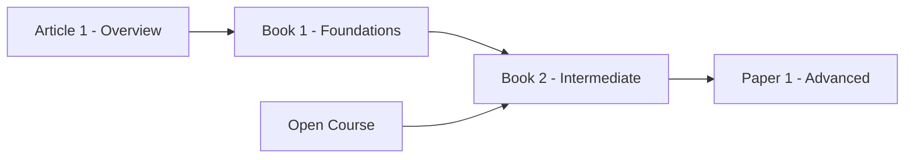

# Annotated Bibliography Template

## Subject: [Topic]
## Compiled: [Date]
## Scope: [Brief description of what this bibliography covers]

---

## Confidence Markers

| Marker | Meaning |
|---|---|
| **[Verified]** | ISBN/URL confirmed via search, metadata cross-checked |
| **[High confidence]** | Multiple sources recommend, metadata consistent |
| **[Moderate confidence]** | Single source, metadata partially verified |
| **[Unverified]** | From training data, not confirmed via search — treat with caution |

---

## Books

### [Title]
- **Author(s):** 
- **Year:** 
- **Publisher:** 
- **ISBN-13:** 
- **Edition:** 
- **Difficulty:** Beginner / Intermediate / Advanced / Expert
- **Time Estimate:** ~X hours
- **Synopsis:** _2-3 sentences: what it covers, why it matters, what makes it good or unique_
- **Prerequisites:** _What the reader should know first_
- **Sourcing:** Purchase (Amazon, publisher) | Library (WorldCat) | Open Access
- **Confidence:** [Verified] / [High confidence] / [Moderate confidence] / [Unverified]
- **Notes:** _Edition recommendations, companion materials, caveats_

---

## Articles & Tutorials

### [Title]
- **Author(s):** 
- **Publication:** _Blog name, magazine, platform_
- **Date:** 
- **URL:** 
- **Difficulty:** 
- **Time Estimate:** ~X minutes
- **Synopsis:** 
- **Prerequisites:** 
- **Confidence:** 
- **Notes:** 

---

## Academic Papers

### [Title]
- **Author(s):** 
- **Year:** 
- **Venue:** _Journal, conference, or preprint server_
- **DOI/URL:** 
- **Citation Count:** _approximate_
- **Difficulty:** 
- **Time Estimate:** ~X hours
- **Synopsis:** 
- **Prerequisites:** 
- **Confidence:** 
- **Notes:** _Key contribution, relationship to other papers in this bibliography_

---

## Open-Access Resources

### [Title]
- **Provider:** _OpenStax, MIT OCW, Khan Academy, etc._
- **URL:** 
- **Format:** Textbook / Video Series / Interactive / MOOC
- **License:** 
- **Difficulty:** 
- **Time Estimate:** ~X hours
- **Synopsis:** 
- **Prerequisites:** 
- **Confidence:** 
- **Notes:** 

---

## Video Courses

### [Title]
- **Instructor:** 
- **Platform:** _YouTube, Coursera, edX, Udemy, etc._
- **URL:** 
- **Duration:** X hours
- **Difficulty:** 
- **Synopsis:** 
- **Prerequisites:** 
- **Cost:** Free / Paid ($X) / Audit available
- **Confidence:** 
- **Notes:** 

---

## Resource Map

_Optional: show how resources relate to each other and to curriculum phases._

---

## Summary Statistics

| Category | Count | Verified | Unverified |
|---|---|---|---|
| Books | | | |
| Articles | | | |
| Papers | | | |
| Open Access | | | |
| Video Courses | | | |
| **Total** | | | |
