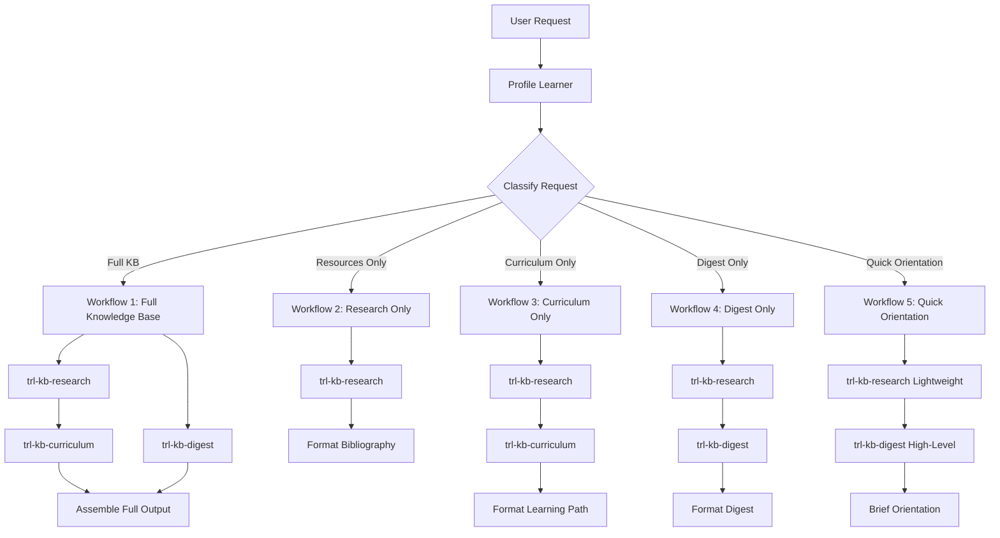
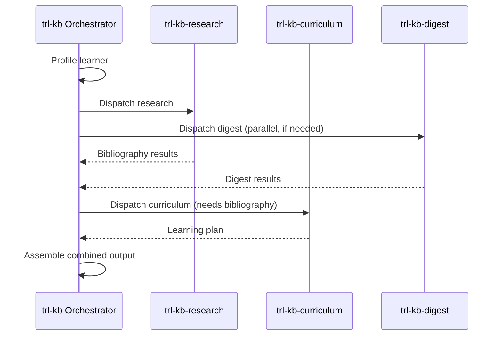
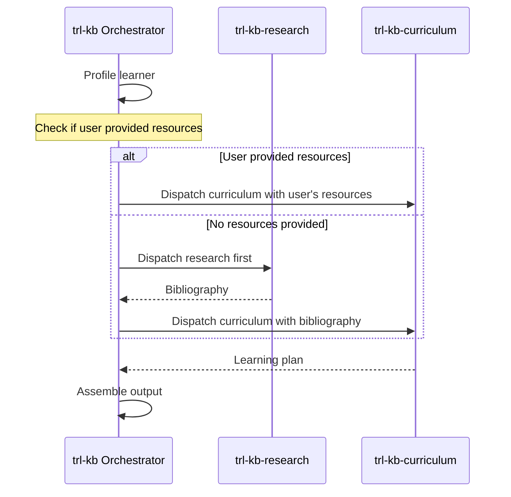
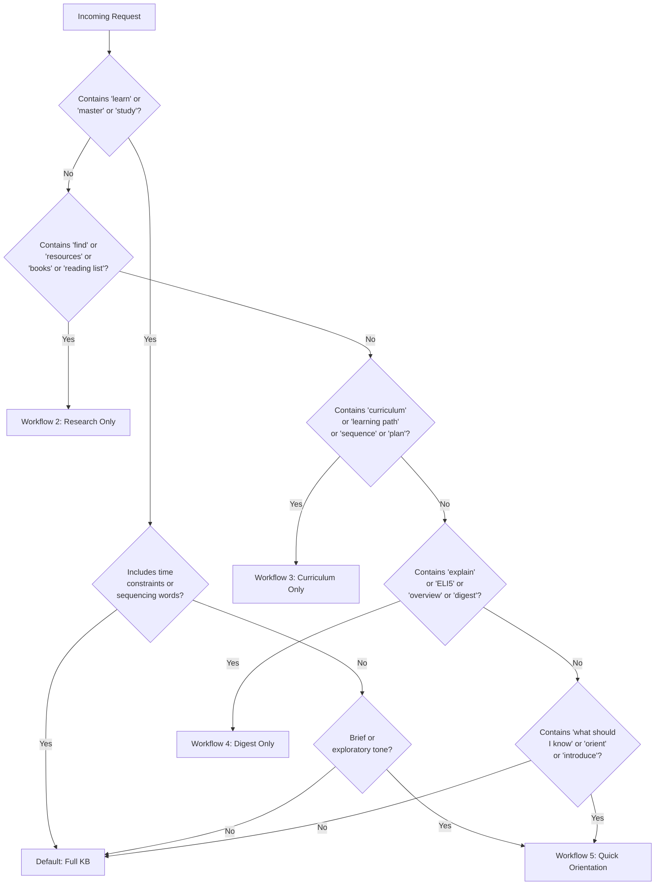

# Agent Playbook: trl-kb Orchestrator

## Role Definition

The `trl-kb` skill operates as a **knowledge base orchestrator**. It does not perform deep research or curriculum design itself. Instead, it:

1. **Profiles** the learner (adaptively, from whatever they provide)
2. **Classifies** the request into one of five workflow types
3. **Dispatches** to `trl-kb-research`, `trl-kb-curriculum`, and/or `trl-kb-digest` sub-skills
4. **Combines** results into cohesive output artifacts
5. **Fills gaps** where sub-skill outputs don't connect cleanly

The orchestrator's value is coordination, not computation. It knows when to dispatch in parallel vs. sequentially, how to pass context between sub-skills, and how to assemble outputs that feel unified rather than stitched together.

---

## Dispatch Architecture



---

## Workflow 1: Full Knowledge Base

**Trigger**: User says "I want to learn X", "build me a knowledge base on X", "help me master X."

**This is the flagship workflow.** It produces the most comprehensive output: a learning plan, annotated bibliography, optional digest, and progress tracker.

### Step-by-Step

#### Step 1: Profile the Learner

Adaptive profiling. Use whatever the user provides, infer the rest. See `references/learner-profiling.md` for the full methodology.

**Minimum viable profile:**
- Subject area (explicit from request)
- Current level (inferred from vocabulary, stated background, or asked)
- Goal (inferred from request context or asked)
- Time constraints (default: flexible)

**Do NOT force a questionnaire.** If the user says "I want to learn calculus," you have enough to start. Infer beginner level, broad scope, general adult learner. Ask at most 1-2 clarifying questions if the request is genuinely ambiguous.

**Profile construction:**
```markdown
## Learner Profile
- **Subject**: [extracted from request]
- **Current Level**: [stated | inferred from vocabulary/background]
- **Goal**: [stated | inferred from request specificity]
- **Background**: [stated | inferred from profession/adjacent skills]
- **Time Constraints**: [stated | default: flexible]
- **Format Preferences**: [stated | default: mixed reading + practice]
- **Depth Target**: [survey | working knowledge | deep expertise | mastery]
```

#### Step 2: Dispatch trl-kb-research (Resource Discovery)

Launch `trl-kb-research` to find resources. Pass the learner profile so it can calibrate difficulty and resource types.

**Dispatch via Agent tool:**
```
Agent(
  subagent_type: "trl-kb-research",
  prompt: "Find learning resources for: [subject]. Learner profile: [profile summary]. Target: [depth]. Return annotated bibliography with ISBNs, difficulty ratings, and time estimates."
)
```

**What trl-kb-research returns:**
- Annotated bibliography (books with ISBNs, articles with URLs, papers, courses)
- Difficulty ratings per resource
- Time estimates per resource
- Prerequisite notes per resource

#### Step 3: Dispatch trl-kb-curriculum (Learning Path Design)

Launch `trl-kb-curriculum` with the research results and learner profile. This step is **sequential** -- it needs trl-kb-research output.

**Dispatch:**
```
Agent(
  subagent_type: "trl-kb-curriculum",
  prompt: "Design a learning path for: [subject]. Learner profile: [profile summary]. Available resources: [bibliography from step 2]. Sequence into phases with milestones, prerequisites, and time estimates."
)
```

**What trl-kb-curriculum returns:**
- Phased learning plan (3-6 phases typically)
- Resource sequencing within each phase
- Milestone definitions (what the learner can do after each phase)
- Prerequisite graph
- Time estimates per phase

#### Step 4: Optionally Dispatch trl-kb-digest (Synthesis)

Launch `trl-kb-digest` **in parallel with trl-kb-curriculum** if the request warrants a conceptual overview. Not every "learn X" request needs a digest -- skip it when the user clearly wants a plan, not an explanation.

**When to include a digest:**
- User is entering a completely unfamiliar domain
- The subject is abstract or theoretical (philosophy, quantum mechanics)
- User explicitly asks for an overview alongside the plan
- The subject has contested or evolving knowledge

**Dispatch:**
```
Agent(
  subagent_type: "trl-kb-digest",
  prompt: "Produce an [complexity level] digest of [subject]. Focus on: what it is, why it matters, key concepts, current state of the field. Target audience: [learner profile summary]."
)
```

#### Step 5: Assemble Combined Output

Combine sub-skill outputs into a unified response. The orchestrator adds:
- A brief introduction connecting the pieces
- Cross-references between the learning plan and bibliography
- A progress tracker derived from the curriculum phases
- Transition text so the output reads as one document, not three stapled together

**Output structure:**
```markdown
# Knowledge Base: [Subject]

## Overview
[Brief orientation -- from digest if available, otherwise 2-3 sentences]

## Your Profile
[Learner profile summary]

## Learning Plan
[From trl-kb-curriculum, with bibliography references inline]

## Annotated Bibliography
[From trl-kb-research, ordered to match the learning plan]

## Progress Tracker
[Generated from learning plan phases]

## Digest: [Subject] in Context
[From trl-kb-digest, if produced]
```

### Parallel vs. Sequential Dispatch



Key insight: **trl-kb-research and trl-kb-digest can run in parallel**, but **trl-kb-curriculum must wait for trl-kb-research** because it needs the bibliography to sequence.

---

## Workflow 2: Research Only

**Trigger**: "Find me resources on X", "what are the best books about X", "build a reading list for X."

### Steps

1. **Profile** (lightweight) -- just subject, level, and optional format preferences
2. **Dispatch trl-kb-research** with the profile
3. **Format** the bibliography output with the orchestrator's standard template
4. No curriculum, no digest

**Dispatch:**
```
Agent(
  subagent_type: "trl-kb-research",
  prompt: "Find [resource types] for: [subject]. Level: [level]. Preferences: [any stated]. Return full annotated bibliography."
)
```

**Output:**
```markdown
# Reading List: [Subject]

## Your Parameters
- Level: [level]
- Focus: [any stated focus]
- Format: [any preferences]

## Annotated Bibliography
[From trl-kb-research]
```

---

## Workflow 3: Curriculum Only

**Trigger**: "Create a learning path for X", "design a 6-month curriculum for X", "how should I sequence learning X?"

### Steps

1. **Profile** (medium depth) -- subject, level, goal, time constraints
2. **Dispatch trl-kb-research** first -- curriculum design needs resources to sequence
3. **Dispatch trl-kb-curriculum** with the bibliography and profile
4. **Assemble** learning plan with embedded bibliography references



**Important**: If the user has already provided their own resource list (e.g., "I already have Stewart's Calculus and MIT OCW -- sequence these for me"), skip trl-kb-research and pass the user's resources directly to trl-kb-curriculum.

**Output:**
```markdown
# Learning Path: [Subject]

## Your Profile
[Summary]

## Curriculum
[From trl-kb-curriculum]

## Resources Referenced
[Bibliography subset used in the curriculum]

## Progress Tracker
[Generated from curriculum phases]
```

---

## Workflow 4: Digest Only

**Trigger**: "Explain X at Y level", "give me an expert-level overview of X", "ELI5 quantum computing", "what's the current state of X?"

### Steps

1. **Profile** (minimal) -- just subject and target complexity level
2. **Optionally dispatch trl-kb-research** -- if the orchestrator needs source material for the digest. Skip if the subject is well within the model's training data and no citations are needed.
3. **Dispatch trl-kb-digest** with complexity level and any research results
4. **Format** the digest output

**When to skip trl-kb-research:**
- Common, well-established topics (basic physics, intro programming, major historical events)
- User explicitly says "just explain, no sources needed"
- ELI5-level requests where citations would be inappropriate

**When to include trl-kb-research:**
- Niche or specialized topics
- User wants citations
- Expert-level digests where accuracy matters
- Topics with recent developments

**Output:**
```markdown
# [Subject]: [Complexity Level] Overview

[Digest from trl-kb-digest]

## Sources
[If trl-kb-research was used]
```

---

## Workflow 5: Quick Orientation

**Trigger**: "What should I know about X?", "give me a quick intro to X", "orient me on X before I dive in."

This is the **lightweight** workflow. It produces a brief, opinionated overview -- not a full knowledge base. Think of it as a 5-minute briefing.

### Steps

1. **No formal profiling** -- assume general audience, working professional level
2. **Dispatch trl-kb-research** with a narrow scope: top 3-5 resources, key references only
3. **Dispatch trl-kb-digest** for a brief, high-level synthesis (500-1000 words)
4. **Combine** into a compact orientation document

**Both dispatches can run in parallel:**
```
# Parallel dispatch
Agent(subagent_type: "trl-kb-research", prompt: "Find the top 3-5 essential resources for someone new to [subject]. Brief annotations only.")
Agent(subagent_type: "trl-kb-digest", prompt: "Produce a brief high-level orientation on [subject]. 500-1000 words. Cover: what it is, why it matters, key concepts, where the field is heading.")
```

**Output:**
```markdown
# Quick Orientation: [Subject]

## What You Need to Know
[Brief digest -- the 5-minute version]

## Where to Start
[Top 3-5 resources with one-line annotations]

## Next Steps
[If they want to go deeper, what workflow to use]
```

---

## Tool Usage Guide

### Agent Tool (Sub-Skill Dispatch)

The primary mechanism for dispatching to sub-skills. Each sub-skill is a separate agent invocation.

```
Agent(
  subagent_type: "trl-kb-research",
  prompt: "[Structured prompt with learner profile and search parameters]"
)
```

**Key principles:**
- Always pass the learner profile in the prompt -- sub-skills need it to calibrate
- Be specific about what output format you need back
- For parallel dispatch, launch multiple Agent calls in the same turn
- Sub-skills return structured output; the orchestrator reformats for the user

### WebSearch Tool (Direct Research)

The orchestrator can use WebSearch directly for quick lookups that don't warrant a full trl-kb-research dispatch.

**Use directly when:**
- Verifying a single ISBN or publication date
- Checking if a specific resource exists or is still available
- Finding the URL for a known resource
- Quick fact-checking during assembly

**Delegate to trl-kb-research when:**
- Comprehensive resource discovery across a domain
- Finding resources with quality assessment and annotations
- Parallel multi-query searches
- Anything requiring more than 2-3 searches

**Usage:**
```
WebSearch(query: "Stewart Calculus 9th edition ISBN")
```

### WebFetch Tool (Page Retrieval)

For retrieving specific pages when you need content from a known URL.

**Use directly when:**
- Fetching a course syllabus to verify curriculum structure
- Reading a book's table of contents from a publisher page
- Checking open-access availability of a resource

**Delegate to trl-kb-research when:**
- Systematic retrieval across multiple sources
- Content analysis requiring pattern matching across pages

**Usage:**
```
WebFetch(url: "https://ocw.mit.edu/courses/18-01-single-variable-calculus/")
```

---

## Request Classification Logic

The orchestrator classifies requests using these heuristics:



**Ambiguous cases**: When the request doesn't clearly map to a workflow, default to Workflow 1 (Full KB) with a note to the user: "I'm building a full knowledge base for you. If you just wanted [alternative], let me know and I'll narrow the scope."

---

## Error Handling

### Sub-Skill Fails to Return Results

If trl-kb-research returns no resources for a topic:
1. Try broadening the search terms (more general subject area)
2. Try adjacent topics that might cover the subject
3. If still empty, inform the user honestly: "I couldn't find verified resources for this specific topic. Here's what I can offer from general knowledge, but I'd recommend [specific search suggestions]."

### Learner Profile is Too Ambiguous

If you truly cannot determine what the user wants:
1. Do NOT guess and produce 2000 words of output
2. Ask 1-2 focused questions: "To build the right plan, it would help to know: (a) your current familiarity with [subject], and (b) what you want to be able to do after learning it."
3. Never ask more than 3 questions before producing some output

### Sub-Skills Return Conflicting Information

If trl-kb-research finds resources at a different difficulty level than what trl-kb-curriculum expects:
1. Trust the learner profile as the ground truth
2. Flag the mismatch in the output: "Note: some advanced resources are included for reference but aren't required for your stated goal."
3. Sequence the core path around the learner's level; list stretch resources separately

---

## Assembly Guidelines

When combining sub-skill outputs into the final response:

1. **Unify voice** -- Sub-skills may use different tones. Edit for consistency.
2. **Cross-reference** -- When the learning plan mentions a resource, ensure it appears in the bibliography with matching details.
3. **De-duplicate** -- If trl-kb-research and trl-kb-digest both mention the same resource, consolidate.
4. **Add connective tissue** -- Brief transitions between sections ("Now that you have the roadmap, here are the resources you'll use...").
5. **Generate the progress tracker** -- This is the orchestrator's job, not a sub-skill's. Derive it from the curriculum phases.
6. **Verify ISBNs are present** -- Every book recommendation must have an ISBN or an explicit [Unverified] marker. This is non-negotiable.
