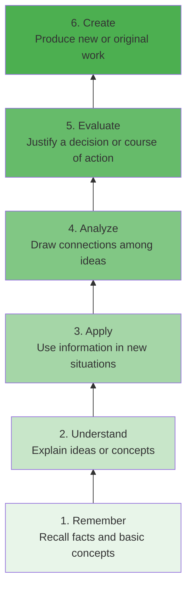
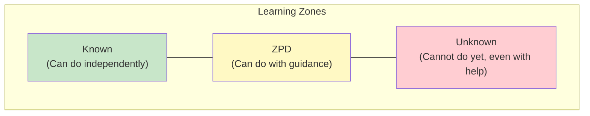
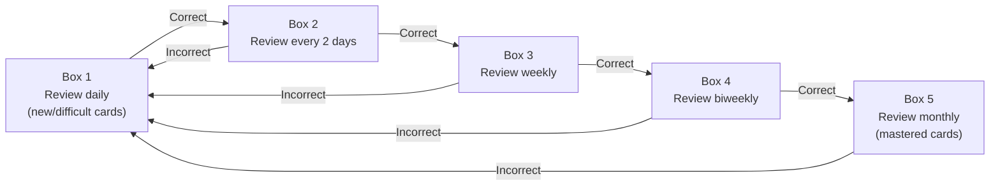
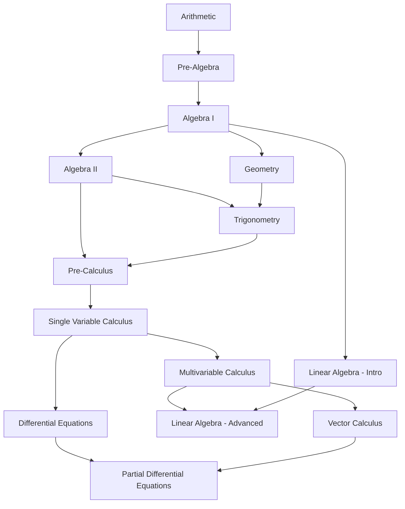
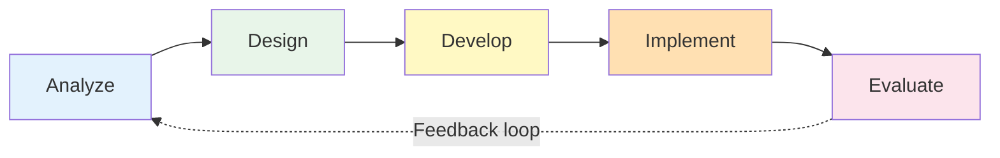
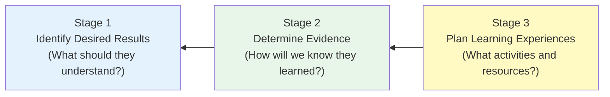
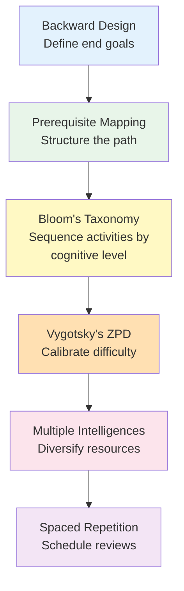

# Pedagogical Frameworks Reference

This document is a practitioner's guide to the learning theories that underpin the `trl-kb` skill's curriculum design, resource selection, and difficulty calibration. It is intended to be self-sufficient -- someone with no background in education theory should be able to read this file and understand how and why these frameworks are applied.

---

## Bloom's Taxonomy (Revised)

### What It Is

Originally published by Benjamin Bloom in 1956 and revised by Anderson and Krathwohl in 2001, Bloom's Taxonomy classifies cognitive processes into six hierarchical levels. Each level represents a more complex form of thinking, and mastery at one level generally supports work at the next.

### The Six Levels

#### Level 1: Remember

**Definition**: Retrieve relevant knowledge from long-term memory.

**Verbs**: define, list, recall, recognize, name, identify, repeat, state

**Example activities**:
- Memorize the periodic table elements
- List the steps of the Krebs cycle
- Recall the dates of major historical events

**Resource types that support this level**:
- Flashcard sets (Anki decks, Quizlet)
- Reference tables and cheat sheets
- Glossaries and term lists
- Introductory textbook chapters (definition sections)

**How trl-kb uses this**: Resources tagged "Beginner" that emphasize terminology and foundational facts map here. These are placed first in learning paths.

#### Level 2: Understand

**Definition**: Construct meaning from instructional messages, including oral, written, and graphic communication.

**Verbs**: explain, describe, summarize, paraphrase, classify, compare, interpret, discuss

**Example activities**:
- Explain why recursion works by tracing a simple example
- Summarize the main argument of a research paper
- Compare and contrast TCP and UDP protocols

**Resource types that support this level**:
- Conceptual explainer articles and videos
- Textbooks (explanatory sections, not just definitions)
- Lecture series with worked examples
- Visual diagrams and animations

**How trl-kb uses this**: Resources that explain "why" rather than just "what." Placed after foundational recall resources in a learning path.

#### Level 3: Apply

**Definition**: Carry out or use a procedure in a given situation.

**Verbs**: use, execute, implement, solve, demonstrate, operate, practice, compute

**Example activities**:
- Solve differential equations using the methods covered in the textbook
- Write a program that implements a sorting algorithm
- Apply statistical tests to a dataset

**Resource types that support this level**:
- Problem sets and exercise collections
- Tutorials with hands-on practice
- Lab manuals and coding challenges
- Textbooks with worked examples and end-of-chapter problems

**How trl-kb uses this**: This is where "doing" begins. Learning paths transition from reading to practice at this level. Exercise-heavy resources are sequenced here.

#### Level 4: Analyze

**Definition**: Break material into constituent parts, determine how parts relate to one another and to an overall structure.

**Verbs**: differentiate, organize, relate, compare, contrast, distinguish, examine, deconstruct, question

**Example activities**:
- Compare the runtime complexity of different sorting algorithms and explain when each is optimal
- Analyze a failed experiment to identify which variables were confounded
- Examine a historical event from multiple perspectives to identify bias

**Resource types that support this level**:
- Case studies
- Research papers (methods and results sections)
- Comparative analyses and review articles
- Advanced textbooks that emphasize trade-offs and design decisions

**How trl-kb uses this**: Resources placed in intermediate-to-advanced phases. Learners ready for analysis have completed the apply phase and can now reason about alternatives.

#### Level 5: Evaluate

**Definition**: Make judgments based on criteria and standards.

**Verbs**: judge, critique, assess, justify, argue, defend, appraise, prioritize, recommend

**Example activities**:
- Evaluate a machine learning model's performance and recommend improvements
- Critique a research methodology and identify weaknesses
- Assess competing architectural approaches for a distributed system

**Resource types that support this level**:
- Peer review exercises
- Critical analysis essays
- Professional standards and best practices guides
- Expert commentary and opinion pieces with substantive argumentation

**How trl-kb uses this**: Advanced phase resources. Learners at this level can assess quality, not just produce work. Learning paths include evaluation activities like "read X and Y, then write a comparison arguing which approach is better for Z."

#### Level 6: Create

**Definition**: Put elements together to form a novel, coherent whole or make an original product.

**Verbs**: design, construct, produce, develop, formulate, compose, invent, plan, author

**Example activities**:
- Design a database schema for a novel application
- Write an original research paper
- Create a machine learning pipeline for a new problem domain

**Resource types that support this level**:
- Project-based courses
- Capstone project guides
- Open-ended challenge sets
- "Build X from scratch" books and tutorials

**How trl-kb uses this**: Final phase of mastery-oriented learning paths. These are culminating activities, not starting points.

### Applying Bloom's in trl-kb

**Default usage**: Most learning paths follow a Bloom's progression. Phase 1 covers Remember/Understand, Phase 2 covers Understand/Apply, Phase 3 covers Apply/Analyze, Phase 4 covers Analyze/Evaluate/Create.

**When to deviate**: Some learners (e.g., experienced professionals learning an adjacent domain) can skip Remember/Understand and start at Apply. The learner profile drives this decision.

---

## Gardner's Theory of Multiple Intelligences

### What It Is

Howard Gardner proposed in 1983 (with subsequent updates) that intelligence is not a single general ability but a set of relatively independent modalities. While debated in cognitive science, the framework is practically useful for diversifying resource types and accommodating different learning preferences.

### The Eight Intelligences

| Intelligence | Description | Learning Activities | Resource Types |
|---|---|---|---|
| **Linguistic** | Sensitivity to spoken and written language, ability to learn languages, capacity to use language to accomplish goals | Reading, writing, debating, storytelling | Books, articles, essays, podcasts with narrative structure |
| **Logical-Mathematical** | Capacity to analyze problems logically, carry out mathematical operations, investigate issues scientifically | Problem-solving, proofs, logical puzzles, coding | Textbooks with proofs, problem sets, algorithm challenges |
| **Spatial** | Potential to recognize and manipulate patterns of space | Diagrams, visualizations, mind maps, spatial reasoning | Video courses, infographics, interactive simulations, architecture references |
| **Musical** | Skill in performance, composition, and appreciation of musical patterns | Rhythm-based mnemonics, audio learning, pattern recognition | Audio courses, musical theory texts, rhythm-based memorization tools |
| **Bodily-Kinesthetic** | Using the body to solve problems or create products | Hands-on labs, physical models, building things | Lab manuals, maker projects, physical manipulatives |
| **Interpersonal** | Capacity to understand intentions, motivations, and desires of others | Group study, teaching others, discussion forums | Study groups, peer review, collaborative projects, forums |
| **Intrapersonal** | Capacity to understand oneself -- one's feelings, fears, motivations | Self-reflection journals, self-paced study, metacognition | Self-study guides, reflective journals, personal project plans |
| **Naturalistic** | Ability to recognize, categorize, and draw upon features of the environment | Classification exercises, field observation, pattern taxonomy | Field guides, observation protocols, taxonomy references |

### Detecting Learner Strengths

The `trl-kb` skill does not administer intelligence tests. Instead, it infers dominant modalities from:

- **Stated preferences**: "I learn best from videos" (spatial), "I prefer reading" (linguistic), "I need to build things to understand them" (bodily-kinesthetic)
- **Profession**: Software engineers tend toward logical-mathematical; designers toward spatial; writers toward linguistic
- **Question style**: Abstract reasoning questions suggest logical-mathematical; "how does this relate to..." suggests interpersonal; "what does this look like?" suggests spatial
- **Stated frustrations**: "I've tried reading textbooks but nothing sticks" may indicate a non-linguistic dominant modality

### How trl-kb Uses This

When building a bibliography, the orchestrator diversifies resource types to cover at least 2-3 modalities:
- Always include **linguistic** resources (books/articles) as the backbone
- Add **spatial** resources (video courses, diagrams) for visual learners
- Add **logical-mathematical** resources (problem sets) for technical domains
- Note where **interpersonal** options exist (study groups, forums, communities)

If the learner explicitly states a preference, weight toward that modality. If no preference is stated, default to linguistic + spatial + logical-mathematical.

---

## Vygotsky's Zone of Proximal Development

### What It Is

Lev Vygotsky (1896-1934) proposed that learning happens most effectively in the zone between what a learner can do independently and what they cannot do even with help. This zone -- the Zone of Proximal Development (ZPD) -- is where instruction should be targeted.

### The Three Zones

| Zone | Description | Learner Experience | Instruction Strategy |
|---|---|---|---|
| **Known** (comfort zone) | Material the learner has already mastered | Boredom, disengagement | Review only; do not spend time here |
| **ZPD** (learning zone) | Material the learner can engage with given appropriate support | Productive struggle, "aha" moments, satisfying difficulty | This is where to teach. Provide scaffolding, worked examples, guided practice |
| **Unknown** (panic zone) | Material beyond current reach, even with help | Frustration, confusion, giving up | Do not teach here yet. Build prerequisites first. |

### Scaffolding

Scaffolding is the support structure that makes ZPD learning possible. In the context of `trl-kb`:

| Scaffold Type | How trl-kb Implements It |
|---|---|
| **Prerequisite sequencing** | Resources ordered so each builds on the last |
| **Worked examples before exercises** | Textbooks with examples placed before problem sets |
| **Graduated difficulty** | Phase 1 resources are simpler than Phase 3 resources |
| **Multiple explanations** | Different resources explaining the same concept different ways |
| **Checkpoint milestones** | "After this phase, you should be able to..." statements |
| **Fallback resources** | "If you're struggling with X, try Y first" annotations |

### Calibrating Difficulty in trl-kb

The orchestrator calibrates difficulty using the learner profile:

1. **Identify the comfort zone boundary** -- what does the learner already know?
2. **Identify the panic zone boundary** -- what is clearly too advanced right now?
3. **Select resources that live in between** -- the ZPD
4. **Sequence from near-comfort to near-panic** -- progressively expanding the ZPD

**Example**: A software engineer learning machine learning:
- **Known**: Programming, basic statistics, linear algebra basics
- **ZPD**: Gradient descent, loss functions, model evaluation, scikit-learn
- **Unknown** (for now): Custom neural architecture design, research-level optimization

The curriculum should start in the ZPD and progressively push the boundary of "known" outward.

---

## Spaced Repetition

### What It Is

Spaced repetition is a learning technique based on the observation that memories decay over time (the "forgetting curve," documented by Hermann Ebbinghaus in 1885) but that reviewing material at strategically increasing intervals strengthens long-term retention.

### The Forgetting Curve

Without review, retention of new material drops roughly as follows:

| Time After Learning | Approximate Retention |
|---|---|
| 20 minutes | ~58% |
| 1 hour | ~44% |
| 1 day | ~33% |
| 1 week | ~25% |
| 1 month | ~21% |

Each review "resets" the curve with a higher baseline and slower decay.

### The Leitner System

A practical implementation of spaced repetition using flashcard boxes:

**How it works**: New cards start in Box 1 (review daily). Correct answers promote a card to the next box (longer interval). Incorrect answers demote a card back to Box 1.

### Review Schedule Recommendations

When spaced repetition is relevant (retention-critical domains), the `trl-kb` skill recommends review schedules:

| Domain Characteristics | Review Schedule |
|---|---|
| Terminology-heavy (medicine, law, languages) | Daily review of new terms, weekly review of older terms |
| Procedure-heavy (mathematics, coding) | Practice problems at increasing intervals: daily, then 3-day, then weekly |
| Conceptual (philosophy, theory) | Re-read summaries at 1-day, 1-week, 1-month intervals |
| Factual (history, geography) | Flashcard system with Leitner intervals |

### When to Recommend Spaced Repetition

- **Always**: Languages, medical terminology, law, any domain with a large vocabulary
- **Often**: Mathematics (formulas), programming (API surfaces, syntax), science (equations, constants)
- **Sometimes**: History (dates and events), engineering (standards and specifications)
- **Rarely**: Creative fields, design, philosophy (where understanding matters more than recall)

---

## Prerequisite Mapping

### What It Is

Prerequisite mapping constructs a directed acyclic graph (DAG) of topic dependencies -- what must be learned before what. This is the structural backbone of curriculum design.

### DAG Construction

### Building the Graph

1. **Identify topics** -- List all topics in the domain at the target granularity
2. **Identify dependencies** -- For each topic, list what must be known first
3. **Construct edges** -- Draw directed edges from prerequisites to dependents
4. **Check for cycles** -- A cycle means the prerequisites are circular (impossible to satisfy). This usually indicates a granularity problem -- break one topic into sub-topics.
5. **Topological sort** -- Order the topics so every topic comes after all its prerequisites. Multiple valid orderings may exist; choose based on learner profile and goal.

### Topological Sorting

Given a DAG, topological sorting produces a linear ordering where for every directed edge (A, B), topic A comes before topic B. The algorithm:

1. Find all nodes with no incoming edges (no prerequisites). These are valid starting points.
2. Remove one such node and add it to the ordering.
3. Remove all edges from that node. This may create new nodes with no incoming edges.
4. Repeat until all nodes are ordered.
5. If nodes remain but all have incoming edges, there is a cycle -- the graph is not a valid DAG.

**Multiple valid orderings**: When several nodes have no incoming edges simultaneously, any can be chosen next. The `trl-kb` skill uses learner goals and difficulty to break ties -- prefer the path most relevant to the learner's stated goal.

### Cycle Detection

Cycles indicate a problem in the prerequisite model. Common causes:
- **Mutual prerequisites**: "You need A to learn B, and B to learn A" -- usually means both share a common foundation C that should be extracted.
- **Granularity mismatch**: "Calculus requires linear algebra, linear algebra requires calculus" -- true at an advanced level, but intro linear algebra does not require calculus. Split into intro/advanced levels.
- **Resolution**: Break one of the cycle's nodes into sub-topics until the cycle dissolves.

---

## ADDIE Model

### What It Is

ADDIE is an instructional design framework developed in the 1970s for the U.S. military and widely adopted in education and corporate training. It provides a systematic process for creating instructional materials.

### The Five Phases

#### Analyze

**Purpose**: Understand the learning context before designing anything.

**Questions to answer**:
- Who is the learner? (Profile)
- What do they already know? (Current level)
- What do they need to learn? (Gap analysis)
- What are the constraints? (Time, format, budget, accessibility)
- What does success look like? (Measurable outcomes)

**How trl-kb implements this**: Learner profiling (see `references/learner-profiling.md`). The orchestrator completes the Analyze phase before dispatching any sub-skills.

#### Design

**Purpose**: Define the learning objectives, assessment strategy, and instructional approach.

**Activities**:
- Write learning objectives (using Bloom's verbs)
- Sequence topics (using prerequisite mapping)
- Select pedagogical approach (lecture, project-based, self-study)
- Define milestones and assessments

**How trl-kb implements this**: trl-kb-curriculum handles Design. It produces phased plans with milestones defined as "after this phase, you should be able to [Bloom's verb] [topic]."

#### Develop

**Purpose**: Create or curate the instructional materials.

**Activities**:
- Select resources (books, articles, courses)
- Create supplementary materials if needed
- Assemble the resource package

**How trl-kb implements this**: trl-kb-research handles Develop. It curates existing resources rather than creating new instructional materials. The output is an annotated bibliography.

#### Implement

**Purpose**: Deliver the instruction to the learner.

**Activities**:
- Present the learning plan
- Provide resources in sequence
- Support the learner through the process

**How trl-kb implements this**: The assembled output (learning plan + bibliography + tracker) is the implementation artifact. The learner self-implements using the plan.

#### Evaluate

**Purpose**: Assess whether the learning was effective and iterate.

**Activities**:
- Formative evaluation: ongoing checks during learning (self-assessment prompts in the progress tracker)
- Summative evaluation: end-of-path assessment ("Can you now [do the thing]?")

**How trl-kb implements this**: Progress tracker includes self-assessment prompts at each milestone. The skill can be re-invoked with an updated learner profile if the first pass didn't work.

---

## Understanding by Design (Backward Design)

### What It Is

Developed by Grant Wiggins and Jay McTighe, Understanding by Design (UbD) -- also called "backward design" -- starts curriculum planning from the end: what should the learner understand and be able to do? Then it works backward to determine what evidence would demonstrate that understanding, and finally what learning activities would produce that evidence.

### The Three Stages

#### Stage 1: Identify Desired Results

**Key questions**:
- What are the big ideas and core processes worth understanding?
- What enduring understandings are desired? (Not just facts, but transferable principles)
- What essential questions will guide inquiry?
- What knowledge and skill will learners acquire?

**Example** (learning calculus for ML):
- **Enduring understanding**: Calculus provides the language for describing how quantities change in relation to each other, which is foundational to optimization -- the core of machine learning.
- **Essential question**: How do we find the minimum of a function, and why does that matter for training models?
- **Knowledge**: Derivatives, gradients, chain rule, integration basics
- **Skill**: Compute derivatives, set up and solve optimization problems

#### Stage 2: Determine Acceptable Evidence

**Key questions**:
- What would convince us the learner truly understands (not just memorized)?
- What performance tasks demonstrate transfer?

**Example**:
- Can derive the gradient of a loss function by hand
- Can explain why gradient descent works using calculus concepts
- Can identify when a function has no minimum (understanding limits of the technique)

#### Stage 3: Plan Learning Experiences

**Key question**: What sequence of activities and resources will equip learners to demonstrate the evidence from Stage 2?

Only now do you select textbooks, design exercises, and sequence topics. The activities are justified by what they help the learner demonstrate.

### How trl-kb Uses Backward Design

Backward design is particularly useful when the learner has a clear goal ("I need to understand X to do Y"). The orchestrator:

1. Extracts the "desired result" from the learner's goal
2. Defines evidence (milestones in the curriculum)
3. Selects resources and activities that build toward those milestones

This contrasts with forward design ("start with Chapter 1 and keep going"), which can waste time on topics irrelevant to the learner's goal.

---

## Framework Selection Guide

Not every framework applies to every situation. Use this guide to select the right combination:

### By Domain Type

| Domain | Primary Framework | Supporting Frameworks |
|---|---|---|
| **Hierarchical** (math, CS, physics) | Prerequisite Mapping | Bloom's, ZPD |
| **Skills-based** (programming, design, writing) | Bloom's (emphasize Apply/Create) | ZPD, Backward Design |
| **Knowledge-dense** (medicine, law, history) | Spaced Repetition | Bloom's (emphasize Remember/Understand), ADDIE |
| **Conceptual** (philosophy, economics, theory) | Backward Design | Bloom's (emphasize Analyze/Evaluate), ZPD |
| **Creative** (art, music, writing) | Multiple Intelligences | ZPD, Bloom's (emphasize Create) |
| **Professional certification** (AWS, PMP, CPA) | ADDIE | Backward Design, Spaced Repetition |

### By Learner Characteristic

| Learner Type | Framework Emphasis |
|---|---|
| **Complete beginner** | Prerequisite Mapping (build from foundations), ZPD (don't overwhelm) |
| **Adjacent expert** (knows related field) | Backward Design (skip to what they need), ZPD (leverage existing knowledge) |
| **Goal-driven** (specific outcome needed) | Backward Design (start from the goal) |
| **Exploratory** (curious, no fixed goal) | Bloom's (natural progression), Multiple Intelligences (diverse resources) |
| **Time-constrained** (deadline-driven) | Backward Design (ruthlessly cut non-essential topics), ADDIE (structured efficiency) |
| **Retention-focused** (needs long-term recall) | Spaced Repetition, Bloom's (ensure deep processing at higher levels) |

### Combined Framework Application

Most real curricula use 2-3 frameworks together:

**Typical flow**:
1. Use **Backward Design** to clarify goals and evidence
2. Use **Prerequisite Mapping** to structure the topic dependency graph
3. Use **Bloom's Taxonomy** to sequence activities within each topic
4. Use **Vygotsky's ZPD** to calibrate difficulty at each step
5. Use **Multiple Intelligences** to diversify resource types
6. Use **Spaced Repetition** to schedule reviews for retention-critical content

Not every step is always needed. A quick reading list uses steps 2-3 at most. A full mastery curriculum uses all six.
