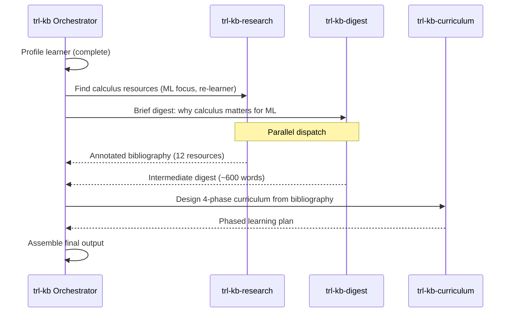

# Worked Example: "I Want to Learn Calculus From Scratch"

This document walks through the complete `trl-kb` skill execution for a real request, showing every step from intake to final output. It serves as both a reference for how the skill operates and a template for the quality of output expected.

---

## The Request

> "I want to learn calculus. I'm a software engineer and I want to understand the math behind machine learning better. I did some calculus in college but that was 10 years ago and I've forgotten most of it."

---

## Step 1: Learner Profiling

### Raw Signals

| Signal | Source | Value |
|---|---|---|
| Subject | Explicit | Calculus |
| Goal | Explicit | Understand math behind ML |
| Background | Explicit | Software engineer |
| Prior exposure | Explicit | College calculus, 10 years ago, mostly forgotten |
| Time constraints | Not stated | Default: flexible |
| Format preferences | Not stated | Default: mixed |
| Budget | Not stated | Default: mixed (free and paid) |

### Inference

- **Current level**: Beginner-to-intermediate. Has seen the material before, which means re-learning will be faster than learning from scratch (the "savings" effect in memory research). But "mostly forgotten" means we shouldn't skip foundations.
- **Adjacent expertise**: Strong in programming, algorithmic thinking, debugging. Comfortable with abstraction. Likely has working knowledge of basic linear algebra (arrays, matrices) from programming even if not from formal math courses.
- **Goal refinement**: "Math behind ML" narrows the scope significantly. Not all of calculus is equally relevant. Multivariable calculus and optimization are critical; complex analysis and differential equations are not (for this goal).
- **Depth target**: Deep enough to understand gradient descent, backpropagation, and loss function optimization. Not research-level measure theory.

### Constructed Profile

```yaml
learner_profile:
  subject: "calculus for machine learning"
  current_level: beginner-intermediate (re-learner)
  goal: understand mathematical foundations of ML (derivatives, gradients, optimization)
  depth_target: deep-expertise (within the ML-relevant subset)
  background: software engineer
  adjacent_expertise:
    - domain: programming
      level: strong
    - domain: algorithmic thinking
      level: strong
    - domain: basic linear algebra (from programming)
      level: moderate
    - domain: college calculus (rusty)
      level: weak
  time_constraints: flexible
  format_preferences: mixed (inferred: likely appreciates code-connected resources)
  budget: mixed
  confidence: good
  confidence_notes: >
    Goal and background are explicit. Level inferred from "forgotten most of it"
    plus 10-year gap. Format preference inferred from profession.
```

---

## Step 2: Request Classification

This is a **Workflow 1: Full Knowledge Base** request:
- "I want to learn" triggers the full workflow
- Clear goal with enough profile information for deep personalization
- No signal to use a lighter workflow

### Dispatch Plan



---

## Step 3: trl-kb-research Results

### Dispatch Prompt

> Find learning resources for calculus, targeted at a software engineer re-learning calculus (last studied 10 years ago) to understand ML math. Include: pre-calculus refreshers, single-variable calculus textbooks, multivariable calculus resources, and ML-math bridge materials. Annotate with ISBNs, difficulty, and time estimates.

### Returned Bibliography

---

#### 1. Calculus: Early Transcendentals
- **Type**: Book
- **Author(s)**: James Stewart
- **ISBN/URL**: 978-1-337-61392-7 [High confidence]
- **Publisher/Platform**: Cengage Learning
- **Edition/Date**: 9th Edition, 2020
- **Difficulty**: Intermediate
- **Time Estimate**: 40-60 hours (Chapters 1-12 for this path; full book is 120+ hours)
- **Synopsis**: The standard university calculus textbook. Clear exposition with extensive problem sets. The "Early Transcendentals" variant introduces exponential and logarithmic functions earlier, which aligns well with ML applications. Excellent for systematic re-learning.
- **Prerequisites**: Pre-calculus (functions, trigonometry basics)
- **Sourcing**: Purchase new (~$100-250), used (~$20-60 for 8th edition), widely available in libraries
- **Notes**: The 8th edition (978-1-285-74155-0) is nearly identical for self-study purposes and dramatically cheaper used. Pair with MIT OCW lectures for reinforcement.

#### 2. Calculus
- **Type**: Book
- **Author(s)**: Michael Spivak
- **ISBN/URL**: 978-0-914098-91-1 [High confidence]
- **Publisher/Platform**: Publish or Perish
- **Edition/Date**: 4th Edition, 2008
- **Difficulty**: Advanced
- **Time Estimate**: 100+ hours
- **Synopsis**: A rigorous, proof-based treatment of single-variable calculus. Develops calculus from first principles with mathematical precision. Beautiful but demanding. Not the primary resource for this learner's goal, but included as the "go deeper" option for those who discover they enjoy the mathematical rigor.
- **Prerequisites**: Comfort with mathematical proof; strong algebra
- **Sourcing**: Purchase (~$60-80), some university libraries
- **Notes**: Skip this unless you complete the primary path and want to understand calculus at a deeper level. Not necessary for ML applications but intellectually rewarding.

#### 3. Calculus Made Easy
- **Type**: Book
- **Author(s)**: Silvanus P. Thompson, Martin Gardner (revision)
- **ISBN/URL**: 978-0-312-18548-0 [High confidence]
- **Publisher/Platform**: St. Martin's Press
- **Edition/Date**: Revised Edition, 1998 (original 1910)
- **Difficulty**: Beginner
- **Time Estimate**: 10-15 hours
- **Synopsis**: A charming, accessible introduction that strips calculus to its intuitive core. Originally published in 1910, revised by Martin Gardner in 1998. Excellent for re-learners who want to rebuild intuition before tackling a full textbook. The opening line -- "What one fool can do, another can" -- sets the tone.
- **Prerequisites**: Basic algebra
- **Sourcing**: Purchase (~$12-15), available in most libraries, public domain versions of the original online
- **Notes**: Use this as a warm-up before Stewart. Can be read in a weekend.

#### 4. Mathematics for Machine Learning
- **Type**: Book
- **Author(s)**: Marc Peter Deisenroth, A. Aldo Faisal, Cheng Soon Ong
- **ISBN/URL**: 978-1-108-47004-9 [High confidence]
- **Publisher/Platform**: Cambridge University Press
- **Edition/Date**: 1st Edition, 2020
- **Difficulty**: Intermediate-Advanced
- **Time Estimate**: 60-80 hours (full book); 20-30 hours (calculus-relevant chapters)
- **Synopsis**: Purpose-built for exactly this learner's goal. Covers linear algebra, analytic geometry, matrix decompositions, vector calculus, probability, and optimization -- all in the context of ML. Chapters 5 (Vector Calculus) and 7 (Continuous Optimization) are directly relevant. Free PDF available from the authors.
- **Prerequisites**: Basic calculus (derivatives, integrals), basic linear algebra
- **Sourcing**: Free PDF at https://mml-book.github.io/ , purchase print (~$45-55)
- **Notes**: This is the bridge resource -- use after rebuilding calculus fundamentals. The free PDF makes it an easy recommendation.

#### 5. MIT OpenCourseWare 18.01: Single Variable Calculus
- **Type**: Open Courseware
- **Author(s)**: David Jerison (lecturer)
- **ISBN/URL**: https://ocw.mit.edu/courses/18-01sc-single-variable-calculus-fall-2010/
- **Difficulty**: Intermediate
- **Time Estimate**: 30-40 hours (video lectures + problem sets)
- **Synopsis**: Complete MIT calculus course with video lectures, lecture notes, problem sets with solutions, and exams. The "Scholar" version includes additional study materials. Excellent video complement to Stewart's textbook.
- **Prerequisites**: Pre-calculus
- **Sourcing**: Free (MIT OCW)
- **Notes**: Watch lectures for topics where the textbook isn't clicking. Problem sets are excellent for practice.

#### 6. MIT OpenCourseWare 18.02: Multivariable Calculus
- **Type**: Open Courseware
- **Author(s)**: Denis Auroux (lecturer)
- **ISBN/URL**: https://ocw.mit.edu/courses/18-02sc-multivariable-calculus-fall-2010/
- **Difficulty**: Intermediate-Advanced
- **Time Estimate**: 30-40 hours
- **Synopsis**: Extends single-variable calculus to multiple dimensions. Covers partial derivatives, gradients, multiple integrals, and vector calculus. Directly relevant to understanding gradient descent in high-dimensional parameter spaces.
- **Prerequisites**: Single variable calculus
- **Sourcing**: Free (MIT OCW)
- **Notes**: Focus on partial derivatives, gradients, and the chain rule in multiple dimensions. The vector calculus material (line integrals, surface integrals) is less critical for ML.

#### 7. 3Blue1Brown: Essence of Calculus
- **Type**: Video Course
- **Author(s)**: Grant Sanderson
- **ISBN/URL**: https://www.3blue1brown.com/topics/calculus
- **Difficulty**: Beginner-Intermediate
- **Time Estimate**: 3-4 hours
- **Synopsis**: A 12-video series that builds visual intuition for calculus from the ground up. Uses exceptional animations to show what derivatives and integrals mean geometrically. Does not replace a textbook for technique, but transforms understanding of what the techniques mean.
- **Prerequisites**: Basic algebra
- **Sourcing**: Free (YouTube)
- **Notes**: Watch this first, before or alongside *Calculus Made Easy*. It takes 3 hours and will reactivate dormant intuition.

#### 8. 3Blue1Brown: Essence of Linear Algebra
- **Type**: Video Course
- **Author(s)**: Grant Sanderson
- **ISBN/URL**: https://www.3blue1brown.com/topics/linear-algebra
- **Difficulty**: Beginner-Intermediate
- **Time Estimate**: 3-4 hours
- **Synopsis**: Visual introduction to linear algebra -- vectors, matrices, transformations, eigenvalues. Builds the geometric intuition that makes multivariable calculus and ML math click. Included because linear algebra and multivariable calculus are deeply intertwined.
- **Prerequisites**: Basic algebra
- **Sourcing**: Free (YouTube)
- **Notes**: Watch before starting multivariable calculus. Essential visual foundation.

#### 9. The Matrix Calculus You Need for Deep Learning
- **Type**: Paper/Article
- **Author(s)**: Terence Parr, Jeremy Howard
- **ISBN/URL**: https://arxiv.org/abs/1802.01528
- **Difficulty**: Intermediate-Advanced
- **Time Estimate**: 4-6 hours
- **Synopsis**: A focused paper that covers exactly the matrix calculus needed for deep learning -- Jacobians, the chain rule for vector-valued functions, and backpropagation derivation. Written for programmers, not mathematicians. Bridges the gap between "I know calculus" and "I can derive backpropagation."
- **Prerequisites**: Single variable calculus, basic linear algebra
- **Sourcing**: Free (arXiv)
- **Notes**: Read this after Phase 3 (multivariable calculus). It's the capstone that connects calculus to ML.

#### 10. Khan Academy: Pre-Calculus and Calculus
- **Type**: Interactive Course
- **Author(s)**: Khan Academy
- **ISBN/URL**: https://www.khanacademy.org/math/calculus-1
- **Difficulty**: Beginner
- **Time Estimate**: Variable (use as supplement, not primary)
- **Synopsis**: Bite-sized video lessons with interactive exercises. Useful for filling specific gaps rather than end-to-end study. The pre-calculus section is particularly useful for refreshing rusty foundations.
- **Prerequisites**: Basic algebra
- **Sourcing**: Free
- **Notes**: Use for targeted remediation. If you're stuck on a specific topic in Stewart, Khan Academy probably has a 10-minute video on it.

#### 11. Deep Learning
- **Type**: Book
- **Author(s)**: Ian Goodfellow, Yoshua Bengio, Aaron Courville
- **ISBN/URL**: 978-0-262-03561-3 [High confidence]
- **Publisher/Platform**: MIT Press
- **Edition/Date**: 1st Edition, 2016
- **Difficulty**: Advanced
- **Time Estimate**: 10-15 hours (Part I: Applied Math and Machine Learning Basics only)
- **Synopsis**: The standard deep learning textbook. Part I (Chapters 2-5) provides a self-contained review of the math needed for deep learning: linear algebra, probability, numerical computation, and machine learning basics. Useful as a final validation that your calculus skills are sufficient for ML.
- **Prerequisites**: Calculus, linear algebra, basic probability
- **Sourcing**: Free online at https://www.deeplearningbook.org/ , purchase print (~$60)
- **Notes**: Only Part I is relevant for this learning path. Read it after completing the calculus curriculum to verify readiness.

#### 12. Pre-Calculus (Stewart, Redlin, Watson)
- **Type**: Book
- **Author(s)**: James Stewart, Lothar Redlin, Saleem Watson
- **ISBN/URL**: 978-1-305-07175-9 [Moderate]
- **Publisher/Platform**: Cengage Learning
- **Edition/Date**: 7th Edition, 2015
- **Difficulty**: Beginner
- **Time Estimate**: 15-20 hours (targeted review, not cover-to-cover)
- **Synopsis**: Comprehensive pre-calculus review. For a re-learner, the key chapters are functions (Ch. 2), polynomial/rational functions (Ch. 3), and trigonometric functions (Ch. 5-6). Not needed cover-to-cover -- use for targeted gap-filling.
- **Prerequisites**: Basic algebra
- **Sourcing**: Purchase used (~$15-30), widely available in libraries
- **Notes**: Only needed if the Phase 1 diagnostic reveals significant pre-calculus gaps. Many re-learners can skip this entirely and use Khan Academy for spot remediation instead.

---

## Step 4: trl-kb-curriculum Results

### Dispatch Prompt

> Design a learning path for calculus, targeted at ML understanding. Learner: software engineer, rusty college calculus (10 years ago). Available resources: [bibliography from Step 3]. Create 4 phases: pre-calc review, single variable, multivariable, ML applications. Include milestones and time estimates.

### Returned Curriculum

---

## Learning Plan: Calculus for Machine Learning

**Learner**: Software engineer, re-learner (college calculus 10 years ago)
**Goal**: Understand the mathematical foundations of machine learning -- derivatives, gradients, optimization, backpropagation
**Estimated Duration**: 100-160 hours (10-16 weeks at 10 hrs/week, or 25-40 weeks at 4 hrs/week)
**Depth**: Deep expertise within the ML-relevant subset of calculus

---

### Phase 1: Reactivation and Pre-Calculus Review
**Duration**: 10-20 hours (1-2 weeks at 10 hrs/week)
**Objective**: After this phase, you will be able to *recall* core pre-calculus concepts (functions, trigonometry, algebraic manipulation) and *explain* what derivatives and integrals mean intuitively.

#### Topics
1. Functions -- domain, range, composition, inverse functions
2. Algebraic manipulation -- factoring, rational expressions, exponent rules
3. Trigonometric functions -- unit circle, basic identities, graphs
4. Intuitive calculus overview -- what derivatives and integrals mean geometrically

#### Resources
- **3Blue1Brown: Essence of Calculus** -- 3-4 hours
  - Watch the full series. This reactivates geometric intuition for what calculus is about.
- **Calculus Made Easy** by Thompson/Gardner -- 10-15 hours
  - Read cover to cover. It's short and rebuilds intuition for differentiation and integration.
- **Khan Academy: Pre-Calculus** -- as needed (2-5 hours for targeted review)
  - Use only for specific gaps. If you can solve the problems in *Calculus Made Easy* without trouble, skip Khan Academy.
- **Pre-Calculus** by Stewart, Redlin, Watson -- reference only
  - Consult Chapters 2 and 5-6 only if you discover significant gaps during this phase.

#### Milestone Check
- [ ] Can you sketch the graph of f(x) = sin(x), e^x, and ln(x) from memory?
- [ ] Can you explain in plain English what a derivative represents? What an integral represents?
- [ ] Can you factor a quadratic and solve basic algebraic equations fluently?

#### Diagnostic
If you struggle significantly with the algebra in *Calculus Made Easy*, spend more time with Khan Academy's pre-calculus section before moving to Phase 2. If it comes back quickly ("oh right, I remember this"), move on.

---

### Phase 2: Single Variable Calculus
**Duration**: 40-60 hours (4-6 weeks at 10 hrs/week)
**Prerequisites**: Phase 1 complete
**Objective**: After this phase, you will be able to *apply* differentiation and integration techniques to solve standard problems and *analyze* the behavior of functions using calculus tools.

#### Topics
1. Limits and continuity -- epsilon-delta definition (light), limit computation, squeeze theorem
2. Derivatives -- definition, power rule, product/quotient rule, chain rule
3. Applications of derivatives -- optimization, related rates, L'Hopital's rule, curve sketching
4. Integrals -- Riemann sums, Fundamental Theorem of Calculus, basic techniques
5. Integration techniques -- substitution, integration by parts
6. Applications of integrals -- area, volume (light)

#### Resources
- **Calculus: Early Transcendentals** by Stewart -- 30-40 hours
  - Chapters 2-7. Work the odd-numbered exercises (answers in back). Focus especially on: Chapter 3 (derivatives), Chapter 4 (applications), Chapter 5 (integrals).
- **MIT OCW 18.01: Single Variable Calculus** -- 15-20 hours
  - Watch lectures for topics where Stewart is unclear. Do at least 3 problem sets.

#### Milestone Check
- [ ] Can you differentiate f(x) = e^(3x^2) using the chain rule?
- [ ] Can you find the minimum of f(x) = x^2 + 4/x on (0, infinity)?
- [ ] Can you evaluate the integral of x*e^x dx using integration by parts?
- [ ] Can you explain the Fundamental Theorem of Calculus in your own words?

#### If You're Struggling
- Review the relevant 3Blue1Brown video for visual intuition
- Khan Academy has targeted exercises for each derivative/integral rule
- Stewart Chapter 1 (Functions and Models) is a lighter on-ramp if Chapter 2 feels too steep

---

### Phase 3: Multivariable Calculus and Linear Algebra Bridge
**Duration**: 30-50 hours (3-5 weeks at 10 hrs/week)
**Prerequisites**: Phase 2 complete
**Objective**: After this phase, you will be able to *apply* partial derivatives and gradients to multivariable functions and *analyze* optimization problems in multiple dimensions.

#### Topics
1. Vectors and vector functions (review/bridge from linear algebra)
2. Partial derivatives -- definition, computation, geometric meaning
3. The gradient -- direction of steepest ascent, gradient fields
4. The chain rule in multiple dimensions -- critical for backpropagation
5. Optimization -- critical points, second derivative test, Lagrange multipliers (light)
6. Multiple integrals (light -- conceptual understanding, not heavy computation)

#### Resources
- **3Blue1Brown: Essence of Linear Algebra** -- 3-4 hours
  - Watch before starting multivariable calculus. Builds the visual foundation for vectors, matrices, and transformations.
- **Calculus: Early Transcendentals** by Stewart -- 15-20 hours
  - Chapters 14-15 (Partial Derivatives, Multiple Integrals). Focus on 14.1-14.8 (partial derivatives through Lagrange multipliers). Chapter 15 can be light -- conceptual understanding of multiple integrals is sufficient.
- **MIT OCW 18.02: Multivariable Calculus** -- 15-20 hours
  - Focus on: partial derivatives, gradients, chain rule, optimization. Skip Green's/Stokes' theorems (not needed for ML).
- **Mathematics for Machine Learning** by Deisenroth et al. -- 10-15 hours
  - Chapter 5 (Vector Calculus). Read this alongside or after Stewart/MIT OCW to see how the math connects to ML.

#### Milestone Check
- [ ] Can you compute the gradient of f(x, y) = x^2*y + e^(xy)?
- [ ] Can you explain what the gradient tells you about the direction of steepest ascent?
- [ ] Can you apply the chain rule to a composition of multivariate functions?
- [ ] Can you find and classify the critical points of a function of two variables?

---

### Phase 4: ML Applications and Synthesis
**Duration**: 20-30 hours (2-3 weeks at 10 hrs/week)
**Prerequisites**: Phase 3 complete
**Objective**: After this phase, you will be able to *evaluate* how calculus concepts underpin ML algorithms and *create* mathematical derivations for gradient descent, backpropagation, and loss function optimization.

#### Topics
1. Gradient descent -- the algorithm, learning rate, convergence
2. Loss functions -- MSE, cross-entropy, their derivatives
3. Backpropagation -- chain rule applied to computation graphs
4. Matrix calculus -- Jacobians, the chain rule for vector-valued functions
5. Regularization -- L1/L2 as calculus-based constraints
6. Validation -- reading ML papers that use calculus notation

#### Resources
- **Mathematics for Machine Learning** by Deisenroth et al. -- 10-15 hours
  - Chapter 7 (Continuous Optimization). This is the payoff chapter -- optimization theory applied to ML.
- **The Matrix Calculus You Need for Deep Learning** by Parr and Howard -- 4-6 hours
  - Read end to end. This is the bridge from "I know calculus" to "I can derive backpropagation."
- **Deep Learning** by Goodfellow, Bengio, Courville -- 10-15 hours
  - Part I only (Chapters 2-5). Read as a validation: can you follow the math? If yes, you've achieved the goal.

#### Milestone Check
- [ ] Can you derive the gradient descent update rule for linear regression from scratch?
- [ ] Can you trace backpropagation through a simple 2-layer network by hand?
- [ ] Can you read a machine learning paper and follow the calculus notation without getting lost?
- [ ] Can you explain why gradient descent converges (or doesn't) for convex vs. non-convex functions?

#### Completion Assessment
If you can answer "yes" to all four milestones, you have achieved the stated goal: understanding the math behind machine learning. You can now read ML papers, understand training algorithms at a mathematical level, and reason about optimization.

---

### Summary Timeline

| Phase | Duration | Key Outcome |
|---|---|---|
| Phase 1: Reactivation | 10-20 hours | Intuition rebuilt, pre-calc gaps filled |
| Phase 2: Single Variable | 40-60 hours | Can differentiate, integrate, and optimize |
| Phase 3: Multivariable | 30-50 hours | Can work with gradients and partial derivatives |
| Phase 4: ML Applications | 20-30 hours | Can derive and understand ML math |
| **Total** | **100-160 hours** | **Fluent in the calculus of machine learning** |

---

## Step 5: trl-kb-digest Results

### Dispatch Prompt

> Produce an intermediate-level digest explaining why calculus matters for machine learning. Target audience: software engineer who knows ML practically but not mathematically. 500-800 words.

### Returned Digest

---

## Why Calculus Matters for Machine Learning

If you've trained a machine learning model, you've used calculus -- you just didn't see it. Every time a neural network "learns," it's performing an optimization procedure that's fundamentally calculus in action.

### The Core Connection: Optimization

Machine learning is, at its mathematical heart, an optimization problem. You have a model with parameters (weights). You have data. You have a loss function that measures how wrong the model is. Training means finding the parameters that minimize the loss function.

Minimizing a function is exactly what calculus was invented for. When you take the derivative of a function and set it to zero, you find its extrema -- the points where it stops increasing and starts decreasing (or vice versa). That's the mathematical core of "training."

### Gradient Descent: Derivatives in Action

In practice, ML models have millions of parameters. You can't solve for the minimum analytically (by setting the derivative to zero and solving algebraically). Instead, you use gradient descent: start somewhere, compute the gradient (the multi-dimensional derivative), and take a small step in the direction that decreases the loss.

The gradient tells you two things: which direction is "downhill" (the direction of steepest descent) and how steep the hill is (which informs how big a step to take). Without calculus, you'd have no way to compute this -- you'd be wandering blindly in a million-dimensional space.

### The Chain Rule: Why Backpropagation Works

A neural network is a composition of functions: layer 1 feeds into layer 2, which feeds into layer 3. To compute how the loss changes when you adjust a weight in layer 1, you need the chain rule -- the calculus rule for differentiating composed functions.

Backpropagation is literally the chain rule applied systematically from the output layer back to the input layer. When people say "backprop," they mean "the chain rule, implemented efficiently as a computation graph traversal." Understanding the chain rule for multivariate functions is understanding backpropagation.

### What You Gain

Knowing the calculus behind ML transforms you from a user of ML libraries into someone who can:
- **Debug training failures** -- When loss isn't decreasing, is it a vanishing gradient problem? An exploding gradient? Calculus gives you the vocabulary and the diagnostic tools.
- **Read research papers** -- ML papers are written in the language of calculus. Gradients, Jacobians, Hessians, divergences -- these stop being intimidating symbols and become meaningful tools.
- **Design custom loss functions** -- You need to know whether your loss function is differentiable, convex, and well-behaved. Calculus tells you.
- **Understand optimization algorithms** -- Adam, RMSProp, SGD with momentum -- these are all variations on gradient descent with specific calculus-based modifications. Understanding the math reveals why one works better than another for a given problem.

### What You Don't Need

You don't need all of calculus. Complex analysis, differential geometry, and measure theory are beautiful mathematics, but they're not required for understanding ML. The core toolkit is:
1. **Derivatives** (single variable) -- rates of change
2. **Partial derivatives** (multivariable) -- rates of change in each direction
3. **The gradient** -- all partial derivatives packaged as a vector
4. **The chain rule** (multivariable) -- derivatives of composed functions
5. **Basic optimization** -- finding minima, convexity, gradient descent

That's what this learning path focuses on.

---

## Step 6: Assembled Output

This is the complete output the user would receive.

---

# Knowledge Base: Calculus for Machine Learning

## Your Profile

You're a software engineer re-learning calculus after a 10-year gap, with the specific goal of understanding the mathematics behind machine learning. Your programming background means you can skip some foundations (basic logic, algorithmic thinking) and benefit from resources that connect math to code. Your prior calculus exposure means re-learning will be faster than learning from scratch -- the concepts are dormant, not absent.

## Why This Matters

Machine learning is an optimization problem, and optimization is calculus. Every time a model trains, it computes gradients (multi-dimensional derivatives) and follows them downhill to minimize a loss function. Backpropagation -- the algorithm that makes deep learning work -- is the chain rule applied to a computation graph. Understanding this math transforms you from an ML library user into someone who can debug training, read research papers, and design custom solutions. The full digest is included at the end of this document.

## Learning Plan

### Phase 1: Reactivation and Pre-Calculus Review
**Duration**: 10-20 hours (1-2 weeks at 10 hrs/week)
**Objective**: Rebuild intuition for what derivatives and integrals mean, fill any pre-calculus gaps.

**Topics**: Functions, algebraic manipulation, trigonometric functions, intuitive calculus overview.

**Resources**:
1. **3Blue1Brown: Essence of Calculus** (3-4 hours, free) -- Watch the full series to reactivate geometric intuition.
2. **Calculus Made Easy** by Thompson/Gardner (10-15 hours, ~$12) -- Read cover to cover. Rebuilds intuition before formal technique.
3. **Khan Academy: Pre-Calculus** (as needed, free) -- Targeted gap-filling only.

**Milestone**: Can you sketch basic functions from memory, explain derivatives/integrals in plain English, and handle algebra fluently?

---

### Phase 2: Single Variable Calculus
**Duration**: 40-60 hours (4-6 weeks at 10 hrs/week)
**Objective**: Apply differentiation and integration techniques to standard problems.

**Topics**: Limits, derivatives (all rules), applications of derivatives (optimization, L'Hopital's), integrals (FTC, substitution, integration by parts).

**Resources**:
1. **Calculus: Early Transcendentals** by Stewart, 9th Ed. (30-40 hours, ~$20-250) -- Chapters 2-7. Work odd-numbered exercises.
2. **MIT OCW 18.01** (15-20 hours, free) -- Video lectures and problem sets. Use for reinforcement.

**Milestone**: Can you differentiate e^(3x^2) using the chain rule, find the minimum of a function, evaluate integrals with standard techniques, and explain the Fundamental Theorem?

---

### Phase 3: Multivariable Calculus and Linear Algebra Bridge
**Duration**: 30-50 hours (3-5 weeks at 10 hrs/week)
**Objective**: Work with partial derivatives, gradients, and multivariable optimization.

**Topics**: Vectors (review), partial derivatives, gradients, multivariable chain rule, optimization in multiple dimensions.

**Resources**:
1. **3Blue1Brown: Essence of Linear Algebra** (3-4 hours, free) -- Visual foundation for vectors and matrices.
2. **Stewart: Early Transcendentals** Chapters 14-15 (15-20 hours) -- Partial derivatives through Lagrange multipliers.
3. **MIT OCW 18.02** (15-20 hours, free) -- Focus on gradients, chain rule, optimization.
4. **Mathematics for Machine Learning** by Deisenroth et al., Chapter 5 (10-15 hours, free PDF) -- Vector calculus in ML context.

**Milestone**: Can you compute a gradient, explain the direction of steepest ascent, apply the multivariable chain rule, and classify critical points?

---

### Phase 4: ML Applications and Synthesis
**Duration**: 20-30 hours (2-3 weeks at 10 hrs/week)
**Objective**: Derive and understand gradient descent, backpropagation, and loss function optimization.

**Topics**: Gradient descent, loss functions and their derivatives, backpropagation (chain rule on computation graphs), matrix calculus (Jacobians), regularization.

**Resources**:
1. **Mathematics for Machine Learning** by Deisenroth et al., Chapter 7 (10-15 hours, free PDF) -- Continuous optimization applied to ML.
2. **The Matrix Calculus You Need for Deep Learning** by Parr & Howard (4-6 hours, free on arXiv) -- Bridges calculus to backpropagation.
3. **Deep Learning** by Goodfellow, Bengio, Courville, Part I (10-15 hours, free online) -- Validation: can you follow the math?

**Milestone**: Can you derive gradient descent for linear regression, trace backpropagation by hand, read ML papers fluently, and explain convergence conditions?

---

### Summary

| Phase | Hours | Outcome |
|---|---|---|
| 1: Reactivation | 10-20 | Intuition rebuilt |
| 2: Single Variable | 40-60 | Differentiation and integration |
| 3: Multivariable | 30-50 | Gradients and partial derivatives |
| 4: ML Applications | 20-30 | Can derive and understand ML math |
| **Total** | **100-160** | **Fluent in the calculus of machine learning** |

---

## Annotated Bibliography

### Books

#### Calculus Made Easy
- **Author(s)**: Silvanus P. Thompson, Martin Gardner (revision)
- **ISBN**: 978-0-312-18548-0 [High confidence]
- **Difficulty**: Beginner | **Time**: 10-15 hours
- **Synopsis**: Charming, intuitive introduction to calculus. Strips the subject to its core without sacrificing correctness. Ideal for re-learners rebuilding intuition. Originally published 1910, revised 1998.
- **Sourcing**: Purchase (~$12), libraries, public domain versions of original online

#### Calculus: Early Transcendentals
- **Author(s)**: James Stewart
- **ISBN**: 978-1-337-61392-7 [High confidence]
- **Difficulty**: Intermediate | **Time**: 40-60 hours (Chapters 1-15)
- **Synopsis**: Standard university textbook. Clear exposition, extensive problem sets, strong for systematic study. The "Early Transcendentals" variant is preferred for applied paths.
- **Sourcing**: New (~$100-250), used 8th edition (~$20, ISBN: 978-1-285-74155-0), libraries

#### Mathematics for Machine Learning
- **Author(s)**: Marc Peter Deisenroth, A. Aldo Faisal, Cheng Soon Ong
- **ISBN**: 978-1-108-47004-9 [High confidence]
- **Difficulty**: Intermediate-Advanced | **Time**: 20-30 hours (relevant chapters)
- **Synopsis**: Purpose-built bridge between math and ML. Chapters 5 and 7 directly connect calculus to machine learning. Free PDF from authors.
- **Sourcing**: Free PDF at https://mml-book.github.io/ , print ~$45-55

#### Deep Learning
- **Author(s)**: Ian Goodfellow, Yoshua Bengio, Aaron Courville
- **ISBN**: 978-0-262-03561-3 [High confidence]
- **Difficulty**: Advanced | **Time**: 10-15 hours (Part I only)
- **Synopsis**: The standard deep learning textbook. Part I provides a self-contained math review. Use as final validation of your calculus readiness.
- **Sourcing**: Free at https://www.deeplearningbook.org/ , print ~$60

#### Calculus (Spivak)
- **Author(s)**: Michael Spivak
- **ISBN**: 978-0-914098-91-1 [High confidence]
- **Difficulty**: Advanced | **Time**: 100+ hours
- **Synopsis**: Rigorous, proof-based treatment. Not required for ML, but the definitive "go deeper" option for those who discover they enjoy mathematical rigor.
- **Sourcing**: Purchase (~$60-80), some university libraries

#### Pre-Calculus
- **Author(s)**: James Stewart, Lothar Redlin, Saleem Watson
- **ISBN**: 978-1-305-07175-9 [Moderate]
- **Difficulty**: Beginner | **Time**: 15-20 hours (targeted review)
- **Synopsis**: Comprehensive pre-calculus reference. Use only if Phase 1 reveals significant gaps.
- **Sourcing**: Used (~$15-30), libraries

### Video and Online Resources

#### 3Blue1Brown: Essence of Calculus
- **URL**: https://www.3blue1brown.com/topics/calculus
- **Difficulty**: Beginner-Intermediate | **Time**: 3-4 hours
- **Synopsis**: Exceptional visual animations that build geometric intuition for calculus. Watch before or alongside textbook study.

#### 3Blue1Brown: Essence of Linear Algebra
- **URL**: https://www.3blue1brown.com/topics/linear-algebra
- **Difficulty**: Beginner-Intermediate | **Time**: 3-4 hours
- **Synopsis**: Visual introduction to linear algebra. Essential foundation for multivariable calculus and ML math.

#### MIT OCW 18.01: Single Variable Calculus
- **URL**: https://ocw.mit.edu/courses/18-01sc-single-variable-calculus-fall-2010/
- **Difficulty**: Intermediate | **Time**: 30-40 hours
- **Synopsis**: Full MIT course with lectures, notes, problem sets, and exams. Excellent video complement to Stewart.

#### MIT OCW 18.02: Multivariable Calculus
- **URL**: https://ocw.mit.edu/courses/18-02sc-multivariable-calculus-fall-2010/
- **Difficulty**: Intermediate-Advanced | **Time**: 30-40 hours
- **Synopsis**: Extends to partial derivatives, gradients, and multiple integrals. Focus on gradient-related material for ML.

### Papers and Articles

#### The Matrix Calculus You Need for Deep Learning
- **Authors**: Terence Parr, Jeremy Howard
- **URL**: https://arxiv.org/abs/1802.01528
- **Difficulty**: Intermediate-Advanced | **Time**: 4-6 hours
- **Synopsis**: Focused treatment of exactly the matrix calculus needed for deep learning. Written for programmers. The capstone bridge resource.

#### Khan Academy: Calculus
- **URL**: https://www.khanacademy.org/math/calculus-1
- **Difficulty**: Beginner | **Time**: Variable
- **Synopsis**: Bite-sized lessons with interactive exercises. Use for targeted remediation, not primary study.

---

## Progress Tracker

**Started**: ________
**Target Completion**: ________

### Phase 1: Reactivation (10-20 hours)
- [ ] 3Blue1Brown: Essence of Calculus (12 videos)
- [ ] *Calculus Made Easy* -- complete
- [ ] Khan Academy pre-calc review (if needed)
- [ ] **Milestone**: Sketch basic functions, explain derivatives/integrals in plain English

### Phase 2: Single Variable Calculus (40-60 hours)
- [ ] Stewart Chapters 2-3 (Limits + Derivatives)
- [ ] Stewart Chapter 4 (Applications of Derivatives)
- [ ] Stewart Chapter 5 (Integrals)
- [ ] Stewart Chapters 6-7 (Applications + Techniques)
- [ ] MIT OCW 18.01 -- at least 3 problem sets
- [ ] **Milestone**: Chain rule, optimization, integration, explain FTC

### Phase 3: Multivariable (30-50 hours)
- [ ] 3Blue1Brown: Essence of Linear Algebra
- [ ] Stewart Chapter 14 (Partial Derivatives)
- [ ] Stewart Chapter 15 (Multiple Integrals -- light)
- [ ] MIT OCW 18.02 -- gradients and chain rule sections
- [ ] MML Chapter 5 (Vector Calculus)
- [ ] **Milestone**: Compute gradients, apply multivariable chain rule

### Phase 4: ML Applications (20-30 hours)
- [ ] MML Chapter 7 (Continuous Optimization)
- [ ] Parr & Howard: Matrix Calculus for Deep Learning
- [ ] Goodfellow et al.: Deep Learning, Part I
- [ ] **Milestone**: Derive gradient descent, trace backprop by hand, read ML papers

### Completion
- [ ] All phases complete
- [ ] Can derive gradient descent for linear regression from scratch
- [ ] Can read an ML paper and follow the calculus without getting lost
- [ ] Confidence: ___/5

---

## Digest: Why Calculus Matters for Machine Learning

Machine learning is, at its mathematical heart, an optimization problem. You have a model with parameters (weights), data, and a loss function that measures how wrong the model is. Training means finding the parameters that minimize the loss function. Minimizing a function is exactly what calculus was invented for.

In practice, ML models have millions of parameters. You can't solve for the minimum analytically. Instead, you use gradient descent: compute the gradient (the multi-dimensional derivative that points in the direction of steepest ascent), and take a step in the opposite direction. Without calculus, you'd have no way to compute this gradient -- you'd be wandering blindly in a million-dimensional space.

Backpropagation -- the algorithm that makes deep learning work -- is the chain rule applied to a computation graph. A neural network is a composition of functions: layer 1 feeds into layer 2, which feeds into layer 3. The chain rule tells you how to compute the derivative of this composition, which tells you how to update each weight. When people say "backprop," they mean "the chain rule, implemented efficiently."

Understanding this math transforms you from an ML library user into someone who can debug training failures (vanishing gradients? exploding gradients?), read research papers (gradients, Jacobians, Hessians stop being intimidating symbols), design custom loss functions (is it differentiable? convex?), and understand why one optimizer works better than another for a given problem.

The good news: you don't need all of calculus. The core toolkit is derivatives, partial derivatives, the gradient, the multivariable chain rule, and basic optimization. That's what this plan covers.
