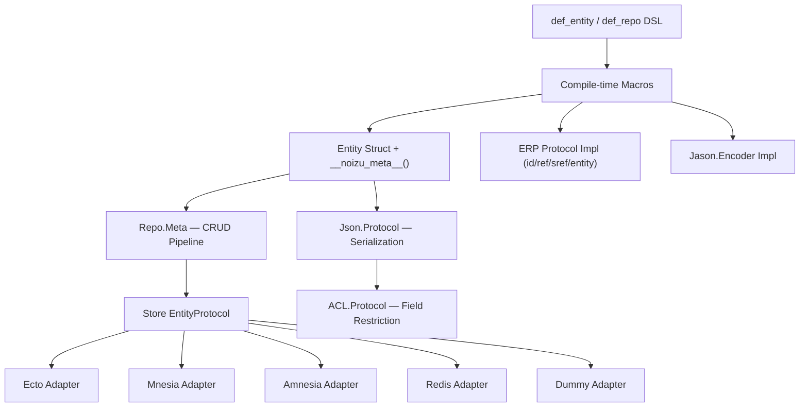

# Project Architecture

## Overview

`noizu_labs_entities` is an Elixir library that turns plain structs into rich entities with compile-time metadata for persistence, JSON serialization, ACL-based field access, and entity referencing. Users declare entities with a DSL (`def_entity` / `def_repo`) and the library generates structs, protocol implementations, and metadata at compile time via macros.

It depends on `noizu_labs_core` for the EntityReference protocol (ERP) and context helpers.

## System Diagram

## Core Components

| Component | Purpose |
|-----------|---------|
| `Noizu.Entities` | Top-level `use` macro — wires up Entity + Repo |
| `Noizu.Entity.Macros` | DSL: `def_entity`, `id`, `field`, `transient`, `pii` |
| `Noizu.Entity.Meta` | Runtime metadata access (fields, json, acl, persistence, sref) |
| `Noizu.Repo.Macros` | DSL: `def_repo` — generates CRUD delegate struct |
| `Noizu.Repo.Meta` | CRUD pipeline: before/do/after hooks per operation |
| `Noizu.Entity.Store.*` | Persistence adapters (Ecto, Mnesia, Amnesia, Redis, Dummy) |
| `Noizu.Entity.Json.Protocol` | ACL-aware JSON serialization with named formats |
| `Noizu.Entity.ACL.Protocol` | Field-level access restriction |
| `Noizu.Entity.{TimeStamp,Reference,Path,DerivedField,UUIDReference}` | Typed field modules with store/lifecycle callbacks |
| `Noizu.Entity.Extended.UUIDReference` | Extended UUID reference field with additional metadata |
| `Noizu.UUID` | UUID generation helper (wraps ShortUUID/elixir_uuid) |
| `Noizu.EntityRepoBehaviour` | Application-level repo that dispatches by sref |

## Entity Definition DSL

Entities are declared with `use Noizu.Entities` and a `def_entity` block. The macro registers fields, identifiers, persistence layers, JSON formats, and ACL rules as module attributes, then emits a `defstruct` and a `__noizu_meta__/0` function containing all metadata.

→ *See [arch/entity-dsl.md](arch/entity-dsl.md) for details*

## Persistence

Each entity can declare multiple persistence layers (`@persistence ecto_store(...)`, `mnesia_store(...)`, etc.). CRUD operations in `Noizu.Repo.Meta` iterate over declared persistence layers, calling the appropriate `Store.*.EntityProtocol` to convert between entity structs and store-specific records.

→ *See [arch/persistence.md](arch/persistence.md) for details*

## JSON Serialization

JSON encoding is driven by named format templates (`:default`, custom names) declared via `@json` attributes. `Jason.Encoder` delegates to `Noizu.Entity.Json.Protocol.prep/4`, which applies ACL restrictions before building the output map.

→ *See [arch/json-acl.md](arch/json-acl.md) for details*

## Key Decisions

- **Compile-time metadata via macros**: All entity config is resolved at compile time into `__noizu_meta__/0` — no runtime reflection cost
- **Protocol-based persistence adapters**: Each store backend implements `EntityProtocol` + `Entity.FieldProtocol`, allowing new stores without touching core
- **ACL integrated into JSON**: Field restriction runs inline during serialization rather than as a separate pass
- **ERP (Entity Reference Protocol)**: Entities are referenceable via `ref()` tuples and `sref` strings, with identifier-type-specific handlers (UUID, integer, atom, ref, dual_ref)
- **Overridable CRUD hooks**: Every repo operation splits into `__before_*__`, `__do_*__`, `__after_*__` — all `defoverridable`

## Technology Stack

| Layer | Technology |
|-------|-----------|
| Language | Elixir ~> 1.14 (developed on 1.19 / OTP 28) |
| Persistence | Ecto (primary), Mnesia, Amnesia (optional via `nuamnesia`), Redis |
| JSON | Jason with custom encoder |
| IDs | ShortUUID, elixir_uuid (optional) |
| Inflection | inflex28 — field name conversion |
| Static analysis | Credo, Dialyxir |
| Core dependency | `noizu_labs_core` ~> 0.1.8 (ERP, context, helpers) |
