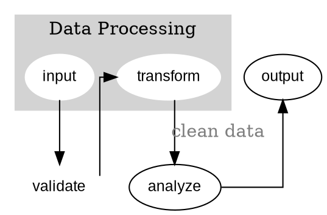

# Graphviz DOT Language
Domain-specific language for defining graph structures declaratively. [Docs](https://graphviz.org/doc/info/lang.html) | [Examples](https://renenyffenegger.ch/notes/tools/Graphviz/examples/index)

## Install/Setup
```bash
# Use with Graphviz (see graphviz.md)
brew install graphviz

# VS Code extension
ext install joaompinto.vscode-graphviz

# Online editors
# https://dreampuf.github.io/GraphvizOnline
# http://webgraphviz.com
```

## Basic Usage


## Strengths
- Simple, readable syntax for graph definition
- Powerful attribute system for styling
- Supports subgraphs and clustering
- Excellent for automated diagram generation
- Portable across many visualization tools

## Limitations
- Pure declaration - no conditional logic
- Layout algorithm choice affects output significantly
- Limited to graph structures
- No built-in support for non-graph diagrams

## Best For
`ast-visualization`, `database-schemas`, `infrastructure-topology`, `workflow-diagrams`, `hierarchy-trees`