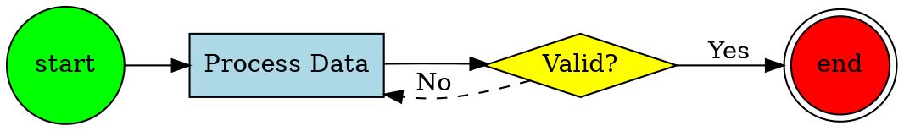

# Graphviz
Powerful graph visualization software for directed and undirected graphs. [Docs](https://graphviz.org) | [Examples](https://graphviz.org/gallery)

## Install/Setup
```bash
# macOS
brew install graphviz

# Ubuntu/Debian
sudo apt-get install graphviz

# npm wrapper
npm install @aduh95/viz.js

# Python binding
pip install graphviz
```

## Basic Usage


## Strengths
- Industry standard for graph visualization
- Excellent automatic layout algorithms (dot, neato, fdp, circo, twopi)
- Handles massive graphs efficiently
- Extensive node and edge styling options
- Wide ecosystem support and integrations

## Limitations
- Steep learning curve for advanced features
- Limited interactivity without additional tools
- Manual positioning difficult
- Complex syntax for nested structures

## Best For
`dependency-graphs`, `state-machines`, `network-diagrams`, `call-graphs`, `data-flow-visualization`