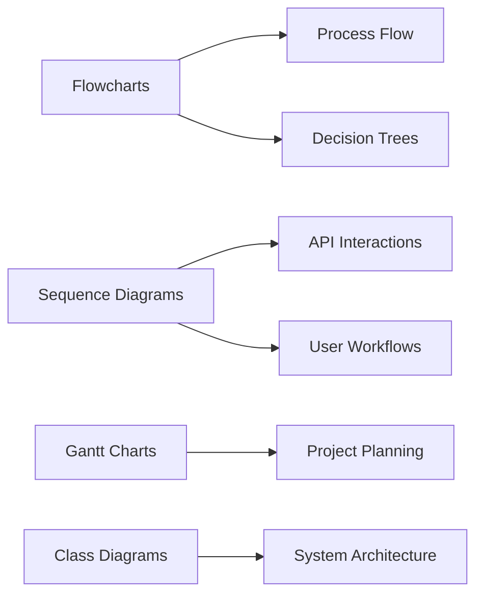

# Mermaid Diagram Generation Use Case

## Overview
Mermaid enables declarative diagram creation using simple text syntax, perfect for documentation and automated diagram generation.

## NPL-FIM Integration
```npl
@fim:mermaid {
  diagram_type: "flowchart"
  auto_layout: true
  theme: "dark"
  export_format: "svg"
  interactive_nodes: true
}
```

## Common Implementation
```javascript
// Initialize Mermaid with configuration
mermaid.initialize({
  startOnLoad: true,
  theme: 'dark',
  flowchart: {
    useMaxWidth: true,
    htmlLabels: true
  }
});

// Generate flowchart from text
const diagramDefinition = `
flowchart TD
    A[Start Process] --> B{Decision Point}
    B -->|Yes| C[Execute Action]
    B -->|No| D[Alternative Path]
    C --> E[Complete]
    D --> E
`;

mermaid.render('generated-diagram', diagramDefinition).then((result) => {
  document.getElementById('diagram-container').innerHTML = result.svg;
});
```

## Common Diagram Types


## Use Cases
- Technical documentation automation
- API workflow visualization
- Project timeline management
- System architecture documentation
- Process flow documentation

## NPL-FIM Benefits
- Text-to-diagram conversion
- Automatic layout optimization
- Theme and styling management
- Export format flexibility