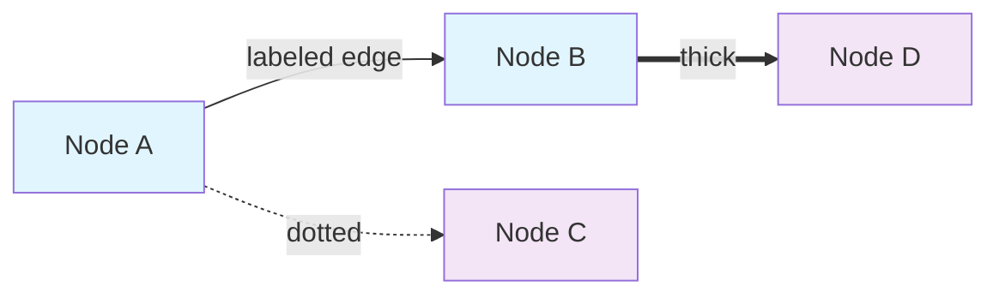

# Mermaid Networks & Graphs Use Case

## Overview
Mermaid excels at creating clear, maintainable network diagrams and relationship graphs using simple text syntax for system documentation.

## NPL-FIM Integration
```npl
@fim:mermaid {
  graph_type: "network_topology"
  node_styling: "auto"
  edge_labels: true
  clustering: true
  layout_algorithm: "dagre"
}
```

## Common Implementation
```javascript
// Network topology diagram
const networkDiagram = `
graph TB
    subgraph "Frontend Layer"
        A[Web Client]
        B[Mobile App]
    end

    subgraph "API Gateway"
        C[Load Balancer]
        D[API Gateway]
    end

    subgraph "Services"
        E[Auth Service]
        F[User Service]
        G[Data Service]
    end

    subgraph "Data Layer"
        H[(Database)]
        I[(Cache)]
    end

    A --> C
    B --> C
    C --> D
    D --> E
    D --> F
    D --> G
    E --> H
    F --> H
    G --> H
    F --> I
`;

mermaid.render('network-topology', networkDiagram);
```

## Advanced Graph Features


## Use Cases
- System architecture documentation
- Network topology visualization
- Dependency mapping
- Service relationship diagrams
- Database entity relationships

## NPL-FIM Benefits
- Version-controlled diagram definitions
- Automatic graph layout algorithms
- Consistent styling across projects
- Integration with documentation systems