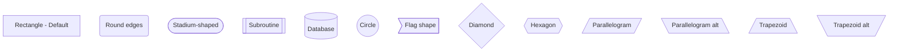

# Mermaid Networks & Graphs - NPL-FIM Implementation Guide

## Overview
Mermaid provides powerful network and graph visualization capabilities through declarative text syntax, enabling creation of complex system architecture diagrams, network topologies, dependency graphs, and relationship mappings. This guide provides comprehensive implementation patterns for NPL-FIM artifact generation.

## Quick Start Templates

### Basic Network Topology


### Service Mesh Architecture


## NPL-FIM Configuration

### Standard Network Diagram Configuration
```npl
@fim:mermaid {
  diagram_type: "graph"
  direction: "TB|LR|RL|BT"
  subgraph_clustering: true
  node_styling: {
    servers: "rect",
    databases: "cylinder",
    services: "rounded",
    external: "cloud"
  }
  edge_styling: {
    primary: "solid",
    backup: "dotted",
    async: "dashed"
  }
  color_scheme: "network_topology"
  layout_engine: "dagre"
  auto_sizing: true
}
```

### Advanced Graph Configuration
```npl
@fim:mermaid {
  diagram_type: "graph"
  interactive: true
  clustering: {
    enabled: true,
    auto_group: true,
    max_depth: 3
  }
  styling: {
    theme: "neutral",
    node_spacing: 50,
    rank_spacing: 100,
    curve: "basis"
  }
  labels: {
    show_on_edges: true,
    font_size: "12px",
    max_length: 20
  }
  export_options: {
    format: ["svg", "png"],
    background: "transparent"
  }
}
```

## Complete Implementation Examples

### Enterprise Network Architecture


### Cloud Architecture Diagram


### Database Relationship Network


## Node Types and Styling

### Node Shape Reference


### Edge Types and Patterns


### Advanced Styling Options


## Interactive Features

### Clickable Nodes with Actions


### Subgraph Linking


## Configuration Variations

### Horizontal vs Vertical Layouts


### Complex Network Topologies


## Environment Setup

### Dependencies
```bash
# Node.js environment
npm install mermaid
npm install @mermaid-js/mermaid-cli

# Python environment
pip install mermaid-python
pip install mermaidjs

# Browser integration
<script src="https://cdn.jsdelivr.net/npm/mermaid/dist/mermaid.min.js"></script>
```

### HTML Integration
```html
<!DOCTYPE html>
<html>
<head>
    <title>Network Diagrams</title>
    <script src="https://cdn.jsdelivr.net/npm/mermaid/dist/mermaid.min.js"></script>
</head>
<body>
    <div class="mermaid">
        graph TB
            A[Load Balancer] --> B[Web Server 1]
            A --> C[Web Server 2]
            B --> D[Database]
            C --> D
    </div>

    <script>
        mermaid.initialize({
            startOnLoad: true,
            theme: 'neutral',
            flowchart: {
                useMaxWidth: true,
                htmlLabels: true,
                curve: 'cardinal'
            }
        });
    </script>
</body>
</html>
```

### JavaScript Integration
```javascript
// Basic initialization
import mermaid from 'mermaid';

mermaid.initialize({
    startOnLoad: true,
    theme: 'default',
    securityLevel: 'loose',
    flowchart: {
        useMaxWidth: true,
        htmlLabels: true
    }
});

// Dynamic diagram generation
function createNetworkDiagram(nodes, edges) {
    let diagram = 'graph TB\n';

    // Add nodes
    nodes.forEach(node => {
        diagram += `    ${node.id}[${node.label}]\n`;
    });

    // Add edges
    edges.forEach(edge => {
        diagram += `    ${edge.from} --> ${edge.to}\n`;
    });

    return diagram;
}

// Render diagram
const element = document.getElementById('networkDiagram');
mermaid.render('network-id', createNetworkDiagram(nodes, edges), element);
```

### Python Integration
```python
# Using mermaid-python package
from mermaid import Mermaid

def generate_network_diagram(topology_data):
    mm = Mermaid()

    # Start graph
    mm.graph_tb()

    # Add subgraphs
    for layer in topology_data['layers']:
        with mm.subgraph(layer['name']):
            for node in layer['nodes']:
                mm.node(node['id'], node['label'], node.get('shape', 'rect'))

    # Add connections
    for connection in topology_data['connections']:
        mm.edge(connection['from'], connection['to'],
               connection.get('label', ''),
               connection.get('style', 'solid'))

    return mm.render()

# Usage
topology = {
    'layers': [
        {'name': 'Frontend', 'nodes': [
            {'id': 'web', 'label': 'Web Server'},
            {'id': 'mobile', 'label': 'Mobile App'}
        ]},
        {'name': 'Backend', 'nodes': [
            {'id': 'api', 'label': 'API Gateway'},
            {'id': 'auth', 'label': 'Auth Service'}
        ]}
    ],
    'connections': [
        {'from': 'web', 'to': 'api'},
        {'from': 'mobile', 'to': 'api'},
        {'from': 'api', 'to': 'auth'}
    ]
}

diagram = generate_network_diagram(topology)
```

## Troubleshooting Guide

### Common Issues and Solutions

#### Diagram Not Rendering
```javascript
// Issue: Diagram doesn't appear
// Solution: Check initialization
mermaid.initialize({
    startOnLoad: true,
    theme: 'default'
});

// Ensure proper HTML structure
<div class="mermaid">
    graph TD
        A --> B
</div>
```

#### Syntax Errors
```mermaid
%% Common syntax issues and fixes

%% Wrong: Missing direction
graph
    A --> B

%% Correct: Include direction
graph TD
    A --> B

%% Wrong: Invalid node shape
A[[[Invalid shape]]]

%% Correct: Use valid shapes
A[Rectangle]
B(Round)
C[(Database)]
```

#### Performance Issues
```javascript
// For large diagrams, optimize performance
mermaid.initialize({
    startOnLoad: false,  // Manual initialization
    maxTextSize: 50000,
    maxEdges: 500,
    flowchart: {
        htmlLabels: false,  // Use SVG labels for performance
        useMaxWidth: false
    }
});

// Lazy loading for multiple diagrams
const observer = new IntersectionObserver((entries) => {
    entries.forEach(entry => {
        if (entry.isIntersecting) {
            mermaid.init(undefined, entry.target);
        }
    });
});

document.querySelectorAll('.mermaid').forEach(el => {
    observer.observe(el);
});
```

#### Styling Conflicts
```css
/* Prevent CSS conflicts */
.mermaid {
    font-family: 'trebuchet ms', verdana, arial, sans-serif !important;
    font-size: 16px !important;
}

/* Custom theme overrides */
.mermaid .node rect {
    stroke-width: 2px !important;
}

.mermaid .edgePath .path {
    stroke-width: 2px !important;
}
```

## Advanced Patterns

### Dynamic Node Generation
```javascript
class NetworkDiagramBuilder {
    constructor() {
        this.nodes = new Map();
        this.edges = [];
        this.subgraphs = new Map();
    }

    addNode(id, label, shape = 'rect', subgraph = null) {
        this.nodes.set(id, { label, shape, subgraph });
        return this;
    }

    addEdge(from, to, label = '', style = 'solid') {
        this.edges.push({ from, to, label, style });
        return this;
    }

    addSubgraph(id, title) {
        this.subgraphs.set(id, { title, nodes: [] });
        return this;
    }

    build() {
        let diagram = 'graph TB\n';

        // Add subgraphs
        for (const [sgId, sgData] of this.subgraphs) {
            diagram += `    subgraph "${sgData.title}"\n`;

            for (const [nodeId, nodeData] of this.nodes) {
                if (nodeData.subgraph === sgId) {
                    const shape = this.getNodeShape(nodeData.shape);
                    diagram += `        ${nodeId}${shape.start}${nodeData.label}${shape.end}\n`;
                }
            }

            diagram += '    end\n\n';
        }

        // Add standalone nodes
        for (const [nodeId, nodeData] of this.nodes) {
            if (!nodeData.subgraph) {
                const shape = this.getNodeShape(nodeData.shape);
                diagram += `    ${nodeId}${shape.start}${nodeData.label}${shape.end}\n`;
            }
        }

        // Add edges
        for (const edge of this.edges) {
            const arrow = this.getArrowStyle(edge.style);
            const label = edge.label ? `|${edge.label}|` : '';
            diagram += `    ${edge.from} ${arrow}${label} ${edge.to}\n`;
        }

        return diagram;
    }

    getNodeShape(shape) {
        const shapes = {
            'rect': { start: '[', end: ']' },
            'round': { start: '(', end: ')' },
            'stadium': { start: '([', end: '])' },
            'database': { start: '[(', end: ')]' },
            'circle': { start: '((', end: '))' },
            'diamond': { start: '{', end: '}' }
        };
        return shapes[shape] || shapes['rect'];
    }

    getArrowStyle(style) {
        const styles = {
            'solid': '-->',
            'dotted': '-.->',
            'thick': '==>',
            'line': '---'
        };
        return styles[style] || styles['solid'];
    }
}

// Usage example
const builder = new NetworkDiagramBuilder()
    .addSubgraph('frontend', 'Frontend Layer')
    .addSubgraph('backend', 'Backend Services')
    .addSubgraph('data', 'Data Layer')
    .addNode('web', 'Web Client', 'rect', 'frontend')
    .addNode('mobile', 'Mobile App', 'rect', 'frontend')
    .addNode('api', 'API Gateway', 'round', 'backend')
    .addNode('auth', 'Auth Service', 'round', 'backend')
    .addNode('db', 'Database', 'database', 'data')
    .addEdge('web', 'api', 'HTTPS')
    .addEdge('mobile', 'api', 'HTTPS')
    .addEdge('api', 'auth', 'Internal')
    .addEdge('auth', 'db', 'SQL');

const diagram = builder.build();
```

### Theme Customization
```javascript
// Custom theme configuration
const customTheme = {
    primaryColor: '#0066cc',
    primaryTextColor: '#ffffff',
    primaryBorderColor: '#004499',
    lineColor: '#666666',
    secondaryColor: '#f0f0f0',
    tertiaryColor: '#ffffff',
    background: '#ffffff',
    mainBkg: '#0066cc',
    secondBkg: '#f0f0f0',
    tertiaryBkg: '#ffffff'
};

mermaid.initialize({
    theme: 'base',
    themeVariables: customTheme,
    flowchart: {
        useMaxWidth: true,
        htmlLabels: true,
        curve: 'cardinal'
    }
});
```

## Export and Integration Options

### SVG Export
```javascript
// Generate SVG for high-quality output
async function exportToSVG(diagramText, elementId) {
    const { svg } = await mermaid.render(elementId, diagramText);

    // Create download link
    const blob = new Blob([svg], { type: 'image/svg+xml' });
    const url = URL.createObjectURL(blob);

    const link = document.createElement('a');
    link.href = url;
    link.download = `network-diagram-${elementId}.svg`;
    link.click();

    URL.revokeObjectURL(url);
}
```

### PNG Export via CLI
```bash
# Using mermaid-cli for PNG export
npx mmdc -i network-diagram.mmd -o network-diagram.png -t neutral -b white

# Batch export multiple diagrams
for file in *.mmd; do
    npx mmdc -i "$file" -o "${file%.mmd}.png" -t neutral -b white
done
```

### Integration with Documentation
```markdown
<!-- Markdown integration -->


<!-- HTML integration -->
<div class="mermaid">
graph TB
    A[Documentation] --> B[Mermaid Diagram]
    B --> C[Rendered Output]
</div>
```

## Performance Optimization

### Large Diagram Handling
```javascript
// Optimize for large networks
mermaid.initialize({
    startOnLoad: false,
    maxTextSize: 100000,
    maxEdges: 1000,
    flowchart: {
        htmlLabels: false,  // Better performance
        useMaxWidth: false,
        rankSpacing: 75,
        nodeSpacing: 50
    },
    gantt: {
        numberSectionStyles: 2
    }
});

// Progressive rendering for very large diagrams
function renderLargeDiagram(diagramText, containerId) {
    const container = document.getElementById(containerId);

    // Show loading indicator
    container.innerHTML = '<div class="loading">Rendering diagram...</div>';

    setTimeout(() => {
        mermaid.render('large-diagram', diagramText)
            .then(result => {
                container.innerHTML = result.svg;
            })
            .catch(error => {
                container.innerHTML = `<div class="error">Error rendering diagram: ${error}</div>`;
            });
    }, 100);
}
```

### Memory Management
```javascript
// Clean up rendered diagrams
function cleanupDiagrams() {
    // Remove old SVG elements
    document.querySelectorAll('.mermaid svg').forEach(svg => {
        if (!svg.isConnected) {
            svg.remove();
        }
    });

    // Clear mermaid cache if available
    if (mermaid.clearCache) {
        mermaid.clearCache();
    }
}

// Call cleanup periodically for SPA applications
setInterval(cleanupDiagrams, 60000); // Every minute
```

## Best Practices

### Diagram Organization
1. **Use consistent naming conventions** for node IDs
2. **Group related nodes** in subgraphs for clarity
3. **Limit diagram complexity** - break large networks into multiple diagrams
4. **Use meaningful labels** that describe function, not just names
5. **Apply consistent styling** across related diagrams

### Performance Guidelines
1. **Minimize HTML labels** for large diagrams
2. **Use appropriate layout directions** (TB for hierarchies, LR for processes)
3. **Limit subgraph nesting** to 3 levels maximum
4. **Optimize node and edge counts** (< 50 nodes, < 100 edges per diagram)
5. **Use lazy loading** for multiple diagrams on one page

### Accessibility Considerations
1. **Provide alternative text** descriptions for screen readers
2. **Use high contrast colors** for better visibility
3. **Include text descriptions** of diagram content
4. **Ensure keyboard navigation** works with interactive elements
5. **Test with assistive technologies** regularly

## NPL-FIM Advantages

### Rapid Prototyping
- **Text-based definitions** enable version control and diff tracking
- **Declarative syntax** reduces learning curve compared to graphical tools
- **Live preview** capabilities for immediate feedback
- **Template-based generation** for consistent diagram patterns

### Integration Benefits
- **Documentation as code** - diagrams live with source code
- **Automated generation** from infrastructure definitions
- **CI/CD pipeline integration** for diagram validation
- **Cross-platform compatibility** without proprietary tools

### Maintenance Advantages
- **Single source of truth** for network documentation
- **Bulk updates** through search and replace
- **Consistent styling** across all diagrams
- **Collaborative editing** through standard text editors

This comprehensive guide provides all necessary components for NPL-FIM to generate sophisticated Mermaid network and graph diagrams without false starts, covering complete implementation patterns, configuration options, troubleshooting, and best practices for professional network visualization.