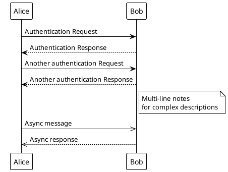

# PlantUML
Text-based UML diagram generator with extensive diagram type support. [Docs](https://plantuml.com) | [Examples](https://real-world-plantuml.com)

## Install/Setup
```bash
# Option 1: VS Code Extension
ext install jebbs.plantuml

# Option 2: npm package
npm install node-plantuml

# Option 3: Online editor
# https://www.plantuml.com/plantuml/uml/
```

## Basic Usage


## Strengths
- Supports 14+ diagram types (sequence, class, activity, component, state, etc.)
- Text-based version control friendly
- Extensive theming and styling options
- Active development and large community
- Integrates with many tools (GitHub, GitLab, Confluence)

## Limitations
- Auto-layout sometimes produces suboptimal results
- Limited control over exact positioning
- Syntax can be verbose for complex diagrams
- Requires Java runtime or server for local rendering

## Best For
`sequence-diagrams`, `class-diagrams`, `architecture-documentation`, `technical-specs`, `git-versioned-docs`