# PlantUML Diagram Generation - NPL-FIM Complete Guide

**Morgan Black's Comprehensive PlantUML Implementation Guide**

*Advanced text-based diagram creation for software architecture, workflows, system design, and technical documentation with immediate NPL-FIM artifact generation capabilities.*

## Direct Unramp - Quick Start Templates

### Immediate Use Architecture Diagram
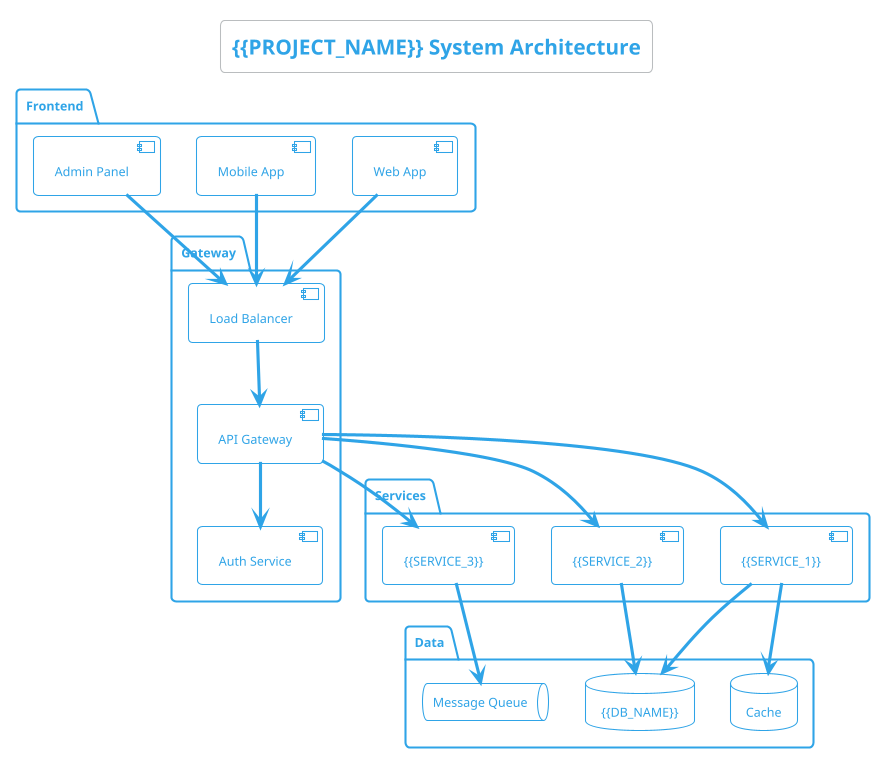

### Ready-to-Use Sequence Diagram
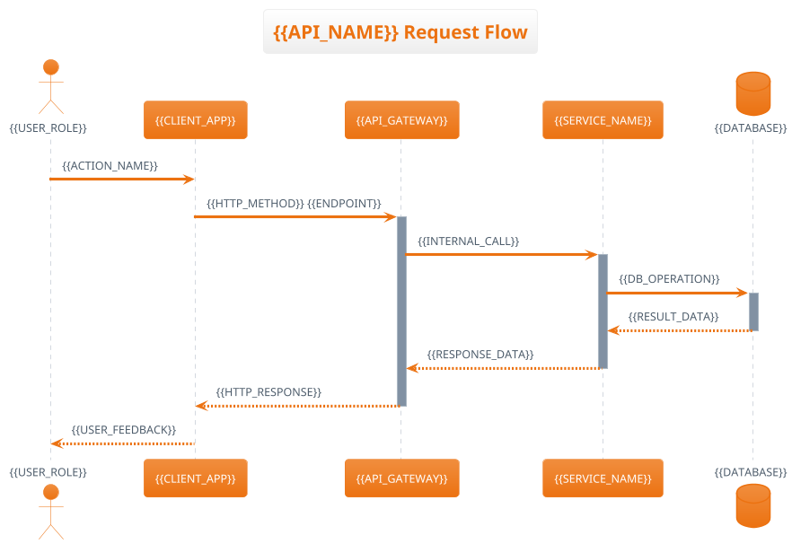

## Complete Environment Setup

### Installation Requirements

**Java Runtime (Required)**
```bash
# Ubuntu/Debian
sudo apt update && sudo apt install default-jre

# macOS
brew install openjdk

# Windows (Chocolatey)
choco install openjdk

# Verify installation
java -version
```

**PlantUML JAR Download**
```bash
# Download latest PlantUML JAR
wget -O plantuml.jar "https://github.com/plantuml/plantuml/releases/latest/download/plantuml.jar"

# Alternative: specific version
wget -O plantuml.jar "https://sourceforge.net/projects/plantuml/files/plantuml.1.2023.13.jar/download"

# Set executable permissions
chmod +x plantuml.jar
```

**VS Code Integration**
```json
{
  "plantuml.server": "https://www.plantuml.com/plantuml",
  "plantuml.render": "PlantUMLServer",
  "plantuml.includepaths": ["./diagrams", "./docs"],
  "plantuml.exportOutDir": "./output",
  "plantuml.exportFormat": "svg",
  "plantuml.exportSubFolder": true
}
```

**IntelliJ IDEA Plugin**
- Install "PlantUML Integration" plugin
- Configure PlantUML path: File → Settings → Tools → PlantUML
- Set JAR location: `/path/to/plantuml.jar`

### Command Line Usage
```bash
# Generate PNG
java -jar plantuml.jar diagram.puml

# Generate SVG (recommended for web)
java -jar plantuml.jar -tsvg diagram.puml

# Generate PDF
java -jar plantuml.jar -tpdf diagram.puml

# Batch processing
java -jar plantuml.jar -tsvg "*.puml"

# Watch mode for development
java -jar plantuml.jar -tsvg -gui
```

## Comprehensive Diagram Types

### 1. Component Architecture Diagrams

**Microservices Architecture**
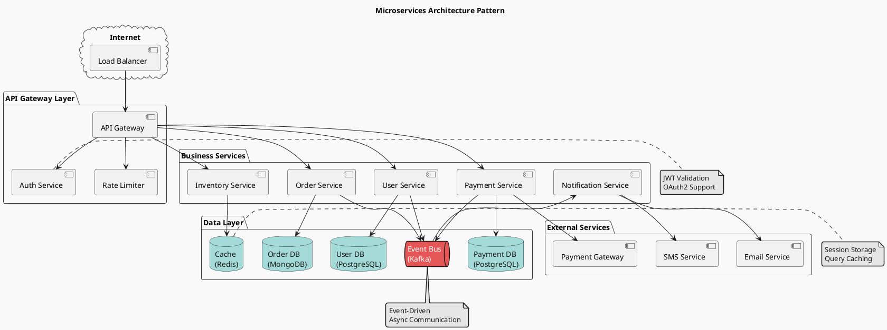

**Layered Architecture**
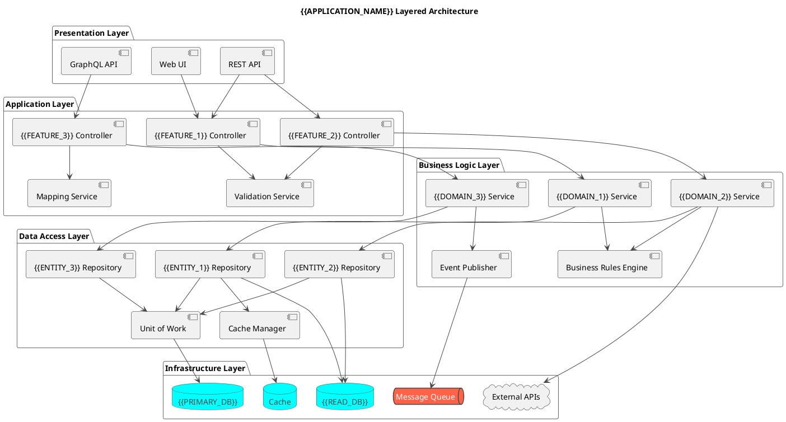

### 2. Sequence Diagrams

**Authentication Flow**
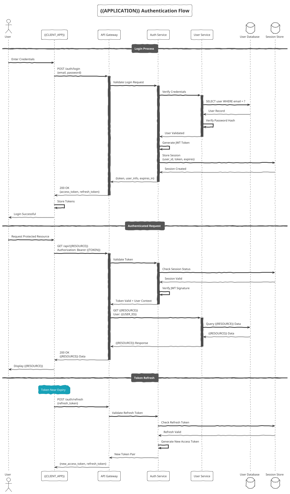

**Error Handling Sequence**
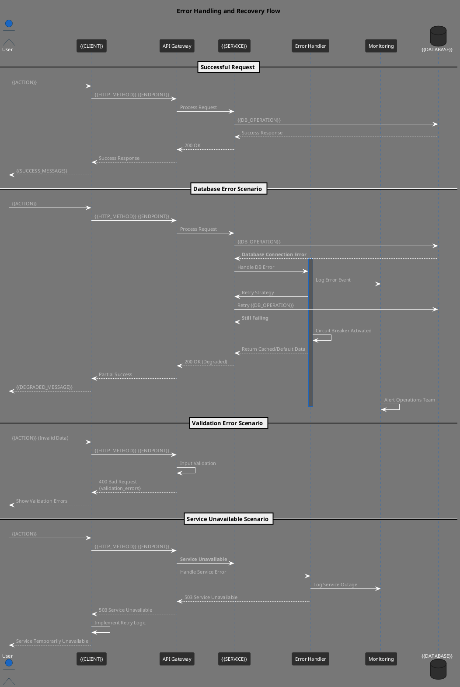

### 3. Class Diagrams

**Domain Model**
```plantuml
@startuml domain-model
!theme blueprint
title {{DOMAIN}} Domain Model

abstract class Entity {
  +UUID id
  +DateTime createdAt
  +DateTime updatedAt
  +String createdBy
  +String updatedBy
  --
  +boolean equals(Object other)
  +int hashCode()
  +String toString()
}

abstract class AggregateRoot extends Entity {
  -List<DomainEvent> domainEvents
  --
  +void addDomainEvent(DomainEvent event)
  +List<DomainEvent> getDomainEvents()
  +void clearDomainEvents()
}

class {{MAIN_ENTITY}} extends AggregateRoot {
  -String {{PROPERTY_1}}
  -{{TYPE_2}} {{PROPERTY_2}}
  -{{ENUM}} status
  -Money {{MONEY_PROPERTY}}
  --
  +{{MAIN_ENTITY}}({{CONSTRUCTOR_PARAMS}})
  +void {{BUSINESS_METHOD_1}}()
  +{{RETURN_TYPE}} {{BUSINESS_METHOD_2}}()
  +boolean {{VALIDATION_METHOD}}()
  +void {{STATE_CHANGE_METHOD}}()
}

class {{CHILD_ENTITY}} extends Entity {
  -{{MAIN_ENTITY}} {{PARENT_REF}}
  -String {{CHILD_PROPERTY_1}}
  -{{TYPE}} {{CHILD_PROPERTY_2}}
  --
  +{{CHILD_ENTITY}}({{CONSTRUCTOR_PARAMS}})
  +void {{CHILD_METHOD}}()
  +boolean {{CHILD_VALIDATION}}()
}

class {{VALUE_OBJECT}} {
  -final String {{VALUE_PROP_1}}
  -final {{TYPE}} {{VALUE_PROP_2}}
  --
  +{{VALUE_OBJECT}}({{VALUE_PARAMS}})
  +boolean equals(Object other)
  +int hashCode()
  +String toString()
  +{{TYPE}} {{GETTER_METHOD}}()
}

enum {{STATUS_ENUM}} {
  {{STATUS_1}}
  {{STATUS_2}}
  {{STATUS_3}}
  --
  +boolean isActive()
  +boolean canTransitionTo({{STATUS_ENUM}} newStatus)
}

interface {{REPOSITORY_INTERFACE}} {
  +Optional<{{MAIN_ENTITY}}> findById(UUID id)
  +List<{{MAIN_ENTITY}}> findBy{{CRITERIA}}({{PARAMS}})
  +{{MAIN_ENTITY}} save({{MAIN_ENTITY}} entity)
  +void delete({{MAIN_ENTITY}} entity)
  +boolean exists(UUID id)
}

interface {{DOMAIN_SERVICE}} {
  +{{RESULT_TYPE}} {{SERVICE_METHOD}}({{PARAMS}})
  +boolean {{VALIDATION_SERVICE}}({{PARAMS}})
  +void {{PROCESS_METHOD}}({{PARAMS}})
}

class {{DOMAIN_EVENT}} {
  +UUID aggregateId
  +DateTime occurredOn
  +String eventType
  +Map<String, Object> eventData
  --
  +{{DOMAIN_EVENT}}({{EVENT_PARAMS}})
  +String getEventType()
  +Object getEventData(String key)
}

' Relationships
{{MAIN_ENTITY}} ||--o{ {{CHILD_ENTITY}} : contains
{{MAIN_ENTITY}} --> {{VALUE_OBJECT}} : uses
{{MAIN_ENTITY}} --> {{STATUS_ENUM}} : has status
{{MAIN_ENTITY}} ..> {{DOMAIN_EVENT}} : publishes
{{REPOSITORY_INTERFACE}} ..> {{MAIN_ENTITY}} : manages
{{DOMAIN_SERVICE}} ..> {{MAIN_ENTITY}} : operates on

' Notes
note right of {{MAIN_ENTITY}} : Aggregate Root\nBusinesss Logic Hub
note bottom of {{VALUE_OBJECT}} : Immutable\nValue Object
note left of {{DOMAIN_EVENT}} : Domain Events\nfor Integration

@enduml
```

### 4. Activity Diagrams

**Business Process Flow**
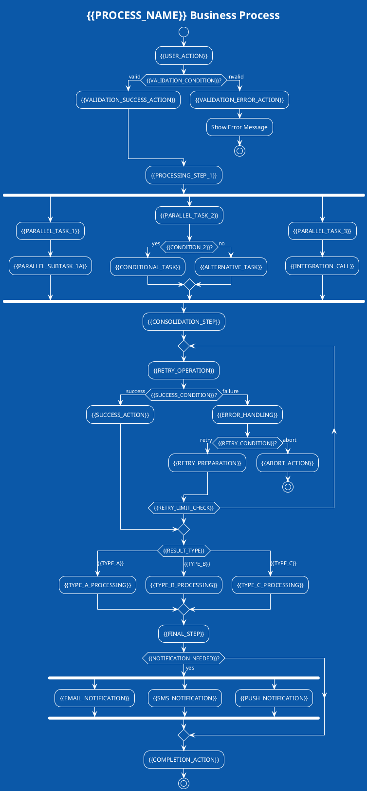

### 5. State Diagrams

**Entity Lifecycle**
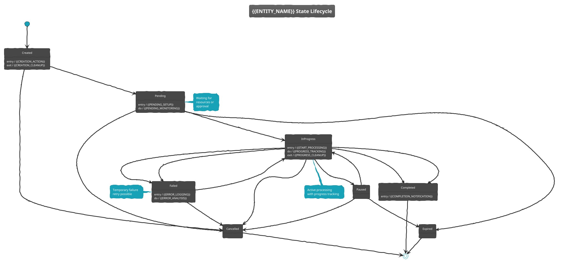

## Configuration and Customization

### Theme Configuration
```plantuml
' Built-in themes
!theme aws-orange          ' AWS orange theme
!theme blueprintblue       ' Blueprint style
!theme cerulean-outline    ' Clean outline style
!theme mars               ' Red Mars theme
!theme sketchy-outline    ' Hand-drawn style
!theme vibrant           ' Bright colors

' Custom theme definition
!define PRIMARY_COLOR #2E86AB
!define SECONDARY_COLOR #A23B72
!define ACCENT_COLOR #F18F01
!define BACKGROUND_COLOR #C73E1D

skinparam backgroundColor BACKGROUND_COLOR
skinparam defaultFontColor #FFFFFF
skinparam defaultFontSize 12
skinparam defaultFontName "Arial"

' Component styling
skinparam component {
  BackgroundColor PRIMARY_COLOR
  BorderColor SECONDARY_COLOR
  FontColor #FFFFFF
}

skinparam database {
  BackgroundColor ACCENT_COLOR
  BorderColor SECONDARY_COLOR
}

skinparam actor {
  BackgroundColor SECONDARY_COLOR
  BorderColor PRIMARY_COLOR
}
```

### Custom Macros and Definitions
```plantuml
' Reusable component definitions
!define WEBAPP rectangle #lightblue
!define MOBILE rectangle #lightgreen
!define API rectangle #orange
!define DATABASE database #lightcoral
!define CACHE database #yellow
!define QUEUE queue #lightpink

' Custom stereotypes
!define <<external>> #lightgray
!define <<internal>> #lightblue
!define <<deprecated>> #red

' Icon definitions (using Devicons)
!define DEVICON_POSTGRESQL <&postgresql>
!define DEVICON_REDIS <&redis>
!define DEVICON_DOCKER <&docker>
!define DEVICON_KUBERNETES <&kubernetes>

' Template macros
!definelong SERVICE(name, tech)
rectangle "name" as name {
  note : Technology: tech
}
!enddefinelong

' Usage example
SERVICE(UserService, "Spring Boot")
SERVICE(OrderService, "Node.js")
```

### Layout and Positioning
```plantuml
@startuml layout-example
!theme blueprint

' Direction control
!direction top to bottom left to right

' Manual positioning
component A
component B
component C
component D

A -right-> B
B -down-> C
C -left-> D
D -up-> A

' Grouping and spacing
together {
  component E
  component F
}

' Hidden links for layout
A -[hidden]-> E
B -[hidden]-> F

' Notes positioning
note right of A : Right side note
note bottom of B : Bottom note
note left of C : Left side note
note top of D : Top note

@enduml
```

## Integration Patterns

### Documentation Integration
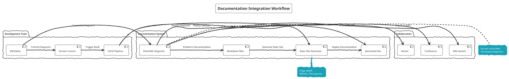

### CI/CD Integration
```yaml
# GitHub Actions example
name: Generate PlantUML Diagrams

on:
  push:
    paths:
      - '**/*.puml'
      - 'docs/**/*.md'

jobs:
  generate-diagrams:
    runs-on: ubuntu-latest

    steps:
    - uses: actions/checkout@v3

    - name: Setup Java
      uses: actions/setup-java@v3
      with:
        distribution: 'temurin'
        java-version: '11'

    - name: Download PlantUML
      run: |
        wget -O plantuml.jar "https://github.com/plantuml/plantuml/releases/latest/download/plantuml.jar"

    - name: Generate SVG diagrams
      run: |
        find . -name "*.puml" -exec java -jar plantuml.jar -tsvg {} \;

    - name: Commit generated diagrams
      run: |
        git config --local user.email "action@github.com"
        git config --local user.name "GitHub Action"
        git add "*.svg"
        git diff --staged --quiet || git commit -m "Auto-generate PlantUML diagrams"
        git push
```

## Advanced Features and Variations

### Database Schema Diagrams
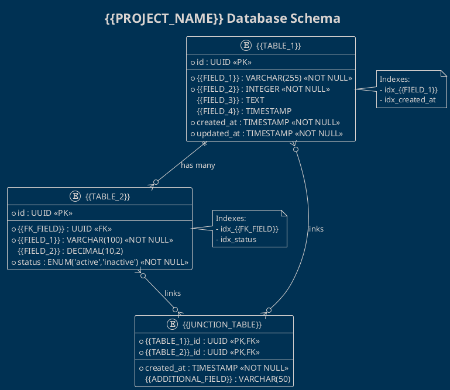

### API Documentation Diagrams
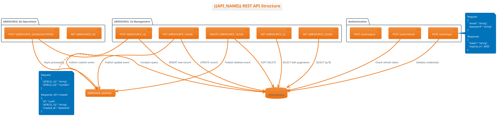

### Deployment Architecture
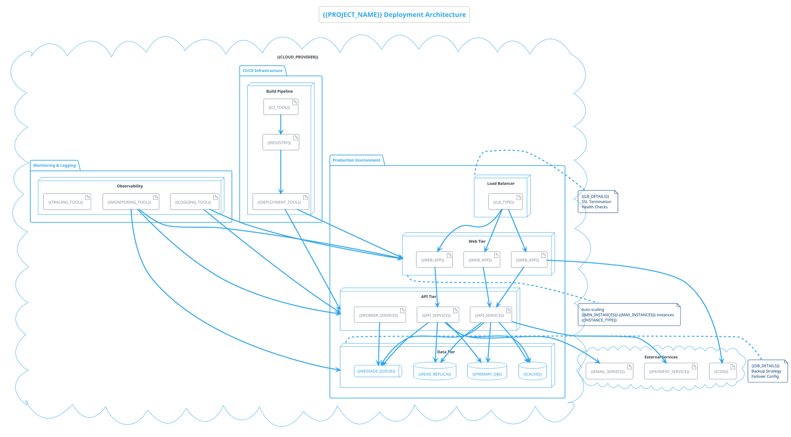

## Troubleshooting Guide

### Common Issues and Solutions

**Java Path Issues**
```bash
# Error: Java not found
export JAVA_HOME=/usr/lib/jvm/default-java
export PATH=$JAVA_HOME/bin:$PATH

# Verify Java installation
java -version
which java
```

**Memory Issues with Large Diagrams**
```bash
# Increase memory allocation
java -Xmx1024m -jar plantuml.jar large-diagram.puml

# For very large diagrams
java -Xmx2048m -jar plantuml.jar complex-system.puml
```

**Syntax Errors**
```plaintext
Common PlantUML syntax errors:

1. Missing @startuml/@enduml tags
2. Incorrect arrow syntax (use --> not ->)
3. Reserved keywords as identifiers
4. Unmatched parentheses or brackets
5. Invalid theme names
6. Circular dependencies in class diagrams

Solutions:
- Use PlantUML syntax checker
- Validate with online editor
- Check parentheses matching
- Verify theme names exist
```

**Font and Rendering Issues**
```plantuml
' Font configuration
skinparam defaultFontName "DejaVu Sans"
skinparam defaultFontSize 10
skinparam defaultFontStyle plain

' High DPI rendering
skinparam dpi 300
```

**Export Format Issues**
```bash
# SVG for web (recommended)
java -jar plantuml.jar -tsvg diagram.puml

# PNG with transparency
java -jar plantuml.jar -tpng diagram.puml

# PDF for printing
java -jar plantuml.jar -tpdf diagram.puml

# Multiple formats
java -jar plantuml.jar -tsvg -tpng diagram.puml
```

### Performance Optimization

**Large Diagram Optimization**
```plantuml
' Reduce complexity
!define SIMPLIFY_LAYOUT
!pragma useVerticalIf on

' Optimize connections
!define ARROW_LENGTH 2
skinparam minClassWidth 50
skinparam minClassHeight 50

' Reduce font sizes for overview diagrams
skinparam defaultFontSize 8
```

**Batch Processing**
```bash
# Process multiple files efficiently
java -jar plantuml.jar -tsvg -o ./output *.puml

# Parallel processing (Linux/macOS)
find . -name "*.puml" -print0 | xargs -0 -P 4 -I {} java -jar plantuml.jar -tsvg {}
```

## Tool-Specific Advantages

### PlantUML Strengths
- **Text-based**: Version control friendly, diff-able
- **Automatic layout**: No manual positioning required
- **Multiple formats**: SVG, PNG, PDF export options
- **Integration ready**: Works with documentation tools
- **Collaborative**: Easy to share and modify
- **Programmatic**: Can be generated from code/data

### PlantUML Limitations
- **Limited styling**: Less visual customization than GUI tools
- **Layout control**: Sometimes produces suboptimal layouts
- **Complex diagrams**: Can become unwieldy for very large systems
- **Learning curve**: Syntax must be learned
- **Performance**: Large diagrams can be slow to render

### Best Use Cases
- Software architecture documentation
- API documentation and specifications
- Database schema visualization
- Process flow documentation
- Team collaboration on system design
- Automated diagram generation
- Integration with development workflows

### When NOT to Use PlantUML
- Highly stylized presentations
- Marketing materials requiring precise branding
- Diagrams requiring pixel-perfect positioning
- Non-technical stakeholder presentations
- Real-time collaborative editing requirements

## Migration and Integration Strategies

### From Visual Tools
```plaintext
Migrating from Visio/Lucidchart/Draw.io:

1. Start with simple diagrams
2. Learn PlantUML syntax gradually
3. Use online converter tools where available
4. Focus on content over visual perfection
5. Leverage text-based advantages (version control, automation)
```

### Integration with Existing Workflows
```yaml
# Documentation workflow integration
docs/
├── diagrams/
│   ├── architecture/
│   │   ├── system-overview.puml
│   │   ├── microservices.puml
│   │   └── deployment.puml
│   ├── api/
│   │   ├── authentication.puml
│   │   └── user-flows.puml
│   └── database/
│       ├── schema.puml
│       └── migrations.puml
├── generated/
│   ├── *.svg
│   └── *.png
└── content/
    ├── architecture.md
    └── api-reference.md
```

This comprehensive guide provides everything needed for NPL-FIM to generate effective PlantUML diagrams with immediate unramp capabilities, complete examples, and professional-grade documentation standards.