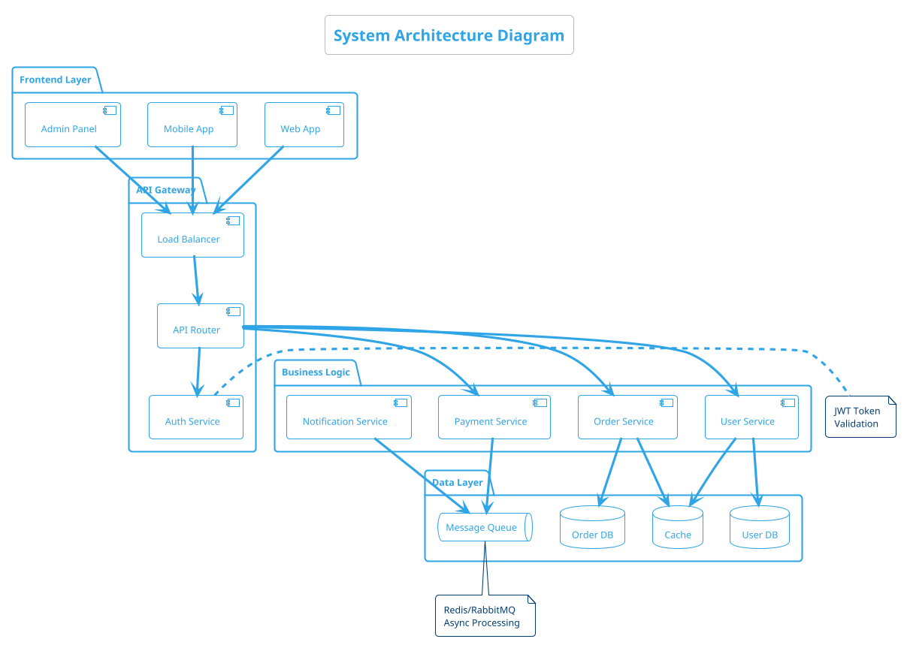

# Diagram Generation with PlantUML

Text-based diagram creation for software architecture, workflows, and system design.

## Core Implementation

## Key Features
- Multiple diagram types (sequence, class, activity, component)
- Automatic layout and routing
- Theme and styling customization
- Integration with documentation workflows
- Export to SVG, PNG, and PDF formats
- Collaborative editing through text-based source