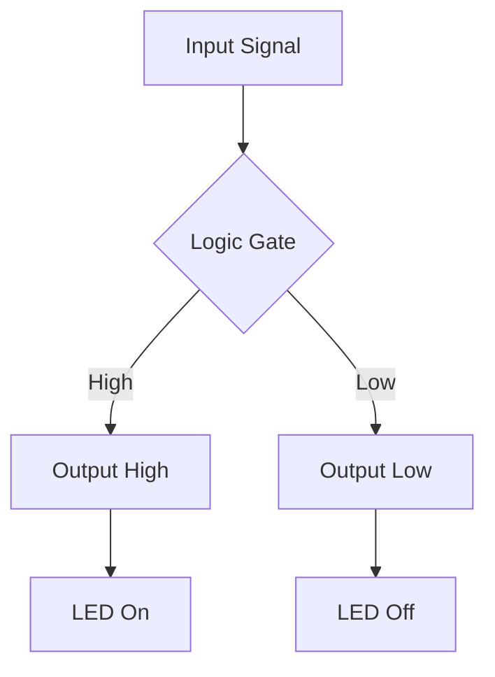

# Engineering Diagrams
Generate technical diagrams for circuits, timing, schematics using Claude's visual capabilities.
[Mermaid Documentation](https://mermaid.js.org/syntax/flowchart.html) | [Circuit.js](https://www.falstad.com/circuit/)

## WWHW
**What**: Generate technical engineering diagrams (circuits, timing diagrams, schematics)
**Why**: Visualize complex systems, document designs, communicate technical concepts
**How**: Use Mermaid syntax, ASCII art, or SVG generation through NPL-FIM
**When**: During design phase, documentation, troubleshooting, code reviews

## When to Use
- Circuit design and analysis documentation
- Timing diagram generation for digital systems
- System architecture visualization
- Hardware/software interface documentation
- Educational technical content creation

## Key Outputs
`mermaid`, `svg`, `ascii-art`, `timing-diagrams`

## Quick Example

## Extended Reference
- [Timing Diagram Generator](https://wavedrom.com/)
- [Digital Logic Simulator](https://logic.ly/)
- [KiCad Documentation](https://docs.kicad.org/)
- [Electronic Principles by Malvino](https://www.amazon.com/Electronic-Principles-Albert-Malvino/dp/0073373885)
- [Digital Design and Computer Architecture](https://pages.hmc.edu/harris/ddca/)