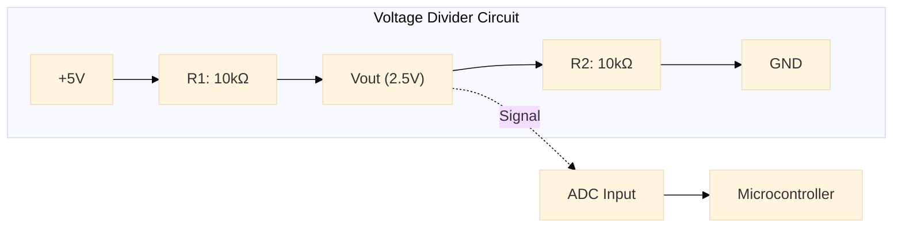
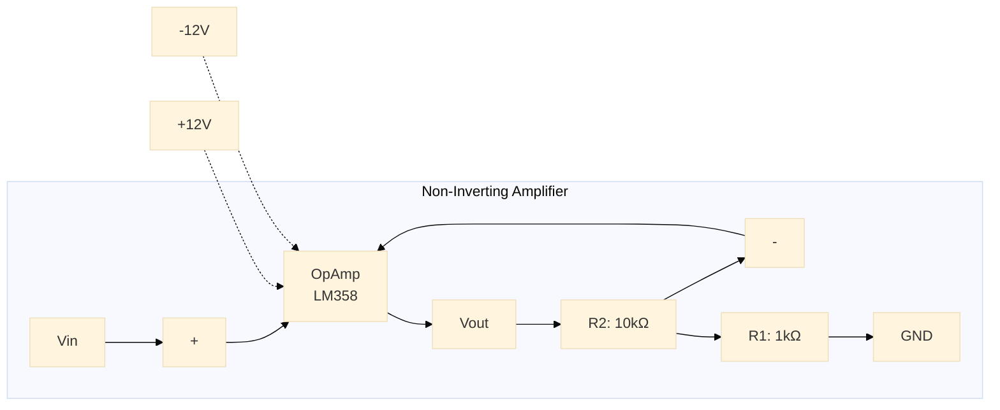
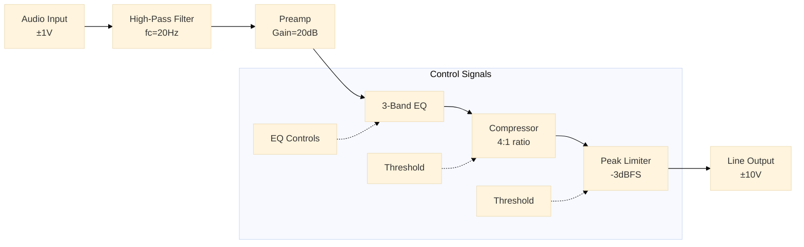
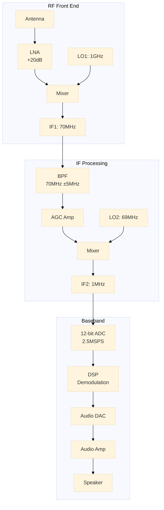

# Engineering Diagrams
Generate technical engineering diagrams including circuits, timing sequences, schematics, and signal flow using Claude's visual capabilities.

## When to Use
- Circuit design and analysis (resistor networks, amplifiers, digital logic)
- Timing diagram generation for digital systems and protocols
- Electronic schematics with component specifications
- Signal processing chain visualization
- Control system block diagrams
- Hardware interface documentation
- PCB layout planning and component placement

## Differentiation from Similar Types
**vs. Flowcharts**: Engineering diagrams show electrical/electronic relationships with proper symbols; flowcharts show process logic flow
**vs. Architectural Diagrams**: Engineering diagrams focus on hardware components, signals, and electrical connections; architectural diagrams show software/system structure
**vs. Network Diagrams**: Engineering diagrams show electronic circuits and signals; network diagrams show data/communication paths
**vs. System Diagrams**: Engineering diagrams include electrical specifications (voltages, resistances, frequencies); system diagrams are more abstract

## Format Selection Guide

### Mermaid (Recommended for most cases)
**Use when**: Creating block diagrams, signal flow, or simple circuits
**Advantages**: Clean rendering, good for documentation, version-controllable
**Best for**: System-level diagrams, signal processing chains, basic circuits
```
Choose mermaid for: Block diagrams, signal flow, simple circuits, documentation
```

### ASCII Art
**Use when**: Text-only environments, embedded documentation, quick sketches
**Advantages**: Universal compatibility, fast creation, minimal size
**Best for**: Simple circuits, timing diagrams, quick reference
```
Choose ASCII for: CLI tools, embedded docs, email, legacy systems
```

### SVG
**Use when**: Complex schematics requiring precise component symbols
**Advantages**: Scalable, detailed symbols, professional appearance
**Best for**: Detailed schematics, PCB layouts, presentation diagrams
```
Choose SVG for: Complex schematics, professional presentations, detailed symbols
```

### Timing Diagrams (Specialized)
**Use when**: Showing signal timing relationships and protocol sequences
**Advantages**: Precise timing representation, clear state changes
**Best for**: Digital protocols, clock domains, state machines
```
Choose timing for: Protocol analysis, clock relationships, state sequences
```

## Key Outputs
`mermaid`, `svg`, `ascii-art`, `timing-diagrams`, `circuit-schematics`

## Comprehensive Examples

### 1. Basic Circuit (Mermaid - System Level)


### 2. Digital Timing Diagram (ASCII Art)
```
Clock    ⎺⎺⎺⎽⎽⎽⎺⎺⎺⎽⎽⎽⎺⎺⎺⎽⎽⎽⎺⎺⎺⎽⎽⎽
Data     ────╱───╲───╱───╲───╱───╲───╱───╲
         │ A │ B │ C │ D │ E │ F │ G │ H │
Valid    ────⎺⎺⎺⎺⎺⎺⎺⎺⎺⎺⎺⎺⎺⎺⎺⎺⎺⎺⎺⎺⎺⎺⎺⎺────
Enable   ⎽⎽⎽⎽⎺⎺⎺⎺⎺⎺⎺⎺⎺⎺⎺⎺⎺⎺⎺⎺⎽⎽⎽⎽⎽⎽⎽⎽
Time     0   1   2   3   4   5   6   7   8
```

### 3. Operational Amplifier Circuit (Mermaid)


### 4. Signal Processing Chain (Mermaid)


### 5. Digital Logic Circuit (ASCII Art)
```
         VCC
          │
      ┌───┴───┐
  A ──┤       │
      │  NAND ├── Y = !(A·B)
  B ──┤       │
      └───┬───┘
          │
         GND

Truth Table:
A │ B │ Y
──┼───┼───
0 │ 0 │ 1
0 │ 1 │ 1
1 │ 0 │ 1
1 │ 1 │ 0
```

### 6. Complex System Block Diagram (Mermaid)


## Format Decision Matrix
| Diagram Type | Mermaid | ASCII | SVG | Timing |
|--------------|---------|-------|-----|--------|
| Block Diagrams | ✓ Best | Good | ✓ Good | No |
| Simple Circuits | ✓ Best | Good | ✓ Best | No |
| Complex Schematics | Fair | Poor | ✓ Best | No |
| Signal Flow | ✓ Best | Good | Good | No |
| Protocol Timing | Poor | Good | Fair | ✓ Best |
| State Machines | Good | Fair | Good | ✓ Best |
| PCB Layout | Poor | Poor | ✓ Best | No |