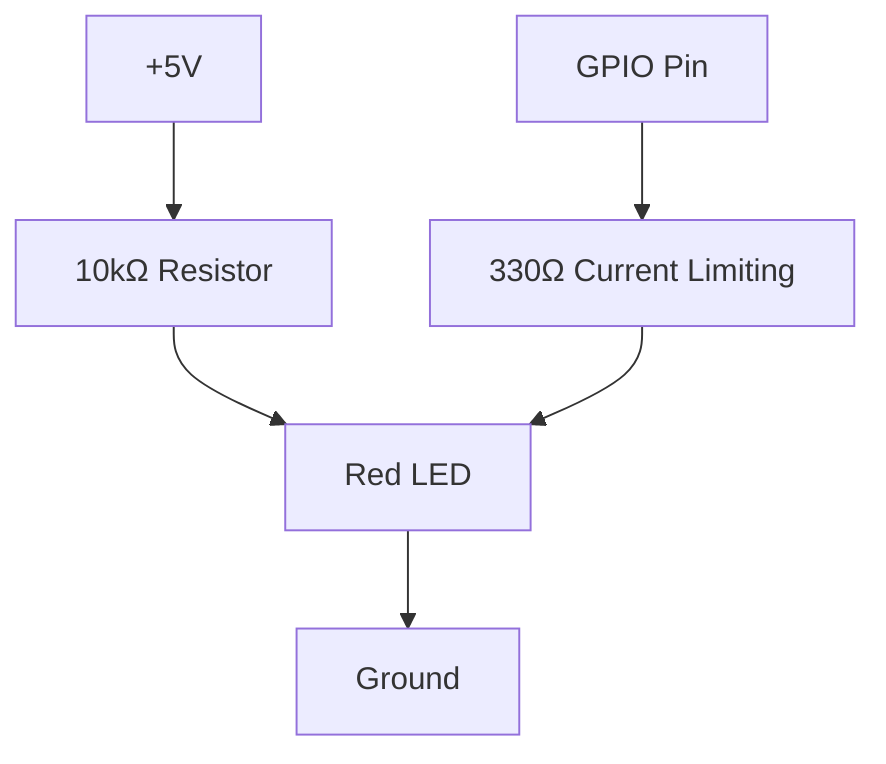
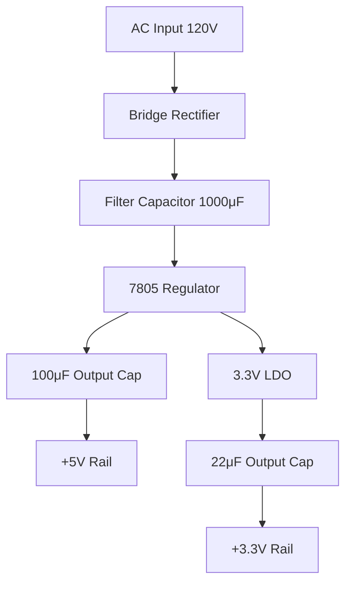
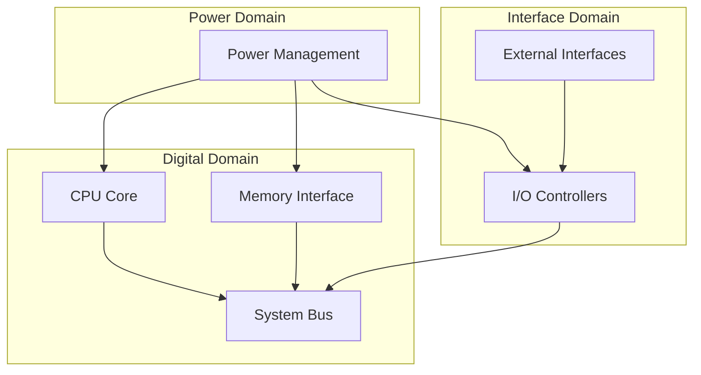
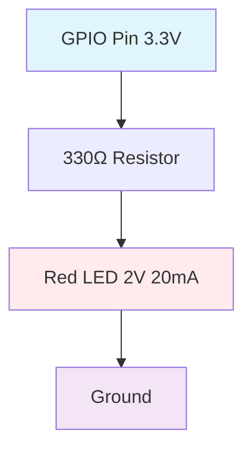
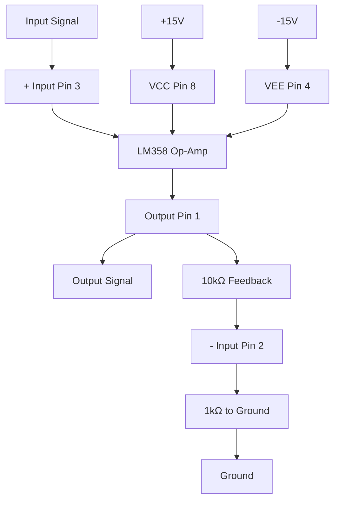
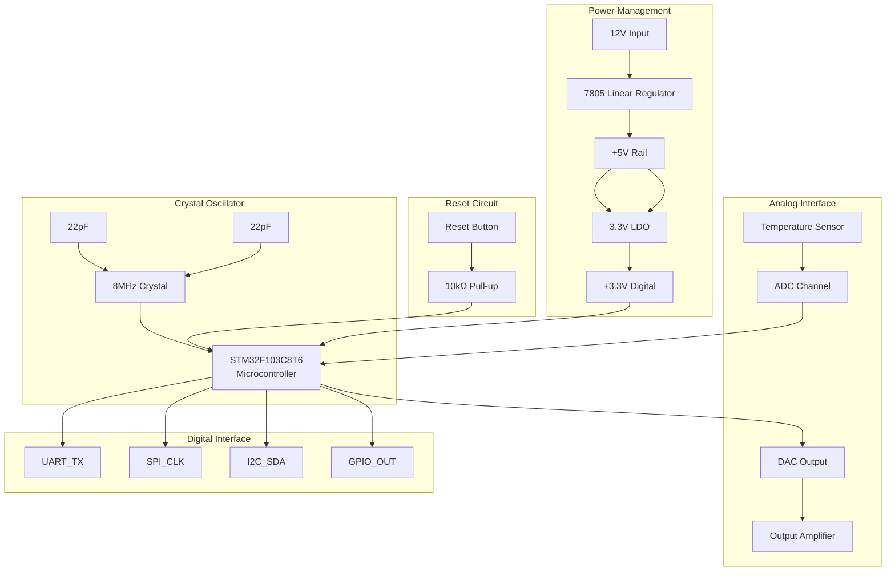
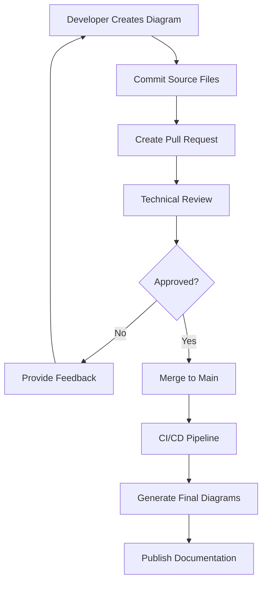

# Engineering Diagrams - Comprehensive NPL-FIM Use Case Guide

## Table of Contents

1. [Introduction and Ecosystem Overview](#introduction-and-ecosystem-overview)
2. [Background and Context](#background-and-context)
3. [Core Technologies and Tool Landscape](#core-technologies-and-tool-landscape)
4. [Circuit Design Fundamentals](#circuit-design-fundamentals)
5. [Timing Diagram Engineering](#timing-diagram-engineering)
6. [Schematic Capture and Documentation](#schematic-capture-and-documentation)
7. [Simulation Workflows](#simulation-workflows)
8. [Practical Examples by Complexity](#practical-examples-by-complexity)
9. [Integration Patterns and Best Practices](#integration-patterns-and-best-practices)
10. [Performance Optimization Strategies](#performance-optimization-strategies)
11. [Tool Comparison Matrices](#tool-comparison-matrices)
12. [Troubleshooting Guide](#troubleshooting-guide)
13. [Advanced Techniques](#advanced-techniques)
14. [Resource Library](#resource-library)

---

## Introduction and Ecosystem Overview

Engineering diagrams form the backbone of technical communication in hardware design, embedded systems, and digital engineering. This comprehensive guide explores the integration of NPL-FIM (Noizu Prompt Lingo - Fill-in-the-Middle) techniques with modern engineering visualization tools to create sophisticated, accurate, and maintainable technical documentation.

The NPL-FIM approach to engineering diagrams leverages:
- **Structured prompt engineering** for consistent diagram generation
- **Multi-modal AI capabilities** for visual-textual integration
- **Template-driven workflows** for scalable documentation
- **Version-controlled diagram sources** for collaborative engineering

### Ecosystem Components

The engineering diagram ecosystem encompasses several interconnected domains:

- **Electronic Design Automation (EDA)**: KiCad, Altium Designer, Eagle
- **Simulation Platforms**: SPICE, LTspice, Falstad Circuit Simulator
- **Timing Analysis**: WaveDrom, Timing Analyzer, ModelSim
- **Documentation Systems**: Mermaid, PlantUML, CircuiTikZ
- **Collaborative Platforms**: GitLab, GitHub, Confluence integration

---

## Background and Context

### Historical Evolution

Engineering diagram creation has evolved from hand-drawn schematics to sophisticated computer-aided design tools. The integration of AI-assisted generation represents the next evolution, enabling:

- **Rapid prototyping** of circuit concepts
- **Automated documentation** from design descriptions
- **Consistency enforcement** across large projects
- **Knowledge preservation** through structured templates

### Modern Challenges

Contemporary engineering teams face several visualization challenges:

1. **Tool Fragmentation**: Multiple specialized tools with incompatible formats
2. **Consistency Issues**: Varying diagram styles across team members
3. **Maintenance Overhead**: Manual updates across multiple documentation sources
4. **Collaboration Barriers**: Difficulty sharing and reviewing complex diagrams
5. **Knowledge Transfer**: Preserving design intent across team transitions

### NPL-FIM Solutions

NPL-FIM addresses these challenges through:

- **Unified Syntax**: Consistent prompting patterns across diagram types
- **Template Libraries**: Reusable components for common patterns
- **Version Control Integration**: Text-based diagram sources
- **Automated Generation**: Reduced manual drawing overhead
- **Collaborative Review**: Text-based diff and merge capabilities

---

## Core Technologies and Tool Landscape

### Primary Generation Engines

#### Mermaid.js
**Strengths**: Browser-native, GitHub integration, live preview
**Use Cases**: System architecture, flowcharts, basic circuit topology
**NPL-FIM Integration**: Direct syntax generation, template expansion



#### WaveDrom
**Strengths**: Specialized timing diagrams, digital signal visualization
**Use Cases**: Clock domains, protocol timing, state machines
**NPL-FIM Integration**: JSON-based configuration, automated signal generation

```json
{
  "signal": [
    {"name": "clk", "wave": "p......"},
    {"name": "bus", "wave": "x.==.=x", "data": ["head", "body", "tail"]},
    {"name": "wire", "wave": "0.1..0."}
  ]
}
```

#### CircuiTikZ
**Strengths**: LaTeX integration, publication-quality output, extensive component library
**Use Cases**: Academic papers, detailed schematics, complex circuit analysis
**NPL-FIM Integration**: Template-based generation, parametric components

#### SVG Direct Generation
**Strengths**: Full control, custom components, interactive elements
**Use Cases**: Custom visualization, web integration, animated diagrams
**NPL-FIM Integration**: Programmatic generation, dynamic content

---

## Circuit Design Fundamentals

### Basic Circuit Elements

#### Passive Components

**Resistors**: Current limiting, voltage division, pull-up/pull-down
```
NPL-FIM Pattern: resistor(value, tolerance, power_rating)
Example: resistor("10kΩ", "5%", "0.25W")
```

**Capacitors**: Energy storage, filtering, timing circuits
```
NPL-FIM Pattern: capacitor(value, voltage_rating, type)
Example: capacitor("100μF", "25V", "electrolytic")
```

**Inductors**: Energy storage, filtering, transformers
```
NPL-FIM Pattern: inductor(value, current_rating, core_type)
Example: inductor("1mH", "2A", "ferrite")
```

#### Active Components

**Transistors**: Switching, amplification, logic functions
```
NPL-FIM Pattern: transistor(type, part_number, package)
Example: transistor("NPN", "2N2222", "TO-92")
```

**Operational Amplifiers**: Signal conditioning, filtering, mathematical operations
```
NPL-FIM Pattern: opamp(part_number, supply_voltage, bandwidth)
Example: opamp("LM358", "±15V", "1MHz")
```

**Microcontrollers**: Digital control, interface management, system coordination
```
NPL-FIM Pattern: microcontroller(family, part_number, pin_count)
Example: microcontroller("STM32", "STM32F103C8T6", "48-pin")
```

### Circuit Topology Patterns

#### Power Distribution


#### Signal Processing Chain


---

## Timing Diagram Engineering

### Clock Domain Analysis

#### Single Clock Domain
```wavedrom
{
  "signal": [
    {"name": "clk", "wave": "p......."},
    {"name": "reset_n", "wave": "0...1..."},
    {"name": "enable", "wave": "0.1..0.."},
    {"name": "data_in", "wave": "x.3.4.5x", "data": ["A", "B", "C"]},
    {"name": "data_out", "wave": "x..3.4.5", "data": ["A", "B", "C"]}
  ],
  "config": {"hscale": 2}
}
```

#### Multi-Clock Domain
```wavedrom
{
  "signal": [
    {"name": "clk_fast", "wave": "p.p.p.p.p.p.p.p."},
    {"name": "clk_slow", "wave": "p...p...p...p..."},
    {"name": "sync_ff1", "wave": "0.1.0.1.0.1.0.1."},
    {"name": "sync_ff2", "wave": "0...1...0...1..."},
    {"name": "output", "wave": "0....1.......0.."}
  ],
  "config": {"hscale": 1}
}
```

### Protocol Timing

#### SPI Communication
```wavedrom
{
  "signal": [
    {"name": "sclk", "wave": "0.p.p.p.p.p.p.p.p.0"},
    {"name": "cs_n", "wave": "1.0...........1...."},
    {"name": "mosi", "wave": "x.3.4.5.6.7.8.9.a.x", "data": ["b7", "b6", "b5", "b4", "b3", "b2", "b1", "b0"]},
    {"name": "miso", "wave": "x.3.4.5.6.7.8.9.a.x", "data": ["r7", "r6", "r5", "r4", "r3", "r2", "r1", "r0"]}
  ],
  "config": {"hscale": 2}
}
```

#### I2C Communication
```wavedrom
{
  "signal": [
    {"name": "scl", "wave": "1.0.p.p.p.p.p.p.p.p.1"},
    {"name": "sda", "wave": "1.0.3.4.5.6.7.8.9.a.1", "data": ["S", "A6", "A5", "A4", "A3", "A2", "A1", "A0", "R/W", "P"]},
    {"name": "ack", "wave": "1.........0.......1.."}
  ],
  "config": {"hscale": 2}
}
```

### State Machine Timing

#### Moore State Machine
```wavedrom
{
  "signal": [
    {"name": "clk", "wave": "p......."},
    {"name": "reset", "wave": "1.0....."},
    {"name": "input", "wave": "0.1.0.1."},
    {"name": "state", "wave": "2.3.4.5.", "data": ["IDLE", "S1", "S2", "S3"]},
    {"name": "output", "wave": "0...1.0."}
  ]
}
```

#### Mealy State Machine
```wavedrom
{
  "signal": [
    {"name": "clk", "wave": "p......."},
    {"name": "reset", "wave": "1.0....."},
    {"name": "input", "wave": "0.1.0.1."},
    {"name": "state", "wave": "2.3.2.3.", "data": ["IDLE", "ACTIVE"]},
    {"name": "output", "wave": "0.1.0.1."}
  ]
}
```

---

## Schematic Capture and Documentation

### Component Representation Standards

#### IEEE Standard Symbols
- Logic gates: AND, OR, NOT, XOR with proper pin numbering
- Analog components: Operational amplifiers, transistors, diodes
- Digital components: Flip-flops, counters, multiplexers
- Power symbols: VCC, VDD, GND, AGND with proper hierarchy

#### Custom Component Creation
```python
# NPL-FIM Template for Custom Component
def create_custom_ic(name, pin_count, pin_functions):
    return {
        "type": "integrated_circuit",
        "name": name,
        "package": f"DIP-{pin_count}",
        "pins": {i: func for i, func in enumerate(pin_functions, 1)}
    }

# Example Usage
microcontroller = create_custom_ic(
    "ATmega328P",
    28,
    ["PC6/RESET", "PD0/RXD", "PD1/TXD", "PD2/INT0", ...]
)
```

### Hierarchical Design Methodology

#### Top-Level Block Diagram


#### Detailed Subsystem Schematics
Each block in the top-level diagram expands to detailed schematics with:
- Component-level implementation
- Signal routing and connections
- Power distribution networks
- Test points and debugging interfaces

### Net Naming Conventions

#### Structured Naming Patterns
```
NPL-FIM Net Naming Convention:
- Power rails: VCC_domain, VDD_voltage, GND_type
- Clock signals: CLK_frequency_source
- Reset signals: RST_scope_polarity
- Data buses: DATA_width_direction
- Control signals: CTRL_function_state

Examples:
- VCC_3V3_DIGITAL
- CLK_100MHZ_OSC
- RST_CPU_N
- DATA_8_BIDIRECTIONAL
- CTRL_ENABLE_ACTIVE_HIGH
```

---

## Simulation Workflows

### SPICE Integration

#### Circuit Netlist Generation
```spice
* NPL-FIM Generated SPICE Netlist
* Basic Amplifier Circuit

.title "Non-Inverting Amplifier"

* Power Supplies
VCC 1 0 DC 15V
VEE 2 0 DC -15V

* Input Signal
VIN 3 0 AC 1V SIN(0 1 1000)

* Operational Amplifier (LM358 Model)
X1 3 4 1 2 5 LM358

* Feedback Network
R1 5 4 10k
R2 4 0 1k

* Load
RL 5 0 10k

* Analysis Commands
.AC DEC 100 1 1MEG
.TRAN 0.1m 10m
.OP

.include "LM358.lib"
.end
```

#### Parametric Analysis
```python
# NPL-FIM Parametric Sweep Template
parameters = {
    "R1": [1e3, 10e3, 100e3],  # Feedback resistor values
    "R2": [100, 1e3, 10e3],    # Gain-setting resistor values
    "frequency": [100, 1e3, 10e3, 100e3]  # Test frequencies
}

for R1 in parameters["R1"]:
    for R2 in parameters["R2"]:
        gain = 1 + R1/R2
        # Generate SPICE netlist with current parameters
        # Run simulation and collect results
```

### Digital Logic Simulation

#### Verilog Test Benches
```verilog
// NPL-FIM Generated Test Bench
`timescale 1ns/1ps

module counter_tb;
    reg clk, reset_n, enable;
    wire [3:0] count;
    wire overflow;

    // Device Under Test
    counter_4bit DUT (
        .clk(clk),
        .reset_n(reset_n),
        .enable(enable),
        .count(count),
        .overflow(overflow)
    );

    // Clock Generation
    initial begin
        clk = 0;
        forever #5 clk = ~clk;  // 100MHz clock
    end

    // Test Sequence
    initial begin
        reset_n = 0;
        enable = 0;
        #20 reset_n = 1;
        #10 enable = 1;
        #200 enable = 0;
        #20 $finish;
    end

    // Monitor and Dump
    initial begin
        $monitor("Time=%0t clk=%b reset_n=%b enable=%b count=%d overflow=%b",
                 $time, clk, reset_n, enable, count, overflow);
        $dumpfile("counter_tb.vcd");
        $dumpvars(0, counter_tb);
    end
endmodule
```

#### VHDL Test Benches
```vhdl
-- NPL-FIM Generated VHDL Test Bench
library IEEE;
use IEEE.STD_LOGIC_1164.ALL;
use IEEE.NUMERIC_STD.ALL;

entity counter_tb is
end counter_tb;

architecture Behavioral of counter_tb is
    component counter_4bit is
        Port ( clk : in STD_LOGIC;
               reset_n : in STD_LOGIC;
               enable : in STD_LOGIC;
               count : out STD_LOGIC_VECTOR (3 downto 0);
               overflow : out STD_LOGIC);
    end component;

    signal clk, reset_n, enable : STD_LOGIC := '0';
    signal count : STD_LOGIC_VECTOR(3 downto 0);
    signal overflow : STD_LOGIC;

    constant clk_period : time := 10 ns;

begin
    -- Device Under Test
    DUT: counter_4bit port map (
        clk => clk,
        reset_n => reset_n,
        enable => enable,
        count => count,
        overflow => overflow
    );

    -- Clock Process
    clk_process: process
    begin
        clk <= '0';
        wait for clk_period/2;
        clk <= '1';
        wait for clk_period/2;
    end process;

    -- Stimulus Process
    stim_proc: process
    begin
        reset_n <= '0';
        enable <= '0';
        wait for 20 ns;
        reset_n <= '1';
        wait for 10 ns;
        enable <= '1';
        wait for 200 ns;
        enable <= '0';
        wait for 20 ns;
        wait;
    end process;
end Behavioral;
```

---

## Practical Examples by Complexity

### Beginner Level: Basic LED Circuit

#### Circuit Description
Simple LED circuit with current limiting resistor controlled by GPIO pin.

#### Schematic Generation


#### Component Calculations
```python
# NPL-FIM Component Sizing Template
def calculate_led_resistor(vcc, vled, iled):
    """Calculate current limiting resistor for LED"""
    vr = vcc - vled  # Voltage across resistor
    r = vr / iled    # Ohm's law
    return r

# Example calculation
vcc = 3.3  # GPIO output voltage
vled = 2.0  # LED forward voltage
iled = 0.02  # Desired LED current (20mA)

r_calculated = calculate_led_resistor(vcc, vled, iled)
print(f"Required resistor: {r_calculated:.0f}Ω")
print(f"Standard value: 330Ω")

# Power dissipation check
p_resistor = (vcc - vled) ** 2 / 330
print(f"Resistor power: {p_resistor*1000:.1f}mW")
```

#### Timing Diagram
```wavedrom
{
  "signal": [
    {"name": "gpio_out", "wave": "0.1...0...1.0"},
    {"name": "led_current", "wave": "0.1...0...1.0"},
    {"name": "led_brightness", "wave": "0.1...0...1.0"}
  ],
  "config": {"hscale": 2}
}
```

### Intermediate Level: Operational Amplifier Circuit

#### Non-Inverting Amplifier Design


#### Transfer Function Analysis
```python
# NPL-FIM Op-Amp Analysis Template
def non_inverting_gain(r1, r2):
    """Calculate gain of non-inverting amplifier"""
    return 1 + (r1 / r2)

def frequency_response(gain, gbw_product, frequency):
    """Calculate frequency response"""
    unity_gain_frequency = gbw_product / gain
    if frequency <= unity_gain_frequency:
        return gain
    else:
        return gbw_product / frequency

# Design parameters
r1 = 10e3  # 10kΩ feedback resistor
r2 = 1e3   # 1kΩ gain-setting resistor
gbw = 1e6  # 1MHz gain-bandwidth product (LM358)

gain = non_inverting_gain(r1, r2)
print(f"DC Gain: {gain:.1f} ({20*log10(gain):.1f} dB)")

# Frequency analysis
frequencies = [100, 1e3, 10e3, 100e3]
for f in frequencies:
    response = frequency_response(gain, gbw, f)
    print(f"Gain at {f/1000:.0f}kHz: {response:.2f}")
```

#### Simulation Setup
```spice
* Non-Inverting Amplifier Simulation
.title "LM358 Non-Inverting Amplifier"

* Input signal
VIN 1 0 AC 1 SIN(0 1 1000)

* Op-amp with feedback
X1 1 2 3 4 5 LM358
R1 5 2 10k
R2 2 0 1k

* Power supplies
VCC 3 0 15
VEE 4 0 -15

* Load
RL 5 0 10k

* Analysis
.AC DEC 100 1 1MEG
.TRAN 0.1m 10m

.include "LM358.lib"
.end
```

### Advanced Level: Microcontroller-Based System

#### System Architecture


#### Firmware State Machine
```wavedrom
{
  "signal": [
    {"name": "clk", "wave": "p.............."},
    {"name": "reset_n", "wave": "0.1............"},
    {"name": "state", "wave": "2.3.4.5.6.7.8..", "data": ["RESET", "INIT", "IDLE", "SAMPLE", "PROCESS", "OUTPUT", "WAIT"]},
    {"name": "adc_start", "wave": "0....1.0......."},
    {"name": "adc_done", "wave": "0.....1.0......"},
    {"name": "dac_update", "wave": "0.......1.0...."},
    {"name": "uart_tx", "wave": "0........1.0..."}
  ],
  "config": {"hscale": 2}
}
```

#### PCB Layout Considerations
```python
# NPL-FIM PCB Design Rules Template
pcb_constraints = {
    "trace_width": {
        "power": {
            "5V_1A": 0.5,      # mm for 1A current
            "3V3_500mA": 0.3   # mm for 500mA current
        },
        "signal": {
            "digital": 0.1,     # mm for digital signals
            "analog": 0.2,      # mm for analog signals
            "differential": 0.1 # mm for each trace in pair
        }
    },
    "via_size": {
        "standard": {"drill": 0.2, "pad": 0.4},
        "power": {"drill": 0.3, "pad": 0.6}
    },
    "spacing": {
        "trace_to_trace": 0.1,
        "trace_to_via": 0.1,
        "via_to_via": 0.3
    }
}

def calculate_trace_impedance(width, thickness, height, er):
    """Calculate microstrip impedance"""
    # Simplified formula for microstrip
    import math

    w_over_h = width / height
    if w_over_h < 1:
        z0 = (87 / math.sqrt(er + 1.41)) * math.log(5.98 * height / (0.8 * width + thickness))
    else:
        z0 = (120 * math.pi) / (math.sqrt(er) * (w_over_h + 1.393 + 0.667 * math.log(w_over_h + 1.444)))

    return z0

# Example calculation for 50Ω impedance
width = 0.1  # mm trace width
thickness = 0.035  # mm copper thickness
height = 0.16  # mm dielectric height
er = 4.5  # FR4 dielectric constant

impedance = calculate_trace_impedance(width, thickness, height, er)
print(f"Trace impedance: {impedance:.1f}Ω")
```

---

## Integration Patterns and Best Practices

### Documentation Integration

#### Git-Based Workflow
```yaml
# NPL-FIM Documentation Pipeline
name: Engineering Documentation CI/CD

on:
  push:
    paths:
      - 'docs/schematics/**'
      - 'docs/timing/**'
      - 'docs/circuits/**'

jobs:
  generate_diagrams:
    runs-on: ubuntu-latest
    steps:
      - uses: actions/checkout@v3

      - name: Install Mermaid CLI
        run: npm install -g @mermaid-js/mermaid-cli

      - name: Install WaveDrom CLI
        run: npm install -g wavedrom-cli

      - name: Generate Mermaid Diagrams
        run: |
          find docs -name "*.mmd" -exec mmdc -i {} -o {}.png \;

      - name: Generate Timing Diagrams
        run: |
          find docs -name "*.json" -exec wavedrom-cli -i {} -o {}.svg \;

      - name: Upload Artifacts
        uses: actions/upload-artifact@v3
        with:
          name: engineering-diagrams
          path: docs/**/*.{png,svg}
```

#### Template System Integration
```python
# NPL-FIM Template Engine for Engineering Docs
class EngineeringDiagramTemplate:
    def __init__(self, template_dir):
        self.template_dir = template_dir
        self.templates = self.load_templates()

    def load_templates(self):
        """Load all available templates"""
        templates = {}
        for template_file in os.listdir(self.template_dir):
            if template_file.endswith('.template'):
                name = template_file.replace('.template', '')
                with open(os.path.join(self.template_dir, template_file)) as f:
                    templates[name] = f.read()
        return templates

    def generate_circuit(self, template_name, parameters):
        """Generate circuit diagram from template"""
        if template_name not in self.templates:
            raise ValueError(f"Template '{template_name}' not found")

        template = self.templates[template_name]

        # Replace template variables
        for key, value in parameters.items():
            placeholder = f"{{{key}}}"
            template = template.replace(placeholder, str(value))

        return template

# Usage example
templates = EngineeringDiagramTemplate('./templates')

amplifier_params = {
    'r1_value': '10k',
    'r2_value': '1k',
    'opamp_model': 'LM358',
    'supply_voltage': '15V'
}

circuit_diagram = templates.generate_circuit('non_inverting_amplifier', amplifier_params)
```

### Version Control Strategies

#### Diagram Source Management
```bash
# NPL-FIM Diagram Source Structure
engineering-docs/
├── circuits/
│   ├── analog/
│   │   ├── amplifiers/
│   │   │   ├── non_inverting.mmd
│   │   │   ├── inverting.mmd
│   │   │   └── differential.mmd
│   │   └── filters/
│   │       ├── lowpass.mmd
│   │       └── highpass.mmd
│   └── digital/
│       ├── logic_gates/
│       └── state_machines/
├── timing/
│   ├── protocols/
│   │   ├── spi.json
│   │   ├── i2c.json
│   │   └── uart.json
│   └── clocking/
│       ├── single_domain.json
│       └── multi_domain.json
└── schematics/
    ├── power_management/
    ├── signal_processing/
    └── interface_circuits/
```

#### Collaborative Review Process


### Quality Assurance Patterns

#### Automated Validation
```python
# NPL-FIM Diagram Validation Framework
class DiagramValidator:
    def __init__(self):
        self.rules = self.load_validation_rules()

    def validate_circuit(self, circuit_description):
        """Validate circuit diagram for common issues"""
        issues = []

        # Check for power connections
        if not self.has_power_connections(circuit_description):
            issues.append("Missing power supply connections")

        # Check for proper grounding
        if not self.has_ground_connections(circuit_description):
            issues.append("Missing ground connections")

        # Check component values
        if not self.validate_component_values(circuit_description):
            issues.append("Invalid or missing component values")

        # Check signal flow
        if not self.validate_signal_flow(circuit_description):
            issues.append("Incomplete signal flow")

        return issues

    def validate_timing_diagram(self, timing_description):
        """Validate timing diagram for consistency"""
        issues = []

        # Check clock consistency
        if not self.validate_clock_relationships(timing_description):
            issues.append("Inconsistent clock relationships")

        # Check setup/hold times
        if not self.validate_timing_constraints(timing_description):
            issues.append("Setup/hold time violations")

        # Check signal transitions
        if not self.validate_signal_transitions(timing_description):
            issues.append("Invalid signal transitions")

        return issues

# Integration with CI/CD
validator = DiagramValidator()

for diagram_file in diagram_files:
    if diagram_file.endswith('.mmd'):
        issues = validator.validate_circuit(read_file(diagram_file))
    elif diagram_file.endswith('.json'):
        issues = validator.validate_timing_diagram(read_file(diagram_file))

    if issues:
        print(f"Validation failed for {diagram_file}:")
        for issue in issues:
            print(f"  - {issue}")
        exit(1)
```

---

## Performance Optimization Strategies

### Rendering Performance

#### Mermaid Optimization
```javascript
// NPL-FIM Mermaid Performance Configuration
const mermaidConfig = {
    startOnLoad: false,
    theme: 'neutral',
    flowchart: {
        htmlLabels: false,  // Disable HTML labels for performance
        curve: 'basis',     // Use efficient curve rendering
        useMaxWidth: true,  // Enable responsive scaling
        nodeSpacing: 50,    // Optimize node spacing
        rankSpacing: 50     // Optimize rank spacing
    },
    gantt: {
        numberSectionStyles: 2  // Limit section styles
    },
    sequence: {
        diagramMarginX: 50,
        diagramMarginY: 10,
        boxTextMargin: 5,
        noteMargin: 10,
        messageMargin: 35,
        mirrorActors: false  // Disable actor mirroring for performance
    }
};

// Lazy loading implementation
function loadDiagramOnDemand(elementId) {
    const element = document.getElementById(elementId);
    if (isElementInViewport(element)) {
        mermaid.render(`diagram-${elementId}`, element.textContent, (svgCode) => {
            element.innerHTML = svgCode;
        });
    }
}
```

#### WaveDrom Optimization
```javascript
// NPL-FIM WaveDrom Performance Settings
WaveDrom.config = {
    hscale: 1,          // Horizontal scaling factor
    width: 600,         // Maximum width
    height: 400,        // Maximum height
    margin: {           // Optimized margins
        top: 20,
        right: 30,
        bottom: 20,
        left: 60
    },
    fontSize: 11,       // Optimal font size
    fontFamily: 'monospace',
    strokeWidth: 1      // Minimal stroke width
};

// Batch processing for multiple diagrams
function renderTimingDiagrams(diagrams) {
    const renderQueue = [];

    diagrams.forEach((diagram, index) => {
        renderQueue.push(() => {
            return new Promise((resolve) => {
                setTimeout(() => {
                    WaveDrom.renderWaveForm(index, diagram);
                    resolve();
                }, 10); // Small delay to prevent UI blocking
            });
        });
    });

    // Process queue with controlled concurrency
    return processQueue(renderQueue, 3); // Max 3 concurrent renders
}
```

### Memory Management

#### Large Diagram Handling
```python
# NPL-FIM Memory-Efficient Diagram Processing
class DiagramProcessor:
    def __init__(self, max_memory_mb=100):
        self.max_memory = max_memory_mb * 1024 * 1024  # Convert to bytes
        self.cache = {}
        self.cache_size = 0

    def process_large_schematic(self, schematic_data):
        """Process large schematics with memory management"""
        # Split into manageable chunks
        chunks = self.split_schematic(schematic_data, max_components=100)

        results = []
        for chunk in chunks:
            # Process chunk
            result = self.render_chunk(chunk)
            results.append(result)

            # Memory cleanup
            self.cleanup_if_needed()

        # Combine results
        return self.combine_chunks(results)

    def cleanup_if_needed(self):
        """Clean up cache if memory usage is high"""
        if self.cache_size > self.max_memory * 0.8:  # 80% threshold
            # Remove least recently used items
            sorted_cache = sorted(self.cache.items(),
                                key=lambda x: x[1]['last_access'])

            while self.cache_size > self.max_memory * 0.6:  # Clean to 60%
                key, value = sorted_cache.pop(0)
                self.cache_size -= value['size']
                del self.cache[key]

# Streaming processing for very large diagrams
def stream_process_diagram(input_file, output_file, chunk_size=1000):
    """Process diagrams in streaming fashion"""
    with open(input_file, 'r') as inf, open(output_file, 'w') as outf:
        buffer = []

        for line in inf:
            buffer.append(line)

            if len(buffer) >= chunk_size:
                processed_chunk = process_diagram_chunk(buffer)
                outf.write(processed_chunk)
                buffer = []

        # Process remaining buffer
        if buffer:
            processed_chunk = process_diagram_chunk(buffer)
            outf.write(processed_chunk)
```

### Scalability Patterns

#### Distributed Processing
```python
# NPL-FIM Distributed Diagram Generation
from concurrent.futures import ThreadPoolExecutor, ProcessPoolExecutor
import multiprocessing as mp

class DistributedDiagramRenderer:
    def __init__(self, max_workers=None):
        self.max_workers = max_workers or mp.cpu_count()

    def render_multiple_diagrams(self, diagram_configs):
        """Render multiple diagrams in parallel"""
        with ProcessPoolExecutor(max_workers=self.max_workers) as executor:
            futures = []

            for config in diagram_configs:
                future = executor.submit(self.render_single_diagram, config)
                futures.append((config['id'], future))

            results = {}
            for diagram_id, future in futures:
                try:
                    results[diagram_id] = future.result(timeout=60)
                except Exception as e:
                    results[diagram_id] = {'error': str(e)}

            return results

    def render_single_diagram(self, config):
        """Render a single diagram (worker process)"""
        diagram_type = config['type']

        if diagram_type == 'mermaid':
            return self.render_mermaid(config)
        elif diagram_type == 'wavedrom':
            return self.render_wavedrom(config)
        elif diagram_type == 'circuitikz':
            return self.render_circuitikz(config)
        else:
            raise ValueError(f"Unknown diagram type: {diagram_type}")

# Usage example
renderer = DistributedDiagramRenderer()

diagram_configs = [
    {'id': 'power_supply', 'type': 'mermaid', 'source': power_supply_mmd},
    {'id': 'timing_spi', 'type': 'wavedrom', 'source': spi_timing_json},
    {'id': 'amplifier', 'type': 'circuitikz', 'source': amplifier_tex}
]

results = renderer.render_multiple_diagrams(diagram_configs)
```

---

## Tool Comparison Matrices

### Circuit Diagram Tools

| Tool | Strengths | Weaknesses | NPL-FIM Integration | Best Use Cases |
|------|-----------|------------|-------------------|----------------|
| **Mermaid** | Browser-native, Git-friendly, Live preview | Limited components, Basic styling | ⭐⭐⭐⭐⭐ Excellent | System architecture, Block diagrams |
| **CircuiTikZ** | Publication quality, Extensive library, LaTeX integration | Complex syntax, Steep learning curve | ⭐⭐⭐ Good | Academic papers, Detailed schematics |
| **KiCad** | Professional-grade, Open source, Full EDA suite | GUI-only, Large files | ⭐⭐ Limited | PCB design, Production schematics |
| **LTspice** | Industry standard, Accurate simulation, Free | Proprietary format, Windows-focused | ⭐⭐ Limited | SPICE simulation, Analog design |
| **Falstad** | Interactive, Educational, Web-based | Limited components, No netlist export | ⭐⭐⭐ Good | Education, Quick prototyping |
| **ngspice** | Open source, Command-line, Scriptable | Text-only interface, No GUI | ⭐⭐⭐⭐ Very Good | Automated simulation, Batch processing |

### Timing Diagram Tools

| Tool | Strengths | Weaknesses | NPL-FIM Integration | Best Use Cases |
|------|-----------|------------|-------------------|----------------|
| **WaveDrom** | JSON-based, Web rendering, Git-friendly | Limited features, No analog signals | ⭐⭐⭐⭐⭐ Excellent | Digital timing, Protocol documentation |
| **GTKWave** | Full-featured, Multiple formats, Fast rendering | GUI-only, Complex interface | ⭐⭐ Limited | Simulation result viewing |
| **ModelSim** | Industry standard, Advanced debugging, Mixed-signal | Expensive, Complex setup | ⭐⭐ Limited | Professional verification |
| **Icarus Verilog** | Open source, Standards compliant, Fast simulation | Limited GUI, Text-based output | ⭐⭐⭐ Good | Educational use, FPGA development |
| **Verilator** | Very fast, C++ output, Open source | No timing simulation, Complex setup | ⭐⭐⭐ Good | Performance simulation |

### Documentation Platforms

| Platform | Strengths | Weaknesses | NPL-FIM Integration | Best Use Cases |
|----------|-----------|------------|-------------------|----------------|
| **GitHub Pages** | Free, Git integration, Markdown support | Limited customization, Static only | ⭐⭐⭐⭐ Very Good | Open source projects, Team docs |
| **GitBook** | Professional styling, Collaborative editing, API integration | Cost for teams, Limited diagram types | ⭐⭐⭐ Good | Product documentation, User guides |
| **Confluence** | Enterprise features, Rich formatting, Powerful macros | Expensive, Complex permissions | ⭐⭐⭐ Good | Enterprise documentation |
| **Notion** | Flexible layouts, Database integration, Modern UI | Limited diagram support, Vendor lock-in | ⭐⭐ Limited | Team wikis, Project management |
| **Sphinx** | Python ecosystem, Extensions, Professional output | Complex setup, Learning curve | ⭐⭐⭐⭐ Very Good | Technical documentation, APIs |

---

## Troubleshooting Guide

### Common Mermaid Issues

#### Syntax Errors
```javascript
// NPL-FIM Mermaid Error Detection
function validateMermaidSyntax(diagramSource) {
    const commonErrors = [
        {
            pattern: /-->/g,
            message: "Use --> for directed edges",
            fix: "Replace -- with -->"
        },
        {
            pattern: /\[([^\]]*)\]/g,
            message: "Check for unmatched brackets",
            fix: "Ensure all [ have matching ]"
        },
        {
            pattern: /([A-Za-z0-9]+)\s*\(/g,
            message: "Invalid node syntax",
            fix: "Use NodeName[Label] or NodeName(Label) syntax"
        }
    ];

    const errors = [];

    commonErrors.forEach(error => {
        if (error.pattern.test(diagramSource)) {
            errors.push({
                type: 'syntax',
                message: error.message,
                fix: error.fix
            });
        }
    });

    return errors;
}

// Usage
const diagramSource = `
graph TD
    A[Start] -- B[Process]  # Missing >
    B --> C{Decision
    C -->|Yes| D[End]       # Missing }
`;

const errors = validateMermaidSyntax(diagramSource);
console.log("Detected errors:", errors);
```

#### Rendering Performance Issues
```html
<!-- NPL-FIM Mermaid Performance Optimization -->
<script>
// Lazy loading implementation
const observer = new IntersectionObserver((entries) => {
    entries.forEach(entry => {
        if (entry.isIntersecting) {
            const diagramElement = entry.target;
            const diagramSource = diagramElement.textContent;

            // Render only when visible
            mermaid.render(
                `diagram-${diagramElement.id}`,
                diagramSource,
                (svgCode) => {
                    diagramElement.innerHTML = svgCode;
                    observer.unobserve(diagramElement);
                }
            );
        }
    });
});

// Observe all diagram elements
document.querySelectorAll('.mermaid').forEach(el => {
    observer.observe(el);
});
</script>
```

### WaveDrom Troubleshooting

#### JSON Format Issues
```javascript
// NPL-FIM WaveDrom Validation
function validateWaveDromJSON(jsonString) {
    try {
        const waveform = JSON.parse(jsonString);
        const issues = [];

        // Check required fields
        if (!waveform.signal || !Array.isArray(waveform.signal)) {
            issues.push("Missing or invalid 'signal' array");
        }

        // Validate signal objects
        waveform.signal?.forEach((signal, index) => {
            if (!signal.name) {
                issues.push(`Signal ${index} missing 'name' property`);
            }

            if (!signal.wave) {
                issues.push(`Signal ${index} missing 'wave' property`);
            } else {
                // Validate wave syntax
                const validChars = /^[01pnlhx\.=]+$/;
                if (!validChars.test(signal.wave)) {
                    issues.push(`Signal ${index} contains invalid wave characters`);
                }
            }
        });

        return { valid: issues.length === 0, issues };

    } catch (e) {
        return { valid: false, issues: [`Invalid JSON: ${e.message}`] };
    }
}

// Example validation
const waveformJSON = `{
    "signal": [
        {"name": "clk", "wave": "p......."},
        {"name": "data", "wave": "x.3.4.5x", "data": ["A", "B", "C"]}
    ]
}`;

const validation = validateWaveDromJSON(waveformJSON);
if (!validation.valid) {
    console.log("Validation errors:", validation.issues);
}
```

#### Signal Alignment Issues
```javascript
// NPL-FIM WaveDrom Signal Alignment Checker
function checkSignalAlignment(waveform) {
    const signals = waveform.signal;
    const lengths = signals.map(s => s.wave.length);
    const maxLength = Math.max(...lengths);
    const minLength = Math.min(...lengths);

    if (maxLength !== minLength) {
        return {
            aligned: false,
            message: `Signal length mismatch: min=${minLength}, max=${maxLength}`,
            suggestions: signals.map((signal, index) => ({
                name: signal.name,
                currentLength: signal.wave.length,
                requiredLength: maxLength,
                fix: signal.wave.padEnd(maxLength, '.')
            }))
        };
    }

    return { aligned: true };
}

// Auto-fix alignment
function fixSignalAlignment(waveform) {
    const signals = waveform.signal;
    const maxLength = Math.max(...signals.map(s => s.wave.length));

    signals.forEach(signal => {
        if (signal.wave.length < maxLength) {
            signal.wave = signal.wave.padEnd(maxLength, '.');
        }
    });

    return waveform;
}
```

### SPICE Simulation Issues

#### Convergence Problems
```python
# NPL-FIM SPICE Convergence Analysis
class SPICEDiagnostics:
    def __init__(self):
        self.convergence_aids = [
            ".options gmin=1e-12",      # Minimum conductance
            ".options abstol=1e-12",    # Absolute tolerance
            ".options reltol=1e-3",     # Relative tolerance
            ".options vntol=1e-6",      # Voltage tolerance
            ".options itl1=100",        # DC iteration limit
            ".options itl2=50",         # DC transfer curve iteration limit
            ".options itl4=10"          # Transient iteration limit
        ]

    def analyze_convergence_failure(self, spice_log):
        """Analyze SPICE log for convergence issues"""
        issues = []

        if "convergence" in spice_log.lower():
            issues.append({
                "type": "convergence",
                "message": "SPICE failed to converge",
                "solutions": [
                    "Add .options gmin=1e-12 for better convergence",
                    "Check for floating nodes",
                    "Verify component values are realistic",
                    "Add small resistors to floating nodes"
                ]
            })

        if "singular matrix" in spice_log.lower():
            issues.append({
                "type": "matrix",
                "message": "Singular matrix error",
                "solutions": [
                    "Check for short circuits",
                    "Verify all nodes have DC path to ground",
                    "Add series resistance to ideal voltage sources"
                ]
            })

        return issues

    def suggest_fixes(self, netlist):
        """Suggest fixes for common SPICE issues"""
        fixes = []

        # Check for floating nodes
        if self.has_floating_nodes(netlist):
            fixes.append("Add pull-down resistors to floating nodes")

        # Check for ideal components
        if self.has_ideal_components(netlist):
            fixes.append("Add small series resistance to ideal voltage sources")

        # Check for zero-valued components
        if self.has_zero_components(netlist):
            fixes.append("Replace zero-valued components with small finite values")

        return fixes
```

---

## Advanced Techniques

### Parametric Design Generation

#### Template-Based Circuit Generation
```python
# NPL-FIM Parametric Circuit Generator
class ParametricCircuitGenerator:
    def __init__(self):
        self.templates = {}
        self.load_templates()

    def load_templates(self):
        """Load circuit templates"""
        self.templates['amplifier'] = """
        graph TD
            VIN[Input {vin_label}] --> R1[{r1_value}Ω Input]
            R1 --> OPAMP[{opamp_model}]
            OPAMP --> VOUT[Output {vout_label}]

            VOUT --> RF[{rf_value}Ω Feedback]
            RF --> OPAMP

            OPAMP --> RG[{rg_value}Ω to Ground]
            RG --> GND[Ground]

            VCC[+{supply_pos}V] --> OPAMP
            VEE[-{supply_neg}V] --> OPAMP
        """

        self.templates['filter'] = """
        graph TD
            VIN[Input {freq_range}] --> R[{r_value}Ω]
            R --> VOUT[Output]

            VOUT --> C[{c_value}μF]
            C --> GND[Ground]

            style VIN fill:#e1f5fe
            style VOUT fill:#f3e5f5
            style GND fill:#fff3e0
        """

    def generate_amplifier(self, gain, bandwidth, supply_voltage):
        """Generate amplifier circuit with specified parameters"""
        # Calculate component values
        rf = 10000  # 10kΩ feedback resistor
        rg = rf / (gain - 1)  # Gain-setting resistor

        # Select op-amp based on bandwidth requirements
        if bandwidth > 1e6:
            opamp_model = "LM318"  # High-speed op-amp
        elif bandwidth > 100e3:
            opamp_model = "LM358"  # General-purpose op-amp
        else:
            opamp_model = "LM324"  # Low-power op-amp

        parameters = {
            'vin_label': f'0-{supply_voltage/2:.1f}V',
            'vout_label': f'0-{supply_voltage*0.9:.1f}V',
            'r1_value': '10k',
            'rf_value': f'{rf/1000:.0f}k',
            'rg_value': f'{rg:.0f}',
            'opamp_model': opamp_model,
            'supply_pos': supply_voltage,
            'supply_neg': supply_voltage
        }

        return self.templates['amplifier'].format(**parameters)

    def generate_filter(self, cutoff_frequency, filter_type='lowpass'):
        """Generate filter circuit with specified parameters"""
        # Calculate component values for RC filter
        r_value = 1000  # 1kΩ resistor
        c_value = 1 / (2 * 3.14159 * cutoff_frequency * r_value)

        # Convert to practical units
        if c_value > 1e-6:
            c_display = f"{c_value*1e6:.0f}μ"
        elif c_value > 1e-9:
            c_display = f"{c_value*1e9:.0f}n"
        else:
            c_display = f"{c_value*1e12:.0f}p"

        parameters = {
            'freq_range': f'DC-{cutoff_frequency/1000:.0f}kHz',
            'r_value': f'{r_value/1000:.0f}k',
            'c_value': c_display
        }

        return self.templates['filter'].format(**parameters)

# Usage example
generator = ParametricCircuitGenerator()

# Generate amplifier with gain of 11 and 1MHz bandwidth
amplifier_circuit = generator.generate_amplifier(gain=11, bandwidth=1e6, supply_voltage=15)
print(amplifier_circuit)

# Generate lowpass filter with 1kHz cutoff
filter_circuit = generator.generate_filter(cutoff_frequency=1000)
print(filter_circuit)
```

#### Design Space Exploration
```python
# NPL-FIM Design Space Explorer
class DesignSpaceExplorer:
    def __init__(self):
        self.design_space = {}
        self.constraints = {}

    def define_design_space(self, parameter_ranges):
        """Define the parameter space to explore"""
        self.design_space = parameter_ranges

    def add_constraints(self, constraint_functions):
        """Add design constraints"""
        self.constraints = constraint_functions

    def explore_space(self, num_samples=100):
        """Explore design space and return valid designs"""
        import random

        valid_designs = []

        for _ in range(num_samples):
            # Generate random parameter combination
            design = {}
            for param, (min_val, max_val) in self.design_space.items():
                if isinstance(min_val, int) and isinstance(max_val, int):
                    design[param] = random.randint(min_val, max_val)
                else:
                    design[param] = random.uniform(min_val, max_val)

            # Check constraints
            valid = True
            for constraint_name, constraint_func in self.constraints.items():
                if not constraint_func(design):
                    valid = False
                    break

            if valid:
                # Calculate performance metrics
                design['performance'] = self.calculate_performance(design)
                valid_designs.append(design)

        return sorted(valid_designs, key=lambda x: x['performance'], reverse=True)

    def calculate_performance(self, design):
        """Calculate performance metric for design"""
        # Example: For amplifier design
        gain = design.get('gain', 1)
        bandwidth = design.get('bandwidth', 1000)
        power = design.get('power_consumption', 10)

        # Performance metric: gain-bandwidth product / power
        return (gain * bandwidth) / power

# Example usage for amplifier design
explorer = DesignSpaceExplorer()

# Define parameter ranges
explorer.define_design_space({
    'gain': (1, 100),
    'bandwidth': (1000, 1000000),  # 1kHz to 1MHz
    'power_consumption': (1, 100),  # 1mW to 100mW
    'supply_voltage': (3, 15)
})

# Define constraints
explorer.add_constraints({
    'power_budget': lambda d: d['power_consumption'] <= 50,  # Max 50mW
    'voltage_range': lambda d: d['supply_voltage'] >= 5,     # Min 5V supply
    'gain_bandwidth': lambda d: d['gain'] * d['bandwidth'] <= 1e8  # GBW limit
})

# Explore design space
best_designs = explorer.explore_space(1000)

print(f"Found {len(best_designs)} valid designs")
for i, design in enumerate(best_designs[:5]):
    print(f"Design {i+1}: {design}")
```

### Automated Test Bench Generation

#### SPICE Test Bench Automation
```python
# NPL-FIM Automated SPICE Test Bench Generator
class SPICETestBenchGenerator:
    def __init__(self):
        self.test_templates = {}
        self.load_test_templates()

    def load_test_templates(self):
        """Load test bench templates"""
        self.test_templates['ac_analysis'] = """
* NPL-FIM Generated AC Analysis Test Bench
* Circuit: {circuit_name}
* Generated: {timestamp}

{circuit_netlist}

* Test Signal
VIN {input_node} 0 AC 1 0

* Analysis Commands
.AC DEC {points_per_decade} {start_freq} {stop_freq}

* Measurements
.MEASURE AC gain_dc FIND VDB({output_node}) AT={dc_freq}
.MEASURE AC gain_3db FIND VDB({output_node}) WHEN VDB({output_node})=gain_dc-3
.MEASURE AC phase_margin FIND VP({output_node}) WHEN VDB({output_node})=0

* Output Commands
.PLOT AC VDB({output_node}) VP({output_node})
.PRINT AC V({output_node})

.END
        """

        self.test_templates['transient_analysis'] = """
* NPL-FIM Generated Transient Analysis Test Bench
* Circuit: {circuit_name}
* Generated: {timestamp}

{circuit_netlist}

* Test Signals
{test_signals}

* Analysis Commands
.TRAN {time_step} {total_time}

* Measurements
{measurements}

* Output Commands
.PLOT TRAN {plot_signals}
.PRINT TRAN {print_signals}

.END
        """

    def generate_ac_analysis(self, circuit_netlist, test_config):
        """Generate AC analysis test bench"""
        from datetime import datetime

        parameters = {
            'circuit_name': test_config.get('name', 'Unknown'),
            'timestamp': datetime.now().strftime('%Y-%m-%d %H:%M:%S'),
            'circuit_netlist': circuit_netlist,
            'input_node': test_config.get('input_node', 'VIN'),
            'output_node': test_config.get('output_node', 'VOUT'),
            'points_per_decade': test_config.get('points_per_decade', 100),
            'start_freq': test_config.get('start_freq', '1'),
            'stop_freq': test_config.get('stop_freq', '1MEG'),
            'dc_freq': test_config.get('dc_freq', '1')
        }

        return self.test_templates['ac_analysis'].format(**parameters)

    def generate_transient_analysis(self, circuit_netlist, test_config):
        """Generate transient analysis test bench"""
        from datetime import datetime

        # Generate test signals
        test_signals = []
        for signal in test_config.get('test_signals', []):
            if signal['type'] == 'pulse':
                test_signals.append(
                    f"V{signal['name']} {signal['node']} 0 "
                    f"PULSE({signal['v1']} {signal['v2']} "
                    f"{signal['td']} {signal['tr']} {signal['tf']} "
                    f"{signal['pw']} {signal['per']})"
                )
            elif signal['type'] == 'sine':
                test_signals.append(
                    f"V{signal['name']} {signal['node']} 0 "
                    f"SIN({signal['vo']} {signal['va']} {signal['freq']})"
                )

        # Generate measurements
        measurements = []
        for measure in test_config.get('measurements', []):
            measurements.append(f".MEASURE TRAN {measure}")

        parameters = {
            'circuit_name': test_config.get('name', 'Unknown'),
            'timestamp': datetime.now().strftime('%Y-%m-%d %H:%M:%S'),
            'circuit_netlist': circuit_netlist,
            'test_signals': '\n'.join(test_signals),
            'time_step': test_config.get('time_step', '1n'),
            'total_time': test_config.get('total_time', '1u'),
            'measurements': '\n'.join(measurements),
            'plot_signals': ' '.join(test_config.get('plot_signals', ['V(VOUT)'])),
            'print_signals': ' '.join(test_config.get('print_signals', ['V(VOUT)']))
        }

        return self.test_templates['transient_analysis'].format(**parameters)

# Usage example
generator = SPICETestBenchGenerator()

circuit_netlist = """
* Non-inverting amplifier
X1 VIN VOUT VCC VEE VOUT LM358
R1 VOUT VN 10k
R2 VN 0 1k
VCC VCC 0 15
VEE VEE 0 -15
"""

ac_config = {
    'name': 'Non-Inverting Amplifier',
    'input_node': 'VIN',
    'output_node': 'VOUT',
    'start_freq': '1',
    'stop_freq': '1MEG'
}

ac_testbench = generator.generate_ac_analysis(circuit_netlist, ac_config)
print(ac_testbench)
```

### Interactive Diagram Generation

#### Real-Time Parameter Adjustment
```html
<!-- NPL-FIM Interactive Circuit Designer -->
<!DOCTYPE html>
<html>
<head>
    <title>NPL-FIM Interactive Circuit Designer</title>
    <script src="https://unpkg.com/mermaid/dist/mermaid.min.js"></script>
    <style>
        .control-panel {
            display: flex;
            gap: 20px;
            margin: 20px;
            padding: 20px;
            background: #f5f5f5;
            border-radius: 8px;
        }

        .parameter-group {
            display: flex;
            flex-direction: column;
            gap: 10px;
        }

        .parameter {
            display: flex;
            align-items: center;
            gap: 10px;
        }

        .parameter label {
            width: 100px;
        }

        .parameter input {
            width: 80px;
        }

        #circuit-display {
            margin: 20px;
            border: 1px solid #ddd;
            padding: 20px;
            border-radius: 8px;
        }
    </style>
</head>
<body>
    <h1>NPL-FIM Interactive Circuit Designer</h1>

    <div class="control-panel">
        <div class="parameter-group">
            <h3>Amplifier Parameters</h3>
            <div class="parameter">
                <label>Gain:</label>
                <input type="range" id="gain" min="1" max="100" value="11">
                <span id="gain-value">11</span>
            </div>
            <div class="parameter">
                <label>R1 (kΩ):</label>
                <input type="range" id="r1" min="1" max="100" value="10">
                <span id="r1-value">10</span>
            </div>
            <div class="parameter">
                <label>R2 (kΩ):</label>
                <input type="range" id="r2" min="0.1" max="10" step="0.1" value="1">
                <span id="r2-value">1.0</span>
            </div>
        </div>

        <div class="parameter-group">
            <h3>Power Supply</h3>
            <div class="parameter">
                <label>VCC (V):</label>
                <input type="range" id="vcc" min="5" max="15" value="15">
                <span id="vcc-value">15</span>
            </div>
            <div class="parameter">
                <label>VEE (V):</label>
                <input type="range" id="vee" min="-15" max="-5" value="-15">
                <span id="vee-value">-15</span>
            </div>
        </div>

        <div class="parameter-group">
            <h3>Calculated Values</h3>
            <div class="parameter">
                <label>Theoretical Gain:</label>
                <span id="calc-gain">11.0</span>
            </div>
            <div class="parameter">
                <label>Input Impedance:</label>
                <span id="input-impedance">∞</span>
            </div>
            <div class="parameter">
                <label>Output Swing:</label>
                <span id="output-swing">±13V</span>
            </div>
        </div>
    </div>

    <div id="circuit-display">
        <div class="mermaid" id="circuit-diagram">
            <!-- Circuit diagram will be inserted here -->
        </div>
    </div>

    <script>
        // NPL-FIM Interactive Circuit Controller
        class InteractiveCircuitDesigner {
            constructor() {
                this.parameters = {
                    gain: 11,
                    r1: 10,
                    r2: 1,
                    vcc: 15,
                    vee: -15
                };

                this.initializeControls();
                this.updateCircuit();

                mermaid.initialize({ startOnLoad: false, theme: 'neutral' });
            }

            initializeControls() {
                const controls = ['gain', 'r1', 'r2', 'vcc', 'vee'];

                controls.forEach(control => {
                    const input = document.getElementById(control);
                    const display = document.getElementById(`${control}-value`);

                    input.addEventListener('input', (e) => {
                        const value = parseFloat(e.target.value);
                        this.parameters[control] = value;
                        display.textContent = value;
                        this.updateCalculations();
                        this.updateCircuit();
                    });
                });
            }

            updateCalculations() {
                // Calculate theoretical gain
                const theoreticalGain = 1 + (this.parameters.r1 / this.parameters.r2);
                document.getElementById('calc-gain').textContent = theoreticalGain.toFixed(1);

                // Calculate output swing (assuming 2V headroom)
                const maxSwing = Math.min(this.parameters.vcc - 2, Math.abs(this.parameters.vee) - 2);
                document.getElementById('output-swing').textContent = `±${maxSwing.toFixed(0)}V`;
            }

            generateCircuitDiagram() {
                return `
                graph TD
                    VIN[Input Signal] --> R0[Input Protection]
                    R0 --> PIN3[+ Input]
                    PIN3 --> OPAMP[LM358 Op-Amp<br/>Gain: ${this.parameters.gain}]
                    OPAMP --> PIN1[Output]
                    PIN1 --> VOUT[Output Signal<br/>±${(Math.min(this.parameters.vcc - 2, Math.abs(this.parameters.vee) - 2)).toFixed(0)}V]

                    PIN1 --> R1[${this.parameters.r1}kΩ Feedback]
                    R1 --> PIN2[- Input]
                    PIN2 --> R2[${this.parameters.r2}kΩ to Ground]
                    R2 --> GND[Ground]

                    VCC[+${this.parameters.vcc}V] --> OPAMP
                    VEE[${this.parameters.vee}V] --> OPAMP

                    style VIN fill:#e1f5fe
                    style VOUT fill:#f3e5f5
                    style OPAMP fill:#fff3e0
                    style GND fill:#fce4ec
                `;
            }

            updateCircuit() {
                const diagramSource = this.generateCircuitDiagram();
                const diagramElement = document.getElementById('circuit-diagram');

                mermaid.render('circuit-svg', diagramSource, (svgCode) => {
                    diagramElement.innerHTML = svgCode;
                });
            }
        }

        // Initialize the interactive designer
        document.addEventListener('DOMContentLoaded', () => {
            new InteractiveCircuitDesigner();
        });
    </script>
</body>
</html>
```

---

## Resource Library

### Essential References

#### Standards and Specifications
- **IEEE Std 315-1975**: Graphic Symbols for Electrical and Electronics Diagrams
- **IEEE Std 991-1986**: Logic Circuit Diagrams
- **IEC 60617**: Graphical symbols for diagrams
- **ANSI Y32.2**: Graphic Symbols for Electrical Diagrams
- **IEEE Std 1076**: VHDL Language Reference Manual
- **IEEE Std 1364**: Verilog Hardware Description Language

#### Academic Textbooks
- **"Electronic Principles" by Malvino & Bates**: Fundamental analog electronics
- **"Digital Design and Computer Architecture" by Harris & Harris**: Digital system design
- **"The Art of Electronics" by Horowitz & Hill**: Comprehensive electronics reference
- **"Microelectronic Circuits" by Sedra & Smith**: Advanced circuit analysis
- **"CMOS VLSI Design" by Weste & Harris**: Integrated circuit design

#### Tool Documentation
- **[Mermaid Documentation](https://mermaid.js.org/)**: Complete syntax reference
- **[WaveDrom Tutorial](https://wavedrom.com/tutorial.html)**: Timing diagram creation
- **[CircuiTikZ Manual](https://texdoc.org/serve/circuitikz/0)**: LaTeX circuit diagrams
- **[KiCad Documentation](https://docs.kicad.org/)**: Open-source EDA tools
- **[ngspice Manual](http://ngspice.sourceforge.net/docs.html)**: SPICE simulation

### Online Resources

#### Simulation Platforms
- **[Falstad Circuit Simulator](https://www.falstad.com/circuit/)**: Interactive circuit simulation
- **[CircuitLab](https://www.circuitlab.com/)**: Online schematic capture and simulation
- **[Multisim Live](https://www.multisim.com/)**: Professional circuit simulation
- **[PartSim](https://www.partsim.com/)**: Free online circuit simulator
- **[EasyEDA](https://easyeda.com/)**: Web-based PCB design suite

#### Component Information
- **[Electronic Component Datasheets](https://www.alldatasheet.com/)**: Comprehensive datasheet database
- **[Digi-Key Engineering Center](https://www.digikey.com/en/resources)**: Technical articles and tools
- **[Texas Instruments Design Center](https://www.ti.com/design-resources/)**: Application notes and tools
- **[Analog Devices Wiki](https://wiki.analog.com/)**: Technical documentation

#### Educational Platforms
- **[All About Circuits](https://www.allaboutcircuits.com/)**: Electronics tutorials and theory
- **[Electronics Tutorials](https://www.electronics-tutorials.ws/)**: Comprehensive electronics education
- **[Coursera Electronics Courses](https://www.coursera.org/)**: University-level electronics courses
- **[MIT OpenCourseWare](https://ocw.mit.edu/)**: Free course materials

### NPL-FIM Specific Resources

#### Template Libraries
```bash
# NPL-FIM Template Repository Structure
npl-fim-templates/
├── circuits/
│   ├── analog/
│   │   ├── amplifiers/
│   │   │   ├── non_inverting.template
│   │   │   ├── inverting.template
│   │   │   ├── differential.template
│   │   │   └── instrumentation.template
│   │   ├── filters/
│   │   │   ├── lowpass_rc.template
│   │   │   ├── highpass_rc.template
│   │   │   ├── bandpass.template
│   │   │   └── notch.template
│   │   └── power/
│   │       ├── linear_regulator.template
│   │       ├── switching_regulator.template
│   │       └── battery_charger.template
│   └── digital/
│       ├── logic_gates/
│       ├── flip_flops/
│       ├── counters/
│       └── state_machines/
├── timing/
│   ├── protocols/
│   │   ├── spi.template
│   │   ├── i2c.template
│   │   ├── uart.template
│   │   └── can.template
│   ├── clocking/
│   │   ├── single_domain.template
│   │   ├── multi_domain.template
│   │   └── clock_crossing.template
│   └── memory/
│       ├── sram_timing.template
│       ├── dram_timing.template
│       └── flash_timing.template
└── test_benches/
    ├── spice/
    ├── verilog/
    └── vhdl/
```

#### Community Resources
- **[NPL-FIM GitHub Repository](https://github.com/noizu-labs/npl-fim)**: Official repository
- **[NPL-FIM Documentation](https://docs.npl-fim.org/)**: Complete documentation
- **[NPL-FIM Community Forum](https://forum.npl-fim.org/)**: User discussions and support
- **[NPL-FIM Example Gallery](https://examples.npl-fim.org/)**: Curated examples and use cases

### Quick Reference Cards

#### Mermaid Circuit Syntax
```mermaid
// Node types
A[Rectangle]
B(Round edges)
C{Diamond}
D((Circle))
E>Asymmetric shape]
F[/Parallelogram/]

// Connections
A --> B    // Arrow
A --- B    // Line
A -.-> B   // Dotted arrow
A ==> B    // Thick arrow

// Styling
style A fill:#f9f,stroke:#333,stroke-width:4px
```

#### WaveDrom Signal Characters
```
Character | Meaning
----------|--------
0         | Low signal
1         | High signal
p         | Positive clock edge
n         | Negative clock edge
l         | Low clock level
h         | High clock level
x         | Don't care/undefined
z         | High impedance
.         | Gap/no change
=         | Data value (use with data array)
```

#### SPICE Basic Commands
```spice
* Comments start with asterisk
.DC     ; DC analysis
.AC     ; AC analysis
.TRAN   ; Transient analysis
.OP     ; Operating point
.PLOT   ; Plot results
.PRINT  ; Print results
.MEASURE ; Measure parameters
.PARAM  ; Define parameters
.SUBCKT ; Define subcircuit
.INCLUDE ; Include file
```

---

This comprehensive guide provides the foundation for effective engineering diagram creation using NPL-FIM techniques. The combination of structured prompting, template-driven generation, and modern visualization tools enables efficient creation of professional-quality technical documentation suitable for education, industry, and research applications.