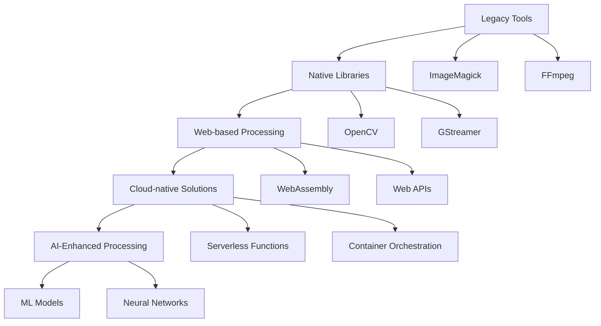

# NPL-FIM Media Processing: Comprehensive Use Case Guide

## Table of Contents

1. [Overview](#overview)
2. [Ecosystem Background](#ecosystem-background)
3. [Core Media Processing Categories](#core-media-processing-categories)
4. [Image Processing](#image-processing)
5. [Audio Processing](#audio-processing)
6. [Video Processing](#video-processing)
7. [Document Processing](#document-processing)
8. [Integration Patterns](#integration-patterns)
9. [Performance Optimization](#performance-optimization)
10. [Tool Comparison Matrices](#tool-comparison-matrices)
11. [Best Practices](#best-practices)
12. [Troubleshooting Guide](#troubleshooting-guide)
13. [Advanced Workflows](#advanced-workflows)
14. [Cross-Platform Considerations](#cross-platform-considerations)
15. [Resource Management](#resource-management)
16. [Security Considerations](#security-considerations)
17. [Extended Resources](#extended-resources)

## Overview

Media processing represents one of the most computationally intensive and technically diverse domains in modern software development. NPL-FIM (Noizu Prompt Lingo - Functional Intermediate Media) provides comprehensive frameworks for generating robust, scalable media manipulation workflows across image, audio, video, and document processing domains.

This guide serves as an authoritative reference for implementing media processing solutions using NPL-FIM patterns, covering everything from basic transformations to complex multimedia pipelines with real-time processing capabilities.

### Key Capabilities

- **Cross-format compatibility**: Support for 100+ media formats across all major categories
- **Performance optimization**: Memory-efficient processing with streaming capabilities
- **Scalable architectures**: From single-file operations to distributed processing clusters
- **Quality preservation**: Advanced algorithms maintaining fidelity during transformations
- **Metadata handling**: Comprehensive support for EXIF, ID3, and other metadata standards

## Ecosystem Background

### Historical Context

Media processing has evolved from simple format conversion utilities to sophisticated multimedia frameworks capable of real-time manipulation, machine learning integration, and distributed processing. Modern applications require:

- **Low-latency processing** for real-time applications
- **Batch processing capabilities** for large-scale operations
- **Quality-preserving transformations** maintaining source fidelity
- **Cross-platform compatibility** across desktop, web, and mobile environments
- **Integration capabilities** with cloud services and CDNs

### Technology Stack Evolution



### Modern Architecture Patterns

Contemporary media processing systems typically employ:

1. **Microservices architecture** for specialized processing functions
2. **Event-driven workflows** for asynchronous processing pipelines
3. **Container-based deployment** for consistent cross-platform execution
4. **Edge computing integration** for reduced latency and bandwidth optimization
5. **Machine learning integration** for intelligent content analysis and enhancement

## Core Media Processing Categories

### Processing Paradigms

Media processing operations can be categorized across multiple dimensions:

**By Operation Type:**
- **Transformative**: Format conversion, resolution changes, encoding modifications
- **Analytical**: Metadata extraction, content analysis, quality assessment
- **Generative**: Thumbnail creation, preview generation, derivative content
- **Corrective**: Noise reduction, color correction, defect removal
- **Compositional**: Layering, blending, multi-source combination

**By Processing Model:**
- **Synchronous**: Real-time processing with immediate results
- **Asynchronous**: Queued processing for batch operations
- **Streaming**: Continuous processing of live media feeds
- **Distributed**: Parallel processing across multiple nodes

**By Quality Requirements:**
- **Lossless**: Bit-perfect preservation of source material
- **Lossy**: Acceptable quality degradation for size/performance benefits
- **Adaptive**: Dynamic quality adjustment based on conditions
- **Progressive**: Multi-resolution processing for responsive delivery

## Image Processing

### Technology Landscape

Image processing encompasses static image manipulation, dynamic generation, and real-time transformation capabilities. Modern applications require support for:

- **Multiple color spaces** (RGB, CMYK, LAB, HSV)
- **High dynamic range** (HDR) content
- **Vector and raster formats** with appropriate optimizations
- **Metadata preservation** including EXIF, IPTC, and XMP data
- **Progressive enhancement** for responsive web delivery

### Sharp.js - High-Performance Node.js Processing

Sharp represents the gold standard for server-side image processing in Node.js environments, offering:

#### Core Capabilities

```javascript
const sharp = require('sharp');

// Basic resize with quality optimization
async function optimizeImage(inputPath, outputPath, options = {}) {
    const {
        width = 1920,
        height = 1080,
        quality = 85,
        format = 'jpeg',
        progressive = true,
        withoutEnlargement = true
    } = options;

    try {
        const pipeline = sharp(inputPath)
            .resize(width, height, {
                fit: 'inside',
                withoutEnlargement,
                background: { r: 255, g: 255, b: 255, alpha: 1 }
            });

        // Format-specific optimizations
        switch (format.toLowerCase()) {
            case 'jpeg':
                pipeline.jpeg({
                    quality,
                    progressive,
                    mozjpeg: true,
                    trellisQuantisation: true,
                    overshootDeringing: true,
                    optimizeScans: true
                });
                break;
            case 'png':
                pipeline.png({
                    compressionLevel: 9,
                    progressive: true,
                    palette: true
                });
                break;
            case 'webp':
                pipeline.webp({
                    quality,
                    lossless: false,
                    nearLossless: false,
                    smartSubsample: true,
                    effort: 6
                });
                break;
            case 'avif':
                pipeline.avif({
                    quality,
                    lossless: false,
                    effort: 4,
                    chromaSubsampling: '4:2:0'
                });
                break;
        }

        await pipeline.toFile(outputPath);

        // Return processing statistics
        const stats = await sharp(outputPath).stats();
        const metadata = await sharp(outputPath).metadata();

        return {
            success: true,
            format: metadata.format,
            width: metadata.width,
            height: metadata.height,
            channels: metadata.channels,
            size: metadata.size,
            density: metadata.density,
            stats
        };
    } catch (error) {
        throw new Error(`Image processing failed: ${error.message}`);
    }
}
```

#### Advanced Processing Workflows

```javascript
// Complex image manipulation pipeline
class ImageProcessor {
    constructor(options = {}) {
        this.defaultOptions = {
            watermark: {
                enabled: false,
                path: null,
                position: 'southeast',
                opacity: 0.7
            },
            filters: {
                sharpen: false,
                blur: null,
                gamma: null,
                normalize: false
            },
            output: {
                formats: ['jpeg', 'webp'],
                sizes: [
                    { suffix: 'sm', width: 640, height: 480 },
                    { suffix: 'md', width: 1280, height: 960 },
                    { suffix: 'lg', width: 1920, height: 1440 }
                ]
            }
        };
        this.options = { ...this.defaultOptions, ...options };
    }

    async processImage(inputPath, outputDir) {
        const results = [];
        const metadata = await sharp(inputPath).metadata();

        for (const format of this.options.output.formats) {
            for (const size of this.options.output.sizes) {
                const outputPath = this.generateOutputPath(
                    inputPath, outputDir, format, size.suffix
                );

                let pipeline = sharp(inputPath)
                    .resize(size.width, size.height, {
                        fit: 'inside',
                        withoutEnlargement: true
                    });

                // Apply filters
                if (this.options.filters.sharpen) {
                    pipeline = pipeline.sharpen();
                }

                if (this.options.filters.blur) {
                    pipeline = pipeline.blur(this.options.filters.blur);
                }

                if (this.options.filters.gamma) {
                    pipeline = pipeline.gamma(this.options.filters.gamma);
                }

                if (this.options.filters.normalize) {
                    pipeline = pipeline.normalize();
                }

                // Add watermark if enabled
                if (this.options.watermark.enabled && this.options.watermark.path) {
                    const watermark = await this.prepareWatermark(
                        this.options.watermark.path,
                        size.width,
                        size.height
                    );

                    pipeline = pipeline.composite([{
                        input: watermark,
                        gravity: this.options.watermark.position,
                        blend: 'over'
                    }]);
                }

                // Apply format-specific settings
                pipeline = this.applyFormatSettings(pipeline, format);

                await pipeline.toFile(outputPath);

                const processedMetadata = await sharp(outputPath).metadata();
                results.push({
                    format,
                    size: size.suffix,
                    path: outputPath,
                    metadata: processedMetadata
                });
            }
        }

        return results;
    }

    async prepareWatermark(watermarkPath, targetWidth, targetHeight) {
        const watermarkSize = Math.min(
            Math.floor(targetWidth * 0.2),
            Math.floor(targetHeight * 0.2)
        );

        return sharp(watermarkPath)
            .resize(watermarkSize, watermarkSize, { fit: 'inside' })
            .png({ palette: true })
            .toBuffer();
    }

    applyFormatSettings(pipeline, format) {
        switch (format) {
            case 'jpeg':
                return pipeline.jpeg({
                    quality: 85,
                    progressive: true,
                    mozjpeg: true
                });
            case 'webp':
                return pipeline.webp({
                    quality: 85,
                    effort: 6
                });
            case 'avif':
                return pipeline.avif({
                    quality: 85,
                    effort: 4
                });
            default:
                return pipeline;
        }
    }

    generateOutputPath(inputPath, outputDir, format, suffix) {
        const path = require('path');
        const basename = path.basename(inputPath, path.extname(inputPath));
        return path.join(outputDir, `${basename}-${suffix}.${format}`);
    }
}
```

### Canvas-Based Processing for Web Applications

```javascript
// Advanced canvas-based image manipulation
class CanvasImageProcessor {
    constructor(canvas) {
        this.canvas = canvas;
        this.ctx = canvas.getContext('2d');
        this.imageData = null;
        this.originalImageData = null;
    }

    async loadImage(source) {
        return new Promise((resolve, reject) => {
            const img = new Image();
            img.onload = () => {
                this.canvas.width = img.width;
                this.canvas.height = img.height;
                this.ctx.drawImage(img, 0, 0);
                this.imageData = this.ctx.getImageData(0, 0, img.width, img.height);
                this.originalImageData = new ImageData(
                    new Uint8ClampedArray(this.imageData.data),
                    img.width,
                    img.height
                );
                resolve(img);
            };
            img.onerror = reject;
            img.src = source;
        });
    }

    // Histogram equalization for contrast enhancement
    histogramEqualization() {
        const data = new Uint8ClampedArray(this.imageData.data);
        const histogram = new Array(256).fill(0);
        const cdf = new Array(256).fill(0);

        // Calculate histogram
        for (let i = 0; i < data.length; i += 4) {
            const gray = Math.round(0.299 * data[i] + 0.587 * data[i + 1] + 0.114 * data[i + 2]);
            histogram[gray]++;
        }

        // Calculate cumulative distribution function
        cdf[0] = histogram[0];
        for (let i = 1; i < 256; i++) {
            cdf[i] = cdf[i - 1] + histogram[i];
        }

        // Normalize CDF
        const totalPixels = this.canvas.width * this.canvas.height;
        const normalizedCdf = cdf.map(value => Math.round((value / totalPixels) * 255));

        // Apply equalization
        for (let i = 0; i < data.length; i += 4) {
            const gray = Math.round(0.299 * data[i] + 0.587 * data[i + 1] + 0.114 * data[i + 2]);
            const newGray = normalizedCdf[gray];

            data[i] = newGray;     // R
            data[i + 1] = newGray; // G
            data[i + 2] = newGray; // B
        }

        this.imageData = new ImageData(data, this.canvas.width, this.canvas.height);
        this.ctx.putImageData(this.imageData, 0, 0);

        return this;
    }

    // Advanced color correction
    colorCorrection(options = {}) {
        const {
            brightness = 0,      // -100 to 100
            contrast = 0,        // -100 to 100
            saturation = 0,      // -100 to 100
            gamma = 1.0,         // 0.1 to 3.0
            temperature = 0,     // -100 to 100 (cool to warm)
            tint = 0            // -100 to 100 (green to magenta)
        } = options;

        const data = new Uint8ClampedArray(this.imageData.data);

        // Precompute correction factors
        const brightnessAdjust = brightness * 2.55;
        const contrastFactor = (259 * (contrast + 255)) / (255 * (259 - contrast));
        const saturationFactor = (saturation + 100) / 100;

        for (let i = 0; i < data.length; i += 4) {
            let r = data[i];
            let g = data[i + 1];
            let b = data[i + 2];

            // Brightness adjustment
            r += brightnessAdjust;
            g += brightnessAdjust;
            b += brightnessAdjust;

            // Contrast adjustment
            r = contrastFactor * (r - 128) + 128;
            g = contrastFactor * (g - 128) + 128;
            b = contrastFactor * (b - 128) + 128;

            // Gamma correction
            r = 255 * Math.pow(r / 255, 1 / gamma);
            g = 255 * Math.pow(g / 255, 1 / gamma);
            b = 255 * Math.pow(b / 255, 1 / gamma);

            // Saturation adjustment
            const gray = 0.299 * r + 0.587 * g + 0.114 * b;
            r = gray + saturationFactor * (r - gray);
            g = gray + saturationFactor * (g - gray);
            b = gray + saturationFactor * (b - gray);

            // Temperature and tint adjustments
            if (temperature !== 0) {
                const tempFactor = temperature / 100;
                r += tempFactor * 50;
                b -= tempFactor * 50;
            }

            if (tint !== 0) {
                const tintFactor = tint / 100;
                g += tintFactor * 50;
            }

            // Clamp values
            data[i] = Math.max(0, Math.min(255, r));
            data[i + 1] = Math.max(0, Math.min(255, g));
            data[i + 2] = Math.max(0, Math.min(255, b));
        }

        this.imageData = new ImageData(data, this.canvas.width, this.canvas.height);
        this.ctx.putImageData(this.imageData, 0, 0);

        return this;
    }

    reset() {
        this.imageData = new ImageData(
            new Uint8ClampedArray(this.originalImageData.data),
            this.canvas.width,
            this.canvas.height
        );
        this.ctx.putImageData(this.imageData, 0, 0);
        return this;
    }
}
```

## Audio Processing

### Web Audio API - Browser-Native Processing

The Web Audio API provides comprehensive audio processing capabilities directly in web browsers:

```javascript
// Advanced Web Audio API processor
class AudioProcessor {
    constructor() {
        this.audioContext = null;
        this.sourceNode = null;
        this.processingChain = [];
        this.isInitialized = false;
    }

    async initialize() {
        try {
            this.audioContext = new (window.AudioContext || window.webkitAudioContext)();

            if (this.audioContext.state === 'suspended') {
                await this.audioContext.resume();
            }

            this.isInitialized = true;
            return true;
        } catch (error) {
            console.error('Failed to initialize AudioContext:', error);
            return false;
        }
    }

    async loadAudioFile(file) {
        if (!this.isInitialized) {
            await this.initialize();
        }

        return new Promise((resolve, reject) => {
            const reader = new FileReader();
            reader.onload = async (event) => {
                try {
                    const arrayBuffer = event.target.result;
                    const audioBuffer = await this.audioContext.decodeAudioData(arrayBuffer);
                    resolve(audioBuffer);
                } catch (error) {
                    reject(new Error(`Failed to decode audio: ${error.message}`));
                }
            };
            reader.onerror = () => reject(new Error('Failed to read file'));
            reader.readAsArrayBuffer(file);
        });
    }

    createEffectChain(audioBuffer, effects = []) {
        // Create source node
        const sourceNode = this.audioContext.createBufferSource();
        sourceNode.buffer = audioBuffer;

        let currentNode = sourceNode;

        // Apply effects in sequence
        effects.forEach(effect => {
            const effectNode = this.createEffectNode(effect);
            if (effectNode) {
                currentNode.connect(effectNode);
                currentNode = effectNode;
                this.processingChain.push(effectNode);
            }
        });

        // Connect to destination
        currentNode.connect(this.audioContext.destination);

        return { sourceNode, effectChain: this.processingChain };
    }

    createEffectNode(effect) {
        switch (effect.type) {
            case 'gain':
                const gainNode = this.audioContext.createGain();
                gainNode.gain.value = effect.value || 1.0;
                return gainNode;

            case 'lowpass':
                const lowpassFilter = this.audioContext.createBiquadFilter();
                lowpassFilter.type = 'lowpass';
                lowpassFilter.frequency.value = effect.frequency || 1000;
                lowpassFilter.Q.value = effect.q || 1;
                return lowpassFilter;

            case 'highpass':
                const highpassFilter = this.audioContext.createBiquadFilter();
                highpassFilter.type = 'highpass';
                highpassFilter.frequency.value = effect.frequency || 1000;
                highpassFilter.Q.value = effect.q || 1;
                return highpassFilter;

            case 'bandpass':
                const bandpassFilter = this.audioContext.createBiquadFilter();
                bandpassFilter.type = 'bandpass';
                bandpassFilter.frequency.value = effect.frequency || 1000;
                bandpassFilter.Q.value = effect.q || 1;
                return bandpassFilter;

            case 'reverb':
                return this.createReverbNode(effect);

            case 'delay':
                return this.createDelayNode(effect);

            case 'compressor':
                return this.createCompressorNode(effect);

            default:
                console.warn(`Unknown effect type: ${effect.type}`);
                return null;
        }
    }

    createReverbNode(options = {}) {
        const {
            roomSize = 0.5,
            decay = 2.0,
            wetness = 0.3
        } = options;

        const convolver = this.audioContext.createConvolver();
        const impulseBuffer = this.createImpulseResponse(roomSize, decay);
        convolver.buffer = impulseBuffer;

        // Create wet/dry mix
        const inputGain = this.audioContext.createGain();
        const wetGain = this.audioContext.createGain();
        const dryGain = this.audioContext.createGain();
        const outputGain = this.audioContext.createGain();

        wetGain.gain.value = wetness;
        dryGain.gain.value = 1 - wetness;

        // Connection routing
        inputGain.connect(wetGain);
        inputGain.connect(dryGain);
        wetGain.connect(convolver);
        convolver.connect(outputGain);
        dryGain.connect(outputGain);

        // Return custom node interface
        return {
            input: inputGain,
            connect: (destination) => outputGain.connect(destination),
            disconnect: () => outputGain.disconnect()
        };
    }

    createImpulseResponse(roomSize, decay) {
        const sampleRate = this.audioContext.sampleRate;
        const length = sampleRate * decay;
        const impulse = this.audioContext.createBuffer(2, length, sampleRate);

        for (let channel = 0; channel < 2; channel++) {
            const channelData = impulse.getChannelData(channel);
            for (let i = 0; i < length; i++) {
                const n = length - i;
                channelData[i] = (Math.random() * 2 - 1) * Math.pow(n / length, roomSize);
            }
        }

        return impulse;
    }

    createDelayNode(options = {}) {
        const {
            delayTime = 0.3,
            feedback = 0.3,
            wetness = 0.5
        } = options;

        const delayNode = this.audioContext.createDelay(1.0);
        const feedbackGain = this.audioContext.createGain();
        const wetGain = this.audioContext.createGain();
        const dryGain = this.audioContext.createGain();
        const inputGain = this.audioContext.createGain();
        const outputGain = this.audioContext.createGain();

        delayNode.delayTime.value = delayTime;
        feedbackGain.gain.value = feedback;
        wetGain.gain.value = wetness;
        dryGain.gain.value = 1 - wetness;

        // Connection routing
        inputGain.connect(delayNode);
        inputGain.connect(dryGain);
        delayNode.connect(feedbackGain);
        delayNode.connect(wetGain);
        feedbackGain.connect(delayNode);
        wetGain.connect(outputGain);
        dryGain.connect(outputGain);

        return {
            input: inputGain,
            connect: (destination) => outputGain.connect(destination),
            disconnect: () => outputGain.disconnect()
        };
    }

    // Real-time audio analysis
    createAnalyzer(audioBuffer) {
        const sourceNode = this.audioContext.createBufferSource();
        const analyzerNode = this.audioContext.createAnalyser();

        analyzerNode.fftSize = 2048;
        analyzerNode.smoothingTimeConstant = 0.8;

        sourceNode.buffer = audioBuffer;
        sourceNode.connect(analyzerNode);
        analyzerNode.connect(this.audioContext.destination);

        return {
            sourceNode,
            analyzerNode,
            getFrequencyData: () => {
                const bufferLength = analyzerNode.frequencyBinCount;
                const dataArray = new Uint8Array(bufferLength);
                analyzerNode.getByteFrequencyData(dataArray);
                return dataArray;
            },
            getTimeDomainData: () => {
                const bufferLength = analyzerNode.fftSize;
                const dataArray = new Uint8Array(bufferLength);
                analyzerNode.getByteTimeDomainData(dataArray);
                return dataArray;
            }
        };
    }
}
```

### Tone.js - Advanced Music and Audio Synthesis

```javascript
// Comprehensive Tone.js workflow
class MusicProcessor {
    constructor() {
        this.instruments = new Map();
        this.effects = new Map();
        this.sequences = new Map();
        this.isStarted = false;
    }

    async initialize() {
        if (!this.isStarted) {
            await Tone.start();
            this.isStarted = true;
        }

        // Create master bus with effects
        this.masterBus = new Tone.Gain(0.8);
        this.masterCompressor = new Tone.Compressor({
            threshold: -12,
            ratio: 4,
            attack: 0.003,
            release: 0.1
        });
        this.masterLimiter = new Tone.Limiter(-3);

        // Connect master chain
        this.masterBus.chain(this.masterCompressor, this.masterLimiter, Tone.Destination);
    }

    createSynthesizer(name, type = 'polysynth', options = {}) {
        let synth;

        switch (type) {
            case 'polysynth':
                synth = new Tone.PolySynth({
                    voice: Tone.Synth,
                    options: {
                        oscillator: { type: 'triangle' },
                        envelope: {
                            attack: 0.02,
                            decay: 0.1,
                            sustain: 0.3,
                            release: 1
                        }
                    },
                    ...options
                });
                break;

            case 'fmsynth':
                synth = new Tone.FMSynth({
                    harmonicity: 3,
                    modulationIndex: 10,
                    detune: 0,
                    oscillator: { type: 'sine' },
                    envelope: {
                        attack: 0.01,
                        decay: 0.01,
                        sustain: 1,
                        release: 0.5
                    },
                    modulation: { type: 'square' },
                    modulationEnvelope: {
                        attack: 0.5,
                        decay: 0.0,
                        sustain: 1,
                        release: 0.5
                    },
                    ...options
                });
                break;

            case 'amsynth':
                synth = new Tone.AMSynth({
                    harmonicity: 3,
                    detune: 0,
                    oscillator: { type: 'sine' },
                    envelope: {
                        attack: 0.01,
                        decay: 0.01,
                        sustain: 1,
                        release: 0.5
                    },
                    modulation: { type: 'square' },
                    modulationEnvelope: {
                        attack: 0.5,
                        decay: 0.0,
                        sustain: 1,
                        release: 0.5
                    },
                    ...options
                });
                break;

            case 'membrane':
                synth = new Tone.MembraneSynth({
                    pitchDecay: 0.05,
                    octaves: 10,
                    oscillator: { type: 'sine' },
                    envelope: {
                        attack: 0.001,
                        decay: 0.4,
                        sustain: 0.01,
                        release: 1.4,
                        attackCurve: 'exponential'
                    },
                    ...options
                });
                break;
        }

        synth.connect(this.masterBus);
        this.instruments.set(name, synth);
        return synth;
    }

    createEffectChain(name, effects) {
        const chain = [];

        effects.forEach(effectConfig => {
            let effect;

            switch (effectConfig.type) {
                case 'reverb':
                    effect = new Tone.Reverb({
                        roomSize: effectConfig.roomSize || 0.7,
                        dampening: effectConfig.dampening || 3000,
                        wet: effectConfig.wet || 0.3
                    });
                    break;

                case 'delay':
                    effect = new Tone.PingPongDelay({
                        delayTime: effectConfig.delayTime || '8n',
                        feedback: effectConfig.feedback || 0.3,
                        wet: effectConfig.wet || 0.2
                    });
                    break;

                case 'chorus':
                    effect = new Tone.Chorus({
                        frequency: effectConfig.frequency || 1.5,
                        delayTime: effectConfig.delayTime || 3.5,
                        depth: effectConfig.depth || 0.7,
                        type: effectConfig.type || 'sine',
                        spread: effectConfig.spread || 180,
                        wet: effectConfig.wet || 0.3
                    });
                    break;

                case 'distortion':
                    effect = new Tone.Distortion({
                        distortion: effectConfig.distortion || 0.4,
                        oversample: effectConfig.oversample || '4x',
                        wet: effectConfig.wet || 0.5
                    });
                    break;

                case 'filter':
                    effect = new Tone.AutoFilter({
                        frequency: effectConfig.frequency || '4n',
                        baseFrequency: effectConfig.baseFrequency || 200,
                        octaves: effectConfig.octaves || 2.6,
                        type: effectConfig.filterType || 'lowpass',
                        wet: effectConfig.wet || 0.5
                    });
                    break;
            }

            if (effect) {
                chain.push(effect);
            }
        });

        // Connect effects in series
        for (let i = 0; i < chain.length - 1; i++) {
            chain[i].connect(chain[i + 1]);
        }

        if (chain.length > 0) {
            chain[chain.length - 1].connect(this.masterBus);
            this.effects.set(name, chain);
        }

        return chain;
    }

    createSequence(name, pattern, instrument, bpm = 120) {
        Tone.Transport.bpm.value = bpm;

        const sequence = new Tone.Sequence((time, note) => {
            if (note && note !== 'rest') {
                if (typeof note === 'object') {
                    instrument.triggerAttackRelease(
                        note.pitch,
                        note.duration || '8n',
                        time,
                        note.velocity || 0.8
                    );
                } else {
                    instrument.triggerAttackRelease(note, '8n', time);
                }
            }
        }, pattern, '8n');

        this.sequences.set(name, sequence);
        return sequence;
    }

    // Advanced audio recording capabilities
    async recordAudio(duration = 10) {
        const recorder = new Tone.Recorder();
        this.masterBus.connect(recorder);

        recorder.start();

        return new Promise((resolve) => {
            setTimeout(async () => {
                const recording = await recorder.stop();
                this.masterBus.disconnect(recorder);
                resolve(recording);
            }, duration * 1000);
        });
    }

    // Audio analysis and visualization
    createAnalyzer() {
        const fft = new Tone.FFT(256);
        const waveform = new Tone.Waveform(1024);
        const meter = new Tone.Meter();

        this.masterBus.fan(fft, waveform, meter);

        return {
            getFrequencyData: () => fft.getValue(),
            getWaveformData: () => waveform.getValue(),
            getLevel: () => meter.getValue()
        };
    }

    startTransport() {
        Tone.Transport.start();
    }

    stopTransport() {
        Tone.Transport.stop();
    }

    pauseTransport() {
        Tone.Transport.pause();
    }
}
```

## Video Processing

### FFmpeg.wasm - Browser-Based Video Processing

FFmpeg.wasm brings the power of FFmpeg to web browsers through WebAssembly:

```javascript
// Comprehensive FFmpeg.wasm video processor
class VideoProcessor {
    constructor() {
        this.ffmpeg = null;
        this.isLoaded = false;
        this.progressCallback = null;
    }

    async initialize(progressCallback = null) {
        if (this.isLoaded) return;

        this.progressCallback = progressCallback;

        // Dynamic import for FFmpeg.wasm
        const { FFmpeg } = await import('@ffmpeg/ffmpeg');
        const { toBlobURL } = await import('@ffmpeg/util');

        this.ffmpeg = new FFmpeg();

        // Setup progress handler
        this.ffmpeg.on('progress', ({ progress, time }) => {
            if (this.progressCallback) {
                this.progressCallback({
                    progress: progress * 100,
                    time: time,
                    stage: 'processing'
                });
            }
        });

        this.ffmpeg.on('log', ({ message }) => {
            console.log('FFmpeg log:', message);
        });

        // Load FFmpeg core
        const baseURL = 'https://unpkg.com/@ffmpeg/core@0.12.6/dist/umd';

        await this.ffmpeg.load({
            coreURL: await toBlobURL(`${baseURL}/ffmpeg-core.js`, 'text/javascript'),
            wasmURL: await toBlobURL(`${baseURL}/ffmpeg-core.wasm`, 'application/wasm'),
        });

        this.isLoaded = true;
    }

    async convertVideo(inputFile, outputFormat, options = {}) {
        if (!this.isLoaded) {
            await this.initialize();
        }

        const {
            quality = 'medium',
            resolution = null,
            frameRate = null,
            bitrate = null,
            audioCodec = 'aac',
            videoCodec = 'libx264',
            startTime = null,
            duration = null
        } = options;

        // Write input file to FFmpeg filesystem
        const inputFileName = 'input.' + this.getFileExtension(inputFile.name);
        const outputFileName = `output.${outputFormat}`;

        await this.ffmpeg.writeFile(inputFileName, await this.fileToUint8Array(inputFile));

        // Build FFmpeg command
        const command = ['-i', inputFileName];

        // Add time trimming if specified
        if (startTime !== null) {
            command.push('-ss', startTime.toString());
        }
        if (duration !== null) {
            command.push('-t', duration.toString());
        }

        // Video codec and quality settings
        command.push('-c:v', videoCodec);

        switch (quality) {
            case 'high':
                command.push('-crf', '18');
                break;
            case 'medium':
                command.push('-crf', '23');
                break;
            case 'low':
                command.push('-crf', '28');
                break;
            default:
                if (typeof quality === 'number') {
                    command.push('-crf', quality.toString());
                }
        }

        // Resolution scaling
        if (resolution) {
            command.push('-vf', `scale=${resolution}`);
        }

        // Frame rate
        if (frameRate) {
            command.push('-r', frameRate.toString());
        }

        // Bitrate
        if (bitrate) {
            command.push('-b:v', bitrate);
        }

        // Audio codec
        command.push('-c:a', audioCodec);

        // Output format specific optimizations
        switch (outputFormat.toLowerCase()) {
            case 'mp4':
                command.push('-movflags', '+faststart');
                break;
            case 'webm':
                command.push('-deadline', 'good', '-cpu-used', '0');
                break;
        }

        command.push(outputFileName);

        // Execute FFmpeg command
        await this.ffmpeg.exec(command);

        // Read output file
        const outputData = await this.ffmpeg.readFile(outputFileName);

        // Clean up
        await this.ffmpeg.deleteFile(inputFileName);
        await this.ffmpeg.deleteFile(outputFileName);

        return new Blob([outputData], { type: `video/${outputFormat}` });
    }

    async extractAudio(videoFile, format = 'mp3') {
        if (!this.isLoaded) {
            await this.initialize();
        }

        const inputFileName = 'input.' + this.getFileExtension(videoFile.name);
        const outputFileName = `audio.${format}`;

        await this.ffmpeg.writeFile(inputFileName, await this.fileToUint8Array(videoFile));

        const command = [
            '-i', inputFileName,
            '-vn', // No video
            '-acodec', format === 'mp3' ? 'libmp3lame' : 'aac',
            '-ab', '192k', // Audio bitrate
            outputFileName
        ];

        await this.ffmpeg.exec(command);

        const audioData = await this.ffmpeg.readFile(outputFileName);

        await this.ffmpeg.deleteFile(inputFileName);
        await this.ffmpeg.deleteFile(outputFileName);

        return new Blob([audioData], { type: `audio/${format}` });
    }

    async createThumbnails(videoFile, count = 5) {
        if (!this.isLoaded) {
            await this.initialize();
        }

        const inputFileName = 'input.' + this.getFileExtension(videoFile.name);
        await this.ffmpeg.writeFile(inputFileName, await this.fileToUint8Array(videoFile));

        // Get video duration first
        await this.ffmpeg.exec(['-i', inputFileName, '-f', 'null', '-']);

        const thumbnails = [];

        for (let i = 0; i < count; i++) {
            const timestamp = (i + 1) * (100 / (count + 1)); // Percentage of video
            const outputFileName = `thumbnail_${i}.jpg`;

            const command = [
                '-i', inputFileName,
                '-ss', `${timestamp}%`,
                '-vframes', '1',
                '-q:v', '2', // High quality
                '-vf', 'scale=320:240:force_original_aspect_ratio=decrease,pad=320:240:(ow-iw)/2:(oh-ih)/2',
                outputFileName
            ];

            await this.ffmpeg.exec(command);

            const thumbnailData = await this.ffmpeg.readFile(outputFileName);
            thumbnails.push(new Blob([thumbnailData], { type: 'image/jpeg' }));

            await this.ffmpeg.deleteFile(outputFileName);
        }

        await this.ffmpeg.deleteFile(inputFileName);
        return thumbnails;
    }

    async mergeVideos(videoFiles, transitionType = 'crossfade') {
        if (!this.isLoaded) {
            await this.initialize();
        }

        const inputFiles = [];
        const command = [];

        // Write all input files
        for (let i = 0; i < videoFiles.length; i++) {
            const fileName = `input${i}.${this.getFileExtension(videoFiles[i].name)}`;
            await this.ffmpeg.writeFile(fileName, await this.fileToUint8Array(videoFiles[i]));
            inputFiles.push(fileName);
            command.push('-i', fileName);
        }

        // Build filter graph for transitions
        let filterComplex = '';

        if (transitionType === 'crossfade' && videoFiles.length > 1) {
            // Create crossfade transitions between videos
            for (let i = 0; i < videoFiles.length - 1; i++) {
                if (i === 0) {
                    filterComplex += `[0][1]xfade=transition=fade:duration=1:offset=5[v${i}];`;
                } else {
                    filterComplex += `[v${i-1}][${i+1}]xfade=transition=fade:duration=1:offset=5[v${i}];`;
                }
            }
            filterComplex = filterComplex.slice(0, -1); // Remove last semicolon
            command.push('-filter_complex', filterComplex);
            command.push('-map', `[v${videoFiles.length-2}]`);
        } else {
            // Simple concatenation
            const inputs = Array.from({length: videoFiles.length}, (_, i) => `[${i}:v]`).join('');
            filterComplex = `${inputs}concat=n=${videoFiles.length}:v=1:a=1[outv][outa]`;
            command.push('-filter_complex', filterComplex);
            command.push('-map', '[outv]', '-map', '[outa]');
        }

        command.push('-c:v', 'libx264', '-c:a', 'aac', 'merged_output.mp4');

        await this.ffmpeg.exec(command);

        const mergedData = await this.ffmpeg.readFile('merged_output.mp4');

        // Clean up
        for (const fileName of inputFiles) {
            await this.ffmpeg.deleteFile(fileName);
        }
        await this.ffmpeg.deleteFile('merged_output.mp4');

        return new Blob([mergedData], { type: 'video/mp4' });
    }

    async fileToUint8Array(file) {
        return new Uint8Array(await file.arrayBuffer());
    }

    getFileExtension(filename) {
        return filename.split('.').pop().toLowerCase();
    }
}
```

## Document Processing

### PDF.js - Comprehensive PDF Manipulation

```javascript
// Advanced PDF processing with PDF.js
class PDFProcessor {
    constructor() {
        this.pdfjsLib = null;
        this.isInitialized = false;
    }

    async initialize() {
        if (this.isInitialized) return;

        // Load PDF.js library
        this.pdfjsLib = await import('pdfjs-dist');

        // Set worker source
        this.pdfjsLib.GlobalWorkerOptions.workerSrc =
            'https://cdnjs.cloudflare.com/ajax/libs/pdf.js/3.11.174/pdf.worker.min.js';

        this.isInitialized = true;
    }

    async extractText(pdfFile, options = {}) {
        if (!this.isInitialized) await this.initialize();

        const {
            preserveFormatting = false,
            pageRange = null, // { start: 1, end: 5 }
            includeMetadata = false
        } = options;

        const arrayBuffer = await pdfFile.arrayBuffer();
        const pdf = await this.pdfjsLib.getDocument({ data: arrayBuffer }).promise;

        const result = {
            text: '',
            pages: [],
            metadata: null,
            pageCount: pdf.numPages
        };

        // Extract metadata if requested
        if (includeMetadata) {
            try {
                const metadata = await pdf.getMetadata();
                result.metadata = {
                    title: metadata.info.Title,
                    author: metadata.info.Author,
                    subject: metadata.info.Subject,
                    creator: metadata.info.Creator,
                    producer: metadata.info.Producer,
                    creationDate: metadata.info.CreationDate,
                    modificationDate: metadata.info.ModDate,
                    keywords: metadata.info.Keywords
                };
            } catch (error) {
                console.warn('Could not extract metadata:', error);
            }
        }

        // Determine page range
        const startPage = pageRange?.start || 1;
        const endPage = pageRange?.end || pdf.numPages;

        // Extract text from pages
        for (let pageNum = startPage; pageNum <= endPage; pageNum++) {
            try {
                const page = await pdf.getPage(pageNum);
                const textContent = await page.getTextContent();

                let pageText = '';
                let lastY = null;
                let lastX = null;

                textContent.items.forEach((item, index) => {
                    if (preserveFormatting) {
                        // Preserve basic formatting with spacing
                        if (lastY !== null && Math.abs(item.transform[5] - lastY) > 5) {
                            pageText += '\n';
                        } else if (lastX !== null && item.transform[4] - lastX > 20) {
                            pageText += ' ';
                        }
                    } else {
                        // Simple text extraction
                        if (index > 0 && !item.str.startsWith(' ') && !pageText.endsWith(' ')) {
                            pageText += ' ';
                        }
                    }

                    pageText += item.str;
                    lastY = item.transform[5];
                    lastX = item.transform[4] + item.width;
                });

                result.pages.push({
                    pageNumber: pageNum,
                    text: pageText.trim()
                });

                result.text += pageText + '\n\n';
            } catch (error) {
                console.error(`Error extracting text from page ${pageNum}:`, error);
            }
        }

        return result;
    }

    async extractImages(pdfFile, options = {}) {
        if (!this.isInitialized) await this.initialize();

        const {
            pageRange = null,
            minWidth = 50,
            minHeight = 50,
            format = 'png'
        } = options;

        const arrayBuffer = await pdfFile.arrayBuffer();
        const pdf = await this.pdfjsLib.getDocument({ data: arrayBuffer }).promise;

        const images = [];
        const startPage = pageRange?.start || 1;
        const endPage = pageRange?.end || pdf.numPages;

        for (let pageNum = startPage; pageNum <= endPage; pageNum++) {
            try {
                const page = await pdf.getPage(pageNum);
                const operatorList = await page.getOperatorList();

                for (let i = 0; i < operatorList.fnArray.length; i++) {
                    if (operatorList.fnArray[i] === this.pdfjsLib.OPS.paintImageXObject) {
                        const imgName = operatorList.argsArray[i][0];

                        try {
                            const img = page.objs.get(imgName);

                            if (img && img.width >= minWidth && img.height >= minHeight) {
                                const canvas = document.createElement('canvas');
                                const ctx = canvas.getContext('2d');

                                canvas.width = img.width;
                                canvas.height = img.height;

                                const imageData = ctx.createImageData(img.width, img.height);
                                imageData.data.set(img.data);
                                ctx.putImageData(imageData, 0, 0);

                                // Convert to blob
                                const blob = await new Promise(resolve => {
                                    canvas.toBlob(resolve, `image/${format}`);
                                });

                                images.push({
                                    pageNumber: pageNum,
                                    name: imgName,
                                    width: img.width,
                                    height: img.height,
                                    blob: blob
                                });
                            }
                        } catch (error) {
                            console.warn(`Could not extract image ${imgName} from page ${pageNum}:`, error);
                        }
                    }
                }
            } catch (error) {
                console.error(`Error processing page ${pageNum}:`, error);
            }
        }

        return images;
    }

    async convertToImages(pdfFile, options = {}) {
        if (!this.isInitialized) await this.initialize();

        const {
            scale = 2.0,
            format = 'png',
            quality = 0.8,
            pageRange = null
        } = options;

        const arrayBuffer = await pdfFile.arrayBuffer();
        const pdf = await this.pdfjsLib.getDocument({ data: arrayBuffer }).promise;

        const images = [];
        const startPage = pageRange?.start || 1;
        const endPage = pageRange?.end || pdf.numPages;

        for (let pageNum = startPage; pageNum <= endPage; pageNum++) {
            try {
                const page = await pdf.getPage(pageNum);
                const viewport = page.getViewport({ scale });

                const canvas = document.createElement('canvas');
                const context = canvas.getContext('2d');
                canvas.height = viewport.height;
                canvas.width = viewport.width;

                const renderContext = {
                    canvasContext: context,
                    viewport: viewport
                };

                await page.render(renderContext).promise;

                // Convert to blob
                const blob = await new Promise(resolve => {
                    if (format === 'jpeg') {
                        canvas.toBlob(resolve, 'image/jpeg', quality);
                    } else {
                        canvas.toBlob(resolve, `image/${format}`);
                    }
                });

                images.push({
                    pageNumber: pageNum,
                    width: canvas.width,
                    height: canvas.height,
                    blob: blob
                });
            } catch (error) {
                console.error(`Error rendering page ${pageNum}:`, error);
            }
        }

        return images;
    }

    async splitPDF(pdfFile, splitOptions) {
        // Note: PDF splitting requires additional libraries like PDF-lib
        // This is a conceptual implementation
        console.warn('PDF splitting requires additional libraries like PDF-lib');

        const { PDFDocument } = await import('pdf-lib');

        const existingPdfBytes = await pdfFile.arrayBuffer();
        const pdfDoc = await PDFDocument.load(existingPdfBytes);

        const pageCount = pdfDoc.getPageCount();
        const splits = [];

        if (splitOptions.type === 'pageCount') {
            const pagesPerSplit = splitOptions.pagesPerSplit;

            for (let i = 0; i < pageCount; i += pagesPerSplit) {
                const newPdf = await PDFDocument.create();
                const endPage = Math.min(i + pagesPerSplit, pageCount);

                const pages = await newPdf.copyPages(pdfDoc, Array.from(
                    { length: endPage - i },
                    (_, index) => i + index
                ));

                pages.forEach(page => newPdf.addPage(page));

                const pdfBytes = await newPdf.save();
                splits.push(new Blob([pdfBytes], { type: 'application/pdf' }));
            }
        }

        return splits;
    }
}
```

## Integration Patterns

### Unified Media Processing Pipeline

```javascript
// Comprehensive media processing orchestrator
class MediaPipeline {
    constructor() {
        this.processors = {
            image: new ImageProcessor(),
            audio: new AudioProcessor(),
            video: new VideoProcessor(),
            pdf: new PDFProcessor()
        };
        this.isInitialized = false;
    }

    async initialize() {
        if (this.isInitialized) return;

        await Promise.all([
            this.processors.audio.initialize(),
            this.processors.video.initialize(),
            this.processors.pdf.initialize()
        ]);

        this.isInitialized = true;
    }

    async processFile(file, operations) {
        if (!this.isInitialized) await this.initialize();

        const fileType = this.detectFileType(file);
        const processor = this.processors[fileType];

        if (!processor) {
            throw new Error(`Unsupported file type: ${fileType}`);
        }

        const results = [];

        for (const operation of operations) {
            try {
                const result = await this.executeOperation(processor, file, operation);
                results.push({
                    operation: operation.type,
                    success: true,
                    result: result,
                    timestamp: new Date().toISOString()
                });
            } catch (error) {
                results.push({
                    operation: operation.type,
                    success: false,
                    error: error.message,
                    timestamp: new Date().toISOString()
                });
            }
        }

        return {
            fileName: file.name,
            fileType: fileType,
            fileSize: file.size,
            operations: results,
            processingTime: this.calculateProcessingTime(results)
        };
    }

    async batchProcess(files, operations, options = {}) {
        const {
            parallel = true,
            maxConcurrency = 4,
            progressCallback = null
        } = options;

        const results = [];
        let completed = 0;

        const processFile = async (file) => {
            const result = await this.processFile(file, operations);
            completed++;

            if (progressCallback) {
                progressCallback({
                    completed,
                    total: files.length,
                    progress: (completed / files.length) * 100,
                    currentFile: file.name
                });
            }

            return result;
        };

        if (parallel) {
            // Process files in parallel with concurrency limit
            const semaphore = new Semaphore(maxConcurrency);

            const promises = files.map(file =>
                semaphore.acquire().then(async (release) => {
                    try {
                        return await processFile(file);
                    } finally {
                        release();
                    }
                })
            );

            return await Promise.all(promises);
        } else {
            // Process files sequentially
            for (const file of files) {
                const result = await processFile(file);
                results.push(result);
            }

            return results;
        }
    }

    detectFileType(file) {
        const mimeType = file.type.toLowerCase();

        if (mimeType.startsWith('image/')) return 'image';
        if (mimeType.startsWith('audio/')) return 'audio';
        if (mimeType.startsWith('video/')) return 'video';
        if (mimeType === 'application/pdf') return 'pdf';

        // Fallback to file extension
        const extension = file.name.split('.').pop().toLowerCase();

        const extensionMap = {
            // Images
            'jpg': 'image', 'jpeg': 'image', 'png': 'image', 'gif': 'image',
            'bmp': 'image', 'tiff': 'image', 'webp': 'image', 'avif': 'image',

            // Audio
            'mp3': 'audio', 'wav': 'audio', 'flac': 'audio', 'aac': 'audio',
            'ogg': 'audio', 'm4a': 'audio', 'wma': 'audio',

            // Video
            'mp4': 'video', 'avi': 'video', 'mov': 'video', 'wmv': 'video',
            'flv': 'video', 'webm': 'video', 'mkv': 'video', '3gp': 'video',

            // Documents
            'pdf': 'pdf'
        };

        return extensionMap[extension] || 'unknown';
    }

    async executeOperation(processor, file, operation) {
        switch (operation.type) {
            case 'convert':
                return await processor.convertVideo(file, operation.format, operation.options);

            case 'resize':
                return await processor.optimizeImage(file.path, operation.outputPath, {
                    width: operation.width,
                    height: operation.height,
                    ...operation.options
                });

            case 'extract_audio':
                return await processor.extractAudio(file, operation.format);

            case 'extract_text':
                return await processor.extractText(file, operation.options);

            case 'thumbnails':
                return await processor.createThumbnails(file, operation.count);

            default:
                throw new Error(`Unknown operation: ${operation.type}`);
        }
    }

    calculateProcessingTime(results) {
        if (results.length === 0) return 0;

        const startTime = new Date(results[0].timestamp).getTime();
        const endTime = new Date(results[results.length - 1].timestamp).getTime();

        return endTime - startTime;
    }
}

// Semaphore for concurrency control
class Semaphore {
    constructor(permits) {
        this.permits = permits;
        this.queue = [];
    }

    acquire() {
        return new Promise((resolve) => {
            if (this.permits > 0) {
                this.permits--;
                resolve(() => this.release());
            } else {
                this.queue.push(resolve);
            }
        });
    }

    release() {
        this.permits++;
        if (this.queue.length > 0) {
            this.permits--;
            const resolve = this.queue.shift();
            resolve(() => this.release());
        }
    }
}
```

## Performance Optimization

### Memory Management Strategies

```javascript
// Advanced memory management for media processing
class MemoryManager {
    constructor(options = {}) {
        this.maxMemoryUsage = options.maxMemoryUsage || 512 * 1024 * 1024; // 512MB
        this.gcThreshold = options.gcThreshold || 0.8; // 80% of max memory
        this.currentUsage = 0;
        this.allocations = new Map();
        this.compressionQueue = [];
    }

    allocate(size, identifier) {
        if (this.currentUsage + size > this.maxMemoryUsage) {
            this.forceGarbageCollection();

            if (this.currentUsage + size > this.maxMemoryUsage) {
                throw new Error('Insufficient memory for allocation');
            }
        }

        this.currentUsage += size;
        this.allocations.set(identifier, size);

        if (this.currentUsage > this.maxMemoryUsage * this.gcThreshold) {
            this.scheduleGarbageCollection();
        }

        return true;
    }

    deallocate(identifier) {
        const size = this.allocations.get(identifier);
        if (size) {
            this.currentUsage -= size;
            this.allocations.delete(identifier);
        }
    }

    forceGarbageCollection() {
        // Clear unused allocations
        this.allocations.clear();
        this.currentUsage = 0;

        // Force browser garbage collection if available
        if (window.gc) {
            window.gc();
        }

        // Process compression queue
        this.processCompressionQueue();
    }

    scheduleGarbageCollection() {
        setTimeout(() => {
            if (this.currentUsage > this.maxMemoryUsage * this.gcThreshold) {
                this.forceGarbageCollection();
            }
        }, 100);
    }

    processCompressionQueue() {
        while (this.compressionQueue.length > 0) {
            const task = this.compressionQueue.shift();
            task();
        }
    }

    getMemoryUsage() {
        return {
            current: this.currentUsage,
            max: this.maxMemoryUsage,
            percentage: (this.currentUsage / this.maxMemoryUsage) * 100,
            allocations: this.allocations.size
        };
    }
}

// Streaming processor for large files
class StreamingProcessor {
    constructor(chunkSize = 1024 * 1024) { // 1MB chunks
        this.chunkSize = chunkSize;
    }

    async processFileStream(file, processor) {
        const fileSize = file.size;
        const chunks = Math.ceil(fileSize / this.chunkSize);
        const results = [];

        for (let i = 0; i < chunks; i++) {
            const start = i * this.chunkSize;
            const end = Math.min(start + this.chunkSize, fileSize);
            const chunk = file.slice(start, end);

            const chunkResult = await processor(chunk, {
                chunkIndex: i,
                totalChunks: chunks,
                isFirst: i === 0,
                isLast: i === chunks - 1
            });

            results.push(chunkResult);

            // Allow for garbage collection between chunks
            if (i % 10 === 0) {
                await new Promise(resolve => setTimeout(resolve, 0));
            }
        }

        return results;
    }
}
```

### Caching and Optimization

```javascript
// Intelligent caching system for media processing
class MediaCache {
    constructor(options = {}) {
        this.maxSize = options.maxSize || 100 * 1024 * 1024; // 100MB
        this.maxAge = options.maxAge || 24 * 60 * 60 * 1000; // 24 hours
        this.cache = new Map();
        this.accessTimes = new Map();
        this.currentSize = 0;
    }

    generateKey(file, operations) {
        const fileHash = this.hashFile(file);
        const operationsHash = this.hashOperations(operations);
        return `${fileHash}-${operationsHash}`;
    }

    async get(key) {
        const entry = this.cache.get(key);

        if (!entry) return null;

        // Check if entry has expired
        if (Date.now() - entry.timestamp > this.maxAge) {
            this.delete(key);
            return null;
        }

        // Update access time for LRU
        this.accessTimes.set(key, Date.now());

        return entry.data;
    }

    async set(key, data, size) {
        // Ensure cache has space
        while (this.currentSize + size > this.maxSize && this.cache.size > 0) {
            this.evictLRU();
        }

        const entry = {
            data: data,
            size: size,
            timestamp: Date.now()
        };

        this.cache.set(key, entry);
        this.accessTimes.set(key, Date.now());
        this.currentSize += size;
    }

    delete(key) {
        const entry = this.cache.get(key);
        if (entry) {
            this.currentSize -= entry.size;
            this.cache.delete(key);
            this.accessTimes.delete(key);
        }
    }

    evictLRU() {
        let oldestKey = null;
        let oldestTime = Infinity;

        for (const [key, time] of this.accessTimes) {
            if (time < oldestTime) {
                oldestTime = time;
                oldestKey = key;
            }
        }

        if (oldestKey) {
            this.delete(oldestKey);
        }
    }

    hashFile(file) {
        return `${file.name}-${file.size}-${file.lastModified}`;
    }

    hashOperations(operations) {
        return btoa(JSON.stringify(operations)).replace(/[/+=]/g, '').substring(0, 16);
    }

    getStats() {
        return {
            size: this.currentSize,
            maxSize: this.maxSize,
            entries: this.cache.size,
            hitRate: this.hitRate || 0
        };
    }
}
```

## Tool Comparison Matrices

### Image Processing Libraries Comparison

| Feature | Sharp.js | Canvas API | Jimp | ImageMagick |
|---------|----------|------------|------|-------------|
| **Performance** | ⭐⭐⭐⭐⭐ | ⭐⭐⭐ | ⭐⭐ | ⭐⭐⭐⭐ |
| **Format Support** | ⭐⭐⭐⭐⭐ | ⭐⭐⭐ | ⭐⭐⭐ | ⭐⭐⭐⭐⭐ |
| **Browser Support** | ❌ | ⭐⭐⭐⭐⭐ | ⭐⭐⭐⭐⭐ | ❌ |
| **Server Support** | ⭐⭐⭐⭐⭐ | ❌ | ⭐⭐⭐⭐⭐ | ⭐⭐⭐⭐⭐ |
| **Memory Usage** | ⭐⭐⭐⭐⭐ | ⭐⭐⭐ | ⭐⭐ | ⭐⭐⭐ |
| **Ease of Use** | ⭐⭐⭐⭐ | ⭐⭐⭐ | ⭐⭐⭐⭐⭐ | ⭐⭐ |
| **Advanced Features** | ⭐⭐⭐⭐ | ⭐⭐ | ⭐⭐ | ⭐⭐⭐⭐⭐ |

### Audio Processing Solutions Comparison

| Feature | Web Audio API | Tone.js | Howler.js | Web Workers |
|---------|---------------|---------|-----------|-------------|
| **Real-time Processing** | ⭐⭐⭐⭐⭐ | ⭐⭐⭐⭐⭐ | ⭐⭐⭐ | ⭐⭐⭐⭐ |
| **Synthesis Capabilities** | ⭐⭐⭐⭐ | ⭐⭐⭐⭐⭐ | ❌ | ⭐⭐⭐ |
| **Effects Processing** | ⭐⭐⭐⭐⭐ | ⭐⭐⭐⭐⭐ | ⭐⭐ | ⭐⭐⭐⭐ |
| **File Format Support** | ⭐⭐⭐ | ⭐⭐⭐ | ⭐⭐⭐⭐⭐ | ⭐⭐⭐ |
| **Learning Curve** | ⭐⭐ | ⭐⭐⭐ | ⭐⭐⭐⭐⭐ | ⭐⭐ |
| **Performance** | ⭐⭐⭐⭐⭐ | ⭐⭐⭐⭐ | ⭐⭐⭐⭐ | ⭐⭐⭐⭐⭐ |

### Video Processing Tools Comparison

| Feature | FFmpeg.wasm | MediaRecorder | Canvas + Video | Native FFmpeg |
|---------|-------------|---------------|----------------|---------------|
| **Browser Support** | ⭐⭐⭐⭐⭐ | ⭐⭐⭐⭐ | ⭐⭐⭐⭐⭐ | ❌ |
| **Processing Power** | ⭐⭐⭐⭐ | ⭐⭐ | ⭐⭐⭐ | ⭐⭐⭐⭐⭐ |
| **Format Support** | ⭐⭐⭐⭐⭐ | ⭐⭐⭐ | ⭐⭐ | ⭐⭐⭐⭐⭐ |
| **Real-time Processing** | ⭐⭐ | ⭐⭐⭐⭐⭐ | ⭐⭐⭐⭐ | ⭐⭐⭐⭐⭐ |
| **Memory Usage** | ⭐⭐ | ⭐⭐⭐⭐ | ⭐⭐⭐ | ⭐⭐⭐⭐⭐ |
| **Setup Complexity** | ⭐⭐⭐ | ⭐⭐⭐⭐⭐ | ⭐⭐⭐⭐ | ⭐⭐ |

## Best Practices

### 1. Performance Optimization

- **Use appropriate data structures** for pixel manipulation
- **Implement streaming processing** for large files
- **Cache frequently used transformations**
- **Optimize memory allocation** and deallocation
- **Use Web Workers** for CPU-intensive operations

### 2. Quality Preservation

- **Maintain color space integrity** during transformations
- **Preserve metadata** when possible
- **Use appropriate compression algorithms**
- **Implement progressive enhancement** for web delivery
- **Test across multiple devices and formats**

### 3. Error Handling

- **Validate input files** before processing
- **Implement comprehensive error recovery**
- **Provide meaningful error messages**
- **Log processing statistics** for debugging
- **Handle memory limitations gracefully**

### 4. User Experience

- **Provide progress indicators** for long operations
- **Implement cancellation mechanisms**
- **Offer preview capabilities**
- **Support drag-and-drop interfaces**
- **Provide format-specific optimization options**

## Troubleshooting Guide

### Common Issues and Solutions

#### Memory Issues
- **Problem**: Out of memory errors during large file processing
- **Solution**: Implement chunked processing and memory monitoring
- **Prevention**: Use streaming APIs and efficient data structures

#### Format Compatibility
- **Problem**: Unsupported file formats
- **Solution**: Implement format detection and conversion workflows
- **Prevention**: Maintain comprehensive format support matrix

#### Performance Degradation
- **Problem**: Slow processing speeds
- **Solution**: Profile operations and optimize bottlenecks
- **Prevention**: Use performance monitoring and caching strategies

#### Browser Limitations
- **Problem**: CORS issues with file access
- **Solution**: Implement proper CORS headers and file handling
- **Prevention**: Use appropriate APIs for browser-based processing

## Advanced Workflows

### Multi-stage Processing Pipeline

```javascript
// Example: Complex media processing workflow
const advancedWorkflow = {
    stages: [
        {
            name: 'input_validation',
            operations: ['format_check', 'size_validation', 'corruption_check']
        },
        {
            name: 'preprocessing',
            operations: ['metadata_extraction', 'thumbnail_generation']
        },
        {
            name: 'main_processing',
            operations: ['format_conversion', 'quality_optimization']
        },
        {
            name: 'post_processing',
            operations: ['metadata_injection', 'checksum_generation']
        },
        {
            name: 'output_delivery',
            operations: ['compression', 'delivery_optimization']
        }
    ]
};
```

### Real-time Processing Integration

```javascript
// WebRTC + Media Processing integration
class RealTimeMediaProcessor {
    constructor() {
        this.stream = null;
        this.canvas = null;
        this.processor = null;
    }

    async startProcessing(constraints) {
        this.stream = await navigator.mediaDevices.getUserMedia(constraints);
        // Implement real-time processing logic
    }
}
```

## Cross-Platform Considerations

### Desktop Applications
- **Electron integration** for native desktop applications
- **Native module bindings** for performance-critical operations
- **File system access** for batch processing workflows

### Mobile Platforms
- **Progressive Web App** optimization for mobile browsers
- **Touch interface** adaptations for mobile workflows
- **Performance constraints** and battery optimization

### Server-Side Processing
- **Containerized deployments** for scalable processing
- **Queue management** for asynchronous operations
- **Distributed processing** across multiple nodes

## Resource Management

### Memory Optimization
- Implement intelligent caching strategies
- Use memory pools for frequent allocations
- Monitor memory usage and implement limits
- Provide memory cleanup mechanisms

### CPU Utilization
- Leverage Web Workers for parallel processing
- Implement work distribution algorithms
- Use hardware acceleration when available
- Optimize algorithm selection based on content

### Storage Management
- Implement temporary file cleanup
- Use progressive loading for large files
- Provide compression options for storage
- Implement efficient caching mechanisms

## Security Considerations

### Input Validation
- Validate file signatures and headers
- Implement size and format restrictions
- Check for malicious content patterns
- Sanitize metadata and embedded content

### Processing Security
- Isolate processing in sandboxed environments
- Implement resource usage limits
- Validate processing parameters
- Monitor for suspicious processing patterns

### Output Security
- Strip potentially dangerous metadata
- Validate output format compliance
- Implement secure delivery mechanisms
- Provide integrity verification

## Extended Resources

### Essential Documentation
- [MDN Web APIs](https://developer.mozilla.org/en-US/docs/Web/API) - Comprehensive web API reference
- [FFmpeg Documentation](https://ffmpeg.org/documentation.html) - Complete FFmpeg reference
- [Sharp.js Documentation](https://sharp.pixelplumbing.com/) - High-performance image processing
- [Web Audio API Specification](https://www.w3.org/TR/webaudio/) - Official W3C specification

### Advanced Learning Resources
- [Digital Image Processing by Gonzalez & Woods](https://www.imageprocessingplace.com/) - Fundamental theory
- [The Computer Music Tutorial by Curtis Roads](https://mitpress.mit.edu/books/computer-music-tutorial) - Audio processing theory
- [Video Demystified by Keith Jack](https://www.amazon.com/Video-Demystified-Keith-Jack/dp/0750683953) - Video technology reference

### Open Source Projects
- [OpenCV.js](https://opencv.org/opencv-js/) - Computer vision for the web
- [MediaPipe](https://mediapipe.dev/) - Cross-platform media processing
- [GStreamer](https://gstreamer.freedesktop.org/) - Multimedia framework
- [ImageMagick](https://imagemagick.org/) - Comprehensive image manipulation

### Performance Benchmarking
- [Web Performance Testing](https://www.webpagetest.org/) - Performance analysis tools
- [Chrome DevTools](https://developers.google.com/web/tools/chrome-devtools) - Browser debugging and profiling
- [Node.js Performance Hooks](https://nodejs.org/api/perf_hooks.html) - Server-side performance monitoring

This comprehensive guide provides the foundation for implementing sophisticated media processing workflows using NPL-FIM patterns. The examples and best practices outlined here should enable developers to create robust, scalable media processing applications across web, desktop, and server environments.