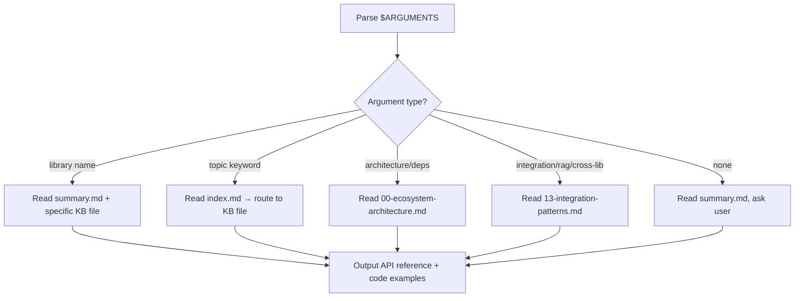

# Noizu Frameworks

API reference and integration guide for 13 interconnected Elixir libraries.

## Overview

The Noizu ecosystem provides:

- **Entity persistence** — Macro-driven entity/repo definitions with pluggable storage (Ecto, Mnesia), field annotations, schema versioning
- **GenAI multi-provider** — Unified LLM interface across 9+ providers (Anthropic, OpenAI, Gemini, Mistral, Groq, XAI, DeepSeek, Ollama, Zai) with protocol-based extensibility
- **Local inference** — On-device LLM execution via Rustler NIF wrapping llama.cpp
- **Distributed worker pools** — Scalable long-lived process management with cluster coordination via :syn
- **Vector database** — Weaviate client with class DSL, GraphQL queries, and batch operations
- **Cache invalidation** — Composite keys from versioned tags with pluggable backends
- **Utility libraries** — Smart tokens, incremental seeding, GitHub API, SendGrid email

## Core Philosophy

1. **Protocol-driven design** — EntityReference, ThreadProtocol, InferenceProviderBehaviour define extensible contracts
2. **Layered dependencies** — core → entities → services; core → genai_core → genai — pick your layer
3. **Convention over configuration** — `def_entity`, `def_repo`, `use Noizu.Service` generate boilerplate from declarations
4. **Provider abstraction** — Same API surface, multiple backends (LLM providers, persistence layers, cache handlers)
5. **Cluster-aware by default** — :syn coordination, distributed pools, node-level health management

## When to Use This Skill

- **Defining entities** with persistence, annotations, and schema versioning
- **Calling LLMs** through a unified GenAI thread interface
- **Adding a new GenAI provider** (implementing InferenceProviderBehaviour)
- **Running local models** via ExLLama NIF
- **Configuring distributed worker pools** with Noizu.Service
- **Building RAG pipelines** combining Weaviate + GenAI
- **Implementing cache invalidation** with fragmented composite keys
- **Generating auth tokens** with time/use/IP constraints
- **Seeding databases** incrementally with dependency ordering
- **Understanding the dependency graph** between libraries

> For deploying Noizu services to Kubernetes, see **trl-kubernetes-engineer**.
> For Ecto schema design beyond what entities generates, see **trl-dba-db-designer-and-tuning**.
> For building MCP servers backed by GenAI, see **trl-mcp-forge**.

## Ecosystem at a Glance

```
noizu_labs_core (0.1.7) ─── foundation
├── noizu_labs_entities (0.3.1) ─── entity/repo macros
│   └── noizu_labs_services (0.1.2) ─── distributed worker pools
├── genai_core (0.3.0) ─── protocols, types, graph execution
│   └── genai (0.3.0) ─── 9 LLM providers
│       └── genai_local ─── local inference
│           └── ex_llama (0.2.3) ─── Rustler NIF for llama.cpp
├── smart_token (0.1.2) ─── stateful auth tokens
│
├── fragmented_keys (0.1.0) ─── cache invalidation (independent)
├── seed_helper (0.1.1) ─── incremental DB seeding (independent)
├── elixir-github (0.1.0) ─── GitHub API client (independent)
├── elixir-weaviate ─── Weaviate vector DB (independent)
└── sendgrid_elixir (2.0.1) ─── SendGrid email (independent)
```

| Library | Hex Package | Version | Primary Dependency |
|---------|------------|---------|-------------------|
| noizu_labs_core | `noizu_labs_core` | 0.1.7 | None (foundation) |
| noizu_labs_entities | `noizu_labs_entities` | 0.3.1 | noizu_labs_core |
| noizu_labs_services | `noizu_labs_services` | 0.1.2 | noizu_labs_entities |
| genai_core | `genai_core` | 0.3.0 | noizu_labs_core |
| genai | `genai` | 0.3.0 | genai_core |
| genai_local | `genai_local` | — | ex_llama |
| ex_llama | `ex_llama` | 0.2.3 | genai_core + elixir_make |
| elixir-weaviate | `noizu_weaviate` | — | finch, jason |
| fragmented_keys | `fragmented_keys` | 0.1.0 | None |
| smart_token | `smart_token` | 0.1.2 | noizu_labs_core |
| seed_helper | `seed_helper` | 0.1.1 | ecto_sql |
| elixir-github | `noizu_github` | 0.1.0 | finch, jason |
| sendgrid_elixir | `sendgrid` | 2.0.1 | tesla, jason |

## Workflow



## Knowledge Base

Read `${CLAUDE_SKILL_DIR}/kb/summary.md` first for quick reference, then consult numbered files in `${CLAUDE_SKILL_DIR}/kb/` as needed:

| File | When to Read |
|------|-------------|
| `summary.md` | Always — compressed overview of all 13 libraries with key APIs |
| `index.md` | When routing a question to the right KB file |
| `00-ecosystem-architecture.md` | Dependency graph, version matrix, mix.exs snippets, config patterns |
| `01-noizu-labs-core.md` | EntityReference protocol, Context system, Records |
| `02-noizu-labs-entities.md` | def_entity, def_repo, field annotations, persistence layers |
| `03-noizu-labs-services.md` | Pool hierarchy, s_call!/s_cast!, NodeManager, cluster coordination |
| `04-genai-core.md` | ThreadProtocol, type system, graph execution, thread lifecycle |
| `05-genai-providers.md` | 9 providers, Encoder pattern, adding new providers |
| `06-genai-local-and-ex-llama.md` | Local inference, NIF wrapper, 27 chat templates |
| `07-elixir-weaviate.md` | CRUD, GraphQL, class DSL, vector search |
| `08-fragmented-keys.md` | Composite keys, versioned tags, KeyRing, CacheHandler |
| `09-smart-token.md` | Dual-token design, chainable constraints, access audit |
| `10-seed-helper.md` | seed/requires_seed macros, handle system, env filtering |
| `11-elixir-github.md` | api_call/5, streaming, struct-based responses |
| `12-sendgrid-elixir.md` | Email builder, Phoenix templates, Tesla HTTP |
| `13-integration-patterns.md` | Cross-library: RAG pipeline, entity+genai, services+entities |

## Quick Start Guides

### I need to define an entity
Read `01-noizu-labs-core.md` (ERP basics) then `02-noizu-labs-entities.md` (full entity definition).

### I need to call an LLM
Read `04-genai-core.md` (thread lifecycle) then `05-genai-providers.md` (provider config).

### I need distributed workers
Read `01-noizu-labs-core.md` (context) → `02-noizu-labs-entities.md` (entity for worker state) → `03-noizu-labs-services.md` (pool setup).

### I need a RAG pipeline
Read `04-genai-core.md` + `05-genai-providers.md` (GenAI thread) + `07-elixir-weaviate.md` (vector search) + `13-integration-patterns.md` (full pipeline).

## Related Skills

- **trl-kubernetes-engineer** — Deploy Noizu service pools to Kubernetes clusters
- **trl-dba-db-designer-and-tuning** — Ecto schema design for entity persistence layers
- **trl-mcp-forge** — Build MCP servers backed by GenAI
- **trl-terraform-engineer** — Provision infrastructure for Noizu services

## Bundled Resources

### Knowledge Base (`kb/`)
- `summary.md` — Compressed reference loaded every invocation
- `index.md` — Question → file routing table
- `00-ecosystem-architecture.md` — Dependency graph, versions, config
- `01-noizu-labs-core.md` — EntityReference, Context, Records
- `02-noizu-labs-entities.md` — Entity/Repo macros, annotations, persistence
- `03-noizu-labs-services.md` — Distributed worker pools
- `04-genai-core.md` — ThreadProtocol, types, graph execution
- `05-genai-providers.md` — 9 LLM providers, Encoder pattern
- `06-genai-local-and-ex-llama.md` — Local inference, NIF
- `07-elixir-weaviate.md` — Weaviate vector DB client
- `08-fragmented-keys.md` — Cache invalidation
- `09-smart-token.md` — Stateful tokens
- `10-seed-helper.md` — Incremental seeding
- `11-elixir-github.md` — GitHub API client
- `12-sendgrid-elixir.md` — SendGrid email
- `13-integration-patterns.md` — Cross-library patterns

### Assets (`assets/`)
- `project-tracker.md` — Checklist for integrating Noizu libraries into a new project
