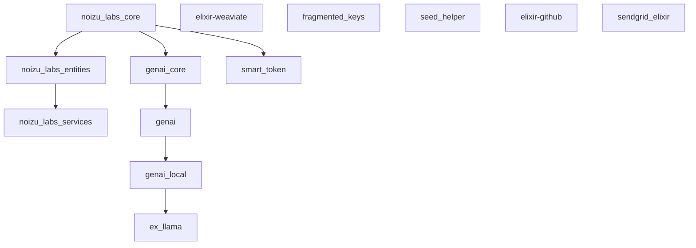

# Noizu Elixir Ecosystem — Architecture Overview

## Dependency Graph



Independent libraries (no Noizu deps): `fragmented_keys`, `seed_helper`, `elixir-github`, `elixir-weaviate`, `sendgrid_elixir`

---

## Group Taxonomy

| Group | Libraries |
|-------|-----------|
| **AI/GenAI** | `genai_core`, `genai`, `genai_local`, `ex_llama`, `elixir-weaviate` |
| **Scaffolding** | `noizu_labs_core`, `noizu_labs_entities`, `noizu_labs_services` |
| **Utilities** | `fragmented_keys`, `smart_token`, `seed_helper` |
| **Standalone** | `elixir-github`, `sendgrid_elixir` |

---

## Adding Libraries to mix.exs

```elixir
defp deps do
  [
    # Scaffolding stack
    {:noizu_labs_core,     "~> 0.1.7"},
    {:noizu_labs_entities, "~> 0.3.1"},
    {:noizu_labs_services, "~> 0.1.2"},

    # GenAI stack
    {:genai_core,  "~> 0.3.0"},
    {:genai,       "~> 0.3.0"},
    {:ex_llama,    "~> 0.2.3"},

    # Vector store
    {:noizu_weaviate, github: "noizu-labs/elixir-weaviate"},

    # Utilities
    {:fragmented_keys, "~> 0.1.0"},
    {:smart_token,     "~> 0.1.2"},
    {:seed_helper,     "~> 0.1.1"},

    # Standalone integrations
    {:noizu_github, github: "noizu-labs/elixir-github"},
    {:sendgrid,     github: "Noizu/sendgrid_elixir"},
  ]
end
```

---

## Umbrella Project Setup

When working inside an Elixir umbrella monorepo, use `in_umbrella: true` for the scaffolding layers:

```elixir
defp deps do
  [
    {:noizu_labs_core,     in_umbrella: true},
    {:noizu_labs_entities, in_umbrella: true},
    # services app pulls in entities transitively
    {:noizu_labs_services, in_umbrella: true},
  ]
end
```

Each app in `apps/` should declare only its direct dependencies. Core is a leaf dep — declare it once at the root or per-app as needed.

---

## Configuration Patterns

```elixir
# config/config.exs

# GenAI provider API keys
config :genai,
  openai: [api_key: System.get_env("OPENAI_API_KEY")],
  anthropic: [api_key: System.get_env("ANTHROPIC_API_KEY")],
  gemini: [api_key: System.get_env("GEMINI_API_KEY")]

# Weaviate vector store
config :noizu_weaviate,
  endpoint: System.get_env("WEAVIATE_ENDPOINT", "http://localhost:8080"),
  api_key:  System.get_env("WEAVIATE_API_KEY")

# SendGrid
config :sendgrid,
  api_key: System.get_env("SENDGRID_API_KEY")

# SeedHelper — point at your Ecto repo
config :seed_helper,
  repo: MyApp.Repo

# SmartToken — point at your Ecto repo
config :smart_token,
  repo: MyApp.Repo
```

---

## Source Repositories

| Library | GitHub Path | Local Path (approx.) |
|---------|-------------|----------------------|
| `noizu_labs_core` | `noizu-labs/noizu_labs_core` | `~/elixir/noizu_labs_core` |
| `noizu_labs_entities` | `noizu-labs/noizu_labs_entities` | `~/elixir/noizu_labs_entities` |
| `noizu_labs_services` | `noizu-labs/noizu_labs_services` | `~/elixir/noizu_labs_services` |
| `genai_core` | `noizu-labs/genai_core` | `~/elixir/genai/core` |
| `genai` | `noizu-labs/genai` | `~/elixir/genai` |
| `genai_local` | `noizu-labs/genai_local` | `~/elixir/genai_local` |
| `ex_llama` | `noizu-labs/ex_llama` | `~/elixir/ex_llama` |
| `elixir-weaviate` | `noizu-labs/elixir-weaviate` | `~/elixir/elixir-weaviate` |
| `fragmented_keys` | `noizu-labs/fragmented_keys` | `~/elixir/fragmented_keys` |
| `smart_token` | `noizu-labs/smart_token` | `~/elixir/smart_token` |
| `seed_helper` | `noizu-labs/seed_helper` | `~/elixir/seed_helper` |
| `elixir-github` | `noizu-labs/elixir-github` | `~/elixir/elixir-github` |
| `sendgrid_elixir` | `Noizu/sendgrid_elixir` | `~/elixir/sendgrid_elixir` |
