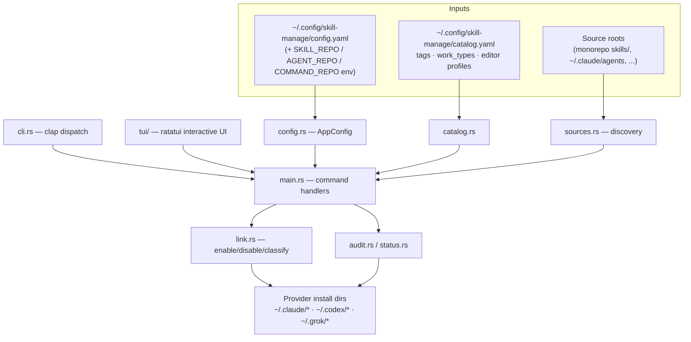

# Project Architecture

## Overview

`skill-manage` is a single-binary Rust CLI/TUI that manages which coding-agent
**skills**, **agents**, and **commands** are enabled for each provider harness
(Claude / Codex / Grok). It works by creating and removing **symlinks** from
provider install roots (e.g. `~/.claude/skills/<name>`) back into one or more
configured source trees (typically the monorepo `skills/` directory), so a
single canonical copy of each artifact serves every harness. A YAML **catalog**
layers metadata on top — tags, work-type bundles, and editor profiles — enabling
one-shot `enable-set --work-type <type>` activation of a curated toolset.

The design is deliberately non-destructive: enabling only ever creates symlinks,
disabling only removes symlinks that resolve under a configured source root, and
real files/dirs are never overwritten without an explicit `--replace` (which
backs them up as `*.bak.<timestamp>`). An `audit` subcommand (with `--strict`
and `--json` modes) verifies link health and skill structure across all
providers.

## System Diagram

## Core Components

| Component | Purpose |
|-----------|---------|
| `src/main.rs` | Entry point; wires modules, dispatches each subcommand to its handler |
| `src/cli.rs` | clap definition: subcommands, flags, value enums |
| `src/config.rs` | `AppConfig`: config.yaml load, builtin defaults, env overrides, `~`/`${VAR}` path expansion, provider/kind dir resolution |
| `src/kinds.rs` | Core vocabulary: `Kind` (skills/agents/commands), `Provider` (claude/codex/grok), `InstallStatus`, `SourceItem` |
| `src/sources.rs` | Discovers items across prioritized source roots; validates skill structure (`SKILL.md`) |
| `src/link.rs` | Symlink enable/disable and status classification; replace + backup safety rules |
| `src/catalog.rs` | catalog.yaml model: per-item tags/work_types/provider allow-lists, work-type bundles, editor profiles, validation |
| `src/audit.rs` | Health checks: broken links, foreign links, structure issues; `--strict`, `--json` |
| `src/status.rs` | Cross-kind, cross-provider summary table |
| `src/tui/` | ratatui interactive mode (`-i` / `tui`): screens per kind + profiles, toggle/replace/filter/catalog-edit |
| `schema/` | Example config + catalog YAML, installed to `~/.local/share/skill-manage/schema` |

## Data Flow

1. **Config resolution** — `AppConfig::load` reads `config.yaml` (or builtin
   defaults for the three providers), applies `SKILL_REPO`/`AGENT_REPO`/
   `COMMAND_REPO` env overrides as priority-10 source roots, and expands
   `~`/`${VAR}` in every path.
2. **Discovery** — `sources.rs` walks each kind's source roots in priority
   order (lower wins on name clash), producing `SourceItem`s; skills are
   directories containing `SKILL.md`, agents/commands are single `*.md` files.
3. **Classification** — for each provider install dir, `link::classify`
   compares the destination against the expected source: `enabled` (managed
   symlink), `disabled` (absent), `foreign` (symlink elsewhere), `real`
   (non-symlink file/dir), `broken` (dangling), `missing-source`.
4. **Mutation** — enable creates a dir symlink (skills) or file symlink
   (agents/commands); disable removes only managed symlinks; `--dry-run`
   previews. `enable-set` expands a catalog work-type into a batch of enables.

## Install Status Model

Six states drive both list output and audit findings: `enabled`, `disabled`,
`foreign`, `real`, `broken`, `missing-source`. `foreign` and `real` are
intentionally never auto-mutated — `--replace` (or the TUI `r` key) is the only
path that converts a real file into a managed symlink, and it backs up first.

## Safety Invariants

- Enable creates symlinks only; never copies.
- Never overwrite a real file/dir without `--replace` (renamed to
  `*.bak.<timestamp>` first).
- Disable removes a destination only when it is a symlink resolving under a
  configured source root for that kind.
- Never writes under Codex `skills/.system/` or Grok bundled trees.

## Ecosystem Fit (Noizu monorepo)

`skill-manage` lives under `utilities/agent/` in the Noizu Infra monorepo and
is installed to `~/.local/bin` like the other DevOps utilities — its Makefile's
`compile`/`test`/`install` targets are dispatched by `utilities/mk/subdirs.mk`
via `make install-utilities`. Unlike the shell-based utilities it does **not**
use `share/k8-lib` or `.infra-config.yaml`: it is a standalone Rust binary with
its own XDG config (`~/.config/skill-manage/`). Its primary source root in
practice is the monorepo `skills/` directory (the generated config seeds it
when present), making it the canonical enable/disable mechanism for the repo's
`trl-*` skills — symlinks, not copies, per repo convention.

## Key Decisions

- **Symlinks over copies**: one canonical source; edits propagate instantly to
  every provider; disable is trivially reversible. (Matches the repo doctrine
  that `~/.claude/skills` copies go stale.)
- **Multi-root with priority**: several source trees per kind; lower `priority`
  wins on name clash, so a personal override tree can shadow the monorepo.
- **Catalog as metadata, not state**: enable state lives on disk (the symlinks
  themselves); catalog.yaml only carries tags/work-types/profiles, so the tool
  never desyncs from reality.
- **Editor profiles are v1 metadata-only**: existence checks, no auto-apply —
  keeps the mutation surface limited to symlinks.
- **Rust + ratatui instead of shell**: the interactive TUI and multi-state
  classification logic exceed what the k8-lib shell pattern handles cleanly.

## Technology Stack

Rust (single crate, release binary), clap (CLI), ratatui + crossterm (TUI),
serde_yaml (config/catalog), chrono (backup timestamps), anyhow (errors).
Unit tests run via `cargo test` in the `install` pipeline.
