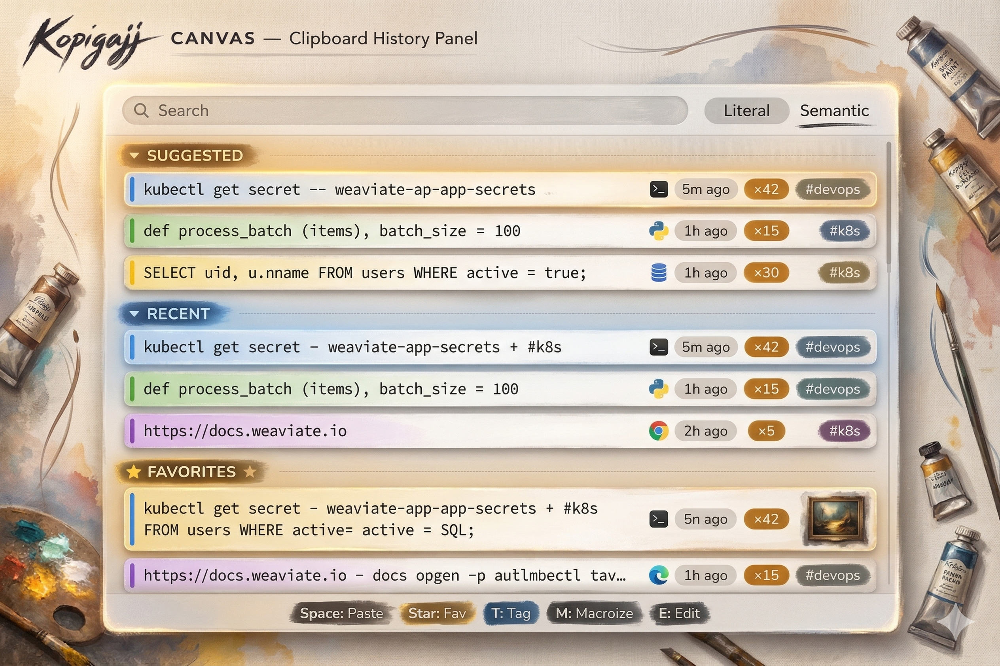
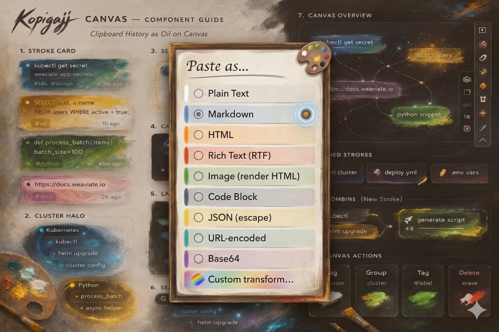
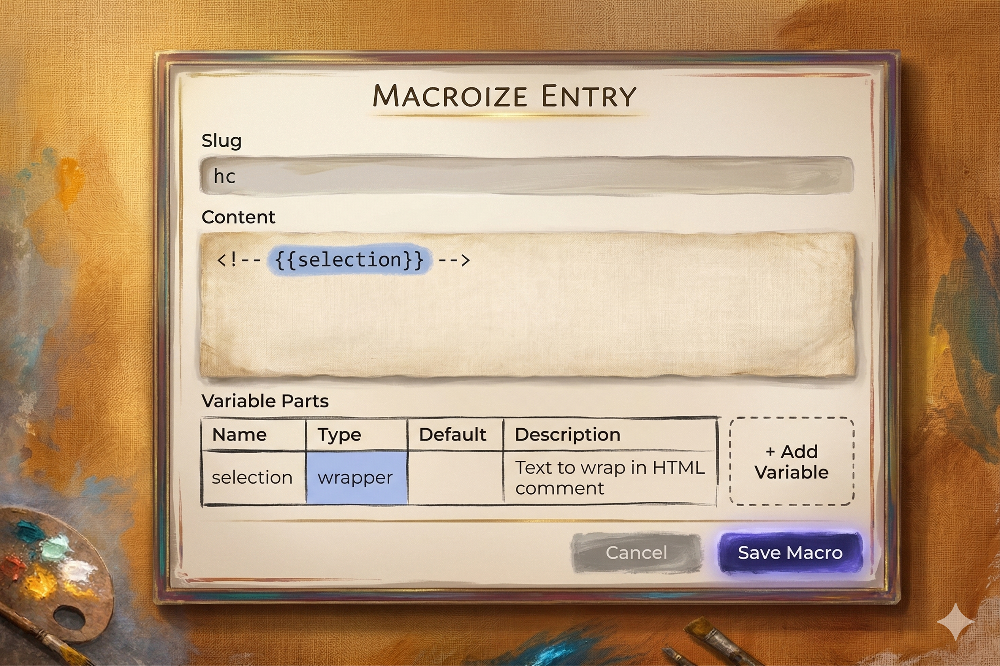
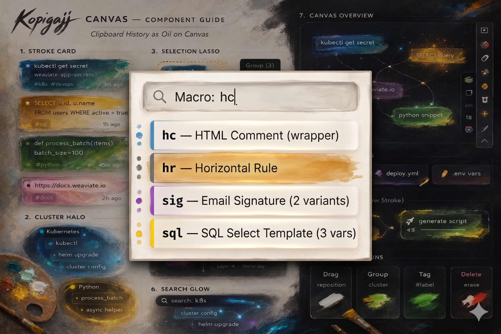
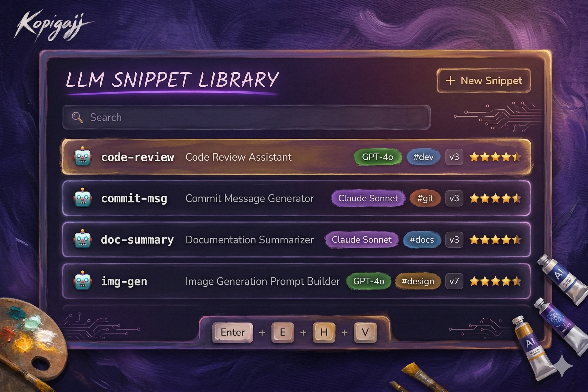
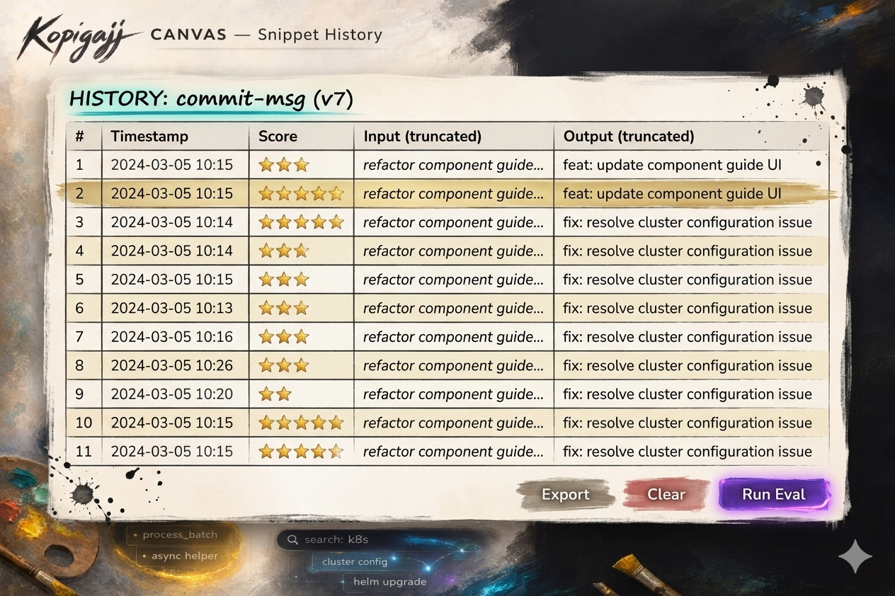
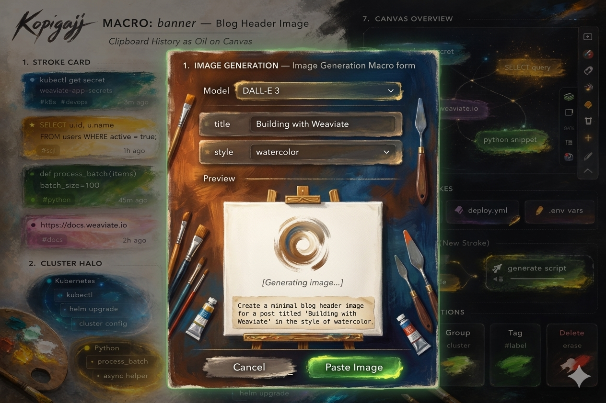

# ClipStash — OSX Clipboard Manager Product Specification

ClipStash is a power-user clipboard manager for macOS that extends the system clipboard with persistent history, macro expansion, LLM-powered transformations, semantic search, and encrypted cross-device sync. It lives in the menu bar and is invoked primarily through keyboard chords.

---

## Table of Contents

- [Overview & Architecture](#overview--system-architecture) — [section](spec/00-overview-architecture.md)
- [Roadmap](#roadmap) — [section](spec/00a-roadmap.md)
- [Personas](#personas) — [Developer](spec/personas/developer.md) · [Knowledge Worker](spec/personas/knowledge-worker.md)

- **[Design System](#design-system)** — The "Kopigajj Canvas" visual language: oil-painting aesthetic, stroke cards, glow effects, and canvas metaphor.

  - [Style Guide](spec/style-guide/style-guide.md) · [Elements](spec/style-guide/style-guide-elements.md) · [Components](spec/style-guide/style-guide-components.md) · [Clipboard History Mockup](spec/style-guide/clipboard-history.md)

- **[Components — UI/UX Elements](#components--uiux-elements)** — Panels, controls, and interaction surfaces the user sees and touches.

  - [Core Keyboard Chords](#1-core-keyboard-chords) — [section](spec/01-keyboard-chords.md)
  - [Clipboard History Panel](#2-clipboard-history-panel-v-v) — [section](spec/02-clipboard-history-panel.md)
  - [Menu Bar Interface](#11-menu-bar-interface) — [section](spec/11-menu-bar-interface.md)
  - [Editing](#8-editing) — [section](spec/08-editing.md)
  - [Smart Formatting & Paste Modes](#9-smart-formatting--paste-modes) — [section](spec/09-smart-formatting-paste-modes.md)

- **[Components — Features](#components--features)** — Functional capabilities that power the clipboard beyond copy/paste.

  - [Favorites & Tagging](#3-favorites--tagging) — [section](spec/03-favorites-tagging.md)
  - [Macroization System](#4-macroization-system) — [section](spec/04-macroization-system.md)
  - [Search](#5-search) — [section](spec/05-search.md)
  - [Provenance & Usage Tracking](#6-entry-provenance--usage-tracking) — [section](spec/06-provenance-usage-tracking.md)
  - [LLM Snippet Library](#7-llm-snippet-library-v-l) — [section](spec/07-llm-snippet-library.md)
  - [Image Support](#10-image-support) — [section](spec/10-image-support.md)

- [Technical Architecture](#technical-architecture) — [section](spec/14-technical-architecture.md)
- [Additional Features & Suggestions](#additional-features--suggestions) — [section](spec/13-additional-features.md)

- **[Monetization](#monetization)** — Pricing tiers, premium features, and the sync system that gates the Team/Enterprise plans.

  - [Pricing Tiers](#pricing-tiers) — [section](spec/15-monetization.md)
  - [Sync System (Premium)](#sync-system-premium) — [section](spec/12-sync-system.md)

---

## Overview & System Architecture

The system is composed of four layers: a macOS integration layer (NSPasteboard, Accessibility API, Keychain), the ClipStash core engines (Clipboard Monitor, Ingest, Search, Macro, Paste, LLM Orchestrator, Sync), a storage layer (SQLite, vector index, file store), and external services (LLM providers, sync server, image generation). The UI layer surfaces everything through the menu bar icon, history panel, macro quick bar, LLM snippet library, and preferences window.

[Full architecture diagrams →](spec/00-overview-architecture.md)

---

## Roadmap

Eight-stage delivery plan from Hello World MVP through encrypted sync. Stage 0 validates the global hotkey and popup window. Stages 1-2 build clipboard display and history. Stage 3 adds SQLite persistence. Stage 4 introduces search. Stage 5 handles content types and metadata. Stages 6-7 implement sync foundation and end-to-end encryption.

[Full roadmap with stage details and Mermaid diagrams →](spec/00a-roadmap.md)

---

## Personas

Two target personas define who ClipStash is built for and how feature decisions are prioritized.

### Developer (Primary)

Keith — software developer on macOS, keyboard-first workflow, works across VS Code, Terminal, and Git. Values local-first privacy, extensibility, and cross-device sync without vendor lock-in. Pain points: losing clipboard content mid-workflow, copy-paste fatigue with code snippets/URLs/JSON, and recalling what was copied minutes ago.

[Full developer persona →](spec/personas/developer.md)

### Knowledge Worker (Secondary)

Generic professional — designer, analyst, writer, or PM on macOS. Works across many apps constantly, values simplicity and reliability over power features. Pain points: losing URLs/links before pasting, searching for recently copied content across app switches, email reference management.

[Full knowledge worker persona →](spec/personas/knowledge-worker.md)

---

## Design System

The **Kopigajj Canvas** design language treats clipboard history as oil painting on canvas. Clipboard entries are "stroke cards" rendered with painterly textures and glow effects. The visual system defines color coding by content type (blue for shell, green for Python, yellow for SQL, red for errors, purple for docs), motion language (copy splash, recent stroke glow, fading stroke, hover bloom), and component patterns (stroke cards, cluster halos, selection lasso, layer scrubber, search glow, canvas tools, pinned strokes, AI combine, canvas actions).

[Style Guide](spec/style-guide/style-guide.md) · [Design Elements v2](spec/style-guide/style-guide-elements.md) · [Component Guide](spec/style-guide/style-guide-components.md) · [Clipboard History Mockup](spec/style-guide/clipboard-history.md)

---

## Components — UI/UX Elements

### 1. Core Keyboard Chords

All interaction flows through a `⌘⇧T` prefix chord system with 9 bindings: `V` (history), `M` (macros), `Space` (paste), `A` (LLM inference), `L` (snippet library), `P` (promote output), `F` (focus search), `1-9` (quick-paste), and `Esc` (close). A state machine governs transitions between panels — each panel has its own sub-actions (e.g., `M` to macroize, `T` to tag, `E` to edit within the history panel).

[Full chord table & state machine diagram →](spec/01-keyboard-chords.md)

---

### 2. Clipboard History Panel (`⌘⇧T V`)

The main panel displays entries in three sections: **Suggested** (scored by recency, frequency, app/file affinity, time-of-day, and favorites), **Recent** (chronological), and **Favorites** (pinned). Each entry shows a content preview, source app, age, and usage count. The panel supports inline actions via single-key shortcuts. The data model spans 9 tables: clipboard entries, tags, entry-tags, paste events, macros, macro variables, LLM snippets, snippet versions, and LLM invocations.

[Full layout wireframe, ER diagram & scoring algorithm →](spec/02-clipboard-history-panel.md)

---

### 11. Menu Bar Interface

The menu bar dropdown provides quick actions (history, macros, snippets), live statistics (copies/pastes today, total entries/size), browsable categories (recent, favorites, tags, macros, snippets), and system controls (preferences, sync status, help, updates, quit). The preferences window has 7 tabs: General, Keyboard, Search, LLM, Sync (premium), Privacy, and Appearance — each with detailed sub-options.

[Dropdown structure & full preferences tree diagrams →](spec/11-menu-bar-interface.md)

---

### 8. Editing

All clipboard entries and LLM snippets support inline editing (`E` key). Text entries open in a syntax-highlighted editor with auto-detected language. Images open a crop/annotate overlay. Macro entries re-open the macroization form. Edit history is preserved with undo support, and edited entries are marked with a pencil icon while retaining original metadata.

[Full details →](spec/08-editing.md)

---

### 9. Smart Formatting & Paste Modes

Paste output can be transformed at paste time through 10 format options: plain text, Markdown, HTML, RTF, code block, JSON-escaped, URL-encoded, Base64, rendered image, and custom (regex/LLM/script). A long-press on `⌘⇧T Space` opens the format picker. Color values (hex, RGB, HSL) are auto-detected with swatch preview and conversion between hex, RGB, HSL, Swift UIColor, and CSS variable formats.

[Transformation pipeline diagram, format picker wireframe & color support →](spec/09-smart-formatting-paste-modes.md)

---

## Components — Features

### 3. Favorites & Tagging

Entries can be favorited (`★` key) for permanent retention and dedicated panel placement. Tags are freeform `#`-prefixed strings with autocomplete, supporting bulk tagging via multi-select. Descriptions can be added to any entry (`D` key) as searchable annotations, turning the clipboard into a snippet library. Tags and descriptions are indexed for both literal and semantic search.

[Tag editor wireframe & full details →](spec/03-favorites-tagging.md)

---

### 4. Macroization System

Any clipboard entry can be assigned a short slug and parameterized with variable parts, turning it into a reusable snippet. Seven variable types are supported: `text`, `wrapper` (auto-fills from selection), `choice`, `number`, `date`, `llm` (AI-generated), and `llm_transform` (selection passed through LLM before insertion). Macros support live preview during variable input, LLM-assisted fill (`⌘⇧T A`), and generated output nesting with promotion back to top-level history.

[Full lifecycle diagrams, variable type decision tree, wireframes & examples →](spec/04-macroization-system.md)

---

### 5. Search

Search uses three engines in parallel: **literal** (SQLite FTS5 for substring/exact matching), **semantic** (vector similarity via sqlite-vec with all-MiniLM-L6-v2 embeddings), and **filter** (SQL WHERE clauses). Results are merged and ranked. The query syntax supports 12 filter types including `#tag`, `app:`, `type:`, date ranges, usage counts, `~semantic query`, `machine:`, `is:favorite`, and `is:macro`.

[Architecture diagram & full query syntax reference →](spec/05-search.md)

---

### 6. Entry Provenance & Usage Tracking

Every copy event records millisecond-precision timestamp, source machine hostname, source application (bundle ID + display name), source document/URL (via Accessibility API), and copy method. Every paste event records target app and document. This data powers usage count badges, the suggested entries algorithm, per-entry usage timelines, and menu bar analytics summaries.

[Flow diagram & entry detail view wireframe →](spec/06-provenance-usage-tracking.md)

---

### 7. LLM Snippet Library (`⌘⇧T L`)

A dedicated panel for LLM-powered snippets with first-class versioning and evaluation. Each snippet has a configurable model/provider, system prompt, input variables (shared type system with macros), and output format. Every prompt edit creates a new version. The eval framework supports manual scoring (1-5 stars), A/B testing between versions, batch re-evaluation against historical inputs, auto-eval via judge LLM, and regression alerting when scores drop.

[Invocation flow, eval dashboard wireframes & version history →](spec/07-llm-snippet-library.md)

---

### 10. Image Support

Images (PNG, JPEG, TIFF, GIF, SVG) are first-class citizens with thumbnail previews, full-size preview on hover/Space, metadata extraction, OCR for text searchability, and CLIP embedding for visual similarity search. LLM-powered generation macros support text-to-image, image-to-image transforms, and combined text+image generation — all pasteable via the standard `⌘⇧T Space` flow.

[Ingest pipeline diagram & generation macro wireframe →](spec/10-image-support.md)

---

## Technical Architecture

Full PlantUML component diagram showing UI layer, core services, data layer, platform integration, and external services with all dependency arrows. Storage uses SQLite (metadata + text content), sqlite-vec/Qdrant (embeddings), Keychain (secrets), and file store (blobs). Clipboard monitoring polls NSPasteboard at 250ms intervals. Six performance SLAs defined (panel <100ms, search <50ms, semantic <200ms, macro <30ms, memory <80MB, embeddings async).

[Component diagram, ingest pipeline & performance targets →](spec/14-technical-architecture.md)

---

## Additional Features & Suggestions

Clipboard chains for sequential form-filling (`⌘⇧T C`), 4-tier feature matrix (Free/Pro/Team/Enterprise), and 7 additional feature ideas: duplicate detection, expiring entries, regex transforms, URL preview, code detection, multi-select paste. Also covers accessibility (VoiceOver, high-contrast, keyboard-only), developer features (CLI, Alfred/Raycast, Shortcuts.app, AppleScript/JXA, webhooks), and data management (export/import/backup).

[Feature matrix diagram, clipboard chain flow & full details →](spec/13-additional-features.md)

---

## Monetization

### Pricing Tiers

Four tiers: **Free** ($0 — history, favorites, tags, basic search, 3 macros), **Pro** ($9/mo or $79/yr — unlimited macros, semantic search, LLM BYOK, smart suggestions, CLI), **Team** ($14/user/mo — encrypted sync, shared libraries, analytics, SSO), **Enterprise** (custom — self-hosted sync, audit logs, SCIM, priority support).

[Full pricing table →](spec/15-monetization.md)

---

### Sync System (Premium)

End-to-end encrypted sync with zero-knowledge server architecture. Two key derivation options: password-derived (Argon2id → HKDF-SHA256 → encryption/auth/search keys) or custom X25519 keypair with manual device transfer (QR/AirDrop/USB). The sync protocol uses vector clocks for conflict detection, ciphertext padding to hide entry metadata, encrypted tombstones for deletion, and supports an open-source self-hosted server.

[Encryption diagrams, sync protocol sequence & server guarantees →](spec/12-sync-system.md)
