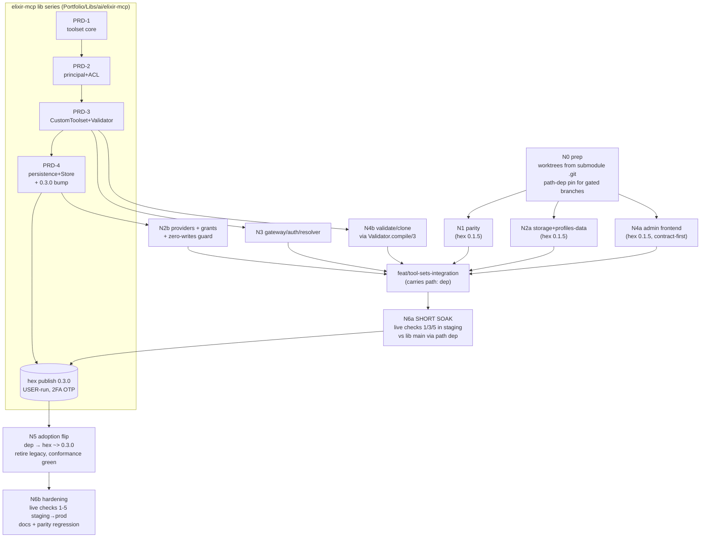

# NPL Last-Mile PRD Series — tobor.locker Tool Profiles / Named Tool Sets

**Series**: PRD-N1 … PRD-N6 (host-side completion of the tobor.locker tool-profiles plan)
**Host repo**: `Portfolio/Apps/AI/NoizuPromptLingo` (all `backend/...` anchors below verified against working tree `develop.q3 @ cbec5d6ba`, 2026-09-01)
**Lib series**: `Portfolio/Libs/ai/elixir-mcp/project-management/PRDs/` — INDEX + PRD-1..5 (noizu_mcp 0.3.0 toolset architecture). The lib series is NORMATIVE for every frozen interface (`Toolset` protocol, `%Toolset.Custom{}`, `Validator.compile/3`, `Persistence`/`ACL.Provider` behaviours, `%Permission.Grant/Negotiation`, `Store`); this series implements the host side and never re-specifies a frozen shape.
**Plan source**: approved last-mile plan `~/.claude/plans/tobor-locker-is-looking-great-elegant-milner.md` — Section 0 (directive) + Section 3 (FINAL N1-N6). Where this series and the plan disagree, the plan wins; where both disagree with the working tree, the tree wins (corrections logged in §6 below).
**Date authored**: 2026-09-01 · **Author**: npl-prd-editor (Loom weave)
**tobor session**: e5532107-a380-4557-a05a-434b7b334361

---

## 1. Overview table

| PRD | File | Title | Starts (gate) | Branch | One-line scope |
|-----|------|-------|---------------|--------|----------------|
| N1 | [PRD-N1-parity.md](./PRD-N1-parity.md) | Manifest / Serving Parity | now — hex 0.1.5, zero lib deps | `feat/n1-parity` | `client_for/1` delegation, `included:` flag universe, `notify_changed`+`ToolsetCache.bump/0` at scope/key/client write sites, frontend "narrowing only" label, `session_manifest_parity_test.exs` |
| N2 | [PRD-N2-storage-providers.md](./PRD-N2-storage-providers.md) | Storage + Providers | N2a now — hex 0.1.5 · N2b gated on lib PRD-4 merge | `feat/n2a-storage`, `feat/n2b-providers` | N2a: 083 migration, closed-op-vocab `config` jsonb + `to_overrides/1`, `Schema.MCPToolSet`, `MCP.ToolSets` context, `profiles.ex` as data + annotation registry. N2b: `ToolsetProvider`, `AclProvider`, grants mapping (weight 200), zero-writes guard |
| N3 | [PRD-N3-gateway-auth.md](./PRD-N3-gateway-auth.md) | Gateway, Identity & Auth | gated on lib PRD-3 merge | `feat/n3-gateway` | `tool_set_endpoint` bridge, `principal_mapper`, `toolset_resolver`, `mcp_set_gateway_controller` (org / org+project, `allow_api_keys`, group 404-no-leak), router placement + `:tool_sets_enabled` flag, `urls.ex` set builders |
| N4 | [PRD-N4-admin-ui.md](./PRD-N4-admin-ui.md) | Admin API + UI | N4a (frontend/CRUD) now — hex 0.1.5 · N4b (validate/clone preview) gated on lib PRD-3 merge | `feat/n4a-admin-frontend`, `feat/n4b-admin-validate` | `tool_set_profiles_controller` (index/show/create/update/deactivate/clone/validate dry-run), audit w/ actor; frontend Tool-Sets section, `kind=tool-set` page, extended `tool-overrides-editor`, `acl-api.ts` fns |
| N5 | [PRD-N5-adoption-flip.md](./PRD-N5-adoption-flip.md) | PRD-5 Adoption + Hex Flip | gated on hex 0.3.0 publish (user-run, 2FA OTP) | `feat/n5-flip` (accumulates the integration branch) | Base-macro flip, `Session_Manifest` rewrite over `Toolset.permissions/3`, `custom.ex` provider-backed, conformance ports + `tool_sets_conformance`, zero-writes + AP-12/13/14 guards, RETIREMENT list, flip-to-hex checklist, legacy `insufficient_authorization` envelope dies (wire delta #1) |
| N6 | [PRD-N6-hardening.md](./PRD-N6-hardening.md) | Hardening, Docs & Live Checks | N6a soak BEFORE publish (staging, path dep) · N6b after flip | `feat/n6-hardening` | Permanent parity regression, PROJ-SCHEMA/PROJ-ARCH docs + CHANGELOG (two wire deltas), live checks 1-5 (staging→prod), short-soak procedure |

Every PRD carries: numbered FR/AC, public surface, `file:line` anchors verified against the working tree, a test plan naming real test files, compat/rollback, and open questions. Each is TDD-executable by an agent with repo access and no conversation context.

---

## 2. Phase-gate graph

Gates are hard: a phase never starts before its gate merges, and the integration branch never merges to NPL `main` before the publish (see §4).

---

## 3. Decision log (user-locked — baked into every relevant PRD)

1. **Single hex publish 0.3.0** at lib-series end; NPL develops against the lib via a RELATIVE PATH dep **`{:noizu_mcp, path: "../../../../Libs/ai/elixir-mcp"}`** — depth VERIFIED: `backend/mix.exs` → `Portfolio/Libs/ai/elixir-mcp` is four `../` from `backend/` (the plan's `../../../` form is one level short; the tree wins). Feature branches per PRD phase (`feat/n1-…`, `feat/n2a-…`, …), sequential merges. The user runs `mix hex.publish` (2FA OTP) — agents NEVER publish and never touch hex keys (no-key-rotation standing rule).
2. **Providers over NPL tables PERMANENT** (lib-series decision 2): NPL's persistence provider reads/writes NPL's own tables (`mcp_custom_scopes`, `mcp_api_keys.toolset_config`, `oauth_clients.toolset_config`, new `mcp_tool_sets`). The lib-owned `noizu_mcp_toolset*` tables receive ZERO rows in NPL deployments — proven by the zero-writes guard test (N2b FR-2-24, re-asserted at N5).
3. **Q1 ACCEPTED — step-up wire delta**: destructive-tool step-up becomes an MCP-level `forbidden` error whose data carries `negotiation.metadata.elevation_uri`; the legacy `insufficient_authorization` tool-result envelope (today at `backend/lib/noizu_prompt_lingua/mcp/dispatch.ex:36-45`) DIES at N5. The new shape is asserted in `key_toolset_guard_conformance_test.exs`; both wire deltas are CHANGELOG-noted (N6).
4. **Q2 ANNOTATION DSL NOW**: profile membership derives from the `MCPServers` registry (`backend/lib/noizu_prompt_lingua/mcp_servers.ex:15` `@servers`, 22 entries; `customizable/0` `:129` = 21 groups, root excluded) via a compile-time registry map `@profile_groups` (group_id → [profile_slug]) in `mcp/toolsets/profiles.ex`; every key is compile-validated against `MCPServers.customizable()` ids, so new domain tools auto-join profiles through their group annotation (a NEW group id needs a one-line `@profile_groups` entry). `full` = `MCPServers.customizable()`. The 5 profiles (`full`, `agent-ops`, `pm-dev`, `content`, `comms`) remain immutable `%Toolset.Custom{}` structs built at N2b (lib PRD-3); N2a ships them as DATA only. Tool-level annotation overrides are OUT of scope.
5. **Q3 SHORT SOAK**: N6 live checks 1/3/5 run in STAGING against lib `main` via the path dep BEFORE the user-run `mix hex.publish` (N6a). The publish is irreversible; the soak is its gate.
6. **Gates**: N1 / N2a / N4a start on hex 0.1.5 (zero lib deps — they must merge to NPL `main` without touching `mix.exs:99`). N2b is gated on lib PRD-4 merge. N3 / N4b are gated on lib PRD-3 merge. N5 / N6b are gated on the 0.3.0 publish. N6a (soak) sits BEFORE the publish.
7. **Design rules D1-D5** (lib INDEX §3) govern: D1 one resolver; D2 effective materialization; D3 runtime-only resolution; D4 explicit participation (compile-time checks where config must not boot); D5 fail-closed per set, fail-open per server. **Grants-never-hide**: grants are weight-200 adjust, ACL is weight-300 gate (lib PRD-4 §4.5). `ToolGuard` STAYS in NPL, re-homed as the policy source invoked BY `AclProvider.check_all` (deny = weight 300). `notify_changed` call sites in NPL contexts are the FINAL home — the lib `Store` notify chain never fires for NPL admin writes.
8. **Known anchors** (all verified): `mcp/session_manifest.ex` `client_for/1` `:157`, `generate/2` `:32`; `effective_toolset.ex` `client_for_ctx/1` `:478`, narrowing `:152-157`, `apply_state/2` `:385`, `apply_to_specs/3` `:419`; `mcp/custom.ex` `custom_specs/1` `:39`; gateway controller `handle_org` `:15` / `handle` `:34` / `handle_user` `:76` / `defp serve/4` `:118`; router custom `:352`, org-custom `:361`, user `:369`, bare `/mcp` scope `:372-373`; `MCPCustomScopes.get_by_org_and_slug/2` `:250`; `urls.ex` `defp app_url/3` `:51`, `defp build/2` `:61`; frontend `src/components/mcp-include-editor.tsx` + `mcp-endpoint-manager.tsx` (top level) and `src/components/kit/{tool-toggles-grid,tool-overrides-editor}.tsx` (both dirs verified); changelog next number **083** (master: `backend/db/changelog/db.changelog-master.yaml`, latest `082-org-slug-uniqueness.yaml`); authz groups TABLE NAME **`groups`** — confirmed from `schema/authz/group.ex:6` (083 DDL precondition satisfied).

---

## 4. Branch & merge plan

**Branches** (worktrees from the submodule's own `.git` — never monorepo worktrees):

| Branch | Base | Dep state | Merges to |
|--------|------|-----------|-----------|
| `feat/n1-parity` | NPL trunk | hex 0.1.5 (untouched) | NPL main directly |
| `feat/n2a-storage` | NPL trunk | hex 0.1.5 (untouched) | NPL main directly (after N1) |
| `feat/n2b-providers` | `feat/tool-sets-integration` | **path dep commit** | integration branch only |
| `feat/n3-gateway` | `feat/tool-sets-integration` | path dep (inherited) | integration branch only |
| `feat/n4a-admin-frontend` | NPL trunk | hex 0.1.5 (untouched) | NPL main directly |
| `feat/n4b-admin-validate` | `feat/tool-sets-integration` | path dep (inherited) | integration branch only |
| `feat/tool-sets-integration` | NPL trunk + one `path:` dep commit | path dep | NPL main ONLY inside the flip window (with N5) |
| `feat/n5-flip` | integration branch | hex `~> 0.3.0` (the flip commit) | NPL main (the flip) |
| `feat/n6-hardening` | NPL main post-flip | hex `~> 0.3.0` | NPL main |

**Rules** (standing): trunk-based, sequential merges in gate order N1 → N2a → N4a → (integration: N2b → N3 → N4b) → publish → N5 flip → N6. Scoped test runs only (run impacted tests, not the world). Push once green (standing auth). No stashing — `git add -A` + commit. Shared-checkout contention: verify branch + index before committing; land monorepo gitlink updates via worktree. NPL `main` NEVER carries the `path:` dep before the flip commit; production NPL stays hex 0.1.5 until then.

**Why the integration branch exists**: N2b/N3/N4b compile against unfrozen lib code (`Noizu.MCP.Persistence`, `protocol_list/protocol_call`, `Validator.compile/3`) that hex 0.1.5 does not ship. They cannot merge to `main` without breaking production, and they must not block each other — so they accumulate on `feat/tool-sets-integration` and land on `main` as part of the N5 flip sequence (one merge train; rollback = revert the flip merge commit, which contains all legacy deletions, keeping the revert atomic per PRD-5 §8).

---

## 5. Dependency links to the lib PRD series

| NPL phase | Consumes (frozen) | Lib source |
|-----------|-------------------|-----------|
| N1 | (nothing — hex 0.1.5 `notify_changed/1` already exists, `deps/noizu_mcp/.../server.ex:177`) | — |
| N2a | closed override op-vocabulary NAMES (`enabled/name/description/args.enum_remove|hide|rename|default|description`) — 1:1 with PRD-1 §4.5 `%Override{}` ops | PRD-1 §4.5 |
| N2b | `Noizu.MCP.Persistence` behaviour + store keys; `Noizu.MCP.ACL.Provider`; `%Permission.Grant/Negotiation`; grants-never-hide weights (200/300); provider selection `providers:` combined form | PRD-4 §4.1/§4.4-4.6, PRD-2 §4.6, PRD-4 §4.3 |
| N3 | `Features.Tools.protocol_list/protocol_call`; `toolset:` / `principal:` / `providers:` / `toolset_cache:` opts; `%Auth.Principal{}` + `Ctx.auth`; MFA resolver contract; `Validator.compile/3` (N4b) | PRD-1 §4.9, PRD-3 §4.7, PRD-2 §4.1/§4.4, PRD-3 §4.5 |
| N4 | `Validator.compile/3` + `%Validator.Issue{}` (validate dry-run, effective preview via resolver `catalog/3`) | PRD-3 §4.5, PRD-1 §4.4 |
| N5 | `Toolset.permissions/3` + `metadata/3`; `Toolset.Cache`; registration-time canonicalization; `negotiation.metadata` passthrough on `forbidden` | PRD-1 §4.4, PRD-3 §4.6, PRD-4 §4.5 |
| N6 | `Toolset.catalog/3` (parity regression via catalog) | PRD-1 §4.7, PRD-3 §4.4 |

Normative rule: this series NEVER re-specifies a frozen lib shape. Where an NPL PRD needs a frozen signature, it cites the lib PRD section and treats it as read-only truth. Post-freeze lib changes require a lead-approved ADR amendment targeting 0.4.0 (lib PRD-4 §10) — not this series.

---

## 6. Anchor verification notes (tree corrections, 2026-09-01, `develop.q3 @ cbec5d6ba`)

The working tree is authoritative. Corrections vs. the plan/brief that implementers MUST honor:

1. **`MCPServers` and `MCPCustomScopes` are NOT under `mcp/`.** They live at `backend/lib/noizu_prompt_lingua/mcp_servers.ex` (`@servers` `:15`, `all/0` `:126`, `customizable/0` `:129`) and `backend/lib/noizu_prompt_lingua/mcp_custom_scopes.ex` (`get_by_org_and_slug/2` `:250`, `create/1` `:737`, `update/3` `:756` + slug clause `:787`, `@entry_extra_keys` `:1216`).
2. **`urls.ex` privates**: `defp app_url/3` at `:51`, `defp build/2` at `:61` (`:31`/`:40` are the `user_url/2` and `chat_room_url/2` call sites).
3. **Path dep depth is four `../`**: `{:noizu_mcp, path: "../../../../Libs/ai/elixir-mcp"}` from `backend/mix.exs` (dep today: `backend/mix.exs:99` `{:noizu_mcp, "~> 0.1.3"}` → hex 0.1.5, `mix.lock:59`).
4. **`mcp/projects.ex` is the `tobor_projects` MCP server module** (19 lines), NOT a slug resolver. Project-by-slug-within-org resolution does not exist yet (`entities/projects.ex:59` `get_project/1` is id-based, TRP shared-key backed) — N3 adds it (FR-3-11).
5. **`notify_changed/1` exists on hex 0.1.5** (generated per server module, `deps/noizu_mcp/lib/noizu/mcp/server.ex:177`) — N1 needs no lib change.
6. **There are ZERO `notify_changed` call sites in NPL lib/web code today** — propagation is entirely missing (part of the R6 defect class). N1 introduces the first ones.
7. **Authz groups table = `groups`** (`schema/authz/group.ex:6`); scoped memberships = `scoped_memberships` (`schema/authz/scoped_membership.ex:6`, `expires_at` `:12`). No `member?/2`-style helper exists in `entities/authz/scoped_memberships.ex` (defs at `:28/:55/:65/:78/:93/:129/:168/:194`) — N3 adds it.
8. **OAuth-client `toolset_config` write chokepoint** = `backend/lib/noizu_prompt_lingua/oauth/clients.ex:153` `update_toolset_config/2`; API-key chokepoints = `entities/mcp_api_keys.ex` (`generate_api_key/3` `:33`, `update/2,3` `:80-91`, `clone/2` `:126`); admin surface = `admin_controller.ex` (`show_client_toolset_config` `:1362`, `update_client_toolset_config` ~`:1370-1390`, empty-config reset semantics `~:1419-1423`).
9. **Step-up envelope today**: `mcp/dispatch.ex` `ToolGuard.before_call` at `:31`, `insufficient_authorization` `ToolResult.error` at `:36-45` — retires at N5 (wire delta #1).
10. **Profile group universe**: `@servers` has 22 entries (`root`, `sessions`, `organizations`, `projects`, `tickets`, `assets`, `artifacts`, `chat`, `review`, `wiki`, `github`, `personas`, `instructions`, `memory`, `markdown`, `notifications`, `pubsub`, `browser`, `customers`, `market`, `campaigns`, `unicode`); `customizable()` = 21 (root excluded). All R1 profile group ids resolve against this registry.
11. **Slugifier**: `NoizuPromptLingua.Organizations.SlugBackfill.slugify/1` at `organizations/slug_backfill.ex:24-39`.
12. **Feature-flag convention**: `Application.get_env(:noizu_prompt_lingua, :mcp_*, default)` (e.g. `toolset_cache.ex:80-82`) — N3's flag follows the plan's literal name `:noizu_prompt_lingua, :tool_sets_enabled` (default `false`); the naming inconsistency is accepted and noted in PRD-N3 §10.
13. **Tests verified present** (`backend/test/noizu_prompt_lingua/mcp/`): `effective_toolset_test.exs`, `effective_toolset_acl_test.exs`, `effective_toolset_matrix_test.exs`, `key_toolset_guard_test.exs`, `key_toolsets_test.exs`, `custom_key_toolset_test.exs`, `toolset_cache_test.exs`, `session_manifest_test.exs`, `tool_guard_test.exs`, `tool_names_test.exs`, `legacy_keys_test.exs`, `window_test.exs`, `urls_test.exs`, `custom_entities_gateway_test.exs`, `scope_packaging_test.exs`; plus `oauth/client_toolsets_test.exs`, `oauth/elevation_test.exs`, `oauth/consent_manifest_test.exs`, `noizu_prompt_lingua_web/controllers/mcp_key_toolset_rest_test.exs`.
14. **Frontend verified**: `frontend/src/components/{mcp-include-editor,mcp-endpoint-manager}.tsx` (top level), `frontend/src/components/kit/{tool-toggles-grid,tool-overrides-editor,acl-editor}.tsx`, `frontend/src/components/mcp-config/`, `frontend/src/lib/acl-api.ts`, `frontend/src/app/app/admin/mcp-custom-scopes/page.tsx`, `frontend/src/app/app/admin/mcp-config/page.tsx`, `frontend/src/app/app/admin/mcp-config/[kind]/[id]/page.tsx`.

---

## 7. Incident context (why N1 exists)

A live bug on client `tobor-ce56171f6764`: a tool-enable save landed on the client layer — which is narrowing-only ("clients never ADD tools", `effective_toolset.ex:70`, include-set logic `:152-157`) — leaving 14 served tools, while `Session_Manifest` over-reported ~270 because its `client_for/1` (`session_manifest.ex:157`, OAuth branch returning `toolset_config: nil` at `:167-174`) ignores the client's stored config (stale pre-W8 path; W8 since shipped `Schema.OauthClient.toolset_config`, `schema/oauth_client.ex:23`) and defaults absent ⇒ enabled over the full catalog. N1 closes the class; N6 live check 1 proves the closure.
