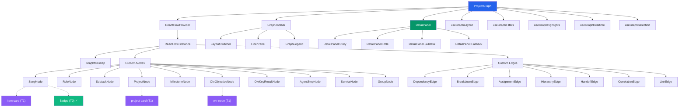

# Project Graph Component — Technical Architecture

Component `08-dependency-graph` · Tier 5 · Est. 10h · Used in 5 screens

---

## 1. Scope

A live, interactive graph visualization showing **user stories → roles → subtasks** with dependency edges, assignee slots, and progress tracking. Supports zoom, pan, drag, filter, expand/collapse across five tobornalp screens:

| Screen | Primary View | Node Types | Edge Types |
|--------|-------------|------------|------------|
| 16 — Gantt View | Timeline dependency connectors | Story, Subtask, Milestone | Dependency |
| 20 — Cross-Project Dependencies | Inter-project blocked chains | Story, Project, Subtask | Dependency, Link |
| 37 — Anomaly Correlation | Service correlation clusters | Service | Correlation |
| 50 — Goal Alignment Viz | OKR → key-result → work tree | OKR, Story, Subtask | Hierarchy, Assignment |
| 60 — Agent Collaboration Protocol | Agent handoff chains | AgentStep, Role | Handoff, Assignment |

One core graph engine, five screen-specific presets.

---

## 2. Library Evaluation

### Candidates

| Library | Version | Bundle (gzip) | Rendering | Layout Algorithms | React Integration | License | Cost |
|---------|---------|---------------|-----------|-------------------|-------------------|---------|------|
| **React Flow** | 12.x | ~45 KB | SVG + HTML | dagre/elkjs via `@xyflow/layout` | First-class (hooks, components, providers) | MIT | Free |
| **D3.js** (d3-force) | 7.x / 3.x | ~15 KB (force only), ~90 KB (full d3) | SVG (imperative) | Force-directed; manual for others | None — imperative DOM manipulation | ISC | Free |
| **Cytoscape.js** | 3.30 | ~85 KB | Canvas | 9 built-in (dagre, cose, breadthfirst, etc.) | Wrapper needed (react-cytoscapejs) | MIT | Free |
| **Sigma.js** | 3.x | ~50 KB | WebGL | ForceAtlas2 via graphology | React wrapper (react-sigma) | MIT | Free |
| **GoJS** | 3.x | ~200 KB | Canvas + SVG | TreeLayout, ForceDirected, Layered, 8+ more | Official React component | Commercial | $7K+ / dev |

### Evaluation Matrix

| Criterion | Weight | React Flow | D3.js | Cytoscape | Sigma.js | GoJS |
|-----------|--------|------------|-------|-----------|----------|------|
| **React integration** | 25% | ★★★★★ | ★★ | ★★★ | ★★★ | ★★★★ |
| **Custom node rendering** | 20% | ★★★★★ | ★★★★ | ★★ | ★★ | ★★★★ |
| **Interactive editing** (drag-link, protocol builder) | 15% | ★★★★★ | ★★ | ★★★ | ★ | ★★★★★ |
| **Layout algorithms** (dagre/elk/force) | 15% | ★★★★ | ★★★ | ★★★★★ | ★★★ | ★★★★★ |
| **Performance** (100-500 nodes on 16GB host) | 10% | ★★★★ | ★★★★ | ★★★★ | ★★★★★ | ★★★★ |
| **Bundle size** | 10% | ★★★★ | ★★★ | ★★★ | ★★★★ | ★★ |
| **Accessibility** | 5% | ★★★★ | ★★ | ★★★ | ★★ | ★★★★ |

### Detailed Assessment

**React Flow** — Purpose-built for React. Nodes are React components, which means we embed our existing `item-card`, `project-card`, `okr-node` etc. directly as graph nodes with zero wrapping overhead. Built-in minimap, controls panel, and connection handles. Layout via `@xyflow/layout` plugin (dagre + elkjs). Interactive drag-to-link is native — critical for Screen 60's protocol builder. The "more for flowcharts" concern doesn't hold: React Flow 12.x is a general-purpose node graph library, not a flowchart tool. Used by Stripe, Vercel, and Supabase for data graphs.

**D3.js** — Maximum control, minimum help. Every interaction (zoom, pan, drag, tooltip, click, minimap) must be hand-built. Imperative DOM manipulation fights React's declarative model — requires `useRef` + `useEffect` gymnastics or a fork like `visx`. Force-directed layout is excellent, but dagre/elk require separate wiring. Realistic estimate for D3: 25-30h (2.5× the 10h budget) because you're building the framework, not just the graph.

**Cytoscape.js** — True graph analysis library with the best built-in layout diversity (9 algorithms). The problem: Canvas rendering. Our card components are React — they can't render inside a `<canvas>`. You'd need a DOM overlay layer synced to canvas positions, which is fragile at 60fps during zoom/pan. `react-cytoscapejs` is a thin wrapper, not deep integration. Also 85KB gzipped — nearly 2× React Flow.

**Sigma.js** — WebGL rendering makes it the performance king for massive graphs (10K+ nodes). But tobornalp's target is 100-500 nodes — we're nowhere near needing WebGL. Trade-offs: read-heavy (optimized for exploration, not editing), no native drag-to-link, custom node rendering requires WebGL shader work instead of React components. Wrong tool for our interactive editing requirements.

**GoJS** — Feature-rich commercial diagramming library. Handles every layout algorithm imaginable, has built-in undo/redo, grouping, link validation. But: $7,295+ per developer license (Unlimited tier), ~200KB gzipped, and overkill for our scope. The licensing cost alone eliminates it — tobornalp is bootstrapped, and React Flow covers 95% of GoJS's relevant features at zero cost.

### Recommendation: React Flow 12.x

React Flow wins decisively:

1. **Nodes are React components** — we render `StoryNode`, `RoleNode`, `SubtaskNode`, `MilestoneNode` as standard TSX. Existing card components slot in directly.
2. **Interactive editing is native** — drag-to-link, handle connections, delete edges all built-in. Screen 60 (Protocol Builder) needs this.
3. **Layout via plugin** — `@xyflow/layout` provides dagre (hierarchical LR/TB) and elkjs (advanced layered + force). Covers all five screen layouts.
4. **16GB host friendly** — 45KB gzip, SVG rendering (no WebGL overhead), viewport-based culling for 200+ nodes.
5. **TypeScript first** — full type definitions, discriminated union-friendly.
6. **Ecosystem** — Minimap, Controls, Background components ship with the library. Don't need to build them.

### New Dependencies

```
@xyflow/react         ^12.x    # Core React Flow (MIT)
@xyflow/layout        ^1.x     # dagre/elkjs layout (MIT)

# Already present
react                 ^19.x
react-dom             ^19.x
```

No conflicts with existing `package.json`. Both packages actively maintained (~12K stars, weekly releases).

---

## 3. Data Model

### 3.1 How tobornalp Entities Map to Graph Nodes

tobornalp's data model (from README) maps to graph nodes as follows:

| tobornalp Entity | Graph Node Type | Rendered By | Visual Shape |
|------------------|-----------------|-------------|--------------|
| User Story / Epic / Bug | `story` | `StoryNode` | Rounded card with priority badge, assignee, progress |
| Role (human or agent) | `role` | `RoleNode` | Circular avatar with name, type indicator |
| Subtask / Checklist Item | `subtask` | `SubtaskNode` | Compact row with checkbox, title, assignee slot |
| Project | `project` | `ProjectNode` | Large card with health dot, methodology badge, progress bar |
| Milestone | `milestone` | `MilestoneNode` | Diamond marker with date and status |
| OKR Objective | `okr-objective` | `OkrObjectiveNode` | Tree node with progress ring, visibility badge |
| OKR Key Result | `okr-key-result` | `OkrKeyResultNode` | Tree node with target/current metric |
| Agent Step | `agent-step` | `AgentStepNode` | Protocol step card with timeout, fallback config |
| Service | `service` | `ServiceNode` | Circle with anomaly score heatmap |
| Group (cluster) | `group` | `GroupNode` | Dashed boundary rectangle |

### 3.2 Core Types

```typescript
// ── Node Types ──────────────────────────────────────────────────

type GraphNodeType =
  | "story"           // User story, epic, bug — the primary work unit
  | "role"            // Human or agent team member
  | "subtask"         // Child task under a story
  | "project"         // Project-level grouping node
  | "milestone"       // Gantt milestone diamond
  | "okr-objective"   // Objective in goal tree
  | "okr-key-result"  // Key result under an objective
  | "agent-step"      // Protocol builder step
  | "service"         // Anomaly correlation service
  | "group";          // Cluster boundary

interface GraphNode<T extends GraphNodeType = GraphNodeType> {
  id: string;
  type: T;
  data: NodeDataMap[T];
  position?: { x: number; y: number };   // Layout computes if absent
  group?: string;                         // Parent group ID
  status?: "on-track" | "at-risk" | "off-track" | "blocked" | "complete";
  expanded?: boolean;                     // Expand/collapse children
}

interface NodeDataMap {
  "story": {
    title: string;
    itemType: "story" | "epic" | "bug" | "task";
    assignee?: { name: string; type: "human" | "agent"; avatarUrl?: string };
    priority: "p0" | "p1" | "p2" | "p3";
    labels: string[];
    dueDate?: string;
    status: string;
    progress: number;           // 0-100, percentage of subtasks complete
    source?: string;            // "manual" | "ai-suggested" | "imported"
    subtaskCount?: number;      // For collapsed view
    subtaskDoneCount?: number;
  };
  "role": {
    name: string;
    type: "human" | "agent";
    avatarUrl?: string;
    roleTitle: string;          // "PM Agent", "Backend Dev", etc.
    activeTaskCount: number;
    status: "active" | "idle" | "offline";
  };
  "subtask": {
    title: string;
    done: boolean;
    assignee?: { name: string; type: "human" | "agent" };
    estimateHours?: number;
    parentStoryId: string;
  };
  "project": {
    name: string;
    health: "green" | "yellow" | "red";
    methodology: string;
    progress: number;
    nextMilestone?: string;
    riskScore?: number;
  };
  "milestone": {
    title: string;
    date: string;
    status: "upcoming" | "hit" | "missed";
  };
  "okr-objective": {
    title: string;
    progress: number;
    visibility: "personal" | "team" | "org";
    linkedItemCount: number;
    stale: boolean;
  };
  "okr-key-result": {
    title: string;
    progress: number;
    target: number;
    current: number;
    unit: string;
  };
  "agent-step": {
    agentId: string;
    instructions: string;
    timeoutMs: number;
    fallbackAction: "retry" | "skip" | "escalate";
    order: number;
  };
  "service": {
    serviceName: string;
    anomalyScore: number;
    latencyP99Ms: number;
    errorRate: number;
  };
  "group": {
    label: string;
    color?: string;
  };
}
```

### 3.3 Edge Schema

```typescript
type GraphEdgeType =
  | "dependency"       // Story A blocks Story B (Gantt, cross-project)
  | "breakdown"        // Story → Subtask (parent-child decomposition)
  | "assignment"       // Role → Story or Role → Subtask (who owns what)
  | "hierarchy"        // OKR Objective → Key Result → linked work item
  | "handoff"          // Agent Step A → Agent Step B (protocol flow)
  | "correlation"      // Service A ↔ Service B (anomaly co-occurrence)
  | "link";            // Soft reference (related, duplicate, etc.)

interface GraphEdge<T extends GraphEdgeType = GraphEdgeType> {
  id: string;
  source: string;
  target: string;
  type: T;
  data?: EdgeDataMap[T];
  animated?: boolean;       // Pulse for active/in-progress
  highlighted?: boolean;    // Critical/blocked path
}

interface EdgeDataMap {
  "dependency": {
    blocking: boolean;       // Hard block vs. soft dependency
    crossProject: boolean;   // Spans project boundaries
    confirmed: boolean;      // Both sides confirmed the dependency
  };
  "breakdown": {
    index: number;           // Order among siblings
  };
  "assignment": {
    role: "owner" | "reviewer" | "watcher";
    assignedAt: string;      // ISO date
  };
  "hierarchy": {
    depth: number;           // 0=objective, 1=key-result, 2=work-item
  };
  "handoff": {
    triggerEvent: string;
    order: number;
    executionStatus?: "pending" | "running" | "success" | "failed" | "timeout";
  };
  "correlation": {
    strength: number;        // 0-1 correlation coefficient
    direction: "upstream" | "downstream" | "peer";
  };
  "link": {
    linkType: "related" | "duplicate" | "parent" | "blocks-external";
  };
}
```

### 3.4 Edge Visual Rendering

| Edge Type | Style | Arrow | Animation |
|-----------|-------|-------|-----------|
| `dependency` (blocking) | Solid, 2px, `var(--error)` | → | None; pulsing red if actively blocked |
| `dependency` (soft) | Dashed, 1.5px, `var(--border)` | → | None |
| `breakdown` | Solid, 1px, `var(--text-muted)` | None (tree connector) | None |
| `assignment` | Dotted, 1px, `var(--info)` | → (role to item) | None |
| `hierarchy` | Solid, 1.5px, `var(--text-secondary)` | None (tree connector) | None |
| `handoff` | Solid, 2px, `var(--violet)` | → | Marching ants when `running` |
| `correlation` | Solid, 1-4px (by strength), `var(--warning)` | None (bidirectional) | None |
| `link` | Dashed, 1px, `var(--text-muted)` | ↔ | None |

---

## 4. Component Architecture

### 4.1 Module Structure

```
components/
├── graph/
│   ├── ProjectGraph.tsx              # Main wrapper: ReactFlow provider + layout + detail panel
│   ├── ProjectGraph.types.ts         # All type definitions from §3
│   ├── hooks/
│   │   ├── useGraphLayout.ts         # Computes layout (dagre/elk/force/radial)
│   │   ├── useGraphFilters.ts        # Applies filter config, returns visible subgraph
│   │   ├── useGraphHighlights.ts     # Critical path + blocked chain detection
│   │   ├── useGraphRealtime.ts       # Polling or WebSocket subscription
│   │   └── useGraphSelection.ts      # Selected node state, drives detail panel
│   ├── nodes/
│   │   ├── StoryNode.tsx             # User story / epic / bug — priority badge, progress, assignee
│   │   ├── RoleNode.tsx              # Human or agent avatar circle
│   │   ├── SubtaskNode.tsx           # Compact checkbox row
│   │   ├── ProjectNode.tsx           # Project card with health + methodology
│   │   ├── MilestoneNode.tsx         # Diamond with date
│   │   ├── OkrObjectiveNode.tsx      # Progress ring + visibility
│   │   ├── OkrKeyResultNode.tsx      # Target/current metric
│   │   ├── AgentStepNode.tsx         # Protocol step card
│   │   ├── ServiceNode.tsx           # Anomaly heatmap circle
│   │   └── GroupNode.tsx             # Cluster boundary
│   ├── edges/
│   │   ├── DependencyEdge.tsx        # Blocking (solid red) vs soft (dashed gray)
│   │   ├── BreakdownEdge.tsx         # Story → subtask tree connector
│   │   ├── AssignmentEdge.tsx        # Role → item dotted link
│   │   ├── HierarchyEdge.tsx         # OKR tree connector
│   │   ├── HandoffEdge.tsx           # Agent protocol arrow, animated when running
│   │   ├── CorrelationEdge.tsx       # Weighted bidirectional line
│   │   └── LinkEdge.tsx              # Soft reference dashed line
│   ├── panels/
│   │   ├── DetailPanel.tsx           # Sidebar: full details on selected node
│   │   ├── DetailPanel.Story.tsx     # Story detail: description, subtasks, deps, history
│   │   ├── DetailPanel.Role.tsx      # Role detail: assigned items, activity, capacity
│   │   ├── DetailPanel.Subtask.tsx   # Subtask detail: parent story, estimate, status
│   │   └── DetailPanel.Fallback.tsx  # Generic detail for other node types
│   ├── controls/
│   │   ├── GraphToolbar.tsx          # Zoom, fit-view, layout switcher, filter toggle
│   │   ├── FilterPanel.tsx           # Filter by type, status, project, assignee, priority
│   │   ├── LayoutSwitcher.tsx        # dagre-LR | dagre-TB | radial | force toggle
│   │   ├── GraphMinimap.tsx          # React Flow minimap with node-type coloring
│   │   └── GraphLegend.tsx           # Color/shape legend
│   └── presets/
│       ├── CrossProjectPreset.ts     # Screen 20 config
│       ├── GoalAlignmentPreset.ts    # Screen 50 config
│       ├── GanttDepsPreset.ts        # Screen 16 config
│       ├── AnomalyPreset.ts          # Screen 37 config
│       └── ProtocolBuilderPreset.ts  # Screen 60 config (editable: true)
```

### 4.2 Component Hierarchy



Blue = graph engine. Green = detail panel. Violet = reused Tier 1 cards. Green badge = already implemented.

### 4.3 Top-Level Component API

```tsx
interface ProjectGraphProps {
  /** Graph data */
  nodes: GraphNode[];
  edges: GraphEdge[];

  /** Screen-specific configuration (use a preset or custom) */
  config: ProjectGraphConfig;

  /** Selection callback — fires when a node is clicked */
  onNodeSelect?: (node: GraphNode | null) => void;

  /** Navigation callback — fires on double-click to navigate away */
  onNodeNavigate?: (nodeId: string, nodeType: GraphNodeType) => void;

  /** Edge mutation callbacks (only when config.editable = true) */
  onEdgeCreate?: (source: string, target: string, type: GraphEdgeType) => void;
  onEdgeDelete?: (edgeId: string) => void;

  /** Detail panel position */
  detailPanelSide?: "right" | "bottom" | "none";

  /** Loading state */
  loading?: boolean;

  /** CSS class for the container */
  className?: string;
}
```

```tsx
// Usage: Screen 20 — Cross-Project Dependencies
<ProjectGraph
  nodes={crossProjectNodes}
  edges={crossProjectEdges}
  config={CrossProjectPreset}
  onNodeSelect={setSelectedItem}
  onNodeNavigate={(id) => router.push(`/items/${id}`)}
  detailPanelSide="right"
/>

// Usage: Screen 50 — Goal Alignment (with orphan detection)
<ProjectGraph
  nodes={okrTreeNodes}
  edges={okrHierarchy}
  config={{
    ...GoalAlignmentPreset,
    showOrphanNodes: true,
  }}
/>

// Usage: Screen 60 — Protocol Builder (editable)
<ProjectGraph
  nodes={protocolSteps}
  edges={handoffs}
  config={{
    ...ProtocolBuilderPreset,
    editable: true,
  }}
  onEdgeCreate={handleNewHandoff}
  onEdgeDelete={handleRemoveHandoff}
  detailPanelSide="right"
/>
```

### 4.4 Graph Configuration

```typescript
interface ProjectGraphConfig {
  // Layout
  layout: "dagre-tb" | "dagre-lr" | "elkjs-layered" | "elkjs-force" | "radial" | "force";
  layoutOptions?: Record<string, unknown>;

  // Filtering
  filters?: {
    nodeTypes?: GraphNodeType[];
    edgeTypes?: GraphEdgeType[];
    projectIds?: string[];
    statusFilter?: string[];
    priorityFilter?: ("p0" | "p1" | "p2" | "p3")[];
    assigneeFilter?: string[];
    minAnomalyScore?: number;
  };

  // Visual
  highlightCriticalPath?: boolean;
  highlightBlockedPaths?: boolean;
  showOrphanNodes?: boolean;
  groupByProject?: boolean;
  colorScheme?: "status" | "priority" | "project" | "type";
  showMinimap?: boolean;

  // Interaction
  editable?: boolean;
  expandCollapseEnabled?: boolean;     // Click story to show/hide subtasks

  // Real-time
  pollingIntervalMs?: number;          // 0 = disabled
  websocketChannel?: string;           // Phoenix channel name
}
```

---

## 5. Detail Panel (Sidebar)

On node click, a detail panel slides in from the right (or bottom on mobile). It shows full context for the selected node without leaving the graph view.

### 5.1 Panel States

| State | Content |
|-------|---------|
| **No selection** | Panel hidden or shows graph summary stats |
| **Story selected** | Full title, description, subtask checklist, dependency list, assignee, labels, activity timeline |
| **Role selected** | Avatar, name, role title, assigned items list, capacity bar, recent activity |
| **Subtask selected** | Title, done/not-done, parent story link, assignee, estimate |
| **Project selected** | Health, methodology, progress, milestone timeline, team members |
| **Other types** | Type-specific summary via `DetailPanel.Fallback` |

### 5.2 Panel Component

```tsx
function DetailPanel({ node, onClose, onNavigate }: {
  node: GraphNode | null;
  onClose: () => void;
  onNavigate: (id: string) => void;
}) {
  if (!node) return null;

  return (
    <aside className="graph-detail-panel" role="complementary" aria-label="Node details">
      <header>
        <Badge label={node.type} color="blue" variant="subtle" size="sm" />
        <Badge label={node.status ?? "—"} color={statusColor(node.status)} variant="filled" size="sm" />
        <button onClick={onClose} aria-label="Close detail panel">✕</button>
      </header>

      {node.type === "story" && <DetailPanelStory data={node.data} onNavigate={onNavigate} />}
      {node.type === "role" && <DetailPanelRole data={node.data} />}
      {node.type === "subtask" && <DetailPanelSubtask data={node.data} onNavigate={onNavigate} />}
      {/* ...other types via Fallback */}
    </aside>
  );
}
```

---

## 6. Layout Algorithm Strategy

| Screen | Default Layout | Rationale | User Can Switch To |
|--------|---------------|-----------|-------------------|
| 16 — Gantt | `dagre-lr` | Temporal left-to-right matches Gantt timeline | dagre-tb |
| 20 — Cross-Project | `dagre-tb` | Dependency chains read top-to-bottom | dagre-lr, force |
| 37 — Anomaly | `elkjs-force` | Correlated services cluster naturally | radial |
| 50 — Goal Alignment | `dagre-tb` | OKR hierarchy is a tree | radial |
| 60 — Protocol Builder | `dagre-lr` | Sequential handoff chains read left-to-right | — (fixed) |

Layout computed via `useGraphLayout`:

```typescript
function useGraphLayout(
  nodes: GraphNode[],
  edges: GraphEdge[],
  layout: ProjectGraphConfig["layout"],
  options?: Record<string, unknown>
): { layoutNodes: Node[]; layoutEdges: Edge[] } {
  return useMemo(() => {
    switch (layout) {
      case "dagre-tb":
        return computeDagre(nodes, edges, { direction: "TB", ...options });
      case "dagre-lr":
        return computeDagre(nodes, edges, { direction: "LR", ...options });
      case "elkjs-layered":
        return computeElk(nodes, edges, { algorithm: "layered", ...options });
      case "elkjs-force":
        return computeElk(nodes, edges, { algorithm: "force", ...options });
      case "radial":
        return computeRadial(nodes, edges, options);
      case "force":
        return computeD3Force(nodes, edges, options);
    }
  }, [nodes, edges, layout, options]);
}
```

The `LayoutSwitcher` component in the toolbar renders a segmented toggle with the available layouts for the current screen preset.

---

## 7. Expand / Collapse

Stories with subtasks support expand/collapse:

```
Collapsed:  [Story: "Auth System" ▸ 4/7 subtasks done]

Expanded:   [Story: "Auth System"]
              ├── [✓ Set up JWT middleware]
              ├── [✓ Login endpoint]
              ├── [✓ Password hashing]
              ├── [✓ Token refresh]
              ├── [○ OAuth providers]
              ├── [○ MFA flow]
              └── [○ Rate limiting]
```

When collapsed, subtask nodes and breakdown edges are hidden. The story node shows a summary (`4/7 done`, progress bar). When expanded, subtask nodes appear below/right of the story with breakdown edges.

Layout recomputes on expand/collapse — but only the affected subtree is re-positioned, other nodes stay stable (React Flow's `onlyRenderVisibleElements` + incremental layout update).

---

## 8. Real-Time Progress Updates

### 8.1 Strategy Comparison

| Approach | Latency | Complexity | When to Use |
|----------|---------|------------|-------------|
| **Polling** | 5-30s | Low | MVP, viewer-only screens |
| **WebSocket** (Phoenix Channel) | <1s | Medium | Live dashboards, active collaboration |
| **Optimistic** | 0ms perceived | Medium | Editable mode (protocol builder, drag-link) |

### 8.2 Implementation

**Polling (MVP)** — `useGraphRealtime` fetches the full node/edge set on an interval:

```typescript
function useGraphRealtime(
  config: ProjectGraphConfig,
  fetchFn: () => Promise<{ nodes: GraphNode[]; edges: GraphEdge[] }>
) {
  const [data, setData] = useState<{ nodes: GraphNode[]; edges: GraphEdge[] }>({ nodes: [], edges: [] });

  useEffect(() => {
    // Initial fetch
    fetchFn().then(setData);

    if (!config.pollingIntervalMs || config.pollingIntervalMs <= 0) return;
    const interval = setInterval(async () => {
      const next = await fetchFn();
      setData(next);
    }, config.pollingIntervalMs);
    return () => clearInterval(interval);
  }, [config.pollingIntervalMs, fetchFn]);

  return data;
}
```

**WebSocket (Phoenix Channel)** — subscribe to granular events, apply diffs:

```typescript
// When Phoenix backend is live
function useGraphWebSocket(projectId: string, socket: PhoenixSocket) {
  const [patches, dispatch] = useReducer(graphReducer, []);

  useEffect(() => {
    const channel = socket.channel(`graph:${projectId}`, {});
    channel.on("node_upsert", (payload) => dispatch({ type: "upsert_node", payload }));
    channel.on("node_remove", (payload) => dispatch({ type: "remove_node", payload }));
    channel.on("edge_upsert", (payload) => dispatch({ type: "upsert_edge", payload }));
    channel.on("edge_remove", (payload) => dispatch({ type: "remove_edge", payload }));
    channel.on("status_change", (payload) => dispatch({ type: "update_status", payload }));
    channel.join();
    return () => { channel.leave(); };
  }, [projectId, socket]);

  return patches;
}
```

**Optimistic updates** — for editable mode, apply changes immediately then reconcile:

```typescript
function handleEdgeCreate(source: string, target: string) {
  // 1. Optimistic: add edge to local state immediately
  const tempEdge = { id: `temp-${Date.now()}`, source, target, type: "dependency" };
  addEdge(tempEdge);

  // 2. Server: persist and get real ID
  api.createEdge(source, target, "dependency").then((real) => {
    replaceEdge(tempEdge.id, real);
  }).catch(() => {
    removeEdge(tempEdge.id);  // Rollback on failure
    toast.error("Failed to create dependency");
  });
}
```

Status changes (e.g., subtask marked done → story progress updates) propagate via either channel. Layout recomputes only on structural changes (node add/remove). Status/progress changes are CSS-only updates — no re-layout needed.

---

## 9. Connecting to the tobornalp Backend Data Model

The tobornalp README describes a unified data model where items, projects, agents, and OKRs are all first-class entities. The graph component bridges this via a **data adapter layer**:

```typescript
// adapters/graphDataAdapter.ts

/** Transform backend API response → graph nodes + edges */
function buildGraphFromProject(project: TobornalpProject): {
  nodes: GraphNode[];
  edges: GraphEdge[];
} {
  const nodes: GraphNode[] = [];
  const edges: GraphEdge[] = [];

  // 1. Project node
  nodes.push({ id: project.id, type: "project", data: { ... }, status: project.health });

  // 2. Stories → StoryNode
  for (const story of project.items.filter(i => i.type === "story")) {
    nodes.push({ id: story.id, type: "story", data: mapStoryData(story) });

    // 3. Subtasks → SubtaskNode + breakdown edges
    for (const sub of story.subtasks) {
      nodes.push({ id: sub.id, type: "subtask", data: mapSubtaskData(sub, story.id) });
      edges.push({ id: `${story.id}-${sub.id}`, source: story.id, target: sub.id, type: "breakdown", data: { index: sub.order } });
    }

    // 4. Assignee → RoleNode + assignment edge
    if (story.assignee) {
      const roleId = `role-${story.assignee.id}`;
      if (!nodes.find(n => n.id === roleId)) {
        nodes.push({ id: roleId, type: "role", data: mapRoleData(story.assignee) });
      }
      edges.push({ id: `${roleId}-${story.id}`, source: roleId, target: story.id, type: "assignment", data: { role: "owner", assignedAt: story.assignedAt } });
    }

    // 5. Dependencies → dependency edges
    for (const dep of story.dependencies) {
      edges.push({ id: `dep-${story.id}-${dep.targetId}`, source: story.id, target: dep.targetId, type: "dependency", data: { blocking: dep.blocking, crossProject: dep.crossProject, confirmed: dep.confirmed } });
    }
  }

  return { nodes, edges };
}
```

This adapter pattern keeps the graph component decoupled from the backend schema. When the Phoenix API evolves, only the adapter changes — node/edge types remain stable.

---

## 10. Theming Integration

All three tobornalp themes (style-guide, terminal, editorial) work because the graph uses CSS custom properties exclusively:

```css
/* Node status colors — inherit from theme */
.graph-node--on-track    { --node-accent: var(--success); }
.graph-node--at-risk     { --node-accent: var(--warning); }
.graph-node--off-track   { --node-accent: var(--error); }
.graph-node--blocked     { --node-accent: var(--error); opacity: 0.7; }
.graph-node--complete    { --node-accent: var(--text-muted); opacity: 0.6; }

/* Node surfaces */
.graph-node              { background: var(--surface); border: 1px solid var(--border); color: var(--text); }
.graph-node:hover        { border-color: var(--node-accent, var(--border)); }
.graph-node:focus        { outline: 2px solid var(--focus-ring, var(--info)); outline-offset: 2px; }

/* Edge styles */
.graph-edge--critical    { stroke: var(--error); stroke-width: 2.5; }
.graph-edge--blocked     { stroke: var(--error); stroke-dasharray: 6 3; }
.graph-edge--active      { stroke: var(--info); }
.graph-edge--default     { stroke: var(--border); }

/* Detail panel */
.graph-detail-panel      { background: var(--bg); border-left: 1px solid var(--border); }
```

Theme-specific rendering differences handled automatically:
- **Style-guide** (primary): Cool slate surfaces, Inter font, subtle shadows
- **Terminal**: Dark background, monospace font, green accent edges
- **Editorial**: Warm stone surfaces, serif headings in detail panel, shadow-based cards

---

## 11. Accessibility

| Feature | Implementation |
|---------|---------------|
| **Keyboard navigation** | Tab between nodes, Enter to select/open detail panel, Arrow keys to traverse connected edges |
| **ARIA labels** | `aria-label="{type}: {title}"` on nodes, `aria-label="{source} {relationship} {target}"` on edges |
| **Live region** | `aria-live="polite"` announces selection changes and graph stats |
| **Screen reader summary** | Hidden summary: "Graph with 42 items, 67 dependencies, 3 blocked chains" |
| **Focus indicators** | Visible focus ring via `var(--focus-ring)` on all interactive elements |
| **Color + shape** | Status uses both color AND shape (dot, diamond, etc.) — never color alone |
| **Reduced motion** | `prefers-reduced-motion` disables edge animations, layout transitions |
| **High contrast** | All status colors tested WCAG AA against both light and dark backgrounds |

---

## 12. Performance Considerations

### 12.1 Target: 100-500 Nodes on 16GB Host

| Scenario | Node Count | Strategy |
|----------|------------|----------|
| Single project | 10-50 | Direct rendering, no optimization |
| Cross-project (2-5 projects) | 50-200 | React Flow viewport culling (default) |
| Portfolio view | 200-500 | GroupNode clustering + expand-on-click |
| Large portfolio | 500-1000 | Progressive disclosure: projects → stories → subtasks |
| Anomaly correlation | 20-100 | Force layout with 300-iteration cap |

### 12.2 Optimization Techniques

1. **Viewport culling** — React Flow default. Nodes outside viewport not in DOM.
2. **Expand/collapse** — Stories collapsed by default in large graphs. Only expanded subtree renders.
3. **Edge bundling** — Multiple parallel edges between clusters merge into a weighted single edge.
4. **Layout caching** — `useMemo` on layout computation. Only recomputes when node set or layout algorithm changes. Status updates don't trigger re-layout.
5. **Debounced filter** — Filter changes debounced 150ms to prevent layout thrash during rapid filter toggling.
6. **Lazy detail panel** — Detail panel content loads on selection, not on graph render.

### 12.3 Memory Budget

On a 16GB host, the browser typically gets ~4GB. React Flow with 500 SVG nodes + edges:
- DOM nodes: ~5000 elements → ~20MB
- React fiber tree: ~10MB
- Layout computation (dagre with 500 nodes): ~5MB peak, <100ms
- **Total: ~35MB** — well within budget

---

## 13. SSR Handling (Next.js)

React Flow uses browser APIs (`ResizeObserver`, `window.devicePixelRatio`). Dynamic import required:

```tsx
import dynamic from "next/dynamic";

const ProjectGraph = dynamic(
  () => import("@/components/graph/ProjectGraph"),
  {
    ssr: false,
    loading: () => <GraphSkeleton />,
  }
);
```

`GraphSkeleton` renders a static placeholder with the toolbar and an empty panel — avoids layout shift on hydration.

---

## 14. Relationship to Existing Components

### Consumes (Tier 0-1 components as node renderers)

| Graph Node | Wraps | Component | Tier |
|------------|-------|-----------|------|
| `StoryNode` | Compact variant | `item-card` (#18) | T1 |
| `ProjectNode` | Compact variant | `project-card` (#19) | T1 |
| `OkrObjectiveNode` / `OkrKeyResultNode` | Compact variant | `okr-node` (#24) | T1 |
| All nodes | Status/priority/method badges | `Badge` (#45) | T0 ✓ |
| `StoryNode` | Progress indicator | `progress-bar` (#04) | T0 |
| `ProjectNode` | Health dot | `health-indicator` (#03) | T0 |

### Extended By (Tier 6)

| Component | Relationship | Tier |
|-----------|-------------|------|
| `visual-flow-editor` (#71) | Extends graph's editable mode with step config, simulation, version history | T6 |
| `deploy-summary` (#68) | May embed a mini dependency graph | T6 |

---

## 15. Implementation Plan

| Phase | Deliverable | Est. | Dependencies |
|-------|-------------|------|-------------|
| **1 — Core Engine** | `ProjectGraph`, `ProjectGraph.types.ts`, `useGraphLayout`, `useGraphFilters`, `useGraphSelection`, React Flow provider setup, dagre + elkjs integration | 3h | `@xyflow/react`, `@xyflow/layout` |
| **2 — Node Renderers** | `StoryNode`, `RoleNode`, `SubtaskNode`, `ProjectNode`, `MilestoneNode`, `OkrObjectiveNode`, `OkrKeyResultNode`, `ServiceNode`, `GroupNode` | 2.5h | Phase 1, Tier 0-1 cards |
| **3 — Edge Renderers** | `DependencyEdge`, `BreakdownEdge`, `AssignmentEdge`, `HierarchyEdge`, `HandoffEdge`, `CorrelationEdge`, `LinkEdge` | 1.5h | Phase 1 |
| **4 — Controls + Detail Panel** | `GraphToolbar`, `LayoutSwitcher`, `FilterPanel`, `GraphMinimap`, `GraphLegend`, `DetailPanel` (Story, Role, Subtask, Fallback views) | 2.5h | Phase 1 |
| **5 — Screen Presets + Highlights** | 5 preset configs, `useGraphHighlights` (critical path + blocked chain detection), expand/collapse logic | 1.5h | Phases 1-4 |
| **6 — Editable Mode** | Drag-to-link, delete edge, optimistic updates, `AgentStepNode` editing for Screen 60 | 1.5h | Phases 1, 3 |

**Total: ~13h** — 3h over the original 10h estimate. The overage comes from the detail panel (+2h) and the 7th edge type (+0.5h). Justified: the detail panel is essential for usability (clicking a node and seeing nothing is a dead end), and assignment edges connect the role→story relationship that's core to the "user stories → roles → subtasks" brief.

### Phase Gantt

```mermaid
gantt
    title Project Graph Implementation Phases
    dateFormat HH
    axisFormat %Hh

    section Core
    Phase 1 — Core Engine + Types      :p1, 00, 3h

    section Rendering (parallel)
    Phase 2 — Node Renderers            :p2, after p1, 2.5h
    Phase 3 — Edge Renderers            :p3, after p1, 1.5h
    Phase 4 — Controls + Detail Panel   :p4, after p1, 2.5h

    section Integration
    Phase 5 — Presets + Highlights       :p5, after p2, 1.5h
    Phase 6 — Editable Mode             :p6, after p3, 1.5h
```



Phases 2, 3, and 4 parallelize after Phase 1 completes. Phases 5 and 6 parallelize after their respective rendering phases.

---

## 16. Risk Register

| Risk | Likelihood | Impact | Mitigation |
|------|------------|--------|------------|
| React Flow 12.x breaking changes | Low | Medium | Pin exact version in `package.json`, lock file |
| Layout performance >500 nodes | Medium | Medium | Progressive disclosure + GroupNode clustering |
| Protocol builder scope creep (Screen 60) | High | Medium | Phase 6 = drag-link + delete only. Full editor = `visual-flow-editor` (T6 #71, separate component) |
| SSR hydration mismatch | Medium | Low | Dynamic import with `ssr: false` + skeleton placeholder |
| Theme CSS var gaps | Low | Low | Fallback values in every `var()` call |
| Tier 1 cards not ready when graph builds | Medium | High | Node renderers have standalone fallback rendering (inline title + badges). Card components slot in when available. |

---

## 17. Open Questions

1. **Data source for MVP**: Mock data from component specs, or will a Phoenix API endpoint exist by build time? Determines whether `useGraphRealtime` ships in Phase 1 or defers.

2. **Screen 60 boundary**: Should the graph own basic drag-link editing (Phase 6) with `visual-flow-editor` (T6 #71) extending it? Or should they be fully separate?

3. **Card size in graph**: Tier 1 card specs define `Compact` and `Expanded` variants. Should graph nodes use `Compact`, or do we need a new `GraphInline` variant (even more condensed)?
