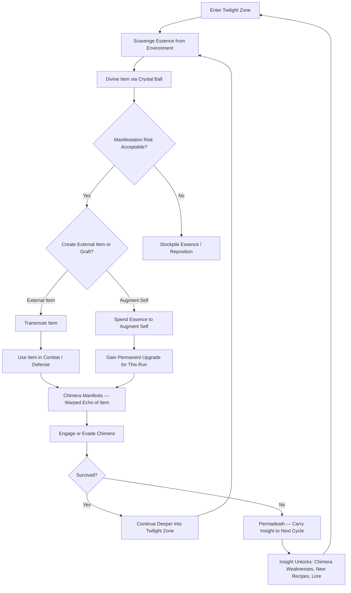

# Echo of Manifestation — Core Loop

The primary gameplay loop for a single 30-60 minute run.

## Core Loop Breakdown

| Step | Player Action | System Response | Skill Expression |
|------|--------------|----------------|-----------------|
| 1. Scavenge | Search ruined structures, collapsed shrines, and fog-choked clearings for essence nodes | Essence quantity and quality vary by zone depth — shallow zones yield 5-15 units, deep zones yield 20-50 but spawn stronger ambient chimeras | Route planning, risk assessment |
| 2. Divine | Activate crystal ball to preview the chimera that a specific transmutation will spawn | Crystal ball reveals chimera type (weapon, defensive, utility echo), estimated threat level (faint shimmer = weak, dark pulse = deadly), and one behavioral trait (e.g., "fast but fragile," "slow but regenerates") | Information interpretation, cost-benefit analysis |
| 3. Transmute | Spend essence at an Alchemy Shrine to create an item | Item materializes. Simultaneously, a chimera manifests at a random shadow node within 30-60m. Chimera receives a warped version of the item (see Manifestation Table) | Resource management, timing |
| 3b. Augment | Spend essence to permanently upgrade yourself for the remainder of this run | Gain a resonance augmentation (passive stat boost, new ability, or utility enhancement). Augmentations are tiered — deeper zones unlock higher tiers. The chimera that manifests is a standard chimera, same as item creation — creation is summoning, regardless of whether you made an item or upgraded yourself | Build specialization, resource allocation |
| 4. Use | Deploy the item — attack, defend, trap, heal — or benefit from an active augmentation | Item/augmentation functions as designed. Player gains immediate tactical advantage. Augmentations are passive or always-on for the rest of the run | Combat positioning, trap placement, build optimization |
| 5. Echo | Chimera activates and hunts the player using its warped version of the item | Chimera behavior is a dark mirror: your sword spawns a chimera that uses a jagged shadow-blade; your barricade spawns a chimera that hides behind shadow-walls and ambushes | Enemy pattern recognition, adaptation |
| 6. Engage/Evade | Fight the chimera or run to a Time Dilation Zone | Combat costs resources (durability, health, stamina). Evasion costs time (essence nodes deplete over time; the zone shifts) | Tactical decision-making under pressure |
| 7. Progress | Reach the zone's Threshold Shrine to descend to the next depth layer | New zone type, new essence types, new transmutation recipes unlock, ambient difficulty increases | Survival endurance |
| 8. Die | Lose current run; carry forward accumulated Insight points | Insight unlocks permanent upgrades: chimera weakness database, new recipes, lore fragments, starting loadout options | Meta-progression planning |

> **Design Note — The Augment Choice:** Choosing to augment yourself is a strategic branch — spend essence on permanent run upgrades instead of consumable items. Augmentation is a 4X-style upgrade tree: each tier unlocks stronger passive bonuses, new abilities, or utility enhancements. The chimera spawned by augmenting is the same as any other creation — a standard chimera, not a mirror of your body. The trade-off is purely economic: essence spent on yourself is essence not spent on items.
