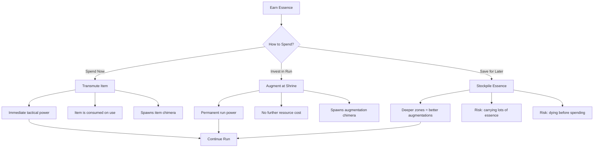

# Echo of Manifestation — Resonance Augmentation System

> "The shrines still work. Feed them essence, choose your enhancement, walk away stronger. The pre-Collapse engineers knew what they were doing."
> — The Librarian, Archive Note #417

## 1. Overview

Pre-Collapse civilization developed resonance augmentation stations — essence-powered devices that enhance human capabilities. These shrines are scattered throughout the Twilight Zone, still functioning after two centuries. The player spends essence at these shrines to permanently (for that run) augment their physical and mental capabilities.

The system is pure resource management. Essence is the currency. Augmentations are the investment. More powerful augmentations cost more essence and are found in deeper zones. Every augmentation makes the player meaningfully stronger — there are no trap choices, only prioritization choices.

The strategic tension is simple: do you spend essence on items (immediate tactical power, consumed on use) or augmentations (permanent power for the rest of the run, but the benefit is delayed)? Early in a run, a weapon might save your life right now. But a Vitality augmentation means every future fight is easier. This is the core decision the system creates.

Augmenting at a shrine still counts as transmutation — the shrine converts essence into a biological enhancement, and the Manifestation system responds by spawning a chimera. The chimera is the cost of doing business. You budget for it the same way you budget for the essence itself.

---

## 2. Augmentation Categories

Six categories, each with a clear, distinct gameplay benefit. No overlap, no ambiguity.

| Category | What It Does | Theme |
|----------|-------------|-------|
| **Vitality** | Increases max HP, HP regeneration | Survival |
| **Strength** | Increases melee damage, carry capacity | Combat power |
| **Perception** | Extends divination range, reveals more chimera info | Information |
| **Agility** | Movement speed, dodge window, stamina regen | Mobility |
| **Resilience** | Damage reduction, resistance to zone hazards | Defense |
| **Affinity** | Essence gain rate, transmutation efficiency, recipe mastery | Economy |

---

## 3. Augmentation Tree

24 augmentations total. Four tiers per category. Higher tiers require deeper zones to access. Each augmentation can only be taken once per run. All augmentations are permanent for the duration of that run.

### Vitality Augmentations

| Tier | Name | Essence Cost | Effect | Available From |
|------|------|-------------|--------|---------------|
| 1 | **Iron Blood** | 25 | +20 max HP | Zone 1+ |
| 2 | **Amber Heart** | 70 | +40 max HP; regenerate 1 HP every 10 seconds | Zone 3+ |
| 3 | **Toll of Winters** | 120 | +70 max HP; regenerate 2 HP every 8 seconds; healing items 25% more effective | Zone 5+ |
| 4 | **Undying Echo** | 220 | +100 max HP; regenerate 3 HP every 6 seconds; healing items 50% more effective; survive one lethal hit at 1 HP per floor | Zone 7+ |

### Strength Augmentations

| Tier | Name | Essence Cost | Effect | Available From |
|------|------|-------------|--------|---------------|
| 1 | **Iron Sinew** | 30 | +15% melee damage | Zone 1+ |
| 2 | **Forge Grip** | 65 | +30% melee damage; +1 item carry capacity | Zone 3+ |
| 3 | **Crucible Fist** | 110 | +50% melee damage; +2 item carry capacity; heavy attacks deal AoE damage in 2m radius | Zone 5+ |
| 4 | **Threshold Break** | 200 | +75% melee damage; +3 item carry capacity; heavy attacks deal AoE in 3m radius; break cracked walls and barricades | Zone 7+ |

### Perception Augmentations

| Tier | Name | Essence Cost | Effect | Available From |
|------|------|-------------|--------|---------------|
| 1 | **Amber Sight** | 25 | Divination range +5m; reveals hidden shadow nodes within 8m | Zone 1+ |
| 2 | **Third Lens** | 70 | Divination range +10m; auto-divine chimeras within 8m (free Tier 1 divination); reveal environmental traps | Zone 3+ |
| 3 | **Witch Eye** | 130 | Divination range +15m; auto-divine at Tier 2 within 12m; chimera weakness indicators visible as color-coded auras | Zone 5+ |
| 4 | **All-Sight** | 240 | Divination range +20m; auto-divine at Tier 3 within 18m; full minimap within 25m; see through walls within 8m | Zone 7+ |

### Agility Augmentations

| Tier | Name | Essence Cost | Effect | Available From |
|------|------|-------------|--------|---------------|
| 1 | **Echo Step** | 25 | +10% movement speed; dodge roll distance +15% | Zone 1+ |
| 2 | **Wind Tendon** | 65 | +20% movement speed; dodge roll distance +25%; sprint duration +4 seconds | Zone 3+ |
| 3 | **Hawk Reflex** | 110 | +30% movement speed; dodge roll has i-frames for 0.3s; sprint duration +8 seconds; stamina regen +25% | Zone 5+ |
| 4 | **Threshold Velocity** | 210 | +45% movement speed; dodge roll chainable (2 consecutive rolls); unlimited sprint; wall-run for 2 seconds on vertical surfaces | Zone 7+ |

### Resilience Augmentations

| Tier | Name | Essence Cost | Effect | Available From |
|------|------|-------------|--------|---------------|
| 1 | **Stone Skin** | 30 | 10% damage reduction from all sources | Zone 1+ |
| 2 | **Amber Mantle** | 75 | 20% damage reduction; +30% resistance to elemental hazards (fire, water, toxin) | Zone 3+ |
| 3 | **Basalt Shell** | 125 | 30% damage reduction; full elemental resistance; one-hit protection per floor (survive a lethal hit at 1 HP) | Zone 5+ |
| 4 | **Threshold Carapace** | 230 | 40% damage reduction; full environmental immunity; absorb up to 50 incoming damage and release as AoE pulse on next attack | Zone 7+ |

### Affinity Augmentations

| Tier | Name | Essence Cost | Effect | Available From |
|------|------|-------------|--------|---------------|
| 1 | **Essence Sieve** | 25 | +15% essence yield from all sources | Zone 1+ |
| 2 | **Resonant Harvest** | 60 | +30% essence yield; transmutation costs reduced by 10%; passive essence drain within 3m of nodes | Zone 3+ |
| 3 | **Alchemist's Bounty** | 100 | +50% essence yield; transmutation costs reduced by 20%; passive drain range 5m; gain 5 bonus essence per chimera kill | Zone 5+ |
| 4 | **Threshold Engine** | 190 | +75% essence yield; transmutation costs reduced by 30%; passive drain range 8m; transmutation cooldown reduced by 25%; essence capacity +100 | Zone 7+ |

---

## 4. Augmentation Shrines

Augmentation shrines are resonance-powered stations found throughout the Twilight Zone. They are the remnants of pre-Collapse enhancement facilities — still functional, still accurate, still expensive.

**Shrine Placement:** Each zone has 1-2 shrines per floor. Shrine locations are randomized within each run but always appear in rooms that are not boss rooms or safe rooms.

**Using a Shrine:**
1. Walk up to the shrine and interact.
2. The shrine displays available augmentations based on the current zone depth (deeper zones unlock higher tiers).
3. Select an augmentation. Spend the essence. The enhancement is applied immediately.
4. The process takes 5 seconds — the player is stationary and vulnerable.
5. A chimera spawns (see Section 6). Deal with it or evade it.
6. The augmentation is now active for the rest of the run.

**Shrine Rules:**
- Each augmentation can only be taken once per run. If you already have Iron Blood, no shrine will offer it again.
- Shrines show all categories at once. You pick what you want.
- Shrines do not run out — they are stations, not consumables. But each shrine can only be used once per floor.
- There is no prerequisite chain within a category. You can skip Tier 1 and go straight to Tier 2 if you have the essence and are in a deep enough zone. However, the effects do not stack — Tier 2 replaces Tier 1 if you later acquire both.

**Shrine Availability by Zone:**

| Zone | Shrines Per Floor | Tiers Available |
|------|-------------------|-----------------|
| 1 — Faded Chapel | 1 | Tier 1 |
| 2 — Sunken Market | 1 | Tier 1 |
| 3 — Bleached Asylum | 1-2 | Tier 1, Tier 2 |
| 4 — Petrified Forest | 1-2 | Tier 1, Tier 2 |
| 5 — Shattered Observatory | 1-2 | Tier 1, Tier 2, Tier 3 |
| 6 — Resonance Core | 1-2 | Tier 1, Tier 2, Tier 3 |
| 7 — Plane of Echoes | 2 | Tier 1, Tier 2, Tier 3, Tier 4 |
| 8 — The Threshold | 2 | Tier 1, Tier 2, Tier 3, Tier 4 |

---

## 5. Strategic Decisions

The augmentation system creates a single core tension: **how do you allocate your essence?**

**Three valid strategies:**

| Strategy | How It Works | Risk |
|----------|-------------|-------|
| **Item-Heavy** | Spend most essence on transmuted items. Solve problems with consumables. Flexible but expensive over time. | Runs out of steam in deeper zones when items are consumed and essence is scarce |
| **Augment-Heavy** | Invest early in augmentations. Start slow, end strong. Permanent power compounds with zone depth. | Weak early game — may die before augmentations pay off. Each augmentation spawns a chimera you must survive. |
| **Balanced** | Augment defensively first (Vitality, Resilience), then spend freely on items for offense. | No single moment of overwhelming power. Relies on consistent play. |

**The essence economy is the balancing lever.** If augments are too cheap, items become irrelevant. If augments are too expensive, only item-heavy builds are viable. The costs above are tuned so that a full Augment-Heavy build consumes roughly 60-70% of a run's total essence income, leaving room for a few key items.

---

## 6. Integration with Manifestation System

Augmenting yourself at a shrine is transmutation — you are converting essence into a permanent enhancement. The Manifestation system treats this the same as any other transmutation: a chimera spawns.

The chimera spawned is determined by the augmentation category. Each category produces a specific augmentation chimera with thematically appropriate behavior.

### Augmentation Chimera Table

| Category | Chimera Name | HP | Damage | Speed | Behavior |
|----------|-------------|-----|--------|-------|----------|
| **Vitality** | **Husk** | High (200) | Low (8) | Slow | Tanky chimera that absorbs punishment. Regenerates 3 HP/sec. Does not pursue aggressively — walks toward the player steadily. Rewards burst damage. |
| **Strength** | **Fury** | Medium (140) | High (22) | Medium | Aggressive melee chimera with powerful lunging attacks. Hits hard but telegraphs for 0.8 seconds. Rewards dodge timing. |
| **Perception** | **Shade** | Low (90) | Medium (12) | Fast when visible | Stealth chimera that cloaks for 4 seconds after taking damage. Reveals itself briefly when attacking. Rewards awareness and positioning. |
| **Agility** | **Sprint** | Low (80) | Low-Medium (10) | Very Fast | Extremely fast chimera that circles the player and strikes from behind. Fragile but hard to hit. Rewards area attacks and patience. |
| **Resilience** | **Bastion** | Very High (260) | Medium (14) | Slow | Armored chimera with a hardened shell. Takes 50% reduced damage from the front. Vulnerable from behind. Rewards flanking. |
| **Affinity** | **Drain** | Medium (120) | Low (6) | Medium | Essence-draining chimera. Each hit steals 5-10 essence from the player. Does not deal much HP damage but is economically punishing. Kills prioritize resource protection. |

**Augmentation chimera spawn rules:**
- Spawns 15-25m from the shrine (not on top of the player — there is a brief buffer).
- Only one augmentation chimera spawns per augmentation. No chain spawns.
- The chimera does not despawn. If you leave the area, it will patrol near the shrine until engaged or the floor is cleared.
- Augmentation chimeras drop 15-25 essence on kill — a partial refund that softens the total cost.

---

## 7. Insight Meta-Progression for Augmentation

Insight unlocks improve the augmentation system across runs. These are permanent meta-progression upgrades that make future runs more rewarding.

| Insight Cost | Unlock | Effect |
|-------------|--------|--------|
| 10 | **Efficient Bonding** | All augmentation essence costs reduced by 10% |
| 25 | **Shrine Sense** | Augmentation shrine locations appear on the minimap |
| 40 | **Quick Start** | Begin each run with one free Tier 1 augmentation (chosen at run start from available categories) |
| 60 | **Deep Resonance** | All augmentation essence costs reduced by 20% (stacks with Efficient Bonding, total 30% reduction) |
| 80 | **Resonance Category** | Unlock a 7th augmentation category: **Resonance** — unique powerful effects (see below) |
| 100 | **Clean Frequency** | All augmentations have 50% chance to not spawn a chimera |

### Resonance Category (Unlocked at 80 Insight)

Resonance augmentations are high-impact enhancements that don't fit neatly into the other six categories. They represent the player's growing mastery of transmutation itself.

| Tier | Name | Essence Cost | Effect | Available From |
|------|------|-------------|--------|---------------|
| 1 | **Harmonic Touch** | 35 | Transmutation cooldown reduced by 15% | Zone 3+ |
| 2 | **Echo Chamber** | 80 | Items last 30% longer (durability, duration, ammo); chimera threat modifier reduced by 0.1 across all categories | Zone 5+ |
| 3 | **Threshold Hum** | 150 | Transmute without a shrine once per floor; all divination is one tier higher than current level | Zone 7+ |
| 4 | **Resonant Apex** | 280 | All other augmentation effects increased by 15%; essence gain +25%; transmutation no longer spawns chimeras for item creation (augmentation chimeras still spawn) | Zone 8 |

---

*This document is the canonical design specification for the Resonance Augmentation system in Echo of Manifestation. All augmentation balancing, shrine placement, and chimera integration should reference this document.*
