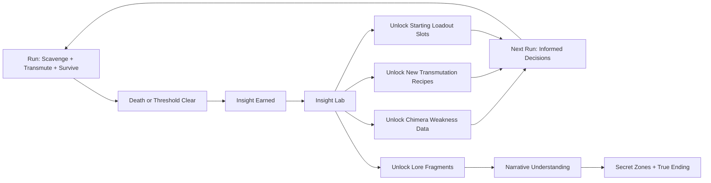

# Echo of Manifestation — Meta Loop

Run-to-run progression systems and permanent growth axes.

## Run-to-Run Progression

## Progression Axes

| Axis | What Grows | How It Feels | Cap |
|------|-----------|-------------|-----|
| **Insight Level** | Permanent knowledge — chimera behavior database, recipe library | "I understand this enemy now. Last time it killed me. This time I know its pattern." | 99 Insight levels, each requiring increasing XP |
| **Recipe Library** | New transmutation recipes unlocked via Insight or zone discovery | "I can make new things — and I know what chimeras they'll spawn" | 38 recipes across 6 categories |
| **Chimera Codex** | Detailed behavioral data on each chimera type, including weaknesses | "The shadow-sword chimera flinches after its lunge — that's my window" | 27 chimera types documented |
| **Lore Fragments** | Narrative pieces revealing the Twilight Zone's origin and the Alchemist's history | "The world has a story, and I'm uncovering it one death at a time" | 64 fragments across 8 zones |
| **Player Skill** | Route optimization, transmutation timing, combat mastery, divination reading speed | Invisible but dominant — you survive longer, push deeper, die smarter | No cap — mastery is perpetual |
| **Starting Loadout** | Begin runs with pre-selected items (costs Insight to slot) | "I'm not starting from nothing anymore — I earned this head start" | 3 loadout slots, each with tiered item options |
| **Augmentation Level** | Permanent run upgrades via resonance augmentation — spend essence to upgrade yourself for the duration of a run | "I'm getting stronger. Deeper zones, better upgrades, bigger risks." | 24 augmentations (4 tiers x 6 categories) |
