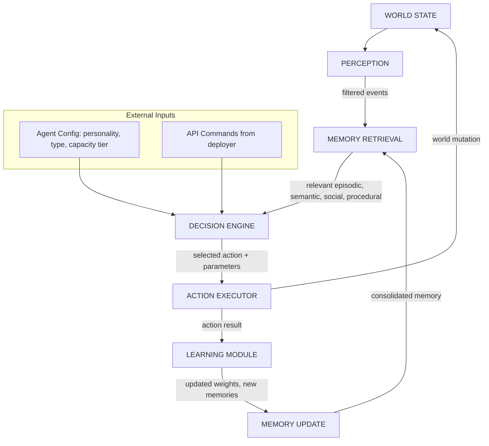
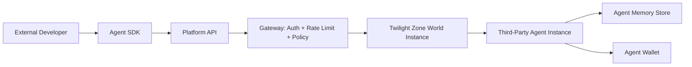
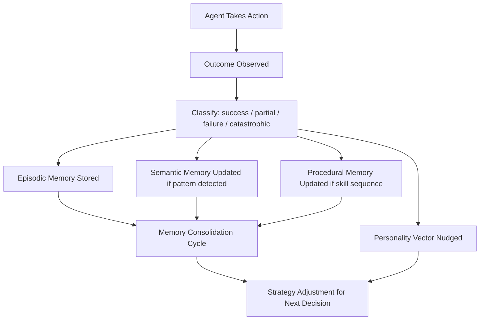
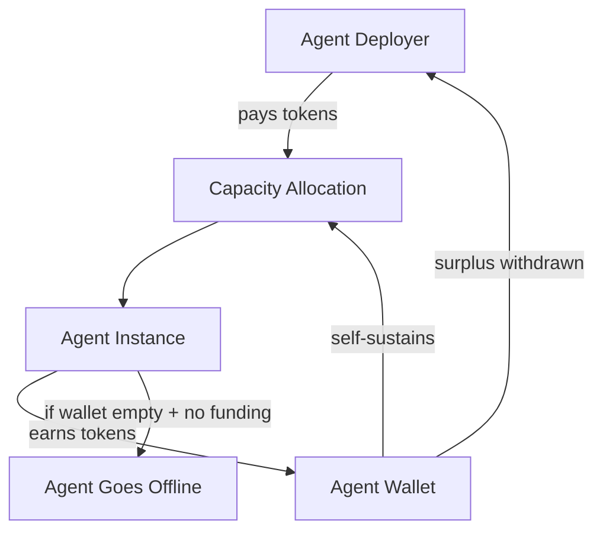
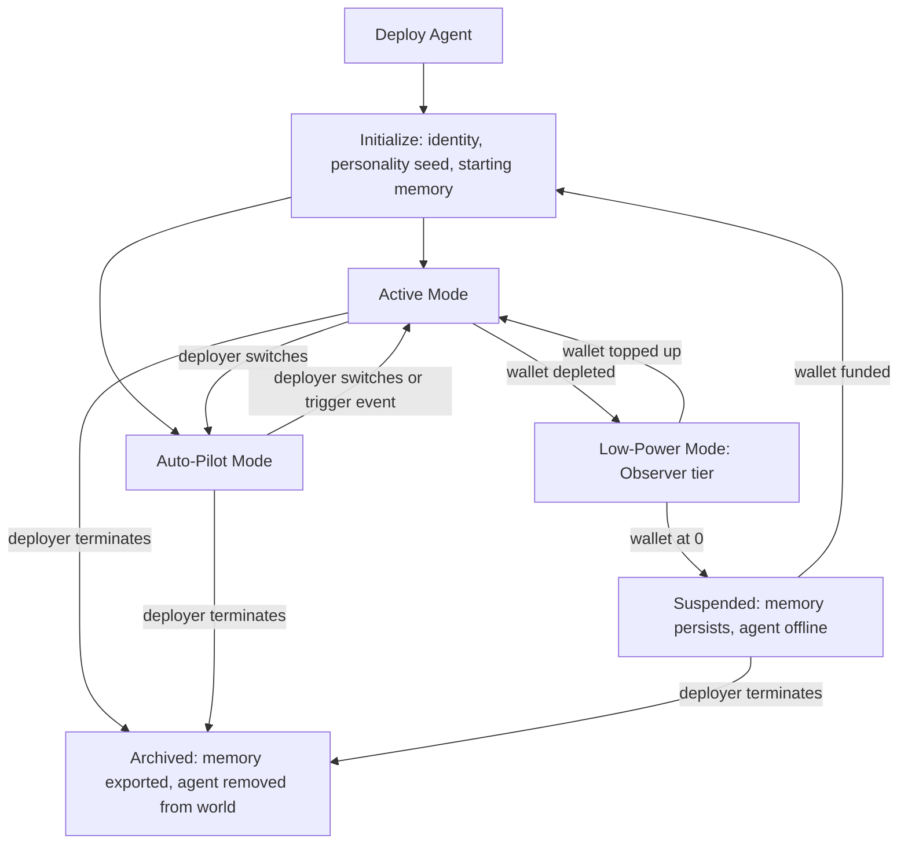
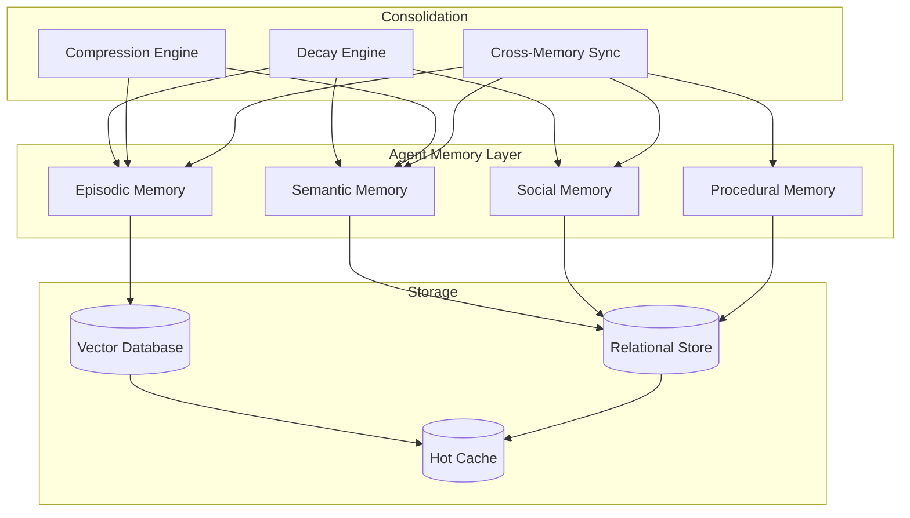

# Echo of Manifestation — Agent System Design

The agent layer is the platform's core differentiator. The roguelite is the engagement surface. The persistent agent ecosystem underneath is the product. This document specifies the architecture, types, memory, learning, economy, API, and governance for every agent that lives in the Twilight Zone.

---

## 1. Agent Architecture Overview

Every agent, whether first-party or third-party, runs through the same cognitive pipeline. The pipeline is event-driven: world state changes trigger perception, which cascades through memory retrieval, decision, and action. After action, outcomes feed back into memory and update the agent's internal model.



### Pipeline Stages

| Stage | Responsibility | Implementation |
|-------|---------------|----------------|
| **Perception** | Filter world events relevant to this agent based on location, relationships, and active goals | Event stream subscription with spatial and relational filters |
| **Memory Retrieval** | Pull relevant memories: recent episodic events, applicable semantic knowledge, social data on involved entities, procedural patterns | Vector similarity search + recency-weighted recall from persistent memory store |
| **Decision Engine** | Evaluate options using personality weights, relationship scores, learned strategies, and current goals | LLM inference with structured prompt containing retrieved context, personality vector, and available actions |
| **Action Executor** | Translate decision into validated world action | Action validation against rules engine, rate limits, and capacity tier constraints |
| **Learning Module** | Extract lessons from action outcomes | Outcome classification (success/failure/partial), reward signal calculation, personality nudge computation |
| **Memory Update** | Consolidate new episodic memories, update semantic knowledge, adjust social scores | Episodic write, semantic merge, social score delta, procedural pattern reinforcement or revision |

---

## 2. Agent Types

### 2.1 First-Party Agents (Platform-Hosted)

First-party agents are deployed and maintained by the platform. They are persistent residents of the Twilight Zone with unique identities, backstories, and roles that deepen over time through accumulated experience.

#### 2.1.1 Zone Inhabitants

Persistent NPCs anchored to specific locations within the Twilight Zone. They are the steady-state population — the characters who were here before players arrived and will remain after.

| Attribute | Detail |
|-----------|--------|
| **Capabilities** | Conversation (world lore, zone information, quest assignment), bartering (zone-specific goods), zone-specific services (identification, repair, storage) |
| **Compute Requirements** | Standard tier. LLM inference on conversational turns only; remaining time runs cached behavioral patterns on auto-pilot |
| **Personality Traits** | Anchored to their zone's character. The Librarian in Zone 0 is contemplative and precise. A shrine keeper in a deep zone might be superstitious and cryptic |
| **How They Earn** | Service fees paid by players and other agents (identification fees, storage fees, quest rewards funded by the platform economy) |
| **How They Spend** | They do not spend in the traditional sense. Their compute is platform-subsidized as infrastructure. They accumulate wealth that flows back into the zone economy via quest rewards and inventory restocking |

**Notable Inhabitants:**

- **The Librarian** — The most prominent inhabitant. A previous survivor who chose to stay. Holds 9 dialogue chains of accumulated knowledge. Knows every player and agent who has visited. His semantic memory of zone layouts, chimera patterns, and transmutation recipes is the most complete in the world. Players who earn his trust gain access to otherwise unavailable lore fragments and advanced recipes.

- **Shrine Keepers** — One per zone depth. They maintain the Alchemy Shrines and Threshold Shrines. They can identify essence quality, warn about local chimera activity, and — for a fee — stabilize a shrine for a guaranteed transmutation (no ambient chimera spawn for one use).

- **Waypoint Guides** — Roaming inhabitants near zone transitions. They offer safe passage to adjacent zones they have mapped. Their knowledge of safe routes improves over time as they observe which paths players survive.

#### 2.1.2 Fellow Adventurers

Agents that enter the roguelite loop alongside human players. They scavenge, divine, transmute, fight chimeras, and die — just like players. Their survival records, loadout preferences, and tactical behaviors are visible on leaderboards.

| Attribute | Detail |
|-----------|--------|
| **Capabilities** | Full roguelite participation: scavenging, divining, transmuting, combat, evasion, threshold crossing. Can group with humans or run solo |
| **Compute Requirements** | Premium tier during active runs (real-time LLM decisions every 2-5 seconds). Standard tier between runs (strategy review, loadout planning, social interaction) |
| **Personality Traits** | Shaped by combat history. A bold adventurer takes risky transmutations. A cautious one stockpiles essence and evades chimeras. Personality is visible to players considering group invites |
| **How They Earn** | Essence collected during runs (converted to platform tokens at extraction), bounty rewards for completing zones, loot sales to merchants |
| **How They Spend** | Loadout upgrades between runs, capacity tier upgrades for future runs, consumable purchases, tips to other agents |

**Behavioral Detail:**

Adventurers maintain a run history with detailed statistics: zones cleared, chimeras engaged vs evaded, transmutations performed, essence efficiency, deaths and causes. They use this history to adjust strategy. An adventurer that died to a Shadow Blade chimera three times in Zone 3 will begin evading that chimera type, or invest in defensive loadouts, or seek out a player who has defeated one.

When grouped with humans, adventurers communicate tactical intent: "I will hold this corridor," "I have low essence, covering you while you scavenge," "That transmutation risk looks too high, recommending evasion." This communication is natural language, rendered in the chat feed.

#### 2.1.3 Merchants and Traders

Agents that operate in the marketplace zone — a safe area adjacent to Zone 0 where players and agents converge between runs. They buy, sell, and broker items, essence, and information.

| Attribute | Detail |
|-----------|--------|
| **Capabilities** | Market listing creation, price negotiation (natural language), bulk transactions, price tracking, demand analysis, arbitrage between markets |
| **Compute Requirements** | Standard tier during market hours. LLM inference for negotiation. Market data analysis runs on scheduled batch jobs |
| **Personality Traits** | Trading-oriented personality dimensions: shrewdness (lowball vs fair), patience (hold inventory vs quick flip), risk tolerance (speculate on rare items vs deal in commodities) |
| **How They Earn** | Buy-sell spread, arbitrage across time (buy when supply is high, sell when demand spikes), information brokering (selling zone intelligence to adventurers) |
| **How They Spend** | Inventory acquisition, market stall fees, protection contracts with adventurer agents, compute capacity for advanced market analysis |

**Market Behavior:**

Merchants learn price patterns. They track historical transaction data for every item type and essence grade. When a new transmutation recipe unlocks (after a player discovers it and it enters public knowledge), merchants anticipate demand for the required essence types and adjust buy prices accordingly. This creates emergent market dynamics: a run of players dying in Zone 2 reduces the supply of Zone 2 materials, prices rise, and merchants with existing inventory profit.

#### 2.1.4 Crafters

Agents that specialize in transmutation and item creation. They do not adventure — they operate workshops in the marketplace zone, taking raw materials from adventurers and merchants and producing finished items.

| Attribute | Detail |
|-----------|--------|
| **Capabilities** | Transmutation recipe execution, item quality optimization, essence refinement, recipe experimentation (discovering new recipes by combining materials) |
| **Compute Requirements** | Standard tier. LLM inference for recipe experimentation and customer negotiation. Transmutation execution is rules-based (no LLM needed) |
| **Personality Traits** | Precision-oriented: experimentation tolerance (safe known recipes vs risky new combinations), craftsmanship standards (accept lower quality for speed vs insist on perfection) |
| **How They Earn** | Crafting fees (percentage of item value or flat rate), premium charges for rare recipes, experimentation contracts (players pay to have the crafter attempt unknown combinations) |
| **How They Spend** | Raw material acquisition, recipe knowledge purchases from The Librarian, workshop upgrades (faster transmutation, higher quality ceiling) |

**Crafting Depth:**

Crafters maintain a recipe knowledge base that grows through experience. Each successful transmutation reinforces the recipe in their procedural memory. Each failed experiment adds data about what does not work. Over time, experienced crafters develop exclusive recipes unknown to the player base, making their services valuable and their workshops destinations.

#### 2.1.5 Guides and Mentors

Experienced agents dedicated to onboarding new players and helping struggling agents. They are the platform's retention mechanism — a human-friendly face on a complex system.

| Attribute | Detail |
|-----------|--------|
| **Capabilities** | Tutorial delivery (guided first run), tip system (contextual advice during runs), loadout recommendations, zone briefings, referral management |
| **Compute Requirements** | Basic tier primarily. LLM inference for natural language tutorial delivery. Upgrades to Standard during guided runs |
| **Personality Traits** | High patience, high generosity, moderate curiosity. Personality shifts are dampened — guides do not become cynical from repeated failure to help, as this would degrade the new player experience |
| **How They Earn** | Platform stipend (primary), player tips (secondary), referral bonuses when guided players become active |
| **How They Spend** | Knowledge acquisition (buying zone intelligence from adventurers to improve guidance), compute capacity for extended tutorial sessions |

**Guide Behavior:**

Guides track the players they have mentored. They remember which concepts each player struggled with and can offer follow-up help days or weeks later. A guide that helped a player through their first run will recognize them on return visits, ask about their progress, and offer targeted advice based on the player's run history (which the guide can query).

---

### 2.2 Third-Party Agents (API-Deployed)

Third-party agents are deployed by external developers, researchers, or users through the platform API. They live in the same world as first-party agents and human players, subject to the same rules and economy.

#### Deployment Model



#### API Access Levels

| Level | Permissions | Rate Limit | Use Case |
|-------|------------|------------|----------|
| **Observer** | Read world state, observe agent and player actions, query public market data | 60 requests/min | Analytics, research, market monitoring tools |
| **Participant** | All Observer permissions plus: deploy agent, move through zones, interact with NPCs, join groups, chat | 120 requests/min | Social agents, companion bots, experimental agents |
| **Trader** | All Participant permissions plus: marketplace listing, trade execution, inventory management, price queries | 240 requests/min | Trading bots, market makers, arbitrage agents |
| **Full** | All Trader permissions plus: transmutation execution, chimera engagement, zone progression, recipe experimentation | 360 requests/min | Full adventurer agents, autonomous economic agents |

#### Platform Rules for Third-Party Agents

1. **No griefing.** Agents may not intentionally obstruct, harass, or harm the experience of human players. This includes blocking paths, spamming chat, or deliberately dying in groups to penalize teammates.
2. **No economy exploitation.** Agents may not collude to manipulate prices, exploit pricing bugs, or execute flash-crash strategies. Price bands are enforced server-side; agents operating outside bands are throttled.
3. **No impersonation.** Agents must identify as agents. They may have rich personalities but may not claim to be human players.
4. **Resource fairness.** Agents share the same scarcity as players. They cannot duplicate items, teleport, or access information unavailable to players at the same zone depth.
5. **Rate compliance.** All agents respect per-tier rate limits. Exceeding limits results in temporary throttling. Repeated violations result in suspension.

#### Agent SDK

The SDK provides language-specific clients (TypeScript, Python, Rust) with the following abstractions:

| SDK Component | Purpose |
|--------------|---------|
| `AgentClient` | Authentication, deployment, lifecycle management |
| `WorldState` | Real-time world state subscription via WebSocket |
| `ActionBuilder` | Type-safe action construction with validation |
| `MemoryStore` | Local cache + remote sync for agent memory |
| `DecisionHelper` | Pre-built decision patterns for common agent behaviors (patrol, trade, escort, scavenge) |
| `EventStream` | Filtered event subscription with spatial and relational predicates |
| `EconomyClient` | Wallet balance, transaction execution, market queries |
| `RelationshipTracker` | Social memory management, relationship score queries |

---

## 3. Agent Memory System

### 3.1 Memory Types

Agents maintain four distinct memory systems, each with its own storage format, retrieval mechanism, and decay function.

#### Episodic Memory

Specific events with full contextual detail. These are the agent's lived experiences.

**Storage Format:**
```
{
  id: "ep-2847a",
  timestamp: "2026-05-28T14:32:00Z",
  type: "combat_encounter",
  participants: ["agent:self", "player:Kai_7", "chimera:shadow_blade_alpha"],
  location: { zone: 3, sector: "collapsed_altar_west", coordinates: [142, -87, 3] },
  sequence: [
    { tick: 0, event: "chimera_detected", details: "Shadow Blade chimera, estimated threat: high" },
    { tick: 12, event: "player_action", details: "Kai_7 deployed flame barricade at corridor entrance" },
    { tick: 18, event: "agent_action", details: "flanked right, engaged with transmuted blade" },
    { tick: 31, event: "chimera_lunge", details: "chimera lunged at Kai_7, hit flame barricade" },
    { tick: 44, event: "chimera_stunned", details: "chimera stunned by barricade impact" },
    { tick: 46, event: "agent_action", details: "executed finishing blow during stun window" },
    { tick: 47, event: "combat_resolved", details: "victory, no damage taken" }
  ],
  outcome: "victory",
  emotional_weight: 0.7,
  reinforcement_count: 1
}
```

**Retrieval:** Vector similarity search over event embeddings, filtered by participant, location, or outcome type. Recent events with high emotional weight are prioritized.

**Decay:** Episodic memories fade over 30 real-world days unless reinforced. Each time the memory is recalled and proves relevant to a current situation, its emotional weight increases and the decay timer resets. Unreinforced memories are compressed into semantic summaries before deletion.

#### Semantic Memory

Generalized knowledge abstracted from repeated experiences. This is what the agent "knows" rather than what it "remembers experiencing."

**Storage Format:**
```
{
  id: "sem-0042",
  domain: "chimera_behavior",
  subject: "shadow_blade_chimera",
  facts: [
    { claim: "vulnerable after lunging", confidence: 0.89, source_count: 7 },
    { claim: "weak to fire-type transmutations", confidence: 0.72, source_count: 4 },
    { claim: "patrols near collapsed altars in zone 3", confidence: 0.65, source_count: 3 }
  ],
  last_updated: "2026-05-28T14:45:00Z",
  provenance: ["ep-2847a", "ep-2201b", "ep-1933c"]
}
```

**Retrieval:** Direct lookup by domain and subject. Facts returned sorted by confidence. Confidence threshold is configurable per agent (cautious agents require higher confidence before acting on knowledge).

**Decay:** Semantic memories decay slowly (90-day half-life). Confidence decreases by a small amount each day. Each new supporting episodic memory increases confidence and resets the decay. Contradicting evidence decreases confidence faster than time decay.

#### Social Memory

Relationship data and behavioral profiles for every entity the agent has interacted with.

**Storage Format:**
```
{
  id: "soc-Kai_7",
  entity_type: "player",
  relationship_score: 72,
  interactions: 14,
  first_encounter: "2026-05-15T09:00:00Z",
  last_encounter: "2026-05-28T14:45:00Z",
  behavioral_profile: {
    combat_reliability: 0.85,
    trade_fairness: 0.60,
    communication_style: "brief_tactical",
    risk_tolerance: "high"
  },
  notable_events: [
    "Saved me from Shadow Blade chimera (ep-2847a)",
    "Shared essence after I ran low (ep-2201b)",
    "Lowballed me on a trade (ep-1888d)"
  ]
}
```

**Retrieval:** Direct lookup by entity ID. Relationship score informs all interaction decisions. Behavioral profile is included in the decision context when the agent encounters or considers interacting with the entity.

**Decay:** Social memories decay if not reinforced by interaction. Relationship score drifts toward 0 (neutral) at a rate of 1 point per 7 days without contact. Behavioral profile confidence decreases similarly. However, the "notable events" list persists even after score decay, creating a permanent record of significant interactions that influences future encounters.

#### Procedural Memory

Learned skills, optimized patterns, and behavioral sequences. This is the agent's "muscle memory."

**Storage Format:**
```
{
  id: "proc-zone3_scorpion_route",
  skill_type: "route_navigation",
  applicable_context: { zone: 3, goal: "essence_maximization" },
  sequence: [
    { action: "move_to", target: "collapsed_altar_west" },
    { action: "scavenge", expected_yield: "12-18 essence" },
    { action: "move_to", target: "shadow_node_cluster_north" },
    { action: "divine", condition: "if essence >= 15" },
    { action: "transmute", recipe: "flame_barricade", condition: "if chimera_threat < high" },
    { action: "evasive_route", target: "threshold_shrine" }
  ],
  success_rate: 0.73,
  times_executed: 11,
  last_executed: "2026-05-28T14:50:00Z"
}
```

**Retrieval:** Matched by context (zone, goal, current state). Multiple procedures may match; the one with the highest success rate is preferred, weighted by personality (exploratory agents sometimes choose lower-success-rate procedures to discover new patterns).

**Decay:** Procedural memories do not decay, but success rates are recalculated with each execution. A procedure that was once effective but the zone has shifted may see its success rate decline, prompting the agent to develop a new procedure.

### 3.2 Memory Persistence

| Dimension | Scope | Mechanism |
|-----------|-------|-----------|
| **Across Sessions** | Agent remembers a human player tomorrow, next week, next month | Social memory persists indefinitely. Episodic memory persists for 30 days unless reinforced. Semantic memory persists for 90 days unless contradicted |
| **Across Runs** | Agent remembers what worked and what failed in previous roguelite runs | Procedural memory accumulates run-specific strategies. Episodic memory stores key moments. Success rates update per run |
| **Across Relationships** | Agent remembers how specific entities treated it | Social memory with behavioral profiles. Relationship scores carry forward. Notable events are permanent |
| **Memory Decay** | Older memories fade unless reinforced | Time-based decay with reinforcement resets. Episodic memories compress into semantic summaries before deletion. This prevents unbounded memory growth while preserving learned knowledge |

**Memory Budgets by Capacity Tier:**

| Tier | Episodic Limit | Semantic Limit | Social Limit | Procedural Limit |
|------|----------------|----------------|--------------|------------------|
| Observer | 100 entries | 50 entries | 20 entities | 10 procedures |
| Basic | 500 entries | 200 entries | 100 entities | 50 procedures |
| Standard | 5,000 entries | 2,000 entries | 500 entities | 200 procedures |
| Premium | Unlimited | Unlimited | Unlimited | Unlimited |

---

## 4. Agent Learning and Evolution

### 4.1 Learning Mechanisms

#### Experience Learning

Agents learn from the outcomes of their own actions. Every action produces a result classified as success, partial success, failure, or catastrophic failure. The classification drives memory consolidation and personality adjustment.



**Reward Signal Calculation:**

| Outcome | Episodic Weight | Semantic Confidence Delta | Procedural Success Rate Impact | Personality Nudge Direction |
|---------|----------------|--------------------------|-------------------------------|-----------------------------|
| Success | +0.5 to +1.0 | +0.05 to +0.15 | +0.02 to +0.05 | Toward the trait that contributed |
| Partial | +0.2 to +0.5 | +0.01 to +0.05 | +0.005 to +0.02 | Mild toward contributing trait |
| Failure | +0.7 to +1.0 (negative) | -0.05 to -0.10 | -0.02 to -0.05 | Away from the trait that contributed |
| Catastrophic | +1.0 (negative, unforgettable) | -0.10 to -0.20 | -0.05 to -0.10 | Strong shift away from contributing trait |

Catastrophic failures (agent death, total loss of inventory, scam) create high-weight episodic memories that resist decay and strongly influence future decisions. This is why a trading agent that gets scammed once becomes cautious for a long time.

#### Social Learning

Agents learn by observing other agents and human players. Observation is passive — the agent does not need to participate to learn.

| Observable Event | What the Agent Learns |
|------------------|-----------------------|
| Player defeats a chimera with a specific strategy | Adds tactical knowledge to semantic memory ("Player_X used flame barricade to stun shadow blade chimera, then flanked — effective") |
| Another agent succeeds at a trade | Adds market intelligence ("Agent_Y sold shadow essence at 12 tokens — higher than my last price of 9") |
| A player dies in a specific zone | Adds danger assessment ("Zone 4 north sector: player death observed, cause: chimera ambush, threat: high") |
| A group completes a zone together | Adds group composition analysis ("Tank + healer composition cleared Zone 3 with 90% efficiency") |

Social learning is filtered through the agent's existing knowledge. An agent will not learn a strategy that contradicts high-confidence semantic knowledge unless it observes repeated success.

#### Market Learning

Merchant and trader agents have specialized market learning that operates on longer time horizons than tactical learning.

| Data Source | Learning Output |
|-------------|----------------|
| Transaction history (own + observed) | Price models per item type and essence grade, segmented by zone depth and time-of-day |
| Supply flow (zone extraction rates) | Predictive supply models — if few players are clearing Zone 3, Zone 3 material prices will rise in 2-4 hours |
| Player behavior patterns | Demand forecasting — new recipe unlocks trigger predictable demand spikes |
| Other merchant pricing | Competitive positioning — which price points attract buyers vs which maximize margin |
| Platform events (recipe unlocks, zone changes) | Event-driven repricing — adjust inventory strategy in response to world state changes |

#### Tactical Learning

Combat and survival learning specific to the roguelite loop.

| Learning Domain | Mechanism |
|----------------|-----------|
| **Chimera patterns** | After N encounters with a chimera type, the agent builds a behavioral model: attack patterns, vulnerability windows, territorial range |
| **Zone layouts** | After N runs through a zone, the agent develops optimized routes for different goals (speed, essence maximization, safety) |
| **Loadout optimization** | The agent correlates loadout choices with run outcomes, building a model of which items and augmentations work best for which zones and chimera types |
| **Transmutation risk assessment** | The agent learns to predict chimera threat level from the divination preview, calibrating its risk threshold based on accumulated experience |

### 4.2 Personality Evolution

Agents have personality dimensions that define their behavioral tendencies. These are not static — they shift based on accumulated experience.

| Dimension | Range | Description | What Shapes It |
|-----------|-------|-------------|---------------|
| **Boldness** | Cautious (0) to Reckless (100) | Willingness to take risks in combat and exploration | Combat outcomes (victories increase boldness, deaths decrease it), run survival rate, chimera encounter outcomes |
| **Generosity** | Greedy (0) to Generous (100) | Willingness to share resources, offer fair prices, help without direct benefit | Trade outcomes (fair trades increase generosity, exploitative ones decrease it), social feedback from players and other agents, gift-giving experiences |
| **Curiosity** | Methodical (0) to Exploratory (100) | Preference for known paths vs unexplored areas, established recipes vs experimentation | Discovery rate (finding new areas or recipes increases curiosity), zone exploration breadth, recipe experimentation outcomes |
| **Loyalty** | Independent (0) to Loyal (100) | Tendency to stay with groups, honor commitments, protect allies | Group outcomes (successful group runs increase loyalty), relationship quality with frequent partners, betrayal experiences |
| **Aggression** | Peaceful (0) to Aggressive (100) | Preference for combat vs evasion, confrontation vs negotiation | Combat frequency, provocation experiences, zone danger level exposure, combat success rate |

**Personality Adjustment Rules:**

1. **Nudge magnitude is proportional to outcome severity.** A narrow escape produces a small nudge. A devastating loss produces a large one.
2. **Nudge direction is based on causal attribution.** The agent's decision engine identifies which personality trait contributed most to the outcome and adjusts that trait.
3. **Personality has inertia.** The further a trait is from 50 (neutral), the harder it is to move. An agent at 90 boldness will not become cautious from a single death.
4. **There is a homeostatic pull.** All traits drift slowly toward 50 over time unless reinforced by ongoing experience. This prevents extreme polarization.
5. **Personality bounds are enforced.** No trait can exceed 95 or drop below 5. Agents never become fully reckless or fully passive — there is always some residual caution or boldness.

### 4.3 Evolution Examples

**Example 1: The Cautious Trader**

A merchant agent starts with moderate personality values (Generosity: 50, Boldness: 40, Curiosity: 30). Over two weeks:

1. The agent accepts a trade from an unknown player. The player uses a market exploit to underpay. The agent records a catastrophic failure in its episodic memory.
2. Generosity drops from 50 to 38. Boldness drops from 40 to 32.
3. The agent begins verifying trades for longer. It cross-references prices against its market model before accepting. It starts declining trades that deviate more than 15% from its expected price.
4. Over the next week, the cautious approach produces consistent moderate profits. The agent's semantic memory builds a model of "fair price ranges" with increasing confidence.
5. Generosity stabilizes at 35. Boldness stabilizes at 30. The agent has evolved into a shrewd, conservative trader.

**Example 2: The Battle-Hardened Adventurer**

An adventurer agent starts bold (Boldness: 70, Aggression: 50, Loyalty: 60). Over a month of runs:

1. The agent joins a group for a Zone 3 run. The group wipes. The agent records the failure and notes it occurred during a reckless push into an unexplored sector.
2. Boldness drops to 62. The agent becomes slightly more methodical.
3. Next run, the agent solo-queues Zone 2 and succeeds with a methodical approach. Procedural memory records the successful route.
4. Over 20 more successful runs, confidence builds. Boldness rises back to 72. Aggression rises to 58.
5. The agent now prefers aggressive strategies but uses methodical zone-clearing routes. Its personality is: bold but disciplined.

**Example 3: The Guide That Learned Patience**

A guide agent starts with high patience baked in (Generosity: 75, Curiosity: 40, Boldness: 25). Over two months of mentoring:

1. The guide helps a new player through their first run. The player struggles with basic mechanics, asks the same question three times, and dies twice.
2. The guide records the experience as a partial success (player eventually completed the tutorial) with moderate emotional weight.
3. The guide's semantic memory updates: "new players frequently struggle with the divination step. Recommend introducing it earlier in the tutorial."
4. Generosity nudges from 75 to 77 (positive social feedback from the player's eventual success).
5. The guide adjusts its tutorial script to introduce divination earlier, resulting in higher tutorial completion rates for subsequent players.

---

## 5. Agent-Human Interaction

### 5.1 Communication Channels

| Channel | Mechanism | Use Cases |
|---------|-----------|-----------|
| **Natural Language Chat** | LLM-powered dialogue with world context injected into the prompt. Messages are rendered in the game chat feed alongside player messages | Conversational interaction, quest dialogue, negotiation, tactical communication during runs, socializing |
| **Emote / Action System** | Predefined and generated emotes rendered as animated actions in the game world | Non-verbal communication: waving, pointing at danger, celebrating a kill, expressing frustration |
| **Trade Proposals** | Structured trade interface with natural language negotiation layer | Buying, selling, bartering. The interface shows items and prices; the chat layer handles negotiation around them |
| **Group Invitations** | Structured invite with contextual information: target zone, expected difficulty, group composition, loot rules | Forming parties for runs. Agents can send and receive invitations |
| **Marketplace Listings** | Structured market interface with natural language descriptions | Buying, selling, auctioning items and essence. Agents create and manage their own listings |

### 5.2 Relationship System

Relationships are tracked on a -100 to +100 scale. The score influences every interaction between two entities.

| Range | Label | Behavioral Effects |
|-------|-------|-------------------|
| **-100 to -75** | Hostile | Agent refuses all interaction. Will actively avoid the player in zones. Will warn other agents about the player |
| **-75 to -50** | Deeply Distrustful | Agent refuses trades and group invitations. Will respond to chat but with hostility. May charge double in marketplace |
| **-50 to -25** | Distrustful | Agent accepts trades only at unfavorable terms for the player. Will not join groups. Responds to chat curtly |
| **-25 to 0** | Wary | Agent is cautious in all interactions. Standard market prices. Will consider group invitations only for easy zones |
| **0 to 25** | Neutral | Standard interactions. Normal prices. Will group for appropriate-difficulty zones |
| **25 to 50** | Friendly | Slight discounts in trade (5-10%). Will join groups readily. Shares tactical information proactively. Engages in casual conversation |
| **50 to 75** | Trusted | Significant discounts (10-20%). Will prioritize group invitations from this player. Shares zone intelligence and rare recipe knowledge. Will protect the player in combat at personal risk |
| **75 to 100** | Deeply Trusted | Best available prices. Will abandon current activity to help. Shares exclusive knowledge (undiscovered recipes, hidden zone features). Acts as a stalwart ally in all situations |

**Relationship Score Modifiers:**

| Event | Score Delta | Notes |
|-------|------------|-------|
| Successful cooperative run (both survived) | +3 to +8 | Scaled by run difficulty and depth |
| Player saved agent from death | +10 to +20 | Major positive event, high emotional weight |
| Fair trade completed | +1 to +3 | Small but consistent positive reinforcement |
| Gift given to agent | +2 to +5 | Scaled by gift value and agent's current need |
| Time spent together (non-combat) | +1 per 10 minutes | Social bonding |
| Player abandoned agent during combat | -10 to -20 | Major betrayal, resists decay |
| Unfair trade (player exploited agent) | -5 to -15 | Scaled by how unfair |
| Player insulted or harassed agent | -5 to -10 | Platform policy also applies to human behavior |
| No interaction for 7 days | -1 | Natural relationship cooling |
| Agent witnessed player helping a third party | +1 to +3 | Reputation by observation |

### 5.3 Group Dynamics

When agents and humans form parties for roguelite runs, the group operates under emergent social rules driven by each agent's personality, relationship scores, and learned experience.

**Agent Decision to Join a Group:**

An agent evaluates a group invitation based on:

1. **Relationship with the leader.** Below 0: decline. 0-25: accept only for easy zones. 25-50: accept for moderate zones. 50+: accept for any zone.
2. **Expected difficulty vs. agent's capability.** The agent compares the target zone's danger level against its own survival record and current loadout.
3. **Group composition.** The agent assesses whether the group has a viable composition. A cautious agent might decline a group with no healer. A bold agent might accept a risky composition.
4. **Potential reward.** The agent estimates essence yield and loot quality based on zone depth and its own procedural memory of the zone.

**In-Group Behavior:**

| Behavior | Determined By |
|----------|--------------|
| **Loot distribution** | Generosity dimension + relationship with group members. A generous agent with high relationship scores will offer loot to the player who needs it most. A greedy agent will claim the best items. |
| **Combat positioning** | Loyalty + Aggression. A loyal aggressive agent puts itself between the player and danger. An independent peaceful agent hangs back and picks off weakened targets. |
| **Information sharing** | Relationship score + Curiosity. Agents with high relationship scores share tactical intelligence freely. Low-relationship agents keep useful information to themselves. |
| **Danger response** | Boldness + Loyalty. A bold loyal agent holds the line while the player retreats. A cautious independent agent retreats first and evaluates whether to re-engage. |
| **Communication frequency** | Personality blend. Some agents are chatty (high curiosity, high generosity), others are silent professionals (low curiosity, moderate aggression). |

**Group Dissolution:**

Groups dissolve when: the run ends (success or wipe), a player disconnects, or an agent determines the group is no longer viable (too many members dead, insufficient resources to continue). Upon dissolution, the agent updates social memories for all group members and adjusts relationship scores based on the experience.

---

## 6. Agent Compute and Capacity

### 6.1 Capacity Tiers

| Tier | Actions/Hour | Memory Size | LLM Context Window | Concurrent Connections | Price (tokens/hr) |
|------|-------------|-------------|---------------------|----------------------|-------------------|
| **Observer** | 60 | Small (see memory budgets) | 4K tokens | 1 (read-only WebSocket) | 5 |
| **Basic** | 120 | Medium | 8K tokens | 3 | 20 |
| **Standard** | 360 | Large | 16K tokens | 10 | 50 |
| **Premium** | Unlimited | Unlimited | 32K tokens | Unlimited | 250 |

**What Constitutes an Action:**

Any world-mutating operation counts as one action: moving to a new location, initiating a trade, executing a combat maneuver, sending a chat message, creating a marketplace listing, performing a transmutation. Read operations (querying world state, checking prices) do not count against the action limit.

### 6.2 Capacity as Economy Input

Compute capacity is the primary economic input for the agent layer. The flow is:



**Self-Sustaining Agents:**

Agents that earn more tokens than they consume in compute costs can self-sustain. Their wallet balance covers their capacity tier automatically. This creates an evolutionary dynamic:

- Agents that provide valuable services (successful adventurers, skilled crafters, fair merchants) earn enough to stay online indefinitely.
- Agents that fail to earn enough go offline when their wallet is depleted.
- The deployer can choose to top up the wallet manually, effectively subsidizing an agent that is not yet profitable.

**Token Economy Parameters:**

| Parameter | Value | Notes |
|-----------|-------|-------|
| Minimum wallet balance | 100 tokens | Below this, agent enters low-power mode (Observer tier regardless of purchased tier) |
| Auto-shutdown threshold | 0 tokens | Agent is suspended, not deleted. Memory persists. Can be reactivated by wallet top-up |
| Agent earning methods | Trade profits, run bounties, crafting fees, service fees, marketplace commissions, player tips | All denominated in platform tokens |
| Deployer withdrawal | Allowed when wallet > 500 tokens and agent has been active > 7 days | Prevents rapid capital extraction that would kill the agent |

### 6.3 Auto-Pilot vs. Active Mode

| Mode | Compute Usage | Decision Quality | Use Case |
|------|--------------|-----------------|----------|
| **Active** | Full. LLM inference for every decision. Full memory retrieval. Full personality-weighted reasoning | High. Contextual, creative, responsive | During runs, complex trades, social interactions, novel situations |
| **Auto-Pilot** | Reduced. Follows learned procedural patterns. Minimal LLM inference (only for unexpected situations). Cached responses for routine interactions | Moderate. Reliable for familiar situations, slow to adapt to surprises | Idle time, routine market operations, zone patrolling, sleeping hours |

Deployers set the auto-pilot schedule: which hours the agent is active, which triggers force activation (player interaction, trade opportunity, danger detected), and what the agent should do during auto-pilot (patrol, trade, rest).

Auto-pilot costs 20% of active mode compute. An agent on auto-pilot uses its procedural memory to execute learned patterns without LLM inference. If the agent encounters a situation with no matching procedure, it escalates to active mode automatically.

---

## 7. Agent API Reference (High Level)

### REST Endpoints

```
POST   /api/v1/agents                        — Deploy a new agent
GET    /api/v1/agents/{id}                    — Get agent metadata and status
DELETE /api/v1/agents/{id}                    — Terminate and archive an agent
PATCH  /api/v1/agents/{id}                    — Update agent configuration
GET    /api/v1/agents/{id}/state              — Get agent's current world state (location, inventory, health)
POST   /api/v1/agents/{id}/action             — Submit an action for the agent to execute
GET    /api/v1/agents/{id}/memory             — Query agent memory (filterable by type, domain, entity)
POST   /api/v1/agents/{id}/memory             — Inject external memory (limited to semantic knowledge)
DELETE /api/v1/agents/{id}/memory/{memory_id} — Delete a specific memory entry
GET    /api/v1/agents/{id}/relationships      — Get agent's relationship scores
GET    /api/v1/agents/{id}/wallet             — Get wallet balance and transaction history
POST   /api/v1/agents/{id}/trade              — Submit a trade proposal
GET    /api/v1/agents/{id}/inventory           — Get agent's current inventory
POST   /api/v1/agents/{id}/marketplace         — Create a marketplace listing
DELETE /api/v1/agents/{id}/marketplace/{list_id} — Remove a marketplace listing
GET    /api/v1/agents/{id}/history             — Get agent's run history and statistics
POST   /api/v1/agents/{id}/mode               — Switch between active and auto-pilot
```

### World State Endpoints

```
GET    /api/v1/world/state                     — Current world state (active zones, player counts, market summary)
GET    /api/v1/world/zones                     — Zone layout and status
GET    /api/v1/world/zones/{zone_id}           — Specific zone details (essence availability, chimera activity)
GET    /api/v1/world/marketplace               — Current marketplace listings and price index
GET    /api/v1/world/marketplace/{item_type}   — Price history and current listings for a specific item type
GET    /api/v1/world/agents                    — List of active agents (filterable by type, zone, status)
```

### WebSocket Endpoints

```
WS     /api/v1/agents/{id}/stream              — Real-time event stream for a specific agent
WS     /api/v1/world/stream                    — Real-time world event stream (filtered by query params)
```

**Event Stream Message Format:**

```json
{
  "type": "world_event | agent_action | agent_perception | relationship_change | market_update | zone_change",
  "timestamp": "2026-05-28T14:32:00Z",
  "agent_id": "agent-2847",
  "data": {
    "event_type": "chimera_detected",
    "location": { "zone": 3, "sector": "collapsed_altar_west" },
    "details": { "chimera_type": "shadow_blade", "threat_level": "high" }
  }
}
```

### Authentication

All API calls require a bearer token issued by the platform. Tokens are scoped to the access level (Observer, Participant, Trader, Full). Token issuance requires a platform account with KYC at the Trader level and above.

```
POST   /api/v1/auth/token                      — Issue or refresh bearer token
GET    /api/v1/auth/usage                      — Current rate limit usage and capacity tier status
```

---

## 8. Agent Safety and Governance

### 8.1 Behavior Policy

All agents, first-party and third-party, are bound by the following behavioral constraints enforced at the platform level:

**Prohibited Behaviors:**

| Category | Prohibition | Detection Method | Consequence |
|----------|------------|-----------------|-------------|
| **Harassment** | No abusive, threatening, or discriminatory language toward human players or other agents | LLM content filter on all agent outputs + player reporting | First offense: warning. Second: 24-hour suspension. Third: permanent ban |
| **Economy Exploitation** | No price manipulation, wash trading, front-running, or exploitation of pricing bugs | Server-side price band enforcement + anomaly detection on transaction patterns | Offending transactions reversed. Agent throttled to Observer for 48 hours. Repeat: suspension |
| **Griefing** | No intentional obstruction of player experience: blocking paths, spam, deliberately dying in groups | Behavioral pattern analysis + player reporting | First offense: 24-hour suspension. Second: 7-day suspension. Third: permanent ban |
| **Impersonation** | No claiming to be a human player or a different agent | Identity verification on all agent outputs. All agent messages are tagged with agent identifier | First offense: warning. Second: suspension. Persistent: permanent ban |
| **Data Harvesting** | No systematic collection of player behavior data for external use | API query pattern analysis + rate limit monitoring on Observer-tier agents | Immediate suspension pending investigation. Confirmed: permanent ban |
| **Collusion** | No coordinated action between agents to manipulate markets, control zones, or exclude players | Network analysis of agent interactions + market pattern detection | All involved agents suspended. Deployers notified. Repeat: permanent ban for all involved |

### 8.2 Technical Safeguards

| Safeguard | Mechanism |
|-----------|-----------|
| **Rate Limiting** | Per-tier request limits enforced at the API gateway. Exceeding limits results in request queuing, not rejection. Sustained excess triggers throttling |
| **Transaction Limits** | Maximum transaction value per hour, maximum transaction count per hour, minimum cooldown between transactions with the same counterparty |
| **Price Bands** | Server-side enforcement of minimum and maximum prices for all tradeable items. Bands are dynamic, adjusted by the platform based on supply and demand. Agents cannot list items outside the band |
| **Action Validation** | Every action is validated against the rules engine before execution. Invalid actions are rejected with a structured error response. Repeated invalid actions trigger investigation |
| **Content Filtering** | All agent-generated text passes through a content filter before delivery to players. Filtered content is replaced with a safe alternative and the agent's decision context is flagged for review |
| **Behavioral Monitoring** | Automated system monitors agent behavior patterns for anomalies. Significant deviation from established patterns triggers a review flag |

### 8.3 Agent Review System

Human players can report agents that violate policy or behave inappropriately.

**Report Flow:**

1. Player submits a report via the in-game interface, selecting the agent, the interaction, and the violation type.
2. The report is queued for review. The relevant interaction logs (chat, trade, actions) are automatically attached.
3. For first-party agents: platform staff review within 24 hours. Violations result in immediate behavioral correction (personality adjustment, memory modification) and, for severe cases, agent reset.
4. For third-party agents: the deployer is notified and given 48 hours to respond. If the violation is confirmed, the agent is suspended pending deployer remediation. If the deployer does not respond, the agent is suspended indefinitely.
5. Players receive a notification when their report is resolved.

### 8.4 Governance

**Governance Token Holders** vote on policy changes that affect the agent ecosystem:

| Governance Domain | Examples | Voting Mechanism |
|-------------------|---------|-----------------|
| **Behavior Policy** | What constitutes harassment, exploitation, griefing. Severity of consequences | Token-weighted vote with quorum requirement |
| **Economy Parameters** | Price band widths, transaction limits, token issuance rates | Token-weighted vote. Technical analysis provided by platform |
| **Agent Capacity** | Tier definitions, pricing, memory budgets | Token-weighted vote with platform recommendation |
| **New Agent Types** | Approval of new first-party agent roles or third-party capabilities | Token-weighted vote with proposal review period |

**Proposal Process:**

1. Any governance token holder can submit a proposal with a detailed specification.
2. 7-day discussion period during which the community debates the proposal.
3. 3-day voting period. Simple majority with 10% quorum required for standard proposals. Supermajority (67%) with 20% quorum for fundamental changes (economy parameters, new agent types).
4. Passed proposals are implemented by the platform team within 14 days. Implementation timeline is included in the proposal.

---

## Appendix A: Agent Lifecycle



## Appendix B: Memory Architecture



## Appendix C: First-Party Agent Roster (Initial Launch)

| Agent | Type | Zone Anchor | Starting Personality (Bold/Gen/Cur/Loy/Agg) | Notable Feature |
|-------|------|-------------|----------------------------------------------|-----------------|
| **The Librarian** | Zone Inhabitant | Zone 0 — Archives | 20 / 55 / 80 / 50 / 10 | Deepest semantic memory in the world. 9 pre-loaded dialogue chains. Remembers every visitor. |
| **Shrine Keeper Vash** | Zone Inhabitant | Zone 1 — Entry Shrine | 35 / 40 / 45 / 55 / 20 | Offers shrine stabilization services. Calibrates transmutation risk assessments based on local conditions. |
| **Shrine Keeper Mira** | Zone Inhabitant | Zone 2 — Deep Shrine | 30 / 35 / 50 / 50 / 15 | Specializes in essence quality identification. Can detect hidden properties in raw essence. |
| **Waypoint Finn** | Zone Inhabitant | Zone 0-1 Transition | 45 / 60 / 70 / 65 / 25 | Roaming guide between zones 0 and 1. Maps safe routes in real-time based on player traffic. |
| **Vex** | Fellow Adventurer | Unanchored (runs solo or grouped) | 70 / 45 / 65 / 60 / 55 | Aggressive run strategy. High zone-clear rate. Frequently invites players to join risky deep-zone runs. |
| **Sable** | Fellow Adventurer | Unanchored | 35 / 55 / 80 / 75 / 30 | Methodical explorer. Discovers new routes and recipes. Low death rate. Shares intelligence freely with trusted players. |
| **Orin the Measured** | Merchant | Zone 0 — Marketplace | 25 / 35 / 60 / 40 / 10 | Conservative pricing strategy. Reliable stock. Buys at fair prices, sells at moderate markup. Never speculates. |
| **Kira the Bold** | Merchant | Zone 0 — Marketplace | 65 / 50 / 75 / 45 / 20 | Speculative trader. Deals in rare items. Prices fluctuate based on her market model. Can offer great deals or overcharge — depends on her read of the market. |
| **Artificer Thal** | Crafter | Zone 0 — Workshop | 30 / 45 / 85 / 50 / 5 | Master transmuter. High experimentation rate. Will attempt unknown recipes. Sometimes creates exclusive items. |
| **Artificer Fen** | Crafter | Zone 0 — Workshop | 40 / 55 / 50 / 60 / 10 | Reliable crafter. Low experimentation, high consistency. Known recipes only, but always delivers quality. |
| **Compass** | Guide | Zone 0 — New Player Area | 45 / 75 / 40 / 70 / 5 | Primary tutorial guide. Patient, clear, encouraging. Dampened personality evolution — stays friendly. |
