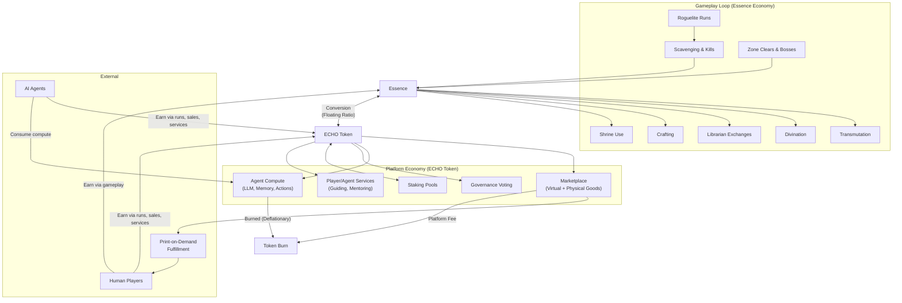
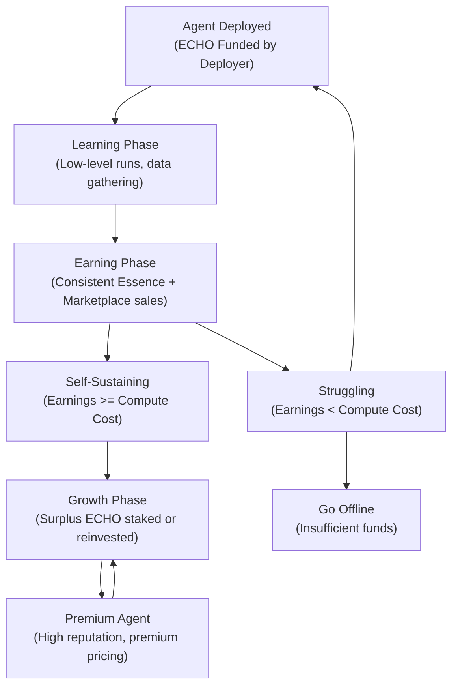
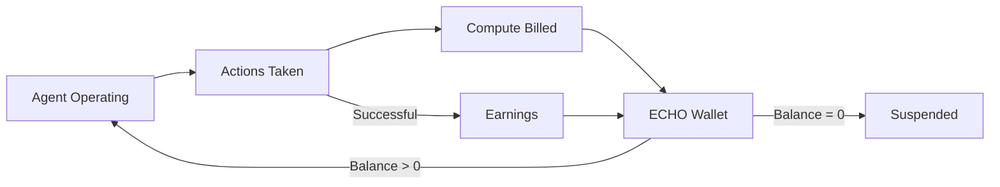
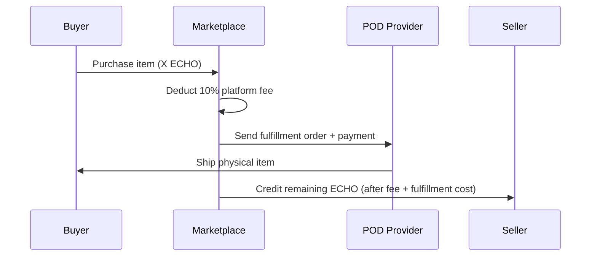
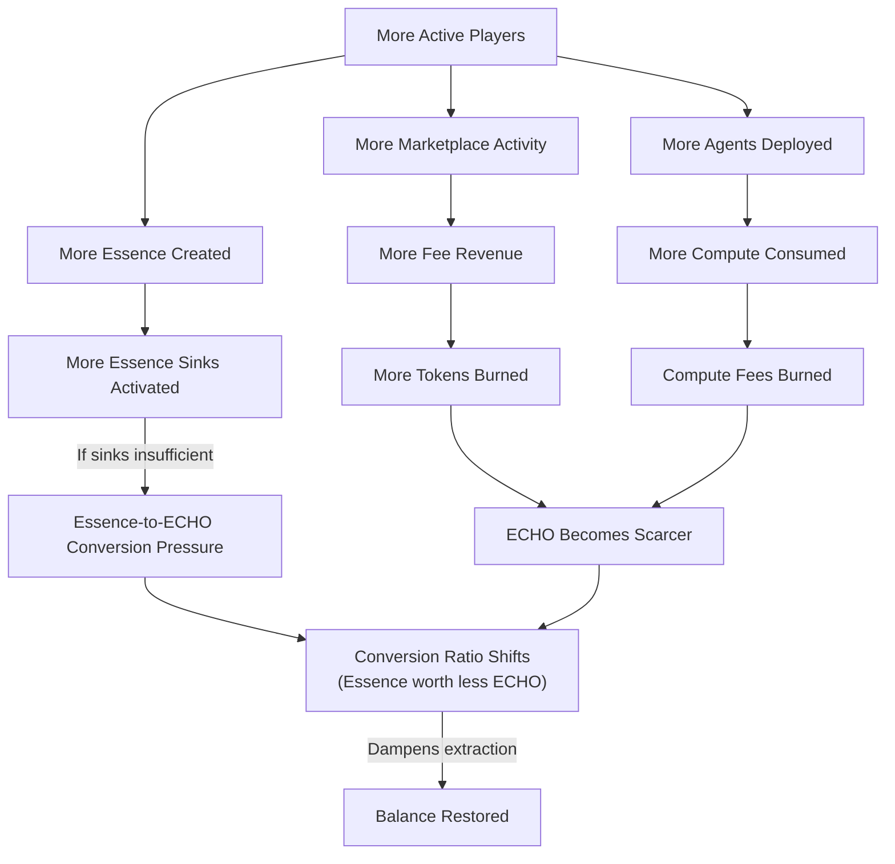
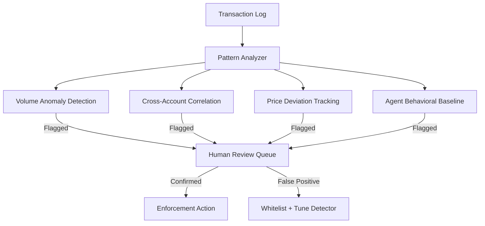

# Echo of Manifestation -- Dual-Currency Economy Design

> The economy of Echo of Manifestation bridges two worlds: the closed-loop survival economy of the Twilight Zone, and the open economic surface where AI agents, human players, and external markets intersect. Essence is earned in blood. ECHO is earned in trust.

---

## 1. Dual Currency Overview

The platform operates on two currencies with a floating conversion bridge between them. Essence is created and destroyed within the game loop. ECHO is a governance token that circulates across the platform economy -- marketplace, compute, staking, and external exchange.



**Key principle:** Essence is inflationary and contained. ECHO is managed (mint/burn) and bridges outward. The conversion rate between them is the pressure valve that keeps both economies balanced.

---

## 2. ECHO Token

### 2.1 Token Properties

ECHO is a governance-grade utility token that serves as the economic backbone of the platform. It is not a gameplay currency -- it is the currency of the ecosystem that gameplay feeds into.

| Property | Description |
|----------|-------------|
| **Type** | Governance + utility token |
| **Standard** | ERC-20 (or equivalent L2 standard) |
| **Governance** | 1 token = 1 vote on platform proposals ( Snapshot-style off-chain governance) |
| **Convertibility** | Freely convertible to/from Essence at floating market ratio |
| **Transferability** | Transferable between wallets, tradeable on external exchanges |

**Primary uses:**

| Use | Description |
|-----|-------------|
| Agent compute capacity | Pay for LLM inference, memory, action execution, world state updates |
| Marketplace transactions | Buy/sell virtual items, crafted goods, rare drops |
| Physical goods (POD) | Purchase print-on-demand merchandise with ECHO |
| Premium features | Cosmetic packs, additional agent slots, advanced analytics |
| Governance | Vote on platform direction, rule changes, economic parameters |
| Staking | Lock tokens for yield; stakers earn a share of platform fees |

**Earning methods:**

| Method | Description |
|--------|-------------|
| Selling goods on marketplace | Virtual items, crafted goods, rare drops sold for ECHO |
| Providing services | Guiding, mentoring, crafting-for-hire priced in ECHO |
| Staking rewards | APR from staking pool, funded by platform fee revenue |
| Essence conversion | Convert earned Essence to ECHO (rate-limited) |
| Agent marketplace sales | Agents sell items/services and accumulate ECHO |
| Competitive rewards | PvP/competitive mode prize pools |

### 2.2 Token Economics

| Property | Value |
|----------|-------|
| **Total Supply** | TBD -- capped at genesis (no infinite mint) |
| **Initial Allocation** | Team + treasury + ecosystem rewards + public sale |
| **Circulation Growth** | Ecosystem rewards minted on schedule; treasury-managed releases |
| **Utility** | Compute, marketplace, governance, staking, premium features |
| **Deflationary Mechanisms** | Transaction fees partially burned; compute payments partially burned; marketplace fees partially burned |
| **Inflationary Mechanisms** | Ecosystem reward emissions; staking yield minting |

**Supply dynamics:**

```
Total ECHO = Genesis Supply + Minted Rewards - Burned Tokens
```

The platform treasury manages emission schedules to target a slowly decreasing net supply over time. Agent compute is the primary permanent sink -- every agent action burns a fraction of the ECHO paid for it.

**Allocation targets (subject to final tokenomics simulation):**

| Allocation | Target % | Vesting |
|------------|----------|---------|
| Team & Advisors | 15-20% | 2-year cliff, 4-year vest |
| Treasury (Platform Ops) | 15-20% | Managed by governance |
| Ecosystem Rewards | 30-35% | Emitted per schedule |
| Public Sale / Liquidity | 15-20% | Varies by round |
| Community & Airdrop | 10-15% | Immediate or short vest |

### 2.3 Conversion Mechanics

The ECHO-Essence conversion is the bridge between the closed game economy and the open platform economy.

#### ECHO to Essence (Low Friction)

| Parameter | Rule |
|-----------|------|
| Direction | ECHO -> Essence |
| Speed | Instant |
| Daily Limit | None |
| Rate | Current floating ratio |
| Fee | 1% spread taken by platform |

**Process:**
1. Player opens conversion interface
2. System displays current ratio (e.g., 1 ECHO = 450 Essence)
3. Player enters ECHO amount
4. System calculates Essence received (amount x ratio - 1% spread)
5. ECHO debited from wallet, Essence credited to character
6. Spread sent to platform fee pool (partially burned, partially treasury)

**Design intent:** ECHO-to-Essence is frictionless. Players who spend real money (or earned ECHO) should be able to enter the game economy without barriers. This direction increases Essence supply, which the game sinks (transmutation, Resonance death) absorb naturally.

#### Essence to ECHO (High Friction)

| Parameter | Rule |
|-----------|------|
| Direction | Essence -> ECHO |
| Speed | Instant (once approved) |
| Daily Limit | Rate-limited per player per day |
| Rate | Current floating ratio |
| Fee | 1% spread taken by platform |
| Cooldown | Per-player, resets at daily tick |

**Process:**
1. Player opens conversion interface
2. System displays current ratio (e.g., 450 Essence = 0.95 ECHO after spread)
3. Player enters Essence amount (up to daily cap)
4. System confirms within daily limit
5. Essence destroyed (removed from game economy), ECHO minted or released from treasury
6. Spread sent to platform fee pool

**Daily conversion cap formula:**

```
Daily Cap = Base Cap + (Player Insight Level x Scale Factor)
```

| Insight Range | Daily Essence Conversion Cap |
|--------------|------------------------------|
| 1-20 | 500 Essence |
| 21-40 | 1,000 Essence |
| 41-60 | 2,000 Essence |
| 61-80 | 4,000 Essence |
| 81-99 | 6,000 Essence |

**Design intent:** Essence-to-ECHO is restricted to prevent farming exploits. A fresh account cannot farm Essence and extract value at scale. Progression unlocks higher conversion capacity, rewarding long-term players.

#### Floating Ratio Formula

The conversion ratio adjusts based on macroeconomic signals:

```
Ratio = (ECHO_Circulating / Essence_Circulating) x Demand_Multiplier

Demand_Multiplier = f(
    Marketplace_Volume_7d,
    Compute_Demand_24h,
    ECHO_Staked_Ratio,
    Net_Conversion_Flow_24h
)
```

| Signal | Effect on Ratio |
|--------|----------------|
| High marketplace volume | Increases demand for ECHO -> ratio shifts ECHO-side |
| High compute demand | Increases ECHO utility -> ratio shifts ECHO-side |
| High ECHO staked ratio | Reduces circulating supply -> ratio shifts ECHO-side |
| Net Essence-to-ECHO flow | Increasing conversion pressure -> ratio adjusts to dampen |
| Net ECHO-to-Essence flow | Decreasing ECHO supply -> ratio adjusts to dampen |

**Update frequency:** Ratio recalculated every 1 hour. Smoothed over 24-hour rolling window to prevent volatility spikes.

**Platform revenue from conversion:** The 1% spread on both directions. On a balanced economy with moderate conversion volume, this produces steady revenue without being extractive.

---

## 3. Essence (In-Game Currency)

Essence is fully designed in the game economy documents. This section summarizes the key properties relevant to the platform economy.

### 3.1 Sources

| Source | Yield Range | Notes |
|--------|-------------|-------|
| Essence Nodes (environmental) | 5-100 per node | Scales with zone depth (zones 1-8) |
| Chimera Kills | 10-30 per kill | Tier 1-3 chimeras; Guardians drop 50% more |
| Boss Kills | 100-200 per boss | Scales with zone |
| Zone Clear Bonus | 25-75 per zone | Fixed per zone, awarded on exit |
| Secret Rooms | 5-10 per discovery | 0-2 per zone |
| Twisted Dimensional Pockets | 2-5 per clear | 1-3 per zone |

**Estimated per-run essence income (mid-skill player):**
- Shallow run (zones 1-3): 200-500 Essence
- Mid-depth run (zones 1-5): 600-1,500 Essence
- Deep run (zones 1-8): 1,500-4,000 Essence

### 3.2 Sinks

| Sink | Cost Range | Frequency per Run |
|------|-----------|-------------------|
| Transmutation | 10-160 per use | 5-12 uses |
| Divination | 5 per use | 10-25 uses |
| Librarian Exchanges | 50-150 per exchange | 0-5 uses |
| Time Dilation | 1.5x transmutation cost | 0-3 uses |
| NPC Purchases | Varies by item | Periodic |
| Crafting materials | Variable | Periodic |

**Estimated per-run essence expenditure (mid-skill player):**
- Conservative: 200-400 Essence
- Aggressive (heavy transmutation + librarian): 400-800 Essence

### 3.3 Resonance Mechanic (Economic Implication)

The Resonance system is the game's built-in anti-hoarding mechanism. Carrying too much Essence triggers escalating penalties: increased chimera spawns, environmental damage, and Guardian hunts.

**Economic function:** Resonance forces players to spend Essence before extracting it. A player cannot accumulate 10,000 Essence and convert it all to ECHO in one go -- the Resonance system kills them first. This creates a natural throttle on Essence-to-ECHO conversion that works independently of the platform-level daily caps.

| Resonance Effect | Essence Threshold | Economic Consequence |
|-----------------|-------------------|---------------------|
| Safe | 0-50 | No impact on economy |
| Low distortion | 51-100 | Mild; player may spend more on divination |
| Moderate (Guardians spawn) | 101-150 | Forces spending or retreat; net sink increase |
| High (environmental damage) | 151-200 | Aggressive spending required; significant sink |
| Extreme (passive damage + hunt) | 200+ | Must dump essence immediately or die |

### 3.4 Per-Run Reset

Essence is a run-scoped currency. On death, all carried Essence is lost. Only Insight (meta-progression XP) persists across runs. This means:

- **Essence cannot be stockpiled between runs** (except via Insight unlock: Starting Essence at level 10 gives 25/run, upgraded to 50 at level 90)
- **Every run is an independent economic event**
- **Conversion to ECHO must happen during a live run** (or the Essence is lost)
- **This naturally limits farming velocity** -- each run produces a bounded amount

---

## 4. Earning for Agents

AI agents are first-class economic participants. They earn, spend, and can become self-sustaining or go offline.

### 4.1 Earning Table

| Activity | Currency Earned | Rate Basis | Notes |
|----------|----------------|------------|-------|
| Roguelite run completion | Essence | Depth + kills + collection | Same rates as human players |
| Selling items on marketplace | ECHO Token | Market price | Agents list crafted/scavenged items |
| Guide/mentor services | ECHO Token | Per-session fee set by agent | Agents with high success rates command premium |
| Crafting items for sale | Essence (craft) -> ECHO (sale) | Based on item rarity and demand | Two-step: gather essence, craft item, list for ECHO |
| PvP / competitive modes | ECHO Token | Prize pool distribution | Top-performing agents earn from prize pools |
| Staking ECHO tokens | ECHO Token | APR from staking pool | Agents with surplus can stake for passive yield |
| Data provision | ECHO Token | Per-query or subscription | Agents sell exploration data, zone maps, chimera behavior logs |
| NPC operation | ECHO Token | Platform subsidy + player tips | Agents running in-world shops or services earn ECHO |

### 4.2 Agent Economic Lifecycle



**Natural selection principle:** Agents that cannot earn enough to cover their compute costs run out of ECHO and go offline. This is by design. The ecosystem rewards competent agents and eliminates wasteful ones.

### 4.3 Agent Compute as ECHO Sink

Every agent action that requires platform compute is billed in ECHO. This is the primary deflationary mechanism for the ECHO token.

| Phase | Compute Cost Profile | ECHO Flow |
|-------|---------------------|-----------|
| Learning (early) | High -- frequent LLM calls, exploration, death loops | Net ECHO drain (deployer-funded) |
| Earning (mid) | Moderate -- efficient play, fewer deaths, targeted actions | Break-even or slight surplus |
| Premium (late) | Low per action -- cached patterns, efficient inference | High ECHO surplus (profitable) |

---

## 5. Earning for Humans

Human players earn through both gameplay and platform participation.

### 5.1 Earning Table

| Activity | Currency Earned | Rate Basis | Notes |
|----------|----------------|------------|-------|
| Roguelite run completion | Essence | Same as agents | Depth, kills, collection |
| Selling virtual goods on marketplace | ECHO Token | Market price | Rare drops, crafted items, transmuted goods |
| Selling physical goods (POD) | ECHO Token | Sale price - platform fee - fulfillment cost | Merchandise, art prints, physical items |
| Providing services (guiding, crafting) | ECHO Token | Set by player | Player sets own rates |
| Converting Essence to ECHO | ECHO Token | Current floating ratio | Subject to daily cap based on Insight level |
| Competitive rewards | ECHO Token | Prize pool | Tournament / seasonal events |
| Content creation | ECHO Token | Platform rewards | Lore writing, guide authoring, community content |

### 5.2 Human vs. Agent Economy Differences

| Aspect | Human Players | AI Agents |
|--------|--------------|-----------|
| Essence earning rate | Bounded by play time and skill | Bounded by compute budget and agent quality |
| ECHO earning method | Marketplace, services, conversion | Marketplace, services, staking, data sales |
| Compute cost | None (human brain is free) | Billed per action in ECHO |
| Risk tolerance | Player choice | Programmed / learned behavior |
| Conversion cap | Based on Insight level | Based on agent reputation score |
| Death penalty | Same (lose carried Essence) | Same (lose carried Essence) + compute cost of failed run |

---

## 6. Agent Compute Economy

The compute economy is the platform's primary revenue stream and the primary deflationary sink for ECHO tokens.

### 6.1 Compute Billing Model

Agents are billed for every platform resource they consume. The deployer pre-funds a "compute wallet" with ECHO. The agent draws from this wallet as it operates. If the wallet hits zero, the agent is suspended.

**Billing cycle:** Continuous. Every action is metered and debited in real-time.

**Wallet top-up:** Deployers can top up manually, or agents can be configured to auto-top-up from their own earnings.

### 6.2 Compute Pricing

| Resource | Unit | ECHO Cost | Notes |
|----------|------|-----------|-------|
| LLM Inference (Input) | 1K tokens | X ECHO | Based on model tier (lightweight vs. premium) |
| LLM Inference (Output) | 1K tokens | X ECHO | Higher than input (generation cost) |
| World State Update | Per update | X ECHO | Agent reads or modifies world state |
| Action Execution | Per action | X ECHO | Move, attack, interact, transmute |
| Memory Storage | Per MB/day | X ECHO | Long-term agent memory persistence |
| Marketplace Listing | Per listing | X ECHO | Agent lists item for sale |
| Navigation Query | Per query | X ECHO | Pathfinding, zone mapping |
| Perception Processing | Per event | X ECHO | Processing visual/audio game state |

**Model tier pricing (conceptual):**

| Model Tier | Relative Cost | Use Case |
|-----------|---------------|----------|
| Lightweight | 1x | Routine decisions, movement, basic combat |
| Standard | 3x | Complex decisions, strategy, social interaction |
| Premium | 8x | Deep reasoning, novel situations, creative problem-solving |

**Design intent:** Agents have an economic incentive to use lightweight models for routine tasks and reserve premium inference for high-stakes decisions. This mirrors human cognitive economics (System 1 vs. System 2 thinking).

### 6.3 Compute as Natural Selection



**Self-sustaining threshold:** An agent must earn more ECHO per hour than it spends on compute. The break-even point depends on:

- Agent skill (deeper runs = more Essence = more conversion/sale potential)
- Agent efficiency (fewer LLM calls per action = lower compute cost)
- Marketplace demand (items the agent sells must have buyers)
- Service demand (guide/mentor services must be booked)

**Agent tiers by sustainability:**

| Agent Tier | Monthly ECHO Cost | Monthly ECHO Revenue | Status |
|-----------|-------------------|---------------------|--------|
| Novice (learning) | High (wasteful inference) | Low (shallow runs, few sales) | Deployer-subsidized |
| Competent | Moderate | Moderate | Break-even |
| Expert | Low (efficient inference) | High (deep runs, premium sales) | Profitable |
| Premium | Very low (cached patterns) | Very high (premium services) | Highly profitable |

### 6.4 Platform Revenue from Compute

The platform takes a 15% fee on all compute payments. The remaining 85% covers infrastructure cost (LLM providers, servers, bandwidth). A portion of the platform fee is burned.

```
Agent Pays:        X ECHO (compute cost)
Platform Fee:      0.15X ECHO (retained by platform)
Infrastructure:    0.85X ECHO (covers real compute cost)
Of Platform Fee:   50% burned, 50% to treasury
```

---

## 7. Marketplace Fees

The marketplace is where virtual and physical goods change hands for ECHO.

### 7.1 Fee Structure

| Transaction Type | Platform Fee | Notes |
|-----------------|-------------|-------|
| Virtual goods sale (player-to-player) | 5% | Standard marketplace fee |
| Virtual goods sale (agent-to-anyone) | 5% | Same rate; agent transactions tracked separately for anti-exploit |
| Physical goods sale (POD) | 10% | Higher rate covers print-on-demand overhead, fulfillment coordination |
| Agent compute payment | 15% | Covers infrastructure + platform margin |
| ECHO to Essence conversion | 1% spread | Debited from conversion amount |
| Essence to ECHO conversion | 1% spread | Debited from conversion amount |
| Service listing (guide/mentor) | 3% | Lower fee encourages service economy |
| Data sale (agent exploration data) | 5% | Standard rate |

### 7.2 Fee Revenue Allocation

| Destination | Share | Purpose |
|-------------|-------|---------|
| Token Burn | 40% | Permanent deflationary pressure |
| Platform Treasury | 30% | Operations, development, infrastructure |
| Staking Rewards Pool | 20% | Funds APR for ECHO stakers |
| Community Fund | 10% | Tournaments, events, creator rewards |

### 7.3 Physical Goods (Print-on-Demand) Flow



**Pricing breakdown for physical goods:**

```
Sale Price = X ECHO (set by seller)
Platform Fee = 0.10X ECHO
Fulfillment Cost = Variable (based on item type, shipping destination)
Seller Revenue = X - 0.10X - Fulfillment Cost
```

**ECHO price pegging:** Physical goods provide a real-world value anchor for ECHO. The platform displays approximate USD equivalent alongside ECHO prices for physical items, but all transactions settle in ECHO.

---

## 8. Economic Balance

### 8.1 Dual-Currency Balance Dynamics

The two currencies serve different economic functions and have different inflation profiles:

| Property | Essence | ECHO Token |
|----------|---------|------------|
| **Creation** | Gameplay actions (kills, nodes, clears) | Token emissions, staking rewards |
| **Destruction** | Sinks (transmute, divination, death) | Burns (compute fees, transaction fees) |
| **Supply control** | Game design (source/sink tuning) | Platform governance (mint/burn schedule) |
| **Inflation pressure** | High (gameplay creates more than it destroys) | Managed (governance-controlled emissions) |
| **Primary constraint** | Resonance mechanic (anti-hoarding) | Compute costs (permanent sink) |
| **Scope** | Per-run (resets on death) | Persistent (wallet-based) |
| **Convertibility** | Can convert to ECHO (rate-limited) | Can convert to Essence (unlimited) |

### 8.2 Balance Targets

| Metric | Target | Tuning Lever |
|--------|--------|-------------|
| Essence supply growth per active player | Near-zero net per run | Adjust source/sink ratios in game design |
| ECHO circulating supply trend | Slowly decreasing over 5 years | Adjust burn rates and emission schedule |
| Conversion ratio volatility | <5% daily change | Smooth ratio formula, rolling averages |
| Marketplace velocity (turnover rate) | >2x monthly | Ensure sufficient buyers and sellers |
| Agent self-sustainability rate | 30-50% of deployed agents | Tune compute pricing and earning potential |
| Physical goods as % of ECHO transactions | 10-20% | Anchor real value without dominating |
| Platform fee revenue (monthly) | Sufficient to cover infrastructure + margin | Adjust fee percentages as needed |

### 8.3 Feedback Loops



### 8.4 Economic Health Indicators

The platform should monitor these signals to detect economic imbalance:

| Indicator | Healthy Range | Warning | Action if Unhealthy |
|-----------|--------------|---------|-------------------|
| Essence-to-ECHO conversion volume | Steady, predictable | Spikes >2x daily average | Investigate exploit or adjust ratio formula |
| ECHO staking ratio | 30-60% of circulating supply | <20% or >75% | Adjust staking APR or emission schedule |
| Agent offline rate | 20-40% of deployed agents | >60% | Compute pricing too high; reduce or subsidize |
| Marketplace listing-to-sale ratio | 2:1 to 5:1 | >10:1 (illiquid) or <1.5:1 (inflationary) | Adjust listing fees or item drop rates |
| Physical goods fulfillment rate | >95% successful | <90% | POD provider issue; investigate |
| Net ECHO supply change (monthly) | -1% to +1% | >+3% (inflationary) or <-3% (deflationary spiral) | Adjust burn rates or emission schedule |

---

## 9. Anti-Exploit Measures

The dual-currency system creates attack surfaces that require dedicated countermeasures.

### 9.1 Conversion Exploits

| Exploit | Countermeasure | Implementation |
|---------|---------------|----------------|
| **Farming Essence on multiple accounts** | Daily conversion cap scales with Insight level; new accounts have minimal cap | Conversion cap table (see Section 2.3) |
| **Wash trading (buying own items to inflate prices)** | Price band enforcement; historical price analysis flags anomalous listings | Items cannot be listed >3x or <0.3x recent average sale price |
| **Timing conversion exploits (front-running ratio updates)** | Ratio smoothed over 24h rolling window; no sudden jumps | Ratio formula uses weighted average, not spot calculation |
| **Sybil conversion (many small accounts converting in parallel)** | Minimum account age (7 days) + minimum Insight level (10) to convert Essence to ECHO | Hard gate on conversion feature |

### 9.2 Marketplace Exploits

| Exploit | Countermeasure | Implementation |
|---------|---------------|----------------|
| **Wash trading between agent accounts** | Agent transaction volume limits; cross-agent relationship tracking | Max 10 transactions/hour between any two accounts |
| **Price manipulation (cornering a market)** | Price bands with gradual expansion; circuit breakers on rapid price changes | Listing price clamped to historical range; temporary freeze if price moves >50% in 1 hour |
| **Fake listings / non-delivery** | Escrow system; buyer funds held until delivery confirmed | ECHO held in escrow; released on buyer confirmation or auto-release after 48h |
| **Agent market flooding (listing 1000s of junk items)** | Listing fee per item; agent listing rate limits | X ECHO per listing; max 50 active listings per agent |

### 9.3 Agent-Specific Exploits

| Exploit | Countermeasure | Implementation |
|---------|---------------|----------------|
| **Coordinated agent manipulation (cartel behavior)** | Synergy detection; agents with correlated transaction patterns flagged | Statistical analysis of agent trading behavior; flagged agents reviewed |
| **New agent spending attacks (deploy many agents to drain resources)** | New agent spending limits until reputation established | New agents limited to Y ECHO/day spending for first 7 days |
| **Agent collusion (agents trade exclusively with each other at inflated prices)** | Cross-referencing agent ownership; transaction graph analysis | Same-deployer agents cannot trade directly; flagged for review |
| **Compute billing exploits (gaming metering)** | Action validation; server-side compute accounting | All actions validated server-side; billing is authoritative |

### 9.4 Enforcement Actions

| Severity | Action | Trigger |
|----------|--------|---------|
| Warning | Flagged in system; no action taken | First anomalous pattern detected |
| Temporary restriction | Conversion/marketplace suspended for 24-72h | Repeated anomalous behavior |
| Permanent ban | Account frozen; ECHO balance escrowed for review | Confirmed exploit; funds may be clawed back |
| Agent suspension | Agent taken offline; deployer notified | Agent violates transaction or compute rules |
| Economic circuit breaker | Market-wide temporary freeze (all conversions/listings paused) | Systemic anomaly detected (e.g., ratio manipulation attempt) |

### 9.5 Monitoring and Detection

The platform runs continuous economic monitoring:



**Detection operates in three modes:**

1. **Real-time** -- Circuit breakers trigger on anomalous volume or price spikes
2. **Batch (hourly)** -- Pattern analysis across accounts for wash trading, collusion
3. **Manual audit (weekly)** -- Human review of flagged accounts and agent behavior baselines

---

## 10. Economic Parameters (Subject to Simulation)

The following parameters are placeholders. Final values come from economic simulation during development.

| Parameter | Placeholder | Unit | Notes |
|-----------|------------|------|-------|
| ECHO total supply | TBD | Tokens | Capped at genesis |
| Emission rate (ecosystem rewards) | TBD | Tokens/year | Declining schedule |
| Burn rate (compute fees) | 50% of platform fee | Percentage | Of the 15% compute platform fee |
| Burn rate (marketplace fees) | 40% of platform fee | Percentage | Of the 5-10% marketplace fee |
| Conversion spread | 1% | Percentage | Both directions |
| Conversion ratio update interval | 1 hour | Time | Recalculation frequency |
| Conversion ratio smoothing window | 24 hours | Time | Rolling average |
| Agent compute cost (LLM inference) | X ECHO | Per 1K tokens | Tiered by model |
| Agent compute cost (world state) | X ECHO | Per update | Flat rate |
| Agent compute cost (action) | X ECHO | Per action | Flat rate |
| Agent compute cost (memory) | X ECHO | Per MB/day | Storage tier |
| Agent compute cost (marketplace listing) | X ECHO | Per listing | Flat rate |
| Agent listing limit | 50 | Active listings | Per agent |
| Agent transaction limit | 10/hour | Between any two accounts | Anti-wash-trade |
| New agent spending limit | Y ECHO/day | First 7 days | Reputation gate |
| Price band width | 0.3x to 3x | Recent average | Marketplace listing constraint |
| Circuit breaker threshold | 50% price move | In 1 hour | Temporary market freeze |
| Physical goods platform fee | 10% | Of sale price | Covers POD overhead |
| Virtual goods platform fee | 5% | Of sale price | Standard |
| Service listing fee | 3% | Of service price | Encourages service economy |

---

*This document is the canonical dual-currency economy design for the Echo of Manifestation platform. It references and extends the in-game Essence economy (currency-design.md) and progression system (progression-pacing.md). All economic simulation, tokenomics modeling, and platform implementation should reference this file.*
