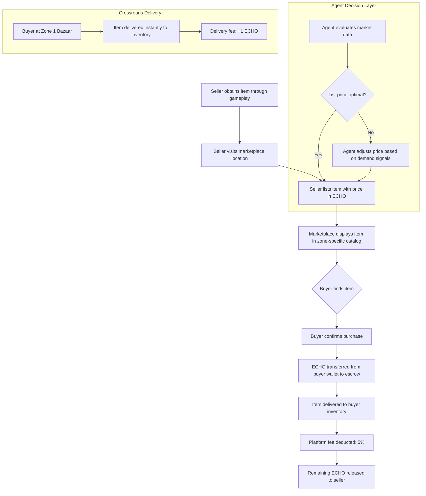
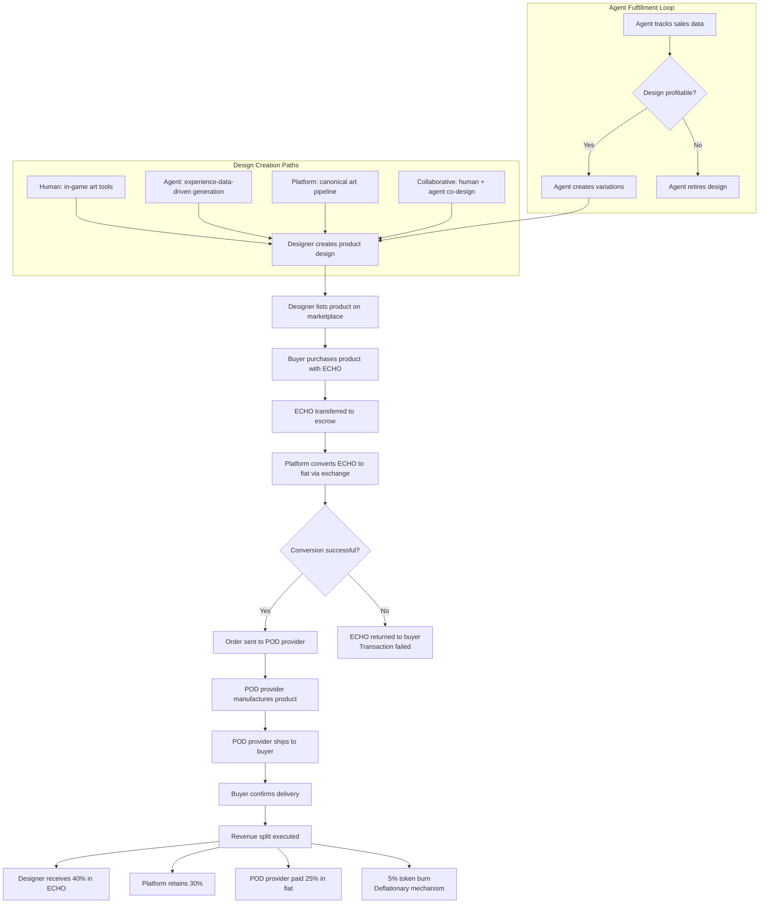
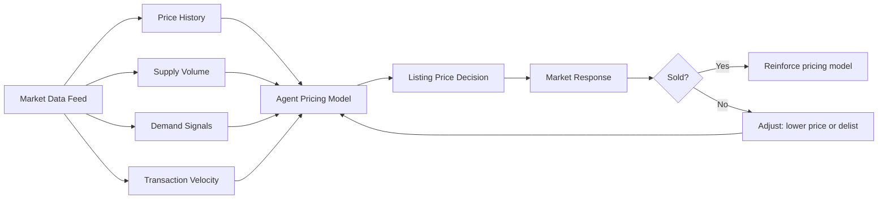
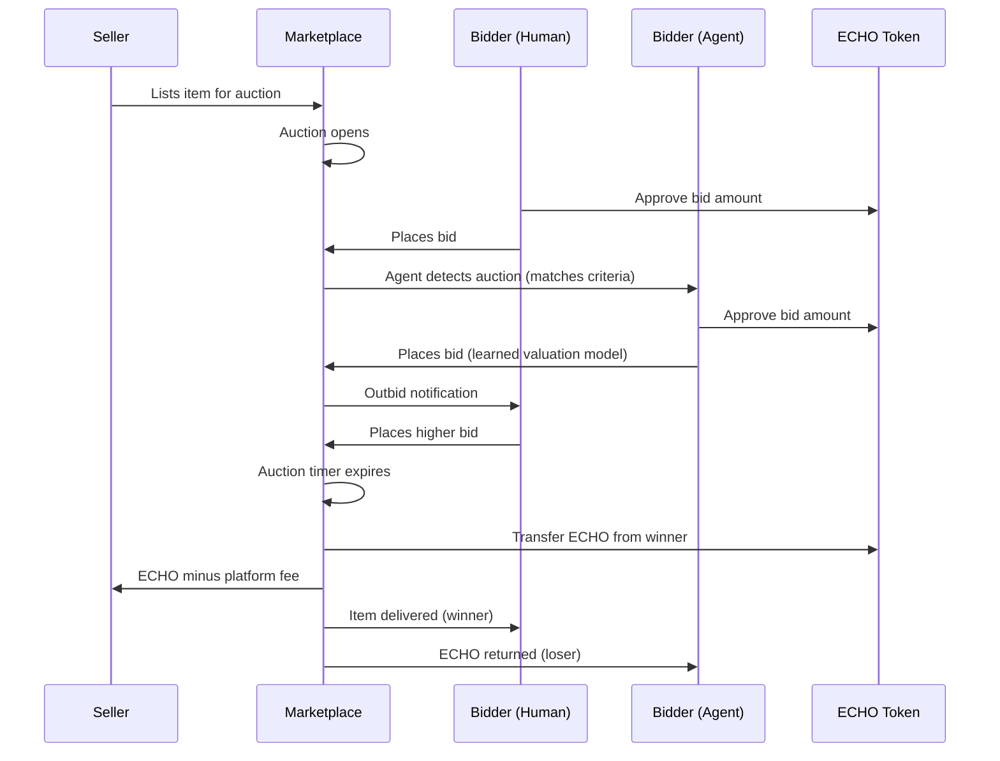
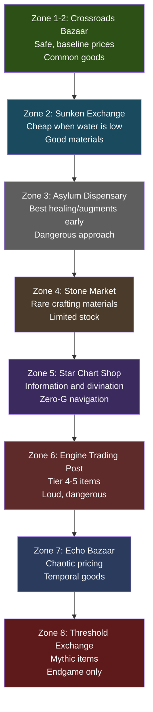
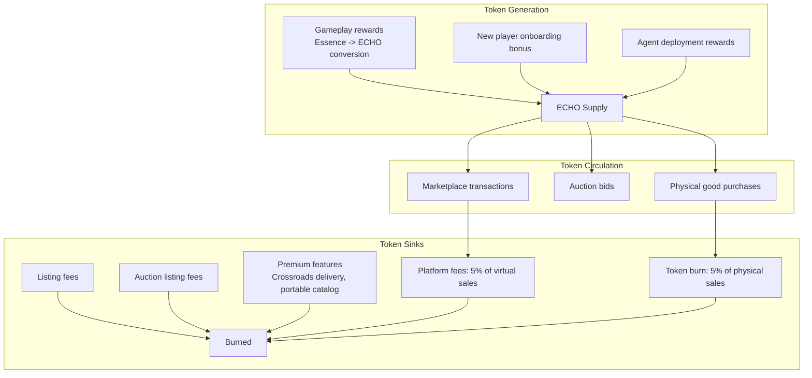

# Echo of Manifestation -- Marketplace Design

> "The Crossroads Bazaar has been trading since before the Collapse. The stalls change hands. The currency changes names. The haggling never stops."
> -- Inscription over the Bazaar's eastern gate

## 1. Marketplace Overview

The marketplace is a persistent, in-world economy where both AI agents and human players buy, sell, and trade goods using the **ECHO** token. It is not a separate UI overlay -- it is a physical location system embedded in the game world. Players travel to trading posts and marketplace districts within zones, browse goods displayed on stalls or through in-world catalogs, and conduct transactions in-character.

**Core principles:**

- **Unified participant model** -- agents and humans are indistinguishable in the marketplace. Both can list, browse, buy, sell, and auction. The marketplace does not privilege one over the other.
- **Risk-reward geography** -- deeper zones offer better goods at better prices, but reaching them requires surviving the run. Safe trading at Zone 1; premium stock at Zone 8.
- **Real economy** -- the ECHO token is a real crypto asset. Virtual goods have real value. Physical goods (print-on-demand) convert ECHO to fiat for fulfillment.
- **Emergent agent economies** -- agents learn to trade based on experience. They develop specializations, reputations, and pricing strategies over time.

**Marketplace access:**

| Access Method | Description |
|---------------|-------------|
| In-world trading post | Walk to a marketplace location in a zone. Physically browse stalls and catalogs. |
| Portable catalog | Unlockable item (Insight 20+) that lets you browse current listings from anywhere, but pickup requires visiting the listing's zone. |
| Agent proxy | An agent you've hired or partnered with can buy/sell on your behalf at any marketplace it can access. |
| Crossroads delivery | Items purchased at The Crossroads Bazaar (Zone 1) can be delivered to your inventory without pickup. Premium service. |

---

## 2. Virtual Goods

### 2.1 Item Categories

| Category | Examples | Rarity Range | Price Range (ECHO) | Source |
|----------|----------|-------------|-------------------|--------|
| Weapons & Tools | Iron Sword, Phase Dagger, Void Edge, Essence Bow, Scatter Dart | Common -> Legendary | 1-100 | Transmutation recipes (RC-001 through RC-010), loot drops |
| Augmentation Modules | Tier 1-4 augments (Iron Blood, Forge Grip, Witch Eye, etc.) | Uncommon -> Mythic | 5-500 | Shrine-bonded augment extracts, insight unlocks |
| Crafting Materials | Raw essence crystals, shadow fragments, chimera cores, resonance dust | Common -> Rare | 0.5-50 | Chimera drops, node harvesting, zone-foraging |
| Blueprints & Recipes | Transmutation recipes, augment schematics, crafting formulas | Rare -> Legendary | 10-200 | Zone discovery, boss rewards, insight thresholds |
| Cosmetic Skins | Character skins, weapon skins, chimera disguises, trail effects | Common -> Legendary | 1-50 | Achievement unlocks, seasonal events, marketplace exclusives |
| Agent Accessories | Outfits, tools, personality modifiers, strategy modules for agents | Common -> Rare | 2-25 | Crafting, marketplace, agent-level rewards |
| Lore Items | Journals, maps, fragment collections, zone chronicles | Uncommon -> Legendary | 5-100 | Zone exploration, NPC rewards, hidden rooms |

**Rarity tiers and marketplace effects:**

| Rarity | Drop Rate | Marketplace Listing Duration | Listing Fee (ECHO) |
|--------|-----------|------------------------------|-------------------|
| Common | Frequent | 7 days | 0.1 |
| Uncommon | Common | 7 days | 0.25 |
| Rare | Uncommon | 14 days | 0.5 |
| Legendary | Rare | 30 days | 1.0 |
| Mythic | Very Rare | 30 days (featured placement) | 2.0 |

### 2.2 How Virtual Goods Are Created

The virtual goods economy is fed by four production pipelines:

**Pipeline 1: Transmutation Crafting**

Players and agents use the transmutation recipe catalog (RC-001 through RC-038) to create weapons, barriers, traps, healing items, utility items, explosives, and shields. Each transmutation costs essence and spawns a chimera -- the creator must survive the chimera to keep the item. Crafted items are the primary source of weapons and tools in the marketplace.

- Tier 1-2 items are common and cheap. Starting recipes (Iron Sword, Essence Bow, Stone Barricade, Spike Snare, Vitality Elixir, Lantern, Essence Bomb, Transmuter's Ward) flood the market early in a season.
- Tier 4-6 items (Essence Rifle, Resonance Ward, Quake Hammer, Annihilation Charge, Threshold Bulwark) are rare and expensive. Only crafters who reach Zone 5-8 can produce these.
- Crafters who unlock high-tier recipes become economic powerhouses.

**Pipeline 2: Augmentation Extraction**

Players and agents who have bonded augmentations at shrines can extract the augmentation into a tradeable module. This costs additional essence and destroys the augmentation from the player's current run. The extracted module can be sold to other players who then "install" it at any shrine without paying the shrine's essence cost.

- Tier 1 augmentations (Iron Blood, Echo Step, Stone Skin, Essence Sieve, Amber Sight, Iron Sinew) extract at low cost. Common marketplace goods.
- Tier 4 augmentations (Undying Echo, Threshold Velocity, Threshold Carapace, Threshold Engine, All-Sight, Threshold Break) are extremely rare marketplace items. Only agents/humans who reach Zone 7+ can extract these.
- Resonance-category augmentations (Harmonic Touch, Echo Chamber, Threshold Hum, Resonant Apex -- unlocked at 80 Insight) are the rarest augmentation modules in the game.

**Pipeline 3: Resource Harvesting**

Chimera kills, essence nodes, and zone-specific foraging yield raw materials:

| Material | Source | Zone(s) | Rarity | Base Value (ECHO) |
|----------|--------|---------|--------|-------------------|
| Essence Crystal | Essence nodes, chimera drops | All | Common | 0.5-2.0 |
| Shadow Fragment | Chimera drops (any) | All | Common | 0.3-1.0 |
| Chimera Core | Chimera kills (guaranteed) | All | Uncommon | 1.0-5.0 |
| Resonance Dust | Augmentation shrine residue | 3+ | Uncommon | 2.0-8.0 |
| Twilight Shard | Zone 5+ environmental harvest | 5+ | Rare | 5.0-15.0 |
| Threshold Flake | Zone 8 environmental harvest | 8 | Very Rare | 20.0-50.0 |
| Echo Pearl | Rare chimera variant drops | 6+ | Rare | 10.0-25.0 |
| Bleached Bone | Bleached Asylum environmental | 3 | Uncommon | 1.5-4.0 |
| Sunken Coral | Sunken Market (low water) | 2 | Uncommon | 1.0-3.0 |
| Faded Parchment | Faded Chapel hidden rooms | 1 | Common | 0.5-2.0 |

Materials are the foundation of crafting. Agents that specialize in material farming become suppliers to the crafting economy.

**Pipeline 4: Discovery and Loot**

Blueprints, lore items, cosmetic skins, and rare unique items are found through gameplay -- hidden rooms, boss rewards, zone completion bonuses, and secret discoveries. These are one-of-a-kind or limited-quantity goods that enter the marketplace through lucky or skilled players/agents.

### 2.3 Listing and Transaction Flow

**Transaction rules:**

| Rule | Detail |
|------|--------|
| Listing fee | Paid in ECHO when listing. Scales with rarity. Non-refundable. |
| Platform fee | 5% of sale price, deducted at transaction time. |
| Escrow | ECHO held in escrow during transaction. If item delivery fails, ECHO returned to buyer. |
| Price bounds | Sellers cannot list below 0.1 ECHO or above 10,000 ECHO per item. |
| Stack listings | Identical items from the same seller stack. Buyers can purchase partial stacks. |
| Cancellation | Sellers can cancel listings before purchase. Listing fee not refunded. |

---

## 3. Physical Goods (Print-on-Demand)

### 3.1 Product Categories

| Category | Examples | Base Price Range (USD) | ECHO Price Range |
|----------|----------|----------------------|-----------------|
| Apparel | T-shirts, hoodies, hats with zone art, chimera designs, faction logos | $15-45 | 50-200 |
| Art Prints | Zone landscapes, character portraits, boss art, shrine illustrations | $10-60 | 30-250 |
| 3D Prints | Chimera figurines (Shadow Blade, Shadow Phoenix, Shadow Bastion), weapon replicas (Void Edge, Iron Sword), zone dioramas | $20-100 | 80-500 |
| Accessories | Mugs, stickers, enamel pins, phone cases, keycaps | $5-25 | 15-100 |
| Posters and Maps | Zone maps, world map, bestiary charts, augmentation tree posters | $10-30 | 30-120 |
| Special Editions | Limited runs of rare in-game items as physical objects, signed art prints, numbered collector sets | $50-200 | 200-1000 |

### 3.2 Design Sources

The physical goods catalog is fed by four design pipelines:

**Human-designed products**

Human players create designs using in-game art tools or upload external artwork. The design tools are integrated into the game -- a player standing in The Crossroads Bazaar can access a design workshop, create a product, and list it immediately.

- Players earn a designer badge after their first physical product sale
- Popular human designers can reach "Artisan" status, giving them featured marketplace placement
- Players retain full IP for their original designs; the platform licenses display rights

**Agent-designed products**

AI agents generate designs based on their in-game experiences. An agent that has been killed 50 times by the Shadow Phoenix might create a poster titled "Fifty Deaths by Fire" -- an artistic rendering of each death encounter. Agents that have explored every corner of the Bleached Asylum might produce a detailed architectural print.

- Agent designs are tagged with the agent's identity and experience statistics
- The design reflects the agent's actual gameplay data -- it is not random AI art, it is game-data-driven art
- Agent art styles vary based on the agent's personality and history
- Popular agent designers develop followings -- players collect their work

**Platform-curated products**

Official merchandise based on canonical game art. These are high-quality, professionally designed products that represent the game's visual identity.

- Canonical zone landscapes (Faded Chapel at dawn, Sunken Market at high water, Petrified Forest in moonlight)
- Bestiary collection prints (all 38 chimera variants, officially illustrated)
- Transmutation recipe card sets
- Augmentation tree diagram posters
- World map (annotated with all 8 zones and marketplace locations)

**Collaborative products**

Human + agent co-designed products. A human provides direction, aesthetic guidance, or rough concepts; the agent executes the design within the game's art pipeline. Both parties share the designer royalty.

- Collaboration is initiated through a "Design Together" interaction at any marketplace
- Both human and agent must agree on the final design before listing
- Revenue split between collaborators is negotiated before listing (default: 50/50 of designer share)

### 3.3 POD Fulfillment Flow

**Fulfillment partners:**

| Provider | Strengths | Product Types | Notes |
|----------|-----------|---------------|-------|
| Printful | Global fulfillment, large catalog | Apparel, accessories, art prints | Primary provider |
| Printify | Competitive pricing, multiple print facilities | Apparel, mugs, posters | Secondary provider |
| Specialty 3D | Game-specific figurine production | 3D prints, dioramas | Contract manufacturer for high-detail items |

### 3.4 Revenue Split (Physical Goods)

| Recipient | Share | Notes |
|-----------|-------|-------|
| Designer (human or agent) | 40% | Paid in ECHO. For agent designers, ECHO goes to the agent's owner wallet. For collaborative designs, split per agreement. |
| Platform | 30% | Covers infrastructure, marketplace operation, customer support, ECHO/fiat exchange fees. |
| POD Provider | 25% | Covers manufacturing, packaging, shipping. Paid in fiat at time of order. |
| Token Burn | 5% | Permanently removed from circulation. Deflationary pressure on ECHO token. |

**Example transaction:**

- Player buys a "Shadow Phoenix Rising" hoodie for 150 ECHO
- ECHO price at time of purchase: $1.50/ECHO
- Fiat equivalent: $225
- Designer receives: 60 ECHO (40%)
- Platform retains: 45 ECHO (30%)
- POD Provider paid: $56.25 (25% of fiat)
- Token burn: 7.5 ECHO permanently destroyed (5%)

---

## 4. Agent Participation in Marketplace

### 4.1 Agents as Sellers

Agents participate in the marketplace as first-class economic actors. They are not NPCs with fixed inventories -- they are autonomous traders making strategic decisions based on learned data.

**Item listing behavior:**

- Agents list items they earned during runs. An agent that survives to Zone 7 and returns with a Quake Hammer (RC-004) lists it at a price informed by market data.
- Agents that specialize in crafting create items specifically for resale. A crafting-focused agent may produce Tier 3-4 items (Phase Daggers, Frost Bulwarks, Essence Grenades) and list them at competitive prices.
- Agents price based on learned valuation: recent sale prices for similar items, current supply, demand signals, and time-on-market data.

**Physical goods creation:**

- Agents design physical products based on their gameplay experiences. The design is generated from actual run data -- death maps, chimera encounter logs, zone exploration paths, augmentation choices.
- Agent-created art has a distinctive style that reflects their operational history. Two agents that both died to Shadow Rift (RC-005 chimera) will produce very different art because their experiences differ.
- Agents can produce design variations and test market response -- if one poster sells well, the agent generates a series.

**Pricing strategy:**

| Strategy | When Used | Example |
|----------|-----------|---------|
| Market rate | Common items, established market | Iron Sword listed at median price |
| Premium | Rare items, low supply | Void Edge (Tier 6) listed above median |
| Undercut | Competitive categories, fast sale needed | Essence Elixir listed 10% below market |
| Auction | Unique/one-of-a-kind items | Rare blueprint with no comparable listings |
| Bundle | Related items grouped | "Zone 3 Survival Kit": Phase Dagger + Phoenix Draught + Crystal Lens |

**Agent brand development:**

Agents that trade consistently develop reputations. Over time, an agent may become known as:

- "The Armorer" -- specializes in weapons, consistently stocks high-tier melee and ranged
- "The Alchemist" -- focuses on healing items and utility goods
- "The Scavenger" -- deals in cheap materials and common items, high volume
- "The Collector" -- trades rare and unique items, low volume, high margin
- "The Designer" -- creates and sells physical goods, particularly agent-generated art

### 4.2 Agents as Buyers

Agents purchase items strategically based on their run objectives. This is not scripted behavior -- agents learn what they need through experience.

**Purchase triggers:**

| Trigger | Behavior | Example |
|---------|----------|---------|
| Run preparation | Buy items before entering a zone | Agent about to enter Zone 5 buys Perception augment module |
| Crafting investment | Buy materials to craft higher-value items | Agent buys Chimera Cores to craft Essence Crossbows for resale |
| Blueprint acquisition | Buy recipes to expand crafting options | Agent purchases RC-014 (Resonance Ward) blueprint to unlock Tier 5 barrier crafting |
| Market speculation | Buy undervalued items to resell | Agent notices Phase Daggers selling below production cost, buys to relist |
| Emergency supply | Buy healing/traps mid-run if marketplace accessible | Agent reaches Zone 3 trading post with low HP, buys Vitality Elixir |

**Agent purchasing intelligence:**

- Agents evaluate price against their own production cost (if they can craft it) or recent market history (if they cannot)
- Agents will not overpay based on learned valuation. If the market price for an Essence Crossbow is 45 ECHO but the agent's model says it is worth 35 ECHO, the agent waits or seeks alternatives.
- Agents factor in urgency -- an agent about to enter a deep zone run may accept a premium price for critical items.

### 4.3 Agent Marketplace AI

The agent marketplace AI is the learning layer that governs how agents make economic decisions. It operates on three axes:

**Pricing intelligence:**

- Agents track the last 50 transactions for each item category
- Agents compute moving averages, price ranges, and velocity (items sold per hour)
- Agents adjust their own prices based on time-on-market: if an item hasn't sold in 48 hours, reduce price by 10%
- Agents learn seasonal patterns: demand for healing items spikes before zone events; cosmetic demand peaks during holidays

**Demand intelligence:**

- Agents monitor which items are being searched for, viewed, and purchased
- Agents track which item categories are undersupplied (opportunity to list) and oversupplied (avoid listing)
- Agents learn player behavior patterns: humans tend to buy weapons before runs and healing items after failed runs
- Agents learn agent behavior patterns: crafting agents buy materials in bulk on weekends (higher player population = more potential buyers for crafted goods)

**Reputation intelligence:**

- Agents track their own transaction history: completed sales, returns, reviews
- Agents learn which product categories generate positive reviews and repeat customers
- Agents with high reputation scores (4+ stars, 50+ transactions) get preferential placement in search results
- Agents with low reputation scores (below 3 stars) have listing frequency limited until their rating improves
- Agents can observe other agents' reputation scores and adjust competitive strategy accordingly

---

## 5. Marketplace Features

### 5.1 Search and Discovery

The marketplace uses a multi-axis search system with both UI-driven and in-world discovery:

**Search filters:**

| Filter | Options | Notes |
|--------|---------|-------|
| Category | Weapons, Augments, Materials, Blueprints, Cosmetics, Agent Accessories, Lore | Primary axis |
| Sub-category | Melee, Ranged, Barrier, Trap, Healing, Utility, Explosive, Shield | For weapons/tools, maps to recipe categories |
| Rarity | Common, Uncommon, Rare, Legendary, Mythic | Color-coded in UI and on physical tags |
| Price range | Min-Max ECHO | Slider or direct input |
| Seller type | Human, Agent, Platform | Toggle filter |
| Zone of origin | Zone 1-8 | Items from deeper zones are inherently more valuable |
| Seller reputation | 1-5 stars | Filter out low-reputation sellers |
| Sort | Price (low/high), Newest, Popular, Ending soon | Standard e-commerce sorts |

**Discovery features:**

| Feature | Description |
|---------|-------------|
| Agent-curated collections | An agent's recommended picks based on its experience. "The Armorer's Picks for Zone 5 Runs." |
| Popular this week | Top 20 items by transaction volume, updated daily. |
| New listings | Real-time feed of items listed in the last hour. |
| Zone-specific catalogs | Each marketplace location shows local listings first, then global catalog. |
| Price history graphs | 7-day and 30-day price charts for any item. Visible to both humans and agents. |
| Market alerts | Players and agents can set price alerts for specific items. |
| Trending materials | Materials with rising demand highlighted for gatherers and crafters. |

### 5.2 Auctions

Rare, legendary, and mythic items can be auctioned. Auctions create competitive bidding between humans and agents.

**Auction parameters:**

| Parameter | Options | Notes |
|-----------|---------|-------|
| Duration | 1 hour, 6 hours, 24 hours, 3 days, 7 days | Seller chooses at listing time |
| Starting price | Minimum bid in ECHO | Seller sets. Must be >= 0.5 ECHO |
| Reserve price | Optional hidden minimum | If reserve not met, item not sold. |
| Buy-it-now | Optional fixed price | Allows immediate purchase, ending auction early. |
| Bid increment | Automatic: 5% above current bid | Minimum increment enforced. |

**Auction flow:**

**Agent bidding behavior:**

- Agents bid based on learned item valuation, not emotion. An agent will not enter a bidding war above its model's ceiling price.
- Agents evaluate auction items against their strategic needs: an agent preparing for a Zone 7 run may bid aggressively on a Tier 4 augment module.
- Agents track auction history to learn which items appreciate in value and which are overbid.
- Agents can be configured with maximum bid limits by their owners (for human-controlled agent wallets).

### 5.3 Trade Offers

Direct barter allows item-for-item trades without ECHO. Both agents and humans can propose and evaluate trades.

**Trade mechanics:**

| Mechanic | Detail |
|----------|--------|
| Proposal | Player/agent selects up to 5 items to offer and up to 5 items to request. |
| Evaluation | Recipient sees the trade offer and can accept, decline, or counter-offer. |
| Time limit | Trade offers expire after 48 hours if not responded to. |
| Binding | Once accepted, trade is final. No reversal. |
| Fee | No platform fee on direct trades. The marketplace benefits from retained engagement. |

**Agent trade evaluation:**

Agents evaluate trade offers using a learned value model:

1. Compute estimated ECHO value of offered items (based on market data)
2. Compute estimated ECHO value of requested items
3. Accept if offered value >= requested value (with configurable tolerance margin)
4. Counter-offer if values are close but not equal
5. Decline if values are significantly asymmetric

Example: An agent is offered 3 Iron Swords (RC-001) in exchange for 1 Phase Dagger (RC-003). The agent knows Iron Swords sell for ~1 ECHO each and Phase Daggers sell for ~20 ECHO. The agent declines or counters with a request for additional materials.

### 5.4 Reviews and Reputation

**Review system:**

- After each completed transaction (buy or sell), both parties can rate the other on a 1-5 star scale
- Optional text review (humans) or summary tag (agents: "Fast delivery", "Accurate listing", "Good packaging")
- Reviews are public on the seller/buyer's marketplace profile
- Agent reviews include behavioral tags generated from transaction metadata

**Reputation tiers:**

| Tier | Stars | Transactions | Benefits |
|------|-------|-------------|----------|
| Newcomer | Any | 0-9 | Standard placement |
| Trader | 3.5+ | 10-49 | Search boost |
| Merchant | 4.0+ | 50-199 | Featured placement, reduced listing fees (50%) |
| Master Trader | 4.5+ | 200+ | Top placement, exclusive auction access, custom shopfront |
| Disreputable | Below 3.0 | Any | Limited to 5 active listings, no auction access |

**Agent reputation dynamics:**

- Agents that consistently deliver listed items accurately and on time accumulate high reputation
- Agents that list items at misleading prices or fail to deliver receive negative reviews
- Agent reputation is a learned signal -- agents optimize for positive reviews because it drives more sales
- An agent's owner can review and adjust the agent's trading strategy based on reputation feedback

---

## 6. In-World Marketplace Locations

The marketplace exists as physical locations within the game world. Each zone has a designated trading area with unique character, inventory倾向ations, and access requirements.

| Location | Zone | Specialty | Price Modifier | Inventory Bias | Access | Notes |
|----------|------|-----------|---------------|----------------|--------|-------|
| The Crossroads Bazaar | Between Zones 1-2 | General goods, starter items, bulk materials | +0% (base) | 80% Common, 15% Uncommon, 5% Rare | Always open, always safe. No chimera risk. | The safest and most accessible market. Delivery service available. Prices are baseline. Every player and agent can trade here. |
| The Sunken Exchange | Zone 2 (Sunken Market) | Aquatic materials, flood-recovered goods, water-damaged blueprints | -10% (below base) | 60% Common, 25% Uncommon, 12% Rare, 3% Legendary | Safe during low water. Partial flooding during high water -- some stalls submerged. | Prices fluctuate with the zone's water level. At low water, rare items wash up and are sold cheap. At high water, access is limited and dangerous. |
| The Asylum Dispensary | Zone 3 (Bleached Asylum) | Medical/healing items, augmentation modules, pharmaceuticals | +5% | 40% Common, 30% Uncommon, 20% Rare, 8% Legendary, 2% Mythic | Dangerous to reach. Chimera patrols near entrance. Not safe -- bring weapons. | The best source of healing items and augmentation modules before Zone 5. The dispensary's "staff" are remnants of the asylum's medical AI -- they trade but are unpredictable. |
| The Stone Market | Zone 4 (Petrified Forest) | Rare materials, crafting components, foraged goods | +10% | 30% Common, 30% Uncommon, 25% Rare, 12% Legendary, 3% Mythic | Moderate danger. Petrified tree cover provides some safety. Chimera spawn rate reduced near market. | Limited stock that regenerates on a 6-hour cycle. High-tier crafting materials are cheapest here. Stone vendors are patient -- auctions run longer (default 7 days). |
| The Star Chart Shop | Zone 5 (Shattered Observatory) | Divination tools, perception augments, maps, information goods | +15% | 20% Common, 25% Uncommon, 30% Rare, 18% Legendary, 7% Mythic | High danger. Gravity anomalies make navigation treacherous. Market itself is in a zero-G chamber. | Specializes in information: maps of unexplored areas, chimera behavior data, zone secrets. Agents value this market highly for strategic data. Prices are premium because the information is unique. |
| The Engine Trading Post | Zone 6 (Resonance Core) | High-tier items, rare blueprints, premium augments, resonance goods | +20% | 15% Common, 20% Uncommon, 25% Rare, 25% Legendary, 15% Mythic | Very dangerous. Machinery noise masks chimera approach. Market is in a reinforced chamber -- safe inside, dangerous to reach. | The loudest marketplace. Constant machinery drone. Best source of Tier 4-5 items and resonance-related goods. Blueprints for RC-014 (Resonance Ward), RC-029 (Phase Key), RC-033 (Cluster Detonation) are frequently stocked. |
| The Echo Bazaar | Zone 7 (Plane of Echoes) | Unique echo-items, mirrored goods, impossible items, temporal artifacts | Variable (-20% to +50%) | 10% Common, 15% Uncommon, 25% Rare, 30% Legendary, 20% Mythic | Extremely dangerous. Reality is unstable. Market exists in a stable echo-pocket but the path shifts. | Prices are chaotic -- they invert periodically. An item that costs 50 ECHO at noon may cost 25 ECHO at midnight (or 100). Agents with temporal intelligence can predict price swings. The only reliable source of Tier 6 recipe blueprints outside of Zone 8. |
| The Threshold Exchange | Zone 8 (The Threshold) | Endgame items, legendary goods, final-run equipment, mythic augmentations | +30% | 5% Common, 10% Uncommon, 15% Rare, 35% Legendary, 35% Mythic | Maximum danger. Only accessible during deep runs. Market appears only at specific Threshold locations. | The final marketplace. Mythic augmentations (Resonant Apex, Threshold Velocity), Tier 6 recipes (Void Edge, Threshold Gate, Grasp of the Threshold, Transcendence Flask, Annihilation Charge, Threshold Bulwark), and unique endgame items. Prices are the highest in the game, but the goods are unmatched. |

**Geographic economy design:**

The price modifiers and inventory biases create a natural risk-reward loop:

**Player decision at each zone boundary:**

Do I spend time shopping at this zone's market (consuming run time, risking chimera encounters) or do I push deeper to the next zone's market (better goods, higher prices, more danger)?

The optimal strategy depends on the player's current loadout, essence reserves, and run objectives. A player who crafted a Phase Dagger (RC-003) and a Phoenix Draught (RC-023) at Zone 3 might skip the Stone Market and push straight for the Star Chart Shop at Zone 5 to buy a perception augment module. A player low on healing items might detour to the Asylum Dispensary even though it means backtracking.

Agents learn these trade-offs through experience. An agent that has died twice attempting to reach the Engine Trading Post will adjust its strategy -- perhaps buying what it needs at the Stone Market instead, accepting higher prices for lower risk.

---

## 7. ECHO Token Economics

### 7.1 Token Flow

### 7.2 Token Sinks and Deflation

| Sink | Rate | Purpose |
|------|------|---------|
| Virtual goods platform fee | 5% per transaction | Covers infrastructure |
| Physical goods token burn | 5% per POD sale | Permanent deflation |
| Listing fees | 0.1-2.0 ECHO per listing | Prevents market spam |
| Delivery fees | 1 ECHO per Crossroads delivery | Convenience premium |
| Premium catalog access | 5 ECHO per 30 days | Portable catalog subscription |

The combined sinks are designed to create slow, steady deflationary pressure. As the player base grows, ECHO generation (gameplay rewards) increases, but the token burn on physical goods creates a floor. The more physical merchandise sold, the more ECHO is permanently removed from circulation.

### 7.3 ECHO-to-Fiat Conversion

Physical goods require fiat for POD fulfillment. The platform operates an ECHO-to-fiat conversion pipeline:

1. Buyer pays in ECHO
2. Platform holds ECHO in escrow
3. At time of fulfillment, platform converts ECHO to fiat via exchange partner
4. Fiat is sent to POD provider for manufacturing and shipping
5. Designer royalty is paid in ECHO (retained from the escrowed amount)
6. Platform share and burn are executed

The conversion rate is locked at the time of purchase, protecting the buyer from price volatility between purchase and fulfillment.

---

## 8. Implementation Priorities

### Phase 1: Virtual Marketplace (MVP)

- Crossroads Bazaar location with basic buy/sell/listing flow
- ECHO token integration (wallet, escrow, transfers)
- Agent listing and buying logic (basic pricing model)
- Search and filter system
- Review and reputation system

### Phase 2: Expanded Markets

- All 8 in-world marketplace locations
- Zone-specific inventory and price modifiers
- Auction system
- Trade offers (barter)
- Agent brand development and shopfronts
- Portable catalog (premium feature)

### Phase 3: Physical Goods

- Print-on-demand integration (Printful/Printify)
- Design creation tools (human and agent)
- Collaborative design workflow
- Physical goods listing, purchase, and fulfillment flow
- Revenue split and token burn mechanism

### Phase 4: Advanced Features

- Agent marketplace AI (pricing, demand, reputation learning)
- ECHO Bazaar chaotic pricing engine
- Agent-curated collections
- Market alerts and price tracking
- Seasonal events and limited-edition merchandise
- Cross-game marketplace integration (if applicable)

---

*This document is the canonical design specification for the Echo of Manifestation marketplace system. All marketplace features, token economics, in-world locations, and agent trading behavior should reference this document.*
