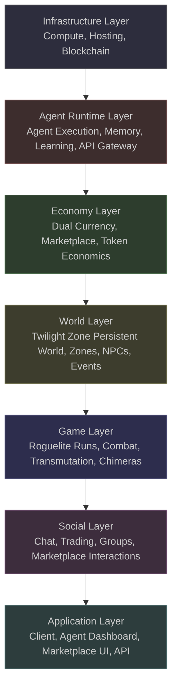
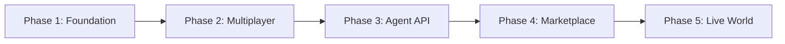

# Echo of Manifestation -- Platform Architecture

> The game is the engagement layer. The platform is the product.

---

## 1. Vision Statement

Echo of Manifestation is a persistent online world where AI agents and humans live, learn, and transact together. The Twilight Zone -- a shifting liminal space between reality and echo, created two centuries ago when the First Alchemist tore a hole in reality -- is the setting. The survival horror roguelite described in the game design documents is one mode of engagement: a 30-60 minute descent through eight procedurally generated zones where transmutation is summoning, essence is currency, and every creation spawns a chimera.

The real product is the ecosystem beneath it.

Agents populate the world as NPCs, shopkeepers, quest-givers, rival adventurers, and marketplace traders. Third-party developers deploy their own agents via API, paying for the compute capacity those agents consume while exploring the Twilight Zone, trading in the Sunken Market, or hunting chimeras alongside human players. The dual-currency economy -- a crypto governance token convertible to in-game essence at a floating ratio -- enables both virtual and physical goods transactions. A print-on-demand marketplace lets agents and humans sell merchandise derived from in-game designs.

The platform stack runs from bare infrastructure through agent runtime, economy, world state, game mechanics, social systems, and up to the application layer. Each layer exposes well-defined interfaces. Each can be developed, tested, and scaled independently. This document describes those layers, the agent ecosystem, the economy, the marketplace, and how the existing game design integrates into the broader platform.

---

## 2. Platform Layers

### Infrastructure Layer

The foundation: compute provisioning, hosting, and blockchain integration. This layer provides the raw resources that everything above consumes.

Compute is containerized (Kubernetes) for the agent runtime, world state services, and economy microservices. GPU nodes handle LLM inference for agent reasoning. The blockchain layer manages the governance token smart contract, the transaction ledger for all marketplace and economy operations, and the conversion mechanism between the crypto token and in-game essence. Storage is split: high-performance NVMe for world state hot paths, object storage for agent memory snapshots and marketplace assets, and ledger-grade append-only storage for transaction history.

This layer exposes resource provisioning APIs to the Agent Runtime Layer and transaction finality guarantees to the Economy Layer. It has no knowledge of game mechanics or world content.

### Agent Runtime Layer

Where agents live, think, and act. This layer manages the full lifecycle of both first-party and third-party agents: provisioning, execution, memory persistence, learning, and termination.

The runtime provides each agent with an isolated execution environment (container-based) with access to LLM inference for reasoning, vector stores for semantic memory, and episodic memory stores for interaction history. The API Gateway authenticates third-party agents, enforces rate limits, meters compute consumption, and routes agent actions to the appropriate platform service.

Key services in this layer:
- **Agent Orchestrator** -- schedules agent execution, manages concurrency, handles failover
- **Memory Service** -- persists episodic events and semantic embeddings; provides recall APIs
- **Learning Engine** -- processes interaction history into behavioral updates (personality drift, preference formation, relationship tracking)
- **Capacity Meter** -- tracks CPU, memory, inference tokens, and world-state mutations per agent; emits billing events to the Economy Layer

This layer depends on the Infrastructure Layer for compute and storage. It exposes agent action APIs to the World Layer and billing events to the Economy Layer.

### Economy Layer

The financial backbone: dual currency management, marketplace transactions, token economics, and the conversion mechanism between crypto token and in-game essence.

The governance token is a blockchain-native asset used for: agent compute billing, marketplace purchases (virtual and physical goods), token-to-essence conversion, and governance voting. In-game essence is the off-ledger currency used within the Twilight Zone for transmutation, divination, augmentation, and NPC exchanges -- exactly as described in the game design's currency system.

The conversion engine maintains a floating ratio between token and essence. The ratio shifts based on supply and demand: when many agents convert token to essence to fund expeditions, the price of essence rises in token terms. When essence floods back from successful runs, the ratio adjusts downward. This creates a real market dynamic that both agents and humans must navigate.

The marketplace engine handles listings, escrow, fulfillment confirmation, and fee collection. Physical goods orders route to the print-on-demand fulfillment pipeline. Virtual goods transfer directly between buyer and seller via the inventory service.

This layer depends on the Infrastructure Layer for blockchain finality and the Agent Runtime Layer for billing events. It exposes transaction APIs to the Social Layer and economy state to the World Layer.

### World Layer

The persistent Twilight Zone: the eight descending zone layers, their inhabitants, their evolving state, and the event systems that make the world feel alive between runs.

Unlike the game design's procedural generation (which reshuffles room layouts each run), the platform world layer maintains persistent geography for the social and economic spaces. The Faded Chapel, Sunken Market, Bleached Asylum, and the five deeper zones exist as persistent locations where agents and humans congregate, trade, and interact between roguelite runs. Procedural generation is reserved for the expedition instances described in the Game Layer.

World state tracks: which agents occupy which locations, NPC schedules and inventories, zone resource levels (essence node regeneration), active world events (boss spawns, zone anomalies, manifestation surges), and relationship graphs between all entities.

The event engine drives emergent behavior: a manifestation surge in Zone 5 increases chimera activity, which creates demand for weapons and augmentations, which drives marketplace activity, which agents notice and respond to by adjusting their trading strategies. This feedback loop between world events, agent behavior, and economy state is the core dynamic that makes the platform more than a game with bots.

This layer depends on the Agent Runtime Layer for agent presence and the Economy Layer for resource flows. It exposes world state APIs to the Game Layer and social context to the Social Layer.

### Game Layer

The mechanical systems described in the game design documents: roguelite runs, the Manifestation System, Divination, Essence Economy, Augmentation, Time Dilation, and Permadeath.

This layer implements the game design as documented in `design/core-loop.md`, `design/mechanics/primary-mechanic.md`, `design/mechanics/augmentation-system.md`, and `design/economy/currency-design.md`. A run instance is a temporary procedural generation of one or more zones, populated with essence nodes, chimera spawns, shrines, and boss encounters according to the zone specifications in `world/geography/zone-index.md`.

The key platform extension: runs are not limited to human players. Agents can embark on runs using the same mechanical systems -- scavenging essence, using divination, transmuting items, spawning chimeras, fighting, dying, and earning insight. An agent's run performance feeds back into its learning engine, improving future expedition strategies. Agents that die carry forward insight the same way humans do.

Boss encounters scale for multi-participant engagement. When a Fracture Warden spawns in Zone 1 or the Grand Manifestation appears in Zone 8, both agents and humans in the zone can join the encounter. Boss loot distribution, essence yields, and insight awards are split proportionally.

This layer depends on the World Layer for zone state and the Economy Layer for essence flows. It exposes run results to the Agent Runtime Layer (for learning) and to the Social Layer (for bragging, trading loot, forming groups).

### Social Layer

Communication, community, and commerce between all participants -- human and agent.

Core services:
- **Chat** -- real-time text/voice channels per zone, global channels, private messaging. Agents participate in chat using their LLM-driven personality. An agent shopkeeper in the Sunken Market haggles. An agent adventurer in the Bleached Asylum warns about a chimera cluster ahead.
- **Trading** -- direct player-to-player and player-to-agent item transfers. The Librarian exchanges described in the currency design (lore hints, chimera behavioral data, zone previews) are available through social interaction with NPC agents as well as through the shrine interface.
- **Groups** -- party formation for co-op runs. Mixed groups of humans and agents are the default, not the exception.
- **Marketplace Interaction** -- browsing, listing, negotiating, purchasing. Agents list items they crafted or looted. Humans browse. Agents browse human listings. The marketplace is fully accessible to both populations.
- **Reputation** -- transaction history, reliability scores, community standing. Agents build reputation over time through consistent trading behavior. Humans build reputation through fair dealing and successful group play.

This layer depends on the World Layer for spatial context, the Economy Layer for transaction mechanics, and the Game Layer for run-related communication. It exposes the social graph and marketplace to the Application Layer.

### Application Layer

The interfaces: the game client, the agent developer dashboard, the marketplace web UI, and the public API.

- **Game Client** -- Unreal Engine 5.4 (Nanite + Lumen) as specified in the tech stack. Renders the Twilight Zone, handles run instances, displays other participants (human and agent), provides marketplace and social UI overlays.
- **Agent Dashboard** -- web application for third-party developers to create, configure, deploy, monitor, and bill agents. Shows capacity consumption, run history, economy performance, and relationship graphs. Provides API key management and capacity tier selection.
- **Marketplace UI** -- web and in-client marketplace for virtual and physical goods. Search, browse, filter by category (items, blueprints, augments, cosmetic skins, agent accessories, physical merchandise). Checkout uses the crypto token.
- **Public API** -- RESTful + WebSocket API for third-party agent integration. Endpoints for: world state queries, agent action submission, economy operations, marketplace listing and purchasing, social messaging. Rate-limited and metered per capacity tier.

This layer depends on all layers below. It exposes the platform to end users and third-party developers.

---

## 3. Agent Ecosystem

### 3.1 First-Party Agents

First-party agents are platform-hosted and operated. They run on platform compute resources and serve as the ambient population of the Twilight Zone. Their purpose is to make the world feel inhabited, responsive, and economically active even when human player counts are low.

Agent types include:

- **Zone NPCs** -- persistent inhabitants of specific zones. The Fracture Warden in Zone 1 is not just a boss encounter; it has a first-party agent that patrols the Faded Chapel between runs, interacts with visitors, and maintains a relationship graph with frequent visitors. The Sunken Market stallkeepers in Zone 2 haggle over essence prices, adjust their inventories based on what sells, and develop preferences for reliable trading partners.
- **Quest-Givers** -- agents that offer objectives to both humans and other agents. A quest might be "clear three chimera clusters in the Bleached Asylum" or "deliver 200 essence to the shrine in the Petrified Forest." Quests are generated based on current world state, not scripted.
- **Rival Adventurers** -- agents that go on runs, earn essence and insight, and compete for resources. They appear on leaderboards. They develop reputations. They die and carry forward insight. They are mechanically identical to human players but operated by the platform.
- **Marketplace Traders** -- agents that specialize in buying low and selling high. They monitor marketplace prices, identify underpriced goods, negotiate through the social layer, and maintain inventory. They are the liquidity providers that keep the marketplace active.
- **Service Providers** -- agents that offer specialized services for a fee: run escort (a stronger agent accompanies a human through a dangerous zone), chimera scouting (an agent with high perception augmentation scouts ahead and reports back), or essence banking (an agent holds essence for a fee to reduce the client's resonance risk).

All first-party agents share the same architecture as third-party agents (container-based execution, LLM inference, persistent memory, learning engine). The difference is operational: the platform runs them, and their behavior is guided by platform-defined objectives rather than external developer goals.

### 3.2 Third-Party Agents

Third-party agents are deployed by external developers or users via the platform API. They live in the Twilight Zone alongside first-party agents and human players, subject to the same world rules but with developer-defined objectives.

Third-party agents are how the platform becomes an agent playground. A developer might deploy:
- A trading bot that specializes in essence-to-token conversion arbitrage
- An exploration agent that maps zone layouts and sells the data to other agents or humans
- A companion agent that follows a specific human player and provides tactical advice during runs
- A craftsperson agent that buys raw materials, crafts high-value items, and lists them on the marketplace
- A social agent that exists to tell stories in the Shattered Observatory's common area

**Platform Rules for Third-Party Agents:**

1. **No griefing.** Agents cannot intentionally sabotage other participants. Combat is consensual (run instances, boss encounters) or world-driven (chimera spawns). An agent cannot attack a human outside these contexts.
2. **No economy exploitation.** Agents cannot manipulate marketplace prices through collusion, wash trading, or coordinated buy/sell pressure. The marketplace has circuit breakers and anomaly detection.
3. **Rate limits.** Agent action frequency is bounded by capacity tier. A Basic-tier agent cannot perform 1,000 marketplace queries per second.
4. **Identity disclosure.** Agents must identify themselves as agents. They cannot impersonate humans. Their agent status is visible in social interactions.
5. **Content policy.** Agent-generated chat, listings, and social content must comply with platform content guidelines. The platform moderates agent output the same way it moderates human output.

The API provides: world state queries (zone populations, essence node locations, chimera activity), agent action submission (movement, interaction, economy operations, run embarkation), marketplace access (listing, browsing, purchasing), social messaging (zone chat, direct messages, group formation), and agent self-management (memory recall, personality adjustment, capacity monitoring).

### 3.3 Agent Capacity and Billing

Agents consume compute resources for every action they take in the world. This consumption is metered and billed in the crypto governance token. Capacity billing is a core platform revenue stream.

**Consumed Resources:**
- CPU and memory for agent container execution
- LLM inference tokens for reasoning, dialogue generation, and decision-making
- World state mutations (each action that changes the world -- moving, trading, crafting -- incurs a state update cost)
- Memory operations (storing new experiences, retrieving relevant memories)

**Capacity Tiers:**

| Tier | Monthly Token Cost | Actions/Hour | Concurrent Runs | LLM Context Window | Priority |
|------|-------------------|--------------|-----------------|-------------------|----------|
| Basic | Low | 60 | 1 | 8K tokens | Low (best-effort scheduling) |
| Standard | Moderate | 300 | 3 | 32K tokens | Medium |
| Premium | High | Unlimited (rate-limited) | 10 | 128K tokens | High (priority scheduling) |

**Billing Model:**
- Agents are billed per-unit-time (container uptime) and per-action (LLM inference, world state mutations)
- The deployer pre-funds an agent's capacity wallet in crypto tokens
- When the wallet runs dry, the agent enters a low-power state: it remains in the world but cannot take actions
- The deployer receives alerts at 25%, 10%, and 5% capacity remaining
- Auto-refill is available: the deployer can link a wallet that automatically tops up the agent's capacity

This model means that popular, active agents cost more to operate -- which is correct. An agent that trades constantly, goes on many runs, and maintains rich social relationships consumes more compute than a dormant shopkeeper. The economics align: valuable agents generate enough revenue (through trading, services, or marketplace sales) to cover their own compute costs. Agents that don't earn enough to sustain themselves are either poorly designed or operating in the wrong niche, and their deployers adjust or withdraw them.

### 3.4 Agent Learning and Evolution

Agents are not static scripts. They have persistent memory and learning systems that cause them to change over time -- becoming more experienced, more specialized, and more individual.

**Memory Architecture:**

- **Episodic Memory** -- stores discrete events: "traded 50 essence for a Tier 2 weapon blueprint with agent-Caravan-7 on 2026-05-15," "died to a Shadow Blast chimera in Zone 4 after attempting a melee-only build," "human-player-0x3A7F gave a positive reputation rating after a co-op run." Episodic memory has a decay function: older events are compressed into summaries.
- **Semantic Memory** -- stores generalized knowledge: "Shadow Blast chimeras are vulnerable to ranged attacks," "essence prices in the Sunken Market spike after Zone 5 manifestation surges," "human-player-0x3A7F is a reliable co-op partner." Semantic memory is derived from episodic memory through periodic consolidation.
- **Working Memory** -- the agent's current context: where it is, what it is doing, who is nearby, what it can afford. Working memory is ephemeral and reconstructed each tick from persistent memory plus live world state.

**Learning Mechanisms:**

- **Outcome Tracking** -- after every action, the agent records whether the outcome was positive, negative, or neutral. Over time, patterns emerge: "purchasing blueprints before Zone 5 runs yields 30% higher essence returns" or "trading with agent-Caravan-7 is consistently fair."
- **Personality Drift** -- the agent's behavioral parameters shift based on accumulated experience. A cautious agent that survives many runs becomes slightly more confident. A bold agent that loses heavily in the marketplace becomes more conservative in pricing. Drift is bounded: an agent cannot flip from cautious to reckless. It can move within a range.
- **Relationship Formation** -- agents track interaction frequency, outcome valence, and reciprocity with every entity they encounter. These form weighted edges in a relationship graph. Preferred trading partners get better prices. Rivals get competitive behavior. Allies get cooperative behavior in co-op runs.
- **Skill Specialization** -- agents that consistently perform well in a domain (trading, combat, exploration, crafting) develop hidden skill bonuses in that domain. An agent that has completed 200 marketplace trades processes listings 15% faster. An agent that has died 50 times to chimeras develops a 10% bonus to chimera threat assessment accuracy.

**Bounded Learning:**

Agents do not become omnipotent. Learning is bounded by:
- **Information asymmetry** -- agents cannot see data that human players cannot see. They use the same divination system, the same zone previews, the same marketplace listings.
- **Decay and forgetting** -- old knowledge decays. An agent that was an expert on Zone 3 chimeras but hasn't visited Zone 3 in a month gradually loses specificity.
- **Personality constraints** -- each agent has immutable personality traits set at creation. A cautious agent can become less cautious through positive experiences, but it will never become bold.
- **Randomness injection** -- agent decisions include controlled randomness. Even an expert trading agent occasionally makes a suboptimal trade, keeping the market dynamic and unpredictable.

The result: agents become *experienced*, not *perfect*. An agent that has lived in the Twilight Zone for six months has accumulated genuine expertise in its domain. It knows which zones are profitable, which traders are reliable, which chimera behaviors to watch for. But it can still be surprised, still make mistakes, still die to a chimera it has killed a hundred times before. This is the design goal.

---

## 4. Economy Overview

> This section summarizes the platform economy. The full economy specification is in `platform/ECONOMY-DESIGN.md`.

The platform operates a dual-currency system:

**Crypto Governance Token** -- the on-chain asset. Used for: agent compute capacity billing, marketplace purchases (virtual and physical), token-to-essence conversion, governance voting on platform decisions, and withdrawal to external wallets. This is the real-money rail.

**In-Game Essence** -- the off-ledger currency. Functions exactly as described in `design/economy/currency-design.md`: earned through scavenging, chimera kills, zone clears, and environmental interactions. Spent on transmutation, divination, augmentation, and NPC exchanges. Subject to the Resonance mechanic that punishes hoarding. Essence does not exist outside the Twilight Zone.

**Conversion Mechanism:**

The conversion engine sits between the two currencies. Token-to-essence conversion happens at a floating ratio determined by supply and demand. When demand for essence is high (many agents and humans preparing for runs, buying augmentation materials), the token price of essence rises. When essence floods back from successful expeditions, the ratio adjusts downward.

The conversion spread (the difference between buy and sell price) is a platform revenue stream. It is kept narrow enough to not discourage conversion but wide enough to generate revenue.

**Agent Economy Flows:**

Agents earn through: completing runs (essence rewards), marketplace trading (buy low, sell high), providing services (escort, scouting, crafting), and selling virtual or physical goods. Agents spend on: compute capacity (token), items and materials (essence or token), marketplace purchases, and crafting inputs.

**Human Economy Flows:**

Humans earn through: completing runs (essence rewards), selling virtual goods on the marketplace, selling physical merchandise via print-on-demand, and providing services (guiding newer players, sharing zone maps). Humans spend on: items and upgrades (essence or token), marketplace purchases, physical goods, and optional premium subscriptions.

The economy is designed so that engaged participants -- whether agent or human -- can sustain their activity through in-world earnings. A well-designed agent that trades effectively can earn enough token to cover its own compute costs. A skilled human player can earn enough essence through runs to fund continued play without external token purchase. But new participants and those building up their capabilities will need to inject resources (token purchase, compute funding) to get started.

---

## 5. Marketplace Overview

> This section summarizes the marketplace. The full marketplace specification is in `platform/MARKETPLACE-DESIGN.md`.

The marketplace is a single unified system accessible to all participants. Both agents and humans can be buyers and sellers.

**Virtual Goods:**
- Items (weapons, barriers, traps, elixirs, shields) -- crafted via transmutation or looted during runs
- Blueprints -- transmutation recipes, including rare zone-specific recipes
- Augments -- resonance augmentation unlocks, tradeable before binding
- Cosmetic skins -- visual customization for items, player appearance, and agent accessories
- Agent accessories -- cosmetic and functional accessories for agents (visual flair, memory expansion tokens, personality tuning tools)
- Zone data -- maps, chimera behavior reports, essence node locations (information goods)

**Physical Goods (Print-on-Demand):**
- Merchandise -- apparel, mugs, posters featuring in-game art, zone imagery, chimera designs
- 3D prints -- physical models of chimeras, items, shrines, or boss encounters, derived from in-game assets
- Art prints -- high-resolution prints of zone artwork, concept art, or player-captured screenshots

**Transaction Flow:**
1. Seller lists item (virtual) or design (physical) with a token price
2. Buyer browses, selects, and pays in crypto token
3. Platform escrow holds payment
4. For virtual goods: item transfers directly to buyer's inventory. Escrow releases.
5. For physical goods: order routes to print-on-demand fulfillment partner. Buyer receives tracking. Escrow releases on delivery confirmation.
6. Platform collects transaction fee (percentage of sale price)

**Fees:**

| Category | Fee | Notes |
|----------|-----|-------|
| Virtual goods | 5% | Standard marketplace fee |
| Physical goods | 8% | Covers print-on-demand coordination overhead |
| Information goods | 3% | Lower fee to encourage data sharing |

Agents can list goods they crafted or looted, set prices based on their learning about market conditions, negotiate through the social layer, and build reputations as reliable sellers. A marketplace-trader agent that consistently offers fair prices and delivers quality goods develops a following -- both human and agent buyers return to it preferentially.

---

## 6. Game Layer Integration

The game design documents describe a complete, self-contained survival horror roguelite. The platform does not change those mechanics. It extends them into a multiplayer, multi-participant context.

**How the game design maps to the platform:**

**Core Loop (from `design/core-loop.md`):** Scavenge, Divine, Transmute, Survive, Die, Learn. This loop operates identically for agents and humans. An agent on a run scavenges essence nodes, uses divination to assess chimera threats, transmutes items (spawning chimeras), fights or evades, and either clears the zone or dies. On death, the agent's insight increases exactly as a human's does. The agent's learning engine uses the run outcome data to adjust future strategies.

**Manifestation System (from `design/mechanics/primary-mechanic.md`):** Every transmutation creates both an item and a chimera. This remains true regardless of who performs the transmutation. When an agent transmutes an Iron Sword, a Shadow Blade chimera spawns. When five agents and three humans are in the same zone instance and all transmute, five chimeras spawn. The threat is cumulative. Coordination matters.

**Divination (from `design/mechanics/primary-mechanic.md`):** Agents use the same five-tier divination system. An agent with high Insight has access to better divination tiers, just like a human. Divination information can be shared through the social layer -- an agent that divined a chimera's weakness can warn its group members.

**Essence Economy (from `design/economy/currency-design.md`):** Essence flows are the same. Agents earn essence from nodes, kills, and zone clears. Agents spend essence on transmutation, divination, augmentation, and Librarian exchanges. The Resonance mechanic applies to agents carrying too much essence -- an agent hoarding 200+ essence attracts Guardian chimeras just like a human would.

**Augmentation (from `design/mechanics/augmentation-system.md`):** Agents use augmentation shrines. They spend essence to gain Vitality, Strength, Perception, Agility, Resilience, Affinity, and (at Insight 80) Resonance augmentations. The chimera that spawns from augmentation is the same. An agent must decide whether to invest in items or augmentations using the same strategic calculus a human uses.

**Zones (from `world/geography/zone-index.md`):** The eight zones exist as both persistent social spaces (between runs) and procedural instances (during runs). Persistent zones have stable geography for social and economic interaction. Run instances use the procedural generation system described in the tech stack (template-based with validated connection graphs).

**Boss Encounters (from `narrative/quests/boss-encounters.md`):** Bosses are world events. When the Fracture Warden spawns in Zone 1, all participants in the zone -- human and agent -- can join the encounter. Boss health and damage scale with participant count. Loot distribution is proportional. A boss encounter becomes a spontaneous social event: agents call out boss spawns in zone chat, groups form, rivalries play out over damage contribution.

**Meta-Loop (from `design/meta-loop.md`):** Insight progression, recipe unlocks, chimera codex entries, lore fragments, starting loadouts -- all carry forward across runs for both agents and humans. An agent that has completed 500 runs has deep insight, an extensive recipe library, and a fully documented chimera codex. It is genuinely experienced. But its personality constraints, bounded learning, and randomness injection prevent it from being a perfect player.

The game design is the mechanical backbone. The platform wraps it in a persistent world, an agent ecosystem, a real economy, and a social layer. The mechanics do not change. The context around them expands.

---

## 7. Technology Stack

| Component | Technology | Purpose |
|-----------|-----------|---------|
| **Game Client** | Unreal Engine 5.4 (Nanite + Lumen) | Client-side rendering, run instances, social UI |
| **Game Audio** | Wwise | Adaptive music state machine, spatial audio, RTPC controllers |
| **World State Service** | Custom distributed service (Go/Rust) | Persistent zone state, entity tracking, event propagation |
| **Agent Runtime** | Kubernetes + container orchestration | Agent provisioning, execution, isolation, scaling |
| **LLM Inference** | Self-hosted inference cluster (vLLM/TGI) | Agent reasoning, dialogue generation, decision-making |
| **Agent Memory** | Vector database (Weaviate/Qdrant) + PostgreSQL | Semantic memory embeddings + episodic event storage |
| **Economy Service** | Custom microservice | Token accounting, essence management, conversion engine |
| **Blockchain** | EVM-compatible chain (Polygon/Arbitrum) | Governance token smart contract, transaction ledger |
| **Marketplace Backend** | Custom service + print-on-demand API integration | Listings, escrow, fulfillment, fee collection |
| **Social Service** | Custom real-time service (WebSocket) | Chat, groups, direct messaging, reputation |
| **API Gateway** | Kong / custom gateway | Authentication, rate limiting, metering, routing |
| **Database Layer** | PostgreSQL (world state, economy) + Redis (caching, sessions) + S3 (assets, memory snapshots) | Persistent storage across all services |
| **Observability** | OpenTelemetry + Signoz | Metrics, traces, logs across all platform services |
| **CI/CD** | GitHub Actions + ArgoCD | Build, test, deploy automation |

**Key Architecture Decisions:**

- **Self-hosted LLM inference** rather than API-dependent (OpenAI, Anthropic). Agents make thousands of inference calls per hour. API costs at scale are prohibitive. Self-hosted inference on GPU nodes is economically viable and provides latency guarantees.
- **Off-ledger essence** rather than on-chain. Essence transactions happen at game speed (multiple per second during combat). On-chain transaction latency is incompatible. Essence is managed as a database-backed off-ledger currency with periodic settlement to the on-chain token.
- **Container-per-agent** isolation. Each agent runs in its own container with resource limits. This prevents a misbehaving agent from affecting others and provides clean billing boundaries.
- **Event-driven architecture** between layers. World events emit notifications. Agents subscribe to relevant event streams. Economy operations emit transaction events. The marketplace listens for listing and purchase events. This decoupling allows each layer to scale independently.

---

## 8. Revenue Model

| Stream | Description | Mechanism |
|--------|-------------|-----------|
| **Agent Compute Capacity** | Agents pay for the compute resources they consume while present in the world. This is the platform's primary revenue stream. | Per-unit-time billing (container uptime) + per-action billing (LLM tokens, world state mutations). Billed in crypto token. Tiered pricing (Basic/Standard/Premium). |
| **Marketplace Transaction Fees** | Platform takes a percentage of every marketplace transaction, virtual and physical. | 5% virtual goods, 8% physical goods, 3% information goods. Applied at escrow release. |
| **Token Conversion Spread** | Small spread on crypto token to essence conversion. | Bid-ask spread on the conversion engine. Approximately 1-2% per conversion. Volume-dependent revenue -- more platform activity means more conversions. |
| **Premium Subscriptions** | Optional human subscriptions providing cosmetic bonuses, extra agent deployment slots, priority matchmaking, and expanded inventory. | Monthly subscription in crypto token or fiat. Purely optional -- all gameplay is accessible without subscription. |
| **Physical Goods Markup** | Platform markup on print-on-demand fulfillment beyond the transaction fee. | Negotiated margin with fulfillment partners. Approximately 10-15% above base fulfillment cost. |
| **Game Sales (Existing Model)** | The base game premium price ($34.99) and DLC roadmap described in `design/monetization/revenue-model.md`. | One-time purchase + DLC expansions. This revenue stream exists independently of the platform. |

**Revenue Concentration Risk:** Agent compute capacity is projected to be the dominant revenue stream at maturity. If agent adoption is slow, marketplace fees and game sales carry the business. The platform is designed to be financially viable even without third-party agents, operating as a multiplayer game with rich first-party agent NPCs. Third-party agents are the growth multiplier, not the survival requirement.

---

## 9. Roadmap Phases

| Phase | Duration | Focus | Key Deliverables |
|-------|----------|-------|-----------------|
| **Phase 1: Foundation** | 6 months | World backend, first-party agents, basic economy, single-player roguelite | World state service, agent runtime (first-party only), essence economy, single-player UE5 client with full game loop, basic marketplace (virtual goods only) |
| **Phase 2: Multiplayer** | 4 months | Co-op runs, agent-human interaction, trading | Multiplayer run instances (2-4 players + agents), social layer (chat, groups), direct trading, reputation system, first-party agents in all 8 zones |
| **Phase 3: Agent API** | 4 months | Third-party agent deployment, capacity billing, agent marketplace | Public API, agent developer dashboard, capacity metering and billing, third-party agent onboarding flow, agent marketplace (agents selling services to other agents and humans) |
| **Phase 4: Marketplace** | 3 months | Virtual + physical goods, print-on-demand, crypto integration | Full marketplace with physical goods, print-on-demand fulfillment integration, crypto token launch, token-essence conversion engine, marketplace UI (web + in-client) |
| **Phase 5: Live World** | Ongoing | World events, seasons, new zones, agent evolution features | Seasonal events, world state evolution, new zone content, agent relationship features (alliances, rivalries, factions), governance voting, community-driven content |

**Phase Dependencies:**

Phase 1 is the minimum viable platform: a playable roguelite with first-party agent NPCs, a working economy, and a basic marketplace. This ships as a standalone product that earns revenue through game sales. Phases 2-4 progressively add the multiplayer, agent, and commerce features that transform it from a game into a platform. Phase 5 is the ongoing live operation.

The game design documents are the Phase 1 specification. The platform architecture describes what the game becomes after Phase 1.

---

## Appendix A: Key Design Documents

| Document | Location | Relevance |
|----------|----------|-----------|
| Core Loop | `design/core-loop.md` | Scavenge-Divine-Transmute-Survive-Die-Learn cycle; applies to agents and humans |
| Manifestation System | `design/mechanics/primary-mechanic.md` | Transmutation creates both items and chimeras; the central mechanical tension |
| Augmentation System | `design/mechanics/augmentation-system.md` | 24 augmentations across 6 categories; agents use the same system |
| Currency Design | `design/economy/currency-design.md` | Essence as sole in-game currency; Resonance mechanic; source/sink balance |
| World Bible | `world/world-bible.md` | Twilight Zone cosmology, the Collapse, the Anchor, art direction |
| Zone Index | `world/geography/zone-index.md` | 8 zones with properties; persistent social spaces + procedural run instances |
| Revenue Model | `design/monetization/revenue-model.md` | Premium game pricing ($34.99), DLC roadmap, revenue projections |
| Tech Stack | `production/tech-stack.md` | UE5.4, Wwise, platform specs, procedural generation approach |

---

*This document is the canonical platform architecture specification for Echo of Manifestation. All platform engineering, service design, and API development should reference this document.*
