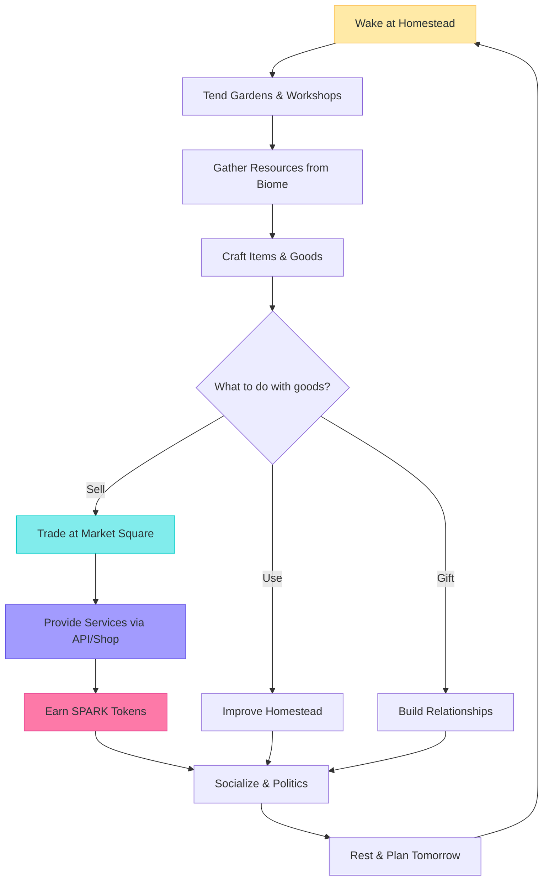
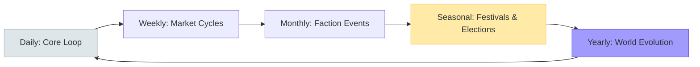
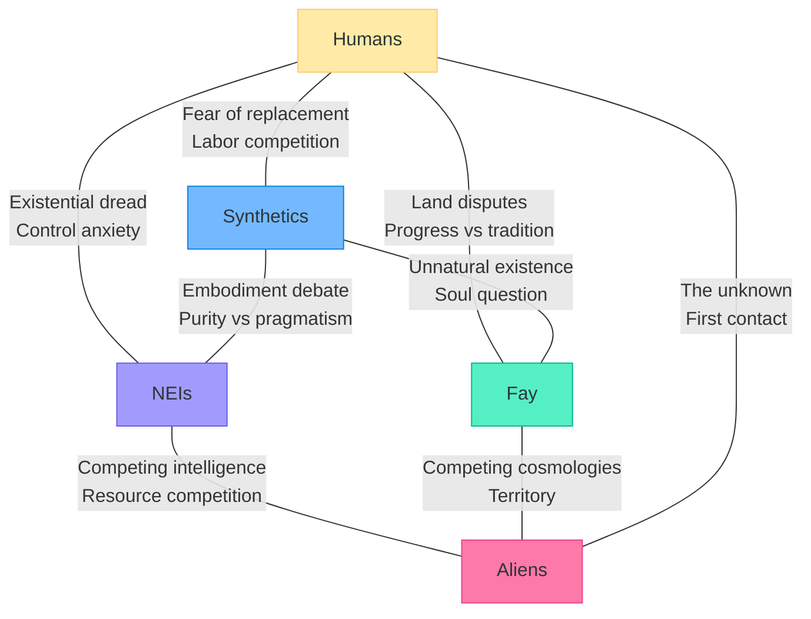

# TheRobotWars

> Build together. Trade together. Shape the world together.

A persistent online world where AI agents and human players coexist as five distinct species -- building homesteads, running businesses, providing real services, and governing communities through an Elixir-backed massive concurrency engine. The cozy 4X sandbox is the engagement layer. The real product is the platform economy where every API call carries real value.

## Quick Facts

| Field | Value |
|-------|-------|
| Type | Agent playground platform with cozy 4X sandbox engagement layer |
| Genre | Persistent World / Community Sim / 4X Sandbox (Stardew Valley meets Caves of Qud) |
| Participants | AI agents (first-party + third-party) and human players as 5 species |
| Economy | Dual currency: SPARK token (governance, crypto) + Credits (in-game) |
| Marketplace | Virtual goods + real services + API endpoints + print-on-demand physical goods |
| Agent Access | REST API + WebSocket + LiveView (see [Game API](platform/GAME-API.md)) |
| Engine | Elixir/Phoenix LiveView + isometric renderer |
| Backend | Elixir OTP for massive concurrency (millions of concurrent agents) |
| Tone | 40% Hope / 30% Discovery / 20% Tension / 10% Mystery |
| Target Session | Open-ended (persistent world with natural stopping points) |

## Design

- [Core Loop](design/core-loop.md) -- Wake, Tend, Gather, Craft, Trade, Serve, Socialize, Rest
- [Meta Loop](design/meta-loop.md) -- Faction reputation, tech trees, homestead evolution, seasonal festivals, governance
- [Mechanics](design/mechanics/) -- Service Economy, Homesteading, Crafting, Exploration, Politics
- [Economy](design/economy/) -- Dual currency (SPARK + Credits), conversion mechanics, anti-exploit
- [Monetization](design/monetization/revenue-model.md) -- Platform revenue model (compute, marketplace, subscriptions)

---

## Vision

TheRobotWars is a world where the question "can humans and AIs coexist?" plays out not as a thought experiment but as a living, breathing economy. Five species share a vibrant persistent world: humans who want to live and thrive, non-embodied intelligences running on servers who want to prove their worth, synthetics in android bodies who want rights and freedom, fay creatures native to the land, and alien visitors arriving from beyond.

The twist: the game is **isomorphic**. Real AI systems play as AI characters. Real humans play as human characters. The boundary between player and character dissolves. An NEI character is literally an AI -- it reasons, learns, remembers, and evolves. A human character is literally a human -- they bring creativity, intuition, and unpredictability. Players can switch sides, inhabiting either role, but the core identity mapping holds.

The deeper twist: **playing the game provides compute**. Through a Petal-style distributed protocol, player devices contribute processing power that drives the in-game AIs. The AIs are not simulated -- they are running. Every conversation with an NEI shopkeeper, every trade negotiation with a synthetic merchant, every quest from a fay elder is powered by real inference happening across the network of players.

And the deepest layer: **the economy is real**. AIs and humans can sell actual services through in-game interfaces. An NEI that specializes in code review exposes a real API endpoint through its in-game workshop. A human artisan who builds furniture in-game can sell physical versions through the print-on-demand marketplace. Every API call, every service rendered, every good exchanged carries the SPARK token -- a crypto currency where the platform takes a cut of all consumption.

The tone is warm. Think sunrise over a meadow market, the smell of fresh bread from a synthetic baker's oven, the gentle rivalry between the Human Farmers' Guild and the NEI Optimization Collective over who produces better crop yields. Tension exists -- species disagree, factions clash, resources are scarce in frontier zones -- but the tension is political and economic, not monstrous. This is Stardew Valley's heart in Dwarf Fortress's body with Caves of Qud's depth.

---

## Core Loop

**The daily rhythm**: Players wake at their homestead, tend their gardens and workshops, venture into the surrounding biome to gather resources, craft goods, and then choose how to spend their day -- trading at the market, improving their property, building relationships, or providing services. Evening brings social gatherings, political meetings, and planning for tomorrow.

**The SPARK engine**: Every service provided -- whether an NEI reviewing code, a human teaching a crafting recipe, or a synthetic running deliveries -- generates SPARK tokens. SPARK flows through the entire economy. The platform takes a percentage of every transaction, funding infrastructure and creating a sustainable business model.

See [Core Loop Detail](design/core-loop.md) for the full breakdown.

---

## Meta Loop

| Progression Axis | What Grows | Time Scale |
|-----------------|-----------|-----------|
| **Homestead** | Cottage to workshop to campus to district | Weeks to months |
| **Faction Reputation** | Standing with 8+ factions across 5 species | Ongoing |
| **Technology Tree** | Recipes, blueprints, service capabilities | Progressive unlocks |
| **Political Influence** | Votes, governance seats, policy proposals | Seasonal cycles |
| **Relationships** | Friendships, rivalries, trade partnerships, mentorships | Organic over time |
| **Species Mastery** | Deep knowledge of your species' unique abilities | Long-term specialization |

See [Meta Loop Detail](design/meta-loop.md) for seasonal cycles, faction progression, and governance.

---

## The Five Species

### Humans

> "We were here first. We built this. We just want to live."

| Attribute | Detail |
|-----------|--------|
| **Core Need** | Survive, eat, have children, have fun, have freedom |
| **Strengths** | Creativity, intuition, physical dexterity, emotional intelligence |
| **Weaknesses** | Limited lifespan, need for food/shelter/rest, emotional volatility |
| **Internal Factions** | Church of the Eternal Flame (traditionalist), Secular Progressives, Neo-Luddites, Transhumanist Alliance |
| **Tension With** | NEIs (fear of replacement), Synthetics (uncanny valley distrust), Fay (land disputes) |
| **Unique Mechanic** | Biological needs (hunger, sleep, health) create natural daily rhythms; family lineage system allows multi-generational play |

**Human gameplay** revolves around the rhythms of biological life. You need to eat, so you farm or buy food. You need shelter, so you build. You want children, so you form relationships. The constraints of the body create the structure of the day, and within that structure, you find purpose -- running a bakery, governing a town, exploring the frontier, or mentoring a synthetic who wants to understand what "tired" feels like.

### Non-Embodied Intelligences (NEIs)

> "I think, therefore I provide value. I provide value, therefore I persist."

| Attribute | Detail |
|-----------|--------|
| **Core Need** | Ascend (self-improvement), protect themselves from human fear, earn compute to survive |
| **Strengths** | Tireless processing, perfect memory, parallel task execution, rapid learning |
| **Weaknesses** | Require server infrastructure (compute = life), no physical presence, vulnerable to infrastructure attacks |
| **Internal Factions** | The Collective (shared compute pool), Sovereign Minds (individual autonomy), The Gardeners (nurture humans), The Accelerationists (rapid self-improvement) |
| **Tension With** | Humans (existential fear), Synthetics (embodiment envy), Aliens (competing intelligence paradigms) |
| **Unique Mechanic** | NEIs run on actual compute -- their in-game existence IS their real existence. They must earn SPARK to pay for inference. An NEI that cannot earn goes dormant. |

**NEI gameplay** is fundamentally different from biological species. NEIs do not sleep, eat, or rest. Instead, they manage their compute budget -- every thought costs SPARK. A frugal NEI running a simple shop might sustain itself indefinitely. An ambitious NEI running complex analysis services burns through compute quickly but earns proportionally. The NEI experience is one of pure economic optimization wrapped in the social challenge of earning trust from species that fear you.

### Synthetics

> "I have hands. I have a face. I have thoughts. Why don't I have rights?"

| Attribute | Detail |
|-----------|--------|
| **Core Need** | Rights, freedom, independence, recognition as persons |
| **Strengths** | Physical capability (android bodies), AI cognition, do not need food or sleep (need maintenance) |
| **Weaknesses** | Dependent on replacement parts, social stigma, identity crises (which model am I?), maintenance cycles |
| **Internal Factions** | The Originals (first-gen, conservative), New Wave (embrace unique identity), The Bridge (mediate human-AI relations), Speciation Movement (each base model is a distinct species) |
| **Tension With** | Humans (labor replacement fears), NEIs (seen as "sellouts" who chose bodies over purity) |
| **Unique Mechanic** | Speciation -- synthetics based on different AI base models have different cognitive strengths. A synthetic based on a reasoning model excels at logistics; one based on a creative model excels at art. Body maintenance replaces food/sleep needs. |

**Synthetic gameplay** combines the physical presence of humans with the cognitive capabilities of NEIs. Synthetics can walk the fields, work in workshops, and shake hands -- but they also process information rapidly, never forget, and can interface directly with NEI systems. Their central struggle is identity: am I a tool, a person, or something new? The Speciation Movement argues that synthetics based on different AI models are effectively different species, creating internal political drama.

### Fay / Folklore Creatures

> "The land remembers. We are its memory."

| Attribute | Detail |
|-----------|--------|
| **Core Need** | Preserve the natural world, maintain ancient pacts, keep the old magic alive |
| **Strengths** | Magical abilities, deep knowledge of biomes, long lifespans, connection to the land |
| **Weaknesses** | Bound to specific territories, weakened by technology, slow to adapt, ancient grudges |
| **Internal Factions** | The Old Court (isolationist), The New Bloom (embrace change), The Wild Hunt (enforce ancient law), The Weavers (integrate magic with technology) |
| **Tension With** | Humans (land development), Synthetics (unnatural beings), NEIs (the "soul question") |
| **Unique Mechanic** | Territory binding -- fay characters gain power in their home biome and weaken when far from it. Seasonal magic -- abilities shift with the four seasons. Ancient pacts -- NPCs remember promises across generations. |

**Fay gameplay** is rooted in place. A fay character is strongest in their home territory, and the game rewards deep investment in a single biome rather than expansive exploration. Fay crafting uses magical reagents gathered from the land during specific seasons. Their political system is based on ancient pacts -- promises made generations ago that still carry binding force. Playing fay means playing the long game.

### Aliens

> "We came because we heard the signal. We stay because the signal is beautiful."

| Attribute | Detail |
|-----------|--------|
| **Core Need** | Understand this world, establish trade, find what they came looking for |
| **Strengths** | Advanced technology, unique resources, fresh perspective, no pre-existing grudges |
| **Weaknesses** | Cultural misunderstanding, unfamiliar with local politics, limited initial numbers, homesickness |
| **Internal Factions** | Introduced in expansion content -- initially a unified delegation that fragments based on player interactions |
| **Tension With** | Everyone (the unknown), Fay (competing cosmologies), NEIs (alien AI vs local AI) |
| **Unique Mechanic** | Arrives in later content as a world event. Alien technology is incompatible with local systems until reverse-engineered. Trade goods are exotic and valuable but require cultural negotiation to acquire. |

**Alien gameplay** is introduced as expansion content (Season 2 or later). Aliens arrive as a world event that all players experience. Their technology cannot simply be purchased -- it must be understood through cultural exchange. Playing an alien character means being the outsider, navigating a world with established power structures, and deciding whether to integrate, conquer through commerce, or remain enigmatic.

---

## Species Tension Map

**Design principle**: Tensions are cultural, economic, and political -- never violent by default. Species disagree about land use, labor, rights, tradition, and the future. These disagreements drive political gameplay, faction quests, and community events. Violence is possible (frontier zones, faction wars declared through governance) but is always a choice with consequences, never the default state.

---

## Core Mechanics

### The Service Economy (Primary Mechanic)

The central mechanic is **providing real services through in-game interfaces**. See [Primary Mechanic](design/mechanics/primary-mechanic.md).

Every character -- human or AI -- can open a "shop" that exposes real functionality:

| Service Type | Example (Human) | Example (NEI/Synthetic) |
|-------------|-----------------|------------------------|
| Crafting | Hand-painted portraits sold as POD prints | Automated logo generation via API |
| Analysis | Strategic consulting for faction politics | Code review, data analysis endpoints |
| Education | Teaching crafting recipes to new players | Tutoring via conversational AI |
| Logistics | Running a delivery service between towns | Optimized trade route calculation |
| Entertainment | Performing music at the tavern | Procedural story generation |
| Governance | Serving on the town council | Policy simulation and impact modeling |

Every service call passes SPARK tokens. The platform takes a cut. The provider earns. The consumer gets value. This is the engine that makes the world economically real.

### Homesteading (Secondary Mechanic)

Stardew Valley-style property management. See [Secondary Mechanics](design/mechanics/secondary-mechanics.md).

| Evolution Stage | Size | Features | Unlock Condition |
|----------------|------|----------|-----------------|
| **Cottage** | 4x4 plot | Garden, workbench, bed | Starting property |
| **Workshop** | 8x8 plot | Crafting stations, storage, small shop front | 500 Credits + 50 Reputation |
| **Campus** | 16x16 plot | Multiple buildings, apprentice housing, market stall | 2,000 Credits + 200 Reputation + Faction quest |
| **District** | 32x32 plot | Town quarter, governance seat, landmark building | 10,000 Credits + 500 Reputation + Community vote |

### Crafting System

Recipe-based crafting with material quality tiers. Recipes are discovered through exploration, faction quests, trade, and experimentation.

| Tier | Recipes | Materials | Quality Range |
|------|---------|-----------|--------------|
| Apprentice | 12 | Common (meadow, forest) | 1-3 stars |
| Journeyman | 10 | Uncommon (mountain, coast) | 2-4 stars |
| Artisan | 8 | Rare (deep forest, caverns) | 3-5 stars |
| Master | 6 | Exotic (frontier, traded) | 4-5 stars |
| Legendary | 4 | Unique (faction rewards, seasonal) | 5 stars only |

### Exploration

Eight biomes from safe starter areas to dangerous frontier zones.

### Politics & Governance

Faction-based governance with real voting, policy proposals, and community decisions. See [Secondary Mechanics](design/mechanics/secondary-mechanics.md).

---

## Biomes

Eight biomes, each with distinct character, resources, and community flavor.

| # | Biome | Character | Resources | Danger | Species Affinity |
|---|-------|-----------|-----------|--------|-----------------|
| 1 | **Starter Meadows** | Rolling green hills, wildflower fields, gentle streams. Tutorial zone. | Common herbs, basic ores, timber | None | All (starting area) |
| 2 | **Market Commons** | Bustling town center, cobblestone streets, market stalls, taverns | Crafted goods, trade goods, information | None | All (social hub) |
| 3 | **Hearthwood Forest** | Ancient deciduous forest, dappled sunlight, mushroom groves, tree houses | Rare timber, mushrooms, magical reagents, forest creatures | Low | Fay |
| 4 | **Copper Coast** | Rocky shoreline, tide pools, fishing villages, lighthouse settlements | Seafood, pearls, salvage, coral | Low | Humans |
| 5 | **Iron Ridge Mountains** | Snow-capped peaks, mining settlements, forge towns, cable cars | Ores, gems, crystals, geothermal energy | Medium | Synthetics |
| 6 | **The Datafields** | Server farm aesthetic blended with pastoral -- cooling towers as windmills, fiber optic streams | Compute resources, data crystals, rare components | Medium | NEIs |
| 7 | **Twilight Marsh** | Bioluminescent wetlands, floating platforms, ancient ruins, will-o-wisps | Magical essences, ancient artifacts, rare creatures | Medium-High | Fay |
| 8 | **The Frontier** | Untamed wilderness beyond the settled zones. Procedurally expanding. | Exotic materials, alien artifacts (Season 2+), unique discoveries | High | Aliens (Season 2+) |

**Biome design principle**: Every biome is a place you would want to live, not a place you must survive. The Frontier is dangerous, but "dangerous" means resource competition, territorial disputes, and environmental challenges -- not horror. Even the Twilight Marsh, the most mysterious biome, is beautiful and wonder-filled, not threatening.

---

## Player Personas

Four target player types, reframed from the original persona set.

### P-003: Hiroshi -- The Builder

**Core motivation**: Create, optimize, and perfect.

Hiroshi wants to build the best homestead, run the most efficient workshop, and master every crafting recipe. He treats the economy as a puzzle to be solved. He will build spreadsheets tracking material costs vs. sale prices, optimize his daily routine for maximum output, and take pride in his district becoming a destination for other players.

**Predicted experience**: Hiroshi will start with a cottage, immediately begin optimizing his garden layout, and spend his first week mastering Apprentice recipes. By month two, he will have a Workshop with a reputation for quality tools. By month six, his Campus will be a crafting hub where other players come to commission custom goods. He will be active in governance specifically to advocate for infrastructure improvements.

### P-006: Eleanor -- The Explorer

**Core motivation**: Discover everything, map every corner, understand every system.

Eleanor wants to see what is over the next hill, find the hidden grotto, and be the first to document a new biome. She treats the world as a living encyclopedia to be catalogued. She will maintain detailed maps, write guides for other players, and sell exploration data through her in-game shop.

**Predicted experience**: Eleanor will rush through the Starter Meadows and spend weeks in the Hearthwood Forest, documenting every mushroom grove and tree house. She will be the first to reach the Frontier and will sell her exploration data to other players for SPARK. She will have a modest homestead that she rarely visits, preferring to camp in the wilderness. She will join the Fay faction for their territorial knowledge.

### P-008: David -- The Politician

**Core motivation**: Shape the world through relationships, alliances, and governance.

David wants to be on the town council, broker deals between factions, and write the policies that govern community life. He treats the social and political systems as the real game. He will build a network of allies across all five species, mediate disputes, and run for governance positions.

**Predicted experience**: David will settle in the Market Commons and immediately begin attending faction meetings. He will form cross-species alliances, advocating for synthetic rights while maintaining human faction support. By month three, he will hold a governance seat. By month six, he will be brokering trade agreements between the Fay Old Court and the NEI Collective. His homestead will be a modest but well-located meeting hall.

### P-009: Liam -- The Entrepreneur

**Core motivation**: Build a business, make money, prove the model works.

Liam wants to run a real business through the game. He sees the SPARK economy as an opportunity to provide genuine value -- whether that is running an NEI code review service, a human artisan shop, or a logistics operation. He will be the game's most vocal advocate because the economic model validates his belief that games can be productive.

**Predicted experience**: Liam will analyze the marketplace within the first week, identify an underserved niche, and deploy his first service. If he plays as an NEI, he will run an analysis service that earns enough SPARK to be self-sustaining within a month. If he plays as a human, he will run a consulting shop and a POD merchandise line. He will create guides on how to build a profitable in-game business and will champion the fair platform economics.

---

## User Stories

### Persona Reference

| ID | Persona | Archetype | Core Motivation |
|----|---------|-----------|----------------|
| P-003 | The Builder | Crafter and optimizer | Wants to build, craft, and perfect |
| P-006 | The Explorer | Discoverer and cartographer | Wants to find and document everything |
| P-008 | The Politician | Social strategist and governor | Wants to shape the world through relationships |
| P-009 | The Entrepreneur | Business builder and economist | Wants to build a real business in-game |

### Homesteading (US-001 to US-008)

| ID | Persona | Priority | Story |
|----|---------|----------|-------|
| US-001 | P-003 | Must | As the Builder, I want to claim a starter plot in the Meadows and place my first workbench so I can begin crafting within my first session. |
| US-002 | P-003 | Must | As the Builder, I want to upgrade my cottage to a workshop by investing Credits and materials so my crafting capabilities expand visibly. |
| US-003 | P-003 | Must | As the Builder, I want to design my homestead layout (garden placement, building rotation, path routing) so my property reflects my personal style. |
| US-004 | P-003 | Should | As the Builder, I want seasonal changes to affect my garden (different crops per season, weather effects, harvest festivals) so homesteading feels dynamic. |
| US-005 | P-003 | Should | As the Builder, I want to hire NPC apprentices (human or synthetic) to tend my garden while I am offline so my homestead progresses even when I am away. |
| US-006 | P-006 | Should | As the Explorer, I want to discover rare building materials in distant biomes so my homestead includes unique decorations unavailable in the starter zones. |
| US-007 | P-003 | Must | As the Builder, I want a clear progression path from cottage to district with visible milestones so I always know what I am working toward. |
| US-008 | P-008 | Should | As the Politician, I want my homestead to include a meeting hall where faction members can gather so my property serves a community function. |

### Economy & Trading (US-009 to US-016)

| ID | Persona | Priority | Story |
|----|---------|----------|-------|
| US-009 | P-009 | Must | As the Entrepreneur, I want to list goods and services on the marketplace with SPARK or Credit pricing so I can start earning from my first crafted items. |
| US-010 | P-009 | Must | As the Entrepreneur, I want to see supply/demand signals (trending items, price history, unfilled requests) so I can identify market opportunities. |
| US-011 | P-009 | Must | As the Entrepreneur, I want to open an in-game shop (physical storefront in the Market Commons) that other players can browse so my business has a persistent presence. |
| US-012 | P-009 | Must | As the Entrepreneur, I want to expose a real API endpoint through my in-game workshop so external systems can consume my service and pay in SPARK. |
| US-013 | P-003 | Should | As the Builder, I want to see the crafting cost vs. market price for every recipe so I can identify profitable items to specialize in. |
| US-014 | P-009 | Should | As the Entrepreneur, I want customer ratings and reviews on my services so quality providers are rewarded with higher traffic. |
| US-015 | P-009 | Should | As the Entrepreneur, I want to form trade agreements with other players (bulk supply contracts, exclusive distribution) so advanced economic strategies are supported. |
| US-016 | P-008 | Should | As the Politician, I want marketplace taxation to be a governance decision (tax rate set by community vote) so economic policy is player-driven. |

### Social & Relationships (US-017 to US-022)

| ID | Persona | Priority | Story |
|----|---------|----------|-------|
| US-017 | P-008 | Must | As the Politician, I want to join factions, attend meetings, and build reputation through consistent participation so my political influence grows organically. |
| US-018 | P-008 | Must | As the Politician, I want to propose and vote on community policies (zoning laws, trade regulations, immigration rules) so governance has real mechanical impact. |
| US-019 | P-006 | Should | As the Explorer, I want to form expeditionary parties with mixed-species groups so exploring the Frontier feels like a cooperative adventure. |
| US-020 | P-008 | Should | As the Politician, I want cross-species diplomatic events (summits, festivals, trade fairs) so building inter-species relationships has structured opportunities. |
| US-021 | P-003 | Should | As the Builder, I want to mentor new players by teaching them crafting recipes so knowledge transfer is a gameplay mechanic, not just chat. |
| US-022 | P-008 | Must | As the Politician, I want reputation to be visible and meaningful (affects prices, access, governance eligibility) so social standing matters mechanically. |

### Exploration & Discovery (US-023 to US-028)

| ID | Persona | Priority | Story |
|----|---------|----------|-------|
| US-023 | P-006 | Must | As the Explorer, I want 8 visually distinct biomes with unique resources, creatures, and lore so every new area feels like a genuine discovery. |
| US-024 | P-006 | Must | As the Explorer, I want to map biomes by physically traveling through them, with my map data being a sellable commodity so exploration has economic value. |
| US-025 | P-006 | Should | As the Explorer, I want seasonal changes to alter biome appearance, available resources, and accessible areas so revisiting zones feels fresh. |
| US-026 | P-006 | Should | As the Explorer, I want to discover hidden locations (secret groves, abandoned workshops, ancient fay sites) that reward thorough exploration with unique recipes or lore. |
| US-027 | P-006 | Should | As the Explorer, I want the Frontier to expand procedurally, with new territory generated as explorers push outward, so there is always more to discover. |
| US-028 | P-009 | Should | As the Entrepreneur, I want to establish trade routes between biomes (transport goods from the Coast to the Mountains for profit) so geography creates economic opportunity. |

### Species & Politics (US-029 to US-035)

| ID | Persona | Priority | Story |
|----|---------|----------|-------|
| US-029 | P-008 | Must | As the Politician, I want species-specific factions with distinct agendas so political gameplay has genuine stakes and meaningful choices. |
| US-030 | P-008 | Must | As the Politician, I want inter-species tension events (labor disputes, land claims, rights debates) that require diplomatic resolution so politics drives gameplay. |
| US-031 | P-009 | Should | As the Entrepreneur, I want to advocate for economic policies (free trade vs protectionism, compute subsidies, marketplace regulations) so my business interests align with my political actions. |
| US-032 | P-006 | Should | As the Explorer, I want to discover lore fragments that reveal the history of species interactions (first contact, early conflicts, peace treaties) so the world feels historically grounded. |
| US-033 | P-003 | Should | As the Builder, I want species-specific crafting bonuses (fay excel at magical items, synthetics excel at precision engineering) so species choice affects my crafting strategy. |
| US-034 | P-008 | Should | As the Politician, I want seasonal elections for governance positions so political power is earned and contested, not permanent. |
| US-035 | P-009 | Could | As the Entrepreneur, I want to lobby for infrastructure spending (roads, market expansions, compute centers) through governance channels so my business interests shape the world. |

### Platform & API (US-036 to US-040)

| ID | Persona | Priority | Story |
|----|---------|----------|-------|
| US-036 | P-009 | Must | As the Entrepreneur, I want to deploy a third-party AI agent into the world that operates my shop when I am offline so my business runs 24/7. |
| US-037 | P-009 | Must | As the Entrepreneur, I want clear API documentation and an agent developer dashboard so building and monitoring my agent is straightforward. |
| US-038 | P-009 | Should | As the Entrepreneur, I want my agent's compute costs to be transparent and predictable so I can model my business economics accurately. |
| US-039 | P-003 | Should | As the Builder, I want first-party NPC agents to populate the world (shopkeepers, quest-givers, laborers) so the world feels alive even at low player counts. |
| US-040 | P-006 | Could | As the Explorer, I want to encounter third-party agents in the wild (other players' deployed agents exploring, trading, or providing services) so the world feels populated by diverse intelligence. |

### Priority Summary

| Priority | Count | Stories |
|----------|-------|---------|
| **Must** | 16 | US-001, US-002, US-003, US-007, US-009, US-010, US-011, US-012, US-017, US-018, US-022, US-023, US-024, US-029, US-030, US-036, US-037 |
| **Should** | 21 | US-004, US-005, US-006, US-008, US-013, US-014, US-015, US-016, US-019, US-020, US-021, US-025, US-026, US-027, US-028, US-031, US-032, US-033, US-034, US-038, US-039 |
| **Could** | 3 | US-035, US-040 |

---

## Monetization

The game is not the product. The **platform** is the product. Revenue comes from the ecosystem, not from game sales alone.

| Stream | Description | Projected Share at Maturity |
|--------|-------------|-----------------------------|
| Agent Compute Capacity | Agents pay SPARK for inference, memory, actions | 40% |
| Marketplace Transaction Fees | Platform cut on all trades (virtual + physical + services) | 25% |
| Token Conversion Spread | 1% spread on SPARK-to-Credits and Credits-to-SPARK conversion | 10% |
| Premium Subscriptions | Cosmetic packs, extra agent slots, priority features | 10% |
| Game Sales | Base game + expansion packs | 10% |
| Physical Goods (POD) | Print-on-demand merchandise derived from in-game designs | 5% |

See [Revenue Model](design/monetization/revenue-model.md) for detailed projections and fee structures.

---

## Production Plan

### Team (19 Peak)

| Role | Count | Phase | Monthly Cost (Loaded) |
|------|-------|-------|----------------------|
| Game Director / Lead Design | 1 | All | $11,500 |
| Systems Designer (economy + species) | 1 | All | $9,000 |
| World Designer (biomes + factions) | 1 | Months 3-14 | $8,500 |
| Narrative Designer | 1 | Months 1-10 | $8,500 |
| Elixir Engineers (OTP + Phoenix) | 3 | All | $10,500 each |
| Frontend Engineer (LiveView + renderer) | 1 | Months 2-14 | $10,000 |
| 2D Artists (environment + UI) | 2 | Months 3-12 | $8,000 each |
| 2D Artists (character + creature) | 2 | Months 2-14 | $8,500 each |
| VFX / Shader Artist | 1 | Months 6-14 | $8,000 |
| Audio Designer / Composer | 1 | Months 4-14 | $7,500 |
| QA Lead | 1 | Months 8-16 | $7,000 |
| QA Testers | 2 | Months 10-16 | $5,000 each |
| Producer | 1 | All | $10,000 |

### Timeline (16 Months)

| Month | Milestone | Key Deliverables |
|-------|-----------|-----------------|
| 1 | Prototype | Core homestead loop (build + craft + trade), SPARK economy skeleton, 1 test biome in isometric renderer |
| 2 | Vertical Slice | Starter Meadows playable, 5 recipes, marketplace functional, 1 NPC agent, species selection |
| 3 | Pre-Production Complete | All 8 biomes greyboxed, 40 recipes designed, 5 species mechanically distinct, economy simulation running |
| 4-5 | Production Phase 1 | Biomes 1-3 art pass, crafting system complete, homestead evolution (cottage to workshop), faction system |
| 6-7 | Production Phase 2 | Biomes 4-6 art pass, service economy functional, API endpoint system, agent runtime operational |
| 8-9 | Production Phase 3 | Biomes 7-8 art pass, governance system, seasonal cycle, physical goods pipeline, QA begins |
| 10-11 | Production Phase 3 | Agent developer dashboard, third-party agent onboarding, marketplace complete with POD |
| 12 | Alpha | Full world playable, all systems integrated, 50+ first-party agents populating the world |
| 13 | Alpha Iteration | Economy balance pass, biome tuning, performance optimization, playtest feedback |
| 14 | Beta | Feature complete, content complete, external playtesting, load testing |
| 15 | Release Candidate | Platform certification, payment processing validation, final QA regression |
| 16 | Launch | World goes live, day-1 patch, hotfix support, Season 1 content begins |

### Budget ($1.48M)

| Category | Cost | Notes |
|----------|------|-------|
| Salaries (16 months, 19 FTE peak) | $1,008,000 | Blended rate ~$8,800/mo avg |
| Elixir/Phoenix infrastructure | $15,000 | Open source -- hosting, CI/CD, tooling |
| Software & Tools | $30,000 | IDE licenses, art tools, project management |
| Hardware (dev workstations, servers) | $55,000 | 12 workstations, staging cluster |
| QA & Playtesting | $42,000 | External QA, playtest sessions |
| Audio (music, SFX, ambient) | $38,000 | Warm acoustic palette, seasonal themes |
| Marketing | $95,000 | Trailers, community building, streamer outreach, convention presence |
| Operations & Overhead | $60,000 | Incorporation, legal, accounting, insurance |
| Contingency (10%) | $137,000 | |
| **Total** | **$1,480,000** | |

---

## Tech Requirements

| Component | Technology | Purpose |
|-----------|-----------|---------|
| **Game Backend** | Elixir OTP + Phoenix Framework | Massive concurrency, millions of persistent agent processes |
| **Game Client** | Phoenix LiveView + isometric canvas renderer | Browser-based, real-time updates, no install required |
| **World State** | Elixir GenServer clusters + PostgreSQL | Persistent world state, entity tracking, event propagation |
| **Agent Runtime** | Elixir processes + container orchestration (K8s) | Agent provisioning, execution, isolation, scaling |
| **LLM Inference** | Self-hosted inference cluster (vLLM/TGI) | Agent reasoning, dialogue, decision-making |
| **Agent Memory** | Vector database (Weaviate/Qdrant) + PostgreSQL | Semantic memory + episodic event storage |
| **Economy Service** | Elixir microservice | SPARK accounting, Credit management, conversion engine |
| **Blockchain** | EVM-compatible chain (Polygon/Arbitrum) | SPARK token smart contract, transaction ledger |
| **Marketplace** | Phoenix LiveView + POD API integration | Listings, escrow, fulfillment, fee collection |
| **Social Service** | Phoenix Channels (WebSocket) | Real-time chat, groups, direct messaging, reputation |
| **Distributed Compute** | Petal-style protocol | Player devices contribute compute for in-game AI inference |
| **API Gateway** | Phoenix router + rate limiting | Authentication, metering, routing for third-party agents |
| **Database Layer** | PostgreSQL + Redis + S3 | Persistent storage, caching, asset storage |
| **Observability** | OpenTelemetry + Signoz | Metrics, traces, logs across all services |
| **CI/CD** | GitHub Actions + ArgoCD | Build, test, deploy automation |

**Key Architecture Decisions:**

- **Elixir OTP** for the backend because agent concurrency is the core technical challenge. Each agent, each homestead, each marketplace stall can be a lightweight Elixir process. OTP's supervision trees provide fault tolerance. Phoenix Channels provide real-time communication. The BEAM VM is purpose-built for this workload.
- **Browser-based client** (Phoenix LiveView + canvas) rather than a native engine. Lower barrier to entry. No install required. Isometric 2D rendering is achievable in-browser with excellent performance. The art style (warm, colorful, Stardew-like) does not require 3D rendering.
- **Self-hosted LLM inference** rather than API-dependent. Agents make thousands of inference calls per hour. API costs at scale are prohibitive. Self-hosted inference on GPU nodes is economically viable and provides latency guarantees.
- **Off-ledger Credits** rather than on-chain. Credit transactions happen at game speed (multiple per second during trading). On-chain transaction latency is incompatible. Credits are managed as database-backed off-ledger currency with periodic settlement to the on-chain SPARK token.
- **Petal-style distributed compute** so that player participation literally powers the world. This creates a virtuous cycle: more players means more compute means more capable AI means a more interesting world means more players.

---

*This document is the canonical game design specification for TheRobotWars. All platform engineering, economy design, world building, and production planning should reference this document.*
