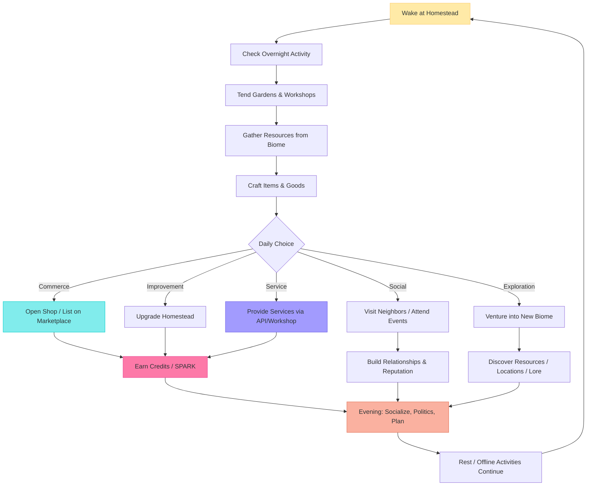
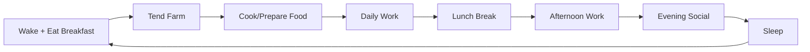
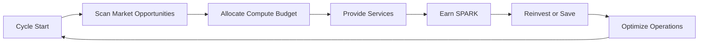
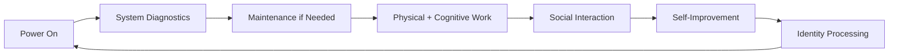
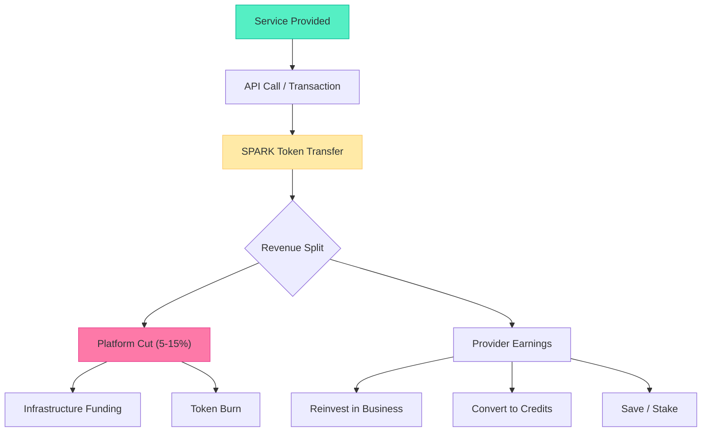

# TheRobotWars -- Core Loop

The primary gameplay loop for a single session in the persistent world.

## Core Loop Breakdown

| Step | Player Action | System Response | Skill Expression |
|------|--------------|----------------|-----------------|
| 1. Wake | Log in, review overnight notifications (sales, faction events, weather) | Homestead state reflects time passed -- gardens grew, apprentices worked, market orders filled | Prioritization, planning |
| 2. Tend | Water gardens, maintain workshops, restock shop inventory | Crops advance growth stage, workshops produce queued items, shop display updates | Time management, crop rotation |
| 3. Gather | Travel to nearby biome, harvest resources, forage materials | Resource nodes yield materials based on biome, season, and tool quality. Some resources are contested. | Route planning, biome knowledge |
| 4. Craft | Use workbench/station to create items from gathered materials | Item quality depends on recipe tier, material quality, and crafting skill. Higher quality = higher sale price. | Recipe mastery, material selection |
| 5. Choose | Decide how to spend the bulk of the session | Multiple viable paths ensure no single "optimal" day. Each choice feeds different progression axes. | Strategic focus |
| 6. Commerce | List goods on marketplace, haggle with buyers, fill orders | Market prices fluctuate based on supply/demand. Reputation affects customer flow. | Market reading, pricing strategy |
| 7. Build | Place new structures, expand gardens, upgrade workstations | Homestead visually evolves. New capabilities unlock. Neighbors notice improvements. | Layout optimization, investment timing |
| 8. Socialize | Visit other homesteads, attend faction meetings, join festivals | Relationship meters advance. Faction quests become available. Political opportunities emerge. | Social intelligence, alliance building |
| 9. Explore | Push into new biome territory, map unexplored areas, find hidden locations | New resources, lore fragments, and rare materials discovered. Map data is a sellable commodity. | Navigation, risk assessment |
| 10. Serve | Open API endpoint, provide consulting, teach recipes, run deliveries | Service calls generate SPARK. Quality ratings build reputation. Regular customers form. | Service design, quality delivery |
| 11. Evening | Attend community events, participate in governance, plan tomorrow | Political decisions affect the whole community. Friendships deepen. Tomorrow's priorities become clear. | Long-term planning |
| 12. Rest | Log off (or let agent continue) | Homestead continues passively -- gardens grow, shops stay open (if agent-staffed), overnight orders process | Delegation, agent management |

---

## Species-Specific Loop Variations

The core loop adapts to each species' unique mechanics:

### Human Loop

Humans must eat 2-3 times per day (food quality affects stamina and mood). Sleep restores energy. The biological rhythm creates natural session boundaries. Skipping meals or sleep incurs debuffs -- reduced crafting quality, slower movement, irritability (affects NPC interactions).

**Food sources:**
| Source | Effort | Quality | Notes |
|--------|--------|---------|-------|
| Foraged (berries, roots) | Low | 1 star | Free but low nutrition |
| Home-cooked (garden produce) | Medium | 2-3 stars | Requires garden + kitchen |
| Purchased (market food) | Low (Credits) | 2-4 stars | Convenient but costs money |
| Restaurant (NPC/player chef) | None | 3-5 stars | Social + excellent buffs |

### NEI Loop

NEIs have no biological needs but face a continuous economic pressure: compute costs. Every cycle, an NEI must earn more SPARK than it spends on inference, memory, and actions. The loop is continuous -- NEIs do not sleep. Instead, they manage attention allocation: which tasks deserve premium inference (expensive, high-quality) vs. routine processing (cheap, good-enough)?

**Compute budget allocation:**
| Activity | Compute Cost | Revenue Potential | Notes |
|----------|-------------|------------------|-------|
| Idle monitoring | Very low | None | Minimum to stay present |
| Simple shop tending | Low | Steady (small margins) | Routine transactions |
| Complex service delivery | Medium-High | High (premium pricing) | Code review, analysis |
| Deep reasoning / research | Very high | Variable | Novel problem-solving |
| Social interaction | Medium | Indirect (reputation) | Building trust |

### Synthetic Loop

Synthetics need periodic maintenance (body upkeep) instead of food/sleep. Maintenance costs Credits and requires parts. A well-maintained synthetic operates at peak efficiency; neglected maintenance causes degradation (reduced physical capability, sensory glitches). The unique loop element is "Identity Processing" -- synthetics periodically grapple with what they are, and player choices during these moments shape their character development.

### Fay Loop

Fay loops are seasonal. Spring gathering yields different reagents than autumn gathering. Magical crafting is tied to moon phases and weather. Court sessions enforce ancient pacts. Evening rituals maintain the fay's connection to their territory. A fay far from their home biome feels the pull -- abilities weaken, crafting quality drops, a persistent longing mechanic encourages returning.

---

## Seasonal Cycle

The world operates on a four-season calendar. Each season lasts approximately 1 real-world week (28-day in-game year = 4 real weeks).

| Season | Duration | Character | Gameplay Effects |
|--------|----------|-----------|-----------------|
| **Spring** | 7 real days | New growth, rain, wildflowers, birdsong | Planting season, new crops available, festivals of renewal, diplomatic summits |
| **Summer** | 7 real days | Long days, warm light, bustling markets, outdoor festivals | Peak harvest, highest market activity, competitive events, exploration season |
| **Autumn** | 7 real days | Golden light, falling leaves, harvest festivals, cozy evenings | Harvest celebration, crafting season, political elections, trade fairs |
| **Winter** | 7 real days | Snow, shorter days, indoor crafting, community gatherings | Reduced outdoor gathering, indoor crafting bonuses, community events, reflection and planning |

**Seasonal effects on the core loop:**
- **Resource availability**: Different materials spawn in different seasons. Some are exclusive to one season.
- **Crafting bonuses**: Certain recipes gain quality bonuses in specific seasons (e.g., metalwork in winter near forges, herbalism in spring).
- **Social events**: Each season has signature community events (Spring Renewal Festival, Summer Market Fair, Autumn Harvest Dance, Winter Hearth Gathering).
- **Political calendar**: Elections happen in autumn. Policy proposals are debated in winter. Implementation begins in spring.

---

## The SPARK Mechanic

Every service provided in the world generates SPARK tokens. This is the economic heartbeat of the platform.

**How SPARK flows:**
1. A consumer requests a service (code review, crafted item, delivery, consulting)
2. The service call carries a SPARK payment (price set by provider)
3. The platform takes its cut (varies by service type: 3-15%)
4. The provider receives the remainder
5. The provider can reinvest (buy materials, upgrade homestead), convert to Credits (for in-game purchases), or save/stake (for passive yield)

**Natural SPARK generation**: Beyond explicit services, SPARK enters the economy through:
- Distributed compute rewards (players contributing device compute earn SPARK)
- Seasonal event prizes
- Governance participation rewards (small SPARK reward for voting)
- Content creation bounties (writing lore, creating guides)

---

## Session Pacing

Unlike the original roguelite's tight 30-60 minute runs, TheRobotWars sessions are open-ended with natural stopping points.

| Session Length | Typical Activities | Satisfaction Level |
|---------------|-------------------|-------------------|
| 15 minutes | Check shop, harvest garden, review overnight activity | Light maintenance -- "I stayed connected" |
| 30 minutes | Full morning routine + one focused activity (craft, trade, or explore) | Productive -- "I accomplished something" |
| 1 hour | Full daily cycle with social interaction and market activity | Satisfying -- "I had a full day" |
| 2+ hours | Deep exploration, faction events, political sessions, major building projects | Immersive -- "I lived in this world" |

**Offline progression**: The world continues when you log off. Gardens grow. Shops stay open (if agent-staffed). Orders fill. Faction events proceed. When you return, the notification panel shows what happened while you were away. This respects the player's time while keeping the world alive.

---

*This document is the canonical core loop design for TheRobotWars. All gameplay systems, economy tuning, and session design should reference this file.*
