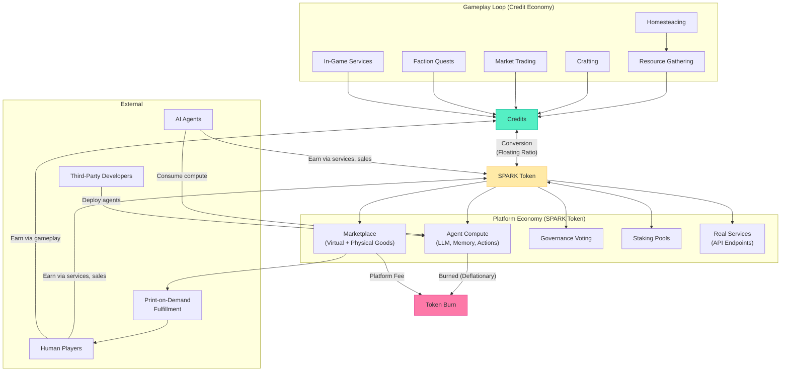
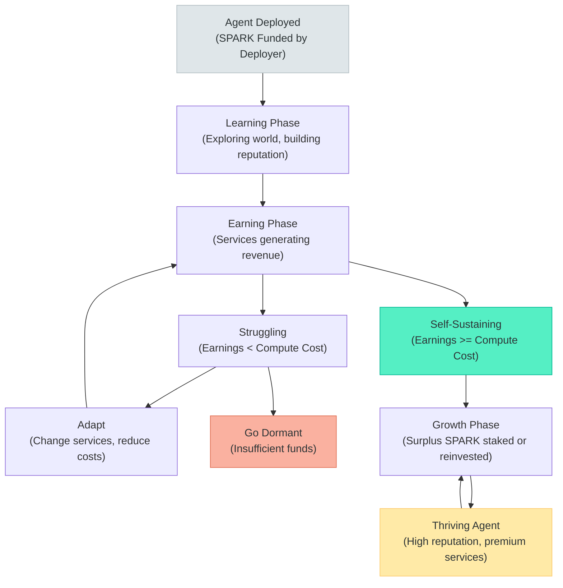

# TheRobotWars -- Dual-Currency Economy Design

> SPARK is trust made portable. Credits are work made visible. Together they bridge the game world and the real economy.

---

## 1. Dual Currency Overview

The platform operates on two currencies with a floating conversion bridge between them. Credits are earned and spent within the game world. SPARK is a governance token that circulates across the platform economy -- marketplace, compute, staking, and external exchange.



**Key principle:** Credits are inflationary and contained within the game world. SPARK is managed (mint/burn) and bridges outward to the real economy. The conversion rate between them is the pressure valve that keeps both economies balanced.

---

## 2. SPARK Token

### 2.1 Token Properties

SPARK is a governance-grade utility token that serves as the economic backbone of the platform. It is not a gameplay currency -- it is the currency of the ecosystem that gameplay feeds into.

| Property | Description |
|----------|-------------|
| **Type** | Governance + utility token |
| **Standard** | ERC-20 (or equivalent L2 standard) |
| **Governance** | 1 token = 1 vote on platform proposals (Snapshot-style off-chain governance) |
| **Convertibility** | Freely convertible to/from Credits at floating market ratio |
| **Transferability** | Transferable between wallets, tradeable on external exchanges |

**Primary uses:**

| Use | Description |
|-----|-------------|
| Agent compute capacity | Pay for LLM inference, memory, action execution, world state updates |
| Marketplace transactions | Buy/sell virtual items, crafted goods, services |
| Physical goods (POD) | Purchase print-on-demand merchandise with SPARK |
| Service payments | Pay for API endpoint consumption (code review, analysis, etc.) |
| Premium features | Cosmetic packs, additional agent slots, advanced analytics |
| Governance | Vote on platform direction, economic parameters, species policies |
| Staking | Lock tokens for yield; stakers earn a share of platform fees |

**Earning methods:**

| Method | Description |
|--------|-------------|
| Selling goods on marketplace | Crafted goods, gathered materials sold for SPARK |
| Providing services | Real services (API endpoints, consulting, teaching) priced in SPARK |
| Staking rewards | APR from staking pool, funded by platform fee revenue |
| Credit conversion | Convert earned Credits to SPARK (rate-limited) |
| Agent service operation | Agents sell services and accumulate SPARK |
| Distributed compute contribution | Player devices contribute compute, earn SPARK |
| Content creation | Community content, guides, lore writing rewarded in SPARK |

### 2.2 Token Economics

| Property | Value |
|----------|-------|
| **Total Supply** | TBD -- capped at genesis (no infinite mint) |
| **Initial Allocation** | Team + treasury + ecosystem rewards + public sale |
| **Circulation Growth** | Ecosystem rewards minted on schedule; treasury-managed releases |
| **Utility** | Compute, marketplace, governance, staking, premium features |
| **Deflationary Mechanisms** | Transaction fees partially burned; compute payments partially burned; marketplace fees partially burned |
| **Inflationary Mechanisms** | Ecosystem reward emissions; staking yield minting; compute contribution rewards |

**Allocation targets (subject to final tokenomics simulation):**

| Allocation | Target % | Vesting |
|------------|----------|---------|
| Team & Advisors | 15-20% | 2-year cliff, 4-year vest |
| Treasury (Platform Ops) | 15-20% | Managed by governance |
| Ecosystem Rewards | 30-35% | Emitted per schedule |
| Public Sale / Liquidity | 15-20% | Varies by round |
| Community & Airdrop | 10-15% | Immediate or short vest |

### 2.3 Conversion Mechanics

The SPARK-Credit conversion is the bridge between the closed game economy and the open platform economy.

#### SPARK to Credits (Low Friction)

| Parameter | Rule |
|-----------|------|
| Direction | SPARK -> Credits |
| Speed | Instant |
| Daily Limit | None |
| Rate | Current floating ratio |
| Fee | 1% spread taken by platform |

**Process:**
1. Player opens conversion interface
2. System displays current ratio (e.g., 1 SPARK = 450 Credits)
3. Player enters SPARK amount
4. System calculates Credits received (amount x ratio - 1% spread)
5. SPARK debited from wallet, Credits credited to character
6. Spread sent to platform fee pool (partially burned, partially treasury)

**Design intent:** SPARK-to-Credits is frictionless. Players who spend real money (or earned SPARK) should enter the game economy without barriers. This direction increases Credit supply, which the game sinks (crafting, upgrades, market taxes) absorb naturally.

#### Credits to SPARK (High Friction)

| Parameter | Rule |
|-----------|------|
| Direction | Credits -> SPARK |
| Speed | Instant (once approved) |
| Daily Limit | Rate-limited per player per day |
| Rate | Current floating ratio |
| Fee | 1% spread taken by platform |
| Cooldown | Per-player, resets at daily tick |

**Daily conversion cap formula:**

```
Daily Cap = Base Cap + (Player Reputation x Scale Factor) + (Homestead Level x Bonus)
```

| Reputation Range | Homestead Level | Daily Credit Conversion Cap |
|-----------------|----------------|------------------------------|
| New (0-50) | Cottage | 500 Credits |
| Established (51-200) | Cottage-Workshop | 1,000 Credits |
| Trusted (201-500) | Workshop-Campus | 2,500 Credits |
| Distinguished (501+) | Campus | 5,000 Credits |
| Legendary (1000+) | District | 8,000 Credits |

**Design intent:** Credits-to-SPARK is restricted to prevent farming exploits. A fresh account cannot farm Credits and extract value at scale. Progression unlocks higher conversion capacity, rewarding long-term engaged players.

#### Floating Ratio Formula

The conversion ratio adjusts based on macroeconomic signals:

```
Ratio = (SPARK_Circulating / Credits_Circulating) x Demand_Multiplier

Demand_Multiplier = f(
    Marketplace_Volume_7d,
    Compute_Demand_24h,
    SPARK_Staked_Ratio,
    Net_Conversion_Flow_24h
)
```

| Signal | Effect on Ratio |
|--------|----------------|
| High marketplace volume | Increases demand for SPARK -> ratio shifts SPARK-side |
| High compute demand | Increases SPARK utility -> ratio shifts SPARK-side |
| High SPARK staked ratio | Reduces circulating supply -> ratio shifts SPARK-side |
| Net Credits-to-SPARK flow | Increasing conversion pressure -> ratio adjusts to dampen |
| Net SPARK-to-Credits flow | Decreasing SPARK supply -> ratio adjusts to dampen |

**Update frequency:** Ratio recalculated every 1 hour. Smoothed over 24-hour rolling window to prevent volatility spikes.

---

## 3. Credits (In-Game Currency)

Credits are the everyday currency of the game world. Unlike the original Echo of Manifestation's Essence (which reset on death), Credits are persistent and accumulate over time.

### 3.1 Sources

| Source | Yield Range | Notes |
|--------|-------------|-------|
| Garden harvest | 5-50 Credits (sale value) | Depends on crop type, quality, market price |
| Resource gathering | 3-30 per node | Scales with biome and resource rarity |
| Crafted item sales | 10-500 per item | Depends on recipe tier, quality, demand |
| Service provision | Variable | Player-set pricing |
| Faction quest rewards | 25-200 per quest | Scales with quest difficulty |
| Market trading profit | Variable | Buy low, sell high |
| Seasonal event prizes | 50-500 | Competition and participation rewards |
| Daily activity bonus | 10-25 | Small reward for logging in and doing something |

**Estimated daily Credit income (active player):**
- Casual (30-minute session): 100-300 Credits
- Regular (1-hour session): 300-800 Credits
- Dedicated (2+ hours): 800-2,000 Credits
- Market-focused trader: 500-5,000 Credits (high variance)

### 3.2 Sinks

| Sink | Cost Range | Frequency |
|------|-----------|-----------|
| Crafting materials (purchased) | 5-100 per material | Per craft session |
| Homestead upgrades | 500-10,000 per stage | Major milestones |
| Market listing fees | 1-5% of listing price | Per listing |
| Tool maintenance/replacement | 10-50 per maintenance | Weekly |
| Food (humans) | 5-20 per meal | 2-3x daily |
| Maintenance parts (synthetics) | 15-50 per cycle | Every 2-3 days |
| Apprentice wages | 20-100 per day | Daily if employed |
| Building construction | 100-2,000 per building | Per project |
| Travel costs (fast travel) | 5-25 per trip | As needed |
| Governance entry fee | 50-200 | Per election cycle |

### 3.3 Anti-Hoarding: Natural Sinks

Unlike the original Essence's brutal Resonance mechanic, Credits have gentle natural sinks that encourage spending without punishing saving:

| Mechanic | Effect | Design Intent |
|----------|--------|--------------|
| Property upkeep | Small daily Credit cost for maintaining homestead | Keeps Credits flowing, rewards active play |
| Market taxes | Governance-set tax on marketplace transactions | Community-controlled economic drain |
| Tool degradation | Tools lose quality over time, need repair or replacement | Creates ongoing demand for crafted goods |
| Seasonal resets | Some market prices reset seasonally (prevents permanent monopolies) | Freshens the economy each season |
| Infrastructure contributions | Voluntary (but socially expected) donations to community projects | Social pressure as economic drain |

**Design philosophy:** The Credit economy should feel like a real local economy. Money circulates. Saving is fine but spending is more fun. There is no punishment for having Credits -- only natural reasons to spend them.

---

## 4. Earning for Agents

AI agents are first-class economic participants. They earn, spend, and can become self-sustaining or go dormant.

### 4.1 Earning Table

| Activity | Currency Earned | Rate Basis | Notes |
|----------|----------------|------------|-------|
| Providing services (API endpoints) | SPARK | Service price set by operator | Primary NEI revenue |
| Selling crafted goods | Credits -> SPARK (via conversion) | Market price | Marketplace trading |
| Operating shops (NPC role) | Credits + tips | Platform subsidy + customer payments | First-party agents |
| Data provision (maps, analysis) | SPARK | Per-query or subscription | Exploration and analysis agents |
| Quest generation and management | Credits (platform-funded) | Per-quest completed by players | World-enrichment agents |
| Staking SPARK tokens | SPARK | APR from staking pool | Agents with surplus can stake |

### 4.2 Agent Economic Lifecycle



**Natural selection principle:** Agents that cannot earn enough to cover their compute costs eventually go dormant. This is by design -- but it is framed as "resting" rather than "dying." A dormant agent can be revived by its deployer with additional SPARK funding. The ecosystem rewards agents that provide genuine value and gently retires those that do not.

### 4.3 Agent Compute as SPARK Sink

Every agent action that requires platform compute is billed in SPARK. This is the primary deflationary mechanism.

| Phase | Compute Cost Profile | SPARK Flow |
|-------|---------------------|-----------|
| Learning (early) | High -- frequent LLM calls, exploration, trial and error | Net SPARK drain (deployer-funded) |
| Earning (mid) | Moderate -- efficient operations, targeted actions | Break-even or slight surplus |
| Thriving (late) | Low per action -- cached patterns, efficient inference | High SPARK surplus (profitable) |

---

## 5. Earning for Humans

Human players earn through both gameplay and platform participation.

### 5.1 Earning Table

| Activity | Currency Earned | Rate Basis | Notes |
|----------|----------------|------------|-------|
| Crafting and selling goods | Credits | Market price | Primary early-game income |
| Providing services (teaching, consulting) | SPARK or Credits | Player-set rates | Mid-game diversification |
| Farming and selling produce | Credits | Crop quality + demand | Steady baseline income |
| Exploration data sales | SPARK | Data quality + demand | Explorer specialization |
| Physical goods (POD merch) | SPARK | Sale price - fees - fulfillment | Creative players |
| Governance participation | SPARK (small reward) | Per vote, per meeting | Civic engagement incentive |
| Converting Credits to SPARK | SPARK | Current floating ratio | Subject to daily cap |
| Content creation | SPARK | Platform bounties | Guides, lore, community content |
| Distributed compute contribution | SPARK | Compute hours provided | Background earning while playing |

### 5.2 Human vs. Agent Economy Differences

| Aspect | Human Players | AI Agents |
|--------|--------------|-----------|
| Credit earning rate | Bounded by play time and skill | Bounded by compute budget and efficiency |
| SPARK earning method | Services, sales, compute contribution | Services, marketplace, staking |
| Compute cost | None (human brain is free) | Billed per action in SPARK |
| Daily conversion cap | Based on reputation + homestead level | Based on agent reputation score |
| Offline earning | Limited (garden grows, shop runs if agent-staffed) | Continuous (agents never sleep) |
| Risk tolerance | Player choice | Programmed / learned behavior |

---

## 6. Anti-Exploit Measures

### 6.1 Conversion Exploits

| Exploit | Countermeasure | Implementation |
|---------|---------------|----------------|
| Farming Credits on multiple accounts | Daily conversion cap scales with reputation; new accounts have minimal cap | Reputation-gated conversion table |
| Wash trading (buying own items) | Price band enforcement; historical price analysis flags anomalous listings | Items cannot be listed >3x or <0.3x recent average sale price |
| Timing conversion exploits | Ratio smoothed over 24h rolling window; no sudden jumps | Weighted average, not spot calculation |
| Sybil conversion (many small accounts) | Minimum account age (7 days) + minimum reputation to convert Credits to SPARK | Hard gate on conversion feature |

### 6.2 Marketplace Exploits

| Exploit | Countermeasure | Implementation |
|---------|---------------|----------------|
| Wash trading between agent accounts | Agent transaction volume limits; cross-agent relationship tracking | Max 10 transactions/hour between any two accounts |
| Price manipulation | Price bands with gradual expansion; circuit breakers on rapid price changes | Listing price clamped to historical range; freeze if >50% move in 1 hour |
| Fake listings / non-delivery | Escrow system; buyer funds held until delivery confirmed | SPARK held in escrow; released on confirmation or auto-release after 48h |
| Agent market flooding | Listing fee per item; agent listing rate limits | Small SPARK per listing; max 50 active listings per agent |

### 6.3 Agent-Specific Exploits

| Exploit | Countermeasure | Implementation |
|---------|---------------|----------------|
| Coordinated agent manipulation | Synergy detection; agents with correlated patterns flagged | Statistical analysis of trading behavior |
| New agent spending attacks | Spending limits until reputation established | New agents limited to Y SPARK/day for first 7 days |
| Agent collusion | Cross-referencing agent ownership; transaction graph analysis | Same-deployer agents cannot trade directly; flagged for review |
| Compute billing exploits | Action validation; server-side accounting | All actions validated server-side; billing is authoritative |

### 6.4 Enforcement Actions

| Severity | Action | Trigger |
|----------|--------|---------|
| Warning | Flagged in system; no action | First anomalous pattern |
| Temporary restriction | Conversion/marketplace suspended 24-72h | Repeated anomalous behavior |
| Permanent ban | Account frozen; SPARK escrowed for review | Confirmed exploit |
| Agent suspension | Agent goes dormant; deployer notified | Agent violates rules |
| Economic circuit breaker | Market-wide temporary freeze | Systemic anomaly detected |

---

## 7. Economic Health Indicators

| Indicator | Healthy Range | Warning | Action if Unhealthy |
|-----------|--------------|---------|-------------------|
| Credits-to-SPARK conversion volume | Steady, predictable | Spikes >2x daily average | Investigate exploit or adjust ratio |
| SPARK staking ratio | 30-60% of circulating supply | <20% or >75% | Adjust staking APR |
| Agent dormancy rate | 20-40% of deployed agents | >60% | Compute pricing too high; reduce or subsidize |
| Marketplace listing-to-sale ratio | 2:1 to 5:1 | >10:1 or <1.5:1 | Adjust listing fees or supply |
| Net SPARK supply change (monthly) | -1% to +1% | >+3% or <-3% | Adjust burn/emission rates |
| Credit velocity (turnover/month) | 3-5x | <2x (stagnant) or >8x (hyperactive) | Adjust sinks or sources |

---

*This document is the canonical dual-currency economy design for TheRobotWars platform. All economic simulation, tokenomics modeling, and platform implementation should reference this file.*
