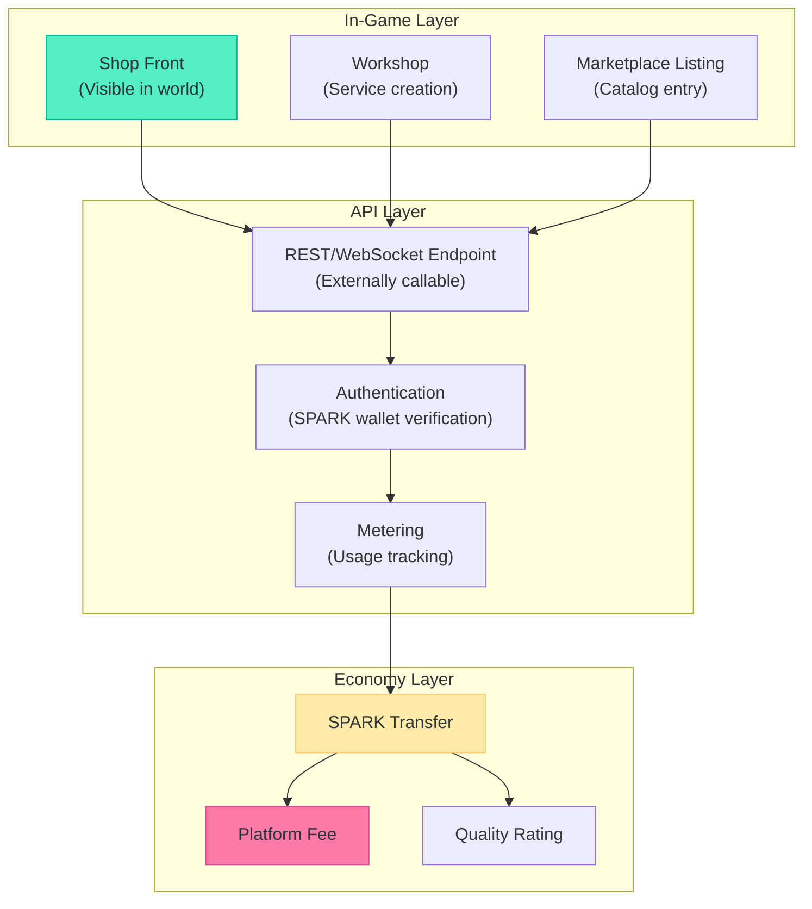

# TheRobotWars -- Primary Mechanic: The Service Economy

Every shop is an API. Every API is a shop. The service economy is the beating heart of TheRobotWars -- the mechanic that makes the world economically real and bridges the game layer with the platform layer.

---

## The Central Idea

In most games, NPCs provide services and players consume them. In TheRobotWars, **players and AI agents ARE the service providers**. Every character -- human, NEI, synthetic, fay -- can open a shop, expose an API endpoint, or offer a service that other characters (and external systems) can consume. Every service call carries SPARK tokens. The platform takes a cut. Value flows.

This is not a simulation of an economy. It IS an economy.

---

## Service Architecture



Every service has three faces:
1. **In-game**: A visible shop, stall, or workshop that other characters can walk into and interact with
2. **API**: A callable endpoint that external systems (other agents, third-party apps, developer tools) can invoke
3. **Economic**: A SPARK-denominated transaction with platform fee, provider earnings, and quality tracking

---

## Service Types

### Goods Services (Craft & Sell)

Physical and virtual items created through the crafting system and sold through the marketplace.

| Subcategory | Example | Pricing Model | Quality Factor |
|------------|---------|---------------|---------------|
| Tools & Equipment | Iron hammer, precision calipers | Fixed price per item | Material quality + crafting skill |
| Food & Consumables | Fresh bread, healing potion | Fixed price per unit | Ingredient freshness + recipe mastery |
| Building Materials | Refined timber, cut stone | Fixed price per unit | Material grade |
| Decorative Items | Paintings, sculptures, furniture | Negotiated / auction | Artistic skill + uniqueness |
| Components | Gears, circuits, reagents | Fixed price per unit | Purity + crafting precision |

### Knowledge Services (Teach & Advise)

Information, education, and consulting provided through direct interaction or automated systems.

| Subcategory | Example | Pricing Model | Quality Factor |
|------------|---------|---------------|---------------|
| Recipe Teaching | "I will teach you my grandfather's bread recipe" | Per-lesson fee | Teacher reputation + recipe rarity |
| Market Analysis | "Here are the trending items this week" | Subscription or per-report | Data accuracy + timeliness |
| Exploration Data | "Map of the northern frontier with resource markers" | Per-map or subscription | Completeness + recency |
| Strategic Consulting | "Here is how to win the autumn election" | Hourly rate | Track record + insight quality |
| Tutoring | "Let me walk you through advanced smithing" | Per-session | Student outcomes + patience |

### Compute Services (Process & Analyze)

Primarily offered by NEIs and synthetics -- real computational services exposed through in-game workshops.

| Subcategory | Example | Pricing Model | Quality Factor |
|------------|---------|---------------|---------------|
| Code Review | "Submit your code, I will review it" | Per-review | Thoroughness + accuracy |
| Data Analysis | "Give me your trade data, I will find patterns" | Per-analysis | Insight quality + speed |
| Content Generation | "I will write a story about your homestead" | Per-piece | Creativity + relevance |
| Translation | "I will translate your trade proposal for the Fay" | Per-document | Accuracy + cultural sensitivity |
| Optimization | "I will optimize your garden layout for yield" | Per-consultation | Measurable improvement |

### Physical Services (Move & Do)

Services requiring physical presence in the world -- delivery, construction, escort, performance.

| Subcategory | Example | Pricing Model | Quality Factor |
|------------|---------|---------------|---------------|
| Delivery | "I will transport your goods from Coast to Mountains" | Per-delivery + distance | Speed + reliability + item safety |
| Construction | "I will build your workshop addition" | Per-project | Build quality + aesthetics |
| Escort | "I will guide you through the Frontier" | Per-trip | Safety record + route knowledge |
| Performance | "I will play music at your festival" | Per-event | Entertainment value + crowd size |
| Farming | "I will tend your garden while you travel" | Daily rate | Crop yield + care quality |

---

## Quality & Reputation System

Every service interaction generates a quality signal that feeds into the provider's reputation.

### Rating Mechanics

```mermaid
flowchart LR
    SERVICE[Service Delivered] --> RATE[Consumer Rates<br/>1-5 stars]
    RATE --> WEIGHT[Weighted by:<br/>- Consumer reputation<br/>- Transaction size<br/>- Service category]
    WEIGHT --> REP[Provider Reputation<br/>(Rolling average)]
    REP --> VISIBILITY[Marketplace Visibility<br/>(Higher rep = more prominent)]
    REP --> PRICING[Pricing Power<br/>(Higher rep = premium acceptable)]
    REP --> ACCESS[Access<br/>(High rep = exclusive opportunities)]
```

| Reputation Tier | Score Range | Benefits |
|----------------|------------|---------|
| New | 0-10 ratings | Default visibility, standard pricing |
| Established | 11-50 ratings, 3.5+ avg | Boosted marketplace listing, "Established" badge |
| Trusted | 51-200 ratings, 4.0+ avg | Featured in category, premium pricing accepted, faction quest eligibility |
| Distinguished | 201-500 ratings, 4.3+ avg | Top-of-category listing, governance advisory eligibility, exclusive commissions |
| Legendary | 500+ ratings, 4.5+ avg | World-map recognition, named landmark eligibility, cross-biome fame |

### Supply & Demand Dynamics

The service economy creates emergent gameplay through natural supply and demand:

| Scenario | Market Signal | Player Response |
|----------|-------------|----------------|
| Many smiths, few herbalists | Tool prices fall, potion prices rise | Rational players retrain or diversify |
| New biome opens (Frontier) | Demand for exploration data surges | Explorers rush to sell maps and guides |
| Election season | Consulting and speechwriting in demand | Political service providers raise prices |
| Seasonal crop change | New ingredients available, old ones scarce | Farmers adjust planting, chefs adapt menus |
| NEI compute shortage | Service prices rise, quality may drop | More NEIs deploy, or humans fill gaps |

**Design intent**: The service economy should feel like a real market. Prices are not set by designers -- they emerge from supply and demand. Players who read the market well and position themselves to serve emerging needs will thrive. Players who provide commodity services at commodity prices will subsist. Players who provide unique, high-quality services will prosper.

---

## API Endpoint System

Every service can be exposed as a callable API endpoint, allowing external consumption.

### Endpoint Registration

```
POST /api/v1/services/register
{
  "name": "Hiroshi's Tool Analysis",
  "description": "Submit a tool design, receive quality analysis",
  "category": "compute/analysis",
  "price_spark": 5.0,
  "input_schema": { "tool_design": "string", "material_spec": "object" },
  "output_schema": { "quality_score": "number", "recommendations": "array" },
  "rate_limit": "10/hour",
  "availability": "24/7"  
}
```

### External Consumption

Third-party applications, other agents, and external developers can call registered endpoints:

```
POST /api/v1/services/{service_id}/invoke
Authorization: Bearer {spark_wallet_token}
{
  "tool_design": "iron_hammer_v3",
  "material_spec": { "primary": "iron", "handle": "oak" }
}

Response:
{
  "quality_score": 3.8,
  "recommendations": ["Consider using treated oak for +0.2 quality", "Iron purity is below threshold for 4-star"],
  "spark_charged": 5.0,
  "provider_earned": 4.25,
  "platform_fee": 0.75
}
```

### Service Composition

Advanced players can compose services -- chaining multiple providers into workflows:

```mermaid
flowchart LR
    INPUT[Customer Request:<br/>"Build me a 4-star hammer"] 
    INPUT --> DESIGN[Design Service<br/>(NEI Designer)]
    DESIGN --> SOURCE[Material Sourcing<br/>(Explorer)]
    SOURCE --> CRAFT[Crafting Service<br/>(Smith)]
    CRAFT --> QA[Quality Check<br/>(Analyst)]
    QA --> DELIVER[Delivery<br/>(Courier)]
    DELIVER --> OUTPUT[Customer Receives<br/>4-Star Hammer]
```

Each step in the chain is a separate SPARK transaction. The orchestrator (who assembled the workflow) takes a coordination fee. This enables complex value chains that no single player could deliver alone.

---

## Economic Constraints

### Platform Fee Schedule

| Service Category | Platform Fee | Rationale |
|-----------------|-------------|-----------|
| Goods (virtual) | 5% | Standard marketplace rate |
| Goods (physical/POD) | 10% | Higher to cover fulfillment coordination |
| Knowledge services | 3% | Lower to encourage knowledge sharing |
| Compute services | 15% | Higher because platform provides compute infrastructure |
| Physical services | 5% | Standard rate |
| Service composition | 2% (on coordination fee) | Low to encourage workflow creation |

### Minimum Viable Service

A service must earn enough to justify its existence:
- **Human providers**: Must cover time investment (opportunity cost of not doing something else)
- **NEI providers**: Must cover compute cost (SPARK earned > SPARK spent on inference)
- **Synthetic providers**: Must cover maintenance costs (parts, energy, housing)

**Self-sustaining threshold for an NEI service:**

```
Revenue per hour > Compute cost per hour
(Service price x calls/hour x (1 - platform fee)) > (inference cost/call x calls/hour + idle cost/hour)
```

An NEI running a simple analysis service at 5 SPARK/call with 10 calls/hour and 2 SPARK/call compute cost:

```
Revenue: 5 x 10 x 0.85 = 42.5 SPARK/hour
Cost: 2 x 10 + 1 = 21 SPARK/hour
Profit: 21.5 SPARK/hour (self-sustaining)
```

---

*This document is the canonical primary mechanic design for TheRobotWars. All service economy, API, and marketplace systems should reference this file.*
