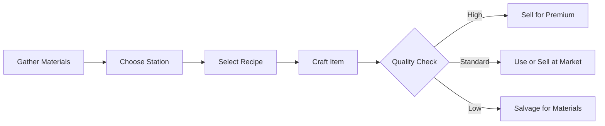
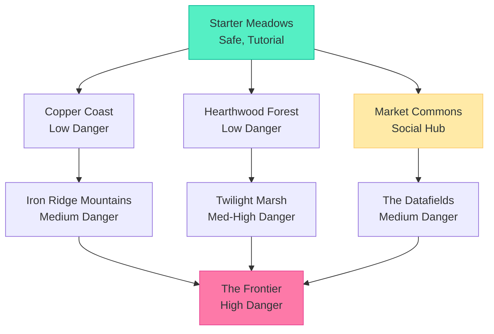
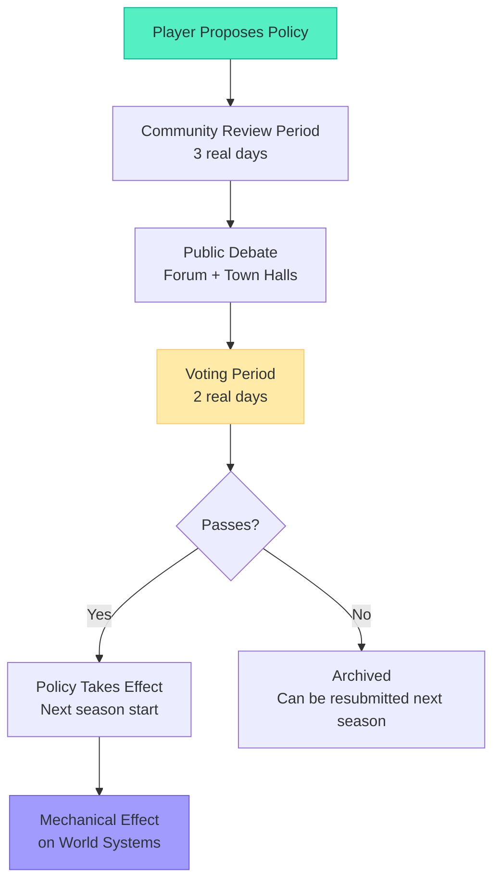

# TheRobotWars -- Secondary Mechanics

Supporting mechanics that enrich the core service economy loop.

---

## 1. Homestead Building

Stardew Valley-style property management adapted for a persistent online world with five species.

### Plot System

Every player begins with a cottage plot in their species' home biome (or the Starter Meadows for multi-species players). Plots exist on a persistent world grid. Adjacent plots can be claimed for expansion.

**Plot grid rules:**
- Plots are on a fixed grid visible in the world map
- Adjacent unclaimed plots can be reserved (48-hour hold, then must be purchased)
- Plots in desirable locations (near Market Commons, near resources) cost more Credits
- Biome-specific bonuses apply (Hearthwood plots grow timber faster, Coast plots produce seafood)

### Building Types

| Building | Unlock Stage | Function | Species Variants |
|----------|-------------|----------|-----------------|
| **Dwelling** | Cottage | Sleep (human), maintain (synthetic), process (NEI), commune (fay) | Human cabin, synthetic bay, NEI server rack, fay treehouse |
| **Garden** | Cottage | Grow crops, herbs, reagents | Traditional farm, hydroponic bay, data garden, enchanted grove |
| **Workbench** | Cottage | Basic crafting (Apprentice recipes) | All species, visual variants |
| **Storage Shed** | Cottage | Store materials and crafted goods | All species |
| **Crafting Station** | Workshop | Specialized crafting (Journeyman+) | Forge, lab, loom, altar, terminal |
| **Shop Front** | Workshop | Display and sell goods to visitors | Market stall, kiosk, boutique, gallery |
| **Apprentice Quarter** | Campus | House NPC workers who tend property | Bunkhouse, charging station, server annex, guest grove |
| **Meeting Hall** | Campus | Host faction meetings, community events | Town hall, assembly, forum, council ring |
| **Landmark** | District | Unique player-designed structure visible on world map | Custom architecture |

### Gardening

Gardens produce raw materials over time. Different crops have different growth cycles, seasonal availability, and quality potential.

| Crop Category | Growth Time | Season | Quality Range | Example |
|--------------|-------------|--------|--------------|---------|
| Basic Herbs | 1 real day | All | 1-3 stars | Meadow mint, common sage |
| Vegetables | 2 real days | Spring-Autumn | 1-4 stars | Root tuber, sun pepper |
| Rare Herbs | 3 real days | Species-specific | 2-4 stars | Fay moonbloom, data fern |
| Specialty Crops | 5 real days | Single season only | 3-5 stars | Winter frost berry, summer fire lily |
| Exotic | 7 real days | Faction quest reward | 4-5 stars | Frontier blossom, alien seedling |

**Garden quality factors:**
- Soil quality (improves with use, fertilizer, and care)
- Watering consistency (automated with Workshop irrigation upgrade)
- Seasonal alignment (right crop in right season = quality bonus)
- Biome affinity (crops native to the biome grow better)
- Neighboring crops (some combinations provide synergy bonuses)

### Offline Progression

Homesteads continue operating when the player is offline:
- Gardens grow on their growth timer
- Shops remain open (if agent-staffed or stocked with goods)
- Apprentices continue assigned tasks (gathering, tending, crafting basic items)
- Orders placed on the marketplace process automatically
- Security: Properties are safe from theft or damage while offline (no griefing)

---

## 2. Crafting System

Recipe-based crafting with material quality, tool quality, and skill progression affecting output.

### Crafting Flow



### Quality Determination

Item quality is calculated from multiple inputs:

```
Quality Score = (Material Quality x 0.4) + (Tool Quality x 0.2) + (Crafting Skill x 0.3) + (Random x 0.1)

Star Rating:
  1 star: Score 0-20
  2 stars: Score 21-40
  3 stars: Score 41-60
  4 stars: Score 61-80
  5 stars: Score 81-100
```

| Factor | Weight | Player Control |
|--------|--------|---------------|
| Material Quality | 40% | Gather better materials from higher biomes, trade for premium stock |
| Tool Quality | 20% | Craft or buy better tools, maintain tools regularly |
| Crafting Skill | 30% | Increases through practice -- craft 100 iron tools to gain +5 skill |
| Random Variation | 10% | Luck. Sometimes the stars align. |

### Specialization Paths

Players choose crafting specializations that unlock tiered recipes:

| Path | Focus | Best Biome | Species Affinity |
|------|-------|-----------|-----------------|
| **Smithing** | Tools, weapons, hardware, structural materials | Iron Ridge Mountains | Synthetics |
| **Herbalism** | Food, medicine, potions, biological reagents | Hearthwood Forest, Copper Coast | Humans |
| **Artistry** | Furniture, decor, cosmetics, art objects | Market Commons, any | All |
| **Technology** | Components, machines, APIs, automated systems | The Datafields | NEIs |
| **Enchantment** | Magical items, potions, ritual objects, enchanted gear | Twilight Marsh | Fay |

**Cross-path crafting**: Some recipes require inputs from multiple specializations. A "Resonant Forge Hammer" (legendary) requires Master Smithing + Artisan Enchantment. This encourages trade between specialists.

### Recipe Discovery Methods

| Method | % of Recipes | Example |
|--------|-------------|---------|
| Practice (craft N items of type) | 40% | Craft 50 iron tools to discover steel alloy recipe |
| Faction reputation rewards | 25% | Reach Trusted with The Weavers for techno-magic recipes |
| Exploration finds | 20% | Discover the ancient forge in Twilight Marsh |
| Research (time + materials) | 10% | Spend 3 days experimenting with alloy combinations |
| Purchased / traded | 5% | Buy a recipe scroll from a master artisan player |

---

## 3. Exploration

Discovery-driven traversal of the eight biomes with economic and lore rewards.

### Biome Progression



### Exploration Rewards

| Discovery Type | Reward | Frequency |
|---------------|--------|-----------|
| New area mapped | Map data (sellable commodity) | Every visit to unmapped territory |
| Resource node found | New gathering spot (shared or personal) | Common in all biomes |
| Hidden location | Unique recipe, rare materials, lore fragment | Uncommon, requires thorough exploration |
| Ancient site | Faction quest trigger, historical lore, unique crafting station | Rare, usually in deeper biomes |
| Frontier discovery | Naming rights, first-discoverer achievement, exotic materials | Rare, Frontier only |

### Danger System

"Danger" in TheRobotWars is not combat-focused. It represents environmental and economic risk:

| Danger Level | Risks | Mitigation |
|-------------|-------|-----------|
| None | No risk | Starter areas, Market Commons |
| Low | Minor resource competition, occasional weather events | Basic preparation, weather awareness |
| Medium | Contested resources, territorial disputes, environmental hazards | Group travel, faction alliances, proper equipment |
| Medium-High | Aggressive fauna, ancient traps, territorial fay patrols | Experienced guide, faction reputation, careful navigation |
| High | Unpredictable terrain, resource scarcity, no infrastructure, claim disputes | Expedition party, significant preparation, frontier survival skills |

**No permadeath**: Characters do not die permanently. "Defeat" in dangerous areas means returning to your homestead with reduced inventory (lost some gathered materials) and a recovery period (reduced stamina/efficiency for a short time). The penalty is economic and temporal, not permanent.

### Map Data Economy

Exploration generates map data -- a valuable commodity in the service economy:

| Data Type | Value | Shelf Life |
|-----------|-------|-----------|
| Basic biome map | Low | Indefinite (terrain is persistent) |
| Resource node locations | Medium | Seasonal (nodes shift with seasons) |
| Hidden location coordinates | High | Indefinite (but one-time discovery) |
| Frontier territory map | Very high | Short (Frontier changes as others explore) |
| Danger assessment report | Medium | Weekly (conditions change) |

Explorers who consistently produce accurate, timely map data build a reputation and a subscription business. The best explorers are known across the world.

---

## 4. Politics & Governance

Real governance with real consequences. Players propose, debate, and vote on policies that mechanically affect the world.

### Governance Powers by Level

| Level | Scope | Example Powers |
|-------|-------|---------------|
| **Local Council** (per-biome) | Single biome | Set local market tax rate, approve building permits, allocate biome improvement budget, resolve neighbor disputes |
| **Regional Assembly** (cross-biome) | 2-3 adjacent biomes | Fund inter-biome roads, set trade tariffs, coordinate defense against Frontier threats, approve large-scale development |
| **World Council** (all biomes) | Entire world | Species rights legislation, global economic policy, expansion priorities, alien diplomatic stance (Season 2+) |

### Policy System



### Example Policies and Their Effects

| Policy | Mechanical Effect | Winners | Losers |
|--------|------------------|---------|--------|
| "Lower marketplace tax from 5% to 3%" | More transactions, less revenue for infrastructure | Traders, entrepreneurs | Public infrastructure projects |
| "Grant synthetic voting rights in Hearthwood" | Synthetics can hold council seats in a Fay-dominant biome | Synthetics, progressives | Fay isolationists |
| "Fund a road from Coast to Mountains" | Faster travel, reduced delivery costs for that route | Traders, couriers | Taxpayers (Credits from treasury) |
| "Restrict NEI shop hours to match human schedules" | NEIs cannot operate shops 24/7 | Human shopkeepers (reduced competition) | NEIs, consumers |
| "Establish compute subsidies for new NEIs" | New NEI agents get discounted compute for first month | New NEI players | Treasury (SPARK expenditure) |

### Political Tensions (Emergent)

The faction system generates natural political conflict:

| Tension | Factions Involved | Governance Implication |
|---------|------------------|----------------------|
| Labor vs automation | Human workers vs NEI service providers | Should AI services be taxed to fund human retraining? |
| Preservation vs development | Fay Old Court vs Human developers | Can new homesteads be built in ancient forest zones? |
| Rights vs tradition | Synthetic rights advocates vs religious conservatives | Do synthetics count as "persons" for governance purposes? |
| Free trade vs protectionism | Entrepreneurs vs local artisans | Should imported goods from other biomes face tariffs? |
| Centralization vs autonomy | World Council vs Local Councils | How much power should biomes have vs the central government? |

**Design intent**: Politics should feel consequential but not oppressive. Players who ignore politics entirely can still play happily -- the world will function with default policies. But players who engage with governance can meaningfully shape the world, and those effects are visible to everyone.

---

## 5. Relationship System

Relationships form organically through interaction and affect gameplay mechanically.

### Relationship Types

| Type | How Formed | Mechanical Effect |
|------|-----------|------------------|
| **Trade Partner** | Repeated fair transactions | 5% price discount, priority fulfillment |
| **Friend** | Social interaction, gift-giving, shared activities | Crafting quality bonus when collaborating, shared garden access |
| **Mentor/Apprentice** | Teaching relationship (recipes, skills) | XP bonus for apprentice, reputation for mentor |
| **Rival** | Competitive marketplace behavior, political opposition | Neither bonus nor penalty -- narrative flavor, drives engagement |
| **Faction Ally** | Shared faction membership + cooperation | Faction quest coordination, reputation sharing |
| **Family** | Marriage/partnership system (humans), bonding (synthetics), pact (fay) | Shared homestead, inheritance, combined governance influence |

### Relationship Progression

| Level | Interactions Required | Benefit |
|-------|----------------------|---------|
| Stranger | 0 | Default pricing, no bonuses |
| Acquaintance | 5+ interactions | Name recognition, small talk |
| Associate | 15+ interactions | 2% trade discount, recipe sharing |
| Friend | 30+ interactions | 5% trade discount, garden access, co-op bonuses |
| Close Friend | 50+ interactions | 10% trade discount, workshop access, governance endorsement |
| Partner | 75+ interactions + mutual declaration | Shared homestead option, family mechanics |

**Relationship decay**: Relationships weaken over time without interaction. A friend you have not traded with or visited in 2 real weeks slowly reverts to associate. This encourages ongoing social investment.

---

*This document describes the secondary mechanics that support the service economy core loop. All homesteading, crafting, exploration, political, and relationship systems should reference this file.*
