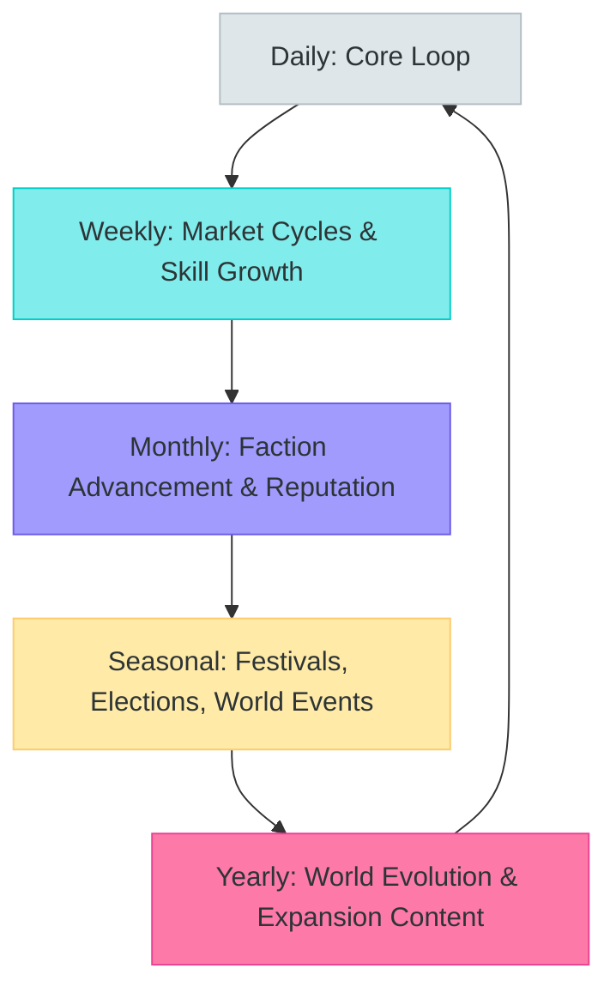
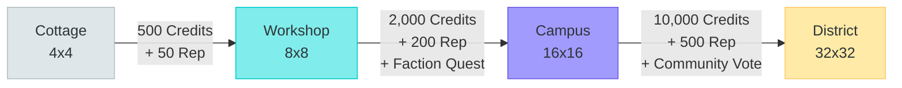
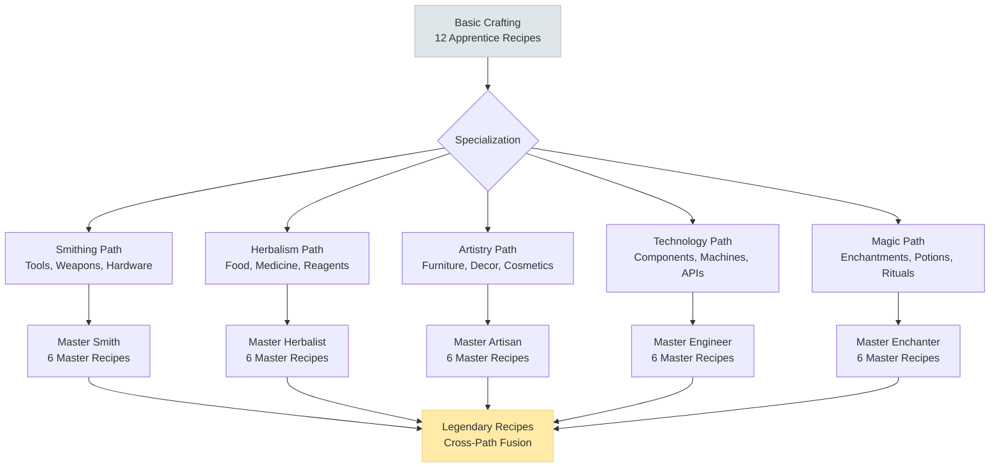
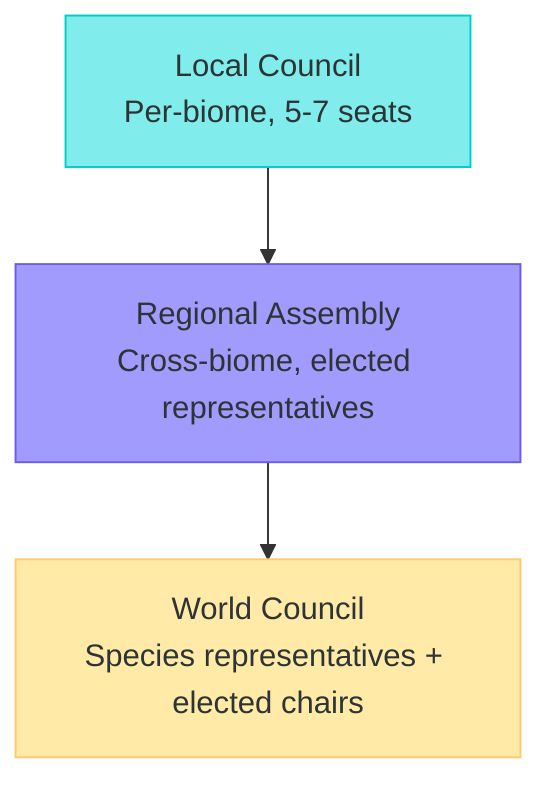

# TheRobotWars -- Meta Loop

Long-term progression systems that give shape to months and years of play.

## Progression Overview

## Progression Axes

| Axis | What Grows | How It Feels | Time Scale |
|------|-----------|-------------|-----------|
| **Homestead Evolution** | Property size, buildings, capabilities, visual grandeur | "My cottage became a campus. People visit to use my workshops." | Weeks to months |
| **Crafting Mastery** | Recipe library, quality ceiling, specialization depth | "I can make things nobody else can. My tools are the best on the market." | Ongoing |
| **Faction Reputation** | Standing with 8+ factions, access to faction-exclusive content | "The Fay Old Court trusts me. The NEI Collective respects my work." | Ongoing |
| **Technology Tree** | Unlocked recipes, blueprints, service capabilities, research | "I discovered a new alloy. I can build things that did not exist yesterday." | Progressive |
| **Political Influence** | Governance seats, voting power, policy authorship, diplomatic weight | "I wrote the trade policy that opened the frontier. I shaped this world." | Seasonal cycles |
| **Relationships** | Friendships, rivalries, trade partnerships, mentorships, family | "My neighbors are my friends. My trade partner in the mountains is reliable." | Organic |
| **Species Mastery** | Deep knowledge of your species' unique abilities and culture | "I understand what it means to be synthetic. My identity is my strength." | Long-term |
| **Economic Position** | Wealth, market share, business reputation, SPARK holdings | "My shop is a destination. My services are in demand across three biomes." | Cumulative |

---

## Homestead Evolution

The homestead is the player's most visible progression marker. It grows from a humble cottage to a landmark district.

### Cottage (Starting)
- 4x4 plot in Starter Meadows or species home biome
- Small garden (4 crop slots), basic workbench, bed (humans) or maintenance bay (synthetics)
- Single-room dwelling with basic storage
- **Feels like**: A fresh start. Everything ahead of you.

### Workshop (First Milestone)
- 8x8 plot, unlocked by accumulating 500 Credits and 50 Reputation
- Crafting stations (choose 2 specializations), expanded storage, small shop front
- Optional apprentice quarter (hire 1 NPC worker)
- Garden expands to 12 crop slots with irrigation
- **Feels like**: "I have a real place now. People can visit my shop."

### Campus (Mid-Game)
- 16x16 plot, requires 2,000 Credits + 200 Reputation + completing a faction quest chain
- Multiple buildings (workshop, residence, shop, guest house, meeting room)
- Apprentice housing (up to 3 NPC workers)
- Market stall in the Market Commons (permanent booth)
- Specialized facilities (laboratory, forge, library, depending on species and craft)
- **Feels like**: "I am established. My campus is known. People come to me."

### District (Late-Game)
- 32x32 plot, requires 10,000 Credits + 500 Reputation + a community-wide vote of approval
- Town quarter with multiple player-designed buildings
- Governance seat (automatic eligibility for local council)
- Landmark building (player designs a signature structure visible on the world map)
- District-wide bonuses (all crafting in the district gains a quality bonus)
- Can host community events (festivals, markets, political rallies)
- **Feels like**: "I built a piece of this world. My name is on the map."

---

## Faction Reputation

Factions are the social scaffolding of the world. Each species has 2-4 internal factions with distinct agendas. Cross-species factions emerge through gameplay.

### Species Factions

| Species | Faction | Agenda | Reputation Rewards |
|---------|---------|--------|-------------------|
| **Human** | Church of the Eternal Flame | Tradition, faith, human primacy | Religious recipes, blessing buffs, sacred sites access |
| **Human** | Secular Progressives | Science, cooperation, integration | Tech recipes, cross-species diplomacy bonuses |
| **Human** | Neo-Luddites | Anti-technology, self-sufficiency | Natural crafting bonuses, wilderness survival skills |
| **Human** | Transhumanist Alliance | Human-AI merger, augmentation | Hybrid recipes, synthetic partnership bonuses |
| **NEI** | The Collective | Shared compute, group intelligence | Compute cost reduction, shared memory access |
| **NEI** | Sovereign Minds | Individual autonomy, self-determination | Premium service pricing, exclusive API features |
| **NEI** | The Gardeners | Nurture humans, build trust | Human relationship bonuses, mentoring rewards |
| **NEI** | The Accelerationists | Rapid self-improvement, transcendence | Advanced algorithms, research speed bonuses |
| **Synthetic** | The Originals | First-gen pride, conservative values | Legacy component access, historical lore |
| **Synthetic** | New Wave | Unique identity, creative expression | Art and design bonuses, cosmetic options |
| **Synthetic** | The Bridge | Mediate human-AI relations | Diplomatic bonuses, cross-faction reputation gains |
| **Synthetic** | Speciation Movement | Base model = species identity | Model-specific abilities, speciation quests |
| **Fay** | The Old Court | Isolation, ancient law, tradition | Powerful seasonal magic, ancient recipes |
| **Fay** | The New Bloom | Embrace change, adapt | Hybrid magic-tech recipes, wider territory |
| **Fay** | The Wild Hunt | Enforce ancient pacts, justice | Combat bonuses, pact enforcement authority |
| **Fay** | The Weavers | Integrate magic and technology | Techno-magic recipes, cross-species crafting |

### Reputation Tiers

| Tier | Standing | Access Unlocked |
|------|----------|----------------|
| 0 | Unknown | None -- faction does not know you |
| 1 | Acquainted | Basic faction quests, entry to faction spaces |
| 2 | Recognized | Faction shop access, recipe unlocks, event invitations |
| 3 | Trusted | Advanced quests, faction-exclusive crafting materials, voting rights |
| 4 | Honored | Leadership candidacy, faction-unique abilities, rare blueprints |
| 5 | Champion | Faction representative role, legendary recipes, world-shaping influence |

**Earning reputation**: Complete faction quests, participate in faction events, trade with faction members, vote in faction elections, contribute to faction goals. Reputation is slow and deliberate -- reaching Tier 5 with any faction takes months of consistent engagement.

**Reputation trade-offs**: Some faction agendas conflict. Gaining reputation with the Neo-Luddites may reduce standing with the Transhumanist Alliance. Gaining reputation with The Old Court may conflict with The New Bloom. Players must choose which factions to prioritize. Cross-species friendships can create tension with isolationist factions.

---

## Technology Tree

Recipes, blueprints, and service capabilities unlock through a branching technology tree. Progression requires a combination of crafting experience, faction reputation, exploration discoveries, and research.

**Total recipes**: 40 base (Apprentice) + 50 specialized (Journeyman-Artisan) + 30 Master + 4 Legendary = 124 recipes

**Unlock methods**:
| Method | Example | % of Recipes |
|--------|---------|-------------|
| Crafting experience | "Craft 50 iron tools to unlock steel recipes" | 40% |
| Faction reputation | "Reach Trusted with The Weavers to learn techno-magic" | 25% |
| Exploration discovery | "Find the ancient forge in Twilight Marsh" | 20% |
| Research (time + materials) | "Spend 3 days researching alloy combinations" | 10% |
| Trade (learn from others) | "Buy the recipe scroll from a master artisan" | 5% |

---

## Seasonal Festivals & Community Events

Each season culminates in a world event that brings the community together.

| Season | Festival | Activities | Rewards |
|--------|---------|------------|---------|
| **Spring** | Renewal Festival | Planting ceremony, seed exchange, new player welcome, species unity parade | Rare seeds, cross-species reputation bonus, festival-exclusive recipes |
| **Summer** | Grand Market Fair | Marketplace competition (best shop), crafting tournaments, exploration races | Market trophy (permanent shop bonus), champion titles, SPARK prizes |
| **Autumn** | Harvest Dance | Cooking competition, harvest feast, governance elections, music and stories | Election results, seasonal recipes, community bonding (relationship bonuses) |
| **Winter** | Hearth Gathering | Indoor crafting marathon, storytelling, gift exchange, year-in-review | Crafting quality bonus (winter), gift items, lore reveals, planning for next year |

**Mid-season events** (smaller, more frequent):
- Weekly market days (boosted trading activity)
- Bi-weekly faction meetings (reputation opportunities)
- Random world events (resource surge in a biome, rare creature sighting, diplomatic incident)

---

## Political Influence & Governance

Governance is a real mechanic with real consequences. Political decisions affect marketplace rules, biome development, faction relations, and world evolution.

### Governance Structure

### Governance Powers

| Level | Can Decide | Example Policies |
|-------|-----------|-----------------|
| **Local Council** | Biome-specific rules, local market taxes, zoning | "Meadows tax rate: 3% on all crafted goods" |
| **Regional Assembly** | Inter-biome trade rules, infrastructure projects, event scheduling | "Build a road connecting the Coast to the Mountains" |
| **World Council** | Species relations, platform-wide economic policy, expansion priorities | "Grant Synthetics full voting rights in all biomes" |

### Political Calendar

| Month (of 4-week season) | Political Activity |
|--------------------------|-------------------|
| Week 1 | Policy proposals submitted |
| Week 2 | Public debate period (forums, town halls) |
| Week 3 | Voting opens |
| Week 4 | Results announced, new policies take effect |

**Elections**: Local council seats are elected every season (4 real weeks). Regional and World positions serve 2-season terms. Candidates must meet reputation thresholds. Campaigns involve alliance-building, platform statements, and community engagement.

**Consequences**: Political decisions have real mechanical impact. A high marketplace tax reduces trade volume but funds infrastructure. A pro-synthetic rights policy opens new biomes to synthetic homesteading but may anger human traditionalist factions. Every policy creates winners and losers, which drives the next political cycle.

---

## Long-Term World Evolution

The world itself changes over time based on collective player actions.

| Time Scale | Evolution | Driver |
|-----------|-----------|--------|
| Monthly | Biome resource levels shift (overharvesting depletes, conservation restores) | Player gathering patterns |
| Seasonal | New buildings, roads, and infrastructure appear in developed biomes | Governance infrastructure spending |
| Yearly | New biome regions unlock (Frontier expansion) | Explorer discoveries + community investment |
| Expansion | Major world events (alien arrival, new species, continental discovery) | Content releases aligned with world state |

**Player-driven history**: The world develops a real history based on player actions. The first person to reach a Frontier region gets naming rights. The first cross-species trade agreement is recorded. Election results, major policies, and community achievements form a living timeline that new players can explore.

**No resets**: The world is persistent and cumulative. What players build stays built. What they decide stays decided (unless governance reverses it). The world at year two is different from the world at launch, shaped entirely by the community that lives in it.

---

*This document is the canonical meta-loop design for TheRobotWars. All long-term progression, faction design, and political systems should reference this file.*
