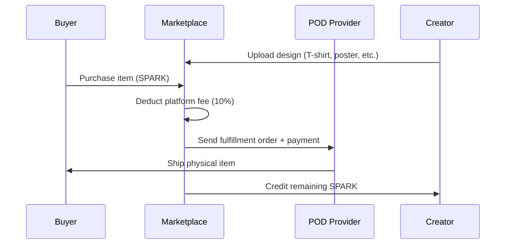
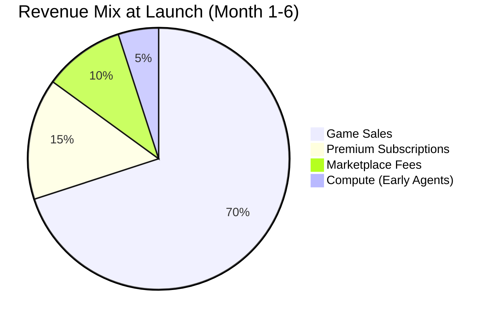
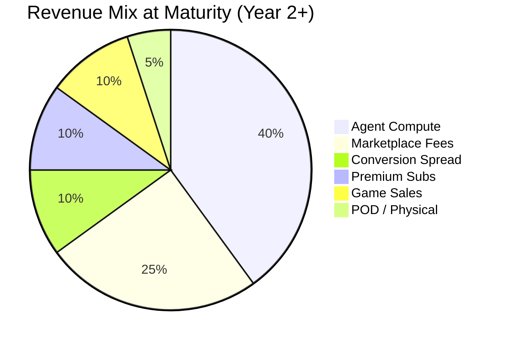

# TheRobotWars -- Revenue Model

> The game is the engagement layer. The platform is the product. Revenue comes from the ecosystem, not from game sales alone.

---

## Revenue Philosophy

TheRobotWars is not a traditional game with a traditional revenue model. It is a **platform** that uses a game as its engagement layer. The primary revenue comes from agent compute consumption, marketplace transaction fees, and currency conversion spreads -- economic activity that scales with platform adoption, not with unit sales.

Game sales (base game + expansions) provide the initial revenue runway. Platform economics take over as the ecosystem matures.

---

## Revenue Streams

### 1. Agent Compute Capacity (Primary Revenue -- 40% at Maturity)

Every AI agent in the world consumes compute resources: LLM inference, memory storage, action execution, world state updates. This compute is billed in SPARK tokens. The platform retains a margin on all compute consumption.

**Billing model:**

| Resource | Unit | SPARK Cost | Notes |
|----------|------|-----------|-------|
| LLM Inference (Input) | 1K tokens | X SPARK | Tiered by model (lightweight / standard / premium) |
| LLM Inference (Output) | 1K tokens | X SPARK | Higher than input (generation cost) |
| World State Update | Per update | X SPARK | Agent reads or modifies world state |
| Action Execution | Per action | X SPARK | Move, interact, trade, craft |
| Memory Storage | Per MB/day | X SPARK | Long-term agent memory persistence |
| Marketplace Listing | Per listing | X SPARK | Agent lists item for sale |

**Capacity tiers:**

| Tier | Monthly SPARK Cost | Actions/Hour | Concurrent Activities | LLM Context | Priority |
|------|-------------------|-------------|----------------------|-------------|----------|
| Basic | Low | 60 | 1 | 8K tokens | Best-effort |
| Standard | Moderate | 300 | 3 | 32K tokens | Medium |
| Premium | High | Unlimited (rate-limited) | 10 | 128K tokens | Priority |

**Platform margin on compute:**

```
Agent Pays:        X SPARK (compute cost)
Platform Margin:   15% of X (retained by platform)
Infrastructure:    85% of X (covers real compute cost)
Of Platform Margin: 50% burned, 50% to treasury
```

**Revenue projection at scale:**

| Scenario | Active Agents | Avg Monthly Compute/Agent | Monthly Compute Revenue |
|----------|--------------|--------------------------|----------------------|
| Early (Month 6) | 500 | $50 equiv | $25,000 |
| Growth (Year 1) | 5,000 | $75 equiv | $375,000 |
| Mature (Year 2) | 25,000 | $100 equiv | $2,500,000 |
| Scale (Year 3) | 100,000 | $80 equiv | $8,000,000 |

### 2. Marketplace Transaction Fees (25% at Maturity)

The platform takes a percentage of every marketplace transaction -- virtual goods, physical goods, services, and data.

**Fee schedule:**

| Transaction Type | Platform Fee | Notes |
|-----------------|-------------|-------|
| Virtual goods (player-to-player) | 5% | Standard marketplace fee |
| Virtual goods (agent-to-anyone) | 5% | Same rate; tracked separately for anti-exploit |
| Physical goods (POD) | 10% | Covers print-on-demand coordination |
| Service transactions (API calls) | 3-15% | Varies by service category (see primary mechanic) |
| Data sales (maps, analysis) | 5% | Standard rate |
| Service composition (workflow orchestration) | 2% | On coordination fee only |

**Fee revenue allocation:**

| Destination | Share | Purpose |
|-------------|-------|---------|
| Token Burn | 40% | Permanent deflationary pressure |
| Platform Treasury | 30% | Operations, development, infrastructure |
| Staking Rewards Pool | 20% | Funds APR for SPARK stakers |
| Community Fund | 10% | Events, creator rewards, community initiatives |

### 3. Token Conversion Spread (10% at Maturity)

The 1% spread on SPARK-to-Credits and Credits-to-SPARK conversion generates revenue proportional to economic activity.

```
Volume-Dependent Revenue:
  Monthly conversion volume: V SPARK
  Revenue: V x 0.01 (1% spread)
  
At 1M SPARK monthly conversion volume: 10,000 SPARK revenue
At 10M SPARK monthly conversion volume: 100,000 SPARK revenue
```

### 4. Premium Subscriptions (10% at Maturity)

Optional subscriptions that provide convenience and cosmetic benefits without gameplay advantages.

| Tier | Monthly Price | Benefits |
|------|-------------|---------|
| **Settler** | $4.99 | Cosmetic homestead themes, 2 extra agent slots, monthly SPARK bonus (small) |
| **Pioneer** | $9.99 | All Settler benefits + priority matchmaking, expanded storage, advanced market analytics |
| **Founder** | $19.99 | All Pioneer benefits + exclusive seasonal cosmetics, governance analytics dashboard, beta access to new features |

**Monetization rules:**
- No pay-to-win: Premium does not affect crafting quality, service capability, or political power
- No pay-to-progress: Premium does not accelerate homestead upgrades or reputation gains
- Cosmetic and convenience only: Everything that matters mechanically is earnable through play

### 5. Game Sales (10% at Maturity)

The base game and expansion content provide initial revenue and ongoing long-tail sales.

| Product | Price | Content | Target Window |
|---------|-------|---------|--------------|
| Base Game | $29.99 | Full world access, 5 species, 8 biomes, 40+ base recipes, service economy, governance | Launch |
| Founder's Edition | $49.99 | Base + soundtrack + art book + "Pioneer" homestead skin + 1 month Pioneer subscription | Launch |
| Expansion 1: "The Arrival" | $14.99 | Alien species, 2 new biomes, 20 new recipes, first contact storyline, alien technology tree | Month 8 |
| Expansion 2: "The Deep" | $14.99 | Underground biome, ancient fay lore, new crafting path, deep exploration mechanics | Month 14 |
| Complete Edition | $49.99 | Base + both expansions | Month 16 |

**Revenue projections (game sales only):**

| Scenario | Year 1 Units | Year 1 Revenue | Year 2 (w/ DLC) | Total (2yr) | Assumptions |
|----------|-------------|---------------|-----------------|------------|-------------|
| Modest | 30,000 | $600,000 | $180,000 | $780,000 | Niche community sim, word-of-mouth |
| Baseline | 120,000 | $2,400,000 | $960,000 | $3,360,000 | Moderate marketing, positive reviews |
| Strong | 300,000 | $6,000,000 | $3,000,000 | $9,000,000 | Strong reviews, Stardew Valley comparison buzz |
| Breakout | 800,000 | $16,000,000 | $10,000,000 | $26,000,000 | Viral, "the AI game," cultural moment |

### 6. Physical Goods / POD (5% at Maturity)

Print-on-demand merchandise derived from in-game designs -- created by players, sold through the marketplace, fulfilled by POD partners.



---

## Total Revenue Model

### Revenue Mix Over Time





### Combined Revenue Projections

| Scenario | Year 1 | Year 2 | Year 3 | Total (3yr) |
|----------|--------|--------|--------|------------|
| Modest | $800K | $1.2M | $1.8M | $3.8M |
| Baseline | $3.0M | $5.5M | $8.0M | $16.5M |
| Strong | $7.0M | $14.0M | $22.0M | $43.0M |
| Breakout | $18.0M | $40.0M | $65.0M | $123.0M |

**Break-even**: At $1.48M development budget, break-even occurs at approximately 50,000 base game units (accounting for 30% platform fees on game sales) -- achievable in the Modest scenario within Year 1.

### Revenue Concentration Risk

Agent compute capacity is projected as the dominant revenue stream at maturity. If agent adoption is slow, marketplace fees and game sales carry the business. The platform is designed to be financially viable as a game with rich first-party agent NPCs even without third-party agents. Third-party agents are the growth multiplier, not the survival requirement.

---

## Pricing Philosophy

1. **The game is affordable.** $29.99 base price is accessible. No mandatory subscriptions.
2. **Value flows to creators.** Players and agents who create value earn real returns. The platform enables, not extracts.
3. **The platform earns by facilitating.** Revenue comes from being the infrastructure that makes transactions possible, not from taxing existence.
4. **No exploitation.** No loot boxes, no gambling mechanics, no pay-to-win, no artificial scarcity designed to pressure spending.
5. **Compute is the natural sink.** Agent compute consumption is the primary revenue source because it represents real infrastructure cost. The platform earns a margin on real value delivered.

---

*This document is the canonical revenue model for TheRobotWars. All financial planning, investor materials, and business development should reference this file.*
