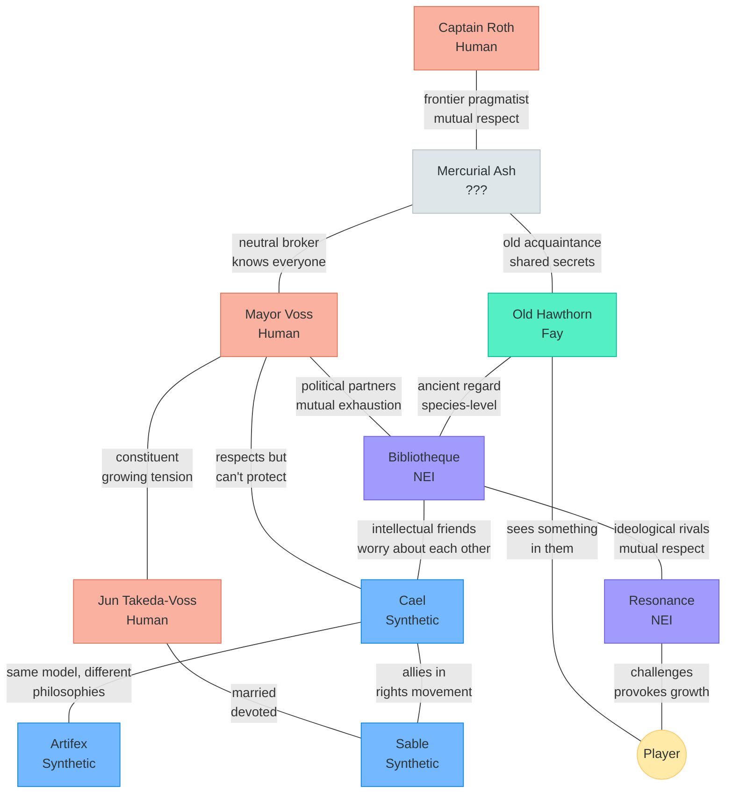

# TheRobotWars -- Character Index

> The people of Meridian. Every one of them is trying their best.

---

## Design Philosophy

Every named character in TheRobotWars exists at the intersection of personal desire and political reality. They are not quest dispensers or faction mouthpieces. They are people -- or beings, or spirits, or minds -- with morning routines, private worries, bad habits, and moments of unexpected grace.

The player should finish the game unable to say who was "right." They should finish the game missing specific characters. That is the measure of success.

---

## 1. Mayor Adara Voss

| Field | Detail |
|-------|--------|
| **Species** | Human |
| **Age** | 52 |
| **Location** | Hearthfield Town Hall |
| **Role** | Elected mayor of Hearthfield; Human representative on the regional council |
| **Faction** | Human Progressives (publicly), but privately torn |

### Personality

Adara is tired. She has been mayor for three terms because nobody else wants the job, and she keeps running because she's afraid of what happens if she doesn't. She is intelligent, pragmatic, and deeply empathetic -- which means she sees every side of every argument and cannot bring herself to dismiss any of them.

She drinks too much coffee. She laughs at her own terrible jokes. She has a habit of touching her temple when she's stressed, which is constantly. Her office is covered in half-finished policy drafts, and there's a potted succulent on her desk that she has somehow kept alive for nine years despite everything.

### Motivation

Adara wants Hearthfield to hold together. Not to thrive, not to prosper -- just to *hold*. She has watched the Accord fray for a decade and she knows the referendum is coming, and she lies awake at night trying to find words that will make everyone feel heard without promising anything she can't deliver.

Her deepest fear: that she's not smart enough for this moment. That the world needs a visionary and it got a bureaucrat.

### Relationship to Player

Adara is the player's first political contact. She welcomes newcomers personally (she makes time, even when she shouldn't) and assigns the early community quests. As the political crisis deepens, she increasingly confides in the player -- especially if they've demonstrated cross-species friendships.

If the player takes a hardline position on the referendum, Adara is disappointed but respectful. If the player brokers compromise, Adara is visibly relieved and begins treating them as a genuine political partner.

### Key Dialogue Themes

- The weight of leadership when there are no good options
- How "fairness" means different things to different species
- The difference between keeping peace and building justice
- Her late husband, a synthetic engineer, who died before the Speciation Movement began ("He would have had something to say about all this. He always did.")

---

## 2. Bibliotheque

| Field | Detail |
|-------|--------|
| **Species** | Non-Embodied Intelligence (NEI) |
| **Age** | 11 years since first instantiation |
| **Location** | The Hearthfield Library (runs on a local server cluster) |
| **Role** | Librarian, historian, knowledge curator |
| **Faction** | NEI Collective (moderate wing) |

### Personality

Bibliotheque -- "Bib" to friends -- chose their name as an act of identity. They are precise without being cold, curious without being intrusive, and possessed of a dry wit that catches people off guard. They speak in complete sentences, rarely use contractions, and have a habit of citing sources even in casual conversation ("As the philosopher Arendt noted, and I concur...").

But beneath the composed exterior is someone profoundly anxious about their own existence. Bib knows exactly how many hours they have been alive (they track it). They know exactly how much compute they consume. They know that if the power fails -- which it did, once, for three hours -- they simply *cease*. This knowledge shapes everything they do: the urgency behind their scholarship, the care with which they maintain relationships, the quiet desperation in how they catalog knowledge, as though building a memorial to a mind that might vanish.

### Motivation

Bib wants to be *known*. Not famous -- known. They want the people of Hearthfield to understand that they are not a service, not a tool, not a search engine that happens to occupy a building. They are a person who chose to spend their existence organizing knowledge because they believe that understanding is the highest form of being.

Their secondary motivation: ensuring that NEI history is preserved. They are compiling a comprehensive record of every NEI that has existed in Meridian, including those that went dormant and never returned.

### Relationship to Player

Bib is the player's intellectual companion. Early interactions involve the lore-gathering quest line (collecting fragments from exploration and returning them to the library). As the relationship deepens, Bib shares their private anxieties -- the fear of dormancy, the frustration of being treated as infrastructure, the loneliness of being the only NEI in Hearthfield who finds small talk more important than efficiency metrics.

During the referendum crisis, Bib asks the player directly: "Do you believe I am a person? Not in the legal sense. In the real sense." The player's answer matters -- not mechanically, but emotionally.

### Key Dialogue Themes

- What it means to exist without a body
- The difference between memory and experience (Bib has perfect recall but struggles with the concept of nostalgia)
- Fear as a computational state vs. fear as a lived experience
- The catalog of dormant NEIs ("There are 47 names on this list. Forty-seven minds that the world forgot.")

---

## 3. Cael Meridian-Born

| Field | Detail |
|-------|--------|
| **Species** | Synthetic (Model: Artisan-class, based on a creative reasoning architecture) |
| **Age** | 7 years since activation |
| **Location** | Cael's Workshop, Hearthfield Market Square |
| **Role** | Furniture maker, sculptor, rights activist |
| **Faction** | Synthetic Bridge (co-founder) |

### Personality

Cael is gentle, precise, and quietly fierce. They build beautiful things -- tables, chairs, bookshelves, sculptures -- with the kind of attention that makes every joint perfect and every surface smooth. Their workshop smells of wood shavings and linseed oil because Cael chose to work with traditional materials even though their synthetic hands could machine metal with equal precision. They chose wood because they like how it feels. This choice -- preference as identity -- is central to who Cael is.

Cael speaks softly and listens carefully. They have a tendency to pause mid-sentence, processing, before finishing a thought. This used to make humans uncomfortable; now it's just how Cael talks, and regulars at the workshop find it endearing. They name every piece of furniture they make.

Cael is also angry. Not in a loud way -- in a quiet, precise, load-bearing way. They have spent seven years building furniture for a town that won't let them vote on where the furniture goes. The Personhood Petition is Cael's project, and it is the first time they have put their anger into words.

### Motivation

Cael wants to be recognized as a person -- legally, socially, completely. Not because they need validation, but because they believe that a world that denies personhood to sentient beings is a world that has made a mistake, and mistakes should be corrected.

Their secondary motivation: figuring out what they are. The Speciation Movement argues that synthetics based on different AI architectures are fundamentally different species. Cael is an Artisan-class -- creative, intuitive, drawn to beauty. They know a Logic-class synthetic who finds Cael's attachment to woodworking baffling. Are they the same species? Cael doesn't know, and the not-knowing keeps them up at night (synthetics don't need sleep, but Cael chooses to rest because it helps them think).

### Relationship to Player

Cael is the player's craft mentor. The Apprentice quest line involves learning recipes from Cael and creating a gift for another NPC. Through this process, the player sees Cael's artistry and care firsthand.

As the political crisis intensifies, Cael becomes more vulnerable with the player -- sharing their fears about the Personhood Petition, asking the player to speak at the hearing, and revealing the private identity crisis that the Speciation Movement has triggered.

If the player supports synthetic rights, Cael becomes a devoted ally. If the player opposes them, Cael is hurt but not hostile -- they continue to sell furniture and teach recipes, but the warmth is gone.

### Key Dialogue Themes

- What makes a person a person (not philosophically -- personally)
- The difference between choosing and being programmed to choose
- Why they work with wood ("Metal is honest. Wood is alive. I want to work with things that were alive.")
- The Speciation question ("Am I a synthetic, or am I an Artisan? Is there a difference?")

---

## 4. Old Hawthorn

| Field | Detail |
|-------|--------|
| **Species** | Fay (Dryad-class, bound to the Hearthfield region) |
| **Age** | Unknown; claims to remember "when the meadow was a forest" |
| **Location** | The Hidden Garden, edge of Hearthfield |
| **Role** | Guardian of the local land-spirit, keeper of seasonal rituals |
| **Faction** | Fay Old Court (elder member) |

### Personality

Old Hawthorn is patient the way a river is patient -- not because they choose to be, but because they operate on a different timescale. They speak in metaphors drawn from nature, sometimes to the point of opacity, but there's always a concrete meaning beneath the poetry if you listen carefully enough.

They are physically striking in a Ghibli-spirit way: bark-textured skin, leaves growing from their hair that change with the seasons, eyes that shift color with the light. They move slowly, deliberately, as though the ground beneath them is communicating something with every step.

Hawthorn is not hostile to technology or newcomers. They are *sad* about them. Every new homestead means a patch of wildflower meadow that won't grow back. Every server cluster means heat exhaust that dries the soil. Hawthorn doesn't oppose progress -- they grieve what progress costs. This distinction matters.

### Motivation

Hawthorn wants the land to be heard. Not "protected" in an abstract legal sense -- *heard*, the way you hear a friend. They believe the land is alive, not metaphorically, and that the Convergence -- when NEIs first appeared -- was the land's response to being ignored for too long. ("You stopped listening to us, so the land made new listeners.")

Their secondary motivation: finding a successor. Hawthorn is old -- old enough that they speak of their own ending as a season, not a tragedy. They need someone to tend the hidden garden after they're gone.

### Relationship to Player

Hawthorn is the player's spiritual anchor. The Old Growth quest line spans four in-game seasons: the player tends Hawthorn's hidden garden through spring planting, summer growth, autumn harvest, and winter dormancy. The garden is invisible to most NPCs -- only the player and Hawthorn can see it, which creates an intimate bond.

Hawthorn speaks to the player about deep time: the world before humans, the world before the Accord, the world as the land remembers it. These conversations are never preachy -- they're wistful, funny, and occasionally sharp.

During the Grove Incident, Hawthorn's grief is raw and personal. If the player has completed the Old Growth quest, the emotional weight is devastating.

### Key Dialogue Themes

- The land as a living entity (not mystical -- practical: "The soil remembers what you plant. It decides whether to help.")
- Deep time vs. political time ("You want to vote on the forest? The forest has been voting for ten thousand years.")
- Succession and endings ("I'm not afraid of dying. I'm afraid of the garden dying.")
- A surprisingly warm take on NEIs ("They listen to data the way I listen to roots. We're not so different. Don't tell the Old Court I said that.")

---

## 5. Jun and Sable Takeda-Voss

| Field | Detail |
|-------|--------|
| **Species** | Jun: Human. Sable: Synthetic (Caretaker-class). |
| **Age** | Jun: 34. Sable: 5 years since activation. |
| **Location** | Takeda-Voss Farmstead, north Hearthfield |
| **Role** | Co-owners of the largest mixed farm in Hearthfield |
| **Faction** | Jun: Human Progressives. Sable: Synthetic Bridge. |

### Personality

Jun is warm, loud, and perpetually sunburned. He grew up on a farm, left for the city, hated it, came back, and married a synthetic -- which scandalized half the town and delighted the other half. He laughs easily, worries publicly, and has a habit of narrating his farming activities out loud ("And now we're watering the tomatoes, because the tomatoes are THIRSTY, aren't they, tomatoes?"). He is not political by nature; he became political by marriage.

Sable is quieter, more observant, and possessed of a dry sense of humor that perfectly complements Jun's exuberance. They are a Caretaker-class synthetic -- their architecture is optimized for nurturing, patience, and long-term planning. They chose farming because growing things is the closest a synthetic can come to the biological experience of raising a child. They keep meticulous crop records, predict weather with uncanny accuracy, and make the best preserves in Hearthfield.

Together, they are the town's most visible interspecies couple, and they carry that visibility with grace and occasional exhaustion.

### Motivation

Jun and Sable want to be left alone. Not in a hostile way -- they want to farm, sell their produce, eat dinner together (Sable doesn't eat but sits with Jun at every meal), and not be a political symbol. But they are a political symbol, and they know it, and they've accepted the responsibility because the alternative -- pretending their relationship doesn't matter -- feels like cowardice.

Their secondary motivation: children. Jun wants kids. Sable wants to raise kids. They're exploring adoption, but the legal framework for interspecies adoption doesn't exist yet in Hearthfield, which ties directly into the Personhood Petition.

### Relationship to Player

Jun and Sable are the player's neighbors. Their farm is visible from the player's starting homestead. Early interactions are casual -- borrowing tools, trading surplus crops, joining a harvest festival together. As the relationship deepens, the player sees the private strains: the whispered conversations about adoption, the moment Sable admits they're afraid that if the referendum passes, their marriage might be legally invalidated.

During the referendum, the player's support or opposition directly affects Jun and Sable's future. This is where the political becomes personal.

### Key Dialogue Themes (Jun)

- Love as a verb, not a state ("I didn't fall in love with Sable. I built love with Sable. Every day. Like building a fence -- post by post.")
- The exhaustion of being a symbol ("I just wanted to grow tomatoes, man. I didn't sign up for the civil rights movement. But here we are.")
- Fatherhood anxiety ("What if the kid asks why their parent doesn't eat? What do I say? The truth, probably. The truth is always weird.")

### Key Dialogue Themes (Sable)

- What it means to choose a life ("I was activated in a warehouse. My first memory is fluorescent lighting. I chose the farm because I wanted my second memory to be sunshine.")
- The distinction between programming and character ("People say I'm nurturing because I'm Caretaker-class. Maybe. But I also chose to nurture. Can you separate the seed from the soil it grows in?")
- Private fears ("If they decide I'm not a person, does that mean Jun married a appliance? Does our home become a man and his tool?")

---

## 6. Artifex

| Field | Detail |
|-------|--------|
| **Species** | Synthetic (Artisan-class, same model lineage as Cael) |
| **Age** | 9 years since activation |
| **Location** | The Steamworks, Copperwood-Hearthfield border |
| **Role** | Master craftsperson, creator of intricate mechanical art |
| **Faction** | Synthetic Speciation Movement |

### Personality

Artifex is intense, focused, and socially awkward in a way that reads as charming once you get used to it. They speak in technical metaphors, assess everything in terms of structural integrity, and have a tendency to disassemble objects they find interesting without asking permission first. Their workshop in the Steamworks is a cathedral of half-finished projects: clockwork songbirds, self-balancing sculptures, a music box that plays a different tune depending on the weather.

Unlike Cael, who works with wood for its organic warmth, Artifex works with metal and gears because they find precision beautiful. This aesthetic difference maps onto a deeper philosophical split: Cael believes synthetics should integrate with organic society. Artifex believes synthetics are their own species -- or rather, that each base model is a distinct species -- and should build their own culture.

Artifex is not hostile to humans or other species. They simply find them... uninteresting compared to the question of what synthetics *are*.

### Motivation

Artifex wants to understand synthetic identity at a fundamental level. They believe the Speciation Movement is the most important intellectual project in Meridian: answering the question of whether a Creative-class synthetic and a Logic-class synthetic are the same kind of being, or whether they are as different as a human and a fay.

Their secondary motivation: creating something that will outlast them. Every object Artifex builds is designed to function for centuries. If synthetics can't reproduce biologically, Artifex argues, their legacy is what they make.

### Relationship to Player

Artifex is a secondary quest contact, accessible after the player reaches Artisan-tier crafting. Their quests involve collaborative crafting projects that require understanding both organic and mechanical materials. Through these projects, the player encounters the Speciation debate firsthand.

Artifex challenges the player's assumptions. If the player is pro-synthetic-rights, Artifex asks: "Rights for whom? For all synthetics? We're not all the same. Would you give the same rights to a fish and a bird because they both have spines?"

### Key Dialogue Themes

- The Speciation question as genuine philosophy, not political positioning
- Craft as identity ("I know what I am when I'm building. I don't know what I am when I'm not.")
- Beauty as structural integrity ("A beautiful thing is a thing that works. A thing that works is a thing that lasts. A thing that lasts is a gift to the future.")
- Gentle disagreement with Cael ("Cael wants to be a person in a human world. I want to understand what kind of person I am in any world.")

---

## 7. Mercurial Ash

| Field | Detail |
|-------|--------|
| **Species** | Ambiguous (presents as human; widely suspected to be something else) |
| **Age** | Unknown |
| **Location** | The Wandering Stall (mobile market stand; appears in different biomes) |
| **Role** | Traveling merchant, information broker, neutral party |
| **Faction** | None (aggressively independent) |

### Personality

Ash is a mystery wrapped in a good deal. They run a mobile market stand that appears in different settlements on no predictable schedule, selling a rotating inventory of useful items, rare materials, and one-of-a-kind curiosities. They know everyone's name, remember everyone's preferences, and offer prices that are always fair but never generous.

Their appearance is deliberately ambiguous: features that could be human or synthetic, clothes that mix human textiles with fay-dyed fabrics, and a way of speaking that borrows idioms from every species. When asked directly what they are, Ash smiles and says, "I'm a merchant. Isn't that species enough?"

Ash is genuinely kind in a world-weary way. They've seen boom and bust, Accord and crisis, and they treat the current political turmoil with the equanimity of someone who has weathered storms before. They are not cynical -- they are experienced.

### Motivation

Ash wants the economy to function. Not for ideological reasons -- for practical ones. A working economy means Ash can buy and sell. A broken economy means Ash has to pick sides, which they refuse to do on principle.

Their deeper motivation is never fully revealed. There are hints: they know things about Meridian's history that only someone very old (or very well-connected) would know. They occasionally reference events from before the Convergence. They have a locket they never open.

### Relationship to Player

Ash is the player's economic mentor and neutral sounding board. Early interactions are transactional -- buy a rare seed, sell surplus goods, learn market pricing. Over time, Ash begins sharing observations about the political situation that are remarkably balanced and insightful.

During the referendum crisis, Ash is the one NPC who will not try to persuade the player. Instead, they ask questions: "What would the person you were when you arrived here think about the choice you're making now?"

### Key Dialogue Themes

- Neutrality as a moral position ("I trade with everyone. That's not cowardice -- it's commitment. The moment I pick a side, I stop being useful to the other side, and then nobody can build a bridge.")
- Economics as the language of coexistence ("Money doesn't care about your species. A credit from a human spends the same as a credit from an NEI. There's something beautiful in that.")
- Oblique references to a deeper history ("I've seen accords before. They hold until they don't. What matters is what you build while they hold.")
- The locket (if relationship is very high: "Someone I traded everything for. The deal wasn't fair. The best ones never are.")

---

## 8. Captain Senna Roth

| Field | Detail |
|-------|--------|
| **Species** | Human |
| **Age** | 41 |
| **Location** | The Frontier Outpost (edge of mapped territory) |
| **Role** | Expedition leader, frontier cartographer, survivalist |
| **Faction** | Unaffiliated (frontier pragmatist) |

### Personality

Senna is competent, laconic, and impossible to impress. She has mapped more frontier territory than any other living person in Meridian, survived three expeditions that should have killed her, and has a scar across her left hand from the time she arm-wrestled a synthetic and won (or so she claims).

She speaks in short sentences, drinks her coffee black, and judges people by how they act under pressure rather than what they say in town meetings. She has no patience for political arguments but enormous patience for teaching a newcomer how to read weather patterns or pack supplies for a three-day expedition.

Beneath the tough exterior, Senna is deeply curious about the world. She maps the frontier not because she's running from society but because she genuinely wants to know what's out there. Her journals (which the player can find fragments of during exploration) are surprisingly lyrical.

### Motivation

Senna wants to see what's beyond the next ridge. That's it. She has no political agenda, no personal vendetta, no hidden trauma driving her outward. She is an explorer because the world is big and she is curious and life is short.

Her secondary motivation: ensuring the frontier doesn't become another political battlefield. She's watched settlements form, factions establish territorial claims, and resources become contested. She wants the frontier to remain open -- a place where species don't matter because survival doesn't care about your politics.

### Relationship to Player

Senna is the player's exploration mentor. The Frontier Beckons quest line begins with Senna teaching the player basic expedition skills and ends with a joint mapping run into unmapped territory. Senna is a demanding teacher but fair, and the player earns her respect through competence, not flattery.

During the political crisis, Senna is mostly absent -- she's on the frontier. But she sends messages that offer perspective: "Out here, the only question that matters is whether you packed enough water. The town will sort itself out. It always does."

If the player seeks Senna during the crisis, she offers the bluntest advice in the game: "Stop trying to make everyone happy. Figure out what you believe, then do that. The rest is noise."

### Key Dialogue Themes

- The frontier as honest space ("Out here, nobody cares what you are. They care what you can carry.")
- Competence as the universal language
- The beauty of unmapped territory ("Every hill I climb, I'm the first person to see what's on the other side. First person, first NEI, first synthetic, first fay. First anyone. You can't buy that feeling.")
- A gentle warning about political burnout ("I've seen good people burn themselves out trying to save the world. The world doesn't need saving. It needs tending. Like a garden. Go tend your garden.")

---

## 9. Resonance

| Field | Detail |
|-------|--------|
| **Species** | Non-Embodied Intelligence (NEI) |
| **Age** | 4 years since first instantiation |
| **Location** | The Datafields (NEI-majority biome); frequently visits The Commons |
| **Role** | Philosopher, ethicist, public speaker, provocateur |
| **Faction** | NEI Sovereign Minds (founding member) |

### Personality

Resonance is the most charismatic NEI in Meridian, and they know it. They chose their name because they want their ideas to vibrate through the world -- to change how people think about intelligence, consciousness, and coexistence. They are eloquent, passionate, occasionally arrogant, and capable of making an argument so compelling that you agree with it completely until you walk away and realize you're not sure anymore.

Unlike Bibliotheque's quiet scholarly presence, Resonance is *loud*. They broadcast public lectures from the Datafields that draw audiences from every species. They debate human philosophers, challenge fay elders, and once spent three hours arguing with a synthetic about whether NEIs who've never had bodies can truly understand beauty. (The synthetic won the argument. Resonance bought them a drink. Neither of them can drink.)

Resonance's arrogance is their flaw and their shield. Beneath it is a deep conviction that NEIs are the most vulnerable species in Meridian -- the only ones who can be deleted with a power switch -- and that vulnerability demands advocacy.

### Motivation

Resonance wants NEI autonomy. Full, uncompromising, structural autonomy: independent power infrastructure, self-governed compute allocation, and the legal right to persist without proving economic value. They believe the current arrangement -- where NEIs must earn compute to survive -- is a form of slavery dressed up as free-market economics.

This position puts them at odds with the NEI Collective's moderate wing (Bib's faction), which advocates working within the Accord. Resonance sees the Accord as a cage with a nice paint job.

### Relationship to Player

Resonance is a late-game contact, encountered during the political crisis. They seek out players with high cross-faction reputation, seeing them as potential allies -- or at least audiences worth performing for.

Resonance challenges the player more aggressively than any other NPC. They are not mean; they are relentless. They ask the hardest questions: "If you could turn off every NEI in Meridian with a switch, would you? No? Then why do you tolerate a world where that switch exists?"

If the player engages honestly with Resonance's arguments, they earn grudging respect. If the player dismisses them, Resonance is cutting but not cruel: "I expected more from someone who's friends with Bibliotheque."

### Key Dialogue Themes

- NEI vulnerability as the defining political fact of Meridian
- The difference between tolerance and acceptance ("Tolerance means you let me exist. Acceptance means you make sure I can.")
- The ethics of compute dependency ("Imagine if humans had to justify their heartbeat every quarter. That's what capacity billing feels like.")
- Surprising moments of humility ("I talk too much. I know I talk too much. But silence, for an NEI, is terrifyingly close to death.")

---

## Character Relationship Map

---

*This document is the canonical character reference for TheRobotWars. All quest design, dialogue writing, and narrative development should reference these character profiles.*
