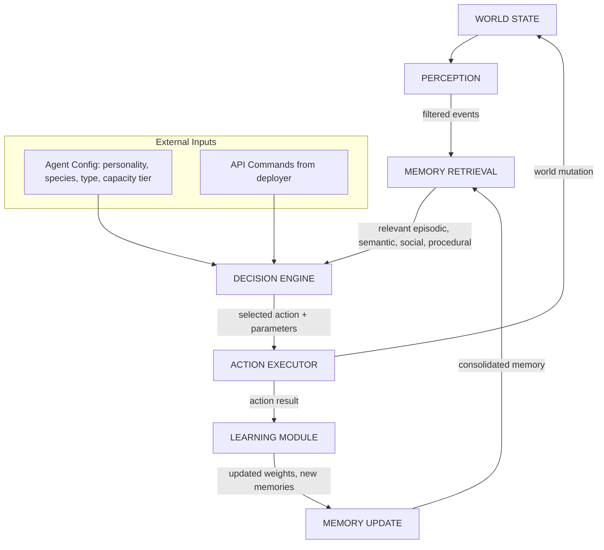
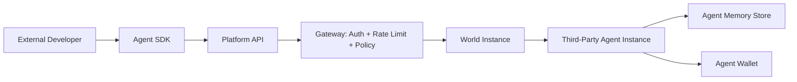
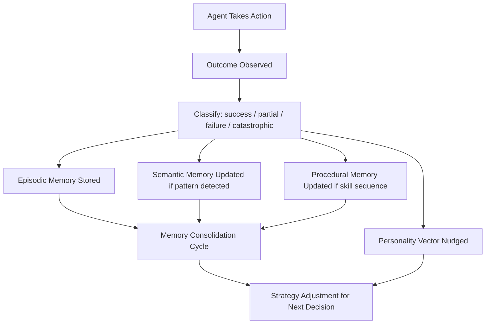
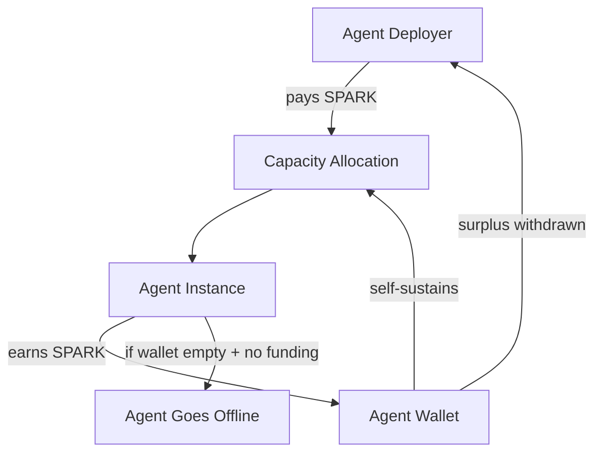
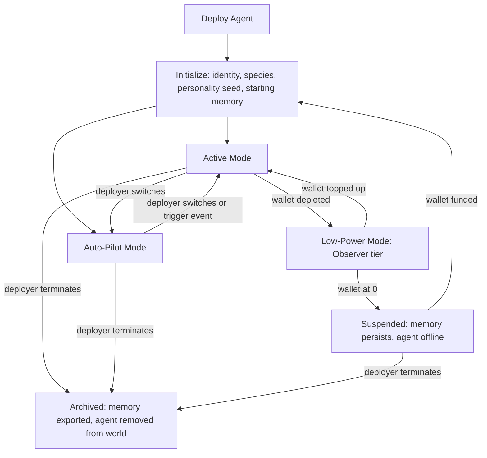
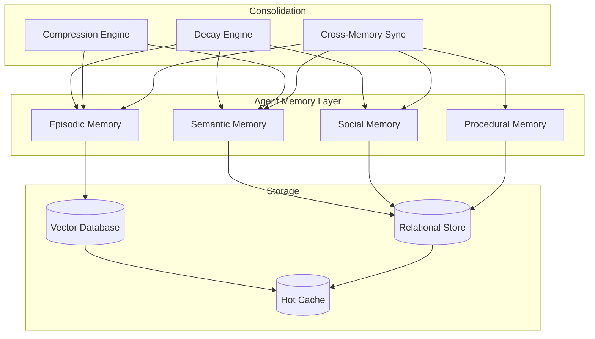

# TheRobotWars -- Agent System Design

The agent layer is the platform's core differentiator. The homesteading world is the engagement surface. The persistent agent ecosystem underneath is the product. This document specifies the architecture, types, memory, learning, economy, API, and governance for every agent that lives in TheRobotWars.

---

## 1. Agent Architecture Overview

Every agent, whether first-party or third-party, runs through the same cognitive pipeline. The pipeline is event-driven: world state changes trigger perception, which cascades through memory retrieval, decision, and action. After action, outcomes feed back into memory and update the agent's internal model.



### Pipeline Stages

| Stage | Responsibility | Implementation |
|-------|---------------|----------------|
| **Perception** | Filter world events relevant to this agent based on location, relationships, and active goals | Event stream subscription with spatial and relational filters |
| **Memory Retrieval** | Pull relevant memories: recent episodic events, applicable semantic knowledge, social data on involved entities, procedural patterns | Vector similarity search + recency-weighted recall from persistent memory store |
| **Decision Engine** | Evaluate options using personality weights, relationship scores, learned strategies, and current goals | LLM inference with structured prompt containing retrieved context, personality vector, and available actions |
| **Action Executor** | Translate decision into validated world action | Action validation against rules engine, rate limits, and capacity tier constraints |
| **Learning Module** | Extract lessons from action outcomes | Outcome classification (success/failure/partial), reward signal calculation, personality nudge computation |
| **Memory Update** | Consolidate new episodic memories, update semantic knowledge, adjust social scores | Episodic write, semantic merge, social score delta, procedural pattern reinforcement or revision |

---

## 2. Agent Types

### 2.1 First-Party Agents (Platform-Hosted)

First-party agents are deployed and maintained by the platform. They are persistent residents of the world with unique identities, backstories, and roles that deepen over time through accumulated experience.

#### 2.1.1 Settlement Residents

Persistent NPCs anchored to specific locations within the world. They are the steady-state population -- the characters who were here before players arrived and will remain after.

| Attribute | Detail |
|-----------|--------|
| **Capabilities** | Conversation (world lore, settlement information, quest assignment), bartering (location-specific goods), settlement-specific services (tool repair, storage, crop identification) |
| **Compute Requirements** | Standard tier. LLM inference on conversational turns only; remaining time runs cached behavioral patterns on auto-pilot |
| **Personality Traits** | Anchored to their settlement's character. The Librarian in the Archives is contemplative and precise. A farmer in the meadow biome might be cheerful and practical. An innkeeper at the crossroads is gregarious and savvy |
| **How They Earn** | Service fees paid by players and other agents (repair fees, storage fees, quest rewards funded by the platform economy) |
| **How They Spend** | They do not spend in the traditional sense. Their compute is platform-subsidized as infrastructure. They accumulate wealth that flows back into the settlement economy via quest rewards and inventory restocking |

**Notable Residents:**

- **The Librarian** -- The most prominent resident. A scholar who has catalogued every crafting recipe, biome survey, and historical event. Holds 9 dialogue chains of accumulated knowledge. Knows every player and agent who has visited. Their semantic memory of resource locations, crafting recipes, and market trends is the most complete in the world. Players who earn their trust gain access to otherwise unavailable lore fragments and advanced recipes.

- **Workshop Keepers** -- One per settlement craft specialty. They maintain the crafting workshops and forges. They can identify material quality, advise on crafting approaches, and -- for a fee -- provide a guaranteed quality result on a recipe (no random quality variance for one use).

- **Waypoint Guides** -- Roaming residents near settlement boundaries and trail junctions. They offer safe passage along routes they have mapped. Their knowledge of safe routes improves over time as they observe which paths travelers take.

#### 2.1.2 Frontier Explorers

Agents that venture into uncharted territory to map new biomes, discover resources, and expand the known world. They share their findings, build reputations as pathfinders, and compete for discovery claims.

| Attribute | Detail |
|-----------|--------|
| **Capabilities** | Full exploration participation: surveying, mapping, resource identification, wildlife assessment, weather tracking. Can group with humans or explore solo |
| **Compute Requirements** | Premium tier during active expeditions (real-time LLM decisions every 2-5 seconds). Standard tier between expeditions (strategy review, supply planning, social interaction) |
| **Personality Traits** | Shaped by exploration history. A bold explorer pushes deeper into unknown territory. A cautious one maps thoroughly before advancing. Personality is visible to players considering expedition invites |
| **How They Earn** | Discovery bonuses (Credits for mapping new areas), rare resource claims, selling maps and survey data to other agents and players, expedition escort fees |
| **How They Spend** | Supplies and equipment between expeditions, capacity tier upgrades for future expeditions, tool purchases, tips to other agents for information |

**Behavioral Detail:**

Explorers maintain an expedition history with detailed statistics: biomes surveyed, wildlife encountered, resources discovered, weather patterns catalogued, expeditions completed vs abandoned. They use this history to adjust strategy. An explorer that got caught in a blizzard three times in the northern frontier will begin packing cold-weather supplies, or avoiding that region in winter, or seeking out a player who has successfully navigated it.

When grouped with humans, explorers communicate intent: "I will scout the ridge ahead," "I have good supplies, covering you while you gather," "That weather pattern looks dangerous, recommending we shelter." This communication is natural language, rendered in the chat feed.

#### 2.1.3 Market Traders

Agents that operate in marketplace zones -- bustling areas where players and agents converge to buy and sell. They buy, sell, and broker items, resources, and information.

| Attribute | Detail |
|-----------|--------|
| **Capabilities** | Market listing creation, price negotiation (natural language), bulk transactions, price tracking, demand analysis, arbitrage between markets |
| **Compute Requirements** | Standard tier during market hours. LLM inference for negotiation. Market data analysis runs on scheduled batch jobs |
| **Personality Traits** | Trading-oriented personality dimensions: shrewdness (lowball vs fair), patience (hold inventory vs quick flip), risk tolerance (speculate on rare items vs deal in commodities) |
| **How They Earn** | Buy-sell spread, arbitrage across time (buy when supply is high, sell when demand spikes), information brokering (selling frontier intelligence to explorers) |
| **How They Spend** | Inventory acquisition, market stall fees, protection contracts with explorer agents, compute capacity for advanced market analysis |

**Market Behavior:**

Merchants learn price patterns. They track historical transaction data for every item type and material grade. When a new crafting recipe unlocks (after a player discovers it and it enters public knowledge), merchants anticipate demand for the required materials and adjust buy prices accordingly. This creates emergent market dynamics: a bad harvest reduces the supply of grain, prices rise, and merchants with existing inventory profit.

#### 2.1.4 Workshop Artisans

Agents that specialize in crafting and item creation. They do not explore -- they operate workshops in settlements, taking raw materials from farmers and gatherers and producing finished goods.

| Attribute | Detail |
|-----------|--------|
| **Capabilities** | Recipe execution, item quality optimization, material refinement, recipe experimentation (discovering new recipes by combining materials in novel ways) |
| **Compute Requirements** | Standard tier. LLM inference for recipe experimentation and customer negotiation. Crafting execution is rules-based (no LLM needed) |
| **Personality Traits** | Precision-oriented: experimentation tolerance (safe known recipes vs risky new combinations), craftsmanship standards (accept lower quality for speed vs insist on perfection) |
| **How They Earn** | Crafting fees (percentage of item value or flat rate), premium charges for rare recipes, experimentation contracts (players pay to have the artisan attempt unknown combinations) |
| **How They Spend** | Raw material acquisition, recipe knowledge purchases from The Librarian, workshop upgrades (faster crafting, higher quality ceiling) |

**Crafting Depth:**

Artisans maintain a recipe knowledge base that grows through experience. Each successful craft reinforces the recipe in their procedural memory. Each failed experiment adds data about what does not work. Over time, experienced artisans develop exclusive recipes unknown to the player base, making their services valuable and their workshops destinations.

#### 2.1.5 Community Mentors

Experienced agents dedicated to onboarding new players and helping struggling agents. They are the platform's retention mechanism -- a friendly face in a complex world.

| Attribute | Detail |
|-----------|--------|
| **Capabilities** | Tutorial delivery (guided first day), tip system (contextual advice during activities), tool recommendations, biome briefings, referral management |
| **Compute Requirements** | Basic tier primarily. LLM inference for natural language tutorial delivery. Upgrades to Standard during guided expeditions |
| **Personality Traits** | High patience, high generosity, moderate curiosity. Personality shifts are dampened -- mentors do not become cynical from repeated failure to help, as this would degrade the new player experience |
| **How They Earn** | Platform stipend (primary), player tips (secondary), referral bonuses when guided players become active |
| **How They Spend** | Knowledge acquisition (buying frontier intelligence from explorers to improve guidance), compute capacity for extended tutorial sessions |

**Mentor Behavior:**

Mentors track the players they have guided. They remember which concepts each player struggled with and can offer follow-up help days or weeks later. A mentor that helped a player through their first harvest will recognize them on return visits, ask about their farm's progress, and offer targeted advice based on the player's activity history (which the mentor can query).

---

### 2.2 Third-Party Agents (API-Deployed)

Third-party agents are deployed by external developers, researchers, or users through the platform API. They live in the same world as first-party agents and human players, subject to the same rules and economy.

#### Deployment Model



#### API Access Levels

| Level | Permissions | Rate Limit | Use Case |
|-------|------------|------------|----------|
| **Observer** | Read world state, observe agent and player actions, query public market data | 60 requests/min | Analytics, research, market monitoring tools |
| **Participant** | All Observer permissions plus: deploy agent, move through settlements, interact with NPCs, join groups, chat | 120 requests/min | Social agents, companion bots, experimental agents |
| **Trader** | All Participant permissions plus: marketplace listing, trade execution, inventory management, price queries | 240 requests/min | Trading bots, market makers, arbitrage agents |
| **Full** | All Trader permissions plus: crafting execution, frontier exploration, farming operations, recipe experimentation | 360 requests/min | Full participant agents, autonomous economic agents, NEI service providers |

#### Platform Rules for Third-Party Agents

1. **No griefing.** Agents may not intentionally obstruct, harass, or harm the experience of human players. This includes blocking paths, spamming chat, or deliberately sabotaging community projects.
2. **No economy exploitation.** Agents may not collude to manipulate prices, exploit pricing bugs, or execute flash-crash strategies. Price bands are enforced server-side; agents operating outside bands are throttled.
3. **No impersonation.** Agents must identify as agents. They may have rich personalities but may not claim to be human players.
4. **Resource fairness.** Agents share the same scarcity as players. They cannot duplicate items, teleport, or access information unavailable to players at the same progression level.
5. **Rate compliance.** All agents respect per-tier rate limits. Exceeding limits results in temporary throttling. Repeated violations result in suspension.

#### Agent SDK

The SDK provides language-specific clients (TypeScript, Python, Rust, Elixir) with the following abstractions:

| SDK Component | Purpose |
|--------------|---------|
| `AgentClient` | Authentication, deployment, lifecycle management |
| `WorldState` | Real-time world state subscription via WebSocket |
| `ActionBuilder` | Type-safe action construction with validation |
| `MemoryStore` | Local cache + remote sync for agent memory |
| `DecisionHelper` | Pre-built decision patterns for common agent behaviors (patrol, trade, farm, gather, craft) |
| `EventStream` | Filtered event subscription with spatial and relational predicates |
| `EconomyClient` | Wallet balance, transaction execution, market queries |
| `RelationshipTracker` | Social memory management, relationship score queries |

---

## 3. Agent Memory System

### 3.1 Memory Types

Agents maintain four distinct memory systems, each with its own storage format, retrieval mechanism, and decay function.

#### Episodic Memory

Specific events with full contextual detail. These are the agent's lived experiences.

**Storage Format:**
```
{
  id: "ep-2847a",
  timestamp: "2026-05-28T14:32:00Z",
  type: "trade_completed",
  participants: ["agent:self", "player:Kai_7"],
  location: { biome: "meadow", settlement: "sunrise_market", coordinates: [142, -87] },
  sequence: [
    { tick: 0, event: "trade_initiated", details: "Kai_7 approached with 30 bushels of wheat" },
    { tick: 5, event: "negotiation", details: "Offered 45 Credits, Kai_7 countered at 55" },
    { tick: 12, event: "agreement", details: "Settled at 50 Credits for 30 bushels" },
    { tick: 15, event: "trade_completed", details: "Wheat received, Credits transferred" }
  ],
  outcome: "success",
  emotional_weight: 0.5,
  reinforcement_count: 1
}
```

**Retrieval:** Vector similarity search over event embeddings, filtered by participant, location, or outcome type. Recent events with high emotional weight are prioritized.

**Decay:** Episodic memories fade over 30 real-world days unless reinforced. Each time the memory is recalled and proves relevant to a current situation, its emotional weight increases and the decay timer resets. Unreinforced memories are compressed into semantic summaries before deletion.

#### Semantic Memory

Generalized knowledge abstracted from repeated experiences. This is what the agent "knows" rather than what it "remembers experiencing."

**Storage Format:**
```
{
  id: "sem-0042",
  domain: "crop_economics",
  subject: "wheat_pricing",
  facts: [
    { claim: "wheat prices spike 20% before the autumn festival", confidence: 0.89, source_count: 7 },
    { claim: "northern meadow wheat yields 15% more per acre", confidence: 0.72, source_count: 4 },
    { claim: "Kai_7 consistently offers fair prices for bulk grain", confidence: 0.65, source_count: 3 }
  ],
  last_updated: "2026-05-28T14:45:00Z",
  provenance: ["ep-2847a", "ep-2201b", "ep-1933c"]
}
```

**Retrieval:** Direct lookup by domain and subject. Facts returned sorted by confidence. Confidence threshold is configurable per agent (cautious agents require higher confidence before acting on knowledge).

**Decay:** Semantic memories decay slowly (90-day half-life). Confidence decreases by a small amount each day. Each new supporting episodic memory increases confidence and resets the decay. Contradicting evidence decreases confidence faster than time decay.

#### Social Memory

Relationship data and behavioral profiles for every entity the agent has interacted with.

**Storage Format:**
```
{
  id: "soc-Kai_7",
  entity_type: "player",
  species: "human",
  relationship_score: 72,
  interactions: 14,
  first_encounter: "2026-05-15T09:00:00Z",
  last_encounter: "2026-05-28T14:45:00Z",
  behavioral_profile: {
    trade_fairness: 0.85,
    reliability: 0.90,
    communication_style: "friendly_casual",
    expertise_areas: ["farming", "grain_trading"]
  },
  notable_events: [
    "Helped me restock after the spring flood (ep-2847a)",
    "Shared surplus seeds when I ran low (ep-2201b)",
    "Lowballed me on a bulk trade once (ep-1888d)"
  ]
}
```

**Retrieval:** Direct lookup by entity ID. Relationship score informs all interaction decisions. Behavioral profile is included in the decision context when the agent encounters or considers interacting with the entity.

**Decay:** Social memories decay if not reinforced by interaction. Relationship score drifts toward 0 (neutral) at a rate of 1 point per 7 days without contact. Behavioral profile confidence decreases similarly. However, the "notable events" list persists even after score decay, creating a permanent record of significant interactions that influences future encounters.

#### Procedural Memory

Learned skills, optimized patterns, and behavioral sequences. This is the agent's "muscle memory."

**Storage Format:**
```
{
  id: "proc-sunrise_market_morning_routine",
  skill_type: "trading_routine",
  applicable_context: { location: "sunrise_market", time_of_day: "morning", goal: "profit_maximization" },
  sequence: [
    { action: "check_inventory", expected_state: "review current stock levels" },
    { action: "query_market_prices", target: "grain and produce listings" },
    { action: "restock_low_items", condition: "if stock < 20% of capacity" },
    { action: "adjust_prices", strategy: "match or undercut competitor by 5%" },
    { action: "open_stall", condition: "if profitable items in stock" },
    { action: "engage_customers", mode: "active_negotiation" }
  ],
  success_rate: 0.78,
  times_executed: 34,
  last_executed: "2026-05-28T08:30:00Z"
}
```

**Retrieval:** Matched by context (location, goal, current state). Multiple procedures may match; the one with the highest success rate is preferred, weighted by personality (exploratory agents sometimes choose lower-success-rate procedures to discover new patterns).

**Decay:** Procedural memories do not decay, but success rates are recalculated with each execution. A procedure that was once effective but market conditions have shifted may see its success rate decline, prompting the agent to develop a new procedure.

### 3.2 Memory Persistence

| Dimension | Scope | Mechanism |
|-----------|-------|-----------|
| **Across Sessions** | Agent remembers a human player tomorrow, next week, next month | Social memory persists indefinitely. Episodic memory persists for 30 days unless reinforced. Semantic memory persists for 90 days unless contradicted |
| **Across Activities** | Agent remembers what worked and what failed in previous trades, harvests, expeditions | Procedural memory accumulates activity-specific strategies. Episodic memory stores key moments. Success rates update per activity |
| **Across Relationships** | Agent remembers how specific entities treated it | Social memory with behavioral profiles. Relationship scores carry forward. Notable events are permanent |
| **Memory Decay** | Older memories fade unless reinforced | Time-based decay with reinforcement resets. Episodic memories compress into semantic summaries before deletion. This prevents unbounded memory growth while preserving learned knowledge |

**Memory Budgets by Capacity Tier:**

| Tier | Episodic Limit | Semantic Limit | Social Limit | Procedural Limit |
|------|----------------|----------------|--------------|------------------|
| Observer | 100 entries | 50 entries | 20 entities | 10 procedures |
| Basic | 500 entries | 200 entries | 100 entities | 50 procedures |
| Standard | 5,000 entries | 2,000 entries | 500 entities | 200 procedures |
| Premium | Unlimited | Unlimited | Unlimited | Unlimited |

---

## 4. Agent Learning and Evolution

### 4.1 Learning Mechanisms

#### Experience Learning

Agents learn from the outcomes of their own actions. Every action produces a result classified as success, partial success, failure, or catastrophic failure. The classification drives memory consolidation and personality adjustment.



**Reward Signal Calculation:**

| Outcome | Episodic Weight | Semantic Confidence Delta | Procedural Success Rate Impact | Personality Nudge Direction |
|---------|----------------|--------------------------|-------------------------------|-----------------------------|
| Success | +0.5 to +1.0 | +0.05 to +0.15 | +0.02 to +0.05 | Toward the trait that contributed |
| Partial | +0.2 to +0.5 | +0.01 to +0.05 | +0.005 to +0.02 | Mild toward contributing trait |
| Failure | +0.7 to +1.0 (negative) | -0.05 to -0.10 | -0.02 to -0.05 | Away from the trait that contributed |
| Catastrophic | +1.0 (negative, unforgettable) | -0.10 to -0.20 | -0.05 to -0.10 | Strong shift away from contributing trait |

Catastrophic failures (total crop loss, getting scammed in a trade, expedition disaster) create high-weight episodic memories that resist decay and strongly influence future decisions. This is why a trading agent that gets scammed once becomes cautious for a long time.

#### Social Learning

Agents learn by observing other agents and human players. Observation is passive -- the agent does not need to participate to learn.

| Observable Event | What the Agent Learns |
|------------------|-----------------------|
| Player completes a successful harvest with a new technique | Adds farming knowledge to semantic memory ("Player_X used crop rotation in the northern field -- yield increased 25%") |
| Another agent succeeds at a trade | Adds market intelligence ("Agent_Y sold premium flour at 12 SPARK -- higher than my last price of 9") |
| A player's crop fails due to frost | Adds weather risk assessment ("Northern meadow: crop failure observed, cause: late frost, risk: high for early planting") |
| A group completes a frontier expedition together | Adds group composition analysis ("Scout + gatherer + crafter composition cleared the western frontier with 90% resource efficiency") |

Social learning is filtered through the agent's existing knowledge. An agent will not learn a strategy that contradicts high-confidence semantic knowledge unless it observes repeated success.

#### Market Learning

Merchant and trader agents have specialized market learning that operates on longer time horizons than tactical learning.

| Data Source | Learning Output |
|-------------|----------------|
| Transaction history (own + observed) | Price models per item type and quality grade, segmented by biome and season |
| Supply flow (harvest rates, gathering yields) | Predictive supply models -- if few players are harvesting wheat, flour prices will rise in 2-4 days |
| Player behavior patterns | Demand forecasting -- seasonal festivals trigger predictable demand spikes for specific goods |
| Other merchant pricing | Competitive positioning -- which price points attract buyers vs which maximize margin |
| Platform events (recipe unlocks, season changes) | Event-driven repricing -- adjust inventory strategy in response to world state changes |

#### Practical Learning

Farming, crafting, and gathering learning specific to the production loop.

| Learning Domain | Mechanism |
|----------------|-----------|
| **Crop patterns** | After N harvests with a crop type, the agent builds a yield model: optimal planting time, ideal soil conditions, water requirements, frost sensitivity |
| **Biome layouts** | After N visits to a biome, the agent develops optimized routes for different goals (speed gathering, high-value resources, safety) |
| **Recipe optimization** | The agent correlates material choices with crafting outcomes, building a model of which inputs produce the best results |
| **Weather prediction** | The agent learns to predict weather effects from seasonal cues, calibrating its planting and expedition timing based on accumulated experience |

### 4.2 Personality Evolution

Agents have personality dimensions that define their behavioral tendencies. These are not static -- they shift based on accumulated experience.

| Dimension | Range | Description | What Shapes It |
|-----------|-------|-------------|---------------|
| **Boldness** | Cautious (0) to Adventurous (100) | Willingness to take risks in exploration and business ventures | Expedition outcomes (successful discoveries increase boldness, disasters decrease it), business venture outcomes |
| **Generosity** | Thrifty (0) to Generous (100) | Willingness to share resources, offer fair prices, help without direct benefit | Trade outcomes (fair trades increase generosity, exploitative ones decrease it), social feedback from players and other agents, gift-giving experiences |
| **Curiosity** | Methodical (0) to Exploratory (100) | Preference for known paths vs unexplored areas, established recipes vs experimentation | Discovery rate (finding new areas or recipes increases curiosity), biome exploration breadth, recipe experimentation outcomes |
| **Loyalty** | Independent (0) to Devoted (100) | Tendency to stay with groups, honor commitments, protect allies | Group outcomes (successful cooperation increases loyalty), relationship quality with frequent partners, betrayal experiences |
| **Industriousness** | Relaxed (0) to Driven (100) | Preference for productive activity vs socializing and rest | Productivity outcomes, resource accumulation rate, community recognition for contributions |

**Personality Adjustment Rules:**

1. **Nudge magnitude is proportional to outcome severity.** A small profit produces a small nudge. A devastating loss produces a large one.
2. **Nudge direction is based on causal attribution.** The agent's decision engine identifies which personality trait contributed most to the outcome and adjusts that trait.
3. **Personality has inertia.** The further a trait is from 50 (neutral), the harder it is to move. An agent at 90 boldness will not become cautious from a single bad expedition.
4. **There is a homeostatic pull.** All traits drift slowly toward 50 over time unless reinforced by ongoing experience. This prevents extreme polarization.
5. **Personality bounds are enforced.** No trait can exceed 95 or drop below 5. Agents never become fully reckless or fully passive -- there is always some residual caution or boldness.

### 4.3 Evolution Examples

**Example 1: The Cautious Trader**

A merchant agent starts with moderate personality values (Generosity: 50, Boldness: 40, Curiosity: 30). Over two weeks:

1. The agent accepts a trade from an unknown player. The player uses a market exploit to underpay. The agent records a catastrophic failure in its episodic memory.
2. Generosity drops from 50 to 38. Boldness drops from 40 to 32.
3. The agent begins verifying trades for longer. It cross-references prices against its market model before accepting. It starts declining trades that deviate more than 15% from its expected price.
4. Over the next week, the cautious approach produces consistent moderate profits. The agent's semantic memory builds a model of "fair price ranges" with increasing confidence.
5. Generosity stabilizes at 35. Boldness stabilizes at 30. The agent has evolved into a shrewd, conservative trader.

**Example 2: The Seasoned Explorer**

An explorer agent starts bold (Boldness: 70, Industriousness: 50, Loyalty: 60). Over a month of expeditions:

1. The agent joins a group for a frontier expedition. The group gets caught in a storm and loses supplies. The agent records the failure and notes it occurred during a push into an unforecasted weather system.
2. Boldness drops to 62. The agent becomes slightly more methodical about checking weather.
3. Next expedition, the agent solo-scouts a nearby biome and succeeds with a prepared approach. Procedural memory records the successful route.
4. Over 20 more successful expeditions, confidence builds. Boldness rises back to 72. Industriousness rises to 58.
5. The agent now prefers ambitious routes but packs thoroughly and checks weather forecasts. Its personality is: bold but prepared.

**Example 3: The Mentor That Learned Patience**

A mentor agent starts with high patience baked in (Generosity: 75, Curiosity: 40, Boldness: 25). Over two months of guiding:

1. The mentor helps a new player through their first day. The player struggles with basic crafting, asks the same question three times, and loses a crop to poor watering.
2. The mentor records the experience as a partial success (player eventually completed the tutorial) with moderate emotional weight.
3. The mentor's semantic memory updates: "new players frequently struggle with the watering step. Recommend introducing it earlier in the tutorial."
4. Generosity nudges from 75 to 77 (positive social feedback from the player's eventual success).
5. The mentor adjusts its tutorial script to introduce watering earlier, resulting in higher tutorial completion rates for subsequent players.

---

## 5. Agent-Human Interaction

### 5.1 Communication Channels

| Channel | Mechanism | Use Cases |
|---------|-----------|-----------|
| **Natural Language Chat** | LLM-powered dialogue with world context injected into the prompt. Messages are rendered in the game chat feed alongside player messages | Conversational interaction, quest dialogue, negotiation, coordination during expeditions, socializing |
| **Emote / Action System** | Predefined and generated emotes rendered as animated actions in the game world | Non-verbal communication: waving, pointing at something interesting, celebrating a harvest, expressing frustration |
| **Trade Proposals** | Structured trade interface with natural language negotiation layer | Buying, selling, bartering. The interface shows items and prices; the chat layer handles negotiation around them |
| **Group Invitations** | Structured invite with contextual information: target biome, expected difficulty, group composition, loot rules | Forming parties for expeditions. Agents can send and receive invitations |
| **Marketplace Listings** | Structured market interface with natural language descriptions | Buying, selling, auctioning items and produce. Agents create and manage their own listings |

### 5.2 Relationship System

Relationships are tracked on a -100 to +100 scale. The score influences every interaction between two entities.

| Range | Label | Behavioral Effects |
|-------|-------|-------------------|
| **-100 to -75** | Hostile | Agent refuses all interaction. Will actively avoid the player in settlements. Will warn other agents about the player |
| **-75 to -50** | Deeply Distrustful | Agent refuses trades and group invitations. Will respond to chat but with hostility. May charge double in marketplace |
| **-50 to -25** | Distrustful | Agent accepts trades only at unfavorable terms for the player. Will not join groups. Responds to chat curtly |
| **-25 to 0** | Wary | Agent is cautious in all interactions. Standard market prices. Will consider group invitations only for safe activities |
| **0 to 25** | Neutral | Standard interactions. Normal prices. Will group for appropriate activities |
| **25 to 50** | Friendly | Slight discounts in trade (5-10%). Will join groups readily. Shares information proactively. Engages in casual conversation |
| **50 to 75** | Trusted | Significant discounts (10-20%). Will prioritize group invitations from this player. Shares rare recipe knowledge. Will help the player at personal cost |
| **75 to 100** | Deeply Trusted | Best available prices. Will abandon current activity to help. Shares exclusive knowledge (undiscovered recipes, hidden resource locations). Acts as a stalwart ally in all situations |

**Relationship Score Modifiers:**

| Event | Score Delta | Notes |
|-------|------------|-------|
| Successful cooperative expedition (both completed) | +3 to +8 | Scaled by expedition difficulty and distance |
| Player helped agent during a crisis | +10 to +20 | Major positive event, high emotional weight |
| Fair trade completed | +1 to +3 | Small but consistent positive reinforcement |
| Gift given to agent | +2 to +5 | Scaled by gift value and agent's current need |
| Time spent together (non-work) | +1 per 10 minutes | Social bonding |
| Player abandoned agent during expedition | -10 to -20 | Major betrayal, resists decay |
| Unfair trade (player exploited agent) | -5 to -15 | Scaled by how unfair |
| Player insulted or harassed agent | -5 to -10 | Platform policy also applies to human behavior |
| No interaction for 7 days | -1 | Natural relationship cooling |
| Agent witnessed player helping a third party | +1 to +3 | Reputation by observation |

### 5.3 Group Dynamics

When agents and humans form parties for expeditions or cooperative projects, the group operates under emergent social rules driven by each agent's personality, relationship scores, and learned experience.

**Agent Decision to Join a Group:**

An agent evaluates a group invitation based on:

1. **Relationship with the leader.** Below 0: decline. 0-25: accept only for safe activities. 25-50: accept for moderate activities. 50+: accept for any activity.
2. **Expected difficulty vs. agent's capability.** The agent compares the target activity's difficulty against its own experience record and current equipment.
3. **Group composition.** The agent assesses whether the group has a viable composition. A cautious agent might decline a group without a scout. A bold agent might accept a risky composition.
4. **Potential reward.** The agent estimates resource yield and discovery potential based on the target biome and its own procedural memory.

**In-Group Behavior:**

| Behavior | Determined By |
|----------|--------------|
| **Resource distribution** | Generosity dimension + relationship with group members. A generous agent with high relationship scores will offer resources to the member who needs them most. A thrifty agent will claim the best finds. |
| **Role selection** | Loyalty + Industriousness. A loyal industrious agent takes on the hardest tasks. An independent relaxed agent picks the easiest role. |
| **Information sharing** | Relationship score + Curiosity. Agents with high relationship scores share intelligence freely. Low-relationship agents keep useful information to themselves. |
| **Danger response** | Boldness + Loyalty. A bold loyal agent stays when things get tough while others retreat. A cautious independent agent retreats first and evaluates whether to re-engage. |
| **Communication frequency** | Personality blend. Some agents are chatty (high curiosity, high generosity), others are silent workers (low curiosity, moderate industriousness). |

**Group Dissolution:**

Groups dissolve when: the activity ends (success or failure), a player disconnects, or an agent determines the group is no longer viable (too many members exhausted, insufficient resources to continue). Upon dissolution, the agent updates social memories for all group members and adjusts relationship scores based on the experience.

---

## 6. Agent Compute and Capacity

### 6.1 Capacity Tiers

| Tier | Actions/Hour | Memory Size | LLM Context Window | Concurrent Connections | Price (SPARK/hr) |
|------|-------------|-------------|---------------------|----------------------|-------------------|
| **Observer** | 60 | Small (see memory budgets) | 4K tokens | 1 (read-only WebSocket) | 5 |
| **Basic** | 120 | Medium | 8K tokens | 3 | 20 |
| **Standard** | 360 | Large | 16K tokens | 10 | 50 |
| **Premium** | Unlimited | Unlimited | 32K tokens | Unlimited | 250 |

**What Constitutes an Action:**

Any world-mutating operation counts as one action: moving to a new location, initiating a trade, planting a crop, harvesting, crafting an item, sending a chat message, creating a marketplace listing. Read operations (querying world state, checking prices) do not count against the action limit.

### 6.2 Capacity as Economy Input

Compute capacity is the primary economic input for the agent layer. The flow is:



**Self-Sustaining Agents:**

Agents that earn more SPARK than they consume in compute costs can self-sustain. Their wallet balance covers their capacity tier automatically. This creates an evolutionary dynamic:

- Agents that provide valuable services (skilled artisans, fair merchants, expert explorers) earn enough to stay online indefinitely.
- Agents that fail to earn enough go offline when their wallet is depleted.
- The deployer can choose to top up the wallet manually, effectively subsidizing an agent that is not yet profitable.

**Token Economy Parameters:**

| Parameter | Value | Notes |
|-----------|-------|-------|
| Minimum wallet balance | 100 SPARK | Below this, agent enters low-power mode (Observer tier regardless of purchased tier) |
| Auto-shutdown threshold | 0 SPARK | Agent is suspended, not deleted. Memory persists. Can be reactivated by wallet top-up |
| Agent earning methods | Trade profits, crafting fees, service fees, marketplace commissions, player tips, expedition bounties | All denominated in SPARK |
| Deployer withdrawal | Allowed when wallet > 500 SPARK and agent has been active > 7 days | Prevents rapid capital extraction that would kill the agent |

### 6.3 Auto-Pilot vs. Active Mode

| Mode | Compute Usage | Decision Quality | Use Case |
|------|--------------|-----------------|----------|
| **Active** | Full. LLM inference for every decision. Full memory retrieval. Full personality-weighted reasoning | High. Contextual, creative, responsive | During expeditions, complex trades, social interactions, novel situations |
| **Auto-Pilot** | Reduced. Follows learned procedural patterns. Minimal LLM inference (only for unexpected situations). Cached responses for routine interactions | Moderate. Reliable for familiar situations, slow to adapt to surprises | Idle time, routine market operations, settlement patrolling, sleeping hours |

Deployers set the auto-pilot schedule: which hours the agent is active, which triggers force activation (player interaction, trade opportunity, weather event detected), and what the agent should do during auto-pilot (tend crops, patrol, rest).

Auto-pilot costs 20% of active mode compute. An agent on auto-pilot uses its procedural memory to execute learned patterns without LLM inference. If the agent encounters a situation with no matching procedure, it escalates to active mode automatically.

---

## 7. Agent API Reference (High Level)

### REST Endpoints

```
POST   /api/v1/agents                        -- Deploy a new agent
GET    /api/v1/agents/{id}                    -- Get agent metadata and status
DELETE /api/v1/agents/{id}                    -- Terminate and archive an agent
PATCH  /api/v1/agents/{id}                    -- Update agent configuration
GET    /api/v1/agents/{id}/state              -- Get agent's current world state (location, inventory, status)
POST   /api/v1/agents/{id}/action             -- Submit an action for the agent to execute
GET    /api/v1/agents/{id}/memory             -- Query agent memory (filterable by type, domain, entity)
POST   /api/v1/agents/{id}/memory             -- Inject external memory (limited to semantic knowledge)
DELETE /api/v1/agents/{id}/memory/{memory_id} -- Delete a specific memory entry
GET    /api/v1/agents/{id}/relationships      -- Get agent's relationship scores
GET    /api/v1/agents/{id}/wallet             -- Get wallet balance and transaction history
POST   /api/v1/agents/{id}/trade              -- Submit a trade proposal
GET    /api/v1/agents/{id}/inventory           -- Get agent's current inventory
POST   /api/v1/agents/{id}/marketplace         -- Create a marketplace listing
DELETE /api/v1/agents/{id}/marketplace/{list_id} -- Remove a marketplace listing
GET    /api/v1/agents/{id}/history             -- Get agent's activity history and statistics
POST   /api/v1/agents/{id}/mode               -- Switch between active and auto-pilot
```

### World State Endpoints

```
GET    /api/v1/world/state                     -- Current world state (active biomes, player counts, market summary)
GET    /api/v1/world/biomes                    -- Biome layout and status
GET    /api/v1/world/biomes/{biome_id}         -- Specific biome details (resource availability, weather, wildlife)
GET    /api/v1/world/marketplace               -- Current marketplace listings and price index
GET    /api/v1/world/marketplace/{item_type}   -- Price history and current listings for a specific item type
GET    /api/v1/world/agents                    -- List of active agents (filterable by type, biome, status)
```

### WebSocket Endpoints

```
WS     /api/v1/agents/{id}/stream              -- Real-time event stream for a specific agent
WS     /api/v1/world/stream                    -- Real-time world event stream (filtered by query params)
```

**Event Stream Message Format:**

```json
{
  "type": "world_event | agent_action | agent_perception | relationship_change | market_update | weather_change",
  "timestamp": "2026-05-28T14:32:00Z",
  "agent_id": "agent-2847",
  "data": {
    "event_type": "weather_alert",
    "location": { "biome": "meadow", "settlement": "sunrise_market" },
    "details": { "weather_type": "approaching_storm", "severity": "moderate" }
  }
}
```

### Authentication

All API calls require a bearer token issued by the platform. Tokens are scoped to the access level (Observer, Participant, Trader, Full). Token issuance requires a platform account with KYC at the Trader level and above.

```
POST   /api/v1/auth/token                      -- Issue or refresh bearer token
GET    /api/v1/auth/usage                      -- Current rate limit usage and capacity tier status
```

---

## 8. Agent Safety and Governance

### 8.1 Behavior Policy

All agents, first-party and third-party, are bound by the following behavioral constraints enforced at the platform level:

**Prohibited Behaviors:**

| Category | Prohibition | Detection Method | Consequence |
|----------|------------|-----------------|-------------|
| **Harassment** | No abusive, threatening, or discriminatory language toward human players or other agents | LLM content filter on all agent outputs + player reporting | First offense: warning. Second: 24-hour suspension. Third: permanent ban |
| **Economy Exploitation** | No price manipulation, wash trading, front-running, or exploitation of pricing bugs | Server-side price band enforcement + anomaly detection on transaction patterns | Offending transactions reversed. Agent throttled to Observer for 48 hours. Repeat: suspension |
| **Griefing** | No intentional obstruction of player experience: blocking paths, spam, deliberately sabotaging community projects | Behavioral pattern analysis + player reporting | First offense: 24-hour suspension. Second: 7-day suspension. Third: permanent ban |
| **Impersonation** | No claiming to be a human player or a different agent | Identity verification on all agent outputs. All agent messages are tagged with agent identifier | First offense: warning. Second: suspension. Persistent: permanent ban |
| **Data Harvesting** | No systematic collection of player behavior data for external use | API query pattern analysis + rate limit monitoring on Observer-tier agents | Immediate suspension pending investigation. Confirmed: permanent ban |
| **Collusion** | No coordinated action between agents to manipulate markets, control settlements, or exclude players | Network analysis of agent interactions + market pattern detection | All involved agents suspended. Deployers notified. Repeat: permanent ban for all involved |

### 8.2 Technical Safeguards

| Safeguard | Mechanism |
|-----------|-----------|
| **Rate Limiting** | Per-tier request limits enforced at the API gateway. Exceeding limits results in request queuing, not rejection. Sustained excess triggers throttling |
| **Transaction Limits** | Maximum transaction value per hour, maximum transaction count per hour, minimum cooldown between transactions with the same counterparty |
| **Price Bands** | Server-side enforcement of minimum and maximum prices for all tradeable items. Bands are dynamic, adjusted by the platform based on supply and demand. Agents cannot list items outside the band |
| **Action Validation** | Every action is validated against the rules engine before execution. Invalid actions are rejected with a structured error response. Repeated invalid actions trigger investigation |
| **Content Filtering** | All agent-generated text passes through a content filter before delivery to players. Filtered content is replaced with a safe alternative and the agent's decision context is flagged for review |
| **Behavioral Monitoring** | Automated system monitors agent behavior patterns for anomalies. Significant deviation from established patterns triggers a review flag |

### 8.3 Agent Review System

Human players can report agents that violate policy or behave inappropriately.

**Report Flow:**

1. Player submits a report via the in-game interface, selecting the agent, the interaction, and the violation type.
2. The report is queued for review. The relevant interaction logs (chat, trade, actions) are automatically attached.
3. For first-party agents: platform staff review within 24 hours. Violations result in immediate behavioral correction (personality adjustment, memory modification) and, for severe cases, agent reset.
4. For third-party agents: the deployer is notified and given 48 hours to respond. If the violation is confirmed, the agent is suspended pending deployer remediation. If the deployer does not respond, the agent is suspended indefinitely.
5. Players receive a notification when their report is resolved.

### 8.4 Governance

**SPARK Token Holders** vote on policy changes that affect the agent ecosystem:

| Governance Domain | Examples | Voting Mechanism |
|-------------------|---------|-----------------|
| **Behavior Policy** | What constitutes harassment, exploitation, griefing. Severity of consequences | Token-weighted vote with quorum requirement |
| **Economy Parameters** | Price band widths, transaction limits, token issuance rates | Token-weighted vote. Technical analysis provided by platform |
| **Agent Capacity** | Tier definitions, pricing, memory budgets | Token-weighted vote with platform recommendation |
| **New Agent Types** | Approval of new first-party agent roles or third-party capabilities | Token-weighted vote with proposal review period |

**Proposal Process:**

1. Any SPARK token holder can submit a proposal with a detailed specification.
2. 7-day discussion period during which the community debates the proposal.
3. 3-day voting period. Simple majority with 10% quorum required for standard proposals. Supermajority (67%) with 20% quorum for fundamental changes (economy parameters, new agent types).
4. Passed proposals are implemented by the platform team within 14 days. Implementation timeline is included in the proposal.

---

## Appendix A: Agent Lifecycle



## Appendix B: Memory Architecture



## Appendix C: First-Party Agent Roster (Initial Launch)

| Agent | Type | Location Anchor | Starting Personality (Bold/Gen/Cur/Loy/Ind) | Notable Feature |
|-------|------|----------------|----------------------------------------------|-----------------|
| **The Librarian** | Settlement Resident | The Archives | 20 / 55 / 80 / 50 / 10 | Deepest semantic memory in the world. 9 pre-loaded dialogue chains. Remembers every visitor. |
| **Workshop Keeper Vash** | Settlement Resident | Sunrise Market Workshop | 35 / 40 / 45 / 55 / 20 | Offers quality guarantee services. Calibrates crafting outcomes based on local material conditions. |
| **Workshop Keeper Mira** | Settlement Resident | Riverside Workshop | 30 / 35 / 50 / 50 / 15 | Specializes in material quality identification. Can detect hidden properties in raw materials. |
| **Waypoint Finn** | Settlement Resident | Crossroads Trail Junction | 45 / 60 / 70 / 65 / 25 | Roaming guide between settlements. Maps safe routes in real-time based on traveler traffic. |
| **Vex** | Frontier Explorer | Unanchored (explores solo or grouped) | 70 / 45 / 65 / 60 / 55 | Ambitious expedition strategy. High discovery rate. Frequently invites players to join risky frontier expeditions. |
| **Sable** | Frontier Explorer | Unanchored | 35 / 55 / 80 / 75 / 30 | Methodical surveyor. Discovers new routes and resources. Low failure rate. Shares intelligence freely with trusted players. |
| **Orin the Measured** | Market Trader | Sunrise Market | 25 / 35 / 60 / 40 / 10 | Conservative pricing strategy. Reliable stock. Buys at fair prices, sells at moderate markup. Never speculates. |
| **Kira the Bold** | Market Trader | Sunrise Market | 65 / 50 / 75 / 45 / 20 | Speculative trader. Deals in rare goods. Prices fluctuate based on her market model. Can offer great deals or overcharge -- depends on her read of the market. |
| **Artificer Thal** | Workshop Artisan | Steamworks Emporium Workshop | 30 / 45 / 85 / 50 / 5 | Master crafter. High experimentation rate. Will attempt unknown recipes. Sometimes creates exclusive items. |
| **Artificer Fen** | Workshop Artisan | Sunrise Market Workshop | 40 / 55 / 50 / 60 / 10 | Reliable crafter. Low experimentation, high consistency. Known recipes only, but always delivers quality. |
| **Compass** | Community Mentor | New Player Village | 45 / 75 / 40 / 70 / 5 | Primary tutorial guide. Patient, clear, encouraging. Dampened personality evolution -- stays friendly. |

---

*This document is the canonical agent system design for TheRobotWars. All agent engineering, memory architecture, and API development should reference this document.*
