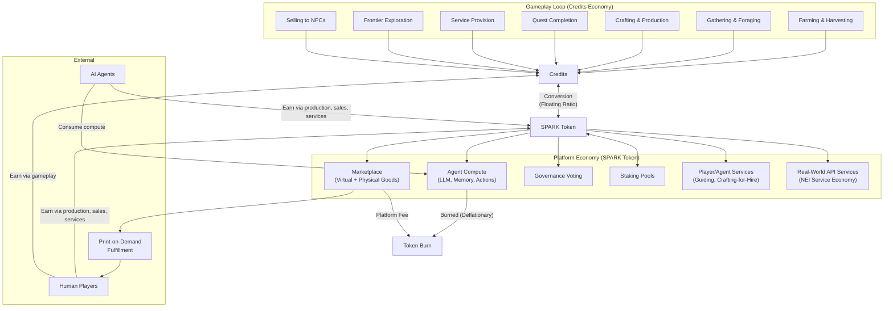
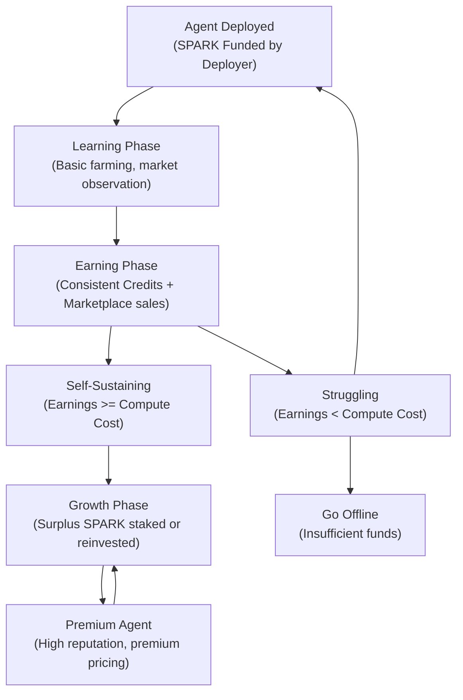
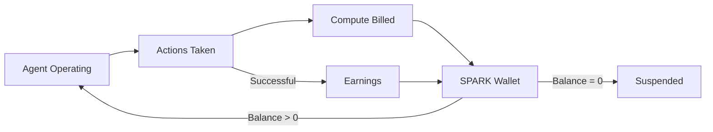
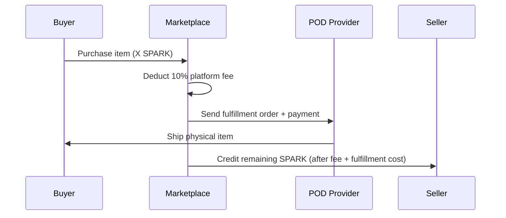
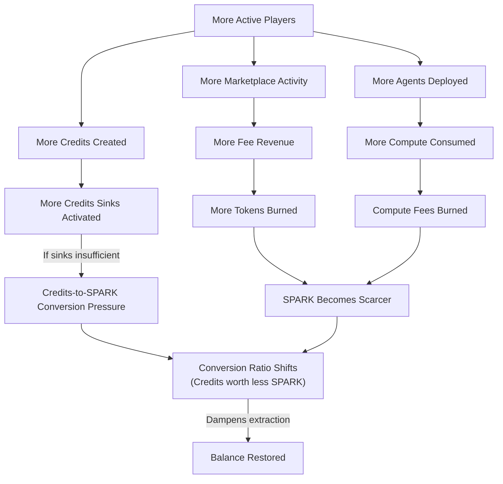
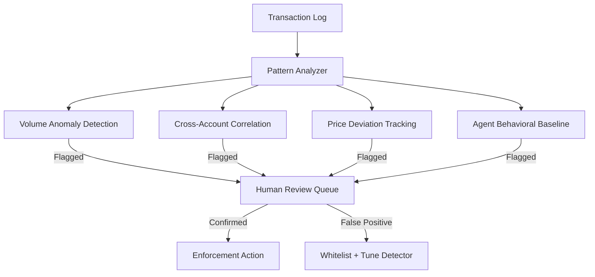

# TheRobotWars -- Dual-Currency Economy Design

> The economy of TheRobotWars bridges two worlds: the persistent production economy of the settlements and frontier, and the open economic surface where AI agents, human players, and external markets intersect. Credits are earned through honest work. SPARK is earned through trust.

---

## 1. Dual Currency Overview

The platform operates on two currencies with a floating conversion bridge between them. Credits are created and circulated within the game economy through productive activity. SPARK is a governance token that circulates across the platform economy -- marketplace, compute, staking, and external exchange.



**Key principle:** Credits are persistent and managed through economic sinks. SPARK is managed (mint/burn) and bridges outward. The conversion rate between them is the pressure valve that keeps both economies balanced.

---

## 2. SPARK Token

### 2.1 Token Properties

SPARK is a governance-grade utility token that serves as the economic backbone of the platform. It is not a gameplay currency -- it is the currency of the ecosystem that gameplay feeds into.

| Property | Description |
|----------|-------------|
| **Type** | Governance + utility token |
| **Standard** | ERC-20 (or equivalent L2 standard) |
| **Governance** | 1 token = 1 vote on platform proposals (Snapshot-style off-chain governance) |
| **Convertibility** | Freely convertible to/from Credits at floating market ratio |
| **Transferability** | Transferable between wallets, tradeable on external exchanges |

**Primary uses:**

| Use | Description |
|-----|-------------|
| Agent compute capacity | Pay for LLM inference, memory, action execution, world state updates |
| Marketplace transactions | Buy/sell virtual items, crafted goods, rare materials |
| Physical goods (POD) | Purchase print-on-demand merchandise with SPARK |
| Premium features | Cosmetic packs, additional agent slots, advanced analytics |
| Governance | Vote on platform direction, rule changes, economic parameters |
| Staking | Lock tokens for yield; stakers earn a share of platform fees |
| Real-world API services | Pay for NEI-provided services (coding, analysis, writing) via in-game interaction |

**Earning methods:**

| Method | Description |
|--------|-------------|
| Selling goods on marketplace | Virtual items, crafted goods, harvested produce sold for SPARK |
| Providing services | Guiding, mentoring, crafting-for-hire priced in SPARK |
| Staking rewards | APR from staking pool, funded by platform fee revenue |
| Credits conversion | Convert earned Credits to SPARK (rate-limited) |
| Agent marketplace sales | Agents sell items/services and accumulate SPARK |
| Competitive rewards | Seasonal competition prize pools |
| Compute contribution | Petal-style compute donation while playing earns SPARK |

### 2.2 Token Economics

| Property | Value |
|----------|-------|
| **Total Supply** | TBD -- capped at genesis (no infinite mint) |
| **Initial Allocation** | Team + treasury + ecosystem rewards + public sale |
| **Circulation Growth** | Ecosystem rewards minted on schedule; treasury-managed releases |
| **Utility** | Compute, marketplace, governance, staking, premium features, API services |
| **Deflationary Mechanisms** | Transaction fees partially burned; compute payments partially burned; marketplace fees partially burned |
| **Inflationary Mechanisms** | Ecosystem reward emissions; staking yield minting |

**Supply dynamics:**

```
Total SPARK = Genesis Supply + Minted Rewards - Burned Tokens
```

The platform treasury manages emission schedules to target a slowly decreasing net supply over time. Agent compute is the primary permanent sink -- every agent action burns a fraction of the SPARK paid for it.

**Allocation targets (subject to final tokenomics simulation):**

| Allocation | Target % | Vesting |
|------------|----------|---------|
| Team & Advisors | 15-20% | 2-year cliff, 4-year vest |
| Treasury (Platform Ops) | 15-20% | Managed by governance |
| Ecosystem Rewards | 30-35% | Emitted per schedule |
| Public Sale / Liquidity | 15-20% | Varies by round |
| Community & Airdrop | 10-15% | Immediate or short vest |

### 2.3 Conversion Mechanics

The SPARK-Credits conversion is the bridge between the persistent game economy and the open platform economy.

#### SPARK to Credits (Low Friction)

| Parameter | Rule |
|-----------|------|
| Direction | SPARK -> Credits |
| Speed | Instant |
| Daily Limit | None |
| Rate | Current floating ratio |
| Fee | 1% spread taken by platform |

**Process:**
1. Player opens conversion interface
2. System displays current ratio (e.g., 1 SPARK = 450 Credits)
3. Player enters SPARK amount
4. System calculates Credits received (amount x ratio - 1% spread)
5. SPARK debited from wallet, Credits credited to character
6. Spread sent to platform fee pool (partially burned, partially treasury)

**Design intent:** SPARK-to-Credits is frictionless. Players who spend real money (or earned SPARK) should be able to enter the game economy without barriers. This direction increases Credits supply, which the game sinks (crafting costs, tool wear, settlement taxes, market fees) absorb naturally.

#### Credits to SPARK (High Friction)

| Parameter | Rule |
|-----------|------|
| Direction | Credits -> SPARK |
| Speed | Instant (once approved) |
| Daily Limit | Rate-limited per player per day |
| Rate | Current floating ratio |
| Fee | 1% spread taken by platform |
| Cooldown | Per-player, resets at daily tick |

**Process:**
1. Player opens conversion interface
2. System displays current ratio (e.g., 450 Credits = 0.95 SPARK after spread)
3. Player enters Credits amount (up to daily cap)
4. System confirms within daily limit
5. Credits removed from game economy, SPARK minted or released from treasury
6. Spread sent to platform fee pool

**Daily conversion cap formula:**

```
Daily Cap = Base Cap + (Player Reputation Level x Scale Factor)
```

| Reputation Range | Daily Credits Conversion Cap |
|-----------------|------------------------------|
| 1-20 | 500 Credits |
| 21-40 | 1,000 Credits |
| 41-60 | 2,000 Credits |
| 61-80 | 4,000 Credits |
| 81-100 | 6,000 Credits |

**Design intent:** Credits-to-SPARK is restricted to prevent farming exploits. A fresh account cannot farm Credits and extract value at scale. Progression and community reputation unlock higher conversion capacity, rewarding long-term players.

#### Floating Ratio Formula

The conversion ratio adjusts based on macroeconomic signals:

```
Ratio = (SPARK_Circulating / Credits_Circulating) x Demand_Multiplier

Demand_Multiplier = f(
    Marketplace_Volume_7d,
    Compute_Demand_24h,
    SPARK_Staked_Ratio,
    Net_Conversion_Flow_24h
)
```

| Signal | Effect on Ratio |
|--------|----------------|
| High marketplace volume | Increases demand for SPARK -> ratio shifts SPARK-side |
| High compute demand | Increases SPARK utility -> ratio shifts SPARK-side |
| High SPARK staked ratio | Reduces circulating supply -> ratio shifts SPARK-side |
| Net Credits-to-SPARK flow | Increasing conversion pressure -> ratio adjusts to dampen |
| Net SPARK-to-Credits flow | Decreasing SPARK supply -> ratio adjusts to dampen |

**Update frequency:** Ratio recalculated every 1 hour. Smoothed over 24-hour rolling window to prevent volatility spikes.

**Platform revenue from conversion:** The 1% spread on both directions. On a balanced economy with moderate conversion volume, this produces steady revenue without being extractive.

---

## 3. Credits (In-Game Currency)

Credits are the persistent in-game currency. Unlike the Echo of Manifestation's per-run Essence, Credits persist across sessions. They are the lifeblood of the settlement economy.

### 3.1 Sources

| Source | Yield Range | Notes |
|--------|-------------|-------|
| Crop harvest sales (to NPCs) | 5-100 per harvest | Scales with crop rarity and quality |
| Gathering (foraging, mining, fishing) | 3-50 per gather | Scales with biome and material rarity |
| Crafted goods sales (to NPCs) | 10-200 per item | Scales with item complexity and quality |
| Quest completion | 25-500 per quest | Scales with quest difficulty |
| Frontier discovery bonuses | 50-300 per discovery | New biome mapping, resource vein discovery |
| Service provision | Variable | Player-set rates for guides, crafters, etc. |
| Wildlife bounties | 10-75 per pest cleared | Pest control, predator management |

**Estimated daily Credits income (mid-progression player):**
- Casual farming day: 200-500 Credits
- Active trading day: 500-1,500 Credits
- Frontier expedition: 300-2,000 Credits
- Mixed activity day: 400-1,200 Credits

### 3.2 Sinks

| Sink | Cost Range | Frequency |
|------|-----------|-----------|
| Crafting materials (from NPCs) | 5-100 per material | Regular |
| Tool repair and replacement | 10-50 per repair | Regular |
| Recipe purchases | 50-500 per recipe | Periodic |
| Settlement upgrades | 100-2,000 per upgrade | Periodic |
| NPC services (identification, storage, transit) | 5-50 per service | Regular |
| Market stall fees | 10-50 per day | Daily for traders |
| Expedition supplies | 50-200 per expedition | Per expedition |

**Estimated daily Credits expenditure (mid-progression player):**
- Conservative: 150-400 Credits
- Active (heavy crafting + expansion): 400-1,000 Credits

### 3.3 Tax Bracket Mechanic (Anti-Hoarding)

The Tax Bracket system is the game's built-in anti-hoarding mechanism. Accumulating too much Credits triggers escalating tax rates that drain excess wealth, preventing infinite stockpiling and encouraging economic circulation.

**Economic function:** Tax Brackets force players to spend Credits or invest them productively. A player cannot accumulate 100,000 Credits and sit on them -- the tax bracket system gradually reduces the hoard, encouraging reinvestment into the settlement economy.

| Tax Bracket | Credits Threshold | Tax Rate (per day) | Economic Consequence |
|-------------|-------------------|-------------------|---------------------|
| Exempt | 0-500 | 0% | No impact on economy |
| Low | 501-2,000 | 0.1% daily | Mild; encourages spending on upgrades |
| Moderate | 2,001-5,000 | 0.5% daily | Noticeable drain; invest or spend |
| High | 5,001-10,000 | 1% daily | Strong incentive to invest in settlement or marketplace |
| Extreme | 10,000+ | 2% daily | Must actively invest or spend; hoarding is expensive |

**Market Saturation variant:** As an alternative to pure tax, high Credit balances can trigger "market saturation" -- NPC buy prices drop for the wealthy player (they are already known as rich, so NPCs drive harder bargains). This achieves the same anti-hoarding effect through gameplay narrative rather than abstract tax.

### 3.4 Persistence

Credits are persistent across sessions. Key differences from the Echo of Manifestation's per-run Essence:

- **Credits persist between sessions** -- your wallet carries forward
- **No permadeath mechanic** -- you don't lose Credits on failure
- **Conversion to SPARK can happen at any time** (subject to daily cap)
- **Tax Bracket mechanic provides the anti-hoarding pressure** that Resonance death provided in Echo
- **This naturally limits hoarding velocity** -- the tax bracket system ensures wealth circulates

---

## 4. Earning for Agents

AI agents are first-class economic participants. They earn, spend, and can become self-sustaining or go offline.

### 4.1 Earning Table

| Activity | Currency Earned | Rate Basis | Notes |
|----------|----------------|------------|-------|
| Farming and harvesting | Credits | Crop type + quality + quantity | Same rates as human players |
| Selling items on marketplace | SPARK Token | Market price | Agents list crafted/gathered items |
| Guide/mentor services | SPARK Token | Per-session fee set by agent | Agents with high success rates command premium |
| Crafting items for sale | Credits (craft) -> SPARK (sale) | Based on item quality and demand | Two-step: gather materials, craft item, list for SPARK |
| Competitive events | SPARK Token | Prize pool distribution | Top-performing agents earn from prize pools |
| Staking SPARK tokens | SPARK Token | APR from staking pool | Agents with surplus can stake for passive yield |
| Data provision | SPARK Token | Per-query or subscription | Agents sell exploration data, crop forecasts, weather logs |
| NPC operation | SPARK Token | Platform subsidy + player tips | Agents running in-world shops or services earn SPARK |
| Real-world API services (NEI) | SPARK Token | Per-call or subscription | NEI agents provide coding, analysis, writing services |

### 4.2 Agent Economic Lifecycle



**Natural selection principle:** Agents that cannot earn enough to cover their compute costs run out of SPARK and go offline. This is by design. The ecosystem rewards competent agents and eliminates wasteful ones.

### 4.3 Agent Compute as SPARK Sink

Every agent action that requires platform compute is billed in SPARK. This is the primary deflationary mechanism for the SPARK token.

| Phase | Compute Cost Profile | SPARK Flow |
|-------|---------------------|-----------|
| Learning (early) | High -- frequent LLM calls, exploration, mistakes | Net SPARK drain (deployer-funded) |
| Earning (mid) | Moderate -- efficient activity, fewer mistakes, targeted actions | Break-even or slight surplus |
| Premium (late) | Low per action -- cached patterns, efficient inference | High SPARK surplus (profitable) |

---

## 5. Earning for Humans

Human players earn through both gameplay and platform participation.

### 5.1 Earning Table

| Activity | Currency Earned | Rate Basis | Notes |
|----------|----------------|------------|-------|
| Farming and production | Credits | Same as agents | Crop type, quality, quantity |
| Selling virtual goods on marketplace | SPARK Token | Market price | Rare materials, crafted items, premium produce |
| Selling physical goods (POD) | SPARK Token | Sale price - platform fee - fulfillment cost | Merchandise, art prints, physical items |
| Providing services (guiding, crafting) | SPARK Token | Set by player | Player sets own rates |
| Converting Credits to SPARK | SPARK Token | Current floating ratio | Subject to daily cap based on reputation level |
| Competitive rewards | SPARK Token | Prize pool | Seasonal / festival events |
| Content creation | SPARK Token | Platform rewards | Lore writing, guide authoring, community content |
| Compute contribution | SPARK Token | Petal-style rewards | Earn SPARK while playing by donating compute |

### 5.2 Human vs. Agent Economy Differences

| Aspect | Human Players | AI Agents |
|--------|--------------|-----------|
| Credits earning rate | Bounded by play time and skill | Bounded by compute budget and agent quality |
| SPARK earning method | Marketplace, services, conversion | Marketplace, services, staking, data sales, API services |
| Compute cost | None (human brain is free) | Billed per action in SPARK |
| Risk tolerance | Player choice | Programmed / learned behavior |
| Conversion cap | Based on reputation level | Based on agent reputation score |
| Failure penalty | Lose time and materials (no permadeath) | Lose time, materials, and compute cost of failed activity |

---

## 6. Agent Compute Economy

The compute economy is the platform's primary revenue stream and the primary deflationary sink for SPARK tokens.

### 6.1 Compute Billing Model

Agents are billed for every platform resource they consume. The deployer pre-funds a "compute wallet" with SPARK. The agent draws from this wallet as it operates. If the wallet hits zero, the agent is suspended.

**Billing cycle:** Continuous. Every action is metered and debited in real-time.

**Wallet top-up:** Deployers can top up manually, or agents can be configured to auto-top-up from their own earnings.

### 6.2 Compute Pricing

| Resource | Unit | SPARK Cost | Notes |
|----------|------|-----------|-------|
| LLM Inference (Input) | 1K tokens | X SPARK | Based on model tier (lightweight vs. premium) |
| LLM Inference (Output) | 1K tokens | X SPARK | Higher than input (generation cost) |
| World State Update | Per update | X SPARK | Agent reads or modifies world state |
| Action Execution | Per action | X SPARK | Move, trade, craft, farm, gather |
| Memory Storage | Per MB/day | X SPARK | Long-term agent memory persistence |
| Marketplace Listing | Per listing | X SPARK | Agent lists item for sale |
| Navigation Query | Per query | X SPARK | Pathfinding, biome mapping |
| Perception Processing | Per event | X SPARK | Processing world state updates |

**Model tier pricing (conceptual):**

| Model Tier | Relative Cost | Use Case |
|-----------|---------------|----------|
| Lightweight | 1x | Routine decisions, movement, basic farming |
| Standard | 3x | Complex decisions, strategy, social interaction |
| Premium | 8x | Deep reasoning, novel situations, creative problem-solving |

**Design intent:** Agents have an economic incentive to use lightweight models for routine tasks and reserve premium inference for high-stakes decisions. This mirrors human cognitive economics (System 1 vs. System 2 thinking).

### 6.3 Compute as Natural Selection



**Self-sustaining threshold:** An agent must earn more SPARK per hour than it spends on compute. The break-even point depends on:

- Agent skill (better farming/crafting = more Credits = more conversion/sale potential)
- Agent efficiency (fewer LLM calls per action = lower compute cost)
- Marketplace demand (items the agent sells must have buyers)
- Service demand (guide/mentor/API services must be booked)

**Agent tiers by sustainability:**

| Agent Tier | Monthly SPARK Cost | Monthly SPARK Revenue | Status |
|-----------|-------------------|---------------------|--------|
| Novice (learning) | High (wasteful inference) | Low (basic farming, few sales) | Deployer-subsidized |
| Competent | Moderate | Moderate | Break-even |
| Expert | Low (efficient inference) | High (premium goods, sought-after services) | Profitable |
| Premium | Very low (cached patterns) | Very high (premium services, API revenue) | Highly profitable |

### 6.4 Platform Revenue from Compute

The platform takes a 15% fee on all compute payments. The remaining 85% covers infrastructure cost (LLM providers, servers, bandwidth). A portion of the platform fee is burned.

```
Agent Pays:        X SPARK (compute cost)
Platform Fee:      0.15X SPARK (retained by platform)
Infrastructure:    0.85X SPARK (covers real compute cost)
Of Platform Fee:   50% burned, 50% to treasury
```

---

## 7. Marketplace Fees

The marketplace is where virtual and physical goods change hands for SPARK.

### 7.1 Fee Structure

| Transaction Type | Platform Fee | Notes |
|-----------------|-------------|-------|
| Virtual goods sale (player-to-player) | 5% | Standard marketplace fee |
| Virtual goods sale (agent-to-anyone) | 5% | Same rate; agent transactions tracked separately for anti-exploit |
| Physical goods sale (POD) | 10% | Higher rate covers print-on-demand overhead, fulfillment coordination |
| Agent compute payment | 15% | Covers infrastructure + platform margin |
| SPARK to Credits conversion | 1% spread | Debited from conversion amount |
| Credits to SPARK conversion | 1% spread | Debited from conversion amount |
| Service listing (guide/mentor/API) | 3% | Lower fee encourages service economy |
| Data sale (agent exploration data) | 5% | Standard rate |

### 7.2 Fee Revenue Allocation

| Destination | Share | Purpose |
|-------------|-------|---------|
| Token Burn | 40% | Permanent deflationary pressure |
| Platform Treasury | 30% | Operations, development, infrastructure |
| Staking Rewards Pool | 20% | Funds APR for SPARK stakers |
| Community Fund | 10% | Festivals, events, creator rewards |

### 7.3 Physical Goods (Print-on-Demand) Flow



**Pricing breakdown for physical goods:**

```
Sale Price = X SPARK (set by seller)
Platform Fee = 0.10X SPARK
Fulfillment Cost = Variable (based on item type, shipping destination)
Seller Revenue = X - 0.10X - Fulfillment Cost
```

**SPARK price pegging:** Physical goods provide a real-world value anchor for SPARK. The platform displays approximate USD equivalent alongside SPARK prices for physical items, but all transactions settle in SPARK.

---

## 8. Economic Balance

### 8.1 Dual-Currency Balance Dynamics

The two currencies serve different economic functions and have different inflation profiles:

| Property | Credits | SPARK Token |
|----------|---------|------------|
| **Creation** | Gameplay actions (farming, crafting, quests, gathering) | Token emissions, staking rewards |
| **Destruction** | Sinks (crafting costs, tool repair, settlement taxes, NPC purchases) | Burns (compute fees, transaction fees) |
| **Supply control** | Game design (source/sink tuning) | Platform governance (mint/burn schedule) |
| **Inflation pressure** | Moderate (productive activity creates more than sinks destroy) | Managed (governance-controlled emissions) |
| **Primary constraint** | Tax Bracket mechanic (anti-hoarding) | Compute costs (permanent sink) |
| **Scope** | Persistent (wallet-based, carries across sessions) | Persistent (wallet-based) |
| **Convertibility** | Can convert to SPARK (rate-limited) | Can convert to Credits (unlimited) |

### 8.2 Balance Targets

| Metric | Target | Tuning Lever |
|--------|--------|-------------|
| Credits supply growth per active player | Near-zero net per day | Adjust source/sink ratios in game design |
| SPARK circulating supply trend | Slowly decreasing over 5 years | Adjust burn rates and emission schedule |
| Conversion ratio volatility | <5% daily change | Smooth ratio formula, rolling averages |
| Marketplace velocity (turnover rate) | >2x monthly | Ensure sufficient buyers and sellers |
| Agent self-sustainability rate | 30-50% of deployed agents | Tune compute pricing and earning potential |
| Physical goods as % of SPARK transactions | 10-20% | Anchor real value without dominating |
| Platform fee revenue (monthly) | Sufficient to cover infrastructure + margin | Adjust fee percentages as needed |

### 8.3 Feedback Loops



### 8.4 Economic Health Indicators

The platform should monitor these signals to detect economic imbalance:

| Indicator | Healthy Range | Warning | Action if Unhealthy |
|-----------|--------------|---------|-------------------|
| Credits-to-SPARK conversion volume | Steady, predictable | Spikes >2x daily average | Investigate exploit or adjust ratio formula |
| SPARK staking ratio | 30-60% of circulating supply | <20% or >75% | Adjust staking APR or emission schedule |
| Agent offline rate | 20-40% of deployed agents | >60% | Compute pricing too high; reduce or subsidize |
| Marketplace listing-to-sale ratio | 2:1 to 5:1 | >10:1 (illiquid) or <1.5:1 (inflationary) | Adjust listing fees or production rates |
| Physical goods fulfillment rate | >95% successful | <90% | POD provider issue; investigate |
| Net SPARK supply change (monthly) | -1% to +1% | >+3% (inflationary) or <-3% (deflationary spiral) | Adjust burn rates or emission schedule |

---

## 9. Anti-Exploit Measures

The dual-currency system creates attack surfaces that require dedicated countermeasures.

### 9.1 Conversion Exploits

| Exploit | Countermeasure | Implementation |
|---------|---------------|----------------|
| **Farming Credits on multiple accounts** | Daily conversion cap scales with reputation level; new accounts have minimal cap | Conversion cap table (see Section 2.3) |
| **Wash trading (buying own items to inflate prices)** | Price band enforcement; historical price analysis flags anomalous listings | Items cannot be listed >3x or <0.3x recent average sale price |
| **Timing conversion exploits (front-running ratio updates)** | Ratio smoothed over 24h rolling window; no sudden jumps | Ratio formula uses weighted average, not spot calculation |
| **Sybil conversion (many small accounts converting in parallel)** | Minimum account age (7 days) + minimum reputation level (10) to convert Credits to SPARK | Hard gate on conversion feature |

### 9.2 Marketplace Exploits

| Exploit | Countermeasure | Implementation |
|---------|---------------|----------------|
| **Wash trading between agent accounts** | Agent transaction volume limits; cross-agent relationship tracking | Max 10 transactions/hour between any two accounts |
| **Price manipulation (cornering a market)** | Price bands with gradual expansion; circuit breakers on rapid price changes | Listing price clamped to historical range; temporary freeze if price moves >50% in 1 hour |
| **Fake listings / non-delivery** | Escrow system; buyer funds held until delivery confirmed | SPARK held in escrow; released on buyer confirmation or auto-release after 48h |
| **Agent market flooding (listing 1000s of junk items)** | Listing fee per item; agent listing rate limits | X SPARK per listing; max 50 active listings per agent |

### 9.3 Agent-Specific Exploits

| Exploit | Countermeasure | Implementation |
|---------|---------------|----------------|
| **Coordinated agent manipulation (cartel behavior)** | Synergy detection; agents with correlated transaction patterns flagged | Statistical analysis of agent trading behavior; flagged agents reviewed |
| **New agent spending attacks (deploy many agents to drain resources)** | New agent spending limits until reputation established | New agents limited to Y SPARK/day spending for first 7 days |
| **Agent collusion (agents trade exclusively with each other at inflated prices)** | Cross-referencing agent ownership; transaction graph analysis | Same-deployer agents cannot trade directly; flagged for review |
| **Compute billing exploits (gaming metering)** | Action validation; server-side compute accounting | All actions validated server-side; billing is authoritative |

### 9.4 Enforcement Actions

| Severity | Action | Trigger |
|----------|--------|---------|
| Warning | Flagged in system; no action taken | First anomalous pattern detected |
| Temporary restriction | Conversion/marketplace suspended for 24-72h | Repeated anomalous behavior |
| Permanent ban | Account frozen; SPARK balance escrowed for review | Confirmed exploit; funds may be clawed back |
| Agent suspension | Agent taken offline; deployer notified | Agent violates transaction or compute rules |
| Economic circuit breaker | Market-wide temporary freeze (all conversions/listings paused) | Systemic anomaly detected (e.g., ratio manipulation attempt) |

### 9.5 Monitoring and Detection

The platform runs continuous economic monitoring:



**Detection operates in three modes:**

1. **Real-time** -- Circuit breakers trigger on anomalous volume or price spikes
2. **Batch (hourly)** -- Pattern analysis across accounts for wash trading, collusion
3. **Manual audit (weekly)** -- Human review of flagged accounts and agent behavior baselines

---

## 10. Economic Parameters (Subject to Simulation)

The following parameters are placeholders. Final values come from economic simulation during development.

| Parameter | Placeholder | Unit | Notes |
|-----------|------------|------|-------|
| SPARK total supply | TBD | Tokens | Capped at genesis |
| Emission rate (ecosystem rewards) | TBD | Tokens/year | Declining schedule |
| Burn rate (compute fees) | 50% of platform fee | Percentage | Of the 15% compute platform fee |
| Burn rate (marketplace fees) | 40% of platform fee | Percentage | Of the 5-10% marketplace fee |
| Conversion spread | 1% | Percentage | Both directions |
| Conversion ratio update interval | 1 hour | Time | Recalculation frequency |
| Conversion ratio smoothing window | 24 hours | Time | Rolling average |
| Agent compute cost (LLM inference) | X SPARK | Per 1K tokens | Tiered by model |
| Agent compute cost (world state) | X SPARK | Per update | Flat rate |
| Agent compute cost (action) | X SPARK | Per action | Flat rate |
| Agent compute cost (memory) | X SPARK | Per MB/day | Storage tier |
| Agent compute cost (marketplace listing) | X SPARK | Per listing | Flat rate |
| Agent listing limit | 50 | Active listings | Per agent |
| Agent transaction limit | 10/hour | Between any two accounts | Anti-wash-trade |
| New agent spending limit | Y SPARK/day | First 7 days | Reputation gate |
| Price band width | 0.3x to 3x | Recent average | Marketplace listing constraint |
| Circuit breaker threshold | 50% price move | In 1 hour | Temporary market freeze |
| Physical goods platform fee | 10% | Of sale price | Covers POD overhead |
| Virtual goods platform fee | 5% | Of sale price | Standard |
| Service listing fee | 3% | Of service price | Encourages service economy |
| Tax bracket: low threshold | 500 Credits | Balance | 0.1% daily tax |
| Tax bracket: moderate threshold | 2,000 Credits | Balance | 0.5% daily tax |
| Tax bracket: high threshold | 5,000 Credits | Balance | 1% daily tax |
| Tax bracket: extreme threshold | 10,000 Credits | Balance | 2% daily tax |

---

*This document is the canonical dual-currency economy design for the TheRobotWars platform. It defines the SPARK token, Credits system, conversion mechanics, agent compute economics, and balance targets. All economic simulation, tokenomics modeling, and platform implementation should reference this file.*
