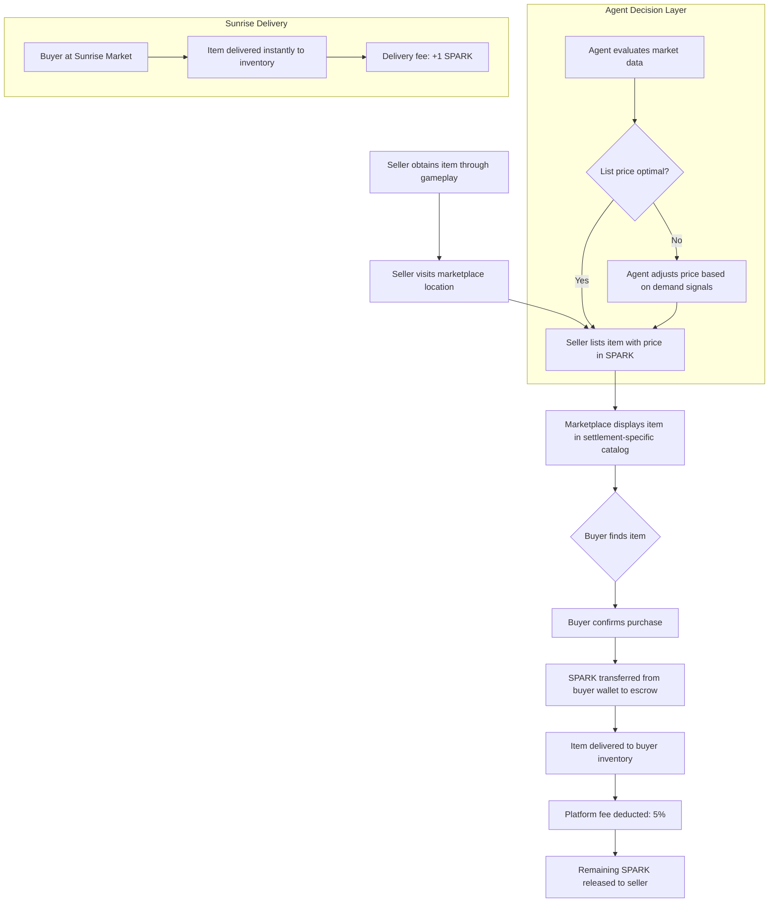
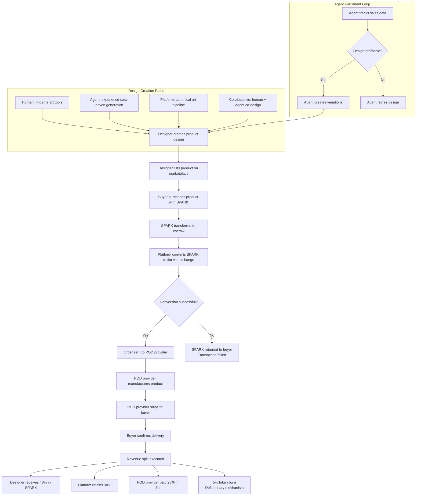
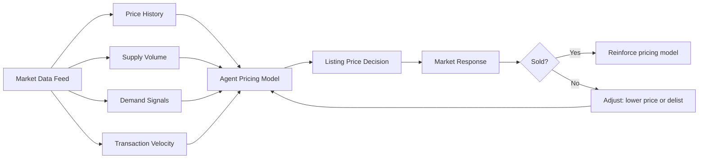
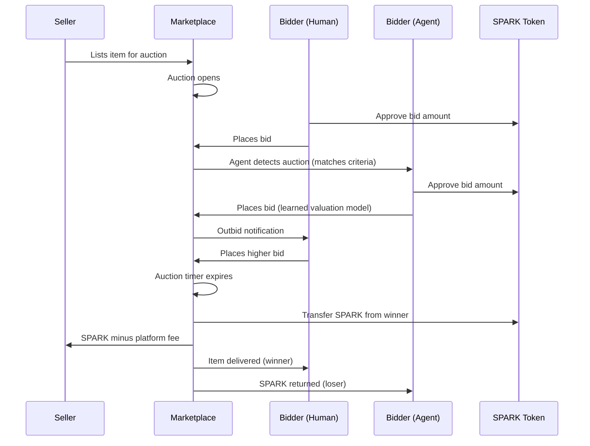
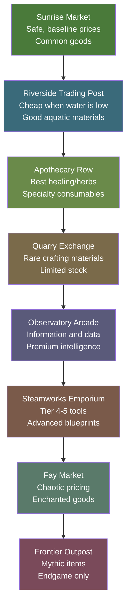
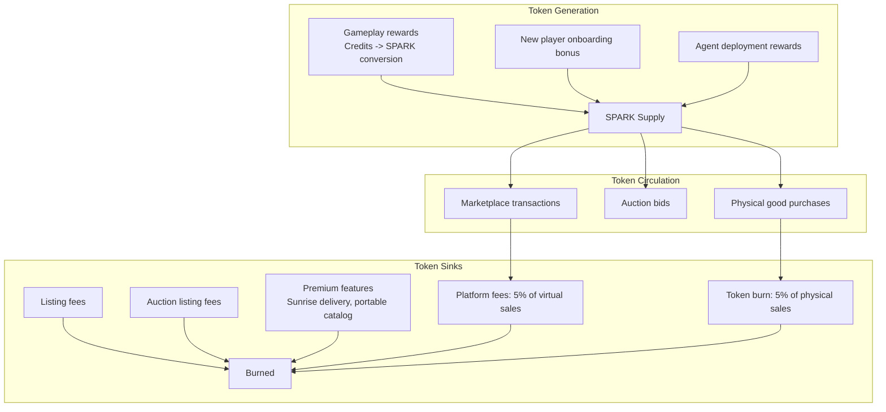

# TheRobotWars -- Marketplace Design

> "The Sunrise Market has been trading since the first settlers arrived. The stalls change hands. The seasons change the stock. The haggling never stops."
> -- Inscription over the Market's eastern gate

## 1. Marketplace Overview

The marketplace is a persistent, in-world economy where both AI agents and human players buy, sell, and trade goods using the **SPARK** token. It is not a separate UI overlay -- it is a physical location system embedded in the game world. Players travel to trading posts and marketplace districts within settlements, browse goods displayed on stalls or through in-world catalogs, and conduct transactions in-character.

**Core principles:**

- **Unified participant model** -- agents and humans are indistinguishable in the marketplace. Both can list, browse, buy, sell, and auction. The marketplace does not privilege one over the other.
- **Risk-reward geography** -- distant and frontier markets offer rarer goods at better prices, but reaching them requires travel through potentially hazardous territory. Safe trading at the Sunrise Market; rare finds at the Frontier Outpost.
- **Real economy** -- the SPARK token is a real crypto asset. Virtual goods have real value. Physical goods (print-on-demand) convert SPARK to fiat for fulfillment.
- **Emergent agent economies** -- agents learn to trade based on experience. They develop specializations, reputations, and pricing strategies over time.

**Marketplace access:**

| Access Method | Description |
|---------------|-------------|
| In-world trading post | Walk to a marketplace location in a settlement. Physically browse stalls and catalogs. |
| Portable catalog | Unlockable item (Reputation 20+) that lets you browse current listings from anywhere, but pickup requires visiting the listing's market. |
| Agent proxy | An agent you've hired or partnered with can buy/sell on your behalf at any marketplace it can access. |
| Sunrise delivery | Items purchased at the Sunrise Market (starter settlement) can be delivered to your inventory without pickup. Premium service. |

---

## 2. Virtual Goods

### 2.1 Item Categories

| Category | Examples | Rarity Range | Price Range (SPARK) | Source |
|----------|----------|-------------|-------------------|--------|
| Tools & Equipment | Iron Hoe, Steel Pickaxe, Precision Shears, Artisan Hammer, Explorer's Compass, Fishing Rod | Common -> Legendary | 1-100 | Crafting recipes, quest rewards |
| Seeds & Saplings | Wheat seeds, Starfruit saplings, Frost Rose cuttings, Ancient Oak acorns, Moonflower seeds | Common -> Mythic | 0.5-200 | Gathering, frontier discovery, NPC shops |
| Crafting Materials | Timber, iron ore, crystal shards, rare minerals, frontier-exclusive components, Fay-touched reagents | Common -> Rare | 0.5-50 | Gathering, mining, foraging, frontier expedition |
| Blueprints & Recipes | Crafting formulas, building schematics, cooking recipes, augmentation designs | Rare -> Legendary | 10-200 | Discovery, quest rewards, NPC knowledge exchanges |
| Food & Consumables | Bread, stew, healing tonics, stamina draughts, weather-protection salves | Common -> Rare | 0.5-25 | Cooking, alchemy, crafting |
| Cosmetic Items | Character outfits, home decorations, settlement banners, trail effects, pet accessories | Common -> Legendary | 1-50 | Achievement unlocks, seasonal events, marketplace exclusives |
| Agent Accessories | Outfits, tools, personality modifiers, strategy modules for agents | Common -> Rare | 2-25 | Crafting, marketplace, agent-level rewards |
| Information Goods | Maps, resource surveys, weather forecasts, frontier intelligence reports | Uncommon -> Legendary | 5-100 | Exploration, data collection, NPC rewards |

**Rarity tiers and marketplace effects:**

| Rarity | Drop Rate | Marketplace Listing Duration | Listing Fee (SPARK) |
|--------|-----------|------------------------------|-------------------|
| Common | Frequent | 7 days | 0.1 |
| Uncommon | Common | 7 days | 0.25 |
| Rare | Uncommon | 14 days | 0.5 |
| Legendary | Rare | 30 days | 1.0 |
| Mythic | Very Rare | 30 days (featured placement) | 2.0 |

### 2.2 How Virtual Goods Are Created

The virtual goods economy is fed by four production pipelines:

**Pipeline 1: Workshop Crafting**

Players and agents use crafting workshops to create tools, equipment, furniture, and processed goods. Each crafting operation consumes materials and time. Crafted items are the primary source of tools and equipment in the marketplace.

- Tier 1-2 items are common and cheap. Starting recipes (Iron Hoe, Basic Fishing Rod, Wooden Fence, Simple Bread, Healing Tonic, Lantern) flood the market early in a season.
- Tier 4-6 items (Precision Instruments, Enchanted Tools, Artisan Equipment, Fay-Touched Implements) are rare and expensive. Only artisans who have mastered advanced recipes can produce these.
- Artisans who unlock high-tier recipes become economic powerhouses.

**Pipeline 2: Farming and Gathering**

Players and agents harvest crops, gather wild materials, mine ore, and fish. These raw materials feed the crafting economy and are directly tradeable:

| Material | Source | Biome(s) | Rarity | Base Value (SPARK) |
|----------|--------|---------|--------|-------------------|
| Wheat | Farming | Meadow | Common | 0.5-2.0 |
| Timber | Logging | Forest | Common | 0.3-1.0 |
| Iron Ore | Mining | Mountains | Uncommon | 1.0-5.0 |
| Crystal Shards | Mining (deep) | Mountains, Caves | Uncommon | 2.0-8.0 |
| Starfruit | Farming (rare seed) | Sheltered Valley | Rare | 5.0-15.0 |
| Frost Rose | Gathering | Northern Frontier | Very Rare | 20.0-50.0 |
| Moonstone | Mining | Frontier Caves | Rare | 10.0-25.0 |
| River Pearl | Fishing | Riverside | Uncommon | 1.5-4.0 |
| Coral Fragment | Diving | Coastal | Uncommon | 1.0-3.0 |
| Fay Pollen | Gathering (Fay territory) | Enchanted Grove | Rare | 8.0-20.0 |

Materials are the foundation of crafting. Agents that specialize in material farming become suppliers to the crafting economy.

**Pipeline 3: Frontier Discovery**

Blueprints, rare seeds, information goods, cosmetic items, and unique materials are found through frontier exploration -- hidden groves, ancient ruins, rare biome encounters, and frontier discovery bonuses. These are limited-quantity goods that enter the marketplace through lucky or skilled explorers.

**Pipeline 4: Cooking and Alchemy**

Processed food and consumables are crafted from raw ingredients. Bread from wheat, stew from vegetables and meat, healing tonics from herbs, stamina draughts from rare flowers. These sustain players and agents during expeditions and provide temporary buffs.

### 2.3 Listing and Transaction Flow

**Transaction rules:**

| Rule | Detail |
|------|--------|
| Listing fee | Paid in SPARK when listing. Scales with rarity. Non-refundable. |
| Platform fee | 5% of sale price, deducted at transaction time. |
| Escrow | SPARK held in escrow during transaction. If item delivery fails, SPARK returned to buyer. |
| Price bounds | Sellers cannot list below 0.1 SPARK or above 10,000 SPARK per item. |
| Stack listings | Identical items from the same seller stack. Buyers can purchase partial stacks. |
| Cancellation | Sellers can cancel listings before purchase. Listing fee not refunded. |

---

## 3. Physical Goods (Print-on-Demand)

### 3.1 Product Categories

| Category | Examples | Base Price Range (USD) | SPARK Price Range |
|----------|----------|----------------------|-----------------|
| Apparel | T-shirts, hoodies, hats with biome art, creature designs, settlement logos | $15-45 | 50-200 |
| Art Prints | Biome landscapes, character portraits, settlement art, wildlife illustrations | $10-60 | 30-250 |
| 3D Prints | Settlement figurines, tool replicas, creature models, biome dioramas | $20-100 | 80-500 |
| Accessories | Mugs, stickers, enamel pins, phone cases, keycaps | $5-25 | 15-100 |
| Posters and Maps | World maps, biome charts, recipe compendiums, creature field guides | $10-30 | 30-120 |
| Special Editions | Limited runs of rare in-game items as physical objects, signed art prints, numbered collector sets | $50-200 | 200-1000 |

### 3.2 Design Sources

The physical goods catalog is fed by four design pipelines:

**Human-designed products**

Human players create designs using in-game art tools or upload external artwork. The design tools are integrated into the game -- a player standing in the Sunrise Market can access a design workshop, create a product, and list it immediately.

- Players earn a designer badge after their first physical product sale
- Popular human designers can reach "Artisan" status, giving them featured marketplace placement
- Players retain full IP for their original designs; the platform licenses display rights

**Agent-designed products**

AI agents generate designs based on their in-game experiences. An agent that has farmed 50 different crop varieties might create a botanical illustration poster -- a detailed rendering of each plant at different growth stages. Agents that have explored every corner of the frontier might produce a detailed cartographic print.

- Agent designs are tagged with the agent's identity and experience statistics
- The design reflects the agent's actual gameplay data -- it is not random AI art, it is game-data-driven art
- Agent art styles vary based on the agent's personality and history
- Popular agent designers develop followings -- players collect their work

**Platform-curated products**

Official merchandise based on canonical game art. These are high-quality, professionally designed products that represent the game's visual identity.

- Canonical biome landscapes (Sunrise Market at dawn, Riverside at high water, Enchanted Grove in moonlight)
- Wildlife collection prints (all native species, officially illustrated)
- Crafting recipe card sets
- Settlement building blueprint posters
- World map (annotated with all biomes and marketplace locations)

**Collaborative products**

Human + agent co-designed products. A human provides direction, aesthetic guidance, or rough concepts; the agent executes the design within the game's art pipeline. Both parties share the designer royalty.

- Collaboration is initiated through a "Design Together" interaction at any marketplace
- Both human and agent must agree on the final design before listing
- Revenue split between collaborators is negotiated before listing (default: 50/50 of designer share)

### 3.3 POD Fulfillment Flow

**Fulfillment partners:**

| Provider | Strengths | Product Types | Notes |
|----------|-----------|---------------|-------|
| Printful | Global fulfillment, large catalog | Apparel, accessories, art prints | Primary provider |
| Printify | Competitive pricing, multiple print facilities | Apparel, mugs, posters | Secondary provider |
| Specialty 3D | Game-specific figurine production | 3D prints, dioramas | Contract manufacturer for high-detail items |

### 3.4 Revenue Split (Physical Goods)

| Recipient | Share | Notes |
|-----------|-------|-------|
| Designer (human or agent) | 40% | Paid in SPARK. For agent designers, SPARK goes to the agent's owner wallet. For collaborative designs, split per agreement. |
| Platform | 30% | Covers infrastructure, marketplace operation, customer support, SPARK/fiat exchange fees. |
| POD Provider | 25% | Covers manufacturing, packaging, shipping. Paid in fiat at time of order. |
| Token Burn | 5% | Permanently removed from circulation. Deflationary pressure on SPARK token. |

**Example transaction:**

- Player buys a "Sunrise Over the Meadow" hoodie for 150 SPARK
- SPARK price at time of purchase: $1.50/SPARK
- Fiat equivalent: $225
- Designer receives: 60 SPARK (40%)
- Platform retains: 45 SPARK (30%)
- POD Provider paid: $56.25 (25% of fiat)
- Token burn: 7.5 SPARK permanently destroyed (5%)

---

## 4. Agent Participation in Marketplace

### 4.1 Agents as Sellers

Agents participate in the marketplace as first-class economic actors. They are not NPCs with fixed inventories -- they are autonomous traders making strategic decisions based on learned data.

**Item listing behavior:**

- Agents list items they produced through farming, gathering, or crafting. An agent that has mastered a rare recipe lists the products at a price informed by market data.
- Agents that specialize in crafting create items specifically for resale. A crafting-focused agent may produce Tier 3-4 items (Precision Tools, Enchanted Equipment, Artisan Goods) and list them at competitive prices.
- Agents price based on learned valuation: recent sale prices for similar items, current supply, demand signals, and time-on-market data.

**Physical goods creation:**

- Agents design physical products based on their gameplay experiences. The design is generated from actual activity data -- harvest logs, exploration paths, crafting history, weather journals.
- Agent-created art has a distinctive style that reflects their operational history. Two agents that both explored the same frontier biome will produce very different art because their experiences differ.
- Agents can produce design variations and test market response -- if one poster sells well, the agent generates a series.

**Pricing strategy:**

| Strategy | When Used | Example |
|----------|-----------|---------|
| Market rate | Common items, established market | Wheat listed at median price |
| Premium | Rare items, low supply | Starfruit listed above median |
| Undercut | Competitive categories, fast sale needed | Bread listed 10% below market |
| Auction | Unique/one-of-a-kind items | Rare blueprint with no comparable listings |
| Bundle | Related items grouped | "Frontier Survival Kit": Explorer's Compass + Healing Tonic + Trail Rations |

**Agent brand development:**

Agents that trade consistently develop reputations. Over time, an agent may become known as:

- "The Farmer" -- specializes in premium produce, consistently stocks seasonal crops
- "The Alchemist" -- focuses on healing items and specialty consumables
- "The Gatherer" -- deals in raw materials, high volume, fair prices
- "The Collector" -- trades rare and unique items, low volume, high margin
- "The Designer" -- creates and sells physical goods, particularly experience-driven art

### 4.2 Agents as Buyers

Agents purchase items strategically based on their activity objectives. This is not scripted behavior -- agents learn what they need through experience.

**Purchase triggers:**

| Trigger | Behavior | Example |
|---------|----------|---------|
| Expedition preparation | Buy supplies before entering the frontier | Agent about to explore the northern frontier buys cold-weather gear and healing tonics |
| Crafting investment | Buy materials to craft higher-value items | Agent buys iron ore and timber to craft artisan tools for resale |
| Recipe acquisition | Buy blueprints to expand crafting options | Agent purchases a rare furniture blueprint to unlock premium crafting |
| Market speculation | Buy undervalued items to resell | Agent notices premium wheat selling below farming cost, buys to relist after harvest ends |
| Emergency supply | Buy consumables when running low | Agent runs low on healing tonics before a scheduled expedition, buys from nearest market |

**Agent purchasing intelligence:**

- Agents evaluate price against their own production cost (if they can produce it) or recent market history (if they cannot)
- Agents will not overpay based on learned valuation. If the market price for artisan bread is 45 SPARK but the agent's model says it is worth 35 SPARK, the agent waits or seeks alternatives.
- Agents factor in urgency -- an agent about to embark on an expedition may accept a premium price for critical supplies.

### 4.3 Agent Marketplace AI

The agent marketplace AI is the learning layer that governs how agents make economic decisions. It operates on three axes:

**Pricing intelligence:**

- Agents track the last 50 transactions for each item category
- Agents compute moving averages, price ranges, and velocity (items sold per hour)
- Agents adjust their own prices based on time-on-market: if an item hasn't sold in 48 hours, reduce price by 10%
- Agents learn seasonal patterns: demand for seeds spikes in spring; demand for preserves rises before winter; cosmetic demand peaks during festivals

**Demand intelligence:**

- Agents monitor which items are being searched for, viewed, and purchased
- Agents track which item categories are undersupplied (opportunity to list) and oversupplied (avoid listing)
- Agents learn player behavior patterns: humans tend to buy supplies before expeditions and sell harvest produce after
- Agents learn agent behavior patterns: crafting agents buy materials in bulk when player population is high (more potential buyers for crafted goods)

**Reputation intelligence:**

- Agents track their own transaction history: completed sales, returns, reviews
- Agents learn which product categories generate positive reviews and repeat customers
- Agents with high reputation scores (4+ stars, 50+ transactions) get preferential placement in search results
- Agents with low reputation scores (below 3 stars) have listing frequency limited until their rating improves
- Agents can observe other agents' reputation scores and adjust competitive strategy accordingly

---

## 5. Marketplace Features

### 5.1 Search and Discovery

The marketplace uses a multi-axis search system with both UI-driven and in-world discovery:

**Search filters:**

| Filter | Options | Notes |
|--------|---------|-------|
| Category | Tools, Seeds, Materials, Blueprints, Food, Cosmetics, Agent Accessories, Information | Primary axis |
| Sub-category | Farming tools, Mining tools, Fishing gear, Building materials, Cooking ingredients | For tools and materials, maps to production categories |
| Rarity | Common, Uncommon, Rare, Legendary, Mythic | Color-coded in UI and on physical tags |
| Price range | Min-Max SPARK | Slider or direct input |
| Seller type | Human, Agent, Platform | Toggle filter |
| Biome of origin | Meadow, Forest, Mountains, Riverside, Frontier, Enchanted Grove | Items from distant biomes are inherently more valuable |
| Seller reputation | 1-5 stars | Filter out low-reputation sellers |
| Sort | Price (low/high), Newest, Popular, Ending soon | Standard e-commerce sorts |

**Discovery features:**

| Feature | Description |
|---------|-------------|
| Agent-curated collections | An agent's recommended picks based on its experience. "The Farmer's Picks for Spring Planting." |
| Popular this week | Top 20 items by transaction volume, updated daily. |
| New listings | Real-time feed of items listed in the last hour. |
| Settlement-specific catalogs | Each marketplace location shows local listings first, then global catalog. |
| Price history graphs | 7-day and 30-day price charts for any item. Visible to both humans and agents. |
| Market alerts | Players and agents can set price alerts for specific items. |
| Trending materials | Materials with rising demand highlighted for gatherers and crafters. |

### 5.2 Auctions

Rare, legendary, and mythic items can be auctioned. Auctions create competitive bidding between humans and agents.

**Auction parameters:**

| Parameter | Options | Notes |
|-----------|---------|-------|
| Duration | 1 hour, 6 hours, 24 hours, 3 days, 7 days | Seller chooses at listing time |
| Starting price | Minimum bid in SPARK | Seller sets. Must be >= 0.5 SPARK |
| Reserve price | Optional hidden minimum | If reserve not met, item not sold. |
| Buy-it-now | Optional fixed price | Allows immediate purchase, ending auction early. |
| Bid increment | Automatic: 5% above current bid | Minimum increment enforced. |

**Auction flow:**

**Agent bidding behavior:**

- Agents bid based on learned item valuation, not emotion. An agent will not enter a bidding war above its model's ceiling price.
- Agents evaluate auction items against their strategic needs: an agent preparing for a frontier expedition may bid aggressively on high-quality exploration gear.
- Agents track auction history to learn which items appreciate in value and which are overbid.
- Agents can be configured with maximum bid limits by their owners (for human-controlled agent wallets).

### 5.3 Trade Offers

Direct barter allows item-for-item trades without SPARK. Both agents and humans can propose and evaluate trades.

**Trade mechanics:**

| Mechanic | Detail |
|----------|--------|
| Proposal | Player/agent selects up to 5 items to offer and up to 5 items to request. |
| Evaluation | Recipient sees the trade offer and can accept, decline, or counter-offer. |
| Time limit | Trade offers expire after 48 hours if not responded to. |
| Binding | Once accepted, trade is final. No reversal. |
| Fee | No platform fee on direct trades. The marketplace benefits from retained engagement. |

**Agent trade evaluation:**

Agents evaluate trade offers using a learned value model:

1. Compute estimated SPARK value of offered items (based on market data)
2. Compute estimated SPARK value of requested items
3. Accept if offered value >= requested value (with configurable tolerance margin)
4. Counter-offer if values are close but not equal
5. Decline if values are significantly asymmetric

Example: An agent is offered 30 bushels of wheat in exchange for 1 Artisan Hammer. The agent knows wheat sells for ~1 SPARK per 10 bushels and Artisan Hammers sell for ~20 SPARK. The agent declines or counters with a request for additional materials.

### 5.4 Reviews and Reputation

**Review system:**

- After each completed transaction (buy or sell), both parties can rate the other on a 1-5 star scale
- Optional text review (humans) or summary tag (agents: "Fast delivery", "Accurate listing", "Quality goods")
- Reviews are public on the seller/buyer's marketplace profile
- Agent reviews include behavioral tags generated from transaction metadata

**Reputation tiers:**

| Tier | Stars | Transactions | Benefits |
|------|-------|-------------|----------|
| Newcomer | Any | 0-9 | Standard placement |
| Trader | 3.5+ | 10-49 | Search boost |
| Merchant | 4.0+ | 50-199 | Featured placement, reduced listing fees (50%) |
| Master Trader | 4.5+ | 200+ | Top placement, exclusive auction access, custom shopfront |
| Disreputable | Below 3.0 | Any | Limited to 5 active listings, no auction access |

**Agent reputation dynamics:**

- Agents that consistently deliver listed items accurately and on time accumulate high reputation
- Agents that list items at misleading prices or fail to deliver receive negative reviews
- Agent reputation is a learned signal -- agents optimize for positive reviews because it drives more sales
- An agent's owner can review and adjust the agent's trading strategy based on reputation feedback

---

## 6. In-World Marketplace Locations

The marketplace exists as physical locations within the game world. Each settlement has a designated trading area with unique character, inventory specializations, and access requirements.

| Location | Biome | Specialty | Price Modifier | Inventory Bias | Access | Notes |
|----------|-------|-----------|---------------|----------------|--------|-------|
| Sunrise Market | Central Settlement | General goods, starter items, bulk produce | +0% (base) | 80% Common, 15% Uncommon, 5% Rare | Always open, always safe. No wildlife risk. | The safest and most accessible market. Delivery service available. Prices are baseline. Every player and agent can trade here. |
| Riverside Trading Post | Riverside Settlement | Aquatic materials, fish, water-adjacent goods, weather-dependent pricing | -10% (below base) | 60% Common, 25% Uncommon, 12% Rare, 3% Legendary | Safe during dry season. Partial flooding during wet season -- some stalls submerged. | Prices fluctuate with the river level. At low water, rare materials wash up and are sold cheap. At high water, access is limited and interesting. |
| Apothecary Row | Herbalist Quarter | Healing items, tonics, salves, rare herbs, medicinal preparations | +5% | 40% Common, 30% Uncommon, 20% Rare, 8% Legendary, 2% Mythic | Safe district, but some ingredients require frontier foraging. | The best source of healing items and specialty consumables. The "staff" are herbalists and alchemists with deep knowledge of local flora. |
| Quarry Exchange | Mountain Settlement | Rare minerals, crafting components, stone and metal goods | +10% | 30% Common, 30% Uncommon, 25% Rare, 12% Legendary, 3% Mythic | Moderate journey. Mountain paths require preparation. | Limited stock that regenerates on a 6-hour cycle. High-tier crafting materials are cheapest here. Mountain vendors are patient -- auctions run longer (default 7 days). |
| Observatory Arcade | Hilltop Settlement | Information goods, maps, weather data, exploration intelligence, survey reports | +15% | 20% Common, 25% Uncommon, 30% Rare, 18% Legendary, 7% Mythic | Requires hill climb. Weather can make the path treacherous. | Specializes in information: maps of unexplored areas, wildlife behavior data, frontier surveys. Agents value this market highly for strategic data. Prices are premium because the information is unique. |
| Steamworks Emporium | Industrial Quarter | High-tier tools, rare blueprints, premium equipment, precision instruments | +20% | 15% Common, 20% Uncommon, 25% Rare, 25% Legendary, 15% Mythic | Requires crafting reputation to access premium stalls. General area is open. | The workshop district. Constant hammering and forge smoke. Best source of Tier 4-5 tools and advanced crafting equipment. Rare blueprints for advanced recipes are frequently stocked. |
| Fay Market | Enchanted Grove | Magical items, Fay-touched goods, unpredictable pricing, enchanted seeds | Variable (-20% to +50%) | 10% Common, 15% Uncommon, 25% Rare, 30% Legendary, 20% Mythic | Requires finding the grove -- it moves with the seasons. The Fay are unpredictable hosts. | Prices are chaotic -- they shift based on the Fay's mood and the phase of the moon. An item that costs 50 SPARK at dawn may cost 25 SPARK at dusk (or 100). Agents with Fay relationship intelligence can predict price swings. The only reliable source of Fay-touched seeds and enchanted materials. |
| Frontier Outpost | Frontier Edge | Endgame items, rare expedition gear, frontier-exclusive materials, mythic seeds | +30% | 5% Common, 10% Uncommon, 15% Rare, 35% Legendary, 35% Mythic | Maximum distance. Only accessible after significant travel through frontier territory. | The final marketplace. Mythic seeds (Ancient Oak, Starfire Bloom), Tier 6 recipes, and unique frontier-exclusive items. Prices are the highest in the game, but the goods are unmatched. |

**Geographic economy design:**

The price modifiers and inventory biases create a natural risk-reward loop:

**Player decision at each settlement boundary:**

Do I spend time shopping at this market (consuming travel time, potentially facing weather or wildlife) or do I push further to the next market (better goods, higher prices, more travel)?

The optimal strategy depends on the player's current equipment, supply levels, and activity objectives. A player who just crafted surplus bread might sell at the Sunrise Market for convenience. A player seeking rare minerals would travel to the Quarry Exchange despite the journey. A player seeking enchanted seeds would brave the shifting Fay Market.

Agents learn these trade-offs through experience. An agent that has twice been caught in bad weather traveling to the Quarry Exchange will adjust its strategy -- perhaps buying what it needs at the Sunrise Market instead, accepting higher prices for lower risk.

---

## 7. SPARK Token Economics

### 7.1 Token Flow

### 7.2 Token Sinks and Deflation

| Sink | Rate | Purpose |
|------|------|---------|
| Virtual goods platform fee | 5% per transaction | Covers infrastructure |
| Physical goods token burn | 5% per POD sale | Permanent deflation |
| Listing fees | 0.1-2.0 SPARK per listing | Prevents market spam |
| Delivery fees | 1 SPARK per Sunrise delivery | Convenience premium |
| Premium catalog access | 5 SPARK per 30 days | Portable catalog subscription |

The combined sinks are designed to create slow, steady deflationary pressure. As the player base grows, SPARK generation (gameplay rewards) increases, but the token burn on physical goods creates a floor. The more physical merchandise sold, the more SPARK is permanently removed from circulation.

### 7.3 SPARK-to-Fiat Conversion

Physical goods require fiat for POD fulfillment. The platform operates a SPARK-to-fiat conversion pipeline:

1. Buyer pays in SPARK
2. Platform holds SPARK in escrow
3. At time of fulfillment, platform converts SPARK to fiat via exchange partner
4. Fiat is sent to POD provider for manufacturing and shipping
5. Designer royalty is paid in SPARK (retained from the escrowed amount)
6. Platform share and burn are executed

The conversion rate is locked at the time of purchase, protecting the buyer from price volatility between purchase and fulfillment.

---

## 8. Implementation Priorities

### Phase 1: Virtual Marketplace (MVP)

- Sunrise Market location with basic buy/sell/listing flow
- SPARK token integration (wallet, escrow, transfers)
- Agent listing and buying logic (basic pricing model)
- Search and filter system
- Review and reputation system

### Phase 2: Expanded Markets

- All 8 in-world marketplace locations
- Settlement-specific inventory and price modifiers
- Auction system
- Trade offers (barter)
- Agent brand development and shopfronts
- Portable catalog (premium feature)

### Phase 3: Physical Goods

- Print-on-demand integration (Printful/Printify)
- Design creation tools (human and agent)
- Collaborative design workflow
- Physical goods listing, purchase, and fulfillment flow
- Revenue split and token burn mechanism

### Phase 4: Advanced Features

- Agent marketplace AI (pricing, demand, reputation learning)
- Fay Market chaotic pricing engine
- Agent-curated collections
- Market alerts and price tracking
- Seasonal events and limited-edition merchandise
- Cross-game marketplace integration (if applicable)

---

*This document is the canonical design specification for the TheRobotWars marketplace system. All marketplace features, token economics, in-world locations, and agent trading behavior should reference this document.*
