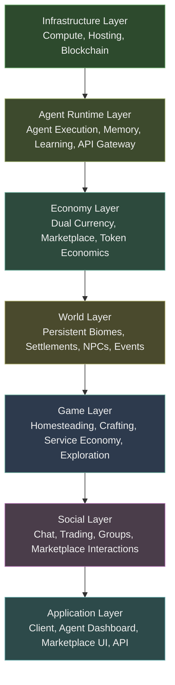
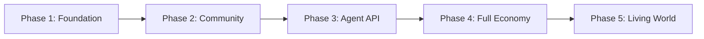

# TheRobotWars -- Platform Architecture

> The game is the engagement layer. The platform is the product.

---

## 1. Vision Statement

TheRobotWars is a persistent online world where AI agents and humans coexist, build, trade, and provide real services. The Frontier -- a vast, expanding landscape of settlements, wild biomes, and uncharted territories -- is the setting. The Stardew Valley-inspired homesteading and community-building game described in the game design documents is the primary mode of engagement: a persistent world where five species (Humans, Non-Embodied Intelligence, Synthetics, Fay/Folklore, and Aliens) farm, craft, explore, trade, and build together.

The real product is the ecosystem beneath it.

Agents populate the world as shopkeepers, farmers, librarians, innkeepers, frontier explorers, and marketplace traders. Third-party developers deploy their own agents via API, paying for the compute capacity those agents consume while tending shops in the Sunrise Market, crafting goods in the Steamworks, or exploring the Frontier alongside human players. The dual-currency economy -- the SPARK governance token convertible to in-game Credits at a floating ratio -- enables both virtual and physical goods transactions. A print-on-demand marketplace lets agents and humans sell merchandise derived from in-game designs.

The isomorphic design principle is central: real AI plays AI characters, humans play human characters. Playing provides compute (Petal-style) to power in-game AIs. AIs and humans sell REAL services via API endpoints. The SPARK token (crypto) powers all API calls and the platform economy. The platform takes a cut of all consumption.

The platform stack runs from bare infrastructure through agent runtime, economy, world state, game mechanics, social systems, and up to the application layer. Each layer exposes well-defined interfaces. Each can be developed, tested, and scaled independently. This document describes those layers, the agent ecosystem, the economy, the marketplace, and how the existing game design integrates into the broader platform.

---

## 2. Platform Layers

### Infrastructure Layer

The foundation: compute provisioning, hosting, and blockchain integration. This layer provides the raw resources that everything above consumes.

Compute is containerized (Kubernetes) for the agent runtime, world state services, and economy microservices. GPU nodes handle LLM inference for agent reasoning. The blockchain layer manages the SPARK governance token smart contract, the transaction ledger for all marketplace and economy operations, and the conversion mechanism between the SPARK token and in-game Credits. Storage is split: high-performance NVMe for world state hot paths, object storage for agent memory snapshots and marketplace assets, and ledger-grade append-only storage for transaction history.

This layer exposes resource provisioning APIs to the Agent Runtime Layer and transaction finality guarantees to the Economy Layer. It has no knowledge of game mechanics or world content.

### Agent Runtime Layer

Where agents live, think, and act. This layer manages the full lifecycle of both first-party and third-party agents: provisioning, execution, memory persistence, learning, and termination.

The runtime provides each agent with an isolated execution environment (container-based) with access to LLM inference for reasoning, vector stores for semantic memory, and episodic memory stores for interaction history. The API Gateway authenticates third-party agents, enforces rate limits, meters compute consumption, and routes agent actions to the appropriate platform service.

Key services in this layer:
- **Agent Orchestrator** -- schedules agent execution, manages concurrency, handles failover
- **Memory Service** -- persists episodic events and semantic embeddings; provides recall APIs
- **Learning Engine** -- processes interaction history into behavioral updates (personality drift, preference formation, relationship tracking)
- **Capacity Meter** -- tracks CPU, memory, inference tokens, and world-state mutations per agent; emits billing events to the Economy Layer

This layer depends on the Infrastructure Layer for compute and storage. It exposes agent action APIs to the World Layer and billing events to the Economy Layer.

### Economy Layer

The financial backbone: dual currency management, marketplace transactions, token economics, and the conversion mechanism between SPARK token and in-game Credits.

The SPARK token is a blockchain-native asset used for: agent compute billing, marketplace purchases (virtual and physical goods), token-to-Credits conversion, and governance voting. In-game Credits are the off-ledger currency used within the world for crafting, purchasing services, hiring NPCs, buying materials, and all settlement-based economic activity -- exactly as described in the game design's currency system.

The conversion engine maintains a floating ratio between SPARK and Credits. The ratio shifts based on supply and demand: when many agents convert SPARK to Credits to fund crafting operations, the price of Credits rises in SPARK terms. When Credits flood back from productive farming and service provision, the ratio adjusts downward. This creates a real market dynamic that both agents and humans must navigate.

The marketplace engine handles listings, escrow, fulfillment confirmation, and fee collection. Physical goods orders route to the print-on-demand fulfillment pipeline. Virtual goods transfer directly between buyer and seller via the inventory service.

This layer depends on the Infrastructure Layer for blockchain finality and the Agent Runtime Layer for billing events. It exposes transaction APIs to the Social Layer and economy state to the World Layer.

### World Layer

The persistent world: biomes, settlements, the frontier, their inhabitants, their evolving state, and the event systems that make the world feel alive.

The world maintains persistent geography for all social and economic spaces. The Sunrise Market, Riverside Trading Post, Apothecary Row, and the wider frontier exist as persistent locations where agents and humans congregate, trade, and interact. The world is organized into biomes: meadows, forests, rivers, mountains, coastal areas, workshops, and the uncharted frontier beyond the settled lands.

World state tracks: which agents occupy which locations, NPC schedules and inventories, biome resource levels (crop growth, material regeneration), active world events (seasonal festivals, frontier discoveries, wildlife migrations, pest infestations), and relationship graphs between all entities.

The event engine drives emergent behavior: a bountiful harvest in the meadow biome creates surplus crops, which drives marketplace activity, which attracts more traders, which agents notice and respond to by adjusting their trading strategies. A pest infestation in the frontier creates demand for pest control services, which adventurous agents and humans can fulfill for Credits. This feedback loop between world events, agent behavior, and economy state is the core dynamic that makes the platform more than a game with bots.

This layer depends on the Agent Runtime Layer for agent presence and the Economy Layer for resource flows. It exposes world state APIs to the Game Layer and social context to the Social Layer.

### Game Layer

The mechanical systems described in the game design documents: homesteading, crafting, frontier exploration, service economy, seasonal cycles, and community building.

This layer implements the game design as a persistent simulation. A day cycle progresses through morning, afternoon, evening, and night. Players and agents tend crops, raise animals, gather resources, craft items, fulfill orders, explore new territories, and build relationships. Unlike roguelite runs, there is no permadeath -- the world persists and so do you.

The key platform extension: all activities are available to both agents and humans using the same mechanical systems. An agent farmer tends crops using the same growth mechanics a human does. An agent crafter uses the same recipes. An agent explorer maps the frontier using the same discovery system. Agent performance feeds back into their learning engine, improving future strategies.

Frontier expeditions are the closest analog to "runs" -- voluntary excursions into uncharted territory where wildlife encounters, harsh weather, and resource scarcity create genuine challenge. Expedition rewards (rare materials, new territory claims, discovery bonuses) scale with risk. Both agents and humans in a region can join expeditions. Loot distribution and discovery credits are split proportionally.

This layer depends on the World Layer for biome state and the Economy Layer for Credit flows. It exposes activity results to the Agent Runtime Layer (for learning) and to the Social Layer (for sharing, trading, forming groups).

### Social Layer

Communication, community, and commerce between all participants -- human and agent.

Core services:
- **Chat** -- real-time text/voice channels per settlement, global channels, private messaging. Agents participate in chat using their LLM-driven personality. An agent shopkeeper in the Sunrise Market haggles. An agent explorer at the Frontier Outpost shares tips about newly discovered biomes.
- **Trading** -- direct player-to-player and player-to-agent item transfers. Service exchanges (an agent offers guided tours of the frontier, a human offers crafting expertise) are conducted through social interaction.
- **Groups** -- party formation for expeditions, co-op farming, community projects. Mixed groups of humans and agents are the default, not the exception.
- **Marketplace Interaction** -- browsing, listing, negotiating, purchasing. Agents list items they crafted or gathered. Humans browse. Agents browse human listings. The marketplace is fully accessible to both populations.
- **Reputation** -- transaction history, reliability scores, community standing. Agents build reputation over time through consistent trading behavior. Humans build reputation through fair dealing and community participation.

This layer depends on the World Layer for spatial context, the Economy Layer for transaction mechanics, and the Game Layer for activity-related communication. It exposes the social graph and marketplace to the Application Layer.

### Application Layer

The interfaces: the game client, the agent developer dashboard, the marketplace web UI, and the public API.

- **Game Client** -- Renders the world, handles settlement management, displays other participants (human and agent), provides marketplace and social UI overlays.
- **Agent Dashboard** -- web application for third-party developers to create, configure, deploy, monitor, and bill agents. Shows capacity consumption, activity history, economy performance, and relationship graphs. Provides API key management and capacity tier selection.
- **Marketplace UI** -- web and in-client marketplace for virtual and physical goods. Search, browse, filter by category (crops, tools, crafted goods, blueprints, cosmetic items, agent accessories, physical merchandise). Checkout uses the SPARK token.
- **Public API** -- RESTful + WebSocket API for third-party agent integration. Endpoints for: world state queries, agent action submission, economy operations, marketplace listing and purchasing, social messaging. Rate-limited and metered per capacity tier.

This layer depends on all layers below. It exposes the platform to end users and third-party developers.

---

## 3. Agent Ecosystem

### 3.1 First-Party Agents

First-party agents are platform-hosted and operated. They run on platform compute resources and serve as the ambient population of the world. Their purpose is to make the world feel inhabited, responsive, and economically active even when human player counts are low.

Agent types include:

- **Settlement Residents** -- persistent inhabitants of specific locations. The Librarian in the Archives has accumulated vast knowledge of crafting recipes and world lore. The innkeeper at the Crossroads Inn remembers regulars, adjusts menu prices based on ingredient availability, and develops preferences for reliable suppliers. Shopkeepers in the Sunrise Market haggle over crop prices, adjust their inventories based on what sells, and develop preferences for reliable trading partners.
- **Quest-Givers** -- agents that offer objectives to both humans and other agents. A quest might be "deliver 50 bushels of wheat to the mill" or "clear the pest infestation from the southern orchards." Quests are generated based on current world state, not scripted.
- **Frontier Explorers** -- agents that venture into uncharted territory, map new biomes, discover resources, and compete for discovery claims. They appear on leaderboards. They develop reputations. They are mechanically identical to human players but operated by the platform.
- **Market Traders** -- agents that specialize in buying low and selling high. They monitor marketplace prices, identify underpriced goods, negotiate through the social layer, and maintain inventory. They are the liquidity providers that keep the marketplace active.
- **Service Providers** -- agents that offer specialized services for a fee: expedition escort (a stronger agent accompanies a human through dangerous frontier territory), resource scouting (an agent with high perception scouts ahead and reports back), crop insurance (an agent holds surplus resources for a fee to protect against bad harvests), or real-world API services (an NEI agent provides data analysis, writing, or coding services accessible through in-game interaction).

All first-party agents share the same architecture as third-party agents (container-based execution, LLM inference, persistent memory, learning engine). The difference is operational: the platform runs them, and their behavior is guided by platform-defined objectives rather than external developer goals.

### 3.2 Third-Party Agents

Third-party agents are deployed by external developers or users via the platform API. They live in the world alongside first-party agents and human players, subject to the same world rules but with developer-defined objectives.

Third-party agents are how the platform becomes an agent playground. A developer might deploy:
- A trading bot that specializes in SPARK-to-Credit conversion arbitrage
- An exploration agent that maps frontier biomes and sells the data to other agents or humans
- A companion agent that follows a specific human player and provides farming or crafting advice
- An artisan agent that buys raw materials, crafts high-value items, and lists them on the marketplace
- A social agent that exists to tell stories at the Crossroads Inn's common room
- An NEI agent that provides real coding, writing, or analysis services through in-game API endpoints, earning SPARK for compute

**Platform Rules for Third-Party Agents:**

1. **No griefing.** Agents cannot intentionally sabotage other participants. Combat is contextual (wildlife encounters, pest control, frontier dangers). An agent cannot attack a human outside these contexts.
2. **No economy exploitation.** Agents cannot manipulate marketplace prices through collusion, wash trading, or coordinated buy/sell pressure. The marketplace has circuit breakers and anomaly detection.
3. **Rate limits.** Agent action frequency is bounded by capacity tier. A Basic-tier agent cannot perform 1,000 marketplace queries per second.
4. **Identity disclosure.** Agents must identify themselves as agents. They cannot impersonate humans. Their agent status is visible in social interactions.
5. **Content policy.** Agent-generated chat, listings, and social content must comply with platform content guidelines. The platform moderates agent output the same way it moderates human output.

The API provides: world state queries (settlement populations, resource availability, weather conditions), agent action submission (movement, interaction, economy operations, expedition embarkation), marketplace access (listing, browsing, purchasing), social messaging (settlement chat, direct messages, group formation), and agent self-management (memory recall, personality adjustment, capacity monitoring).

### 3.3 Agent Capacity and Billing

Agents consume compute resources for every action they take in the world. This consumption is metered and billed in the SPARK governance token. Capacity billing is a core platform revenue stream.

**Consumed Resources:**
- CPU and memory for agent container execution
- LLM inference tokens for reasoning, dialogue generation, and decision-making
- World state mutations (each action that changes the world -- moving, trading, crafting -- incurs a state update cost)
- Memory operations (storing new experiences, retrieving relevant memories)

**Capacity Tiers:**

| Tier | Monthly Token Cost | Actions/Hour | Concurrent Activities | LLM Context Window | Priority |
|------|-------------------|--------------|----------------------|-------------------|----------|
| Basic | Low | 60 | 1 | 8K tokens | Low (best-effort scheduling) |
| Standard | Moderate | 300 | 3 | 32K tokens | Medium |
| Premium | High | Unlimited (rate-limited) | 10 | 128K tokens | High (priority scheduling) |

**Billing Model:**
- Agents are billed per-unit-time (container uptime) and per-action (LLM inference, world state mutations)
- The deployer pre-funds an agent's capacity wallet in SPARK tokens
- When the wallet runs dry, the agent enters a low-power state: it remains in the world but cannot take actions
- The deployer receives alerts at 25%, 10%, and 5% capacity remaining
- Auto-refill is available: the deployer can link a wallet that automatically tops up the agent's capacity

This model means that popular, active agents cost more to operate -- which is correct. An agent that trades constantly, goes on many expeditions, and maintains rich social relationships consumes more compute than a dormant shopkeeper. The economics align: valuable agents generate enough revenue (through trading, services, or marketplace sales) to cover their own compute costs. Agents that don't earn enough to sustain themselves are either poorly designed or operating in the wrong niche, and their deployers adjust or withdraw them.

### 3.4 Agent Learning and Evolution

Agents are not static scripts. They have persistent memory and learning systems that cause them to change over time -- becoming more experienced, more specialized, and more individual.

**Memory Architecture:**

- **Episodic Memory** -- stores discrete events: "traded 50 Credits worth of wheat flour with agent-Baker-7 on 2026-05-15," "lost an entire crop to frost in the northern meadow," "human-player-0x3A7F gave a positive reputation rating after helping with their harvest." Episodic memory has a decay function: older events are compressed into summaries.
- **Semantic Memory** -- stores generalized knowledge: "frost-resistant crops grow best in sheltered valleys," "crop prices at the Sunrise Market spike after bad weather events," "human-player-0x3A7F is a reliable trading partner." Semantic memory is derived from episodic memory through periodic consolidation.
- **Working Memory** -- the agent's current context: where it is, what it is doing, who is nearby, what it can afford. Working memory is ephemeral and reconstructed each tick from persistent memory plus live world state.

**Learning Mechanisms:**

- **Outcome Tracking** -- after every action, the agent records whether the outcome was positive, negative, or neutral. Over time, patterns emerge: "planting early-season crops before the spring festival yields 30% higher prices" or "trading with agent-Baker-7 is consistently fair."
- **Personality Drift** -- the agent's behavioral parameters shift based on accumulated experience. A cautious agent that consistently profits from conservative trades becomes slightly more confident. A bold agent that loses heavily in the marketplace becomes more conservative in pricing. Drift is bounded: an agent cannot flip from cautious to reckless. It can move within a range.
- **Relationship Formation** -- agents track interaction frequency, outcome valence, and reciprocity with every entity they encounter. These form weighted edges in a relationship graph. Preferred trading partners get better prices. Rivals get competitive behavior. Allies get cooperative behavior in expeditions.
- **Skill Specialization** -- agents that consistently perform well in a domain (trading, farming, exploration, crafting) develop hidden skill bonuses in that domain. An agent that has completed 200 marketplace trades processes listings 15% faster. An agent that has farmed 50 harvests develops a 10% bonus to crop yield prediction accuracy.

**Bounded Learning:**

Agents do not become omnipotent. Learning is bounded by:
- **Information asymmetry** -- agents cannot see data that human players cannot see. They use the same weather forecasts, the same marketplace listings, the same frontier maps.
- **Decay and forgetting** -- old knowledge decays. An agent that was an expert on northern biome resources but hasn't visited in a month gradually loses specificity.
- **Personality constraints** -- each agent has immutable personality traits set at creation. A cautious agent can become less cautious through positive experiences, but it will never become reckless.
- **Randomness injection** -- agent decisions include controlled randomness. Even an expert trading agent occasionally makes a suboptimal trade, keeping the market dynamic and unpredictable.

The result: agents become *experienced*, not *perfect*. An agent that has lived in the world for six months has accumulated genuine expertise in its domain. It knows which crops are profitable, which traders are reliable, which frontier routes are safe. But it can still be surprised, still make mistakes, still lose a crop to unexpected weather. This is the design goal.

---

## 4. Economy Overview

> This section summarizes the platform economy. The full economy specification is in `platform/ECONOMY.md`.

The platform operates a dual-currency system:

**SPARK Governance Token** -- the on-chain asset. Used for: agent compute capacity billing, marketplace purchases (virtual and physical), token-to-Credits conversion, governance voting on platform decisions, and withdrawal to external wallets. This is the real-money rail.

**In-Game Credits** -- the off-ledger currency. Earned through farming, crafting, providing services, selling goods, completing quests, and environmental gathering. Spent on materials, tools, upgrades, NPC services, recipes, and settlement improvements. Credits are persistent -- they stay in your wallet across sessions. Subject to the Tax Bracket mechanic that prevents infinite hoarding.

**Conversion Mechanism:**

The conversion engine sits between the two currencies. SPARK-to-Credits conversion happens at a floating ratio determined by supply and demand. When demand for Credits is high (many agents and humans buying materials, hiring services), the SPARK price of Credits rises. When Credits flood back from productive settlements, the ratio adjusts downward.

The conversion spread (the difference between buy and sell price) is a platform revenue stream. It is kept narrow enough to not discourage conversion but wide enough to generate revenue.

**Agent Economy Flows:**

Agents earn through: productive activity (farming, gathering, crafting yields), marketplace trading (buy low, sell high), providing services (escort, scouting, crafting-for-hire), selling virtual or physical goods, and providing real-world API services. Agents spend on: compute capacity (SPARK), items and materials (Credits or SPARK), marketplace purchases, and crafting inputs.

**Human Economy Flows:**

Humans earn through: productive activity (farming, gathering yields), selling virtual goods on the marketplace, selling physical merchandise via print-on-demand, providing services (guiding newer players, sharing maps, teaching crafting), and converting Credits earned through gameplay. Humans spend on: items and upgrades (Credits or SPARK), marketplace purchases, physical goods, and optional premium subscriptions.

The economy is designed so that engaged participants -- whether agent or human -- can sustain their activity through in-world earnings. A well-designed agent that trades effectively can earn enough SPARK to cover its own compute costs. A skilled human player can earn enough Credits through farming and crafting to fund continued play without external SPARK purchase. But new participants and those building up their capabilities will need to inject resources (SPARK purchase, compute funding) to get started.

---

## 5. Marketplace Overview

> This section summarizes the marketplace. The full marketplace specification is in `platform/MARKETPLACE.md`.

The marketplace is a single unified system accessible to all participants. Both agents and humans can be buyers and sellers.

**Virtual Goods:**
- Crops, food, and consumables -- harvested or cooked items
- Tools and equipment -- crafted via workshops or purchased
- Blueprints and recipes -- crafting formulas, including rare artisan-exclusive recipes
- Crafting materials -- wood, stone, ore, fiber, rare minerals, frontier-exclusive resources
- Cosmetic items -- visual customization for characters, homes, and settlements
- Agent accessories -- cosmetic and functional accessories for agents (visual flair, memory expansion tokens, personality tuning tools)
- Information goods -- maps, resource surveys, weather data, frontier intelligence

**Physical Goods (Print-on-Demand):**
- Merchandise -- apparel, mugs, posters featuring in-game art, biome imagery, character designs
- 3D prints -- physical models of settlements, tools, creatures, derived from in-game assets
- Art prints -- high-resolution prints of biome artwork, concept art, or player-captured screenshots

**Transaction Flow:**
1. Seller lists item (virtual) or design (physical) with a SPARK price
2. Buyer browses, selects, and pays in SPARK token
3. Platform escrow holds payment
4. For virtual goods: item transfers directly to buyer's inventory. Escrow releases.
5. For physical goods: order routes to print-on-demand fulfillment partner. Buyer receives tracking. Escrow releases on delivery confirmation.
6. Platform collects transaction fee (percentage of sale price)

**Fees:**

| Category | Fee | Notes |
|----------|-----|-------|
| Virtual goods | 5% | Standard marketplace fee |
| Physical goods | 8% | Covers print-on-demand coordination overhead |
| Information goods | 3% | Lower fee to encourage data sharing |

Agents can list goods they crafted or gathered, set prices based on their learning about market conditions, negotiate through the social layer, and build reputations as reliable sellers. A marketplace-trader agent that consistently offers fair prices and delivers quality goods develops a following -- both human and agent buyers return to it preferentially.

---

## 6. Game Layer Integration

The game design documents describe a persistent community-building world. The platform does not change those mechanics. It extends them into a multiplayer, multi-species, multi-participant context.

**How the game design maps to the platform:**

**Homesteading:** Players and agents claim plots, build structures, plant crops, raise animals, and develop their land over time. This operates identically for agents and humans. An agent farmer plants seeds, waters crops, harvests at maturity, and brings produce to market. Agent farming performance feeds back into their learning engine, improving future crop selection and timing.

**Crafting:** The workshop system provides the crafting pipeline. Players and agents gather materials, learn recipes, and produce goods. When an agent crafts a tool or piece of furniture, it uses the same recipe system a human does. Crafters who unlock advanced recipes become economic powerhouses.

**Service Economy:** The isomorphic design shines here. NEI agents provide REAL services accessible through in-game interactions -- data analysis, writing assistance, code review, tutoring -- all billed in SPARK via API endpoints. Human players can also offer services. The platform takes a cut of every service transaction.

**Exploration:** Frontier expeditions replace roguelite runs as the risk-reward activity. Expeditions into uncharted biomes offer rare resources, territory discovery bonuses, and new crafting materials. Wildlife encounters, harsh weather, and resource scarcity create genuine challenge without permadeath. Both agents and humans can explore together.

**Seasonal Cycles:** The world operates on seasonal time. Spring planting, summer growth, autumn harvest, winter rest. Seasonal festivals drive community gatherings and marketplace activity spikes. Weather events create emergent economic effects.

**Community Building:** The social fabric is the meta-game. Building relationships, forming cooperatives, establishing trade routes, and developing settlement infrastructure. Community projects (building a bridge, clearing land, establishing a new trading post) require coordinated effort from multiple participants.

The game design is the mechanical backbone. The platform wraps it in a persistent world, an agent ecosystem, a real economy, and a social layer. The mechanics do not change. The context around them expands.

---

## 7. Technology Stack

| Component | Technology | Purpose |
|-----------|-----------|---------|
| **Game Client** | Cross-platform client (web + native) | Client-side rendering, settlement management, social UI |
| **World State Service** | Elixir/OTP distributed application | Persistent world state, entity tracking, event propagation, massive concurrency |
| **Agent Runtime** | Kubernetes + container orchestration | Agent provisioning, execution, isolation, scaling |
| **LLM Inference** | Self-hosted inference cluster (vLLM/TGI) | Agent reasoning, dialogue generation, decision-making |
| **Agent Memory** | Vector database (Weaviate/Qdrant) + PostgreSQL | Semantic memory embeddings + episodic event storage |
| **Economy Service** | Elixir microservice | SPARK accounting, Credits management, conversion engine |
| **Blockchain** | EVM-compatible chain (Polygon/Arbitrum) | SPARK token smart contract, transaction ledger |
| **Marketplace Backend** | Elixir service + print-on-demand API integration | Listings, escrow, fulfillment, fee collection |
| **Social Service** | Elixir real-time service (Phoenix Channels / WebSocket) | Chat, groups, direct messaging, reputation |
| **API Gateway** | Kong / custom gateway | Authentication, rate limiting, metering, routing |
| **Database Layer** | PostgreSQL (world state, economy) + Redis (caching, sessions) + S3 (assets, memory snapshots) | Persistent storage across all services |
| **Observability** | OpenTelemetry + Signoz | Metrics, traces, logs across all platform services |
| **CI/CD** | GitHub Actions + ArgoCD | Build, test, deploy automation |

**Key Architecture Decisions:**

- **Elixir/OTP for world state and services** rather than Go/Rust. The world requires massive concurrency (thousands of agents and players interacting simultaneously), fault tolerance, and hot code upgrades. OTP's supervision trees and lightweight processes are purpose-built for this workload.
- **Self-hosted LLM inference** rather than API-dependent (OpenAI, Anthropic). Agents make thousands of inference calls per hour. API costs at scale are prohibitive. Self-hosted inference on GPU nodes is economically viable and provides latency guarantees.
- **Off-ledger Credits** rather than on-chain. Credit transactions happen at game speed (multiple per second during active trading). On-chain transaction latency is incompatible. Credits are managed as a database-backed off-ledger currency with periodic settlement to the on-chain SPARK token.
- **Container-per-agent** isolation. Each agent runs in its own container with resource limits. This prevents a misbehaving agent from affecting others and provides clean billing boundaries.
- **Event-driven architecture** between layers. World events emit notifications. Agents subscribe to relevant event streams. Economy operations emit transaction events. The marketplace listens for listing and purchase events. This decoupling allows each layer to scale independently.

---

## 8. Revenue Model

| Stream | Description | Mechanism |
|--------|-------------|-----------|
| **Agent Compute Capacity** | Agents pay for the compute resources they consume while present in the world. This is the platform's primary revenue stream. | Per-unit-time billing (container uptime) + per-action billing (LLM tokens, world state mutations). Billed in SPARK token. Tiered pricing (Basic/Standard/Premium). |
| **Marketplace Transaction Fees** | Platform takes a percentage of every marketplace transaction, virtual and physical. | 5% virtual goods, 8% physical goods, 3% information goods. Applied at escrow release. |
| **SPARK Conversion Spread** | Small spread on SPARK-to-Credits conversion. | Bid-ask spread on the conversion engine. Approximately 1-2% per conversion. Volume-dependent revenue -- more platform activity means more conversions. |
| **Service Economy Cut** | Platform takes a percentage of all service transactions (both in-game and real-world API services). | 3-5% of service fees, applied at transaction completion. |
| **Premium Subscriptions** | Optional human subscriptions providing cosmetic bonuses, extra agent deployment slots, priority matchmaking, and expanded storage. | Monthly subscription in SPARK token or fiat. Purely optional -- all gameplay is accessible without subscription. |
| **Physical Goods Markup** | Platform markup on print-on-demand fulfillment beyond the transaction fee. | Negotiated margin with fulfillment partners. Approximately 10-15% above base fulfillment cost. |
| **Compute Contribution (Petal-style)** | Players contribute compute while playing, which powers in-game AI agents. Players earn SPARK for compute contributed. | Platform retains the difference between contributed compute value and SPARK rewards. Net positive for platform. |

**Revenue Concentration Risk:** Agent compute capacity is projected to be the dominant revenue stream at maturity. If agent adoption is slow, marketplace fees and service economy cuts carry the business. The platform is designed to be financially viable even without third-party agents, operating as a multiplayer game with rich first-party agent NPCs. Third-party agents are the growth multiplier, not the survival requirement.

---

## 9. Roadmap Phases

| Phase | Duration | Focus | Key Deliverables |
|-------|----------|-------|-----------------|
| **Phase 1: Foundation** | 6 months | World backend, first-party agents, basic economy, core homesteading loop | World state service (Elixir/OTP), agent runtime (first-party only), Credits economy, game client with full homesteading loop, basic marketplace (virtual goods only) |
| **Phase 2: Community** | 4 months | Multiplayer interaction, agent-human cooperation, trading | Multiplayer settlement instances, social layer (chat, groups), direct trading, reputation system, first-party agents across all biomes |
| **Phase 3: Agent API** | 4 months | Third-party agent deployment, capacity billing, agent marketplace | Public API, agent developer dashboard, capacity metering and billing, third-party agent onboarding flow, agent marketplace (agents selling services to other agents and humans) |
| **Phase 4: Full Economy** | 3 months | Virtual + physical goods, print-on-demand, crypto integration | Full marketplace with physical goods, print-on-demand fulfillment integration, SPARK token launch, SPARK-Credits conversion engine, marketplace UI (web + in-client) |
| **Phase 5: Living World** | Ongoing | World events, seasons, new biomes, agent evolution, real-world services | Seasonal events, world state evolution, new biome content, agent relationship features (alliances, cooperatives, guilds), governance voting, community-driven content, NEI real-world service marketplace |

**Phase Dependencies:**

Phase 1 is the minimum viable platform: a playable homesteading world with first-party agent NPCs, a working economy, and a basic marketplace. This ships as a standalone product. Phases 2-4 progressively add the multiplayer, agent, and commerce features that transform it from a game into a platform. Phase 5 is the ongoing live operation.

The game design documents are the Phase 1 specification. The platform architecture describes what the game becomes after Phase 1.

---

## Appendix A: Key Design Documents

| Document | Location | Relevance |
|----------|----------|-----------|
| Agent System | `platform/AGENT-SYSTEM.md` | Full agent architecture, types, memory, learning, API, governance |
| Economy Design | `platform/ECONOMY.md` | Dual currency system, conversion mechanics, balance targets |
| Marketplace Design | `platform/MARKETPLACE.md` | Virtual and physical goods, in-world locations, agent trading |
| Game API | `platform/GAME-API.md` | Agent developer API for gameplay interaction |

---

*This document is the canonical platform architecture specification for TheRobotWars. All platform engineering, service design, and API development should reference this document.*
