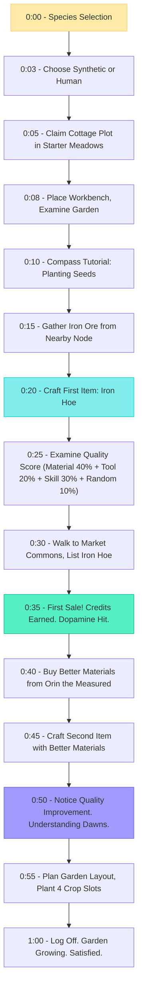
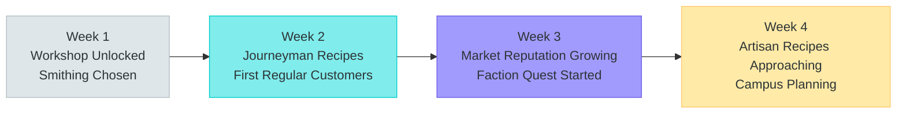
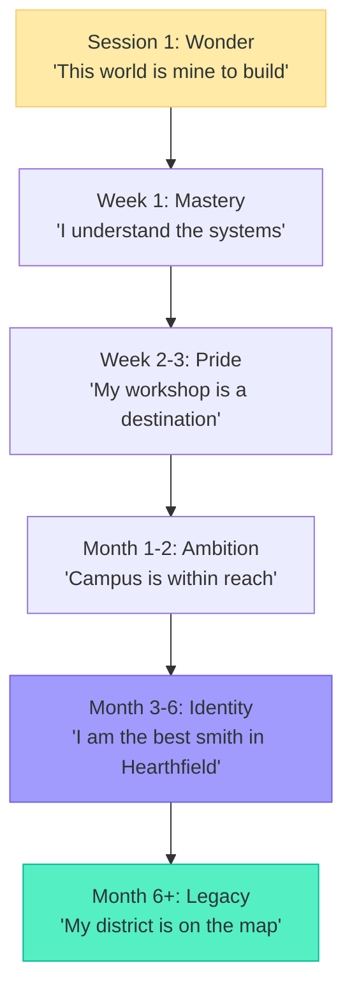

# Player Journey: The Builder

> Hiroshi -- "Create, optimize, and perfect."

---

## Persona Profile

| Attribute | Detail |
|-----------|--------|
| **Archetype** | Crafter and optimizer |
| **Core Motivation** | Build the best homestead, run the most efficient workshop, master every crafting recipe |
| **Preferred Species** | Synthetic (precision engineering affinity) or Human (traditional craft satisfaction) |
| **Play Style** | Methodical, progression-focused, spreadsheet-friendly |
| **Session Length** | 30-90 minutes, daily |
| **Social Mode** | Cooperative when it serves crafting goals; trades actively, socializes around workshops |
| **Reference Persona** | P-003 (Hiroshi) from README.md |

### What Makes This Player Tick

The Builder treats the economy as a puzzle to be solved. They will build spreadsheets tracking material costs vs. sale prices. They optimize daily routines for maximum output. They take pride in their district becoming a destination for other players. The Builder's satisfaction comes from visible, measurable progress: a bigger homestead, a higher-quality item, a more efficient workflow.

### What This Player Fears

- Progression walls with no clear path forward
- Randomness that undermines skill expression in crafting
- A marketplace where prices are so volatile that planning is impossible
- Being forced into social or political gameplay to access crafting content

---

## First Session (Minutes 0-60)



### Key Moments

| Minute | Moment | Emotion | Design Purpose |
|--------|--------|---------|----------------|
| 0:08 | Places workbench, sees garden | "This is mine" | Ownership anchor |
| 0:20 | Crafts first Iron Hoe | "I made something" | Agency confirmation |
| 0:25 | Reads quality score breakdown | "I can optimize this" | Depth signal |
| 0:35 | First marketplace sale | "The economy works" | Economic validation |
| 0:50 | Better materials = better quality | "Skill matters here" | Mastery hook |

### What the Builder Notices (That Others Miss)

- The quality formula weights. They're already planning material sourcing.
- The crafting station specialization choice at Workshop tier. They're researching which path to take.
- The price difference between 3-star and 4-star items on the marketplace. They see the margin.

---

## First Week (Days 1-7)

| Day | Focus | Activities | Progression |
|-----|-------|------------|-------------|
| 1 | Foundation | Claim plot, tutorial, first crafts, first sale | Cottage established, 3 Apprentice recipes learned |
| 2 | Garden Optimization | Plant all 4 slots, research crop rotation, water on schedule | First harvest, basic food supply |
| 3 | Material Sourcing | Explore Hearthwood Forest for better timber, mine Iron Ridge for ore | Material quality improvement, biome familiarity |
| 4 | Crafting Marathon | Craft 20+ items to build toward "craft 50 to unlock" thresholds | Apprentice Crafter skill approaching |
| 5 | Market Day | List bulk goods, study price history, identify underserved categories | 200+ Credits earned, market intelligence developing |
| 6 | Milestone Push | Accumulate toward 500 Credits + 50 Reputation for Workshop upgrade | 400 Credits, 35 Reputation, 2 quest lines started |
| 7 | Workshop Upgrade | Hit 500 Credits + 50 Rep, trigger upgrade, choose specialization | **Workshop unlocked.** Smithing path chosen. Expanded garden. Shop front. |

### End-of-Week State

```
Homestead: Workshop (8x8)
Credits: ~150 (spent most on upgrade)
Reputation: 55
Recipes Known: 15 (12 Apprentice + 3 Journeyman unlocked)
Specialization: Smithing (Forge installed)
Garden: 12 crop slots with irrigation
Key Relationships: Cael (craft mentor, Associate), Orin (trade partner, Acquaintance)
Faction: Considering Transhumanist Alliance or The Bridge
```

---

## First Month (Weeks 1-4)



| Week | Activities | Milestones |
|------|-----------|------------|
| Week 1 | Workshop mastery, daily crafting routine, garden expansion | Smithing specialization committed, 10+ Journeyman recipes |
| Week 2 | Quality optimization, material sourcing network, first trade partnerships | Marketplace Established badge (11-50 ratings, 3.5+ avg), regular income stream |
| Week 3 | Faction quest line (Transhumanist Alliance or The Bridge), cross-biome material runs | Faction Reputation Tier 2 (Recognized), rare recipe unlock from faction |
| Week 4 | Artisan recipes unlocking, campus upgrade planning, hired first NPC apprentice | 1,500+ Credits, 150+ Rep, approaching Campus requirements |

### Meta-Loop Engagement

- **Homestead**: Workshop is a known destination. Other players visit for tool commissions.
- **Crafting**: Quality ceiling rising. 4-star items are achievable. Working toward consistent 4-star output.
- **Faction**: Recognized standing with chosen faction. Advanced quests available. Recipe rewards are the draw.
- **Economy**: Net positive Credits per day. Beginning to accumulate SPARK through marketplace sales.
- **Seasonal**: Experienced first season change. Noticed Winter crafting bonuses. Planning material stockpiles by season.

---

## Retention Hooks

| Hook | Mechanism | Why It Works for The Builder |
|------|-----------|------------------------------|
| **Next Recipe** | Tech tree always shows the next unlock and its requirements | Builders are goal-driven. A visible next step prevents aimlessness. |
| **Quality Ceiling** | Material quality, tool quality, and skill all independently improve | Three optimization axes means there's always something to improve. |
| **Homestead Evolution** | Workshop -> Campus -> District is visible and aspirational | Physical, permanent proof of progress. Other players see it. |
| **Market Reputation** | Established -> Trusted -> Distinguished -> Legendary tiers with tangible benefits | Social proof of crafting mastery. Featured listings. Premium pricing power. |
| **Cross-Path Recipes** | Legendary recipes require mastery of multiple specialization paths | Long-term goal that encourages collaboration with other crafters. |
| **Seasonal Cycles** | Different crops, materials, and crafting bonuses each season | Prevents stagnation. Winter smithing bonuses feel like a special event. |

---

## Monetization Touchpoints

| Touchpoint | Context | Natural? |
|------------|---------|----------|
| **Premium storage** (Pioneer sub) | Inventory full after a crafting marathon; expanded storage is convenient | Yes -- solves a real friction point |
| **Cosmetic homestead themes** (Settler sub) | Workshop looks generic; wants to personalize | Yes -- matches the Builder's identity investment in their property |
| **Extra agent slots** (Settler sub) | Wants agent to tend shop while crafting | Yes -- delegation fits the optimization mindset |
| **SPARK purchase** | Needs materials from a distant biome, doesn't want to travel | Moderate -- should feel optional, never required |
| **Seasonal cosmetics** (Founder sub) | Exclusive Winter workshop skin during Hearth Gathering | Low pressure -- cosmetic only |

**Key principle**: The Builder should never feel that paying accelerates crafting progression. Every recipe, every quality improvement, every homestead upgrade must be earnable through play.

---

## Risk of Churn

| Risk | Trigger | Prevention |
|------|---------|------------|
| **Plateau feeling** | All Artisan recipes learned, no clear next goal | Ensure Master tier is visible and aspirational before Artisan mastery is complete |
| **Market saturation** | Too many smiths, tool prices collapse | Dynamic supply/demand signals guide retraining; cross-path recipes incentivize diversification |
| **Randomness frustration** | Random 10% quality factor produces a 3-star item from 4-star inputs | Make random factor bounded (can lower from 4 to 3 but never from 4 to 1); show "near miss" feedback |
| **Social pressure** | Faction quests require political engagement the Builder doesn't want | Ensure crafting progression paths exist that don't require faction reputation (exploration + practice paths) |
| **Content drought** | No new recipes, no new biomes, nothing to discover | Seasonal content drops, Frontier expansion, expansion packs every 6-8 months |
| **Isolation** | Pure crafting without social connection gets lonely | Workshop visitor notifications, commission requests, mentoring system provide organic social contact |

---

## Builder's Emotional Arc



The Builder's journey is one of incremental mastery. They don't seek dramatic narrative beats or political upheaval -- they seek the quiet satisfaction of making something better today than they made yesterday. The game must honor that by ensuring the quality ceiling is always slightly higher than the Builder's current reach.

---

*This journey map is canonical for the Builder persona. All crafting, homesteading, and progression design should validate against this player's expected experience.*
