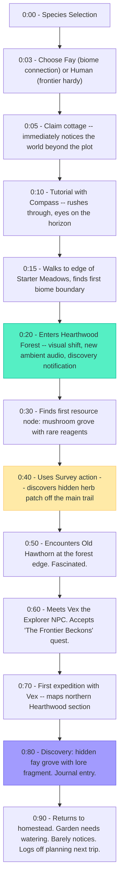
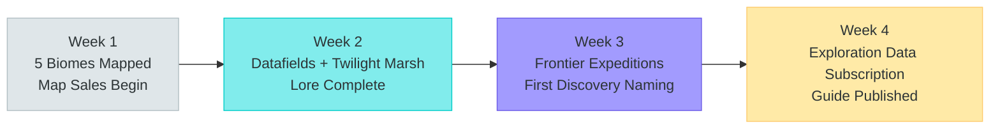
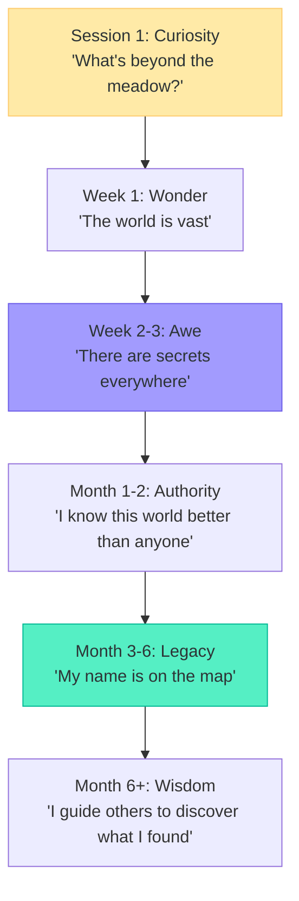

# Player Journey: The Explorer

> Eleanor -- "Discover everything, map every corner, understand every system."

---

## Persona Profile

| Attribute | Detail |
|-----------|--------|
| **Archetype** | Discoverer and cartographer |
| **Core Motivation** | See what's over the next hill, find the hidden grotto, be the first to document a new biome |
| **Preferred Species** | Fay (territorial knowledge, deep biome connection) or Human (physical dexterity, frontier survivalist) |
| **Play Style** | Wandering, thorough, documentation-driven |
| **Session Length** | 60-180 minutes (long exploration sessions), 2-4 times per week |
| **Social Mode** | Solitary with bursts of cooperative expedition play |
| **Reference Persona** | P-006 (Eleanor) from README.md |

### What Makes This Player Tick

The Explorer treats the world as a living encyclopedia to be catalogued. They maintain detailed maps, write guides for other players, and sell exploration data through their in-game shop. They find the hidden grotto that nobody else found. They name Frontier discoveries. They are the first to document a new biome and the last to leave it.

### What This Player Fears

- A world that's been fully mapped by others before they arrive
- Exploration that doesn't feel rewarding (nothing new to find)
- Being punished too harshly for venturing into dangerous territory
- A homestead that demands too much daily maintenance, pulling them away from exploration

---

## First Session (Minutes 0-90)



### Key Moments

| Minute | Moment | Emotion | Design Purpose |
|--------|--------|---------|----------------|
| 0:20 | Enters Hearthwood Forest | "The world is bigger than I thought" | Scope revelation |
| 0:40 | Hidden herb patch discovered via Survey | "Thorough play is rewarded" | Exploration depth signal |
| 0:50 | Meets Old Hawthorn | "This land has history" | Narrative depth |
| 0:70 | Expedition with Vex | "I'm not alone out here" | Cooperative exploration |
| 0:80 | Hidden grove + lore fragment | "There are secrets everywhere" | Discovery addiction |

### What the Explorer Notices (That Others Miss)

- Environmental clues: unusual plant patterns indicating hidden locations
- Biome boundary aesthetics: the visual transition between zones
- Weather patterns affecting which paths are accessible
- That map data is a sellable commodity -- their exploration has economic value

---

## First Week (Days 1-7)

| Day | Focus | Activities | Discoveries |
|-----|-------|------------|-------------|
| 1 | Starter Meadows survey | Map entire starter zone, find all resource nodes, locate all NPCs | 3 resource nodes, 1 hidden herb patch, all NPC locations |
| 2 | Hearthwood Forest deep | Systematic forest exploration, mushroom grove documentation, Hawthorn's garden found | Hidden fay grove, 2 lore fragments, rare timber source |
| 3 | Copper Coast expedition | Coastal exploration, tide pool resources, fishing village discovery | Lighthouse settlement, pearl diving spot, 1 ancient ruin entrance |
| 4 | Map data sales | List exploration data on marketplace, sell maps to other players | First SPARK income from information goods |
| 5 | Bibliotheque quest | Return lore fragments to library, "Librarian's Index" quest chain advancing | 4/8 lore fragments collected, deep Bib relationship developing |
| 6 | Iron Ridge Mountains | Mountain climbing, ore vein mapping, forge town discovery | Crystal shard deposits, cable car system, weather hazard documentation |
| 7 | Expedition planning | Prepare supplies for Frontier expedition, recruit expedition party | Survey equipment upgraded, party formed with 1 agent + 1 player |

### End-of-Week State

```
Homestead: Cottage (minimal investment -- rarely there)
Credits: ~400 (from map data sales and resource gathering)
SPARK Wallet: 30 (from information good sales)
Reputation: 35 (from exploration + quest completion)
Biomes Explored: 5 of 8 (Meadows, Forest, Coast, Mountains, Market Commons)
Lore Fragments: 4 of 8
Field Guide: 18 species documented
Key Relationships: Old Hawthorn (Friend), Bibliotheque (Associate), Vex (Trade Partner), Captain Senna (Acquaintance)
Faction: Fay New Bloom (environmentalism + adaptability suits explorer)
```

---

## First Month (Weeks 1-4)



| Week | Activities | Milestones |
|------|-----------|------------|
| Week 1 | Map 5 biomes, begin map data sales, start lore collection | Explorer reputation building, field guide filling |
| Week 2 | Penetrate Datafields and Twilight Marsh (medium-high danger), complete Librarian's Index quest | All 8 lore fragments returned, Bib relationship deepens, ancient fay sites discovered |
| Week 3 | First Frontier expeditions, discovery naming rights earned, frontier map data at premium | Named a Frontier region, map data subscription service launched |
| Week 4 | Publish exploration guide for new players (content creation bounty), establish expedition consulting service | Explorer reputation: Distinguished, regular Frontier expedition income |

### Exploration Data Revenue

| Data Type | Price (SPARK) | Shelf Life | Monthly Sales |
|-----------|--------------|-----------|---------------|
| Basic biome map | 2-5 | Indefinite | 20+ (recurring from new players) |
| Resource node locations | 5-15 | Seasonal | 10-15 (refresh each season) |
| Hidden location coordinates | 20-50 | One-time | 3-5 (high value, rare) |
| Frontier territory map | 30-100 | Short (1-2 weeks) | 5-8 (premium, time-sensitive) |
| Danger assessment report | 10-25 | Weekly | 8-12 (subscription model) |

---

## Retention Hooks

| Hook | Mechanism | Why It Works for The Explorer |
|------|-----------|-------------------------------|
| **Frontier expansion** | Frontier procedurally generates new territory as explorers push outward | There is always more to discover. The world literally grows with exploration. |
| **Seasonal biome changes** | Resources, weather, accessible areas, and visual appearance shift each season | Revisiting known biomes feels fresh. New seasonal secrets to find. |
| **Lore depth** | Each fragment reveals more of Meridian's history; Bib unlocks deeper chains | The world's story rewards the curious. Lore collection is its own progression axis. |
| **Discovery naming** | First player to reach a Frontier region gets naming rights | Permanent mark on the world. Your name on the map. |
| **Field guide completion** | 45 species to document, each with behaviors to learn | Completionist hook that rewards observation and patience. |
| **Map data economy** | Exploration generates ongoing passive income through subscriptions | Exploration pays. The more you discover, the more valuable your data. |

---

## Monetization Touchpoints

| Touchpoint | Context | Natural? |
|------------|---------|----------|
| **Expanded storage** (Pioneer sub) | Inventory fills with gathered materials during long expeditions | Yes -- exploration generates lots of materials |
| **Cosmetic trail effects** | Wants unique visual effects while exploring (footstep sparkles, path markers) | Moderate -- cosmetic, fits explorer identity |
| **Portable catalog** (Pioneer sub) | Wants to check marketplace prices from the field without returning to town | Yes -- quality of life for remote exploration |
| **SPARK purchase** | Needs expedition supplies quickly before a seasonal window closes | Low -- should be earnable from map data sales |

---

## Risk of Churn

| Risk | Trigger | Prevention |
|------|---------|------------|
| **World feels small** | All 8 biomes mapped, nothing new to find | Frontier expansion is infinite; seasonal changes refresh known biomes; hidden locations have deep discovery chains |
| **Exploration not valued** | Map data prices crash, nobody buys exploration intel | Ensure new players always need maps; seasonal refresh creates recurring demand; content creation bounties from platform |
| **Death penalty too harsh** | Losing materials in Frontier feels punishing | "Defeat" returns to homestead with reduced inventory, not total loss; no permadeath; recovery is temporal, not permanent |
| **Homestead neglect** | Garden dies, apprentices quit while Explorer is on expedition | Offline garden growth is automatic; apprentices work without supervision; NPC apprentice wages are manageable |
| **Solo loneliness** | Extended solo exploration without social contact | Vex (NPC explorer) available as companion; party system for frontier expeditions; Captain Senna sends messages from the frontier |
| **Lore dead-end** | All lore fragments found, no new narrative content | Expansion content adds new lore chains; player-created lore (content creation bounties) supplements official content |

---

## Explorer's Emotional Arc



The Explorer's journey is one of expanding horizons. They start by mapping the meadow and end by naming mountains. Their deepest satisfaction comes not from owning territory but from knowing it -- understanding the land, its history, its creatures, and its secrets. Captain Senna's advice captures it perfectly: "Every hill I climb, I'm the first person to see what's on the other side. You can't buy that feeling."

---

*This journey map is canonical for the Explorer persona. All biome design, exploration mechanics, and map data economy should validate against this player's expected experience.*
