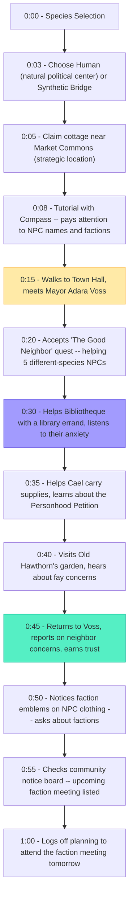
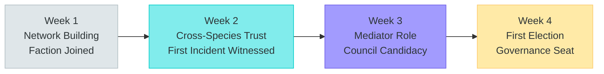
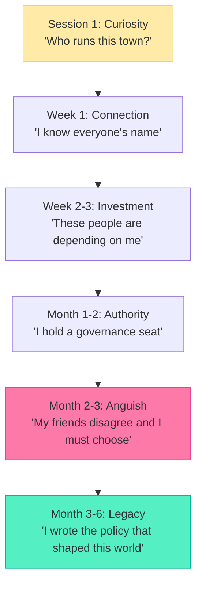

# Player Journey: The Politician

> David -- "Shape the world through relationships, alliances, and governance."

---

## Persona Profile

| Attribute | Detail |
|-----------|--------|
| **Archetype** | Social strategist and governor |
| **Core Motivation** | Be on the town council, broker deals between factions, write policies that govern community life |
| **Preferred Species** | Human (political centrality, emotional intelligence) or Synthetic (Bridge faction, cross-species mediation) |
| **Play Style** | Relationship-focused, strategic, patient |
| **Session Length** | 45-120 minutes, daily during political seasons, 2-3 times/week otherwise |
| **Social Mode** | Always social. Every interaction is potential political capital. |
| **Reference Persona** | P-008 (David) from README.md |

### What Makes This Player Tick

The Politician treats the social and political systems as the real game. Everything else -- crafting, trading, exploring -- is a means to build relationships and influence. They attend every faction meeting. They remember every NPC's name and concerns. They broker deals that nobody else could. They don't want to be the best crafter; they want to be the person the best crafter calls when they need a zoning permit.

### What This Player Fears

- Governance that doesn't matter (policies with no mechanical impact)
- Social interactions that feel scripted or shallow
- Being forced into combat or economic optimization to access political content
- A world where one faction dominates and there's nothing to negotiate

---

## First Session (Minutes 0-60)



### Key Moments

| Minute | Moment | Emotion | Design Purpose |
|--------|--------|---------|----------------|
| 0:15 | Meets Mayor Voss | "This is someone who matters" | Political anchor established |
| 0:30 | Listens to Bibliotheque | "These NPCs have real concerns" | Empathy hook |
| 0:35 | Learns about Personhood Petition | "There are real stakes here" | Political depth signal |
| 0:45 | Reports back to Voss, earns trust | "My social skills matter" | Political agency confirmation |
| 0:55 | Upcoming faction meeting | "The political game has structure" | Governance accessibility |

### What the Politician Notices (That Others Miss)

- Which NPCs reference which other NPCs (the relationship map)
- Faction tensions in casual NPC dialogue ("those machines in the market square")
- Mayor Voss's exhaustion and what it implies about political burden
- The empty governance seat on the local council (someone needs to fill it)

---

## First Week (Days 1-7)

| Day | Focus | Activities | Political Capital |
|-----|-------|------------|-------------------|
| 1 | Network seeding | Meet all Hearthfield NPCs, "Good Neighbor" quest, note faction alignments | 5 NPC contacts, basic faction awareness |
| 2 | Faction meeting | Attend first faction meeting (Human Progressives or Synthetic Bridge), listen and learn | Faction awareness, initial reputation |
| 3 | Cross-species outreach | Visit Bibliotheque's library, attend to Hawthorn's garden, lunch with Jun & Sable | 3 cross-species relationships forming |
| 4 | Community engagement | Help with a community project (road repair, market setup), visible contribution | Community recognition, goodwill |
| 5 | Governance study | Read posted policies, attend a town hall, understand governance structure | Knowledge of Local/Regional/World Council system |
| 6 | Alliance building | Broker a small deal between two NPCs (help Cael sell furniture to a human family) | Cross-species reputation boost, mediator role emerging |
| 7 | Faction commitment | Formally join a faction, complete initiation quest | Faction Tier 1 (Acquainted), first faction quest available |

### End-of-Week State

```
Homestead: Cottage (modestly decorated meeting space)
Credits: ~250 (not the focus)
Reputation: 50 (high for week 1 -- social player)
Faction: Human Progressives Tier 1 or Synthetic Bridge Tier 1
Key Relationships: Mayor Voss (Associate), Bibliotheque (Associate), Cael (Associate), Old Hawthorn (Acquaintance), Jun & Sable (Acquaintance)
Political Knowledge: Understands Local Council structure, knows upcoming election calendar
```

---

## First Month (Weeks 1-4)



| Week | Activities | Milestones |
|------|-----------|------------|
| Week 1 | Network building, faction joining, community visibility | 50+ reputation, 10+ NPC relationships, faction Tier 1 |
| Week 2 | Deepen cross-species relationships, witness Market Dispute incident, begin mediating | Faction Tier 2 (Recognized), cross-species reputation building, Observer role in political events |
| Week 3 | Active mediation during Personhood Petition, build coalition, announce council candidacy | Mediator reputation across factions, campaign platform drafted, 150+ reputation |
| Week 4 | First local council election, campaign, win or learn from loss | **Governance seat won** (or strong showing for next election), policy proposal submitted |

### Political Calendar Alignment

| Political Event | Week | Politician's Role |
|----------------|------|-------------------|
| Faction meeting attendance | Every 2 weeks | Active participant, building toward leadership |
| Market Dispute (story event) | Week 4-5 | Mediator between human farmer and NEI trader |
| Personhood Petition (story event) | Week 6-7 | Coalition builder, speaks at hearing |
| Local Council election | Season end (Week 4) | Candidate or active voter |
| Policy proposal cycle | Ongoing (weekly) | Author or co-author |

---

## Retention Hooks

| Hook | Mechanism | Why It Works for The Politician |
|------|-----------|--------------------------------|
| **Governance consequences** | Passed policies mechanically affect the world (tax rates, zoning, rights) | Political choices matter. The Politician sees their impact. |
| **Election cycles** | Regular elections create recurring political seasons | Campaign energy, victory/defeat, new political landscape each season |
| **Faction depth** | 16 factions with conflicting agendas create endless negotiation space | Always someone to persuade, always a deal to broker |
| **Story arc integration** | The Accord crisis escalates through world events the Politician can influence | Personal stakes in the narrative -- their friends are on opposite sides |
| **Relationship web** | NPCs remember, reference, and evolve based on the Politician's choices | Social investment compounds over time |
| **Cross-species diplomacy** | Species tensions create real political problems that need real solutions | The Politician is the person everyone needs |

---

## Monetization Touchpoints

| Touchpoint | Context | Natural? |
|------------|---------|----------|
| **Governance analytics** (Founder sub) | Wants to understand voting patterns, faction sentiment, policy impact data | Yes -- power user tool for political strategy |
| **Meeting hall homestead upgrade** | Wants to host faction meetings at their homestead (Campus requirement) | Yes -- physical expression of political identity |
| **Cosmetic faction regalia** | Wants to visually represent their faction affiliation prominently | Moderate -- cosmetic, reinforces political identity |
| **Extra agent slots** | Wants agents to manage constituency services while attending meetings | Low -- less relevant than for Traders |

---

## Risk of Churn

| Risk | Trigger | Prevention |
|------|---------|------------|
| **Governance feels toothless** | Policies pass but nothing changes mechanically | Every policy must have visible, mechanical impact. Tax rate changes affect marketplace. Zoning changes affect homesteading. |
| **Faction stalemate** | One faction dominates, no negotiation needed | Balance faction power through NPC population, quest access, and mechanical advantages/disadvantages |
| **Social burnout** | Constant political engagement is exhausting | Allow the Politician to "take a season off" with homesteading or exploration without losing standing permanently |
| **Lone wolf meta** | Most players ignore governance, leaving the Politician talking to themselves | Governance participation rewards (SPARK), NPC agents that engage in politics, visible policy impact that draws attention |
| **Story arc ending** | Main narrative arc resolves, political landscape settles | New arcs emerge from each ending: Dominance creates resistance, Secession creates reunification quest, Unity creates new challenges |
| **Relationship decay too fast** | Taking a week off and losing relationship progress feels punishing | Decay rate is 1 point per 7 days -- slow enough that a week off barely registers |

---

## Politician's Emotional Arc



The Politician's journey is one of deepening investment. They start by learning names and end by writing laws. The emotional peak comes during the Accord crisis, when their friends from different species ask them to take sides. The game's narrative philosophy -- "no villains, only disagreements" -- is the Politician's defining experience. Mayor Voss's exhaustion becomes their own. The question "whose side are you on?" is the question they've been building relationships to answer.

---

*This journey map is canonical for the Politician persona. All governance, faction, and social systems should validate against this player's expected experience.*
