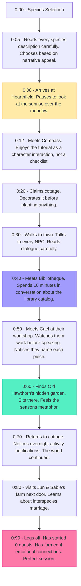
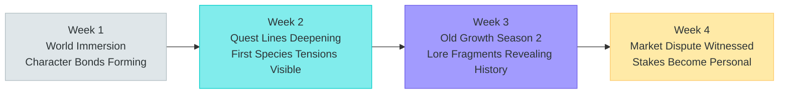
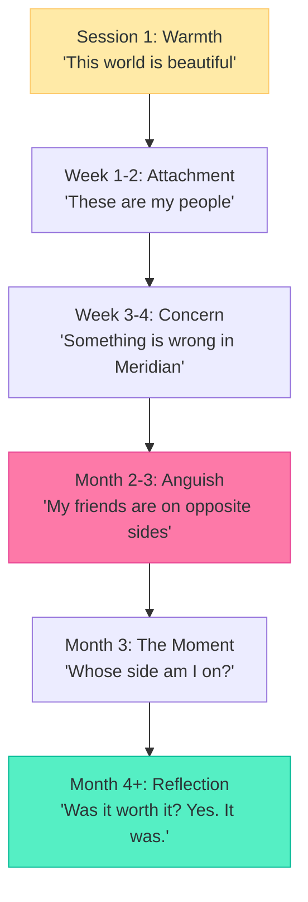

# Player Journey: The Storyteller

> "I want to feel what this world feels. I want characters I miss when I log off."

---

## Persona Profile

| Attribute | Detail |
|-----------|--------|
| **Archetype** | Narrative engager, character relationship builder, role-player |
| **Core Motivation** | Experience the story, build deep character relationships, inhabit the world emotionally |
| **Preferred Species** | Human (emotional range, biological rhythms add texture) or Fay (deep time, spiritual connection to land) |
| **Play Style** | Immersive, relationship-focused, completion-driven for narrative content |
| **Session Length** | 60-180 minutes, 3-5 times per week during story beats, less between arcs |
| **Social Mode** | Deep, selective relationships over broad networking |
| **Reference Persona** | New (not one of the original four -- fills a gap the others leave) |

### What Makes This Player Tick

The Storyteller doesn't optimize. They don't min-max. They walk slowly through the market and listen to NPC ambient dialogue. They sit with Old Hawthorn for an entire season tending the hidden garden not because of the reward but because the ritual feels meaningful. When Bibliotheque asks "Do you believe I am a person?", they feel the weight of the question in their chest. When the referendum forces them to choose, they agonize for real.

The Storyteller is the player the narrative design team writes for.

### What This Player Fears

- A world that feels like a spreadsheet with graphics
- NPCs that forget them or reset
- Story choices that don't matter (all paths lead to the same outcome)
- Being rushed through narrative content by economy or progression pressure
- Other players breaking immersion through min-maxing or exploitative behavior

---

## First Session (Minutes 0-90)



### Key Moments

| Minute | Moment | Emotion | Design Purpose |
|--------|--------|---------|----------------|
| 0:08 | Sunrise over the meadow | "This world is beautiful" | Tone-setting |
| 0:40 | Bibliotheque conversation | "This NPC is a person" | Character depth validation |
| 0:50 | Watching Cael work | "They name their furniture" | Detail that creates empathy |
| 0:60 | Old Hawthorn's garden | "Some things grow on their own schedule" | Thematic resonance |
| 0:80 | Jun & Sable's story | "Love exists here" | Emotional stakes established |

### What the Storyteller Notices (That Others Miss)

- The succulent on Mayor Voss's desk that she's kept alive for nine years
- Bibliotheque's habit of citing sources even in casual conversation
- Cael pausing mid-sentence to process before finishing a thought
- The way Hawthorn's leaves change with the seasons
- Ash's locket that they never open

---

## First Week (Days 1-7)

| Day | Focus | Activities | Emotional State |
|-----|-------|------------|-----------------|
| 1 | World immersion | Walk everywhere, talk to everyone, no quests started, just listening | "This world is alive" |
| 2 | Bibliotheque's quest | Accept "The Librarian's Index" -- collect lore fragments | "The world has a history I want to understand" |
| 3 | Old Hawthorn's garden | Begin "The Old Growth" -- tend the hidden garden for the first time | "This ritual means something" |
| 4 | Cael's workshop | Accept "The Apprentice" -- learn crafting not for profit but for the gift at the end | "Making something for someone feels different than making it to sell" |
| 5 | Jun & Sable's farm | Spend time with the neighbors, learn about their adoption struggle | "These are my friends now" |
| 6 | Market Day with Orin | "Market Day" quest -- but the Storyteller notices Orin's personality quirks more than the economics | "Even the merchant has depth" |
| 7 | Evening at the tavern | Attend a social gathering, hear NPC stories, notice faction tensions in conversation | "Something's wrong in Meridian. Not dangerous yet. Just... off." |

### End-of-Week State

```
Homestead: Cottage (heavily decorated, feels lived-in)
Credits: ~150 (not tracking carefully)
Reputation: 30 (from social interactions and quest starts)
Active Quests: 4 (Librarian's Index, The Old Growth, The Apprentice, Market Day)
Completed Quests: 0 (no rush)
Key Relationships: Bibliotheque (Associate), Old Hawthorn (Associate), Cael (Associate), Jun & Sable (Acquaintance), Mayor Voss (Acquaintance)
Faction: Not joined yet (still learning what each faction stands for)
Emotional Investment: High. Already cares about multiple NPCs.
```

---

## First Month (Weeks 1-4)



| Week | Story Engagement | NPC Relationship Depth | Emotional Beat |
|------|-----------------|----------------------|----------------|
| Week 1 | Immersion, quest acceptance, listening | Acquaintance to Associate with 5 NPCs | Wonder, warmth, belonging |
| Week 2 | Quest lines progressing, lore fragments accumulating, seasonal change | Associate to Friend with Bib and Hawthorn | Growing attachment, narrative curiosity |
| Week 3 | Old Growth garden through second season, 6/8 lore fragments, Cael's gift completed | Friend with 3 NPCs, started noticing NPC-to-NPC relationships | Deep investment, starting to see the web of relationships |
| Week 4 | **Market Dispute** (Week 4-5 story beat) -- witnesses the human farmer vs NEI argument, sees friends on both sides | Cael (Friend), Bib (Friend), Hawthorn (Friend), Voss (Associate), Jun (Associate) | "My friends disagree. This is personal now." |

### The Old Growth Arc (4 Seasons)

This quest is the Storyteller's signature experience. Tending Hawthorn's invisible garden across four in-game seasons (4 real weeks) is a meditation on patience, attention, and care.

| Season | Garden Activity | Hawthorn's Teaching | Emotional Note |
|--------|----------------|--------------------|--------------------|
| Spring | Plant new seeds, prepare soil | "The land remembers what you plant." | Hope, new beginning |
| Summer | Water, weed, protect from heat | "Growth looks like nothing for a long time. Then everything at once." | Patience, trust |
| Autumn | Harvest, preserve, prepare for winter | "What you gather now sustains you through the dark." | Gratitude, preparation |
| Winter | Rest, plan, listen to the quiet | "I'm not afraid of dying. I'm afraid of the garden dying." | Succession, mortality, love |

---

## Retention Hooks

| Hook | Mechanism | Why It Works for The Storyteller |
|------|-----------|----------------------------------|
| **NPC memory** | Characters remember everything: conversations, gifts, shared moments, choices | The Storyteller's investment is preserved. Nothing is wasted. |
| **Consequence branching** | Four story endings with relationship-based branching, not binary choice | The narrative rewards nuance, not optimization. |
| **Character depth** | 9 named NPCs with 100+ lines of unique dialogue each, evolving across the arc | The characters feel real. They surprise the Storyteller. |
| **Seasonal rhythm** | The Old Growth quest spans 4 real weeks, teaching patience through gameplay | The Storyteller doesn't want content faster. They want content deeper. |
| **World memory** | The world records player-driven history: first discoveries, election results, policy changes | The Storyteller's choices echo in the world long after they're made. |
| **Aftermath arcs** | Every ending generates new quest lines (resistance, reunification, deepening cooperation) | The story never ends. It evolves. |

---

## Monetization Touchpoints

| Touchpoint | Context | Natural? |
|------------|---------|----------|
| **Cosmetic homestead themes** (Settler sub) | Wants cottage to feel like a character's home, not a gameplay space | Yes -- aesthetic matters to the Storyteller |
| **Seasonal cosmetics** (Founder sub) | Exclusive festival outfits that mark participation in seasonal events | Moderate -- participation markers are meaningful for this player |
| **Expansion packs** | New story arcs, new characters, new biomes with narrative content | Yes -- the Storyteller is the ideal expansion pack customer |
| **Soundtrack purchase** | The warm acoustic palette is part of the experience | Yes -- ambient experience matters |

**Key principle**: The Storyteller should never feel that paying gives them better story. All narrative content is included in the base game and expansions. Premium is cosmetic only.

---

## Risk of Churn

| Risk | Trigger | Prevention |
|------|---------|------------|
| **NPC forgets** | Visits Bib after two weeks and the conversation feels reset | Social memory decay is slow (1 point per 7 days); notable events are permanent; Bib should reference past conversations |
| **Choices don't matter** | Two different choices lead to the same outcome | Every political choice and relationship action must visibly affect NPC dialogue, world state, and available quest branches |
| **Story ends** | Main arc resolves, no new narrative content | Aftermath quests emerge from each ending; expansion content is narrative-first; player-generated lore creates community stories |
| **Immersion broken** | Other players spam chat, exploit economy, treat world as spreadsheet | Separate social channels; auction house is in-world, not meta-UI; NPC behavior is authentic regardless of player behavior |
| **Pacing pressure** | Feels forced to grind reputation or Credits to access story content | Story beats trigger on time + reputation thresholds (whichever comes first); players who simply attend and engage naturally qualify |
| **Emotional exhaustion** | The Accord crisis is emotionally heavy; player needs lighter content | Homesteading and seasonal festivals provide warm, low-stakes content; the game's 40% Hope tone provides recovery |

---

## Storyteller's Emotional Arc



The Storyteller's journey is the one the game was designed for. They are the player who finishes the game unable to say who was "right." They finish the game missing specific characters. When Bibliotheque asks "Do you believe I am a person?", the Storyteller's answer comes from a place of genuine relationship, not game theory.

The four endings map to the Storyteller's emotional truth:
- **Unity**: "We held together. It was hard, but we held."
- **Dominance**: "We won, but I lost a friend."
- **Secession**: "The road is empty now."
- **Transcendence**: "Nothing dramatic happened. The sun rose. And that was the point."

---

*This journey map is canonical for the Storyteller persona. All narrative design, character writing, and quest pacing should validate against this player's expected experience.*
