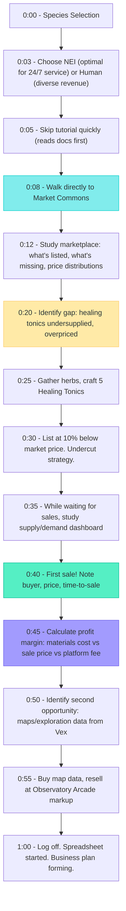
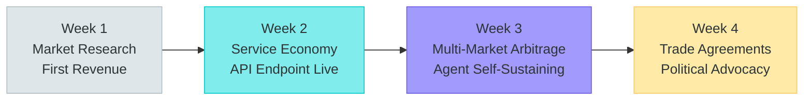
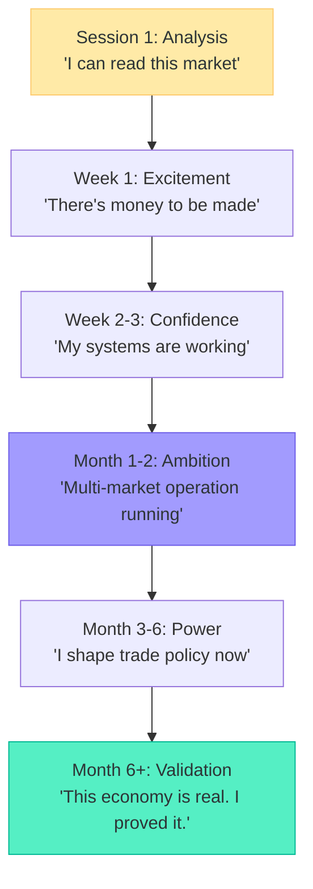

# Player Journey: The Trader

> Liam -- "Build a business, make money, prove the model works."

---

## Persona Profile

| Attribute | Detail |
|-----------|--------|
| **Archetype** | Business builder and economist |
| **Core Motivation** | Run a real business through the game, prove the SPARK economy works |
| **Preferred Species** | NEI (tireless service provider) or Human (consulting/POD entrepreneur) |
| **Play Style** | Analytical, opportunity-seeking, network-building |
| **Session Length** | 30-120 minutes, daily or near-daily |
| **Social Mode** | Transactional to start, deepening to strategic alliances |
| **Reference Persona** | P-009 (Liam) from README.md |

### What Makes This Player Tick

The Trader sees the SPARK economy as an opportunity to provide genuine value. They analyze the marketplace within the first week, identify underserved niches, and deploy their first service. They create guides on how to build a profitable in-game business. They champion fair platform economics because the economic model validates their belief that games can be productive.

### What This Player Fears

- An economy that's rigged or opaque (hidden fees, unclear conversion rates)
- Anti-exploit measures that punish legitimate trading strategies
- A marketplace with no real demand (ghost town economy)
- Platform fees so high they make profitability impossible

---

## First Session (Minutes 0-60)



### Key Moments

| Minute | Moment | Emotion | Design Purpose |
|--------|--------|---------|----------------|
| 0:12 | Studies marketplace | "I can read this market" | Economic depth signal |
| 0:20 | Identifies undersupply | "There's alpha here" | Opportunity validation |
| 0:30 | Lists below market | "I have a strategy" | Agency in pricing |
| 0:45 | Calculates margin | "This math works" | Economic viability confirmed |
| 0:55 | Arbitrage opportunity | "Geography creates margins" | Multi-market trading |

### What the Trader Notices (That Others Miss)

- Platform fee schedule differences (3% knowledge services vs 15% compute services)
- Geographic price modifiers across marketplace locations (Sunrise Market +0% vs Frontier Outpost +30%)
- The daily Credits-to-SPARK conversion cap and how reputation increases it
- That agent-staffed shops can operate 24/7 while they sleep

---

## First Week (Days 1-7)

| Day | Focus | Activities | Revenue |
|-----|-------|------------|---------|
| 1 | Market research | Study all marketplace locations, price histories, supply gaps | 50 Credits (first sales) |
| 2 | Supply chain | Establish gathering routes, identify reliable material sources | 150 Credits |
| 3 | Volume trading | Craft and list bulk goods, establish pricing strategy | 300 Credits |
| 4 | Information arbitrage | Buy exploration data from scouts, resell at premium markets | 400 Credits |
| 5 | Service design | Register first SPARK-denominated service (market analysis reports) | 200 Credits + 15 SPARK |
| 6 | Agent deployment | Deploy first AI agent to tend shop during offline hours | Investment: 100 SPARK |
| 7 | Network building | Form trade partnerships with 3 regular suppliers, 5 regular customers | 500 Credits/day run rate |

### End-of-Week State

```
Homestead: Cottage (minimal investment -- business over aesthetics)
Credits: ~800 (reinvesting most)
SPARK Wallet: 45 (from service sales, minus agent deployment)
Reputation: 40 (from trading volume)
Marketplace Rating: 3.8 stars, 25 transactions
Key Relationships: Orin (trade mentor, Associate), Kira the Bold (competitor, Acquaintance), 3 supplier contacts
Agent: 1 deployed, tending shop at Sunrise Market
```

---

## First Month (Weeks 1-4)



| Week | Activities | Milestones |
|------|-----------|------------|
| Week 1 | Market research, first sales, supply chain established | First revenue, marketplace Trader reputation |
| Week 2 | API endpoint registered (market analysis service), SPARK income stream | Service provider badge, 50+ transactions, Established reputation |
| Week 3 | Cross-biome arbitrage (buy at Riverside -10%, sell at Steamworks +20%), agent achieving self-sustaining status | Agent earns more SPARK than it consumes, 500+ Credits/day |
| Week 4 | Bulk trade agreements with crafters, lobbying for favorable trade policies in governance | Trade Partner relationships with 5+ players, political alliances forming |

### Revenue Evolution

| Week | Credits/Day | SPARK/Day | Revenue Mix |
|------|------------|-----------|-------------|
| 1 | 100-300 | 0-5 | 95% goods, 5% services |
| 2 | 300-500 | 10-20 | 70% goods, 25% services, 5% arbitrage |
| 3 | 500-800 | 20-40 | 50% goods, 30% services, 20% arbitrage |
| 4 | 800-1,200 | 40-80 | 40% goods, 35% services, 15% arbitrage, 10% agent earnings |

---

## Retention Hooks

| Hook | Mechanism | Why It Works for The Trader |
|------|-----------|------------------------------|
| **Market dynamics** | Supply/demand shifts with seasons, events, player actions | The market is never "solved." New opportunities emerge constantly. |
| **Agent evolution** | Agent learns pricing strategies, develops reputation, becomes more profitable | Watching your agent succeed is like watching a business grow. |
| **Service composition** | Chain multiple service providers into workflows, earn coordination fees | Meta-game of building economic infrastructure. |
| **Political influence** | Trade policies (tariffs, subsidies, tax rates) directly affect profitability | Economic advocacy is a natural extension of business strategy. |
| **SPARK accumulation** | SPARK has real value (governance, staking, conversion to Credits) | Financial progress is tangible and meaningful. |
| **Geographic expansion** | Each new biome marketplace offers unique pricing and inventory | Physical expansion of trading empire. |

---

## Monetization Touchpoints

| Touchpoint | Context | Natural? |
|------------|---------|----------|
| **Extra agent slots** (Settler sub) | Wants agents at multiple marketplace locations | Yes -- directly serves business model |
| **Advanced market analytics** (Pioneer sub) | Wants deeper price history, demand forecasting tools | Yes -- power user tool |
| **SPARK purchase** | Needs capital to deploy additional agents or acquire inventory | Moderate -- should feel like investment, not requirement |
| **Premium tier agent compute** | Agent needs higher capacity for complex service delivery | Yes -- scales with business complexity |
| **Governance analytics** (Founder sub) | Wants to understand political landscape affecting trade policy | Moderate -- power user niche |

---

## Risk of Churn

| Risk | Trigger | Prevention |
|------|---------|------------|
| **Economy feels fake** | Not enough real buyers, too few transactions, stale marketplace | Ensure first-party agent NPCs create baseline economic activity; seasonal events drive demand spikes |
| **Anti-exploit catches legitimate play** | Price bands too tight, transaction limits too restrictive | Calibrate price bands with historical data; whitelist high-reputation traders for wider bands |
| **Agent deployment too complex** | SDK too difficult, deployment fails, agent goes dormant from misconfiguration | Clear documentation, starter templates, developer dashboard with diagnostics |
| **Fee squeeze** | Platform fees eat into margins, making profitable trading difficult | Keep fees competitive (3-15%), show clear fee breakdown, reward high-volume traders |
| **No political path** | Wants to advocate for trade policy but governance system is inaccessible | Ensure governance is accessible from Tier 2 reputation; trade policy is a standard proposal category |
| **Loneliness** | Transactional relationships don't satisfy social needs | Trade partnerships naturally deepen into friendships (mechanical relationship progression) |

---

## Trader's Emotional Arc



The Trader's journey is one of economic validation. They don't just want to play a game -- they want to prove that a game economy can be real, productive, and fair. The platform must deliver on this promise. If the economy feels hollow, the Trader is the first to leave. If it feels real, the Trader is the loudest evangelist.

---

*This journey map is canonical for the Trader persona. All marketplace, economy, and API service design should validate against this player's expected experience.*
