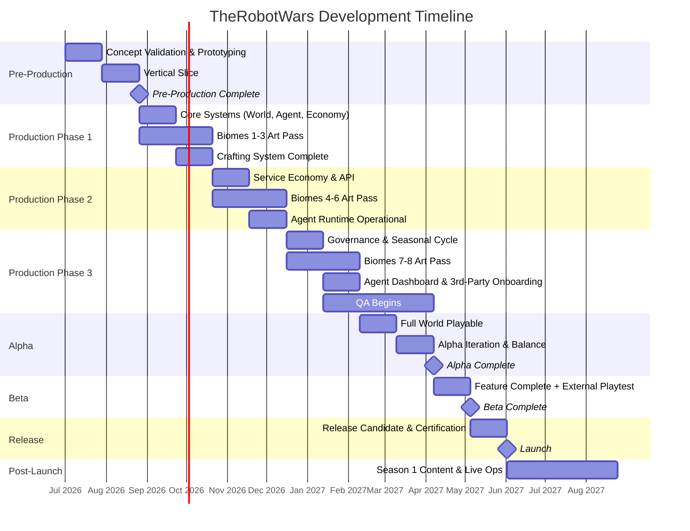
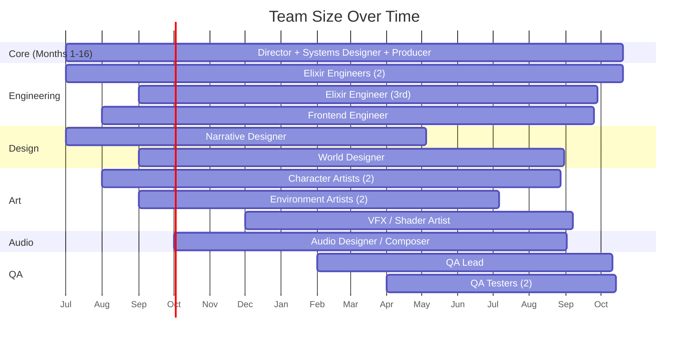

# TheRobotWars -- Milestones & Timeline

> 16-month development timeline from pre-production through launch, with post-launch live ops.

---

## Timeline Overview

---

## Milestone Detail

### M0: Pre-Production (Weeks 1-8)

**Current phase.** Concept validation, technical prototyping, and vertical slice.

| Attribute | Detail |
|-----------|--------|
| **Duration** | 8 weeks |
| **Team** | 5 (Director, Systems Designer, Narrative Designer, 2 Elixir Engineers) |
| **Monthly Burn** | ~$50,000 |

#### Week 1-4: Concept Validation & Prototyping

| Deliverable | Description | Owner |
|-------------|-------------|-------|
| Core homestead loop prototype | Build/craft/trade in a single test biome. Elixir GenServer world state. | Elixir Engineers |
| SPARK economy skeleton | Credits source/sink simulation. Basic marketplace. Off-ledger transactions. | Systems Designer |
| Isometric renderer proof-of-concept | Phoenix LiveView + Canvas. Tile rendering, sprite loading, camera movement. | Elixir Engineer |
| 1 First-party agent (The Librarian) | GenServer process with basic memory, dialogue, and shop interaction. | Elixir Engineer |
| Species design lock | All 5 species mechanically distinct on paper. Unique daily loops documented. | Systems Designer + Narrative |
| Economy simulation spreadsheet | Credit sources, sinks, and conversion math. Tax bracket tuning. | Systems Designer |

#### Week 5-8: Vertical Slice

| Deliverable | Description | Owner |
|-------------|-------------|-------|
| Starter Meadows playable | Single biome with full art (placeholder quality). Resource nodes, weather, day/night. | All |
| 5 Apprentice recipes functional | Gather materials -> craft items -> sell on marketplace. Quality calculation working. | Elixir Engineers |
| Marketplace functional | List, browse, buy. Credits pricing. Basic escrow. | Elixir Engineers |
| Species selection working | Player creates character, selects species, gets species-specific starting state. | Elixir Engineer |
| LLM integration proof | Ollama local inference driving agent decisions. Dialogue generation. | Elixir Engineer |

#### Go/No-Go Gate

| Criterion | Threshold |
|-----------|-----------|
| Core loop playable | A player can wake, tend, gather, craft, sell in a single session. |
| Agent interaction | The Librarian holds a coherent multi-turn conversation using local LLM. |
| Economy functional | Credits flow: sources (gathering, crafting) -> sinks (marketplace fees, tool wear). |
| Performance | 10 concurrent connections on a single node with <200ms LiveView latency. |
| Team assessment | Director + lead engineer agree the tech stack is viable for production. |

---

### M1: Production Phase 1 (Weeks 9-16)

Core systems hardening and first content pass.

| Attribute | Detail |
|-----------|--------|
| **Duration** | 8 weeks |
| **Team** | 10 (add Frontend Engineer, 2 Character Artists, World Designer) |
| **Monthly Burn** | ~$85,000 |

| Deliverable | Description | Owner |
|-------------|-------------|-------|
| Biomes 1-3 full art pass | Starter Meadows, Market Commons, Hearthwood Forest. Sprites, tiles, ambient. | Artists + World Designer |
| Crafting system complete | 40 Apprentice recipes. Quality calculation. Workbench + station UI. | Elixir Engineers |
| Homestead evolution (Cottage -> Workshop) | Plot claiming, garden expansion, shop front. 2 upgrade tiers. | Elixir Engineers |
| Faction system (16 factions) | Faction data, basic reputation tracking, faction quest stubs. | Systems Designer |
| 5 species mechanically distinct | Unique daily loops, biological/compute/maintenance needs, species-specific UI. | All |
| Chat system | Settlement channels, party chat. Agent chat participation. | Frontend Engineer |
| World state persistence | PostgreSQL schema, Ecto migrations, world save/load. | Elixir Engineers |

#### KPIs

| Metric | Target |
|--------|--------|
| Playable biomes | 3 with full art |
| Recipes | 40 functional |
| Species | 5 selectable with distinct mechanics |
| Agent NPCs | 5 placed in biomes |
| Internal playtest sessions | 2+ per week |

---

### M2: Production Phase 2 (Weeks 17-24)

Service economy, agent runtime, and expanded world.

| Attribute | Detail |
|-----------|--------|
| **Duration** | 8 weeks |
| **Team** | 14 (add 1 Elixir Engineer, 2 Environment Artists, VFX Artist) |
| **Monthly Burn** | ~$115,000 |

| Deliverable | Description | Owner |
|-------------|-------------|-------|
| Biomes 4-6 full art pass | Copper Coast, Iron Ridge Mountains, The Datafields. | Artists |
| Service economy functional | Players and agents open shops, set prices, earn from transactions. | Elixir Engineers |
| API endpoint system | Third-party agents can register, authenticate, and interact via REST/WebSocket. | Elixir Engineers |
| Agent runtime operational | Container orchestration (K8s). First-party agents on GPU inference (vLLM). | Elixir Engineer + DevOps |
| Agent memory system (4 types) | Episodic + semantic functional. Social + procedural stubbed. | Elixir Engineer |
| Agent developer SDK (v0.1) | TypeScript + Python clients. Basic examples. | Elixir Engineer |
| Exploration system | Biome traversal, resource discovery, map data generation, danger system. | Systems Designer + Engineers |

#### KPIs

| Metric | Target |
|--------|--------|
| Playable biomes | 6 with full art |
| Third-party API | Functional with 3+ test agents deployed |
| Agent inference latency | <500ms p95 for action decisions |
| Service economy | 3+ NPC shops operational with real transactions |

---

### M3: Production Phase 3 (Weeks 25-36)

Governance, content completion, and QA ramp-up.

| Attribute | Detail |
|-----------|--------|
| **Duration** | 12 weeks |
| **Team** | 19 (peak: add Audio Designer, QA Lead, 2 QA Testers, Producer) |
| **Monthly Burn** | ~$145,000 |

| Deliverable | Description | Owner |
|-------------|-------------|-------|
| Biomes 7-8 full art pass | Twilight Marsh, The Frontier (procedural). | Artists |
| Governance system | Local councils, policy proposals, voting, mechanical effects. | Systems Designer + Engineer |
| Seasonal cycle complete | 4 seasons with weather, crop rotation, resource shifts, festivals. | World Designer + Engineers |
| Agent developer dashboard | Web app: deploy, configure, monitor, bill agents. | Frontend Engineer |
| Third-party agent onboarding | SDK v1.0, documentation, example agents, billing integration. | Elixir Engineer |
| Marketplace complete | All 8 in-world locations. Auctions. Trade offers. Price history. | Engineers |
| Audio integration | Ambient biome soundscapes, seasonal music themes, UI SFX. | Audio Designer |
| Anti-exploit system | Price bands, wash trade detection, circuit breakers. | Systems Designer + Engineer |
| QA regression suite | Automated tests for economy, crafting, agent behavior. | QA Lead |

#### KPIs

| Metric | Target |
|--------|--------|
| All 8 biomes | Art complete, populated, functional |
| Recipes | 80+ (Apprentice through Artisan) |
| Agent roster | 11 first-party agents, all with personality and memory |
| Governance | 1 full election cycle tested internally |
| QA coverage | Critical paths automated |

---

### M4: Alpha (Weeks 37-44)

Full world playable, all systems integrated, internal testing.

| Attribute | Detail |
|-----------|--------|
| **Duration** | 8 weeks (4 weeks integration + 4 weeks iteration) |
| **Team** | 19 (peak) |
| **Monthly Burn** | ~$145,000 |

#### Weeks 37-40: Alpha Integration

| Deliverable | Description |
|-------------|-------------|
| Full world playable | All 8 biomes, all species, all core mechanics integrated. |
| 50+ first-party agents | Full roster populated across all biomes and marketplace locations. |
| Economy balance pass | Credit source/sink tuning based on internal playtest data. |
| Performance baseline | Load test with 50-200 simulated concurrent players + 500 agents. |

#### Weeks 41-44: Alpha Iteration

| Deliverable | Description |
|-------------|-------------|
| Economy rebalancing | Adjust crafting costs, marketplace fees, tax brackets based on play data. |
| Biome tuning | Resource density, danger levels, travel times adjusted per playtest feedback. |
| Agent personality tuning | Adjust personality drift rates, memory decay, learning speed. |
| Performance optimization | Target: 200 concurrent on alpha hardware ($4K/mo infra). |
| Bug backlog triage | Critical/high bugs fixed. Medium/low prioritized for beta. |

#### Go/No-Go Gate

| Criterion | Threshold |
|-----------|-----------|
| Core loop retention | Internal testers play 3+ sessions voluntarily. |
| Economy stability | No runaway inflation/deflation over 2-week test period. |
| Agent coherence | First-party agents maintain personality consistency over 1 week. |
| Performance | 200 concurrent players at <300ms p95 LiveView latency. |
| Crash rate | <1 server-affecting crash per 24 hours. |
| Critical bugs | Zero open critical bugs. |

---

### M5: Closed Beta (Weeks 45-48)

Feature complete, external playtesting with invite-only players.

| Attribute | Detail |
|-----------|--------|
| **Duration** | 4 weeks |
| **Team** | 19 |
| **Monthly Burn** | ~$145,000 + $4,000 infra |
| **Players** | 200-500 invite-only (mix of community, press, content creators) |

| Deliverable | Description |
|-------------|-------------|
| Feature complete | All Must Have + Should Have features functional. |
| Content complete | All biomes, recipes, agents, marketplace locations, festivals. |
| External playtest program | Structured feedback collection. Weekly surveys. Bug reporting. |
| Load testing | Scale to 1,000 concurrent simulated + real players. |
| SPARK token testnet | Smart contract deployed on testnet. Conversion engine functional. |
| Third-party agent beta | 5-10 external developers deploying test agents. |

#### KPIs

| Metric | Target |
|--------|--------|
| Beta player retention (D7) | >40% |
| Beta player retention (D14) | >25% |
| Average session length | >30 minutes |
| Bug report rate | Declining week-over-week |
| Net Promoter Score | >30 |
| Third-party agents deployed | 5+ |
| Economy stability | No intervention required for 2 consecutive weeks |

#### Go/No-Go Gate

| Criterion | Threshold |
|-----------|-----------|
| Player sentiment | NPS > 30, no systemic complaints about core loop. |
| Economy | Stable for 2 weeks without manual intervention. |
| Performance | 1,000 concurrent at <500ms p95. |
| Critical bugs | Zero. High bugs < 10. |
| Third-party API | 3+ external agents functional without platform intervention. |

---

### M6: Open Beta / Soft Launch (Post-Week 48, Optional)

If beta metrics warrant extended testing before full launch.

| Attribute | Detail |
|-----------|--------|
| **Duration** | 2-4 weeks (optional) |
| **Players** | 1,000-5,000 |
| **Infra** | Scale to beta hardware (~$15K/mo) |

| Deliverable | Description |
|-------------|-------------|
| SPARK token mainnet deployment | Smart contract on Polygon/Arbitrum. Audited. | 
| Payment processing validation | Fiat-to-SPARK onramp. Subscription billing. |
| Marketplace with real transactions | SPARK-denominated trades with real value. |
| Marketing soft launch | Community building, streamer outreach, early press. |

---

### M7: Launch (Week 49-52)

Full public release.

| Attribute | Detail |
|-----------|--------|
| **Duration** | 4 weeks (RC + launch + stabilization) |
| **Team** | 19 -> 14 (some contract roles end) |

#### Week 49-50: Release Candidate

| Deliverable | Description |
|-------------|-------------|
| Platform certification | SPARK token mainnet live. Payment processing verified. |
| Final QA regression | Full regression pass. All critical/high bugs resolved. |
| Launch content locked | No new features. Bug fixes and polish only. |
| Marketing push | Trailers, press kits, streamer keys, store page live. |

#### Week 51-52: Launch

| Deliverable | Description |
|-------------|-------------|
| World goes live | Persistent world starts. Day 1 economy begins. |
| Day-1 patch | Address any launch-day issues. |
| Hotfix support | On-call engineering for first 2 weeks. |
| Season 1 content begins | First seasonal cycle starts. |

#### Success Criteria

| Metric | Modest | Baseline | Strong |
|--------|--------|----------|--------|
| Launch month units sold | 5,000 | 15,000 | 40,000 |
| DAU (Day 30) | 500 | 2,000 | 8,000 |
| D7 retention | 35% | 45% | 55% |
| D30 retention | 15% | 25% | 35% |
| Active agents (Day 30) | 100 | 500 | 2,000 |
| Revenue (Month 1) | $50K | $200K | $600K |

---

### M8: Post-Launch (Ongoing)

Live operations, content updates, and platform growth.

| Attribute | Detail |
|-----------|--------|
| **Duration** | Ongoing |
| **Team** | 10-14 (core team + live ops) |
| **Monthly Burn** | ~$100,000 + scaling infra |

| Cadence | Content |
|---------|---------|
| Weekly | Balance patches, bug fixes, quality-of-life improvements |
| Monthly | New recipes (5-10), new agent types, marketplace features |
| Seasonal (4 weeks) | Seasonal events, festivals, governance elections, balance passes |
| Quarterly | Expansion content planning, new biome regions, feature arcs |
| 6 months post-launch | Expansion 1: "The Arrival" (Alien species, 2 new biomes, $14.99) |
| 12 months post-launch | Expansion 2: "The Deep" (Underground biome, ancient lore, $14.99) |

---

## Team Ramp

---

## Budget by Milestone

| Milestone | Duration | Avg Team | Salary Cost | Infra Cost | Other | Total |
|-----------|----------|----------|-------------|------------|-------|-------|
| M0: Pre-Production | 8 wk | 5 | $100,000 | $2,000 | $10,000 | $112,000 |
| M1: Production P1 | 8 wk | 10 | $170,000 | $4,000 | $15,000 | $189,000 |
| M2: Production P2 | 8 wk | 14 | $230,000 | $8,000 | $20,000 | $258,000 |
| M3: Production P3 | 12 wk | 19 | $435,000 | $12,000 | $30,000 | $477,000 |
| M4: Alpha | 8 wk | 19 | $290,000 | $8,000 | $15,000 | $313,000 |
| M5-M7: Beta-Launch | 8 wk | 19 | $290,000 | $30,000 | $95,000 | $415,000 |
| **Subtotal** | | | **$1,515,000** | **$64,000** | **$185,000** | |
| Contingency (10%) | | | | | | $176,400 |
| **Total** | **52 wk** | | | | | **$1,940,400** |

**Note:** This is ~$460K above the README's $1.48M estimate. The delta is driven by realistic infra costs for GPU nodes and the additional QA/production staff in M3. Recommend either extending timeline to reduce peak team size or securing the additional runway.

---

*This document is the canonical milestone timeline for TheRobotWars. All sprint planning, hiring, and go/no-go decisions should reference this file.*
