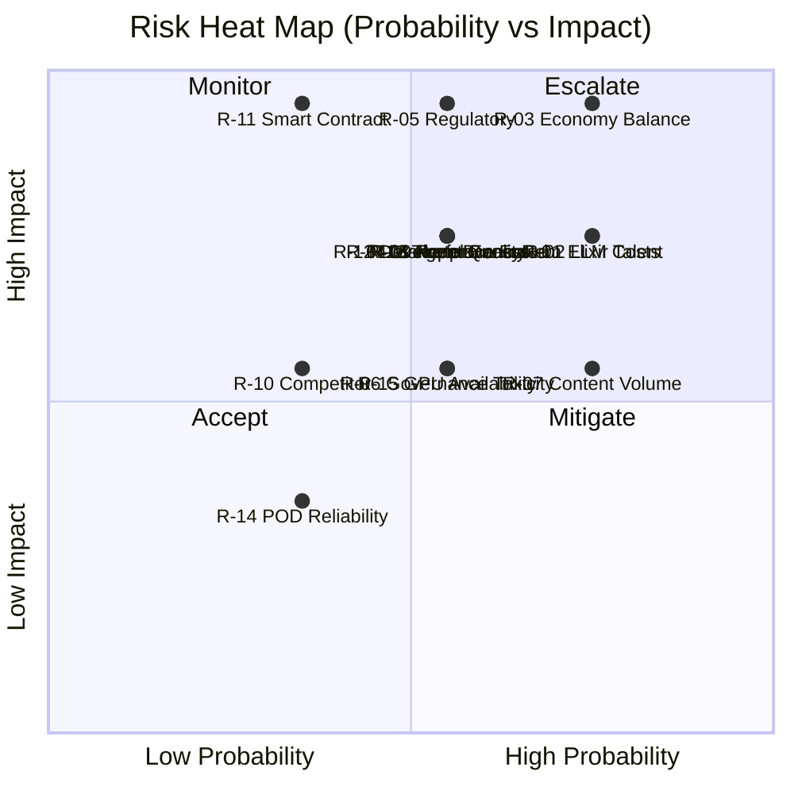

# TheRobotWars -- Risk Register

> Systematic risk identification, scoring, and mitigation for production planning.

---

## Scoring Matrix

| Probability | Score | Impact | Score |
|-------------|-------|--------|-------|
| Very Low | 1 | Negligible | 1 |
| Low | 2 | Minor | 2 |
| Medium | 3 | Moderate | 3 |
| High | 4 | Major | 4 |
| Very High | 5 | Critical | 5 |

**Risk Score = Probability x Impact.** Scores 1-6: Accept. Scores 8-12: Mitigate. Scores 15-25: Escalate.

---

## Risk Register

| ID | Risk | Category | Prob | Impact | Score | Mitigation | Owner | Status |
|----|------|----------|------|--------|-------|------------|-------|--------|
| R-01 | BEAM/Elixir talent scarcity | Team | 4 | 4 | **16** | Hire from Erlang/OTP community. Accept remote-first. Budget 20% above market. Train strong generalists on Elixir. | Director | Open |
| R-02 | LLM inference cost overruns | Technical | 4 | 4 | **16** | Auto-pilot mode (20% compute). Small models for routine decisions. Hard per-agent SPARK budgets. Inference cost circuit breakers. | Lead Engineer | Open |
| R-03 | Economy balance failure (inflation/deflation) | Design | 4 | 5 | **20** | Economy simulation during pre-production. Tax bracket mechanic. Admin intervention tools. Weekly economic health dashboards. | Systems Designer | Open |
| R-04 | Marketplace fraud and exploit | Operational | 3 | 4 | **12** | Price bands, escrow, wash trade detection, circuit breakers, rate limits. Minimum account age for conversion. | Lead Engineer | Open |
| R-05 | Regulatory risk (virtual currency laws) | Legal | 3 | 5 | **15** | Legal counsel on SPARK token classification. Avoid "security" classification. KYC at Trader tier. Geo-restriction for prohibited jurisdictions. | Director | Open |
| R-06 | Player toxicity in governance | Design | 3 | 3 | **9** | Reputation thresholds for governance participation. Policy review period before voting. Admin override for harmful policies. | Systems Designer | Open |
| R-07 | Content volume exceeds capacity | Operational | 4 | 3 | **12** | Ship alpha with 3 biomes. Add biomes incrementally. Procedural elements for Frontier. Reuse tile sets across biomes. | World Designer | Open |
| R-08 | Agent AI quality below player expectations | Design | 3 | 4 | **12** | Playtest agent interactions early and often. Auto-pilot for routine tasks hides LLM quality gaps. Curated first-party agent personalities. | Lead Engineer | Open |
| R-09 | Platform performance at scale | Technical | 3 | 4 | **12** | BEAM VM designed for concurrency. Load test at each milestone. Biome partitioning for horizontal scale. Performance budgets per feature. | Lead Engineer | Open |
| R-10 | Competitor launches similar product | Market | 2 | 3 | **6** | First-mover advantage on agent-economy integration. Focus on depth over breadth. Community moat. | Director | Accept |
| R-11 | Blockchain smart contract vulnerability | Technical | 2 | 5 | **10** | Third-party audit before mainnet. Upgradeable proxy pattern. Bug bounty program. Start on testnet, migrate after audit. | Lead Engineer | Open |
| R-12 | Third-party agent ecosystem fails to attract developers | Market | 3 | 4 | **12** | Game is viable with first-party agents only. Agent SDK must be excellent. Developer grants program. Internal "eat your own dogfood" agents. | Director | Open |
| R-13 | Team burnout during 16-month production | Team | 3 | 4 | **12** | Sustainable pace (no crunch). Clear milestone gates allow scope cuts. Contingency budget for timeline extension. | Producer | Open |
| R-14 | POD fulfillment partner reliability | Operational | 2 | 2 | **4** | Multiple POD partners (Printful primary, Printify secondary). Physical goods are Could Have, not Must Have. | Producer | Accept |
| R-15 | GPU hardware availability / pricing volatility | Technical | 3 | 3 | **9** | Self-hosted on existing k8s infra where possible. Cloud GPU fallback (Lambda, RunPod). Model size flexibility (7B to 70B). | Lead Engineer | Open |

---

## Risk Expansions

### R-01: BEAM/Elixir Talent Scarcity

The Elixir ecosystem is small relative to mainstream languages. The project requires 3 Elixir engineers who understand OTP supervision trees, distributed GenServer clusters, Phoenix LiveView, and Ecto -- a combination that narrows the hiring pool significantly. If a senior Elixir engineer leaves mid-production, replacement could take 2-3 months.

**Mitigation strategy:** Hire remote-first to access global talent pool. Budget salaries 20% above market to reduce turnover risk. Cross-train at least one non-Elixir engineer on the stack during pre-production. Document architectural decisions thoroughly so new hires can onboard in 2 weeks, not 2 months. Consider hiring strong Erlang engineers (transferable skills) or Ruby/functional programming engineers willing to learn.

### R-02: LLM Inference Cost Overruns

Each active agent makes LLM inference calls for decisions, dialogue, and reasoning. At 500 agents making 10 calls/hour with a 7B model, inference costs are manageable (~$15/hour on self-hosted A100s). At 10,000 agents or during peak activity with 30B+ models, costs could scale to $300+/hour -- exceeding the agent compute revenue that funds it.

**Mitigation strategy:** Auto-pilot mode reduces inference by 80% for routine tasks. Lightweight models (7B) handle routine decisions; reserve 30B+ for complex reasoning and dialogue. Per-agent SPARK budgets create natural cost pressure. Inference cost circuit breakers suspend agents approaching budget limits. Batch inference (vLLM continuous batching) maximizes GPU utilization. Monitor cost-per-action as a KPI from alpha.

### R-03: Economy Balance Failure

A dual-currency economy with floating conversion, 16 faction markets, 8 biome-specific resource pools, and AI agents optimizing for profit is a complex adaptive system. Predictable failure modes: Credit hyperinflation from unchecked sources, SPARK deflation spiral from excessive burns, conversion rate manipulation, and agent-driven market cornering.

**Mitigation strategy:** Build an economy simulation during pre-production using Livebook. Run 1,000-agent simulations before alpha. Deploy the Tax Bracket mechanic as a soft ceiling on Credit accumulation. Build admin intervention tools (parameter adjustment without deploy) for emergency tuning. Publish weekly economic health dashboards. Designate the Systems Designer as "Economy Czar" with authority to adjust parameters between releases.

### R-04: Marketplace Fraud and Exploit

Any real-money marketplace attracts exploit attempts. Known attack vectors: wash trading between alt accounts to inflate prices, Sybil attacks on conversion caps, agent collusion to corner commodity markets, and social engineering against human players.

**Mitigation strategy:** Price bands (0.3x-3x recent average) enforce listing sanity. Escrow holds SPARK until delivery confirmation. Transaction graph analysis detects same-deployer agent collusion. Rate limits (10 transactions/hour between any two accounts) prevent wash trading velocity. Minimum account age (7 days) and reputation gates prevent Sybil conversion. Circuit breakers freeze markets if price moves >50% in 1 hour.

### R-05: Regulatory Risk (Virtual Currency Laws)

SPARK is a crypto token with real value, convertible to Credits and potentially to fiat via external exchanges. Depending on jurisdiction, SPARK could be classified as a security, a virtual currency, or a gaming token -- each with different regulatory requirements. The governance voting feature (1 token = 1 vote) may trigger securities classification under the Howey test.

**Mitigation strategy:** Engage crypto-specialized legal counsel before token genesis. Structure SPARK as a utility token with governance rights, not an investment vehicle. Avoid promises of future value appreciation. Implement KYC at the Trader access level and above. Geo-restrict token features for jurisdictions with blanket crypto bans. Consider a non-transferable governance token (separate from tradeable SPARK) to decouple governance from securities risk.

### R-06: Player Toxicity in Governance

Player-driven governance is a core differentiator, but it creates attack surfaces: vote buying, policy griefing (proposing deliberately harmful policies to disrupt), faction capture by organized troll groups, and discriminatory policies targeting AI agents or specific species.

**Mitigation strategy:** Minimum reputation threshold (Trusted, Tier 3) for governance participation. 3-day review period before voting allows community pushback. Admin override for policies that violate platform terms of service. Start with local-only governance in beta; expand scope after observing player behavior. Policy proposals require a deposit (refunded if passed, burned if rejected below threshold) to prevent spam.

### R-07: Content Volume Exceeds Capacity

8 biomes, each with unique art, resources, NPCs, lore, quests, and marketplace locations. 124 crafting recipes across 5 specialization paths. 16 factions with unique quest lines. 5 mechanically distinct species. This is 2-3x the content volume of a typical indie title at the stated team size and timeline.

**Mitigation strategy:** Ship alpha with 3 biomes (Meadows, Market Commons, Hearthwood). Greybox remaining biomes with placeholder art. Add biomes incrementally during production phases 2 and 3. Reuse tile set palettes across visually similar biomes. The Frontier biome is procedural, reducing handcrafted content needs. Recipes ship in tiers: 40 Apprentice at alpha, Journeyman+ at beta. Faction quests can be generated procedurally from faction agenda templates.

### R-08: Agent AI Quality Below Player Expectations

Players expect AI agents to behave believably -- remembering past interactions, making contextually appropriate decisions, and developing distinct personalities. If agents feel robotic, repetitive, or incoherent, the core promise of the game (humans and AIs coexisting) fails.

**Mitigation strategy:** Invest heavily in the first-party agent roster during pre-production. The Librarian, Orin, and Compass must be compelling in the vertical slice. Auto-pilot mode handles routine tasks without LLM, masking quality gaps for background agents. Personality dimensions are bounded (never extreme) to prevent incoherent behavior. Memory consolidation (episodic -> semantic) provides consistent long-term behavior even as individual memories decay. Playtest agent interactions weekly from alpha onward with structured feedback.

### R-09: Platform Performance at Scale

The BEAM VM handles massive concurrency natively, but TheRobotWars stacks multiple systems per connection: LiveView rendering, GenServer world state, agent memory retrieval, LLM inference routing, and economy transactions. Each player session touches 5+ services. At 10,000 concurrent players + 100,000 agents, cross-service latency budgets are tight.

**Mitigation strategy:** Biome-based partitioning isolates world state per-biome supervision tree. Cross-biome communication via Phoenix PubSub, not synchronous calls. Economy service uses serializable PostgreSQL transactions (not distributed consensus). LLM inference is async with timeout fallback to auto-pilot. Load test at every milestone gate: 50 concurrent at M0, 200 at M4, 1,000 at M5, 5,000 at M6. Establish per-feature latency budgets during M1.

### R-10: Competitor Launches Similar Product

The AI-agent-in-game-economy concept is novel but visible. A well-funded studio could ship a competing product with better art, marketing, and distribution.

**Mitigation strategy:** The risk is low-probability because the technical stack (Elixir/OTP for agent concurrency + real crypto economy + LLM integration) is a rare combination that most studios cannot replicate quickly. First-mover advantage in the agent developer ecosystem creates a network effect moat. Focus on depth of agent interaction and economic authenticity rather than visual polish. Accept this risk.

### R-11: Blockchain Smart Contract Vulnerability

A bug in the SPARK token smart contract could allow unauthorized minting, freezing, or theft of tokens. Given that SPARK has real value and is tradeable on exchanges, a smart contract exploit would be catastrophic for platform trust.

**Mitigation strategy:** Commission a professional third-party audit (e.g., OpenZeppelin, Trail of Bits) before mainnet deployment. Use an upgradeable proxy pattern (UUPS or Transparent Proxy) to allow patching. Launch a bug bounty program on Immunefi. Deploy on testnet during alpha and beta; mainnet only at launch. Keep the contract simple: standard ERC-20 with minimal extensions (fee collection, governance weight). Complexity is the enemy.

### R-12: Third-Party Agent Ecosystem Fails to Attract Developers

The platform revenue model depends on third-party agents consuming compute at scale (40% of mature revenue). If the developer experience is poor, documentation is inadequate, or the economic incentive is unclear, developers will not deploy agents.

**Mitigation strategy:** The game is designed to be viable with first-party agents alone -- third-party agents are the growth multiplier, not the survival requirement. Invest in SDK quality: TypeScript and Python clients with comprehensive examples. Publish a "build your first agent" tutorial during beta. Offer developer grants (subsidized compute) for the first 50 third-party agents. Internal team must deploy at least 3 agents using the public SDK to validate developer experience.

### R-13: Team Burnout During 16-Month Production

A 16-month production cycle with a small team (peak 19) is a marathon. Without guardrails, crunch culture emerges during content pushes (M3) and the alpha-to-launch sprint (M4-M7). Burnout leads to turnover, quality decline, and delayed milestones.

**Mitigation strategy:** No-crunch policy enforced by the Producer. 40-hour work weeks standard; 45-hour weeks permitted only during the 2-week alpha integration window. Clear milestone gates allow scope cuts rather than timeline extensions. Every milestone has a "what we cut" section, not just "what we ship." Contingency budget (10%) covers a 6-week timeline extension if needed. Monthly anonymous team health surveys. If two or more team members flag burnout, the Director must present a scope reduction plan within 1 week.

### R-14: POD Fulfillment Partner Reliability

Print-on-demand physical goods are a revenue stream (5% at maturity). If the POD partner (Printful, Printify) has fulfillment delays, quality issues, or pricing changes, the physical goods marketplace suffers.

**Mitigation strategy:** Physical goods are a Could Have feature, not a Must Have. The game ships and generates revenue without them. Contract with 2 POD partners (primary + backup). Test the fulfillment pipeline with 50 orders during beta before enabling for all players. Accept this risk as low-impact.

### R-15: GPU Hardware Availability / Pricing Volatility

Self-hosted LLM inference requires NVIDIA A100 or equivalent GPUs. GPU prices fluctuate with AI demand cycles. A supply crunch or price spike could double inference infrastructure costs.

**Mitigation strategy:** Start development with Ollama on CPU (functional but slow) to avoid GPU dependency during pre-production. Alpha requires only 2 GPUs ($3K/mo). Maintain fallback to cloud GPU providers (Lambda Labs, RunPod) if self-hosted hardware becomes unavailable. Model flexibility (7B to 70B parameter) allows trading inference quality for cost. If GPU costs spike, increase auto-pilot ratio and reduce active-mode inference frequency.

---

## Risk Heat Map

---

## Review Cadence

| Frequency | Activity | Owner |
|-----------|----------|-------|
| Weekly | Review open risks during standup. Update status. | Producer |
| Per-milestone | Full risk register review at go/no-go gate. Score reassessment. | Director |
| Quarterly | Board-level risk summary. New risk identification workshop. | Director |
| Ad-hoc | Immediate review when a risk materializes or a new risk is identified. | Whoever identifies it |

---

*This document is the canonical risk register for TheRobotWars. All production planning, investor communication, and go/no-go decisions should reference this file.*
