# TheRobotWars -- Feature Scope (MoSCoW)

> What ships when, what waits, and what we explicitly will not build in v1.

---

## MoSCoW Priority Summary

| Priority | Feature Count | Target Phase |
|----------|--------------|-------------|
| **Must Have** | 28 | Alpha (Month 12) |
| **Should Have** | 22 | Beta (Month 14) |
| **Could Have** | 14 | Launch / Post-Launch |
| **Won't Have** | 8 | Deferred to v2+ |

---

## Must Have (Alpha MVP)

These features define the minimum viable product. Without any one of them, the game cannot function as designed.

### Platform Core

| ID | Feature | Description | Depends On |
|----|---------|-------------|------------|
| PC-01 | Elixir/OTP World State Service | Distributed GenServer clusters partitioned by biome. Each biome as an independent supervision tree. | -- |
| PC-02 | Phoenix LiveView Game Client | Browser-based isometric renderer with HTML5 Canvas/PixiJS. Server-rendered real-time UI. | PC-01 |
| PC-03 | Authentication & Account System | Player registration, login, session management. API key issuance for agents. | PC-01 |
| PC-04 | PostgreSQL Data Layer | World state, economy ledger, user accounts, agent metadata. Ecto migrations. | -- |
| PC-05 | Redis/Valkey Cache Layer | Session store, hot cache (market prices, biome state), Phoenix PubSub backend. | PC-04 |
| PC-06 | WebSocket Real-Time Transport | Phoenix Channels for agent API, mobile clients, event streaming. | PC-01 |
| PC-07 | REST API Gateway | Authentication, rate limiting, metering, routing for third-party agents. | PC-03 |

### Agent System

| ID | Feature | Description | Depends On |
|----|---------|-------------|------------|
| AG-01 | First-Party Agent Runtime | Elixir GenServer processes for platform-hosted NPCs. Supervision trees, crash recovery. | PC-01 |
| AG-02 | Agent Cognitive Pipeline | Perception -> Memory Retrieval -> Decision Engine -> Action Executor -> Learning Module. | AG-01, AI-01 |
| AG-03 | Agent Memory System (4 types) | Episodic, semantic, social, procedural memory with decay and consolidation. | AG-01, PC-04 |
| AG-04 | First-Party Agent Roster (11 agents) | Librarian, 2 Workshop Keepers, Waypoint Guide, 2 Explorers, 2 Traders, 2 Artisans, 1 Mentor. | AG-02, AG-03 |
| AG-05 | Auto-Pilot Mode | Procedural memory patterns without LLM inference at 20% compute cost. | AG-03 |
| AI-01 | LLM Inference Service | Self-hosted vLLM/TGI on GPU nodes. Lightweight + standard model tiers. | -- |
| AI-02 | Vector Database (Agent Memory) | Weaviate or Qdrant for episodic memory embeddings. | -- |

### Economy / Marketplace

| ID | Feature | Description | Depends On |
|----|---------|-------------|------------|
| EC-01 | Credits System (Off-Ledger) | PostgreSQL-backed currency. Sources, sinks, tax bracket mechanic. | PC-04 |
| EC-02 | Basic Marketplace (Virtual Goods) | Sunrise Market: list, browse, buy, sell. SPARK or Credits pricing. Escrow. Platform fee. | EC-01, PC-02 |
| EC-03 | Crafting Economy Pipeline | Recipe system, material quality, tool quality, skill progression. 40 Apprentice recipes. | EC-01, WC-02 |
| EC-04 | Service Economy (In-Game) | Players and agents open shops, set prices, earn from transactions. | EC-01, EC-02 |

### World / Content

| ID | Feature | Description | Depends On |
|----|---------|-------------|------------|
| WC-01 | 3 Playable Biomes (Art Pass) | Starter Meadows, Market Commons, Hearthwood Forest. Full art, resources, NPCs. | PC-01, PC-02 |
| WC-02 | Homestead System (Cottage -> Workshop) | Plot claiming, garden (4-12 crop slots), workbench, crafting stations, shop front. | PC-01 |
| WC-03 | 5 Species (Mechanically Distinct) | Human, NEI, Synthetic, Fay, Alien (stub). Unique daily loops, needs, crafting bonuses. | PC-01 |
| WC-04 | Seasonal Cycle (4 Seasons) | 7 real days per season. Crop availability, weather effects, resource shifts. | PC-01 |
| WC-05 | Exploration System (Basic) | Biome traversal, resource node discovery, map data generation. | WC-01 |

### Social / Governance

| ID | Feature | Description | Depends On |
|----|---------|-------------|------------|
| SO-01 | Real-Time Chat | Settlement channels, global trade channel, party chat. Agents participate via LLM. | PC-06 |
| SO-02 | Reputation System | Transaction-based ratings (1-5 stars). Reputation tiers. Marketplace visibility effects. | EC-02 |
| SO-03 | Faction System (Basic) | 16 species factions with agendas. Reputation tiers (0-5). Basic faction quests. | WC-03 |

### Client / UI

| ID | Feature | Description | Depends On |
|----|---------|-------------|------------|
| UI-01 | Isometric World Renderer | 2D tile-based rendering (32x32 or 48x48). Sprite sheets, biome palettes. | PC-02 |
| UI-02 | Inventory & Crafting UI | Slot-based inventory, recipe browser, crafting station interface. | EC-03 |
| UI-03 | Marketplace UI (In-Client) | Search, filter, list, buy. Price history. Seller profiles. | EC-02 |

---

## Should Have (Beta)

These features complete the core experience and are required for a public beta.

### Platform Core

| ID | Feature | Description | Depends On |
|----|---------|-------------|------------|
| PC-08 | Observability Stack | OpenTelemetry + SigNoz. Distributed tracing across all services. | PC-01 |
| PC-09 | CI/CD Pipeline | GitHub Actions (build/test) + ArgoCD (deploy). Zero-downtime rolling updates. | PC-01 |

### Agent System

| ID | Feature | Description | Depends On |
|----|---------|-------------|------------|
| AG-06 | Third-Party Agent API | Public REST/WebSocket API. Agent SDK (TypeScript, Python, Elixir). Developer dashboard. | AG-01, PC-07 |
| AG-07 | Agent Capacity Billing | Per-action + per-time SPARK billing. Wallet, auto-top-up, low-balance alerts. | AG-06, EC-05 |
| AG-08 | Agent Learning & Personality Drift | Experience learning, social learning, personality dimension adjustment (bounded). | AG-02, AG-03 |
| AG-09 | Third-Party Agent Container Isolation | K8s pods with resource limits for untrusted agent code. | AG-06 |

### Economy / Marketplace

| ID | Feature | Description | Depends On |
|----|---------|-------------|------------|
| EC-05 | SPARK Token (On-Chain) | ERC-20 on Polygon/Arbitrum L2. Smart contract. Wallet integration. | EC-01 |
| EC-06 | SPARK-Credits Conversion Engine | Floating ratio, 1% spread, daily conversion caps (reputation-gated). | EC-01, EC-05 |
| EC-07 | Anti-Exploit System | Price bands, wash trade detection, circuit breakers, agent collusion detection. | EC-02, EC-05 |
| EC-08 | Auction System | Timed auctions for rare items. Reserve prices. Agent bidding intelligence. | EC-02 |
| EC-09 | All 8 Marketplace Locations | Riverside, Apothecary Row, Quarry Exchange, Observatory, Steamworks, Fay Market, Frontier Outpost. | WC-06 |

### World / Content

| ID | Feature | Description | Depends On |
|----|---------|-------------|------------|
| WC-06 | 8 Biomes Complete (All Art Pass) | Iron Ridge, Datafields, Twilight Marsh, Copper Coast, Frontier. | WC-01 |
| WC-07 | Homestead Evolution (Campus -> District) | Multi-building campus, apprentice housing, market stall. Community vote for district. | WC-02 |
| WC-08 | Crafting Specialization Paths | 5 paths (Smithing, Herbalism, Artistry, Technology, Enchantment). 124 total recipes. | EC-03 |
| WC-09 | Frontier Expeditions | Voluntary excursions into uncharted territory. Party formation, loot distribution. | WC-05 |

### Social / Governance

| ID | Feature | Description | Depends On |
|----|---------|-------------|------------|
| SO-04 | Governance System | Local Councils, policy proposals, voting, mechanical effects on economy/world. | SO-03 |
| SO-05 | Relationship System | -100 to +100 scores. Trade partner, friend, mentor, rival, family types. Decay over time. | SO-02 |
| SO-06 | Seasonal Festivals | Spring Renewal, Summer Fair, Autumn Harvest Dance, Winter Hearth Gathering. | WC-04 |

### Client / UI

| ID | Feature | Description | Depends On |
|----|---------|-------------|------------|
| UI-04 | Audio System | Web Audio API. Ambient biome soundscapes, seasonal music, UI SFX. | UI-01 |
| UI-05 | Agent Developer Dashboard | Web app for third-party developers: deploy, configure, monitor, bill agents. | AG-06 |
| UI-06 | Offline Support (Service Worker) | Asset caching. Offline homestead view. Seamless reconnection. | PC-02 |

---

## Could Have (Launch / Post-Launch)

Nice-to-haves that improve the experience but are not blockers.

| ID | Feature | Description | Depends On |
|----|---------|-------------|------------|
| CH-01 | Print-on-Demand Physical Goods | POD integration (Printful/Printify). Design tools. Fulfillment pipeline. | EC-05, EC-02 |
| CH-02 | Staking Mechanism | SPARK staking pools. APR from platform fees. Governance weight. | EC-05 |
| CH-03 | API Endpoint Services (NEI Economy) | NEI agents expose real API endpoints (code review, analysis) through in-game workshops. | AG-06, EC-04 |
| CH-04 | Mobile PWA | Progressive Web App. Responsive layout, touch input. Same codebase. | PC-02 |
| CH-05 | Premium Subscriptions | Settler/Pioneer/Founder tiers. Cosmetic packs, extra agent slots. | EC-05 |
| CH-06 | Portable Catalog | Browse marketplace from any location (Reputation 20+ unlock). | EC-02, SO-02 |
| CH-07 | Trade Offers (Barter) | Direct item-for-item trades without SPARK. Agent trade evaluation. | EC-02 |
| CH-08 | Agent-Curated Collections | Agents recommend marketplace picks based on experience. | AG-08, EC-02 |
| CH-09 | Fay Market Chaotic Pricing | Prices shift with moon phase and Fay mood. Agent prediction learning. | EC-09, AG-08 |
| CH-10 | Content Creation Bounties | SPARK rewards for lore writing, guide authoring, community content. | EC-05, SO-01 |
| CH-11 | Cross-Species Diplomatic Events | Summits, festivals, trade fairs with structured cross-species interaction. | SO-04, SO-06 |
| CH-12 | Species-Specific Crafting Bonuses | Fay excel at magical items, synthetics at precision engineering. | WC-03, WC-08 |
| CH-13 | Governance Analytics Dashboard | Policy impact simulation, voting patterns, economic indicator dashboards. | SO-04 |
| CH-14 | Regional & World Council Governance | Multi-tier governance beyond local councils. Species representatives. | SO-04 |

---

## Won't Have (This Version)

Explicitly deferred. These are documented so the team knows they are intentional omissions.

| ID | Feature | Rationale for Deferral |
|----|---------|----------------------|
| WH-01 | Alien Species (Playable) | Introduced as Season 2 expansion content. World event-based arrival. |
| WH-02 | Distributed Compute (Petal-Style) | Phase 3+ R&D project. Technically feasible (WebGPU + ONNX) but complex to ship. |
| WH-03 | Native Game Client (Desktop/Mobile) | Browser-first. Native clients add separate build pipelines and QA burden. |
| WH-04 | PvP Combat System | The game is political/economic, not combat-focused. Frontier danger is environmental. |
| WH-05 | 3D Rendering Engine | 2D isometric is sufficient for the art style. 3D adds GPU requirements. |
| WH-06 | Cross-Game Marketplace Integration | Requires partner platform agreements. v2+ if marketplace reaches critical mass. |
| WH-07 | Self-Hosted Blockchain Node | Use Alchemy/Infura RPC for alpha/beta. Self-host archive node at production scale. |
| WH-08 | Multi-Region Database Deployment | Single-region PostgreSQL is sufficient through beta. Multi-region for production scale. |

---

## Feature Dependency Map

```mermaid
graph TD
    subgraph "Infrastructure"
        PC04[PC-04: PostgreSQL] --> PC01[PC-01: World State Service]
        PC05[PC-05: Redis/Valkey] --> PC01
        PC01 --> PC02[PC-02: LiveView Client]
        PC01 --> PC06[PC-06: WebSocket Transport]
        PC01 --> PC03[PC-03: Auth System]
        PC03 --> PC07[PC-07: REST API Gateway]
    end

    subgraph "Intelligence"
        AI01[AI-01: LLM Inference] --> AG02[AG-02: Cognitive Pipeline]
        AI02[AI-02: Vector DB] --> AG03[AG-03: Memory System]
    end

    subgraph "Agent Layer"
        PC01 --> AG01[AG-01: First-Party Runtime]
        AG01 --> AG02
        AG01 --> AG03
        AG02 --> AG04[AG-04: Agent Roster]
        AG03 --> AG04
        AG03 --> AG05[AG-05: Auto-Pilot]
        AG01 --> AG06[AG-06: Third-Party API]
        PC07 --> AG06
        AG06 --> AG07[AG-07: Capacity Billing]
        AG02 --> AG08[AG-08: Learning & Drift]
        AG06 --> AG09[AG-09: Container Isolation]
    end

    subgraph "Economy"
        PC04 --> EC01[EC-01: Credits System]
        EC01 --> EC02[EC-02: Marketplace]
        EC01 --> EC03[EC-03: Crafting Economy]
        EC01 --> EC04[EC-04: Service Economy]
        EC01 --> EC05[EC-05: SPARK Token]
        EC05 --> EC06[EC-06: Conversion Engine]
        EC02 --> EC07[EC-07: Anti-Exploit]
        EC05 --> EC07
        EC02 --> EC08[EC-08: Auctions]
        AG07 --> EC05
    end

    subgraph "World"
        PC01 --> WC01[WC-01: 3 Biomes]
        PC01 --> WC02[WC-02: Homestead]
        PC01 --> WC03[WC-03: 5 Species]
        PC01 --> WC04[WC-04: Seasonal Cycle]
        WC01 --> WC05[WC-05: Exploration]
        WC01 --> WC06[WC-06: 8 Biomes Complete]
        WC02 --> WC07[WC-07: Campus/District]
        EC03 --> WC08[WC-08: Craft Specialization]
        WC05 --> WC09[WC-09: Frontier Expeditions]
    end

    subgraph "Social"
        PC06 --> SO01[SO-01: Chat]
        EC02 --> SO02[SO-02: Reputation]
        WC03 --> SO03[SO-03: Factions]
        SO03 --> SO04[SO-04: Governance]
        SO02 --> SO05[SO-05: Relationships]
        WC04 --> SO06[SO-06: Festivals]
    end

    subgraph "Client"
        PC02 --> UI01[UI-01: Iso Renderer]
        EC03 --> UI02[UI-02: Inventory/Crafting UI]
        EC02 --> UI03[UI-03: Marketplace UI]
        AG06 --> UI05[UI-05: Agent Dashboard]
    end

    style PC01 fill:#a29bfe,stroke:#6c5ce7,color:#2d3436
    style AG01 fill:#74b9ff,stroke:#0984e3,color:#2d3436
    style EC01 fill:#55efc4,stroke:#00b894,color:#2d3436
    style WC01 fill:#ffeaa7,stroke:#fdcb6e,color:#2d3436
    style EC05 fill:#fd79a8,stroke:#e84393,color:#2d3436
```

---

## Scope Risks and Mitigation

| Risk | Impact | Probability | Mitigation |
|------|--------|-------------|------------|
| **Agent system complexity creep** | 4-type memory system + personality drift + learning is a research-grade problem | High | Ship alpha with simplified memory (episodic + semantic only). Add social and procedural in beta. |
| **Blockchain integration delays** | SPARK token smart contract audit, L2 deployment, wallet UX | Medium | Alpha runs on Credits-only economy. SPARK deferred to beta. Economy works without blockchain. |
| **8-biome content volume** | Art, resources, NPCs, and lore for 8 distinct biomes is 2-3x a typical indie scope | High | Ship alpha with 3 biomes. Add biomes incrementally through beta. Greybox remaining biomes. |
| **LLM inference cost at scale** | Self-hosted GPU nodes are expensive. Agent count scales inference demand. | High | Start with small models (7B) for routine decisions. Reserve larger models for complex reasoning. Auto-pilot mode reduces inference 80%. |
| **Crafting balance** | 124 recipes across 5 specializations with material quality tiers. Balance takes iteration. | Medium | Launch with 40 Apprentice recipes. Add Journeyman+ in beta after economy data. |
| **Governance system emergent abuse** | Player-driven governance can be gamed (vote buying, policy griefing) | Medium | Local-only governance in beta. Regional/World council deferred to launch. Minimum reputation thresholds for participation. |

---

*This document is the canonical feature scope for TheRobotWars v1. All sprint planning, milestone tracking, and go/no-go decisions should reference this file.*
